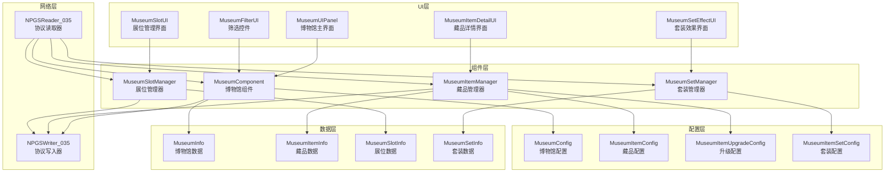
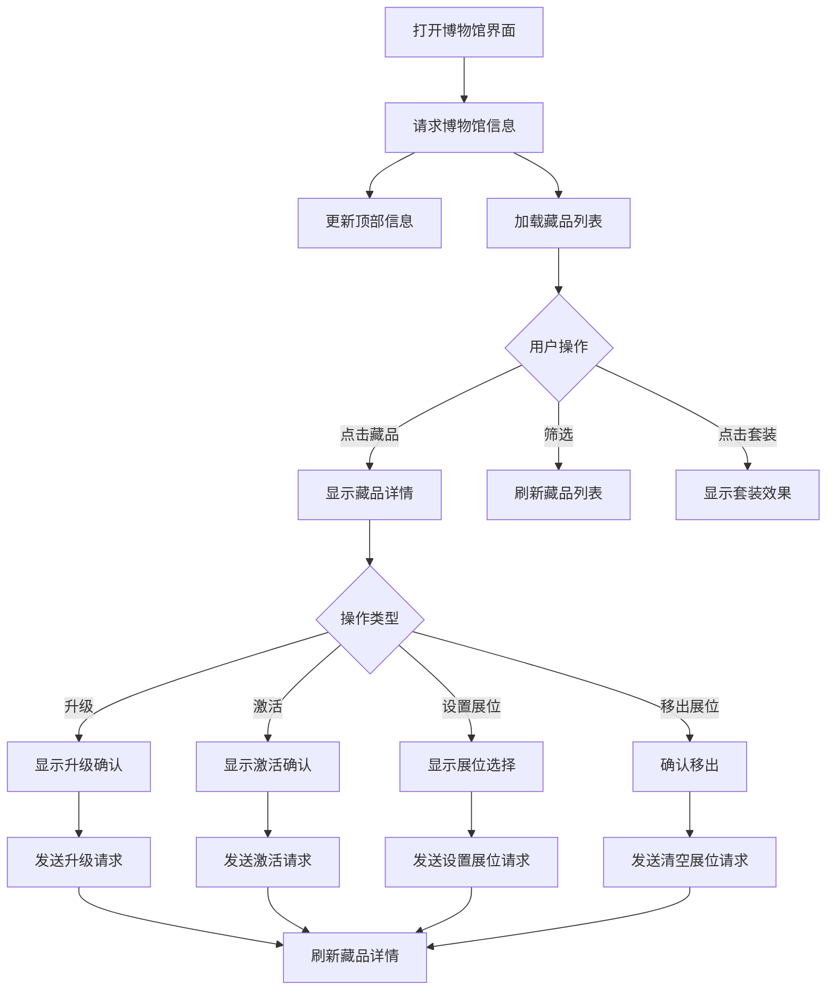

# 博物馆系统 - 客户端开发文档

**模块名称**: Museum（博物馆系统）
**模块编号**: p035
**文档版本**: 2.0
**更新日期**: 2026-04-11

---

## 一、架构概览



---

## 二、文件结构

```
game_client/Assets/Scripts/
├── GameComponent/
│   └── Museum/
│       ├── MuseumComponent.cs          # 博物馆主组件
│       ├── MuseumItemManager.cs        # 藏品管理器
│       ├── MuseumSlotManager.cs        # 展位管理器
│       ├── MuseumSetManager.cs         # 套装管理器
│       ├── MuseumInfo.cs               # 博物馆信息类
│       ├── MuseumItemInfo.cs           # 藏品信息类
│       ├── MuseumSlotInfo.cs           # 展位信息类
│       ├── MuseumSetInfo.cs            # 套装信息类
│       └── MuseumHelper.cs             # 辅助工具类
│
├── ResScripts/NPSO/GSO/Museum/
│   ├── MuseumConfig.cs                 # 博物馆配置
│   ├── MuseumItemConfig.cs             # 藏品配置
│   ├── MuseumItemUpgradeConfig.cs      # 升级配置
│   ├── MuseumItemActiveConfig.cs       # 激活配置
│   ├── MuseumSlotConfig.cs             # 展位配置
│   ├── MuseumItemFragmentConfig.cs     # 碎片配置
│   └── MuseumItemSetConfig.cs          # 套装配置
│
├── UI/
│   └── Museum/
│       ├── MuseumUIPanel.cs            # 博物馆主界面
│       ├── MuseumItemDetailUI.cs       # 藏品详情界面
│       ├── MuseumItemCardUI.cs         # 藏品卡片控件
│       ├── MuseumSlotUI.cs             # 展位控件
│       ├── MuseumFilterUI.cs           # 筛选控件
│       ├── MuseumSetEffectUI.cs        # 套装效果界面
│       ├── MuseumUpgradeUI.cs          # 升级弹窗
│       ├── MuseumActiveUI.cs           # 激活弹窗
│       └── MuseumComposeUI.cs          # 合成弹窗
│
└── NPGS/
    ├── NPGSWriter_035_MuseumOp.cs      # 协议写入器
    └── NPGSReader_035_MuseumOp.cs      # 协议读取器
```

---

## 三、核心类设计

### 3.1 类图

```mermaid
classDiagram
    class MuseumComponent {
        -Dictionary~int, MuseumInfo~ m_museumDic
        -MuseumItemManager m_itemMgr
        -MuseumSlotManager m_slotMgr
        -MuseumSetManager m_setMgr
        +Instance: MuseumComponent
        +reqMuseumInfo(museumId, callback)
        +reqUpgrade(itemId, count, callback)
        +reqActive(itemId, callback)
        +reqSetSlot(slotIdx, itemId, callback)
        +reqCompose(fragmentId, count, callback)
        +reqDecompose(itemId, count, callback)
        +getMuseumInfo(museumId)
        +getTotalAttribute()
        +getItem(itemId)
        +getItemList(type, rarity, activeStatus)
        +getSlot(slotIdx)
        +getSlots()
        +getSetActiveEffect(setId)
    end

    class MuseumItemManager {
        -Dictionary~int, MuseumItemInfo~ m_itemDic
        +getItem(itemId)
        +getItemList(type, rarity, activeStatus)
        +getActiveItems()
        +getItemsBySet(setId)
        +calculateItemAttr(item)
        +onItemAdd(msg)
        +onItemChg(msg)
        +onItemDel(msg)
    end

    class MuseumSlotManager {
        -Dictionary~int, MuseumSlotInfo~ m_slotDic
        +getSlot(slotIdx)
        +getUsedSlots()
        +getEmptySlots()
        +getSlotByItem(itemId)
        +onSlotChg(msg)
    end

    class MuseumSetManager {
        -Dictionary~int, MuseumSetInfo~ m_setDic
        -Dictionary~int, List~int~~ m_itemToSetMap
        +getSetInfo(setId)
        +getActiveSets()
        +calculateSetEffect(setId)
        +onItemActive(itemId)
        +onItemDeactive(itemId)
    end

    class MuseumInfo {
        +int museumId
        +int maxSlot
        +long unlockTime
        +int collectCount
        +int totalCount
        +int activeCount
        +long displayIncome
        +string setName
    end

    class MuseumItemInfo {
        +int itemId
        +int level
        +bool isActive
        +int activeStage
        +long unlockTime
        +int slotIndex
        +int fragment
        +Dictionary~int,long~ attrs
        +string setName
        +calculateAttr()
        +canUpgrade()
        +canActivate()
        +getUpgradeCost()
        +getActivateCost()
        +getNextAttr()
    end

    class MuseumSlotInfo {
        +int slotIndex
        +int itemId
        +bool isLocked
        +long displayTime
        +long displayIncome
        +int slotType
        +getDisplayDuration()
        +canSetItem()
    end

    class MuseumSetInfo {
        +int setId
        +string setName
        +List~int~ itemIds
        +Dictionary~int,Dictionary~int,long~~ effects
        +int activeCount
        +getActiveEffects()
        +isItemInSet(itemId)
    end

    MuseumComponent --> MuseumItemManager
    MuseumComponent --> MuseumSlotManager
    MuseumComponent --> MuseumSetManager
    MuseumComponent --> MuseumInfo
    MuseumItemManager --> MuseumItemInfo
    MuseumSlotManager --> MuseumSlotInfo
    MuseumSetManager --> MuseumSetInfo
    MuseumItemInfo --> MuseumSetInfo
```

---

## 四、核心代码实现

### 4.1 MuseumComponent.cs

```csharp
using System;
using System.Collections.Generic;
using UnityEngine;

namespace GameComponent.Museum
{
    /// <summary>
    /// 博物馆组件 - 管理玩家博物馆数据
    /// </summary>
    public class MuseumComponent : _ANPBasicPlayerComponent
    {
        #region 单例

        private static MuseumComponent _instance;
        public static MuseumComponent Instance => _instance;

        #endregion

        #region 数据成员

        private Dictionary<int, MuseumInfo> _museumDic = new Dictionary<int, MuseumInfo>();
        private MuseumItemManager _itemMgr;
        private MuseumSlotManager _slotMgr;
        private MuseumSetManager _setMgr;

        // 缓存
        private Dictionary<int, long> _totalAttrCache;
        private bool _attrCacheDirty = true;

        #endregion

        #region 初始化

        public override void init()
        {
            base.init();
            _instance = this;

            _itemMgr = new MuseumItemManager();
            _slotMgr = new MuseumSlotManager();
            _setMgr = new MuseumSetManager();

            // 注册协议监听
            RegisterProtocolListeners();

            // 注册事件监听
            RegisterEventListeners();
        }

        private void RegisterProtocolListeners()
        {
            NPGSClientListener.addListener<GS2GC_035_050_OnMuseumInfo>(OnMuseumInfo);
            NPGSClientListener.addListener<GS2GC_035_051_OnMuseumItemAdd>(OnMuseumItemAdd);
            NPGSClientListener.addListener<GS2GC_035_052_OnMuseumItemChg>(OnMuseumItemChg);
            NPGSClientListener.addListener<GS2GC_035_053_OnMuseumItemDel>(OnMuseumItemDel);
            NPGSClientListener.addListener<GS2GC_035_054_OnMuseumSlotChg>(OnMuseumSlotChg);
            NPGSClientListener.addListener<GS2GC_035_055_OnMuseumAttrChg>(OnMuseumAttrChg);
            NPGSClientListener.addListener<GS2GC_035_056_OnMuseumSetEffect>(OnMuseumSetEffect);
        }

        private void RegisterEventListeners()
        {
            EventManager.AddListener(EventID.ResourceUpdate, OnResourceUpdate);
        }

        public override void dispose()
        {
            EventManager.RemoveListener(EventID.ResourceUpdate, OnResourceUpdate);
            base.dispose();
        }

        #endregion

        #region 公开方法 - 请求

        /// <summary>
        /// 请求博物馆信息
        /// </summary>
        public void ReqMuseumInfo(int museumId, Action<MuseumInfo> callback)
        {
            NPGSClientListener.sendRequest(
                NPGSWriter_035_MuseumOp.make_001_ReqMuseumInfo(museumId),
                new CommonErrCodeRequestCallbackProtocolDealer<GS2GC_035_050_OnMuseumInfo>((msg) =>
                {
                    var info = ParseMuseumInfo(msg.museum_info);
                    _museumDic[info.museumId] = info;

                    // 更新套装效果
                    if (msg.active_set_effects != null)
                    {
                        foreach (var setEffect in msg.active_set_effects)
                        {
                            _setMgr.UpdateSetEffect(setEffect);
                        }
                    }

                    callback?.Invoke(info);
                }));
        }

        /// <summary>
        /// 请求升级藏品
        /// </summary>
        public void ReqUpgrade(int itemId, int upgradeCount = 1, bool useProtect = false, Action<bool> callback = null)
        {
            NPGSClientListener.sendRequest(
                NPGSWriter_035_MuseumOp.make_003_ReqMuseumItemUpgrade(itemId, upgradeCount, false, useProtect),
                new CommonErrCodeRequestCallbackProtocolDealer<GS2GC_035_052_OnMuseumItemChg>((msg) =>
                {
                    _itemMgr.UpdateItemFromMsg(msg);
                    _attrCacheDirty = true;
                    callback?.Invoke(true);
                },
                (errCode) =>
                {
                    callback?.Invoke(false);
                    HandleUpgradeError(errCode, itemId);
                }));
        }

        /// <summary>
        /// 请求激活藏品
        /// </summary>
        public void ReqActive(int itemId, int activeStage = 0, Action<bool> callback = null)
        {
            NPGSClientListener.sendRequest(
                NPGSWriter_035_MuseumOp.make_004_ReqMuseumItemActive(itemId, activeStage),
                new CommonErrCodeRequestCallbackProtocolDealer<GS2GC_035_052_OnMuseumItemChg>((msg) =>
                {
                    _itemMgr.UpdateItemFromMsg(msg);
                    _setMgr.OnItemActive(itemId);
                    _attrCacheDirty = true;
                    callback?.Invoke(true);
                },
                (errCode) =>
                {
                    callback?.Invoke(false);
                    HandleActiveError(errCode, itemId);
                }));
        }

        /// <summary>
        /// 请求设置展位
        /// </summary>
        public void ReqSetSlot(int slotIndex, int itemId, Action<bool> callback = null)
        {
            NPGSClientListener.sendRequest(
                NPGSWriter_035_MuseumOp.make_005_ReqMuseumSlotSet(slotIndex, itemId),
                new CommonErrCodeRequestCallbackProtocolDealer<GS2GC_035_054_OnMuseumSlotChg>((msg) =>
                {
                    _slotMgr.UpdateSlotFromMsg(msg.slot_info);
                    callback?.Invoke(true);
                },
                (errCode) =>
                {
                    callback?.Invoke(false);
                    HandleSlotError(errCode, slotIndex);
                }));
        }

        /// <summary>
        /// 请求清空展位
        /// </summary>
        public void ReqClearSlot(int slotIndex, Action<bool> callback = null)
        {
            NPGSClientListener.sendRequest(
                NPGSWriter_035_MuseumOp.make_006_ReqMuseumSlotClear(slotIndex),
                new CommonErrCodeRequestCallbackProtocolDealer<GS2GC_035_054_OnMuseumSlotChg>((msg) =>
                {
                    _slotMgr.UpdateSlotFromMsg(msg.slot_info);
                    callback?.Invoke(true);
                }));
        }

        /// <summary>
        /// 请求合成藏品
        /// </summary>
        public void ReqCompose(int fragmentId, int count, Action<bool> callback = null)
        {
            NPGSClientListener.sendRequest(
                NPGSWriter_035_MuseumOp.make_007_ReqMuseumItemCompose(fragmentId, count),
                new CommonErrCodeRequestCallbackProtocolDealer<GS2GC_035_051_OnMuseumItemAdd>((msg) =>
                {
                    _itemMgr.AddItemFromMsg(msg);
                    callback?.Invoke(true);
                },
                (errCode) =>
                {
                    callback?.Invoke(false);
                    HandleComposeError(errCode, fragmentId);
                }));
        }

        /// <summary>
        /// 请求分解藏品
        /// </summary>
        public void ReqDecompose(int itemId, int count, Action<bool> callback = null)
        {
            NPGSClientListener.sendRequest(
                NPGSWriter_035_MuseumOp.make_008_ReqMuseumItemDecompose(itemId, count),
                new CommonErrCodeRequestCallbackProtocolDealer<GS2GC_035_053_OnMuseumItemDel>((msg) =>
                {
                    _itemMgr.RemoveItem(msg.item_id);
                    callback?.Invoke(true);
                }));
        }

        /// <summary>
        /// 请求批量升级
        /// </summary>
        public void ReqBatchUpgrade(List<int> itemIds, int targetLevel = 0, bool useProtect = false, Action<Dictionary<int, bool>> callback = null)
        {
            NPGSClientListener.sendRequest(
                NPGSWriter_035_MuseumOp.make_009_ReqMuseumBatchUpgrade(itemIds, targetLevel, useProtect),
                new CommonErrCodeRequestCallbackProtocolDealer<GS2GC_035_052_OnMuseumItemChg>((msg) =>
                {
                    _itemMgr.UpdateItemFromMsg(msg);
                    _attrCacheDirty = true;
                }));
        }

        #endregion

        #region 公开方法 - 数据获取

        /// <summary>
        /// 获取博物馆信息
        /// </summary>
        public MuseumInfo GetMuseumInfo(int museumId)
        {
            return _museumDic.TryGetValue(museumId, out var info) ? info : null;
        }

        /// <summary>
        /// 获取藏品信息
        /// </summary>
        public MuseumItemInfo GetItem(int itemId)
        {
            return _itemMgr?.GetItem(itemId);
        }

        /// <summary>
        /// 获取藏品列表
        /// </summary>
        public List<MuseumItemInfo> GetItemList(int itemType = 0, int rarity = 0, int activeStatus = 0)
        {
            return _itemMgr?.GetItemList(itemType, rarity, activeStatus);
        }

        /// <summary>
        /// 获取展位信息
        /// </summary>
        public MuseumSlotInfo GetSlot(int slotIndex)
        {
            return _slotMgr?.GetSlot(slotIndex);
        }

        /// <summary>
        /// 获取所有展位
        /// </summary>
        public List<MuseumSlotInfo> GetSlots()
        {
            return _slotMgr?.GetSlots();
        }

        /// <summary>
        /// 获取总属性加成
        /// </summary>
        public Dictionary<int, long> GetTotalAttribute()
        {
            if (_attrCacheDirty || _totalAttrCache == null)
            {
                _totalAttrCache = CalculateTotalAttribute();
                _attrCacheDirty = false;
            }
            return new Dictionary<int, long>(_totalAttrCache);
        }

        /// <summary>
        /// 获取套装信息
        /// </summary>
        public MuseumSetInfo GetSetInfo(int setId)
        {
            return _setMgr?.GetSetInfo(setId);
        }

        /// <summary>
        /// 获取激活的套装列表
        /// </summary>
        public List<MuseumSetInfo> GetActiveSets()
        {
            return _setMgr?.GetActiveSets();
        }

        /// <summary>
        /// 获取收集进度
        /// </summary>
        public float GetCollectProgress()
        {
            var total = 0;
            var collected = 0;

            foreach (var museum in _museumDic.Values)
            {
                total += museum.totalCount;
                collected += museum.collectCount;
            }

            return total > 0 ? (float)collected / total : 0f;
        }

        /// <summary>
        /// 获取展示总收益
        /// </summary>
        public long GetTotalDisplayIncome()
        {
            long total = 0;
            var slots = _slotMgr?.GetSlots();
            if (slots != null)
            {
                foreach (var slot in slots)
                {
                    total += slot.displayIncome;
                }
            }
            return total;
        }

        #endregion

        #region 协议回调

        private void OnMuseumInfo(GS2GC_035_050_OnMuseumInfo msg)
        {
            var info = ParseMuseumInfo(msg.museum_info);
            _museumDic[info.museumId] = info;

            // 更新套装效果
            if (msg.active_set_effects != null)
            {
                foreach (var setEffect in msg.active_set_effects)
                {
                    _setMgr.UpdateSetEffect(setEffect);
                }
            }

            // 触发事件
            EventManager.Dispatch(EventID.MuseumInfoUpdate, info.museumId);
        }

        private void OnMuseumItemAdd(GS2GC_035_051_OnMuseumItemAdd msg)
        {
            _itemMgr.AddItemFromMsg(msg);

            // 触发事件
            EventManager.Dispatch(EventID.MuseumItemAdd, msg.item_info.item_id);

            // 显示获得提示
            ShowItemObtainTip(msg.item_info.item_id, msg.source);
        }

        private void OnMuseumItemChg(GS2GC_035_052_OnMuseumItemChg msg)
        {
            _itemMgr.UpdateItemFromMsg(msg);
            _attrCacheDirty = true;

            // 触发事件
            EventManager.Dispatch(EventID.MuseumItemChg, msg.item_id);

            // 显示升级结果
            if (msg.upgrade_result != 0)
            {
                ShowUpgradeResult(msg.item_id, msg.upgrade_result);
            }
        }

        private void OnMuseumItemDel(GS2GC_035_053_OnMuseumItemDel msg)
        {
            _itemMgr.RemoveItem(msg.item_id);
            _attrCacheDirty = true;

            // 触发事件
            EventManager.Dispatch(EventID.MuseumItemDel, msg.item_id);
        }

        private void OnMuseumSlotChg(GS2GC_035_054_OnMuseumSlotChg msg)
        {
            _slotMgr.UpdateSlotFromMsg(msg.slot_info);

            // 触发事件
            EventManager.Dispatch(EventID.MuseumSlotChg, msg.slot_info.slot_index);
        }

        private void OnMuseumAttrChg(GS2GC_035_055_OnMuseumAttrChg msg)
        {
            // 触发属性变更事件
            EventManager.Dispatch(EventID.MuseumAttrChg, msg.changes);
        }

        private void OnMuseumSetEffect(GS2GC_035_056_OnMuseumSetEffect msg)
        {
            _setMgr.UpdateSetEffect(msg.set_effect);

            // 触发套装效果事件
            EventManager.Dispatch(EventID.MuseumSetEffectChg, msg.set_effect.set_id, msg.is_new);
        }

        #endregion

        #region 事件回调

        private void OnResourceUpdate(int eventId, object data)
        {
            // 资源更新时检查是否需要刷新UI
            _attrCacheDirty = true;
        }

        #endregion

        #region 辅助方法

        private Dictionary<int, long> CalculateTotalAttribute()
        {
            var result = new Dictionary<int, long>();
            var activeItems = _itemMgr?.GetActiveItems();

            if (activeItems != null)
            {
                foreach (var item in activeItems)
                {
                    var attrs = item.CalculateAttr();
                    foreach (var attr in attrs)
                    {
                        if (!result.ContainsKey(attr.Key))
                            result[attr.Key] = 0;
                        result[attr.Key] += attr.Value;
                    }
                }
            }

            // 添加套装效果
            var activeSets = _setMgr?.GetActiveSets();
            if (activeSets != null)
            {
                foreach (var set in activeSets)
                {
                    var effects = set.GetActiveEffects();
                    foreach (var effect in effects)
                    {
                        if (!result.ContainsKey(effect.Key))
                            result[effect.Key] = 0;
                        result[effect.Key] += effect.Value;
                    }
                }
            }

            return result;
        }

        private MuseumInfo ParseMuseumInfo(MuseumInfoProto proto)
        {
            return new MuseumInfo
            {
                museumId = proto.museum_id,
                maxSlot = proto.max_slot,
                unlockTime = proto.unlock_time,
                collectCount = proto.collect_count,
                totalCount = proto.total_count,
                activeCount = proto.active_count,
                displayIncome = proto.display_income,
                setName = proto.set_name
            };
        }

        private void HandleUpgradeError(int errCode, int itemId)
        {
            switch (errCode)
            {
                case 35001:
                    UIManager.ShowTip("藏品数据异常，请刷新重试");
                    break;
                case 35002:
                    UIManager.ShowTip("该藏品已达最高等级");
                    break;
                case 35003:
                    UIManager.ShowGoToTip("升级材料不足，是否前往获取？", "museum_material");
                    break;
                case 35017:
                    UIManager.ShowTip("保护石不足");
                    break;
            }
        }

        private void HandleActiveError(int errCode, int itemId)
        {
            switch (errCode)
            {
                case 35004:
                    UIManager.ShowTip("该藏品已激活");
                    break;
                case 35005:
                    ShowActivateConditionTip(itemId);
                    break;
                case 35019:
                    UIManager.ShowTip("藏品等级不足");
                    break;
            }
        }

        private void HandleSlotError(int errCode, int slotIndex)
        {
            switch (errCode)
            {
                case 35006:
                    UIManager.ShowTip("展位已满，请先移出藏品");
                    break;
                case 35007:
                    UIManager.ShowTip("该藏品尚未解锁");
                    break;
                case 35008:
                    UIManager.ShowTip("该展位已被锁定");
                    break;
            }
        }

        private void HandleComposeError(int errCode, int fragmentId)
        {
            switch (errCode)
            {
                case 35009:
                    UIManager.ShowGoToTip("碎片不足，是否前往获取？", "museum_fragment");
                    break;
                case 35010:
                    UIManager.ShowTip("已达到今日合成上限");
                    break;
            }
        }

        private void ShowItemObtainTip(int itemId, string source)
        {
            var config = MuseumItemConfig.Get(itemId);
            if (config != null)
            {
                UIManager.ShowRewardTip($"获得藏品: {config.itemName}");
            }
        }

        private void ShowUpgradeResult(int itemId, int result)
        {
            switch (result)
            {
                case 1:
                    UIManager.ShowTip("升级失败！");
                    break;
                case 2:
                    UIManager.ShowTip("使用保护石，等级保持不变");
                    break;
            }
        }

        private void ShowActivateConditionTip(int itemId)
        {
            var config = MuseumItemConfig.Get(itemId);
            var item = GetItem(itemId);
            if (config != null && item != null)
            {
                var conditions = new List<string>();
                if (config.activateCondition.TryGetValue("level", out var level) && item.level < level)
                {
                    conditions.Add($"需要等级 {level}");
                }
                UIManager.ShowTip($"激活条件不满足:\n{string.Join("\n", conditions)}");
            }
        }

        #endregion
    }
}
```

### 4.2 MuseumItemInfo.cs

```csharp
using System.Collections.Generic;

namespace GameComponent.Museum
{
    /// <summary>
    /// 藏品信息类
    /// </summary>
    public class MuseumItemInfo
    {
        public int itemId;
        public int level;
        public bool isActive;
        public int activeStage;
        public long unlockTime;
        public int slotIndex = -1;
        public int fragment;
        public Dictionary<int, long> attrs = new Dictionary<int, long>();
        public string setName;
        public int upgradeFailedCount;

        /// <summary>
        /// 计算藏品当前属性
        /// </summary>
        public Dictionary<int, long> CalculateAttr()
        {
            var result = new Dictionary<int, long>();

            // 获取配置
            var config = MuseumItemConfig.Get(itemId);
            if (config == null) return result;

            // 计算基础属性 + 等级成长
            foreach (var baseAttr in config.baseAttr)
            {
                long value = baseAttr.Value;
                if (config.growthRate.TryGetValue(baseAttr.Key, out var growth))
                {
                    value += (level - 1) * growth;
                }
                result[baseAttr.Key] = value;
            }

            // 如果已激活，加上激活效果
            if (isActive && config.activateEffect != null)
            {
                foreach (var effect in config.activateEffect)
                {
                    if (!result.ContainsKey(effect.Key))
                        result[effect.Key] = 0;
                    result[effect.Key] += effect.Value;
                }
            }

            // 添加多阶段激活效果
            for (int stage = 1; stage <= activeStage; stage++)
            {
                var activeConfig = MuseumItemActiveConfig.Get(itemId, stage);
                if (activeConfig?.reward != null)
                {
                    foreach (var reward in activeConfig.reward)
                    {
                        var attrType = ParseAttrType(reward.Key);
                        if (attrType > 0)
                        {
                            if (!result.ContainsKey(attrType))
                                result[attrType] = 0;
                            result[attrType] += reward.Value;
                        }
                    }
                }
            }

            return result;
        }

        /// <summary>
        /// 获取下一级属性预览
        /// </summary>
        public Dictionary<int, long> GetNextAttr()
        {
            var result = new Dictionary<int, long>(CalculateAttr());

            var config = MuseumItemConfig.Get(itemId);
            if (config == null) return result;

            // 添加下一级成长
            foreach (var growth in config.growthRate)
            {
                if (!result.ContainsKey(growth.Key))
                    result[growth.Key] = 0;
                result[growth.Key] += growth.Value;
            }

            return result;
        }

        /// <summary>
        /// 是否可升级
        /// </summary>
        public bool CanUpgrade()
        {
            var config = MuseumItemConfig.Get(itemId);
            return config != null && level < config.maxLevel;
        }

        /// <summary>
        /// 是否可激活
        /// </summary>
        public bool CanActivate(int targetStage = 0)
        {
            if (targetStage == 0)
                targetStage = activeStage + 1;

            // 检查是否已激活该阶段
            if (activeStage >= targetStage) return false;

            var config = MuseumItemConfig.Get(itemId);
            if (config == null) return false;

            // 获取激活配置
            var activeConfig = MuseumItemActiveConfig.Get(itemId, targetStage);
            if (activeConfig == null) return false;

            // 检查激活条件
            if (activeConfig.condition.TryGetValue("level", out var reqLevel))
            {
                if (level < reqLevel) return false;
            }

            return true;
        }

        /// <summary>
        /// 获取升级消耗
        /// </summary>
        public Dictionary<string, int> GetUpgradeCost(int targetLevel = 0)
        {
            if (targetLevel == 0)
                targetLevel = level + 1;

            var config = MuseumItemUpgradeConfig.Get(itemId, targetLevel);
            return config?.costList ?? new Dictionary<string, int>();
        }

        /// <summary>
        /// 获取激活消耗
        /// </summary>
        public Dictionary<string, int> GetActivateCost(int targetStage = 0)
        {
            if (targetStage == 0)
                targetStage = activeStage + 1;

            var activeConfig = MuseumItemActiveConfig.Get(itemId, targetStage);
            return activeConfig?.cost ?? new Dictionary<string, int>();
        }

        /// <summary>
        /// 获取激活条件文本
        /// </summary>
        public string GetActivateConditionText(int targetStage = 0)
        {
            if (targetStage == 0)
                targetStage = activeStage + 1;

            var activeConfig = MuseumItemActiveConfig.Get(itemId, targetStage);
            if (activeConfig == null) return "";

            var conditions = new List<string>();

            if (activeConfig.condition.TryGetValue("level", out var level))
            {
                conditions.Add($"需要等级 {level}");
            }

            if (activeConfig.condition.TryGetValue("quest", out var quest))
            {
                var questConfig = QuestConfig.Get(quest);
                conditions.Add($"完成任务: {questConfig?.questName ?? quest.ToString()}");
            }

            if (activeConfig.condition.TryGetValue("active_items", out var items))
            {
                conditions.Add($"需要激活指定藏品");
            }

            return string.Join("\n", conditions);
        }

        private int ParseAttrType(string attrKey)
        {
            if (attrKey.StartsWith("attr:"))
            {
                return int.Parse(attrKey.Substring(5));
            }
            return 0;
        }
    }
}
```

### 4.3 MuseumItemManager.cs

```csharp
using System.Collections.Generic;
using System.Linq;

namespace GameComponent.Museum
{
    /// <summary>
    /// 藏品管理器
    /// </summary>
    public class MuseumItemManager
    {
        private Dictionary<int, MuseumItemInfo> _itemDic = new Dictionary<int, MuseumItemInfo>();

        /// <summary>
        /// 获取藏品
        /// </summary>
        public MuseumItemInfo GetItem(int itemId)
        {
            return _itemDic.TryGetValue(itemId, out var item) ? item : null;
        }

        /// <summary>
        /// 获取藏品列表
        /// </summary>
        public List<MuseumItemInfo> GetItemList(int itemType = 0, int rarity = 0, int activeStatus = 0)
        {
            var result = _itemDic.Values.ToList();

            // 按类型筛选
            if (itemType > 0)
            {
                result = result.Where(item =>
                {
                    var config = MuseumItemConfig.Get(item.itemId);
                    return config != null && config.itemType == itemType;
                }).ToList();
            }

            // 按稀有度筛选
            if (rarity > 0)
            {
                result = result.Where(item =>
                {
                    var config = MuseumItemConfig.Get(item.itemId);
                    return config != null && config.rarity == rarity;
                }).ToList();
            }

            // 按激活状态筛选
            if (activeStatus > 0)
            {
                result = result.Where(item =>
                {
                    if (activeStatus == 1) return !item.isActive;
                    if (activeStatus == 2) return item.isActive;
                    return true;
                }).ToList();
            }

            // 按稀有度和排序权重排序
            result = result.OrderByDescending(item =>
            {
                var config = MuseumItemConfig.Get(item.itemId);
                return config?.rarity ?? 0;
            }).ThenByDescending(item =>
            {
                var config = MuseumItemConfig.Get(item.itemId);
                return config?.sortWeight ?? 0;
            }).ToList();

            return result;
        }

        /// <summary>
        /// 获取已激活的藏品列表
        /// </summary>
        public List<MuseumItemInfo> GetActiveItems()
        {
            return _itemDic.Values.Where(item => item.isActive).ToList();
        }

        /// <summary>
        /// 获取指定套装的藏品
        /// </summary>
        public List<MuseumItemInfo> GetItemsBySet(int setId)
        {
            var setConfig = MuseumItemSetConfig.Get(setId);
            if (setConfig == null) return new List<MuseumItemInfo>();

            return _itemDic.Values
                .Where(item => setConfig.itemIds.Contains(item.itemId))
                .ToList();
        }

        /// <summary>
        /// 从协议消息添加藏品
        /// </summary>
        public void AddItemFromMsg(GS2GC_035_051_OnMuseumItemAdd msg)
        {
            var item = ParseItemInfo(msg.item_info);
            _itemDic[item.itemId] = item;
        }

        /// <summary>
        /// 从协议消息更新藏品
        /// </summary>
        public void UpdateItemFromMsg(GS2GC_035_052_OnMuseumItemChg msg)
        {
            if (_itemDic.TryGetValue(msg.item_id, out var item))
            {
                item.level = msg.level;
                item.isActive = msg.is_active;
                item.activeStage = msg.active_stage;
                item.fragment = msg.fragment;
                item.setName = msg.set_name;
                item.upgradeFailedCount = msg.upgrade_result == 1 ? item.upgradeFailedCount + 1 : 0;

                item.attrs.Clear();
                foreach (var attr in msg.attrs)
                {
                    item.attrs[attr.attr_type] = attr.attr_value;
                }
            }
            else
            {
                // 创建新藏品
                var newItem = new MuseumItemInfo
                {
                    itemId = msg.item_id,
                    level = msg.level,
                    isActive = msg.is_active,
                    activeStage = msg.active_stage,
                    fragment = msg.fragment,
                    setName = msg.set_name
                };
                foreach (var attr in msg.attrs)
                {
                    newItem.attrs[attr.attr_type] = attr.attr_value;
                }
                _itemDic[newItem.itemId] = newItem;
            }
        }

        /// <summary>
        /// 移除藏品
        /// </summary>
        public void RemoveItem(int itemId)
        {
            _itemDic.Remove(itemId);
        }

        private MuseumItemInfo ParseItemInfo(MuseumItemInfoProto proto)
        {
            var item = new MuseumItemInfo
            {
                itemId = proto.item_id,
                level = proto.level,
                isActive = proto.is_active,
                activeStage = proto.active_stage,
                unlockTime = proto.unlock_time,
                slotIndex = proto.slot_index,
                fragment = proto.fragment,
                setName = proto.set_name
            };

            foreach (var attr in proto.attrs)
            {
                item.attrs[attr.attr_type] = attr.attr_value;
            }

            return item;
        }
    }
}
```

### 4.4 MuseumSlotManager.cs

```csharp
using System.Collections.Generic;
using System.Linq;

namespace GameComponent.Museum
{
    /// <summary>
    /// 展位管理器
    /// </summary>
    public class MuseumSlotManager
    {
        private Dictionary<int, MuseumSlotInfo> _slotDic = new Dictionary<int, MuseumSlotInfo>();

        /// <summary>
        /// 获取展位
        /// </summary>
        public MuseumSlotInfo GetSlot(int slotIndex)
        {
            return _slotDic.TryGetValue(slotIndex, out var slot) ? slot : null;
        }

        /// <summary>
        /// 获取所有展位
        /// </summary>
        public List<MuseumSlotInfo> GetSlots()
        {
            return _slotDic.Values.OrderBy(s => s.slotIndex).ToList();
        }

        /// <summary>
        /// 获取已使用的展位
        /// </summary>
        public List<MuseumSlotInfo> GetUsedSlots()
        {
            return _slotDic.Values.Where(s => s.itemId > 0).OrderBy(s => s.slotIndex).ToList();
        }

        /// <summary>
        /// 获取空闲展位
        /// </summary>
        public List<MuseumSlotInfo> GetEmptySlots()
        {
            return _slotDic.Values.Where(s => s.itemId == 0 && !s.isLocked).OrderBy(s => s.slotIndex).ToList();
        }

        /// <summary>
        /// 根据藏品ID获取展位
        /// </summary>
        public MuseumSlotInfo GetSlotByItem(int itemId)
        {
            return _slotDic.Values.FirstOrDefault(s => s.itemId == itemId);
        }

        /// <summary>
        /// 从协议消息更新展位
        /// </summary>
        public void UpdateSlotFromMsg(MuseumSlotInfoProto proto)
        {
            var slot = new MuseumSlotInfo
            {
                slotIndex = proto.slot_index,
                itemId = proto.item_id,
                isLocked = proto.is_locked,
                displayTime = proto.display_time,
                displayIncome = proto.display_income,
                slotType = proto.slot_type
            };
            _slotDic[slot.slotIndex] = slot;
        }
    }
}
```

### 4.5 MuseumSetManager.cs

```csharp
using System.Collections.Generic;
using System.Linq;

namespace GameComponent.Museum
{
    /// <summary>
    /// 套装管理器
    /// </summary>
    public class MuseumSetManager
    {
        private Dictionary<int, MuseumSetInfo> _setDic = new Dictionary<int, MuseumSetInfo>();
        private Dictionary<int, List<int>> _itemToSetMap = new Dictionary<int, List<int>>();

        /// <summary>
        /// 获取套装信息
        /// </summary>
        public MuseumSetInfo GetSetInfo(int setId)
        {
            return _setDic.TryGetValue(setId, out var set) ? set : null;
        }

        /// <summary>
        /// 获取激活的套装列表
        /// </summary>
        public List<MuseumSetInfo> GetActiveSets()
        {
            return _setDic.Values.Where(s => s.activeCount > 0).ToList();
        }

        /// <summary>
        /// 获取藏品所属套装
        /// </summary>
        public List<MuseumSetInfo> GetSetsByItem(int itemId)
        {
            if (_itemToSetMap.TryGetValue(itemId, out var setIds))
            {
                return setIds.Select(id => GetSetInfo(id)).Where(s => s != null).ToList();
            }
            return new List<MuseumSetInfo>();
        }

        /// <summary>
        /// 更新套装效果
        /// </summary>
        public void UpdateSetEffect(SetEffectInfoProto proto)
        {
            var config = MuseumItemSetConfig.Get(proto.set_id);
            if (config == null) return;

            var set = new MuseumSetInfo
            {
                setId = proto.set_id,
                setName = proto.set_name,
                itemIds = config.itemIds,
                effects = config.effects,
                activeCount = proto.item_count
            };

            _setDic[set.setId] = set;

            // 更新映射
            foreach (var itemId in set.itemIds)
            {
                if (!_itemToSetMap.ContainsKey(itemId))
                    _itemToSetMap[itemId] = new List<int>();
                if (!_itemToSetMap[itemId].Contains(set.setId))
                    _itemToSetMap[itemId].Add(set.setId);
            }
        }

        /// <summary>
        /// 藏品激活时调用
        /// </summary>
        public void OnItemActive(int itemId)
        {
            if (_itemToSetMap.TryGetValue(itemId, out var setIds))
            {
                foreach (var setId in setIds)
                {
                    if (_setDic.TryGetValue(setId, out var set))
                    {
                        set.activeCount++;
                    }
                }
            }
        }

        /// <summary>
        /// 藏品取消激活时调用
        /// </summary>
        public void OnItemDeactive(int itemId)
        {
            if (_itemToSetMap.TryGetValue(itemId, out var setIds))
            {
                foreach (var setId in setIds)
                {
                    if (_setDic.TryGetValue(setId, out var set))
                    {
                        set.activeCount--;
                    }
                }
            }
        }
    }
}
```

---

## 五、UI实现示例

### 5.1 MuseumUIPanel.cs

```csharp
using UnityEngine;
using UnityEngine.UI;
using System.Collections.Generic;

namespace UI.Museum
{
    public class MuseumUIPanel : UIPanel
    {
        [Header("顶部信息")]
        [SerializeField] private Text _collectCountText;
        [SerializeField] private Text _activeCountText;
        [SerializeField] private Text _totalAttrText;
        [SerializeField] private Text _displayIncomeText;

        [Header("藏品列表")]
        [SerializeField] private Transform _itemListContainer;
        [SerializeField] private GameObject _itemCardPrefab;
        [SerializeField] private ScrollRect _scrollRect;

        [Header("筛选")]
        [SerializeField] private Dropdown _typeDropdown;
        [SerializeField] private Dropdown _rarityDropdown;
        [SerializeField] private Toggle _activeToggle;

        [Header("详情")]
        [SerializeField] private MuseumItemDetailUI _detailUI;

        [Header("套装")]
        [SerializeField] private Button _setEffectBtn;
        [SerializeField] private MuseumSetEffectUI _setEffectUI;

        private List<MuseumItemCardUI> _cardList = new List<MuseumItemCardUI>();
        private int _currentType = 0;
        private int _currentRarity = 0;
        private int _currentActiveStatus = 0;

        protected override void OnOpen()
        {
            base.OnOpen();

            // 初始化筛选器
            InitFilters();

            // 注册事件
            EventManager.AddListener(EventID.MuseumInfoUpdate, OnMuseumInfoUpdate);
            EventManager.AddListener(EventID.MuseumItemChg, OnMuseumItemChg);

            // 请求博物馆信息
            MuseumComponent.Instance.ReqMuseumInfo(0, (info) =>
            {
                UpdateTopInfo(info);
                RefreshItemList();
            });
        }

        protected override void OnClose()
        {
            EventManager.RemoveListener(EventID.MuseumInfoUpdate, OnMuseumInfoUpdate);
            EventManager.RemoveListener(EventID.MuseumItemChg, OnMuseumItemChg);
            base.OnClose();
        }

        private void InitFilters()
        {
            _typeDropdown.ClearOptions();
            _typeDropdown.AddOptions(new List<string> { "全部类型", "武器", "防具", "饰品", "艺术品" });
            _typeDropdown.onValueChanged.AddListener(OnTypeFilterChanged);

            _rarityDropdown.ClearOptions();
            _rarityDropdown.AddOptions(new List<string> { "全部稀有度", "普通", "稀有", "史诗", "传说" });
            _rarityDropdown.onValueChanged.AddListener(OnRarityFilterChanged);

            _activeToggle.onValueChanged.AddListener(OnActiveToggleChanged);

            _setEffectBtn.onClick.AddListener(OnSetEffectClick);
        }

        private void UpdateTopInfo(MuseumInfo info)
        {
            _collectCountText.text = $"已收集: {info.collectCount}/{info.totalCount}";
            _activeCountText.text = $"已激活: {info.activeCount}";

            var totalAttr = MuseumComponent.Instance.GetTotalAttribute();
            var attrText = FormatAttrText(totalAttr);
            _totalAttrText.text = attrText;

            var displayIncome = MuseumComponent.Instance.GetTotalDisplayIncome();
            _displayIncomeText.text = $"展示收益: {displayIncome}/小时";
        }

        private void RefreshItemList()
        {
            // 清空现有卡片
            foreach (var card in _cardList)
            {
                Destroy(card.gameObject);
            }
            _cardList.Clear();

            // 获取筛选后的列表
            var itemList = MuseumComponent.Instance.GetItemList(_currentType, _currentRarity, _currentActiveStatus);

            // 创建卡片
            foreach (var item in itemList)
            {
                var cardGo = Instantiate(_itemCardPrefab, _itemListContainer);
                var card = cardGo.GetComponent<MuseumItemCardUI>();
                card.SetData(item);
                card.OnClick = OnItemClick;
                _cardList.Add(card);
            }
        }

        private void OnItemClick(MuseumItemInfo item)
        {
            _detailUI.Show(item);
        }

        private void OnTypeFilterChanged(int index)
        {
            _currentType = index;
            RefreshItemList();
        }

        private void OnRarityFilterChanged(int index)
        {
            _currentRarity = index;
            RefreshItemList();
        }

        private void OnActiveToggleChanged(bool isOn)
        {
            _currentActiveStatus = isOn ? 2 : 0; // 2表示已激活
            RefreshItemList();
        }

        private void OnSetEffectClick()
        {
            _setEffectUI.Show();
        }

        private void OnMuseumInfoUpdate(int eventId, object data)
        {
            var museumId = (int)data;
            var info = MuseumComponent.Instance.GetMuseumInfo(museumId);
            if (info != null)
            {
                UpdateTopInfo(info);
            }
        }

        private void OnMuseumItemChg(int eventId, object data)
        {
            var itemId = (int)data;
            // 刷新列表
            RefreshItemList();
        }

        private string FormatAttrText(Dictionary<int, long> attrs)
        {
            var texts = new List<string>();
            foreach (var attr in attrs)
            {
                texts.Add($"{GetAttrName(attr.Key)}: +{attr.Value}");
            }
            return string.Join("\n", texts);
        }

        private string GetAttrName(int attrType)
        {
            switch (attrType)
            {
                case 1: return "攻击力";
                case 2: return "防御力";
                case 3: return "生命值";
                case 4: return "暴击率";
                case 5: return "暴击伤害";
                case 6: return "穿透";
                case 7: return "减伤";
                case 8: return "全属性";
                default: return $"属性{attrType}";
            }
        }
    }
}
```

### 5.2 MuseumItemDetailUI.cs

```csharp
using UnityEngine;
using UnityEngine.UI;
using System.Collections.Generic;

namespace UI.Museum
{
    public class MuseumItemDetailUI : MonoBehaviour
    {
        [Header("基础信息")]
        [SerializeField] private Image _icon;
        [SerializeField] private Text _nameText;
        [SerializeField] private Text _rarityText;
        [SerializeField] private Text _levelText;
        [SerializeField] private Text _descText;

        [Header("属性")]
        [SerializeField] private Transform _attrContainer;
        [SerializeField] private GameObject _attrItemPrefab;
        [SerializeField] private Transform _nextAttrContainer;

        [Header("激活")]
        [SerializeField] private GameObject _activeGroup;
        [SerializeField] private Text _activeCondText;
        [SerializeField] private Text _activeCostText;
        [SerializeField] private Button _activeBtn;

        [Header("升级")]
        [SerializeField] private Text _costText;
        [SerializeField] private Button _upgradeBtn;
        [SerializeField] private Button _maxUpgradeBtn;
        [SerializeField] private Toggle _protectToggle;

        [Header("展位")]
        [SerializeField] private GameObject _slotGroup;
        [SerializeField] private Text _slotText;
        [SerializeField] private Button _setSlotBtn;
        [SerializeField] private Button _clearSlotBtn;

        [Header("套装")]
        [SerializeField] private GameObject _setGroup;
        [SerializeField] private Text _setText;

        private MuseumItemInfo _currentItem;

        public void Show(MuseumItemInfo item)
        {
            _currentItem = item;
            gameObject.SetActive(true);
            UpdateUI();
        }

        public void Hide()
        {
            gameObject.SetActive(false);
            _currentItem = null;
        }

        private void UpdateUI()
        {
            var config = MuseumItemConfig.Get(_currentItem.itemId);
            if (config == null) return;

            // 基础信息
            _nameText.text = config.itemName;
            _rarityText.text = GetRarityName(config.rarity);
            _rarityText.color = GetRarityColor(config.rarity);
            _levelText.text = $"Lv.{_currentItem.level}/{config.maxLevel}";
            _descText.text = config.itemDesc;

            // 当前属性
            UpdateAttrList(_attrContainer, _currentItem.CalculateAttr());

            // 下一级属性预览
            if (_currentItem.CanUpgrade())
            {
                UpdateAttrList(_nextAttrContainer, _currentItem.GetNextAttr());
            }

            // 激活状态
            UpdateActiveUI(config);

            // 升级
            UpdateUpgradeUI();

            // 展位
            UpdateSlotUI();

            // 套装
            UpdateSetUI();
        }

        private void UpdateAttrList(Transform container, Dictionary<int, long> attrs)
        {
            // 清空
            foreach (Transform child in container)
            {
                Destroy(child.gameObject);
            }

            // 添加属性项
            foreach (var attr in attrs)
            {
                var go = Instantiate(_attrItemPrefab, container);
                var text = go.GetComponent<Text>();
                text.text = $"{GetAttrName(attr.Key)}: +{attr.Value}";
            }
        }

        private void UpdateActiveUI(MuseumItemConfig config)
        {
            if (_currentItem.isActive && _currentItem.activeStage >= config.maxActiveStage)
            {
                _activeGroup.SetActive(false);
                return;
            }

            _activeGroup.SetActive(true);

            var nextStage = _currentItem.activeStage + 1;
            _activeCondText.text = _currentItem.GetActivateConditionText(nextStage);

            var cost = _currentItem.GetActivateCost(nextStage);
            _activeCostText.text = FormatCostText(cost);

            _activeBtn.interactable = _currentItem.CanActivate(nextStage);
            _activeBtn.onClick.RemoveAllListeners();
            _activeBtn.onClick.AddListener(() => OnActivateClick(nextStage));
        }

        private void UpdateUpgradeUI()
        {
            bool canUpgrade = _currentItem.CanUpgrade();
            _upgradeBtn.interactable = canUpgrade;
            _maxUpgradeBtn.interactable = canUpgrade;

            if (canUpgrade)
            {
                var cost = _currentItem.GetUpgradeCost();
                _costText.text = FormatCostText(cost);
            }
            else
            {
                _costText.text = "已满级";
            }
        }

        private void UpdateSlotUI()
        {
            if (_currentItem.slotIndex >= 0)
            {
                _slotGroup.SetActive(true);
                _slotText.text = $"展示于展位 #{_currentItem.slotIndex + 1}";
                _setSlotBtn.gameObject.SetActive(false);
                _clearSlotBtn.gameObject.SetActive(true);
            }
            else
            {
                _slotGroup.SetActive(true);
                _slotText.text = "未展示";
                _setSlotBtn.gameObject.SetActive(true);
                _clearSlotBtn.gameObject.SetActive(false);
            }
        }

        private void UpdateSetUI()
        {
            var sets = MuseumComponent.Instance.GetSetsByItem(_currentItem.itemId);
            if (sets.Count > 0)
            {
                _setGroup.SetActive(true);
                var setTexts = new List<string>();
                foreach (var set in sets)
                {
                    setTexts.Add($"{set.setName} ({set.activeCount}/{set.itemIds.Count})");
                }
                _setText.text = string.Join("\n", setTexts);
            }
            else
            {
                _setGroup.SetActive(false);
            }
        }

        public void OnUpgradeClick()
        {
            if (_currentItem == null) return;

            bool useProtect = _protectToggle.isOn;
            MuseumComponent.Instance.ReqUpgrade(_currentItem.itemId, 1, useProtect, (success) =>
            {
                if (success)
                {
                    UpdateUI();
                }
            });
        }

        public void OnMaxUpgradeClick()
        {
            if (_currentItem == null) return;

            int count = CalculateMaxUpgradeCount(_currentItem);
            if (count > 0)
            {
                bool useProtect = _protectToggle.isOn;
                MuseumComponent.Instance.ReqUpgrade(_currentItem.itemId, count, useProtect, (success) =>
                {
                    if (success)
                    {
                        UpdateUI();
                    }
                });
            }
        }

        public void OnActivateClick(int stage)
        {
            if (_currentItem == null) return;

            MuseumComponent.Instance.ReqActive(_currentItem.itemId, stage, (success) =>
            {
                if (success)
                {
                    UpdateUI();
                }
            });
        }

        public void OnSetSlotClick()
        {
            if (_currentItem == null) return;

            // 显示展位选择界面
            UIManager.OpenPanel<MuseumSlotSelectUI>((ui) =>
            {
                ui.Show(_currentItem.itemId, (slotIndex) =>
                {
                    MuseumComponent.Instance.ReqSetSlot(slotIndex, _currentItem.itemId, (success) =>
                    {
                        if (success)
                        {
                            UpdateUI();
                        }
                    });
                });
            });
        }

        public void OnClearSlotClick()
        {
            if (_currentItem == null || _currentItem.slotIndex < 0) return;

            MuseumComponent.Instance.ReqClearSlot(_currentItem.slotIndex, (success) =>
            {
                if (success)
                {
                    UpdateUI();
                }
            });
        }

        private int CalculateMaxUpgradeCount(MuseumItemInfo item)
        {
            var config = MuseumItemConfig.Get(item.itemId);
            if (config == null) return 0;

            int count = 0;
            int currentLevel = item.level;

            while (currentLevel < config.maxLevel)
            {
                var upgradeCost = MuseumItemUpgradeConfig.Get(item.itemId, currentLevel + 1);
                if (upgradeCost == null) break;

                // 检查资源是否足够（简化逻辑）
                if (!CheckResourceEnough(upgradeCost.costList)) break;

                count++;
                currentLevel++;
            }

            return count;
        }

        private bool CheckResourceEnough(Dictionary<string, int> cost)
        {
            foreach (var c in cost)
            {
                if (!ResourceComponent.Instance.HasEnough(c.Key, c.Value))
                    return false;
            }
            return true;
        }

        private string FormatCostText(Dictionary<string, int> cost)
        {
            var texts = new List<string>();
            foreach (var c in cost)
            {
                texts.Add($"{GetItemName(c.Key)} x{c.Value}");
            }
            return string.Join(", ", texts);
        }

        private string GetItemName(string itemId)
        {
            // 实际实现需要查询物品配置
            return itemId;
        }

        private string GetRarityName(int rarity)
        {
            switch (rarity)
            {
                case 1: return "普通";
                case 2: return "稀有";
                case 3: return "史诗";
                case 4: return "传说";
                default: return "未知";
            }
        }

        private Color GetRarityColor(int rarity)
        {
            switch (rarity)
            {
                case 1: return Color.white;
                case 2: return new Color(0.2f, 0.6f, 1f);
                case 3: return new Color(0.6f, 0.2f, 0.8f);
                case 4: return new Color(1f, 0.5f, 0f);
                default: return Color.gray;
            }
        }

        private string GetAttrName(int attrType)
        {
            switch (attrType)
            {
                case 1: return "攻击力";
                case 2: return "防御力";
                case 3: return "生命值";
                case 4: return "暴击率";
                case 5: return "暴击伤害";
                case 6: return "穿透";
                case 7: return "减伤";
                case 8: return "全属性";
                default: return $"属性{attrType}";
            }
        }
    }
}
```

### 5.3 MuseumSetEffectUI.cs

```csharp
using UnityEngine;
using UnityEngine.UI;
using System.Collections.Generic;

namespace UI.Museum
{
    public class MuseumSetEffectUI : MonoBehaviour
    {
        [SerializeField] private Transform _setListContainer;
        [SerializeField] private GameObject _setItemPrefab;

        public void Show()
        {
            gameObject.SetActive(true);
            RefreshSetList();
        }

        public void Hide()
        {
            gameObject.SetActive(false);
        }

        private void RefreshSetList()
        {
            // 清空
            foreach (Transform child in _setListContainer)
            {
                Destroy(child.gameObject);
            }

            // 获取所有套装
            var allSets = GetAllSets();
            var activeSets = MuseumComponent.Instance.GetActiveSets();

            foreach (var setConfig in allSets)
            {
                var activeSet = activeSets.Find(s => s.setId == setConfig.setId);
                int activeCount = activeSet?.activeCount ?? 0;

                var go = Instantiate(_setItemPrefab, _setListContainer);
                var text = go.GetComponentInChildren<Text>();
                var btn = go.GetComponent<Button>();

                string statusText = activeCount > 0 ? $"<color=green>[{activeCount}/{setConfig.itemIds.Count}]</color>" : $"[{activeCount}/{setConfig.itemIds.Count}]";
                text.text = $"{setConfig.setName} {statusText}\n{GetSetEffectDesc(setConfig, activeCount)}";

                btn.onClick.AddListener(() => OnSetItemClick(setConfig.setId));
            }
        }

        private List<MuseumItemSetConfig> GetAllSets()
        {
            // 获取所有套装配置
            return MuseumItemSetConfig.GetAll();
        }

        private string GetSetEffectDesc(MuseumItemSetConfig config, int activeCount)
        {
            var descs = new List<string>();

            foreach (var effectKv in config.effects)
            {
                int needCount = int.Parse(effectKv.Key);
                bool isActive = activeCount >= needCount;

                string effectDesc = FormatEffectDesc(effectKv.Value);
                string prefix = isActive ? "<color=green>✓</color>" : "○";

                descs.Add($"{prefix} {needCount}件: {effectDesc}");
            }

            return string.Join("\n", descs);
        }

        private string FormatEffectDesc(Dictionary<string, long> effects)
        {
            var descs = new List<string>();
            foreach (var effect in effects)
            {
                descs.Add($"{effect.Key}+{effect.Value}");
            }
            return string.Join(", ", descs);
        }

        private void OnSetItemClick(int setId)
        {
            // 显示套装包含的藏品列表
            UIManager.ShowTip($"套装详情: {setId}");
        }
    }
}
```

---

## 六、事件系统

```csharp
namespace GameComponent.Museum
{
    public static class EventID
    {
        // 博物馆信息更新
        public static readonly int MuseumInfoUpdate = "MuseumInfoUpdate".GetHashCode();

        // 藏品添加
        public static readonly int MuseumItemAdd = "MuseumItemAdd".GetHashCode();

        // 藏品变更
        public static readonly int MuseumItemChg = "MuseumItemChg".GetHashCode();

        // 藏品删除
        public static readonly int MuseumItemDel = "MuseumItemDel".GetHashCode();

        // 展位变更
        public static readonly int MuseumSlotChg = "MuseumSlotChg".GetHashCode();

        // 属性变更
        public static readonly int MuseumAttrChg = "MuseumAttrChg".GetHashCode();

        // 套装效果变更
        public static readonly int MuseumSetEffectChg = "MuseumSetEffectChg".GetHashCode();
    }
}
```

---

## 七、性能优化建议

### 7.1 配置缓存

```csharp
// 使用静态字典缓存配置，避免频繁查询
private static Dictionary<int, MuseumItemConfig> _itemConfigCache;
private static bool _configLoaded = false;

public static void LoadConfigs()
{
    if (_configLoaded) return;

    _itemConfigCache = new Dictionary<int, MuseumItemConfig>();
    var configs = Resources.LoadAll<MuseumItemConfig>("Config/Museum/Item");
    foreach (var config in configs)
    {
        _itemConfigCache[config.item_id] = config;
    }

    _configLoaded = true;
}

public static MuseumItemConfig Get(int itemId)
{
    LoadConfigs();
    return _itemConfigCache.TryGetValue(itemId, out var result) ? result : null;
}
```

### 7.2 UI卡池复用

```csharp
// 使用对象池管理藏品卡片
public class MuseumItemCardPool : MonoBehaviour
{
    [SerializeField] private GameObject _cardPrefab;
    [SerializeField] private Transform _container;
    [SerializeField] private Transform _poolContainer;

    private Queue<MuseumItemCardUI> _pool = new Queue<MuseumItemCardUI>();
    private List<MuseumItemCardUI> _activeCards = new List<MuseumItemCardUI>();

    public MuseumItemCardUI Get()
    {
        MuseumItemCardUI card;

        if (_pool.Count > 0)
        {
            card = _pool.Dequeue();
            card.gameObject.SetActive(true);
            card.transform.SetParent(_container);
        }
        else
        {
            var go = Instantiate(_cardPrefab, _container);
            card = go.GetComponent<MuseumItemCardUI>();
        }

        _activeCards.Add(card);
        return card;
    }

    public void ReturnAll()
    {
        foreach (var card in _activeCards)
        {
            card.gameObject.SetActive(false);
            card.transform.SetParent(_poolContainer);
            _pool.Enqueue(card);
        }
        _activeCards.Clear();
    }
}
```

### 7.3 虚拟列表优化

```csharp
// 大量藏品时使用虚拟列表
public class VirtualMuseumItemList : MonoBehaviour
{
    [SerializeField] private ScrollRect _scrollRect;
    [SerializeField] private RectTransform _viewport;
    [SerializeField] private GameObject _itemPrefab;

    private List<MuseumItemInfo> _dataList;
    private Dictionary<int, MuseumItemCardUI> _visibleItems = new Dictionary<int, MuseumItemCardUI>();

    private float _itemHeight = 100f;
    private int _bufferSize = 2;

    public void SetData(List<MuseumItemInfo> dataList)
    {
        _dataList = dataList;
        UpdateContentSize();
        UpdateVisibleItems();
    }

    private void UpdateContentSize()
    {
        var content = _scrollRect.content;
        content.sizeDelta = new Vector2(content.sizeDelta.x, _dataList.Count * _itemHeight);
    }

    private void UpdateVisibleItems()
    {
        float viewportHeight = _viewport.rect.height;
        float scrollPos = _scrollRect.content.anchoredPosition.y;

        int startIndex = Mathf.Max(0, Mathf.FloorToInt(scrollPos / _itemHeight) - _bufferSize);
        int endIndex = Mathf.Min(_dataList.Count - 1, Mathf.CeilToInt((scrollPos + viewportHeight) / _itemHeight) + _bufferSize);

        // 隐藏不可见的项
        var toRemove = new List<int>();
        foreach (var kv in _visibleItems)
        {
            if (kv.Key < startIndex || kv.Key > endIndex)
            {
                Destroy(kv.Value.gameObject);
                toRemove.Add(kv.Key);
            }
        }
        foreach (var index in toRemove)
        {
            _visibleItems.Remove(index);
        }

        // 显示可见的项
        for (int i = startIndex; i <= endIndex; i++)
        {
            if (!_visibleItems.ContainsKey(i))
            {
                CreateItem(i);
            }
        }
    }

    private void CreateItem(int index)
    {
        var go = Instantiate(_itemPrefab, _scrollRect.content);
        var rectTransform = go.GetComponent<RectTransform>();
        rectTransform.anchoredPosition = new Vector2(0, -index * _itemHeight);

        var card = go.GetComponent<MuseumItemCardUI>();
        card.SetData(_dataList[index]);

        _visibleItems[index] = card;
    }

    private void OnScroll(Vector2 pos)
    {
        UpdateVisibleItems();
    }
}
```

---

## 八、UI交互流程



---

---

## 九、客户端性能优化详解

### 9.1 资源管理优化

```csharp
/// <summary>
/// 博物馆资源管理器
/// </summary>
public class MuseumResourceManager : MonoBehaviour
{
    // 资源缓存
    private Dictionary<int, Sprite> _iconCache = new Dictionary<int, Sprite>();
    private Dictionary<int, GameObject> _modelCache = new Dictionary<int, GameObject>();

    // 预加载列表
    [SerializeField] private List<int> _preloadIcons = new List<int>();

    /// <summary>
    /// 预加载常用资源
    /// </summary>
    public IEnumerator PreloadCommonResources()
    {
        // 预加载常用藏品图标
        foreach (var itemId in _preloadIcons)
        {
            yield return LoadIconAsync(itemId);
        }

        // 预加载套装图标
        var sets = MuseumItemSetConfig.GetAll();
        foreach (var set in sets)
        {
            yield return LoadSetIconAsync(set.setId);
        }
    }

    /// <summary>
    /// 异步加载图标
    /// </summary>
    public IEnumerator LoadIconAsync(int itemId)
    {
        if (_iconCache.ContainsKey(itemId))
        {
            yield break;
        }

        var config = MuseumItemConfig.Get(itemId);
        if (config == null) yield break;

        var request = Resources.LoadAsync<Sprite>(config.icon);
        yield return request;

        if (request.asset != null)
        {
            _iconCache[itemId] = request.asset as Sprite;
        }
    }

    /// <summary>
    /// 获取图标（带缓存）
    /// </summary>
    public Sprite GetIcon(int itemId)
    {
        if (_iconCache.TryGetValue(itemId, out var sprite))
        {
            return sprite;
        }

        var config = MuseumItemConfig.Get(itemId);
        if (config == null) return null;

        sprite = Resources.Load<Sprite>(config.icon);
        if (sprite != null)
        {
            _iconCache[itemId] = sprite;
        }

        return sprite;
    }

    /// <summary>
    /// 清理缓存
    /// </summary>
    public void ClearCache()
    {
        _iconCache.Clear();
        _modelCache.Clear();
        Resources.UnloadUnusedAssets();
    }
}
```

### 9.2 UI渲染优化

```csharp
/// <summary>
/// 藏品列表虚拟滚动实现
/// </summary>
public class MuseumItemVirtualList : MonoBehaviour
{
    [Header("组件引用")]
    [SerializeField] private ScrollRect _scrollRect;
    [SerializeField] private RectTransform _viewport;
    [SerializeField] private RectTransform _content;
    [SerializeField] private GameObject _itemPrefab;

    [Header("配置")]
    [SerializeField] private float _itemHeight = 120f;
    [SerializeField] private float _itemSpacing = 10f;
    [SerializeField] private int _bufferSize = 3;

    private List<MuseumItemInfo> _dataList = new List<MuseumItemInfo>();
    private Dictionary<int, MuseumItemCardUI> _visibleItems = new Dictionary<int, MuseumItemCardUI>();
    private ObjectPool<MuseumItemCardUI> _itemPool;

    private int _startIndex = 0;
    private int _endIndex = 0;

    private void Awake()
    {
        _itemPool = new ObjectPool<MuseumItemCardUI>(
            () => Instantiate(_itemPrefab, _content).GetComponent<MuseumItemCardUI>(),
            item => item.gameObject.SetActive(true),
            item => item.gameObject.SetActive(false)
        );

        _scrollRect.onValueChanged.AddListener(OnScroll);
    }

    /// <summary>
    /// 设置数据
    /// </summary>
    public void SetData(List<MuseumItemInfo> dataList)
    {
        _dataList = dataList;
        UpdateContentSize();
        UpdateVisibleItems();
    }

    /// <summary>
    /// 更新内容尺寸
    /// </summary>
    private void UpdateContentSize()
    {
        float totalHeight = _dataList.Count * (_itemHeight + _itemSpacing) - _itemSpacing;
        _content.sizeDelta = new Vector2(_content.sizeDelta.x, totalHeight);
    }

    /// <summary>
    /// 滚动回调
    /// </summary>
    private void OnScroll(Vector2 pos)
    {
        UpdateVisibleItems();
    }

    /// <summary>
    /// 更新可见项
    /// </summary>
    private void UpdateVisibleItems()
    {
        float viewportHeight = _viewport.rect.height;
        float scrollY = _content.anchoredPosition.y;

        // 计算可见范围
        int newStartIndex = Mathf.Max(0, Mathf.FloorToInt(scrollY / (_itemHeight + _itemSpacing)) - _bufferSize);
        int newEndIndex = Mathf.Min(_dataList.Count - 1,
            Mathf.CeilToInt((scrollY + viewportHeight) / (_itemHeight + _itemSpacing)) + _bufferSize);

        // 回收不再可见的项
        List<int> toRemove = new List<int>();
        foreach (var kv in _visibleItems)
        {
            if (kv.Key < newStartIndex || kv.Key > newEndIndex)
            {
                _itemPool.Release(kv.Value);
                toRemove.Add(kv.Key);
            }
        }
        foreach (var index in toRemove)
        {
            _visibleItems.Remove(index);
        }

        // 创建新可见的项
        for (int i = newStartIndex; i <= newEndIndex; i++)
        {
            if (!_visibleItems.ContainsKey(i))
            {
                CreateItem(i);
            }
        }

        _startIndex = newStartIndex;
        _endIndex = newEndIndex;
    }

    /// <summary>
    /// 创建项
    /// </summary>
    private void CreateItem(int index)
    {
        var item = _itemPool.Get();
        var rectTransform = item.GetComponent<RectTransform>();

        // 设置位置
        float yPos = -index * (_itemHeight + _itemSpacing);
        rectTransform.anchoredPosition = new Vector2(0, yPos);

        // 设置数据
        item.SetData(_dataList[index]);

        _visibleItems[index] = item;
    }
}
```

### 9.3 网络请求优化

```csharp
/// <summary>
/// 博物馆网络请求优化器
/// </summary>
public class MuseumNetworkOptimizer : MonoBehaviour
{
    // 请求队列
    private Queue<Action> _requestQueue = new Queue<Action>();
    private bool _isProcessing = false;

    // 请求间隔（毫秒）
    private const int REQUEST_INTERVAL = 100;

    /// <summary>
    /// 添加请求到队列
    /// </summary>
    public void EnqueueRequest(Action request)
    {
        _requestQueue.Enqueue(request);

        if (!_isProcessing)
        {
            StartCoroutine(ProcessQueue());
        }
    }

    /// <summary>
    /// 处理请求队列
    /// </summary>
    private IEnumerator ProcessQueue()
    {
        _isProcessing = true;

        while (_requestQueue.Count > 0)
        {
            var request = _requestQueue.Dequeue();
            request.Invoke();

            yield return new WaitForSeconds(REQUEST_INTERVAL / 1000f);
        }

        _isProcessing = false;
    }

    /// <summary>
    /// 批量升级请求合并
    /// </summary>
    public void BatchUpgrade(List<int> itemIds, int targetLevel, bool useProtect)
    {
        // 合并多次升级请求为单次批量请求
        MuseumComponent.Instance.ReqBatchUpgrade(itemIds, targetLevel, useProtect);
    }
}
```

---

## 十、客户端调试工具

### 10.1 调试面板

```csharp
#if UNITY_EDITOR || DEVELOPMENT_BUILD
/// <summary>
/// 博物馆调试面板
/// </summary>
public class MuseumDebugPanel : MonoBehaviour
{
    [Header("UI引用")]
    [SerializeField] private GameObject _panel;
    [SerializeField] private InputField _itemIdInput;
    [SerializeField] private InputField _levelInput;
    [SerializeField] private Button _addItemBtn;
    [SerializeField] private Button _setLevelBtn;
    [SerializeField] private Button _activateBtn;
    [SerializeField] private Button _clearCacheBtn;

    private void Start()
    {
        _addItemBtn.onClick.AddListener(OnAddItem);
        _setLevelBtn.onClick.AddListener(OnSetLevel);
        _activateBtn.onClick.AddListener(OnActivate);
        _clearCacheBtn.onClick.AddListener(OnClearCache);
    }

    private void OnAddItem()
    {
        if (int.TryParse(_itemIdInput.text, out int itemId))
        {
            // GM命令：添加藏品
            GMCommand.Execute($"add_museum_item {itemId}");
        }
    }

    private void OnSetLevel()
    {
        if (int.TryParse(_itemIdInput.text, out int itemId) &&
            int.TryParse(_levelInput.text, out int level))
        {
            // GM命令：设置等级
            GMCommand.Execute($"set_museum_level {itemId} {level}");
        }
    }

    private void OnActivate()
    {
        if (int.TryParse(_itemIdInput.text, out int itemId))
        {
            // GM命令：激活藏品
            GMCommand.Execute($"activate_museum_item {itemId}");
        }
    }

    private void OnClearCache()
    {
        // 清理缓存
        MuseumResourceManager.Instance?.ClearCache();
        Debug.Log("博物馆缓存已清理");
    }

    private void Update()
    {
        if (Input.GetKeyDown(KeyCode.F10))
        {
            _panel.SetActive(!_panel.activeSelf);
        }
    }
}
#endif
```

### 10.2 性能分析器

```csharp
/// <summary>
/// 博物馆性能分析器
/// </summary>
public class MuseumProfiler : MonoBehaviour
{
    private static Dictionary<string, long> _operationTimes = new Dictionary<string, long>();
    private static Dictionary<string, int> _operationCounts = new Dictionary<string, int>();

    /// <summary>
    /// 记录操作时间
    /// </summary>
    public static void RecordOperation(string operation, long milliseconds)
    {
        if (!_operationTimes.ContainsKey(operation))
        {
            _operationTimes[operation] = 0;
            _operationCounts[operation] = 0;
        }

        _operationTimes[operation] += milliseconds;
        _operationCounts[operation]++;
    }

    /// <summary>
    /// 获取平均操作时间
    /// </summary>
    public static float GetAverageTime(string operation)
    {
        if (!_operationTimes.ContainsKey(operation) || _operationCounts[operation] == 0)
        {
            return 0;
        }

        return (float)_operationTimes[operation] / _operationCounts[operation];
    }

    /// <summary>
    /// 输出性能报告
    /// </summary>
    public static void PrintReport()
    {
        StringBuilder sb = new StringBuilder();
        sb.AppendLine("=== 博物馆模块性能报告 ===");

        foreach (var kv in _operationTimes)
        {
            float avgTime = GetAverageTime(kv.Key);
            sb.AppendLine($"{kv.Key}: 平均 {avgTime:F2}ms, 总计 {kv.Value}ms, 次数 {_operationCounts[kv.Key]}");
        }

        Debug.Log(sb.ToString());
    }
}
```

---

*文档生成时间: 2026-04-12*
*文档版本: v2.1*
