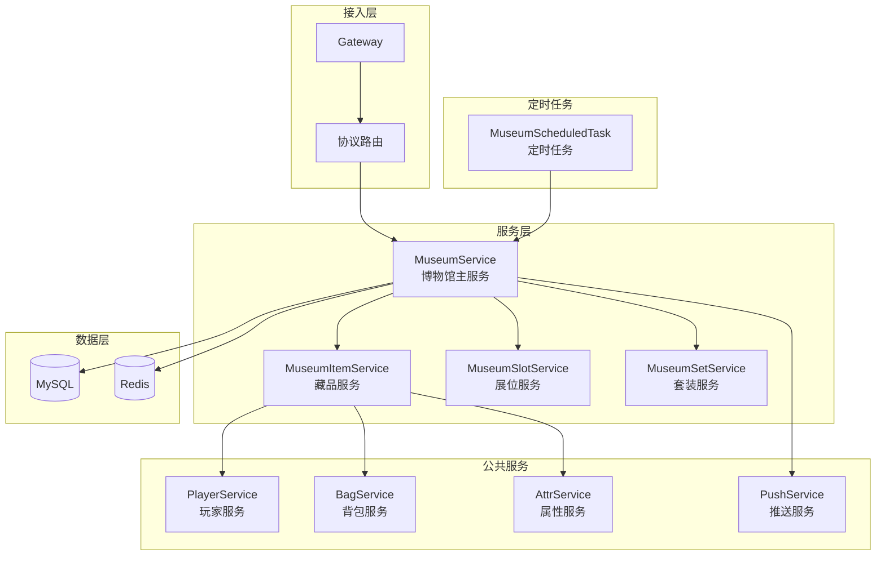
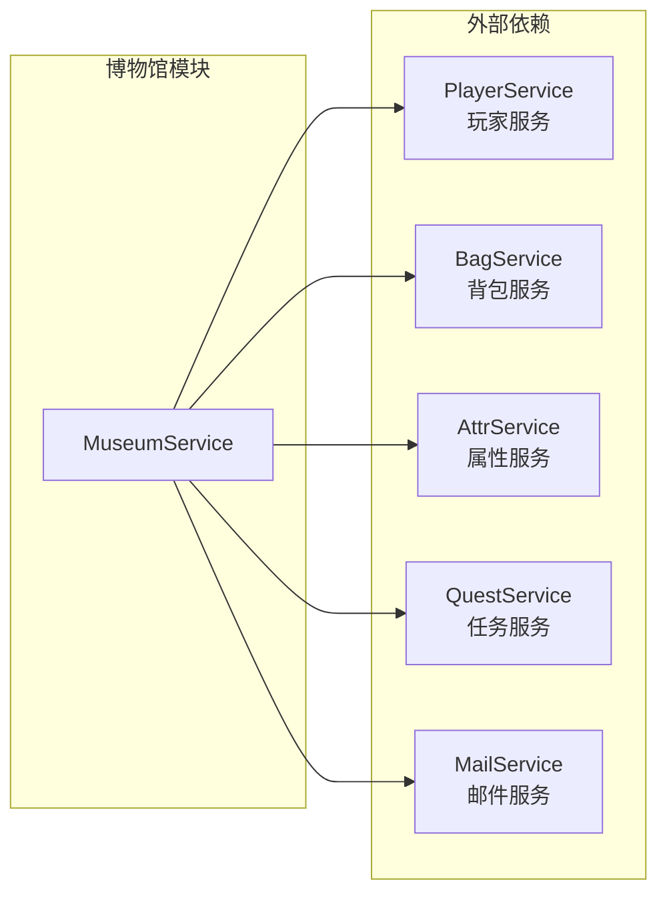

# 博物馆模块服务端开发文档

**模块名称**: Museum（博物馆系统）
**模块编号**: p035
**文档版本**: 2.0
**更新日期**: 2026-04-12

---

## 一、模块架构

### 1.1 模块概述

博物馆模块（Museum Module）负责管理游戏内藏品收集系统，包括：
- 藏品获取与合成
- 藏品升级与激活
- 博物馆展位管理
- 套装效果系统
- 属性加成计算

### 1.2 模块编号

协议模块编号: `p035`

### 1.3 架构图



---

## 二、核心数据结构

### 2.1 博物馆信息 (Museum_Info)

**路径**: `ClientProtocol/Common/MuseumObj/Museum_Info.cs`

| 字段名 | 类型 | 说明 |
|--------|------|------|
| museumId | int | 博物馆配置ID |
| maxSlot | int | 最大展位数 |
| unlockTime | long | 解锁时间戳 |
| collectCount | int | 已收集藏品数 |
| totalCount | int | 藏品总数 |
| activeCount | int | 已激活藏品数 |
| displayIncome | long | 当前展示收益/小时 |
| setName | string | 当前套装名称 |

### 2.2 藏品信息 (Museum_ItemInfo)

**路径**: `ClientProtocol/Common/MuseumObj/Museum_ItemInfo.cs`

| 字段名 | 类型 | 说明 |
|--------|------|------|
| itemId | int | 藏品配置ID |
| level | int | 当前等级 |
| isActive | bool | 是否已激活 |
| activeStage | int | 激活阶段 |
| unlockTime | long | 解锁时间戳 |
| slotIndex | int | 所在展位索引 |
| fragment | int | 当前碎片数量 |
| attrs | List<AttrPair> | 当前属性值列表 |
| setName | string | 所属套装名称 |
| upgradeFailedCount | int | 连续升级失败次数 |

### 2.3 展位信息 (Museum_SlotInfo)

**路径**: `ClientProtocol/Common/MuseumObj/Museum_SlotInfo.cs`

| 字段名 | 类型 | 说明 |
|--------|------|------|
| slotIndex | int | 展位索引 |
| itemId | int | 展示的藏品ID |
| isLocked | bool | 是否锁定 |
| displayTime | long | 展示开始时间 |
| displayIncome | long | 展示收益/小时 |
| slotType | int | 展位类型 |

---

## 三、数据库设计

### 3.1 玩家博物馆表 (player_museum)

```sql
CREATE TABLE `player_museum` (
    `id` bigint(20) NOT NULL AUTO_INCREMENT COMMENT '主键',
    `player_id` bigint(20) NOT NULL COMMENT '玩家ID',
    `museum_id` int(11) NOT NULL COMMENT '博物馆ID',
    `unlock_time` datetime COMMENT '解锁时间',
    `display_income` bigint(20) DEFAULT 0 COMMENT '展示收益',
    `create_time` datetime DEFAULT CURRENT_TIMESTAMP COMMENT '创建时间',
    `update_time` datetime DEFAULT CURRENT_TIMESTAMP ON UPDATE CURRENT_TIMESTAMP COMMENT '更新时间',
    PRIMARY KEY (`id`),
    UNIQUE KEY `uk_player_museum` (`player_id`, `museum_id`),
    KEY `idx_player_id` (`player_id`)
) ENGINE=InnoDB DEFAULT CHARSET=utf8mb4 COMMENT='玩家博物馆表';
```

### 3.2 玩家藏品表 (player_museum_item)

```sql
CREATE TABLE `player_museum_item` (
    `id` bigint(20) NOT NULL AUTO_INCREMENT COMMENT '主键',
    `player_id` bigint(20) NOT NULL COMMENT '玩家ID',
    `item_id` int(11) NOT NULL COMMENT '藏品配置ID',
    `level` int(11) DEFAULT 1 COMMENT '藏品等级',
    `is_active` tinyint(4) DEFAULT 0 COMMENT '是否激活',
    `active_stage` int(11) DEFAULT 0 COMMENT '激活阶段',
    `unlock_time` datetime COMMENT '解锁时间',
    `slot_index` int(11) DEFAULT -1 COMMENT '展位索引',
    `fragment` int(11) DEFAULT 0 COMMENT '碎片数量',
    `upgrade_failed_count` int(11) DEFAULT 0 COMMENT '连续升级失败次数',
    `create_time` datetime DEFAULT CURRENT_TIMESTAMP COMMENT '创建时间',
    `update_time` datetime DEFAULT CURRENT_TIMESTAMP ON UPDATE CURRENT_TIMESTAMP COMMENT '更新时间',
    PRIMARY KEY (`id`),
    UNIQUE KEY `uk_player_item` (`player_id`, `item_id`),
    KEY `idx_player_id` (`player_id`),
    KEY `idx_active` (`player_id`, `is_active`)
) ENGINE=InnoDB DEFAULT CHARSET=utf8mb4 COMMENT='玩家藏品表';
```

### 3.3 玩家展位表 (player_museum_slot)

```sql
CREATE TABLE `player_museum_slot` (
    `id` bigint(20) NOT NULL AUTO_INCREMENT COMMENT '主键',
    `player_id` bigint(20) NOT NULL COMMENT '玩家ID',
    `museum_id` int(11) NOT NULL COMMENT '博物馆ID',
    `slot_index` int(11) NOT NULL COMMENT '展位索引',
    `item_id` int(11) DEFAULT 0 COMMENT '藏品ID',
    `is_locked` tinyint(4) DEFAULT 0 COMMENT '是否锁定',
    `display_time` datetime COMMENT '展示开始时间',
    `create_time` datetime DEFAULT CURRENT_TIMESTAMP COMMENT '创建时间',
    `update_time` datetime DEFAULT CURRENT_TIMESTAMP ON UPDATE CURRENT_TIMESTAMP COMMENT '更新时间',
    PRIMARY KEY (`id`),
    UNIQUE KEY `uk_player_slot` (`player_id`, `museum_id`, `slot_index`),
    KEY `idx_player_museum` (`player_id`, `museum_id`)
) ENGINE=InnoDB DEFAULT CHARSET=utf8mb4 COMMENT='玩家展位表';
```

### 3.4 玩家套装表 (player_museum_set)

```sql
CREATE TABLE `player_museum_set` (
    `id` bigint(20) NOT NULL AUTO_INCREMENT COMMENT '主键',
    `player_id` bigint(20) NOT NULL COMMENT '玩家ID',
    `set_id` int(11) NOT NULL COMMENT '套装ID',
    `active_count` int(11) DEFAULT 0 COMMENT '激活件数',
    `create_time` datetime DEFAULT CURRENT_TIMESTAMP COMMENT '创建时间',
    `update_time` datetime DEFAULT CURRENT_TIMESTAMP ON UPDATE CURRENT_TIMESTAMP COMMENT '更新时间',
    PRIMARY KEY (`id`),
    UNIQUE KEY `uk_player_set` (`player_id`, `set_id`),
    KEY `idx_player_id` (`player_id`)
) ENGINE=InnoDB DEFAULT CHARSET=utf8mb4 COMMENT='玩家套装表';
```

---

## 四、核心服务实现

### 4.1 MuseumService - 博物馆主服务

```java
package com.game.server.module.museum;

import java.util.*;
import java.util.concurrent.TimeUnit;
import javax.annotation.Resource;
import org.springframework.stereotype.Service;
import org.springframework.transaction.annotation.Transactional;
import lombok.extern.slf4j.Slf4j;

/**
 * 博物馆主服务
 */
@Slf4j
@Service
public class MuseumService {

    @Resource
    private MuseumDao museumDao;

    @Resource
    private MuseumItemDao itemDao;

    @Resource
    private MuseumSlotDao slotDao;

    @Resource
    private MuseumSetDao setDao;

    @Resource
    private PlayerService playerService;

    @Resource
    private BagService bagService;

    @Resource
    private AttrService attrService;

    @Resource
    private PushService pushService;

    @Resource
    private RedisTemplate<String, Object> redisTemplate;

    // Redis Key前缀
    private static final String REDIS_KEY_MUSEUM_INFO = "museum:info:";
    private static final String REDIS_KEY_ITEM_LIST = "museum:item_list:";
    private static final String REDIS_KEY_SLOT_LIST = "museum:slot_list:";
    private static final String REDIS_KEY_TOTAL_ATTR = "museum:total_attr:";

    /**
     * 获取博物馆信息
     * @param playerId 玩家ID
     * @param museumId 博物馆ID（0表示所有）
     * @return 博物馆信息列表
     */
    public List<MuseumInfo> getMuseumInfo(long playerId, int museumId) {
        List<MuseumInfo> result = new ArrayList<>();

        // 获取博物馆配置
        List<RefMuseum> museumRefs = museumId == 0
            ? RefMuseum.getMgr().getAll()
            : Collections.singletonList(RefMuseum.getMgr().get(museumId));

        for (RefMuseum museumRef : museumRefs) {
            // 检查解锁条件
            if (!checkMuseumUnlock(playerId, museumRef)) {
                continue;
            }

            // 获取玩家博物馆数据
            PlayerMuseum playerMuseum = museumDao.selectByPlayerAndMuseum(playerId, museumRef.getMuseumId());
            if (playerMuseum == null) {
                playerMuseum = initPlayerMuseum(playerId, museumRef.getMuseumId());
            }

            // 构建返回信息
            MuseumInfo info = buildMuseumInfo(playerId, playerMuseum, museumRef);
            result.add(info);
        }

        return result;
    }

    /**
     * 获取藏品列表
     * @param playerId 玩家ID
     * @param museumId 博物馆ID
     * @param itemType 藏品类型
     * @param rarity 稀有度
     * @param activeStatus 激活状态
     * @return 藏品列表
     */
    public List<MuseumItemInfo> getItemList(long playerId, int museumId,
            int itemType, int rarity, int activeStatus) {
        // 获取所有藏品
        List<PlayerMuseumItem> items = itemDao.selectByPlayer(playerId);

        // 过滤
        List<MuseumItemInfo> result = new ArrayList<>();
        for (PlayerMuseumItem item : items) {
            RefMuseumItem itemRef = RefMuseumItem.getMgr().get(item.getItemId());
            if (itemRef == null) continue;

            // 类型过滤
            if (itemType > 0 && itemRef.getItemType() != itemType) continue;

            // 稀有度过滤
            if (rarity > 0 && itemRef.getRarity() != rarity) continue;

            // 激活状态过滤
            if (activeStatus == 1 && item.isActive()) continue;
            if (activeStatus == 2 && !item.isActive()) continue;

            // 构建信息
            MuseumItemInfo info = buildItemInfo(item, itemRef);
            result.add(info);
        }

        // 排序：按稀有度和权重
        result.sort((a, b) -> {
            int rarityCompare = Integer.compare(b.getRarity(), a.getRarity());
            if (rarityCompare != 0) return rarityCompare;
            return Integer.compare(b.getSortWeight(), a.getSortWeight());
        });

        return result;
    }

    /**
     * 获取总属性加成
     * @param playerId 玩家ID
     * @return 属性Map
     */
    public Map<Integer, Long> getTotalAttribute(long playerId) {
        // 先从缓存获取
        String cacheKey = REDIS_KEY_TOTAL_ATTR + playerId;
        Map<Integer, Long> cached = (Map<Integer, Long>) redisTemplate.opsForValue().get(cacheKey);
        if (cached != null) {
            return cached;
        }

        // 计算属性
        Map<Integer, Long> totalAttr = new HashMap<>();

        // 获取所有已激活藏品
        List<PlayerMuseumItem> activeItems = itemDao.selectActiveByPlayer(playerId);
        for (PlayerMuseumItem item : activeItems) {
            RefMuseumItem itemRef = RefMuseumItem.getMgr().get(item.getItemId());
            if (itemRef == null) continue;

            // 计算藏品属性
            Map<Integer, Long> itemAttr = calculateItemAttr(item, itemRef);
            for (Map.Entry<Integer, Long> entry : itemAttr.entrySet()) {
                totalAttr.merge(entry.getKey(), entry.getValue(), Long::sum);
            }
        }

        // 添加套装效果
        addSetEffects(playerId, totalAttr);

        // 缓存结果
        redisTemplate.opsForValue().set(cacheKey, totalAttr, 5, TimeUnit.MINUTES);

        return totalAttr;
    }

    /**
     * 检查博物馆解锁条件
     */
    private boolean checkMuseumUnlock(long playerId, RefMuseum museumRef) {
        // 检查玩家等级
        PlayerInfo player = playerService.getPlayer(playerId);
        if (player.getLevel() < museumRef.getUnlockLevel()) {
            return false;
        }

        // 检查VIP等级
        if (museumRef.getUnlockCondition().containsKey("vip")) {
            int needVip = museumRef.getUnlockCondition().getInt("vip");
            if (player.getVipLevel() < needVip) {
                return false;
            }
        }

        // 检查任务完成
        if (museumRef.getUnlockCondition().containsKey("quest_complete")) {
            int questId = museumRef.getUnlockCondition().getInt("quest_complete");
            if (!questService.isQuestComplete(playerId, questId)) {
                return false;
            }
        }

        return true;
    }

    /**
     * 初始化玩家博物馆
     */
    private PlayerMuseum initPlayerMuseum(long playerId, int museumId) {
        PlayerMuseum museum = new PlayerMuseum();
        museum.setPlayerId(playerId);
        museum.setMuseumId(museumId);
        museum.setUnlockTime(new Date());
        museum.setDisplayIncome(0L);
        museum.setCreateTime(new Date());
        museum.setUpdateTime(new Date());

        museumDao.insert(museum);
        return museum;
    }

    /**
     * 构建博物馆信息
     */
    private MuseumInfo buildMuseumInfo(long playerId, PlayerMuseum playerMuseum, RefMuseum museumRef) {
        MuseumInfo info = new MuseumInfo();
        info.setMuseumId(museumRef.getMuseumId());
        info.setMaxSlot(museumRef.getMaxSlot());
        info.setUnlockTime(playerMuseum.getUnlockTime().getTime());

        // 统计藏品数量
        int collectCount = itemDao.countByPlayer(playerId);
        int totalCount = RefMuseumItem.getMgr().getAll().size();
        int activeCount = itemDao.countActiveByPlayer(playerId);

        info.setCollectCount(collectCount);
        info.setTotalCount(totalCount);
        info.setActiveCount(activeCount);

        // 计算展示收益
        long displayIncome = calculateDisplayIncome(playerId);
        info.setDisplayIncome(displayIncome);

        return info;
    }

    /**
     * 计算展示收益
     */
    private long calculateDisplayIncome(long playerId) {
        long totalIncome = 0;

        // 获取所有展位
        List<PlayerMuseumSlot> slots = slotDao.selectByPlayer(playerId);
        for (PlayerMuseumSlot slot : slots) {
            if (slot.getItemId() <= 0) continue;

            PlayerMuseumItem item = itemDao.selectByPlayerAndItem(playerId, slot.getItemId());
            RefMuseumItem itemRef = RefMuseumItem.getMgr().get(slot.getItemId());
            RefMuseumSlot slotRef = RefMuseumSlot.getMgr().get(slot.getMuseumId(), slot.getSlotIndex());

            if (item == null || itemRef == null) continue;

            // 基础收益
            int baseIncome = 10;

            // 稀有度倍率
            double rarityMult = getRarityMultiplier(itemRef.getRarity());

            // 等级倍率
            double levelMult = 1.0 + (item.getLevel() - 1) * 0.05;

            // 展位倍率
            double slotMult = slotRef != null ? slotRef.getDisplayRewardMult() : 1.0;

            long income = (long) (baseIncome * rarityMult * levelMult * slotMult);
            totalIncome += income;
        }

        return totalIncome;
    }

    /**
     * 计算藏品属性
     */
    private Map<Integer, Long> calculateItemAttr(PlayerMuseumItem item, RefMuseumItem itemRef) {
        Map<Integer, Long> result = new HashMap<>();

        // 基础属性 + 等级成长
        Map<String, Long> baseAttr = itemRef.getBaseAttr();
        Map<String, Long> growthRate = itemRef.getGrowthRate();

        for (Map.Entry<String, Long> entry : baseAttr.entrySet()) {
            int attrType = parseAttrType(entry.getKey());
            long baseValue = entry.getValue();
            long growth = growthRate.getOrDefault(entry.getKey(), 0L);

            long value = baseValue + (item.getLevel() - 1) * growth;
            result.put(attrType, value);
        }

        // 激活效果
        if (item.isActive() && itemRef.getActivateEffect() != null) {
            for (Map.Entry<String, Long> entry : itemRef.getActivateEffect().entrySet()) {
                int attrType = parseAttrType(entry.getKey());
                result.merge(attrType, entry.getValue(), Long::sum);
            }
        }

        // 多阶段激活效果
        for (int stage = 1; stage <= item.getActiveStage(); stage++) {
            RefMuseumItemActive activeRef = RefMuseumItemActive.getMgr().get(item.getItemId(), stage);
            if (activeRef != null && activeRef.getReward() != null) {
                for (Map.Entry<String, Long> entry : activeRef.getReward().entrySet()) {
                    int attrType = parseAttrType(entry.getKey());
                    if (attrType > 0) {
                        result.merge(attrType, entry.getValue(), Long::sum);
                    }
                }
            }
        }

        return result;
    }

    /**
     * 添加套装效果
     */
    private void addSetEffects(long playerId, Map<Integer, Long> totalAttr) {
        List<PlayerMuseumSet> playerSets = setDao.selectByPlayer(playerId);

        for (PlayerMuseumSet playerSet : playerSets) {
            RefMuseumItemSet setRef = RefMuseumItemSet.getMgr().get(playerSet.getSetId());
            if (setRef == null) continue;

            // 获取激活的效果
            Map<String, Map<String, Long>> effects = setRef.getEffects();
            for (Map.Entry<String, Map<String, Long>> entry : effects.entrySet()) {
                int needCount = Integer.parseInt(entry.getKey());
                if (playerSet.getActiveCount() >= needCount) {
                    for (Map.Entry<String, Long> attrEntry : entry.getValue().entrySet()) {
                        int attrType = parseAttrType(attrEntry.getKey());
                        totalAttr.merge(attrType, attrEntry.getValue(), Long::sum);
                    }
                }
            }
        }
    }

    private double getRarityMultiplier(int rarity) {
        switch (rarity) {
            case 1: return 1.0;
            case 2: return 1.5;
            case 3: return 2.0;
            case 4: return 3.0;
            default: return 1.0;
        }
    }

    private int parseAttrType(String attrKey) {
        if (attrKey.startsWith("attr:")) {
            return Integer.parseInt(attrKey.substring(5));
        }
        return 0;
    }
}
```

### 4.2 MuseumItemService - 藏品服务

```java
package com.game.server.module.museum;

import java.util.*;
import javax.annotation.Resource;
import org.springframework.stereotype.Service;
import org.springframework.transaction.annotation.Transactional;
import lombok.extern.slf4j.Slf4j;

/**
 * 藏品服务
 */
@Slf4j
@Service
public class MuseumItemService {

    @Resource
    private MuseumItemDao itemDao;

    @Resource
    private MuseumSetDao setDao;

    @Resource
    private BagService bagService;

    @Resource
    private AttrService attrService;

    @Resource
    private PushService pushService;

    @Resource
    private MuseumService museumService;

    /**
     * 升级藏品
     * @param playerId 玩家ID
     * @param itemId 藏品ID
     * @param upgradeCount 升级次数
     * @param useProtect 是否使用保护石
     * @return 升级结果
     */
    @Transactional(rollbackFor = Exception.class)
    public UpgradeResult upgradeItem(long playerId, int itemId, int upgradeCount, boolean useProtect) {
        // 1. 获取藏品数据
        PlayerMuseumItem item = itemDao.selectByPlayerAndItem(playerId, itemId);
        if (item == null) {
            throw new BusinessException(ErrorCode.MUSEUM_ITEM_NOT_FOUND, "藏品不存在");
        }

        // 2. 获取藏品配置
        RefMuseumItem itemRef = RefMuseumItem.getMgr().get(itemId);
        if (itemRef == null) {
            throw new BusinessException(ErrorCode.MUSEUM_CONFIG_NOT_FOUND, "配置不存在");
        }

        // 3. 检查是否满级
        if (item.getLevel() >= itemRef.getMaxLevel()) {
            throw new BusinessException(ErrorCode.MUSEUM_ITEM_MAX_LEVEL, "藏品已满级");
        }

        // 4. 执行升级
        int actualUpgradeCount = 0;
        int failedCount = 0;
        List<Map<String, Long>> attrChanges = new ArrayList<>();

        for (int i = 0; i < upgradeCount; i++) {
            // 检查是否满级
            if (item.getLevel() >= itemRef.getMaxLevel()) {
                break;
            }

            int targetLevel = item.getLevel() + 1;

            // 获取升级配置
            RefMuseumItemUpgrade upgradeRef = RefMuseumItemUpgrade.getMgr().get(itemId, targetLevel);
            if (upgradeRef == null) {
                break;
            }

            // 检查材料
            Map<String, Integer> costList = upgradeRef.getCostList();
            if (!bagService.hasEnough(playerId, costList)) {
                throw new BusinessException(ErrorCode.MUSEUM_MATERIAL_NOT_ENOUGH, "升级材料不足");
            }

            // 检查保护石
            if (useProtect && upgradeRef.getProtectCost() != null) {
                if (!bagService.hasEnough(playerId, upgradeRef.getProtectCost())) {
                    throw new BusinessException(ErrorCode.MUSEUM_PROTECT_STONE_NOT_ENOUGH, "保护石不足");
                }
            }

            // 扣除材料
            bagService.costItems(playerId, costList, "藏品升级");

            // 判定成功率
            float successRate = upgradeRef.getSuccessRate();
            boolean success = RandomUtil.randomFloat() < successRate;

            if (success) {
                // 升级成功
                item.setLevel(targetLevel);
                item.setUpgradeFailedCount(0);
                actualUpgradeCount++;

                // 记录属性变化
                attrChanges.add(upgradeRef.getAttrAdd());
            } else {
                // 升级失败
                item.setUpgradeFailedCount(item.getUpgradeFailedCount() + 1);
                failedCount++;

                if (useProtect) {
                    // 使用保护石，等级不变
                    bagService.costItems(playerId, upgradeRef.getProtectCost(), "藏品升级保护");
                } else {
                    // 未使用保护石，可能降级
                    if (item.getLevel() > 1) {
                        item.setLevel(item.getLevel() - 1);
                    }
                }
            }
        }

        // 5. 更新数据库
        item.setUpdateTime(new Date());
        itemDao.updateById(item);

        // 6. 如果已激活，更新属性
        if (item.isActive()) {
            attrService.updatePlayerAttr(playerId, "museum", museumService.getTotalAttribute(playerId));
            invalidateAttrCache(playerId);
        }

        // 7. 推送更新
        pushItemChange(playerId, item, success ? 0 : 1);

        // 8. 构建返回结果
        UpgradeResult result = new UpgradeResult();
        result.setLevel(item.getLevel());
        result.setUpgradeCount(actualUpgradeCount);
        result.setFailedCount(failedCount);
        result.setAttrChanges(attrChanges);

        return result;
    }

    /**
     * 激活藏品
     * @param playerId 玩家ID
     * @param itemId 藏品ID
     * @param targetStage 目标阶段
     * @return 激活结果
     */
    @Transactional(rollbackFor = Exception.class)
    public ActivateResult activateItem(long playerId, int itemId, int targetStage) {
        // 1. 获取藏品数据
        PlayerMuseumItem item = itemDao.selectByPlayerAndItem(playerId, itemId);
        if (item == null) {
            throw new BusinessException(ErrorCode.MUSEUM_ITEM_NOT_FOUND, "藏品不存在");
        }

        // 2. 检查是否已激活该阶段
        if (item.getActiveStage() >= targetStage) {
            throw new BusinessException(ErrorCode.MUSEUM_ITEM_ALREADY_ACTIVE, "已激活该阶段");
        }

        // 3. 获取激活配置
        RefMuseumItemActive activeRef = RefMuseumItemActive.getMgr().get(itemId, targetStage);
        if (activeRef == null) {
            throw new BusinessException(ErrorCode.MUSEUM_CONFIG_NOT_FOUND, "激活配置不存在");
        }

        // 4. 检查激活条件
        Map<String, Object> condition = activeRef.getCondition();

        // 等级条件
        if (condition.containsKey("level")) {
            int needLevel = ((Number) condition.get("level")).intValue();
            if (item.getLevel() < needLevel) {
                throw new BusinessException(ErrorCode.MUSEUM_ITEM_LEVEL_NOT_ENOUGH, "藏品等级不足");
            }
        }

        // 任务条件
        if (condition.containsKey("quest")) {
            int questId = ((Number) condition.get("quest")).intValue();
            if (!questService.isQuestComplete(playerId, questId)) {
                throw new BusinessException(ErrorCode.MUSEUM_ACTIVE_CONDITION_NOT_MET, "任务未完成");
            }
        }

        // 前置激活条件
        if (condition.containsKey("active_items")) {
            List<Integer> needItems = (List<Integer>) condition.get("active_items");
            for (Integer needItemId : needItems) {
                PlayerMuseumItem needItem = itemDao.selectByPlayerAndItem(playerId, needItemId);
                if (needItem == null || !needItem.isActive()) {
                    throw new BusinessException(ErrorCode.MUSEUM_ACTIVE_CONDITION_NOT_MET, "前置藏品未激活");
                }
            }
        }

        // 5. 消耗激活材料
        Map<String, Integer> cost = activeRef.getCost();
        if (cost != null && !cost.isEmpty()) {
            if (!bagService.hasEnough(playerId, cost)) {
                throw new BusinessException(ErrorCode.MUSEUM_MATERIAL_NOT_ENOUGH, "激活材料不足");
            }
            bagService.costItems(playerId, cost, "藏品激活");
        }

        // 6. 更新激活状态
        if (targetStage == 1) {
            item.setActive(true);
        }
        item.setActiveStage(targetStage);
        item.setUpdateTime(new Date());
        itemDao.updateById(item);

        // 7. 更新套装
        updateSetEffect(playerId, itemId, true);

        // 8. 更新属性
        Map<Integer, Long> totalAttr = museumService.getTotalAttribute(playerId);
        attrService.updatePlayerAttr(playerId, "museum", totalAttr);
        invalidateAttrCache(playerId);

        // 9. 推送更新
        pushItemChange(playerId, item, 0);
        pushAttrChange(playerId, totalAttr);

        // 10. 构建返回结果
        ActivateResult result = new ActivateResult();
        result.setActiveStage(item.getActiveStage());
        result.setTotalAttr(totalAttr);

        return result;
    }

    /**
     * 合成藏品
     * @param playerId 玩家ID
     * @param fragmentId 碎片ID
     * @param count 合成数量
     * @return 合成结果
     */
    @Transactional(rollbackFor = Exception.class)
    public ComposeResult composeItem(long playerId, int fragmentId, int count) {
        // 1. 获取碎片配置
        RefMuseumItemFragment fragRef = RefMuseumItemFragment.getMgr().get(fragmentId);
        if (fragRef == null) {
            throw new BusinessException(ErrorCode.MUSEUM_CONFIG_NOT_FOUND, "碎片配置不存在");
        }

        // 2. 检查碎片数量
        int needCount = fragRef.getComposeCount() * count;
        if (!bagService.hasEnough(playerId, "fragment", fragmentId, needCount)) {
            throw new BusinessException(ErrorCode.MUSEUM_FRAGMENT_NOT_ENOUGH, "碎片不足");
        }

        // 3. 扣除碎片
        bagService.costItem(playerId, "fragment", fragmentId, needCount, "藏品合成");

        // 4. 检查是否已拥有藏品
        int itemId = fragRef.getItemId();
        PlayerMuseumItem existItem = itemDao.selectByPlayerAndItem(playerId, itemId);

        ComposeResult result = new ComposeResult();

        if (existItem != null) {
            // 已拥有，增加碎片
            existItem.setFragment(existItem.getFragment() + count);
            existItem.setUpdateTime(new Date());
            itemDao.updateById(existItem);

            result.setType(1); // 碎片增加
            result.setFragment(existItem.getFragment());
        } else {
            // 未拥有，创建藏品
            PlayerMuseumItem newItem = new PlayerMuseumItem();
            newItem.setPlayerId(playerId);
            newItem.setItemId(itemId);
            newItem.setLevel(1);
            newItem.setActive(false);
            newItem.setActiveStage(0);
            newItem.setUnlockTime(new Date());
            newItem.setSlotIndex(-1);
            newItem.setFragment(0);
            newItem.setUpgradeFailedCount(0);
            newItem.setCreateTime(new Date());
            newItem.setUpdateTime(new Date());

            itemDao.insert(newItem);

            result.setType(2); // 新增藏品
            result.setItemInfo(buildItemInfo(newItem, RefMuseumItem.getMgr().get(itemId)));

            // 推送藏品添加
            pushItemAdd(playerId, newItem);
        }

        return result;
    }

    /**
     * 分解藏品
     * @param playerId 玩家ID
     * @param itemId 藏品ID
     * @param count 分解数量
     * @return 分解结果
     */
    @Transactional(rollbackFor = Exception.class)
    public DecomposeResult decomposeItem(long playerId, int itemId, int count) {
        // 1. 获取藏品数据
        PlayerMuseumItem item = itemDao.selectByPlayerAndItem(playerId, itemId);
        if (item == null) {
            throw new BusinessException(ErrorCode.MUSEUM_ITEM_NOT_FOUND, "藏品不存在");
        }

        // 2. 检查是否可分解
        RefMuseumItem itemRef = RefMuseumItem.getMgr().get(itemId);
        if (itemRef == null || itemRef.getDecomposeReward() == null) {
            throw new BusinessException(ErrorCode.MUSEUM_ITEM_CANNOT_DECOMPOSE, "该藏品不可分解");
        }

        // 3. 检查是否在展示中
        if (item.getSlotIndex() >= 0) {
            throw new BusinessException(ErrorCode.MUSEUM_ITEM_IN_SLOT, "藏品正在展示中，请先移出展位");
        }

        // 4. 检查是否已激活
        if (item.isActive()) {
            throw new BusinessException(ErrorCode.MUSEUM_ITEM_ACTIVE_CANNOT_DECOMPOSE, "已激活的藏品不可分解");
        }

        // 5. 发放分解奖励
        Map<String, Integer> rewards = itemRef.getDecomposeReward();
        bagService.giveItems(playerId, rewards, "藏品分解");

        // 6. 删除藏品
        itemDao.deleteById(item.getId());

        // 7. 推送删除
        pushItemDelete(playerId, itemId);

        // 8. 构建返回结果
        DecomposeResult result = new DecomposeResult();
        result.setItemId(itemId);
        result.setRewards(rewards);

        return result;
    }

    /**
     * 更新套装效果
     */
    private void updateSetEffect(long playerId, int itemId, boolean isActivate) {
        // 查找藏品所属套装
        List<RefMuseumItemSet> setRefs = RefMuseumItemSet.getMgr().getByItemId(itemId);

        for (RefMuseumItemSet setRef : setRefs) {
            PlayerMuseumSet playerSet = setDao.selectByPlayerAndSet(playerId, setRef.getSetId());
            if (playerSet == null) {
                playerSet = new PlayerMuseumSet();
                playerSet.setPlayerId(playerId);
                playerSet.setSetId(setRef.getSetId());
                playerSet.setActiveCount(isActivate ? 1 : 0);
                setDao.insert(playerSet);
            } else {
                if (isActivate) {
                    playerSet.setActiveCount(playerSet.getActiveCount() + 1);
                } else {
                    playerSet.setActiveCount(Math.max(0, playerSet.getActiveCount() - 1));
                }
                setDao.updateById(playerSet);
            }

            // 推送套装效果变更
            pushSetEffect(playerId, setRef.getSetId(), playerSet.getActiveCount());
        }
    }

    private void invalidateAttrCache(long playerId) {
        String cacheKey = "museum:total_attr:" + playerId;
        redisTemplate.delete(cacheKey);
    }

    private void pushItemChange(long playerId, PlayerMuseumItem item, int upgradeResult) {
        // 推送藏品变更
        GS2GC_035_052_OnMuseumItemChg msg = new GS2GC_035_052_OnMuseumItemChg();
        msg.setItemId(item.getItemId());
        msg.setLevel(item.getLevel());
        msg.setIsActive(item.isActive());
        msg.setActiveStage(item.getActiveStage());
        msg.setUpgradeResult(upgradeResult);
        pushService.pushToPlayer(playerId, msg);
    }

    private void pushItemAdd(long playerId, PlayerMuseumItem item) {
        GS2GC_035_051_OnMuseumItemAdd msg = new GS2GC_035_051_OnMuseumItemAdd();
        msg.setItemInfo(buildItemInfoProto(item));
        pushService.pushToPlayer(playerId, msg);
    }

    private void pushItemDelete(long playerId, int itemId) {
        GS2GC_035_053_OnMuseumItemDel msg = new GS2GC_035_053_OnMuseumItemDel();
        msg.setItemId(itemId);
        msg.setReason("decompose");
        pushService.pushToPlayer(playerId, msg);
    }

    private void pushAttrChange(long playerId, Map<Integer, Long> totalAttr) {
        GS2GC_035_055_OnMuseumAttrChg msg = new GS2GC_035_055_OnMuseumAttrChg();
        msg.setChanges(buildAttrChanges(totalAttr));
        pushService.pushToPlayer(playerId, msg);
    }

    private void pushSetEffect(long playerId, int setId, int activeCount) {
        GS2GC_035_056_OnMuseumSetEffect msg = new GS2GC_035_056_OnMuseumSetEffect();
        msg.setSetId(setId);
        msg.setActiveCount(activeCount);
        pushService.pushToPlayer(playerId, msg);
    }
}
```

### 4.3 MuseumSlotService - 展位服务

```java
package com.game.server.module.museum;

import java.util.*;
import javax.annotation.Resource;
import org.springframework.stereotype.Service;
import org.springframework.transaction.annotation.Transactional;
import lombok.extern.slf4j.Slf4j;

/**
 * 展位服务
 */
@Slf4j
@Service
public class MuseumSlotService {

    @Resource
    private MuseumSlotDao slotDao;

    @Resource
    private MuseumItemDao itemDao;

    @Resource
    private PushService pushService;

    /**
     * 设置展位
     * @param playerId 玩家ID
     * @param museumId 博物馆ID
     * @param slotIndex 展位索引
     * @param itemId 藏品ID（0表示清空）
     * @return 展位信息
     */
    @Transactional(rollbackFor = Exception.class)
    public MuseumSlotInfo setSlot(long playerId, int museumId, int slotIndex, int itemId) {
        // 1. 获取展位配置
        RefMuseumSlot slotRef = RefMuseumSlot.getMgr().get(museumId, slotIndex);
        if (slotRef == null) {
            throw new BusinessException(ErrorCode.MUSEUM_SLOT_NOT_FOUND, "展位不存在");
        }

        // 2. 获取展位数据
        PlayerMuseumSlot slot = slotDao.selectByPlayerMuseumSlot(playerId, museumId, slotIndex);
        if (slot == null) {
            slot = initPlayerSlot(playerId, museumId, slotIndex, slotRef);
        }

        // 3. 检查展位是否锁定
        if (slot.isLocked()) {
            throw new BusinessException(ErrorCode.MUSEUM_SLOT_LOCKED, "展位被锁定");
        }

        // 4. 处理放入藏品
        if (itemId > 0) {
            // 获取藏品数据
            PlayerMuseumItem item = itemDao.selectByPlayerAndItem(playerId, itemId);
            if (item == null) {
                throw new BusinessException(ErrorCode.MUSEUM_ITEM_NOT_FOUND, "藏品不存在");
            }

            // 如果藏品已在其他展位，先移出
            if (item.getSlotIndex() >= 0 && item.getSlotIndex() != slotIndex) {
                clearSlot(playerId, museumId, item.getSlotIndex());
            }

            // 如果展位已有藏品，先移出
            if (slot.getItemId() > 0) {
                PlayerMuseumItem oldItem = itemDao.selectByPlayerAndItem(playerId, slot.getItemId());
                if (oldItem != null) {
                    oldItem.setSlotIndex(-1);
                    itemDao.updateById(oldItem);
                }
            }

            // 放入新藏品
            slot.setItemId(itemId);
            slot.setDisplayTime(new Date());
            item.setSlotIndex(slotIndex);
            itemDao.updateById(item);
        } else {
            // 清空展位
            if (slot.getItemId() > 0) {
                PlayerMuseumItem oldItem = itemDao.selectByPlayerAndItem(playerId, slot.getItemId());
                if (oldItem != null) {
                    oldItem.setSlotIndex(-1);
                    itemDao.updateById(oldItem);
                }
            }
            slot.setItemId(0);
            slot.setDisplayTime(null);
        }

        // 5. 更新数据库
        slot.setUpdateTime(new Date());
        slotDao.updateById(slot);

        // 6. 推送更新
        pushSlotChange(playerId, slot);

        // 7. 构建返回
        return buildSlotInfo(slot, slotRef);
    }

    /**
     * 清空展位
     */
    public MuseumSlotInfo clearSlot(long playerId, int museumId, int slotIndex) {
        return setSlot(playerId, museumId, slotIndex, 0);
    }

    /**
     * 获取展位列表
     */
    public List<MuseumSlotInfo> getSlotList(long playerId, int museumId) {
        List<MuseumSlotInfo> result = new ArrayList<>();

        RefMuseum museumRef = RefMuseum.getMgr().get(museumId);
        if (museumRef == null) {
            return result;
        }

        List<PlayerMuseumSlot> slots = slotDao.selectByPlayerAndMuseum(playerId, museumId);

        for (int i = 0; i < museumRef.getMaxSlot(); i++) {
            RefMuseumSlot slotRef = RefMuseumSlot.getMgr().get(museumId, i);
            PlayerMuseumSlot slot = findSlot(slots, i);

            if (slot == null) {
                slot = initPlayerSlot(playerId, museumId, i, slotRef);
            }

            result.add(buildSlotInfo(slot, slotRef));
        }

        return result;
    }

    private PlayerMuseumSlot initPlayerSlot(long playerId, int museumId, int slotIndex, RefMuseumSlot slotRef) {
        PlayerMuseumSlot slot = new PlayerMuseumSlot();
        slot.setPlayerId(playerId);
        slot.setMuseumId(museumId);
        slot.setSlotIndex(slotIndex);
        slot.setItemId(0);
        slot.setLocked(checkSlotLocked(playerId, slotRef));
        slot.setCreateTime(new Date());
        slot.setUpdateTime(new Date());

        slotDao.insert(slot);
        return slot;
    }

    private boolean checkSlotLocked(long playerId, RefMuseumSlot slotRef) {
        Map<String, Object> condition = slotRef.getUnlockCondition();
        if (condition == null || condition.isEmpty()) {
            return false;
        }

        // 检查VIP条件
        if (condition.containsKey("vip")) {
            int needVip = ((Number) condition.get("vip")).intValue();
            if (playerService.getVipLevel(playerId) < needVip) {
                return true;
            }
        }

        // 检查道具条件
        if (condition.containsKey("item:ticket_slot")) {
            int needCount = ((Number) condition.get("item:ticket_slot")).intValue();
            if (!bagService.hasEnough(playerId, "item", "ticket_slot", needCount)) {
                return true;
            }
        }

        return false;
    }

    private PlayerMuseumSlot findSlot(List<PlayerMuseumSlot> slots, int slotIndex) {
        return slots.stream()
            .filter(s -> s.getSlotIndex() == slotIndex)
            .findFirst()
            .orElse(null);
    }

    private MuseumSlotInfo buildSlotInfo(PlayerMuseumSlot slot, RefMuseumSlot slotRef) {
        MuseumSlotInfo info = new MuseumSlotInfo();
        info.setSlotIndex(slot.getSlotIndex());
        info.setItemId(slot.getItemId());
        info.setLocked(slot.isLocked());
        info.setDisplayTime(slot.getDisplayTime() != null ? slot.getDisplayTime().getTime() : 0);
        info.setSlotType(slotRef != null ? slotRef.getSlotType() : 0);

        // 计算展示收益
        if (slot.getItemId() > 0) {
            info.setDisplayIncome(calculateSlotIncome(slot.getItemId()));
        } else {
            info.setDisplayIncome(0);
        }

        return info;
    }

    private long calculateSlotIncome(int itemId) {
        RefMuseumItem itemRef = RefMuseumItem.getMgr().get(itemId);
        if (itemRef == null) return 0;

        int baseIncome = 10;
        double rarityMult = getRarityMultiplier(itemRef.getRarity());

        return (long) (baseIncome * rarityMult);
    }

    private void pushSlotChange(long playerId, PlayerMuseumSlot slot) {
        GS2GC_035_054_OnMuseumSlotChg msg = new GS2GC_035_054_OnMuseumSlotChg();
        msg.setSlotInfo(buildSlotInfoProto(slot));
        pushService.pushToPlayer(playerId, msg);
    }
}
```

---

## 五、协议处理器实现

### 5.1 协议处理注册

```java
/**
 * 博物馆模块协议处理器
 */
@Component
public class MuseumProtocolHandler {

    @Resource
    private MuseumService museumService;

    @Resource
    private MuseumItemService itemService;

    @Resource
    private MuseumSlotService slotService;

    // 协议主序号
    public static final byte MODULE_ORDER = 35;

    /**
     * 注册协议处理器
     */
    public void register(ProtocolHandlerRegistry registry) {
        registry.register(MODULE_ORDER, 1, this::onReqMuseumInfo);
        registry.register(MODULE_ORDER, 2, this::onReqMuseumItemList);
        registry.register(MODULE_ORDER, 3, this::onReqMuseumItemUpgrade);
        registry.register(MODULE_ORDER, 4, this::onReqMuseumItemActive);
        registry.register(MODULE_ORDER, 5, this::onReqMuseumSlotSet);
        registry.register(MODULE_ORDER, 6, this::onReqMuseumSlotClear);
        registry.register(MODULE_ORDER, 7, this::onReqMuseumItemCompose);
        registry.register(MODULE_ORDER, 8, this::onReqMuseumItemDecompose);
        registry.register(MODULE_ORDER, 9, this::onReqMuseumBatchUpgrade);
    }

    /**
     * 处理请求博物馆信息
     */
    public void onReqMuseumInfo(NPPlayerContext context, GC2GS_035_001_ReqMuseumInfo proto) {
        long playerId = context.getPlayerId();
        int museumId = proto.getMuseumId();

        List<MuseumInfo> museumInfoList = museumService.getMuseumInfo(playerId, museumId);
        List<SetEffectInfo> setEffects = museumService.getActiveSetEffects(playerId);

        GS2GC_035_050_OnMuseumInfo response = new GS2GC_035_050_OnMuseumInfo();
        response.setMuseumInfoList(museumInfoList);
        response.setActiveSetEffects(setEffects);

        context.sendMsg(response);
    }

    /**
     * 处理请求藏品列表
     */
    public void onReqMuseumItemList(NPPlayerContext context, GC2GS_035_002_ReqMuseumItemList proto) {
        long playerId = context.getPlayerId();

        List<MuseumItemInfo> itemList = museumService.getItemList(
            playerId,
            proto.getMuseumId(),
            proto.getItemType(),
            proto.getRarity(),
            proto.getActiveStatus()
        );

        // 批量推送藏品变更
        for (MuseumItemInfo item : itemList) {
            GS2GC_035_052_OnMuseumItemChg msg = new GS2GC_035_052_OnMuseumItemChg();
            msg.setItemId(item.getItemId());
            msg.setLevel(item.getLevel());
            msg.setIsActive(item.isActive());
            msg.setActiveStage(item.getActiveStage());
            msg.setAttrs(item.getAttrs());
            context.sendMsg(msg);
        }
    }

    /**
     * 处理请求升级藏品
     */
    public void onReqMuseumItemUpgrade(NPPlayerContext context, GC2GS_035_003_ReqMuseumItemUpgrade proto) {
        long playerId = context.getPlayerId();

        try {
            UpgradeResult result = itemService.upgradeItem(
                playerId,
                proto.getItemId(),
                proto.getUpgradeCount(),
                proto.isUseProtect()
            );

            // 成功响应
            context.sendMsg(buildUpgradeSuccessResponse(result));

        } catch (BusinessException e) {
            // 失败响应
            context.sendError(e.getErrorCode(), e.getMessage());
        }
    }

    /**
     * 处理请求激活藏品
     */
    public void onReqMuseumItemActive(NPPlayerContext context, GC2GS_035_004_ReqMuseumItemActive proto) {
        long playerId = context.getPlayerId();

        try {
            ActivateResult result = itemService.activateItem(
                playerId,
                proto.getItemId(),
                proto.getActiveStage()
            );

            context.sendMsg(buildActivateSuccessResponse(result));

        } catch (BusinessException e) {
            context.sendError(e.getErrorCode(), e.getMessage());
        }
    }

    /**
     * 处理请求设置展位
     */
    public void onReqMuseumSlotSet(NPPlayerContext context, GC2GS_035_005_ReqMuseumSlotSet proto) {
        long playerId = context.getPlayerId();

        try {
            MuseumSlotInfo slotInfo = slotService.setSlot(
                playerId,
                proto.getMuseumId(),
                proto.getSlotIndex(),
                proto.getItemId()
            );

            GS2GC_035_054_OnMuseumSlotChg response = new GS2GC_035_054_OnMuseumSlotChg();
            response.setSlotInfo(slotInfo);
            context.sendMsg(response);

        } catch (BusinessException e) {
            context.sendError(e.getErrorCode(), e.getMessage());
        }
    }

    /**
     * 处理请求清空展位
     */
    public void onReqMuseumSlotClear(NPPlayerContext context, GC2GS_035_006_ReqMuseumSlotClear proto) {
        long playerId = context.getPlayerId();

        try {
            MuseumSlotInfo slotInfo = slotService.clearSlot(
                playerId,
                proto.getMuseumId(),
                proto.getSlotIndex()
            );

            GS2GC_035_054_OnMuseumSlotChg response = new GS2GC_035_054_OnMuseumSlotChg();
            response.setSlotInfo(slotInfo);
            context.sendMsg(response);

        } catch (BusinessException e) {
            context.sendError(e.getErrorCode(), e.getMessage());
        }
    }

    /**
     * 处理请求合成藏品
     */
    public void onReqMuseumItemCompose(NPPlayerContext context, GC2GS_035_007_ReqMuseumItemCompose proto) {
        long playerId = context.getPlayerId();

        try {
            ComposeResult result = itemService.composeItem(
                playerId,
                proto.getFragmentId(),
                proto.getComposeCount()
            );

            context.sendMsg(buildComposeSuccessResponse(result));

        } catch (BusinessException e) {
            context.sendError(e.getErrorCode(), e.getMessage());
        }
    }

    /**
     * 处理请求分解藏品
     */
    public void onReqMuseumItemDecompose(NPPlayerContext context, GC2GS_035_008_ReqMuseumItemDecompose proto) {
        long playerId = context.getPlayerId();

        try {
            DecomposeResult result = itemService.decomposeItem(
                playerId,
                proto.getItemId(),
                proto.getDecomposeCount()
            );

            context.sendMsg(buildDecomposeSuccessResponse(result));

        } catch (BusinessException e) {
            context.sendError(e.getErrorCode(), e.getMessage());
        }
    }

    /**
     * 处理请求批量升级
     */
    public void onReqMuseumBatchUpgrade(NPPlayerContext context, GC2GS_035_009_ReqMuseumBatchUpgrade proto) {
        long playerId = context.getPlayerId();
        List<Integer> itemIds = proto.getItemIds();
        int targetLevel = proto.getTargetLevel();
        boolean useProtect = proto.isUseProtect();

        Map<Integer, UpgradeResult> results = new HashMap<>();

        for (Integer itemId : itemIds) {
            try {
                UpgradeResult result = itemService.upgradeItem(playerId, itemId, 1, useProtect);
                results.put(itemId, result);
            } catch (BusinessException e) {
                log.warn("批量升级失败: playerId={}, itemId={}, error={}",
                    playerId, itemId, e.getMessage());
            }
        }

        // 推送批量升级结果
        context.sendMsg(buildBatchUpgradeResponse(results));
    }
}
```

---

## 六、定时任务

### 6.1 MuseumScheduledTask

```java
package com.game.server.module.museum;

import javax.annotation.Resource;
import org.springframework.scheduling.annotation.Scheduled;
import org.springframework.stereotype.Component;
import lombok.extern.slf4j.Slf4j;

/**
 * 博物馆模块定时任务
 */
@Slf4j
@Component
public class MuseumScheduledTask {

    @Resource
    private MuseumService museumService;

    @Resource
    private MuseumSlotService slotService;

    /**
     * 展示收益发放 - 每小时
     */
    @Scheduled(cron = "0 0 * * * ?")
    public void giveDisplayIncome() {
        log.info("定时任务：发放展示收益");

        // 获取所有有展位的玩家
        List<Long> playerIds = slotService.getPlayersWithSlots();

        for (Long playerId : playerIds) {
            try {
                long income = museumService.calculateAndGiveDisplayIncome(playerId);
                log.debug("玩家展示收益发放: playerId={}, income={}", playerId, income);
            } catch (Exception e) {
                log.error("展示收益发放失败: playerId={}", playerId, e);
            }
        }

        log.info("展示收益发放完成: playerCount={}", playerIds.size());
    }

    /**
     * 每日重置 - 每天0点
     */
    @Scheduled(cron = "0 0 0 * * ?")
    public void dailyReset() {
        log.info("定时任务：博物馆每日重置");

        // 重置碎片获取限制
        museumService.resetDailyFragmentLimit();

        log.info("博物馆每日重置完成");
    }

    /**
     * 属性缓存清理 - 每5分钟
     */
    @Scheduled(cron = "0 */5 * * * ?")
    public void cleanAttrCache() {
        museumService.cleanExpiredAttrCache();
    }
}
```

---

## 七、性能优化

### 7.1 缓存策略

```java
/**
 * 博物馆缓存管理
 */
public class MuseumCacheManager {

    private static final int CACHE_EXPIRE_SECONDS = 300; // 5分钟
    private static final String CACHE_KEY_PREFIX = "museum:";

    /**
     * 缓存Key定义
     */
    public static class CacheKeys {
        /** 博物馆信息: museum:info:{playerId}:{museumId} */
        public static final String MUSEUM_INFO = "museum:info:";

        /** 藏品列表: museum:item_list:{playerId} */
        public static final String ITEM_LIST = "museum:item_list:";

        /** 总属性: museum:total_attr:{playerId} */
        public static final String TOTAL_ATTR = "museum:total_attr:";

        /** 展位列表: museum:slot_list:{playerId}:{museumId} */
        public static final String SLOT_LIST = "museum:slot_list:";
    }

    /**
     * 获取缓存
     */
    public <T> T getCache(String key, Class<T> clazz) {
        String json = RedisClient.get(key);
        if (json != null) {
            return JSON.parseObject(json, clazz);
        }
        return null;
    }

    /**
     * 设置缓存
     */
    public void setCache(String key, Object value) {
        String json = JSON.toJSONString(value);
        RedisClient.setex(key, CACHE_EXPIRE_SECONDS, json);
    }

    /**
     * 删除缓存
     */
    public void deleteCache(String key) {
        RedisClient.del(key);
    }

    /**
     * 批量删除缓存
     */
    public void deleteCacheByPattern(String pattern) {
        Set<String> keys = RedisClient.keys(pattern);
        if (!keys.isEmpty()) {
            RedisClient.del(keys.toArray(new String[0]));
        }
    }
}
```

### 7.2 数据库优化

```sql
-- 索引优化建议

-- 1. 玩家藏品表索引
CREATE INDEX idx_player_active ON player_museum_item(player_id, is_active);
CREATE INDEX idx_player_slot ON player_museum_item(player_id, slot_index);

-- 2. 玩家展位表索引
CREATE INDEX idx_player_museum ON player_museum_slot(player_id, museum_id);

-- 3. 分区策略（大数据量时）
ALTER TABLE player_museum_item PARTITION BY HASH(player_id) PARTITIONS 16;
```

### 7.3 批量操作优化

```java
/**
 * 批量获取藏品信息
 */
public Map<Integer, MuseumItemInfo> batchGetItemInfo(long playerId, List<Integer> itemIds) {
    // 先从缓存批量获取
    List<String> cacheKeys = itemIds.stream()
        .map(id -> "museum:item:" + playerId + ":" + id)
        .collect(Collectors.toList());

    List<String> cachedValues = RedisClient.mget(cacheKeys);

    Map<Integer, MuseumItemInfo> result = new HashMap<>();
    List<Integer> uncachedIds = new ArrayList<>();

    // 解析缓存结果
    for (int i = 0; i < itemIds.size(); i++) {
        String cached = cachedValues.get(i);
        if (cached != null) {
            result.put(itemIds.get(i), JSON.parseObject(cached, MuseumItemInfo.class));
        } else {
            uncachedIds.add(itemIds.get(i));
        }
    }

    // 批量从数据库获取未缓存的
    if (!uncachedIds.isEmpty()) {
        List<PlayerMuseumItem> dbItems = itemDao.batchSelectByPlayerAndItems(playerId, uncachedIds);

        for (PlayerMuseumItem item : dbItems) {
            MuseumItemInfo info = buildItemInfo(item);
            result.put(item.getItemId(), info);

            // 写入缓存
            String cacheKey = "museum:item:" + playerId + ":" + item.getItemId();
            cacheManager.setCache(cacheKey, info);
        }
    }

    return result;
}
```

---

## 八、监控与告警

### 8.1 性能监控指标

```java
/**
 * 博物馆模块监控
 */
public class MuseumMetrics {

    private static final Meter upgradeMeter = MeterBuilder.create("museum.upgrade");
    private static final Meter activateMeter = MeterBuilder.create("museum.activate");
    private static final Meter composeMeter = MeterBuilder.create("museum.compose");
    private static final Timer upgradeLatencyTimer = TimerBuilder.create("museum.upgrade.latency");

    /**
     * 记录升级操作
     */
    public static void recordUpgrade(boolean success, long latencyMs) {
        upgradeMeter.mark();
        if (success) {
            CounterBuilder.create("museum.upgrade.success").inc();
        } else {
            CounterBuilder.create("museum.upgrade.fail").inc();
        }
        upgradeLatencyTimer.update(latencyMs, TimeUnit.MILLISECONDS);
    }

    /**
     * 记录激活操作
     */
    public static void recordActivate(boolean success) {
        activateMeter.mark();
        if (success) {
            CounterBuilder.create("museum.activate.success").inc();
        } else {
            CounterBuilder.create("museum.activate.fail").inc();
        }
    }
}
```

### 8.2 告警规则配置

```yaml
# prometheus/alert_rules.yml
groups:
  - name: museum_alerts
    rules:
      # 升级成功率告警
      - alert: MuseumUpgradeSuccessRateLow
        expr: |
          sum(rate(museum_upgrade_success_total[5m])) /
          sum(rate(museum_upgrade_total[5m])) < 0.95
        for: 5m
        labels:
          severity: warning
        annotations:
          summary: "博物馆升级成功率过低"

      # 升级延迟告警
      - alert: MuseumUpgradeLatencyHigh
        expr: |
          histogram_quantile(0.99, rate(museum_upgrade_latency_bucket[5m])) > 500
        for: 5m
        labels:
          severity: warning
        annotations:
          summary: "博物馆升级延迟过高"
```

---

## 九、服务依赖关系



---

## 十、DAO层完整实现

### 10.1 MuseumDao - 博物馆数据访问层

```java
package com.game.server.module.museum.dao;

import java.util.*;
import javax.annotation.Resource;
import org.springframework.jdbc.core.JdbcTemplate;
import org.springframework.jdbc.core.RowMapper;
import org.springframework.jdbc.core.namedparam.NamedParameterJdbcTemplate;
import org.springframework.stereotype.Repository;
import lombok.extern.slf4j.Slf4j;

/**
 * 博物馆数据访问层
 */
@Slf4j
@Repository
public class MuseumDao {

    @Resource
    private JdbcTemplate jdbcTemplate;

    @Resource
    private NamedParameterJdbcTemplate namedJdbcTemplate;

    // RowMapper定义
    private static final RowMapper<PlayerMuseum> MUSEUM_ROW_MAPPER = (rs, rowNum) -> {
        PlayerMuseum museum = new PlayerMuseum();
        museum.setId(rs.getLong("id"));
        museum.setPlayerId(rs.getLong("player_id"));
        museum.setMuseumId(rs.getInt("museum_id"));
        museum.setUnlockTime(rs.getTimestamp("unlock_time"));
        museum.setDisplayIncome(rs.getLong("display_income"));
        museum.setCreateTime(rs.getTimestamp("create_time"));
        museum.setUpdateTime(rs.getTimestamp("update_time"));
        return museum;
    };

    /**
     * 根据玩家ID和博物馆ID查询
     */
    public PlayerMuseum selectByPlayerAndMuseum(long playerId, int museumId) {
        String sql = "SELECT * FROM player_museum WHERE player_id = ? AND museum_id = ?";
        List<PlayerMuseum> list = jdbcTemplate.query(sql, MUSEUM_ROW_MAPPER, playerId, museumId);
        return list.isEmpty() ? null : list.get(0);
    }

    /**
     * 根据玩家ID查询所有博物馆
     */
    public List<PlayerMuseum> selectByPlayer(long playerId) {
        String sql = "SELECT * FROM player_museum WHERE player_id = ?";
        return jdbcTemplate.query(sql, MUSEUM_ROW_MAPPER, playerId);
    }

    /**
     * 插入博物馆数据
     */
    public int insert(PlayerMuseum museum) {
        String sql = "INSERT INTO player_museum (player_id, museum_id, unlock_time, display_income, create_time, update_time) " +
                     "VALUES (?, ?, ?, ?, ?, ?)";
        return jdbcTemplate.update(sql,
            museum.getPlayerId(),
            museum.getMuseumId(),
            museum.getUnlockTime(),
            museum.getDisplayIncome(),
            museum.getCreateTime(),
            museum.getUpdateTime()
        );
    }

    /**
     * 更新博物馆数据
     */
    public int updateById(PlayerMuseum museum) {
        String sql = "UPDATE player_museum SET display_income = ?, update_time = ? WHERE id = ?";
        return jdbcTemplate.update(sql,
            museum.getDisplayIncome(),
            museum.getUpdateTime(),
            museum.getId()
        );
    }

    /**
     * 删除博物馆数据
     */
    public int deleteById(long id) {
        String sql = "DELETE FROM player_museum WHERE id = ?";
        return jdbcTemplate.update(sql, id);
    }

    /**
     * 批量查询博物馆数据
     */
    public List<PlayerMuseum> batchSelectByPlayer(List<Long> playerIds) {
        if (playerIds == null || playerIds.isEmpty()) {
            return Collections.emptyList();
        }

        String sql = "SELECT * FROM player_museum WHERE player_id IN (:playerIds)";
        Map<String, Object> params = new HashMap<>();
        params.put("playerIds", playerIds);

        return namedJdbcTemplate.query(sql, params, MUSEUM_ROW_MAPPER);
    }
}
```

### 10.2 MuseumItemDao - 藏品数据访问层

```java
package com.game.server.module.museum.dao;

import java.util.*;
import javax.annotation.Resource;
import org.springframework.jdbc.core.JdbcTemplate;
import org.springframework.jdbc.core.RowMapper;
import org.springframework.jdbc.core.namedparam.NamedParameterJdbcTemplate;
import org.springframework.stereotype.Repository;
import lombok.extern.slf4j.Slf4j;

/**
 * 藏品数据访问层
 */
@Slf4j
@Repository
public class MuseumItemDao {

    @Resource
    private JdbcTemplate jdbcTemplate;

    @Resource
    private NamedParameterJdbcTemplate namedJdbcTemplate;

    // RowMapper定义
    private static final RowMapper<PlayerMuseumItem> ITEM_ROW_MAPPER = (rs, rowNum) -> {
        PlayerMuseumItem item = new PlayerMuseumItem();
        item.setId(rs.getLong("id"));
        item.setPlayerId(rs.getLong("player_id"));
        item.setItemId(rs.getInt("item_id"));
        item.setLevel(rs.getInt("level"));
        item.setActive(rs.getBoolean("is_active"));
        item.setActiveStage(rs.getInt("active_stage"));
        item.setUnlockTime(rs.getTimestamp("unlock_time"));
        item.setSlotIndex(rs.getInt("slot_index"));
        item.setFragment(rs.getInt("fragment"));
        item.setUpgradeFailedCount(rs.getInt("upgrade_failed_count"));
        item.setCreateTime(rs.getTimestamp("create_time"));
        item.setUpdateTime(rs.getTimestamp("update_time"));
        return item;
    };

    /**
     * 根据玩家ID和藏品ID查询
     */
    public PlayerMuseumItem selectByPlayerAndItem(long playerId, int itemId) {
        String sql = "SELECT * FROM player_museum_item WHERE player_id = ? AND item_id = ?";
        List<PlayerMuseumItem> list = jdbcTemplate.query(sql, ITEM_ROW_MAPPER, playerId, itemId);
        return list.isEmpty() ? null : list.get(0);
    }

    /**
     * 根据玩家ID查询所有藏品
     */
    public List<PlayerMuseumItem> selectByPlayer(long playerId) {
        String sql = "SELECT * FROM player_museum_item WHERE player_id = ? ORDER BY item_id";
        return jdbcTemplate.query(sql, ITEM_ROW_MAPPER, playerId);
    }

    /**
     * 根据玩家ID查询已激活藏品
     */
    public List<PlayerMuseumItem> selectActiveByPlayer(long playerId) {
        String sql = "SELECT * FROM player_museum_item WHERE player_id = ? AND is_active = 1";
        return jdbcTemplate.query(sql, ITEM_ROW_MAPPER, playerId);
    }

    /**
     * 统计玩家藏品数量
     */
    public int countByPlayer(long playerId) {
        String sql = "SELECT COUNT(*) FROM player_museum_item WHERE player_id = ?";
        Integer count = jdbcTemplate.queryForObject(sql, Integer.class, playerId);
        return count != null ? count : 0;
    }

    /**
     * 统计玩家已激活藏品数量
     */
    public int countActiveByPlayer(long playerId) {
        String sql = "SELECT COUNT(*) FROM player_museum_item WHERE player_id = ? AND is_active = 1";
        Integer count = jdbcTemplate.queryForObject(sql, Integer.class, playerId);
        return count != null ? count : 0;
    }

    /**
     * 插入藏品数据
     */
    public int insert(PlayerMuseumItem item) {
        String sql = "INSERT INTO player_museum_item " +
                     "(player_id, item_id, level, is_active, active_stage, unlock_time, slot_index, fragment, upgrade_failed_count, create_time, update_time) " +
                     "VALUES (?, ?, ?, ?, ?, ?, ?, ?, ?, ?, ?)";
        return jdbcTemplate.update(sql,
            item.getPlayerId(),
            item.getItemId(),
            item.getLevel(),
            item.isActive(),
            item.getActiveStage(),
            item.getUnlockTime(),
            item.getSlotIndex(),
            item.getFragment(),
            item.getUpgradeFailedCount(),
            item.getCreateTime(),
            item.getUpdateTime()
        );
    }

    /**
     * 更新藏品数据
     */
    public int updateById(PlayerMuseumItem item) {
        String sql = "UPDATE player_museum_item SET " +
                     "level = ?, is_active = ?, active_stage = ?, slot_index = ?, fragment = ?, upgrade_failed_count = ?, update_time = ? " +
                     "WHERE id = ?";
        return jdbcTemplate.update(sql,
            item.getLevel(),
            item.isActive(),
            item.getActiveStage(),
            item.getSlotIndex(),
            item.getFragment(),
            item.getUpgradeFailedCount(),
            item.getUpdateTime(),
            item.getId()
        );
    }

    /**
     * 删除藏品数据
     */
    public int deleteById(long id) {
        String sql = "DELETE FROM player_museum_item WHERE id = ?";
        return jdbcTemplate.update(sql, id);
    }

    /**
     * 批量查询藏品数据
     */
    public List<PlayerMuseumItem> batchSelectByPlayerAndItems(long playerId, List<Integer> itemIds) {
        if (itemIds == null || itemIds.isEmpty()) {
            return Collections.emptyList();
        }

        String sql = "SELECT * FROM player_museum_item WHERE player_id = :playerId AND item_id IN (:itemIds)";
        Map<String, Object> params = new HashMap<>();
        params.put("playerId", playerId);
        params.put("itemIds", itemIds);

        return namedJdbcTemplate.query(sql, params, ITEM_ROW_MAPPER);
    }

    /**
     * 更新展位索引
     */
    public int updateSlotIndex(long playerId, int itemId, int slotIndex) {
        String sql = "UPDATE player_museum_item SET slot_index = ?, update_time = ? WHERE player_id = ? AND item_id = ?";
        return jdbcTemplate.update(sql, slotIndex, new Date(), playerId, itemId);
    }

    /**
     * 批量更新激活状态
     */
    public int batchUpdateActiveStatus(List<Long> ids, boolean isActive) {
        if (ids == null || ids.isEmpty()) {
            return 0;
        }

        String sql = "UPDATE player_museum_item SET is_active = :isActive, update_time = :updateTime WHERE id IN (:ids)";
        Map<String, Object> params = new HashMap<>();
        params.put("isActive", isActive);
        params.put("updateTime", new Date());
        params.put("ids", ids);

        return namedJdbcTemplate.update(sql, params);
    }
}
```

### 10.3 MuseumSlotDao - 展位数据访问层

```java
package com.game.server.module.museum.dao;

import java.util.*;
import javax.annotation.Resource;
import org.springframework.jdbc.core.JdbcTemplate;
import org.springframework.jdbc.core.RowMapper;
import org.springframework.jdbc.core.namedparam.NamedParameterJdbcTemplate;
import org.springframework.stereotype.Repository;
import lombok.extern.slf4j.Slf4j;

/**
 * 展位数据访问层
 */
@Slf4j
@Repository
public class MuseumSlotDao {

    @Resource
    private JdbcTemplate jdbcTemplate;

    @Resource
    private NamedParameterJdbcTemplate namedJdbcTemplate;

    // RowMapper定义
    private static final RowMapper<PlayerMuseumSlot> SLOT_ROW_MAPPER = (rs, rowNum) -> {
        PlayerMuseumSlot slot = new PlayerMuseumSlot();
        slot.setId(rs.getLong("id"));
        slot.setPlayerId(rs.getLong("player_id"));
        slot.setMuseumId(rs.getInt("museum_id"));
        slot.setSlotIndex(rs.getInt("slot_index"));
        slot.setItemId(rs.getInt("item_id"));
        slot.setLocked(rs.getBoolean("is_locked"));
        slot.setDisplayTime(rs.getTimestamp("display_time"));
        slot.setCreateTime(rs.getTimestamp("create_time"));
        slot.setUpdateTime(rs.getTimestamp("update_time"));
        return slot;
    };

    /**
     * 根据玩家ID查询所有展位
     */
    public List<PlayerMuseumSlot> selectByPlayer(long playerId) {
        String sql = "SELECT * FROM player_museum_slot WHERE player_id = ? ORDER BY slot_index";
        return jdbcTemplate.query(sql, SLOT_ROW_MAPPER, playerId);
    }

    /**
     * 根据玩家ID和博物馆ID查询展位
     */
    public List<PlayerMuseumSlot> selectByPlayerAndMuseum(long playerId, int museumId) {
        String sql = "SELECT * FROM player_museum_slot WHERE player_id = ? AND museum_id = ? ORDER BY slot_index";
        return jdbcTemplate.query(sql, SLOT_ROW_MAPPER, playerId, museumId);
    }

    /**
     * 根据玩家ID、博物馆ID和展位索引查询
     */
    public PlayerMuseumSlot selectByPlayerMuseumSlot(long playerId, int museumId, int slotIndex) {
        String sql = "SELECT * FROM player_museum_slot WHERE player_id = ? AND museum_id = ? AND slot_index = ?";
        List<PlayerMuseumSlot> list = jdbcTemplate.query(sql, SLOT_ROW_MAPPER, playerId, museumId, slotIndex);
        return list.isEmpty() ? null : list.get(0);
    }

    /**
     * 查询有展位展示的玩家列表
     */
    public List<Long> selectPlayersWithSlots() {
        String sql = "SELECT DISTINCT player_id FROM player_museum_slot WHERE item_id > 0";
        return jdbcTemplate.queryForList(sql, Long.class);
    }

    /**
     * 根据藏品ID查询所在展位
     */
    public PlayerMuseumSlot selectByItem(long playerId, int itemId) {
        String sql = "SELECT * FROM player_museum_slot WHERE player_id = ? AND item_id = ?";
        List<PlayerMuseumSlot> list = jdbcTemplate.query(sql, SLOT_ROW_MAPPER, playerId, itemId);
        return list.isEmpty() ? null : list.get(0);
    }

    /**
     * 插入展位数据
     */
    public int insert(PlayerMuseumSlot slot) {
        String sql = "INSERT INTO player_museum_slot " +
                     "(player_id, museum_id, slot_index, item_id, is_locked, display_time, create_time, update_time) " +
                     "VALUES (?, ?, ?, ?, ?, ?, ?, ?)";
        return jdbcTemplate.update(sql,
            slot.getPlayerId(),
            slot.getMuseumId(),
            slot.getSlotIndex(),
            slot.getItemId(),
            slot.isLocked(),
            slot.getDisplayTime(),
            slot.getCreateTime(),
            slot.getUpdateTime()
        );
    }

    /**
     * 更新展位数据
     */
    public int updateById(PlayerMuseumSlot slot) {
        String sql = "UPDATE player_museum_slot SET " +
                     "item_id = ?, is_locked = ?, display_time = ?, update_time = ? " +
                     "WHERE id = ?";
        return jdbcTemplate.update(sql,
            slot.getItemId(),
            slot.isLocked(),
            slot.getDisplayTime(),
            slot.getUpdateTime(),
            slot.getId()
        );
    }

    /**
     * 批量插入展位数据
     */
    public int[] batchInsert(List<PlayerMuseumSlot> slots) {
        String sql = "INSERT INTO player_museum_slot " +
                     "(player_id, museum_id, slot_index, item_id, is_locked, display_time, create_time, update_time) " +
                     "VALUES (?, ?, ?, ?, ?, ?, ?, ?)";

        List<Object[]> params = new ArrayList<>();
        for (PlayerMuseumSlot slot : slots) {
            params.add(new Object[]{
                slot.getPlayerId(),
                slot.getMuseumId(),
                slot.getSlotIndex(),
                slot.getItemId(),
                slot.isLocked(),
                slot.getDisplayTime(),
                slot.getCreateTime(),
                slot.getUpdateTime()
            });
        }

        return jdbcTemplate.batchUpdate(sql, params);
    }
}
```

### 10.4 MuseumSetDao - 套装数据访问层

```java
package com.game.server.module.museum.dao;

import java.util.*;
import javax.annotation.Resource;
import org.springframework.jdbc.core.JdbcTemplate;
import org.springframework.jdbc.core.RowMapper;
import org.springframework.jdbc.core.namedparam.NamedParameterJdbcTemplate;
import org.springframework.stereotype.Repository;
import lombok.extern.slf4j.Slf4j;

/**
 * 套装数据访问层
 */
@Slf4j
@Repository
public class MuseumSetDao {

    @Resource
    private JdbcTemplate jdbcTemplate;

    @Resource
    private NamedParameterJdbcTemplate namedJdbcTemplate;

    // RowMapper定义
    private static final RowMapper<PlayerMuseumSet> SET_ROW_MAPPER = (rs, rowNum) -> {
        PlayerMuseumSet set = new PlayerMuseumSet();
        set.setId(rs.getLong("id"));
        set.setPlayerId(rs.getLong("player_id"));
        set.setSetId(rs.getInt("set_id"));
        set.setActiveCount(rs.getInt("active_count"));
        set.setCreateTime(rs.getTimestamp("create_time"));
        set.setUpdateTime(rs.getTimestamp("update_time"));
        return set;
    };

    /**
     * 根据玩家ID查询所有套装
     */
    public List<PlayerMuseumSet> selectByPlayer(long playerId) {
        String sql = "SELECT * FROM player_museum_set WHERE player_id = ?";
        return jdbcTemplate.query(sql, SET_ROW_MAPPER, playerId);
    }

    /**
     * 根据玩家ID和套装ID查询
     */
    public PlayerMuseumSet selectByPlayerAndSet(long playerId, int setId) {
        String sql = "SELECT * FROM player_museum_set WHERE player_id = ? AND set_id = ?";
        List<PlayerMuseumSet> list = jdbcTemplate.query(sql, SET_ROW_MAPPER, playerId, setId);
        return list.isEmpty() ? null : list.get(0);
    }

    /**
     * 查询已激活的套装
     */
    public List<PlayerMuseumSet> selectActiveByPlayer(long playerId) {
        String sql = "SELECT * FROM player_museum_set WHERE player_id = ? AND active_count > 0";
        return jdbcTemplate.query(sql, SET_ROW_MAPPER, playerId);
    }

    /**
     * 插入套装数据
     */
    public int insert(PlayerMuseumSet set) {
        String sql = "INSERT INTO player_museum_set (player_id, set_id, active_count, create_time, update_time) " +
                     "VALUES (?, ?, ?, ?, ?)";
        return jdbcTemplate.update(sql,
            set.getPlayerId(),
            set.getSetId(),
            set.getActiveCount(),
            set.getCreateTime(),
            set.getUpdateTime()
        );
    }

    /**
     * 更新套装数据
     */
    public int updateById(PlayerMuseumSet set) {
        String sql = "UPDATE player_museum_set SET active_count = ?, update_time = ? WHERE id = ?";
        return jdbcTemplate.update(sql,
            set.getActiveCount(),
            set.getUpdateTime(),
            set.getId()
        );
    }

    /**
     * 增加激活数量
     */
    public int incrementActiveCount(long playerId, int setId) {
        String sql = "UPDATE player_museum_set SET active_count = active_count + 1, update_time = ? " +
                     "WHERE player_id = ? AND set_id = ?";
        return jdbcTemplate.update(sql, new Date(), playerId, setId);
    }

    /**
     * 减少激活数量
     */
    public int decrementActiveCount(long playerId, int setId) {
        String sql = "UPDATE player_museum_set SET active_count = GREATEST(0, active_count - 1), update_time = ? " +
                     "WHERE player_id = ? AND set_id = ?";
        return jdbcTemplate.update(sql, new Date(), playerId, setId);
    }

    /**
     * 批量插入或更新
     */
    public void insertOrUpdate(PlayerMuseumSet set) {
        String sql = "INSERT INTO player_museum_set (player_id, set_id, active_count, create_time, update_time) " +
                     "VALUES (?, ?, ?, ?, ?) " +
                     "ON DUPLICATE KEY UPDATE active_count = VALUES(active_count), update_time = VALUES(update_time)";
        jdbcTemplate.update(sql,
            set.getPlayerId(),
            set.getSetId(),
            set.getActiveCount(),
            set.getCreateTime(),
            set.getUpdateTime()
        );
    }
}
```

---

## 十一、数据模型定义

### 11.1 实体类定义

```java
package com.game.server.module.museum.model;

import java.util.Date;
import lombok.Data;

/**
 * 玩家博物馆实体
 */
@Data
public class PlayerMuseum {
    private Long id;
    private Long playerId;
    private Integer museumId;
    private Date unlockTime;
    private Long displayIncome;
    private Date createTime;
    private Date updateTime;
}

/**
 * 玩家藏品实体
 */
@Data
public class PlayerMuseumItem {
    private Long id;
    private Long playerId;
    private Integer itemId;
    private Integer level;
    private boolean active;
    private Integer activeStage;
    private Date unlockTime;
    private Integer slotIndex;
    private Integer fragment;
    private Integer upgradeFailedCount;
    private Date createTime;
    private Date updateTime;
}

/**
 * 玩家展位实体
 */
@Data
public class PlayerMuseumSlot {
    private Long id;
    private Long playerId;
    private Integer museumId;
    private Integer slotIndex;
    private Integer itemId;
    private boolean locked;
    private Date displayTime;
    private Date createTime;
    private Date updateTime;
}

/**
 * 玩家套装实体
 */
@Data
public class PlayerMuseumSet {
    private Long id;
    private Long playerId;
    private Integer setId;
    private Integer activeCount;
    private Date createTime;
    private Date updateTime;
}
```

### 11.2 操作结果类

```java
package com.game.server.module.museum.model;

import java.util.*;
import lombok.Data;

/**
 * 升级结果
 */
@Data
public class UpgradeResult {
    private int level;
    private int upgradeCount;
    private int failedCount;
    private List<Map<String, Long>> attrChanges;
}

/**
 * 激活结果
 */
@Data
public class ActivateResult {
    private int activeStage;
    private Map<Integer, Long> totalAttr;
}

/**
 * 合成结果
 */
@Data
public class ComposeResult {
    private int type; // 1=碎片增加, 2=新增藏品
    private int fragment;
    private MuseumItemInfo itemInfo;
}

/**
 * 分解结果
 */
@Data
public class DecomposeResult {
    private int itemId;
    private Map<String, Integer> rewards;
}
```

---

## 十二、缓存策略详解

### 12.1 Redis缓存Key设计

```java
package com.game.server.module.museum.cache;

/**
 * 博物馆缓存Key常量
 */
public class MuseumCacheKeys {

    // 缓存前缀
    private static final String PREFIX = "museum:";

    // 过期时间(秒)
    public static final int DEFAULT_EXPIRE = 300;  // 5分钟
    public static final int ATTR_EXPIRE = 300;      // 属性缓存5分钟
    public static final int INFO_EXPIRE = 600;      // 信息缓存10分钟

    /**
     * 博物馆信息缓存Key
     * 格式: museum:info:{playerId}:{museumId}
     */
    public static String museumInfo(long playerId, int museumId) {
        return PREFIX + "info:" + playerId + ":" + museumId;
    }

    /**
     * 藏品列表缓存Key
     * 格式: museum:items:{playerId}
     */
    public static String itemList(long playerId) {
        return PREFIX + "items:" + playerId;
    }

    /**
     * 藏品详情缓存Key
     * 格式: museum:item:{playerId}:{itemId}
     */
    public static String itemDetail(long playerId, int itemId) {
        return PREFIX + "item:" + playerId + ":" + itemId;
    }

    /**
     * 展位列表缓存Key
     * 格式: museum:slots:{playerId}:{museumId}
     */
    public static String slotList(long playerId, int museumId) {
        return PREFIX + "slots:" + playerId + ":" + museumId;
    }

    /**
     * 总属性缓存Key
     * 格式: museum:attr:{playerId}
     */
    public static String totalAttr(long playerId) {
        return PREFIX + "attr:" + playerId;
    }

    /**
     * 套装效果缓存Key
     * 格式: museum:set:{playerId}
     */
    public static String setEffects(long playerId) {
        return PREFIX + "set:" + playerId;
    }
}
```

### 12.2 缓存管理器

```java
package com.game.server.module.museum.cache;

import javax.annotation.Resource;
import org.springframework.data.redis.core.RedisTemplate;
import org.springframework.stereotype.Component;
import com.alibaba.fastjson.JSON;
import java.util.concurrent.TimeUnit;
import lombok.extern.slf4j.Slf4j;

/**
 * 博物馆缓存管理器
 */
@Slf4j
@Component
public class MuseumCacheManager {

    @Resource
    private RedisTemplate<String, Object> redisTemplate;

    /**
     * 获取缓存
     */
    public <T> T get(String key, Class<T> clazz) {
        try {
            Object value = redisTemplate.opsForValue().get(key);
            if (value == null) {
                return null;
            }
            if (clazz.isInstance(value)) {
                return clazz.cast(value);
            }
            return JSON.parseObject(value.toString(), clazz);
        } catch (Exception e) {
            log.error("获取缓存失败: key={}", key, e);
            return null;
        }
    }

    /**
     * 设置缓存
     */
    public void set(String key, Object value, int expireSeconds) {
        try {
            redisTemplate.opsForValue().set(key, value, expireSeconds, TimeUnit.SECONDS);
        } catch (Exception e) {
            log.error("设置缓存失败: key={}", key, e);
        }
    }

    /**
     * 删除缓存
     */
    public void delete(String key) {
        try {
            redisTemplate.delete(key);
        } catch (Exception e) {
            log.error("删除缓存失败: key={}", key, e);
        }
    }

    /**
     * 批量删除缓存
     */
    public void deleteByPattern(String pattern) {
        try {
            var keys = redisTemplate.keys(pattern);
            if (keys != null && !keys.isEmpty()) {
                redisTemplate.delete(keys);
            }
        } catch (Exception e) {
            log.error("批量删除缓存失败: pattern={}", pattern, e);
        }
    }

    /**
     * 使玩家缓存失效
     */
    public void invalidatePlayerCache(long playerId) {
        deleteByPattern(MuseumCacheKeys.PREFIX + "*:" + playerId + ":*");
        deleteByPattern(MuseumCacheKeys.PREFIX + "*:" + playerId);
    }

    /**
     * 使属性缓存失效
     */
    public void invalidateAttrCache(long playerId) {
        delete(MuseumCacheKeys.totalAttr(playerId));
    }
}
```

---

*文档生成时间: 2026-04-12*
*文档版本: v2.2*
