# 博物馆模块完整说明

## 一、模块概述

### 1.1 业务背景

博物馆模块是 K2C 游戏的收藏养成玩法，负责管理玩家的藏品收集和展示系统。玩家可以通过各种途径获取藏品，对藏品进行升级强化，激活藏品获得属性加成，构建属于自己的博物馆展示厅。

### 1.2 目标用户

- **收藏型玩家**：喜欢收集各类物品的玩家
- **养成型玩家**：追求长期养成的玩家
- **属性追求玩家**：追求角色属性提升的玩家
- **展示型玩家**：喜欢展示成就的玩家

### 1.3 核心价值

1. **收藏乐趣**：收集各类稀有藏品带来的成就感
2. **属性加成**：激活藏品获得永久属性提升
3. **展示系统**：展示藏品彰显玩家实力
4. **长期目标**：为玩家提供长期追求目标

---

## 二、功能清单

### 2.1 藏品收集功能

| 功能名称 | 功能描述 | 用户价值 |
|---------|---------|---------|
| 藏品获取 | 通过各种途径获取藏品 | 扩充藏品收集 |
| 藏品查看 | 查看已收集的藏品 | 了解藏品信息 |
| 藏品分类 | 按类型分类管理藏品 | 方便管理查找 |

### 2.2 藏品升级功能

| 功能名称 | 功能描述 | 用户价值 |
|---------|---------|---------|
| 藏品升级 | 消耗材料提升藏品等级 | 增强藏品属性 |
| 升级预览 | 预览升级后的属性 | 了解升级收益 |
| 批量升级 | 快速升级多个等级 | 节省操作时间 |

### 2.3 藏品激活功能

| 功能名称 | 功能描述 | 用户价值 |
|---------|---------|---------|
| 藏品激活 | 激活藏品获得属性加成 | 提升角色实力 |
| 激活状态 | 查看藏品激活状态 | 了解属性加成 |
| 激活限制 | 部分藏品需要满足条件 | 增加游戏目标 |

### 2.4 展示系统功能

| 功能名称 | 功能描述 | 用户价值 |
|---------|---------|---------|
| 展位管理 | 管理博物馆展位 | 规划藏品展示 |
| 藏品展示 | 在展位展示藏品 | 展示给其他玩家 |
| 展示奖励 | 展示获得额外收益 | 增加展示动力 |

---

## 三、业务流程详解

### 3.1 藏品获取流程

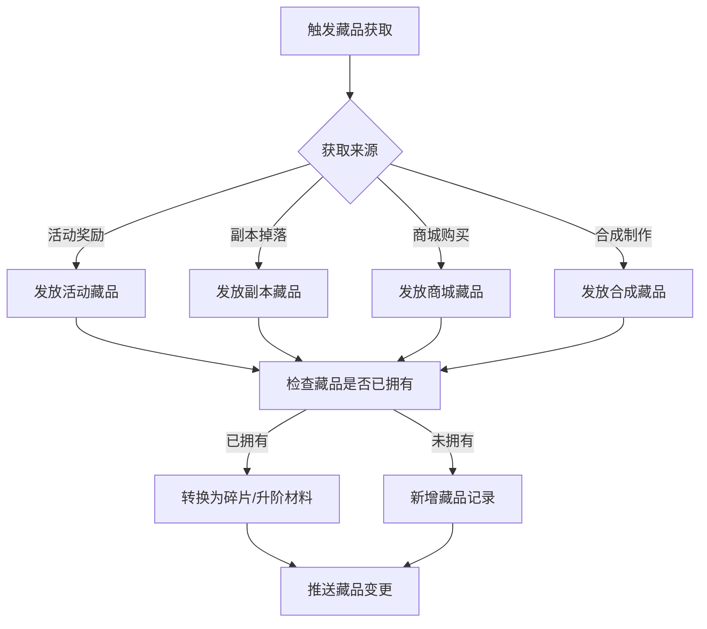

**详细步骤说明**：

1. **获取来源**
   - 活动奖励：参与活动获取限定藏品
   - 副本掉落：挑战副本随机掉落
   - 商城购买：花费货币购买
   - 合成制作：收集材料合成

2. **去重处理**
   - 已有藏品转为碎片或材料
   - 新藏品直接添加到收藏

3. **状态更新**
   - 推送藏品变更通知
   - 更新收集进度

### 3.2 藏品升级流程

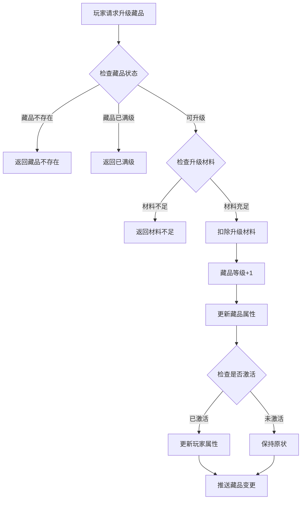

**详细步骤说明**：

1. **状态检查**
   - 验证藏品是否存在
   - 验证是否达到等级上限

2. **材料消耗**
   - 检查材料数量是否充足
   - 扣除升级所需材料

3. **升级效果**
   - 藏品等级提升
   - 属性值增加

### 3.3 藏品激活流程

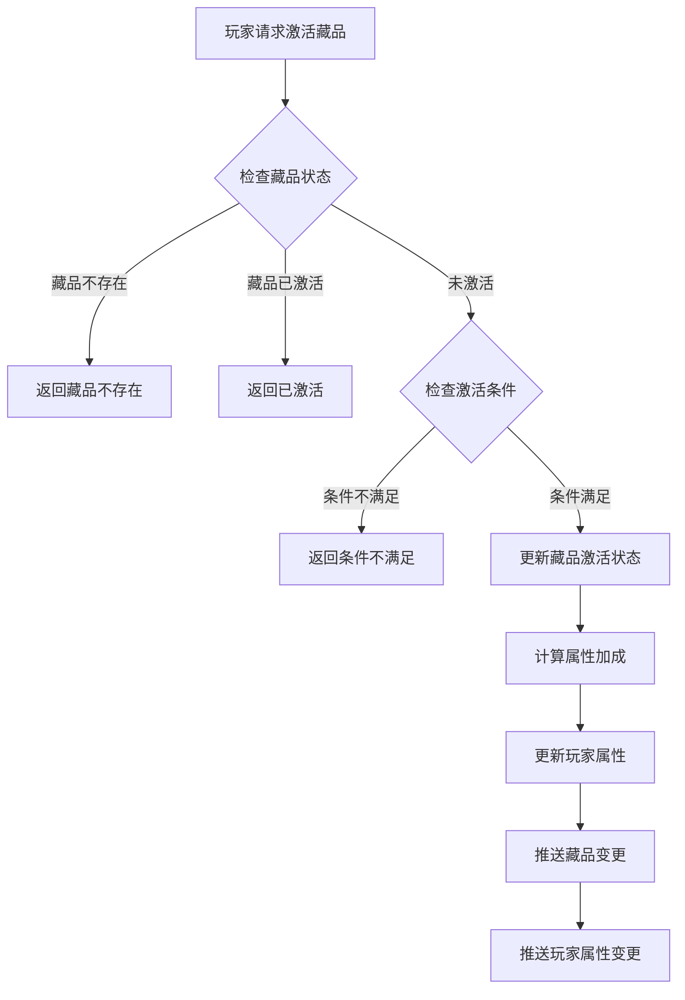

**详细步骤说明**：

1. **状态检查**
   - 验证藏品是否存在
   - 验证是否已激活

2. **条件验证**
   - 检查等级是否满足
   - 检查是否有足够激活材料

3. **激活效果**
   - 藏品激活状态变更
   - 属性加成生效

### 3.4 展示管理流程

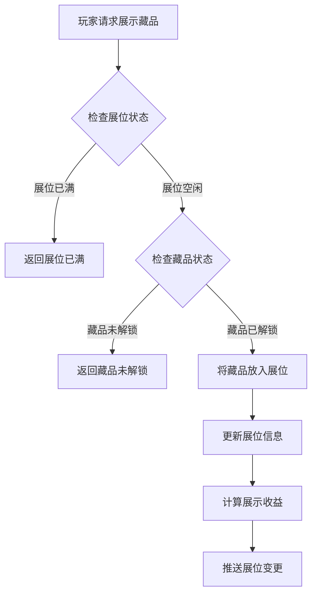

**详细步骤说明**：

1. **展位检查**
   - 验证展位是否可用
   - 验证展位数量限制

2. **藏品验证**
   - 验证藏品是否已解锁
   - 验证藏品是否可用

3. **展示效果**
   - 更新展位显示
   - 计算展示收益

---

## 四、关键规则

### 4.1 藏品分类规则

1. **稀有度分类**
   - 普通：白色品质，基础属性
   - 稀有：蓝色品质，较高属性
   - 史诗：紫色品质，高额属性
   - 传说：橙色品质，顶级属性

2. **类型分类**
   - 武器类：提升攻击属性
   - 防具类：提升防御属性
   - 饰品类：提升特殊属性
   - 艺术品类：提升综合属性

### 4.2 藏品升级规则

1. **等级限制**
   - 不同稀有度有不同等级上限
   - 普通：最高 10 级
   - 稀有：最高 20 级
   - 史诗：最高 30 级
   - 传说：最高 50 级

2. **材料消耗**
   - 升级需要消耗对应材料
   - 等级越高消耗越多

3. **属性成长**
   - 每级属性按配置增长
   - 高稀有度成长更高

### 4.3 藏品激活规则

1. **激活条件**
   - 达到指定等级
   - 消耗激活材料
   - 完成特定任务

2. **激活效果**
   - 获得永久属性加成
   - 解锁藏品特殊效果

3. **激活限制**
   - 同类型藏品激活上限
   - 部分藏品需要前置激活

### 4.4 展示规则

1. **展位限制**
   - 展位数量有上限
   - 可通过升级博物馆扩展

2. **展示收益**
   - 展示藏品获得额外收益
   - 稀有度越高收益越多

---

## 五、用户故事

### 5.1 收藏玩家故事

> 作为一名热爱收藏的玩家，我每天都会查看博物馆的收集进度。今天我通过副本掉落获得了一件稀有藏品——"古代长剑"，这是我收藏品列表中的第 50 件藏品。看着博物馆中越来越多的藏品，我感到非常有成就感。接下来我的目标是收集全部传说级藏品。

### 5.2 属性追求玩家故事

> 作为一名追求实力的玩家，我非常重视藏品带来的属性加成。我优先升级和激活那些提供攻击力加成的藏品。经过一段时间的培养，我的攻击力提升了 15%，在战斗中明显感觉更强了。博物馆系统让我在不增加装备的情况下也能提升实力。

### 5.3 展示玩家故事

> 作为一名喜欢展示的玩家，我会把最稀有、最珍贵的藏品放在展位上展示。其他玩家参观我的博物馆时都能看到这些藏品，这让我感到非常自豪。有时候还有玩家专门来询问某件藏品的获取途径，我会热心地告诉他们。

---

## 六、示例

### 6.1 藏品获取示例

**输入数据**：
- 获取来源：活动奖励
- 藏品ID：10001
- 藏品名称：古代长剑
- 稀有度：稀有（蓝色）

**获取结果**：
```
藏品ID：10001
藏品名称：古代长剑
稀有度：稀有
等级：1
状态：未激活
属性加成：攻击+10
```

### 6.2 藏品升级示例

**初始状态**：
```
藏品：古代长剑（ID: 10001）
当前等级：5
当前属性：攻击+50
```

**升级操作**：
```
目标等级：6
消耗材料：藏品碎片 × 10、金币 × 500
```

**升级结果**：
```
等级：6
属性：攻击+60（+10）
材料已扣除
```

### 6.3 藏品激活示例

**激活条件**：
```
藏品：古代长剑（ID: 10001）
等级要求：5级
材料消耗：激活石 × 1
```

**激活结果**：
```
激活状态：已激活
属性加成：攻击+50（永久生效）
特殊效果：暴击率+2%
```

### 6.4 展示管理示例

**展示操作**：
```
展位：#3
藏品：传说王冠（ID: 20001）
稀有度：传说
```

**展示结果**：
```
展位状态：已展示
展示收益：金币 × 100/小时
访客可见：是
```

---

---

## 七、系统架构图

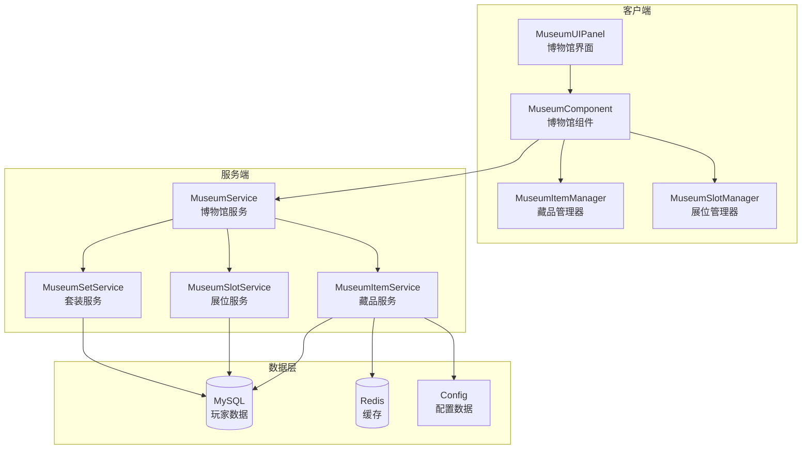

---

## 八、数据流程图

### 8.1 藏品获取数据流

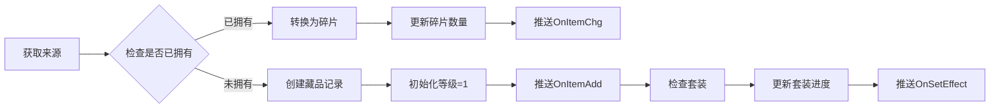

### 8.2 属性计算数据流

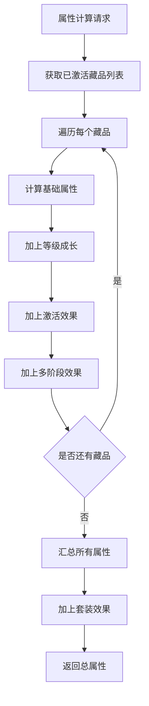

---

## 九、配置示例汇总

### 9.1 完整藏品配置示例

```json
{
    "item_id": 10001,
    "item_name": "古代长剑",
    "item_desc": "一把古老的长剑，剑身已布满岁月的痕迹",
    "item_type": 1,
    "rarity": 2,
    "max_level": 20,
    "base_attr": {
        "atk": 10,
        "crit_rate": 0.01
    },
    "growth_rate": {
        "atk": 2,
        "crit_rate": 0.002
    },
    "activate_condition": {
        "level": 5
    },
    "activate_cost": {
        "item:stone_activate": 1
    },
    "activate_effect": {
        "crit_dmg": 0.1
    },
    "icon": "ui/museum/item_sword_01",
    "model": "models/museum/sword_01",
    "sort_weight": 100,
    "fragment_id": 100011,
    "decompose_reward": {
        "item:frag_museum": 3
    }
}
```

### 9.2 完整套装配置示例

```json
{
    "set_id": 1,
    "set_name": "远古战士套装",
    "set_desc": "远古战士遗留的装备，蕴含着强大的力量",
    "item_ids": [10001, 10002, 20002, 30001, 40001, 40002],
    "effects": {
        "2": {
            "attr:atk": 50
        },
        "4": {
            "attr:atk": 100,
            "attr:crit_rate": 0.05
        },
        "6": {
            "attr:all_attr": 0.05
        }
    }
}
```

---

## 十、常见问题与解决方案

### 10.1 问题排查流程图

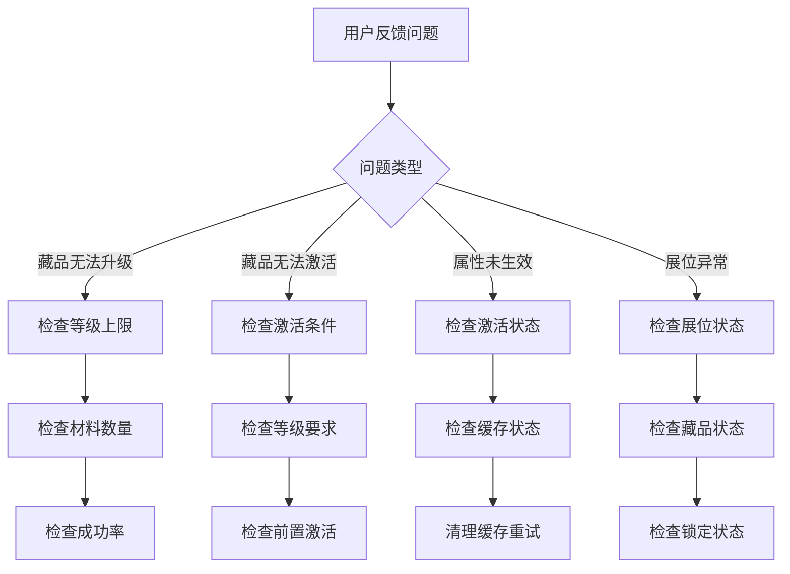

### 10.2 错误处理速查表

| 错误现象 | 可能原因 | 解决方案 |
|----------|----------|----------|
| 升级按钮灰显 | 满级或材料不足 | 检查等级和材料 |
| 激活无响应 | 条件不满足 | 查看激活条件提示 |
| 属性面板不更新 | 缓存未刷新 | 刷新界面或重登 |
| 展位无法放入 | 已在其他展位 | 先移出原展位 |
| 套装效果不显示 | 激活件数不足 | 收集更多套装件 |

---

## 十一、详细业务流程图

### 11.1 藏品获取完整业务流程

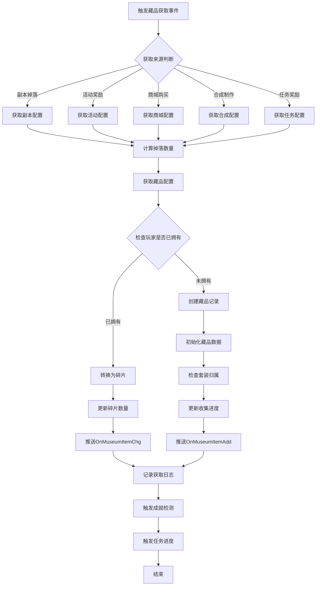

### 11.2 藏品升级完整业务流程

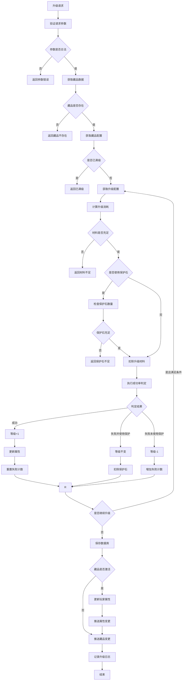

### 11.3 藏品激活完整业务流程

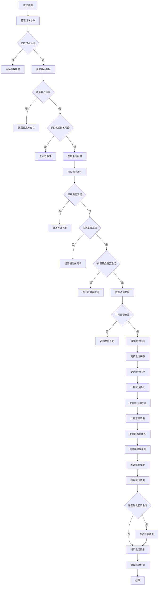

### 11.4 展位管理完整业务流程

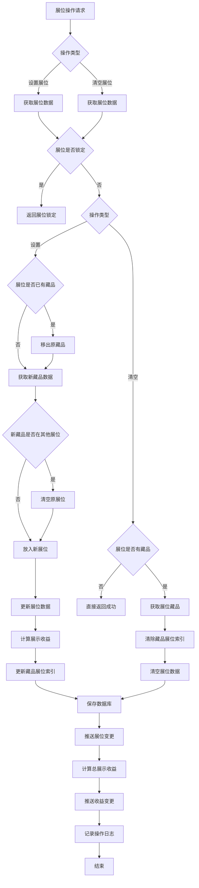

### 11.5 合成系统完整业务流程

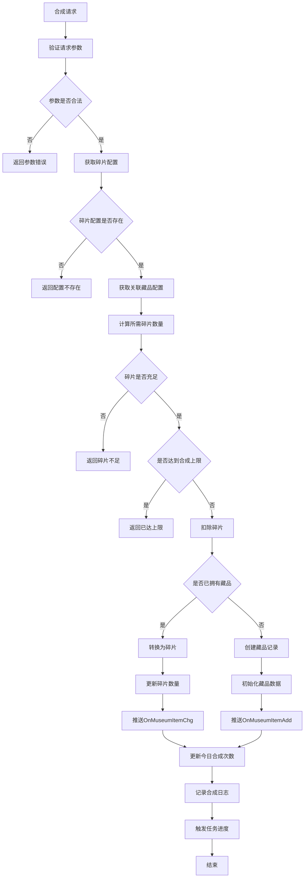

### 11.6 分解系统完整业务流程

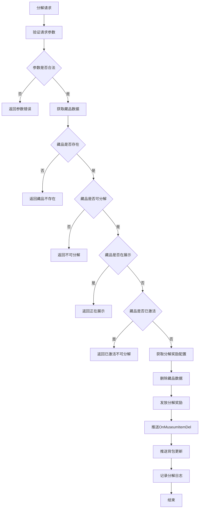

---

## 十二、系统状态转换图

### 12.1 藏品状态完整转换

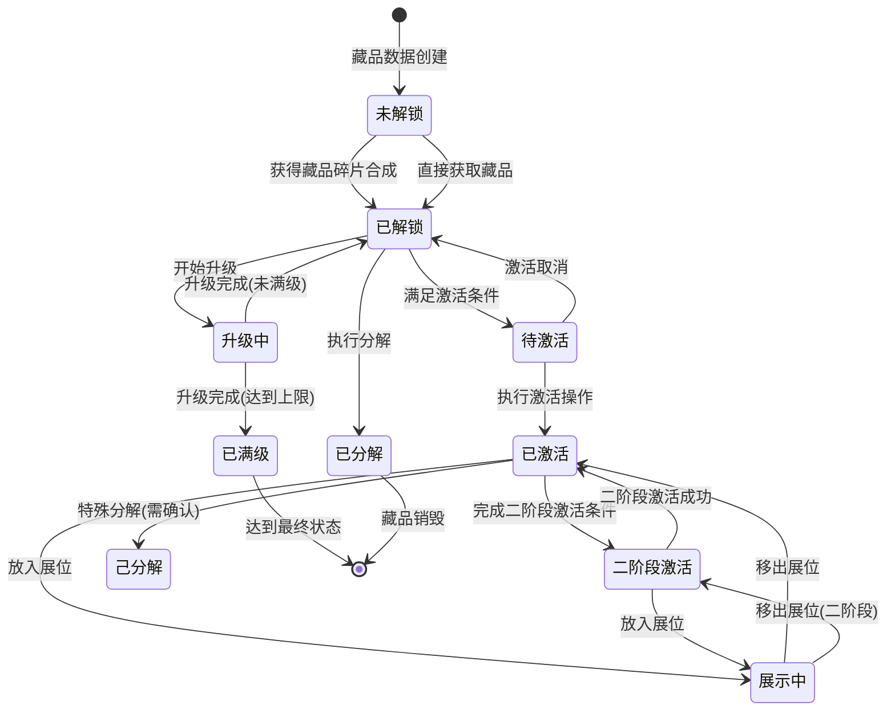

### 12.2 展位状态完整转换

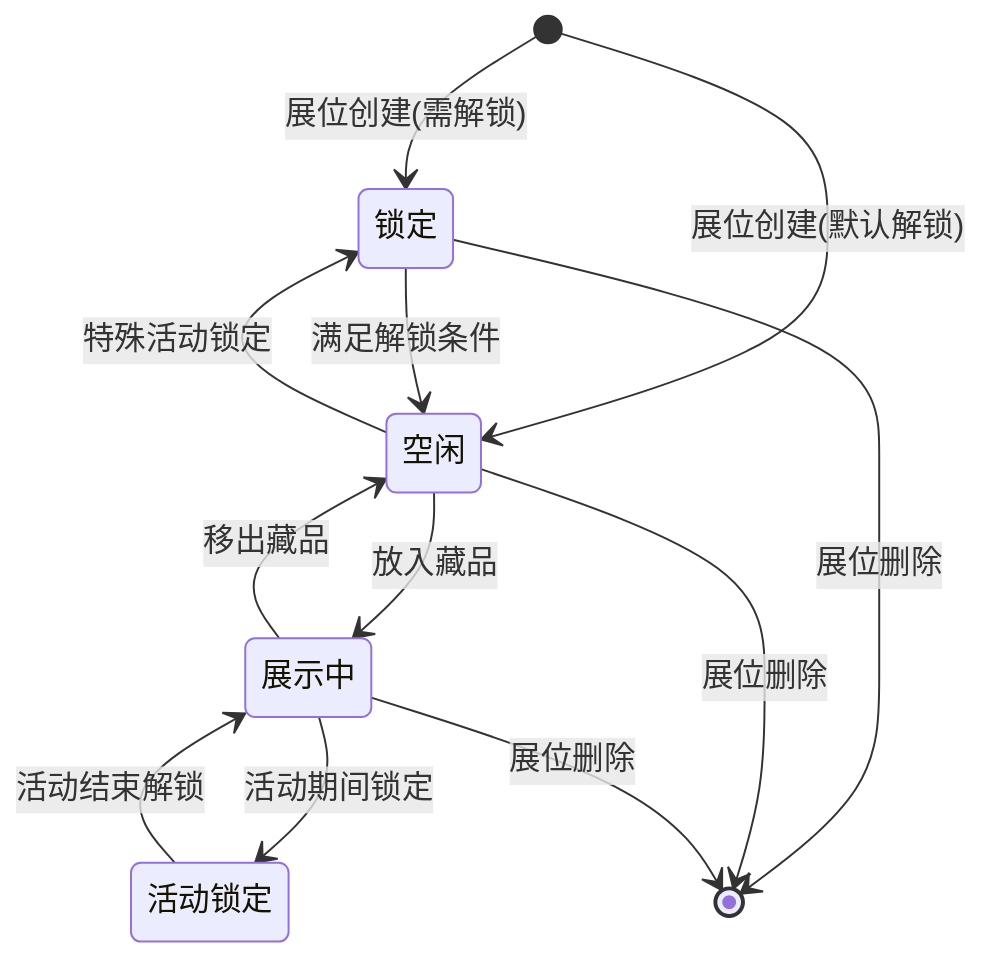

### 12.3 套装效果激活状态

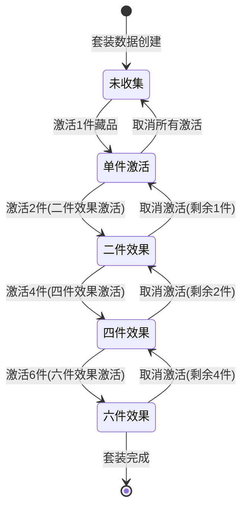

---

## 十三、系统模块依赖关系

### 13.1 模块依赖图

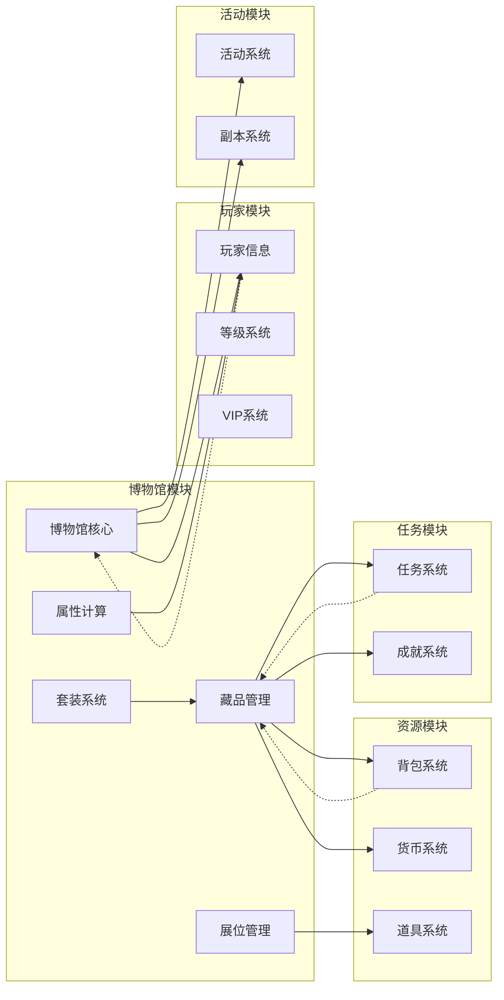

### 13.2 数据流向图

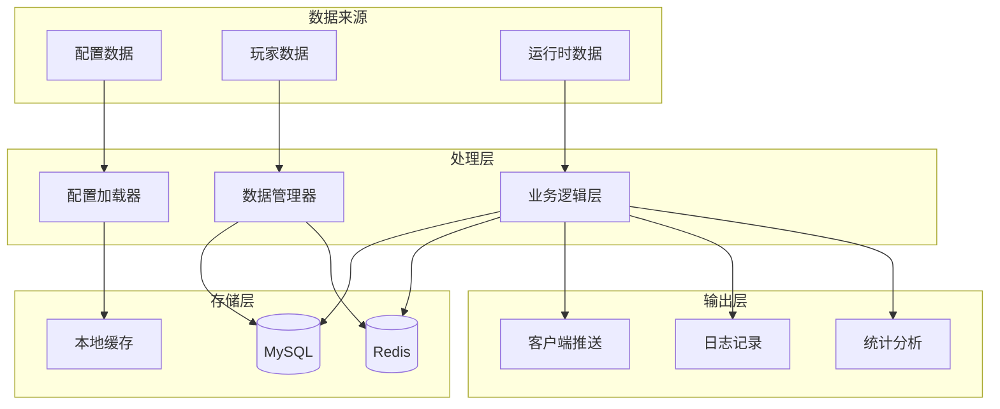

---

## 十四、常见业务场景示例

### 14.1 新玩家首次获取藏品

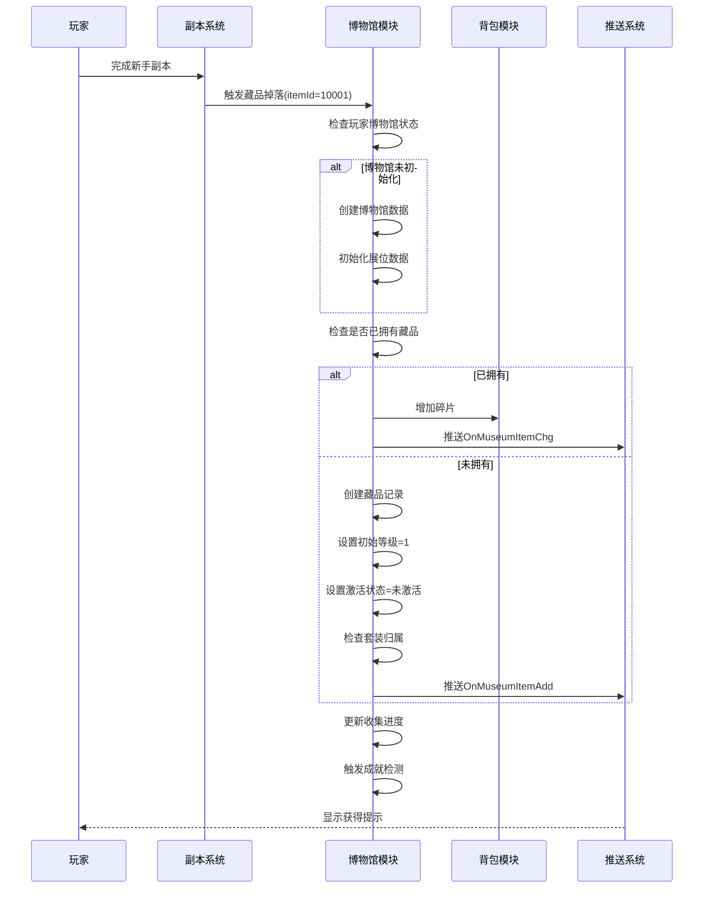

### 14.2 玩家升级藏品触发套装效果

```mermaid
sequenceDiagram
    participant Player as 玩家
    participant Client as 客户端
    participant Museum as 博物馆服务
    participant Set as 套装服务
    participant Attr as 属性服务
    participant Push as 推送服务

    Player->>Client: 点击升级按钮
    Client->>Museum: ReqMuseumItemUpgrade(itemId, count)

    Museum->>Museum: 验证升级条件
    Museum->>Museum: 扣除升级材料
    Museum->>Museum: 执行升级判定

    alt 升级成功
        Museum->>Museum: 等级+1
        Museum->>Museum: 更新属性

        alt 藏品已激活
            Museum->>Attr: 重新计算总属性
            Attr-->>Museum: 返回属性差值

            alt 达到激活等级
                Museum->>Set: 检查套装激活数
                Set->>Set: 增加激活数
                Set->>Set: 计算套装效果

                alt 新增套装效果激活
                    Set->>Push: 推送OnMuseumSetEffect
                    Set->>Attr: 应用套装效果
                end
            end

            Museum->>Push: 推送OnMuseumAttrChg
        end

        Museum->>Push: 推送OnMuseumItemChg(成功)
    else 升级失败
        Museum->>Push: 推送OnMuseumItemChg(失败)
    end

    Push-->>Client: 更新UI显示
    Client-->>Player: 显示升级结果
```

---

*文档生成时间: 2026-04-12*
*文档版本: v2.2*
