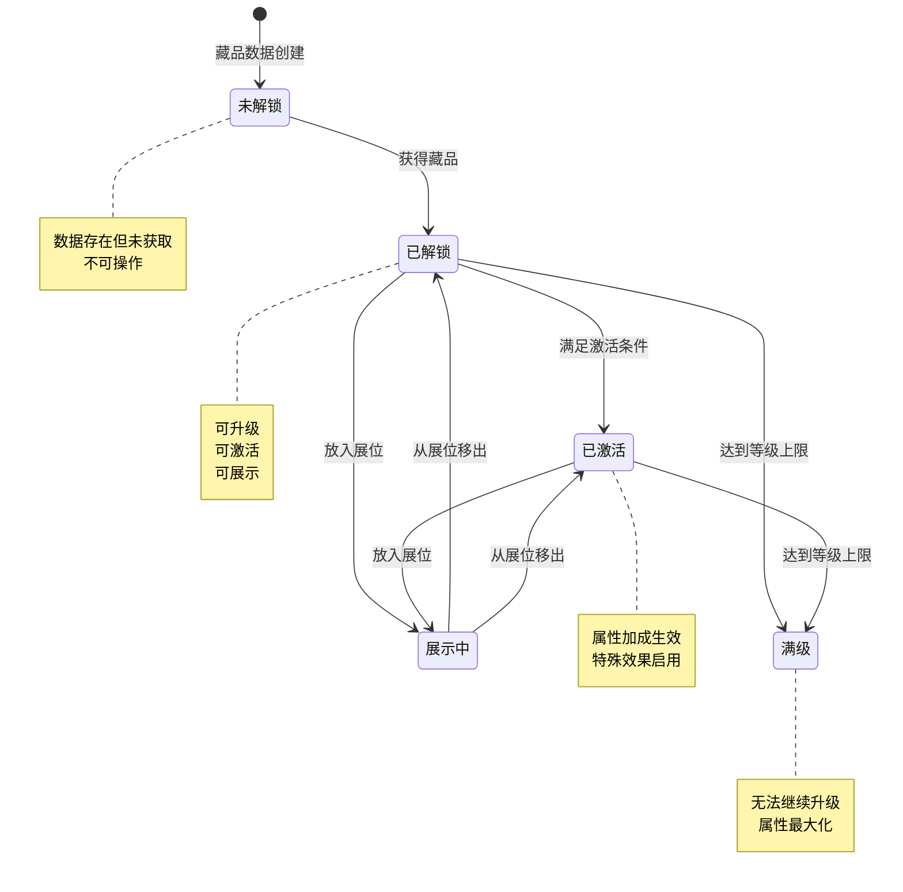
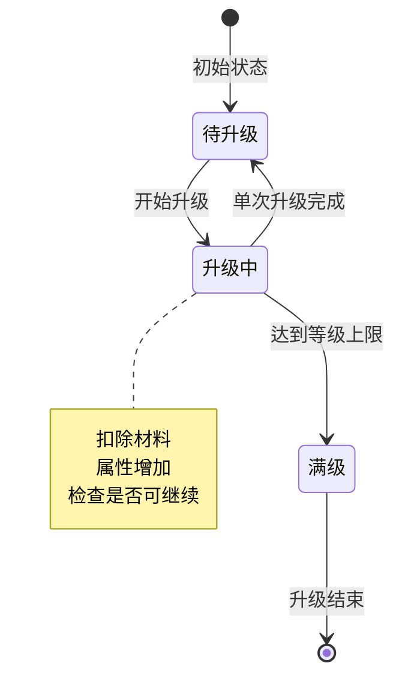
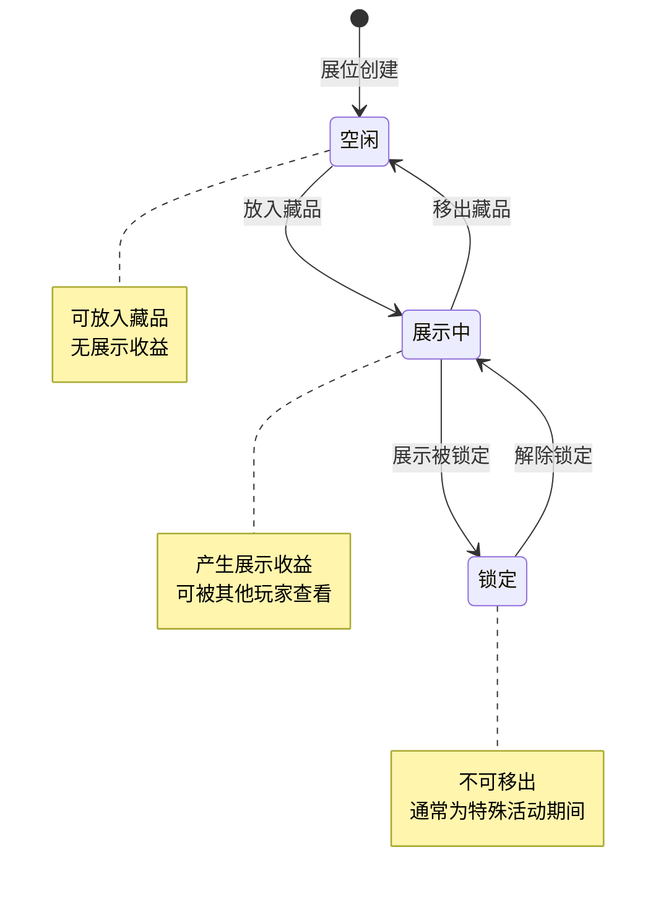
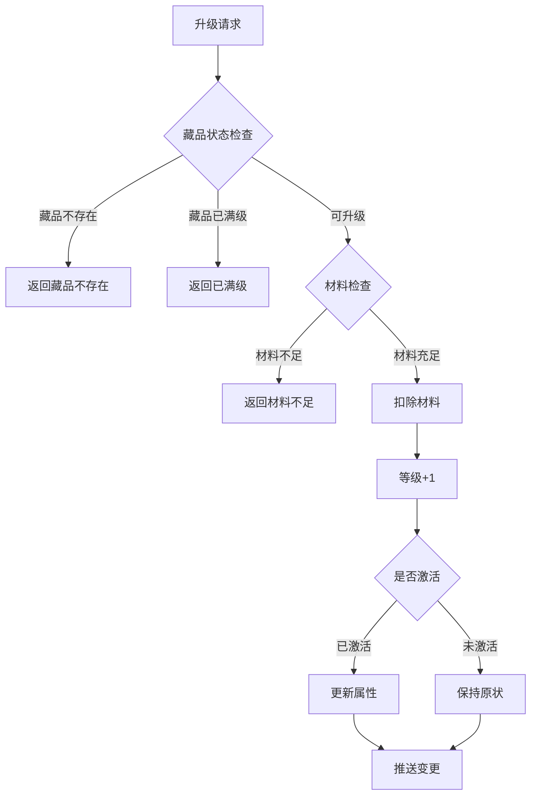
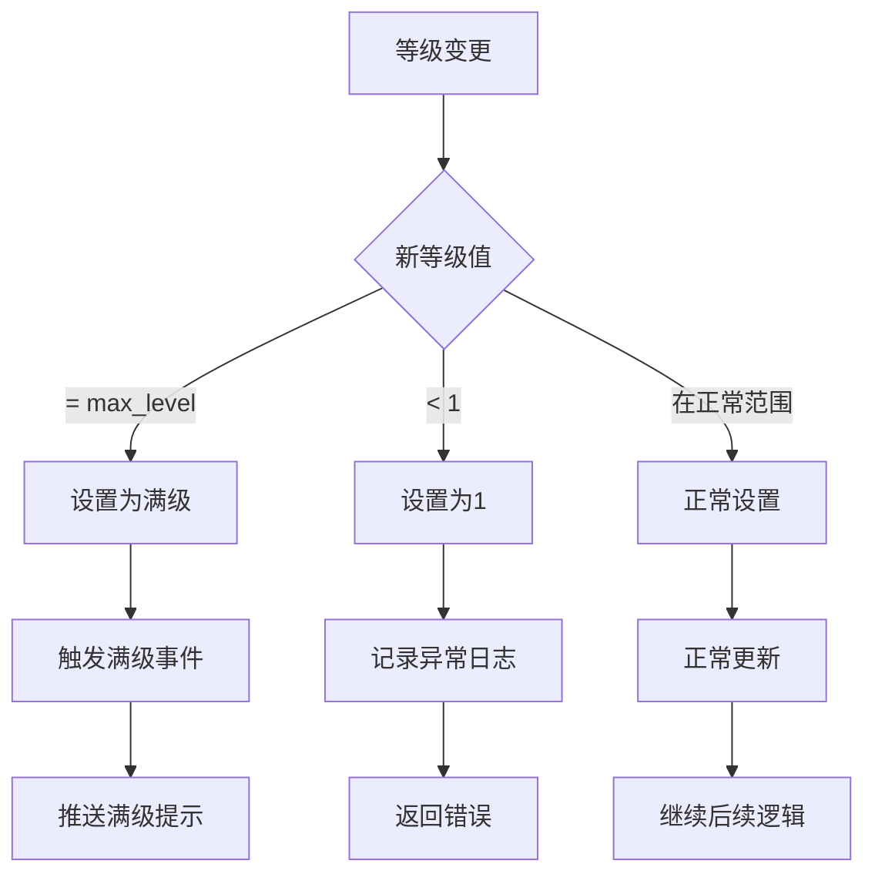
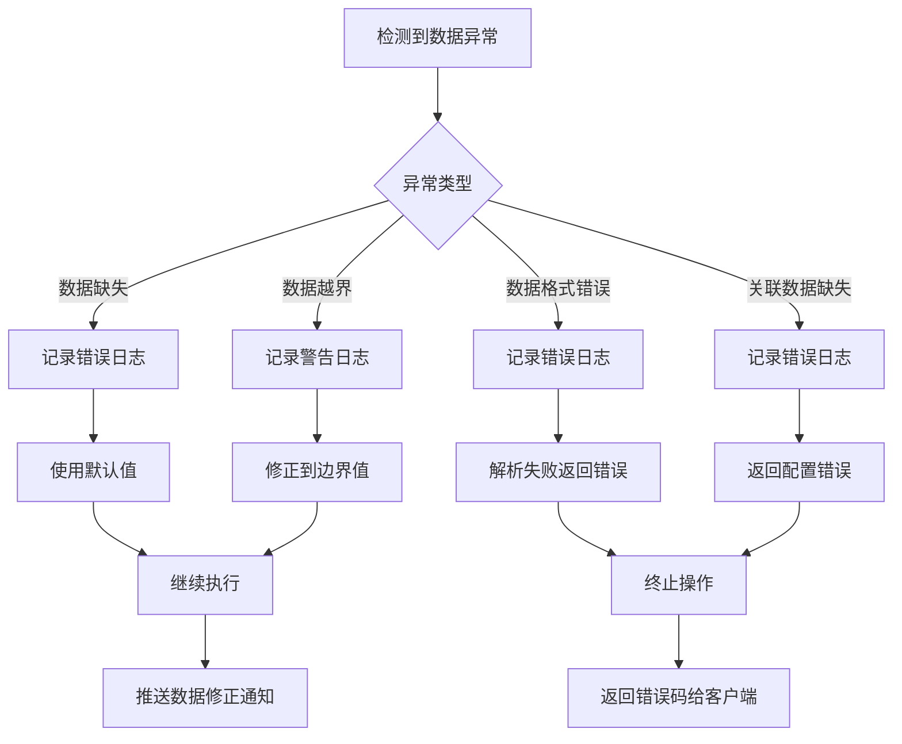
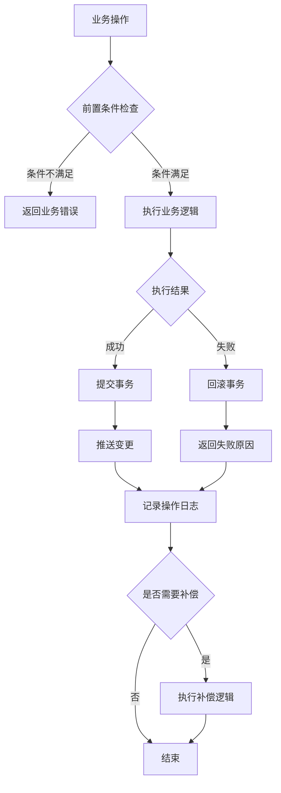

# 博物馆模块实现细节

## 一、计算公式

### 1.1 藏品升级消耗计算公式

```
消耗材料 = base_cost × level ^ cost_ratio
消耗金币 = base_gold × level
```

**参数说明**：
- `base_cost`：基础材料消耗
- `level`：目标等级
- `cost_ratio`：消耗系数

**示例计算**：
```
base_cost = 5
cost_ratio = 1.2
base_gold = 100

5级升6级：
消耗材料 = 5 × 5^1.2 = 5 × 6.9 ≈ 35
消耗金币 = 100 × 5 = 500
```

### 1.2 藏品属性计算公式

```
藏品属性 = base_attr + level × growth_rate
```

**参数说明**：
- `base_attr`：基础属性值
- `level`：藏品等级
- `growth_rate`：成长系数

**示例计算**：
```
base_attr = 10
growth_rate = 2
level = 15

藏品属性 = 10 + 15 × 2 = 40
```

### 1.3 激活属性加成计算公式

```
激活加成 = 藏品属性 × activation_ratio
```

**参数说明**：
- `activation_ratio`：激活比例（通常为100%）

**示例计算**：
```
藏品属性：攻击+40
activation_ratio = 100%

激活加成 = 40 × 100% = 40（攻击+40）
```

### 1.4 展示收益计算公式

```
展示收益/hour = base_income × rarity_multiplier × level_multiplier
```

**参数说明**：
- `base_income`：基础收益
- `rarity_multiplier`：稀有度倍率
- `level_multiplier`：等级倍率

**稀有度倍率**：
```
普通：×1.0
稀有：×1.5
史诗：×2.0
传说：×3.0
```

**示例计算**：
```
base_income = 10
稀有度：史诗（×2.0）
等级：15（×1.5）

展示收益/hour = 10 × 2.0 × 1.5 = 30金币
```

### 1.5 收集进度计算公式

```
收集进度 = 已收集数量 / 总数量 × 100%
```

**示例计算**：
```
已收集：45件
总数量：150件

收集进度 = 45 / 150 × 100% = 30%
```

---

## 二、状态机定义

### 2.1 藏品状态机



### 2.2 升级状态机



### 2.3 展示状态机



---

## 三、数据约束

### 3.1 藏品数据约束

| 字段名 | 数据类型 | 取值范围 | 必填 | 唯一性 | 说明 |
|--------|----------|----------|------|--------|------|
| itemId | int | > 0 | 是 | 是 | 藏品配置ID |
| level | int | 1-50 | 是 | 否 | 藏品等级 |
| isActive | bool | - | 是 | 否 | 是否激活 |
| unlockTime | datetime | - | 是 | 否 | 解锁时间 |
| slotIndex | int | >= 0 | 否 | 否 | 展位索引 |

### 3.2 藏品配置约束

| 字段名 | 数据类型 | 取值范围 | 必填 | 说明 |
|--------|----------|----------|------|------|
| item_id | int | > 0 | 是 | 藏品ID |
| item_name | string | 1-50字符 | 是 | 藏品名称 |
| item_type | int | 1-4 | 是 | 类型：1武器,2防具,3饰品,4艺术 |
| rarity | int | 1-4 | 是 | 稀有度 |
| max_level | int | 10-50 | 是 | 最大等级 |
| base_attr | json | - | 是 | 基础属性 |
| growth_rate | json | - | 是 | 成长系数 |
| activate_condition | json | - | 否 | 激活条件 |

### 3.3 展位数据约束

| 字段名 | 数据类型 | 取值范围 | 必填 | 说明 |
|--------|----------|----------|------|------|
| slotIndex | int | 0-19 | 是 | 展位索引 |
| itemId | int | >= 0 | 是 | 藏品ID（0表示空闲） |
| isLocked | bool | - | 是 | 是否锁定 |
| displayTime | datetime | - | 否 | 展示开始时间 |

### 3.4 升级配置约束

| 字段名 | 数据类型 | 取值范围 | 必填 | 说明 |
|--------|----------|----------|------|------|
| item_id | int | > 0 | 是 | 藏品ID |
| level | int | 1-50 | 是 | 等级 |
| cost_list | json | - | 是 | 升级消耗 |
| attr_add | json | - | 是 | 属性加成 |

---

## 四、错误处理策略

### 4.1 博物馆模块错误码

| 错误码 | 错误信息 | 处理策略 | 用户提示 |
|--------|----------|----------|----------|
| 35001 | 藏品不存在 | 检查藏品ID有效性 | "藏品数据异常，请刷新重试" |
| 35002 | 藏品已满级 | 检查等级上限 | "该藏品已达最高等级" |
| 35003 | 升级材料不足 | 检查材料数量 | "升级材料不足" |
| 35004 | 藏品已激活 | 检查激活状态 | "该藏品已激活" |
| 35005 | 激活条件不满足 | 检查激活条件 | "激活条件不满足" |
| 35006 | 展位已满 | 检查展位状态 | "展位已满，请先移出藏品" |
| 35007 | 藏品未解锁 | 检查解锁状态 | "该藏品尚未解锁" |
| 35008 | 展位被锁定 | 检查锁定状态 | "该展位已被锁定" |

### 4.2 藏品升级错误处理流程



### 4.3 藏品激活错误处理

| 激活状态 | 处理策略 | 后续操作 |
|----------|----------|----------|
| 未解锁 | 拒绝激活请求 | 无 |
| 已激活 | 提示已激活 | 无 |
| 条件不满足 | 列出缺失条件 | 引导获取 |
| 条件满足 | 执行激活 | 更新属性 |

---

## 五、关键代码示例

### 5.1 藏品升级伪代码

```csharp
public Result UpgradeItem(long playerId, int itemId)
{
    // 1. 获取藏品数据
    MuseumItemInfo item = museumMgr.GetItem(playerId, itemId);
    if (item == null)
        return Result.Error(35001, "藏品不存在");

    // 2. 检查等级上限
    MuseumItemConfig config = configMgr.GetItemConfig(itemId);
    if (item.level >= config.maxLevel)
        return Result.Error(35002, "藏品已满级");

    // 3. 计算升级消耗
    UpgradeCost cost = CalculateUpgradeCost(config, item.level);

    // 4. 检查材料
    if (!resourceMgr.HasEnough(playerId, cost))
        return Result.Error(35003, "升级材料不足");

    // 5. 扣除材料
    resourceMgr.Cost(playerId, cost, "藏品升级");

    // 6. 升级
    item.level++;

    // 7. 如果已激活，更新玩家属性
    if (item.isActive)
    {
        UpdatePlayerAttribute(playerId, item);
    }

    // 8. 保存并推送
    museumMgr.UpdateItem(playerId, item);
    PushItemChg(playerId, itemId, item.level, item.isActive);

    return Result.Success(item);
}
```

### 5.2 藏品激活伪代码

```csharp
public Result ActiveItem(long playerId, int itemId)
{
    // 1. 获取藏品数据
    MuseumItemInfo item = museumMgr.GetItem(playerId, itemId);
    if (item == null)
        return Result.Error(35001, "藏品不存在");

    // 2. 检查激活状态
    if (item.isActive)
        return Result.Error(35004, "藏品已激活");

    // 3. 检查激活条件
    MuseumItemConfig config = configMgr.GetItemConfig(itemId);
    if (!CheckActivateCondition(playerId, item, config))
        return Result.Error(35005, "激活条件不满足");

    // 4. 消耗激活材料（如果有）
    if (config.activateCost != null)
    {
        if (!resourceMgr.HasEnough(playerId, config.activateCost))
            return Result.Error(35003, "激活材料不足");
        resourceMgr.Cost(playerId, config.activateCost, "藏品激活");
    }

    // 5. 激活
    item.isActive = true;

    // 6. 更新玩家属性
    ApplyItemAttribute(playerId, item, config);

    // 7. 保存并推送
    museumMgr.UpdateItem(playerId, item);
    PushItemChg(playerId, itemId, item.level, item.isActive);
    PushPlayerAttrChg(playerId);

    return Result.Success(item);
}
```

### 5.3 展示管理伪代码

```csharp
public Result SetDisplaySlot(long playerId, int slotIndex, int itemId)
{
    // 1. 检查展位
    if (slotIndex < 0 || slotIndex >= GetMaxSlots(playerId))
        return Result.Error(35006, "展位索引无效");

    // 2. 获取展位状态
    DisplaySlot slot = museumMgr.GetSlot(playerId, slotIndex);
    if (slot.isLocked)
        return Result.Error(35008, "展位被锁定");

    // 3. 如果要放入藏品
    if (itemId > 0)
    {
        MuseumItemInfo item = museumMgr.GetItem(playerId, itemId);
        if (item == null)
            return Result.Error(35001, "藏品不存在");

        // 检查藏品是否已解锁
        if (item.unlockTime == null)
            return Result.Error(35007, "藏品未解锁");

        // 如果藏品已在其他展位，先移出
        if (item.slotIndex >= 0 && item.slotIndex != slotIndex)
        {
            ClearSlot(playerId, item.slotIndex);
        }

        // 放入展位
        slot.itemId = itemId;
        slot.displayTime = DateTime.Now;
        item.slotIndex = slotIndex;
    }
    else
    {
        // 清空展位
        if (slot.itemId > 0)
        {
            MuseumItemInfo oldItem = museumMgr.GetItem(playerId, slot.itemId);
            if (oldItem != null)
                oldItem.slotIndex = -1;
        }
        slot.itemId = 0;
        slot.displayTime = null;
    }

    // 保存并推送
    museumMgr.UpdateSlot(playerId, slot);
    PushSlotChg(playerId, slot);

    return Result.Success(slot);
}
```

### 5.4 属性计算伪代码

```csharp
public Dictionary<AttrType, long> CalculateTotalAttribute(long playerId)
{
    Dictionary<AttrType, long> totalAttr = new Dictionary<AttrType, long>();

    // 获取所有已激活藏品
    List<MuseumItemInfo> activeItems = museumMgr.GetActiveItems(playerId);

    foreach (var item in activeItems)
    {
        MuseumItemConfig config = configMgr.GetItemConfig(item.itemId);
        if (config == null) continue;

        // 计算单品属性
        foreach (var attr in config.baseAttr)
        {
            long value = attr.Value + item.level * config.growthRate[attr.Key];
            if (!totalAttr.ContainsKey(attr.Key))
                totalAttr[attr.Key] = 0;
            totalAttr[attr.Key] += value;
        }

        // 计算激活效果
        if (item.isActive && config.activateEffect != null)
        {
            foreach (var effect in config.activateEffect)
            {
                if (!totalAttr.ContainsKey(effect.Key))
                    totalAttr[effect.Key] = 0;
                totalAttr[effect.Key] += effect.Value;
            }
        }
    }

    return totalAttr;
}
```

### 5.5 展示收益计算伪代码

```csharp
public long CalculateDisplayIncome(long playerId)
{
    long totalIncome = 0;
    int baseIncome = 10; // 基础收益/小时

    List<DisplaySlot> slots = museumMgr.GetSlots(playerId);
    foreach (var slot in slots)
    {
        if (slot.itemId <= 0) continue;

        MuseumItemInfo item = museumMgr.GetItem(playerId, slot.itemId);
        MuseumItemConfig config = configMgr.GetItemConfig(slot.itemId);

        if (item == null || config == null) continue;

        // 稀有度倍率
        double rarityMult = GetRarityMultiplier(config.rarity);

        // 等级倍率
        double levelMult = 1.0 + (item.level - 1) * 0.05;

        // 计算收益
        long income = (long)(baseIncome * rarityMult * levelMult);
        totalIncome += income;
    }

    return totalIncome;
}
```

---

## 六、跨模块依赖

### 6.1 依赖模块

| 模块名称 | 依赖方式 | 说明 |
|----------|----------|------|
| Module_Player | 属性更新 | 激活藏品更新玩家属性 |
| Module_NPResource | 资源消耗 | 升级消耗材料和金币 |
| Module_Bag | 道具关联 | 藏品碎片和材料管理 |

### 6.2 被依赖模块

| 模块名称 | 依赖方式 | 说明 |
|----------|----------|------|
| Module_Player | 属性加成 | 玩家属性计算时引用 |
| Module_Battle | 战斗属性 | 战斗中应用藏品加成 |

---

---

## 七、服务端伪代码实现

### 7.1 升级服务端伪代码

```java
/**
 * 藏品升级服务端实现
 */
public UpgradeResult upgradeItem(long playerId, int itemId, int count, boolean useProtect) {
    // 1. 获取藏品数据
    PlayerMuseumItem item = itemDao.selectByPlayerAndItem(playerId, itemId);
    if (item == null) {
        return error(35001, "藏品不存在");
    }

    // 2. 获取配置
    RefMuseumItem config = RefMuseumItem.get(itemId);
    if (item.level >= config.maxLevel) {
        return error(35002, "已满级");
    }

    // 3. 循环升级
    int successCount = 0;
    while (successCount < count && item.level < config.maxLevel) {
        RefMuseumItemUpgrade upgrade = RefMuseumItemUpgrade.get(itemId, item.level + 1);

        // 检查材料
        if (!hasEnough(playerId, upgrade.costList)) {
            break;
        }

        // 扣除材料
        costItems(playerId, upgrade.costList);

        // 判定成功
        if (random() < upgrade.successRate) {
            item.level++;
            successCount++;
        } else {
            // 失败处理
            if (!useProtect) {
                item.level = max(1, item.level - 1);
            }
        }
    }

    // 4. 更新数据
    itemDao.update(item);

    // 5. 如果已激活，更新属性
    if (item.isActive) {
        updatePlayerAttr(playerId);
    }

    // 6. 推送变更
    push(playerId, new OnMuseumItemChg(item));

    return success(successCount);
}
```

### 7.2 激活服务端伪代码

```java
/**
 * 藏品激活服务端实现
 */
public ActivateResult activateItem(long playerId, int itemId, int stage) {
    // 1. 获取藏品
    PlayerMuseumItem item = itemDao.selectByPlayerAndItem(playerId, itemId);
    if (item == null) {
        return error(35001, "藏品不存在");
    }

    if (item.activeStage >= stage) {
        return error(35004, "已激活该阶段");
    }

    // 2. 获取激活配置
    RefMuseumItemActive active = RefMuseumItemActive.get(itemId, stage);

    // 3. 检查条件
    if (active.condition.level > item.level) {
        return error(35005, "等级不足");
    }

    // 4. 扣除消耗
    costItems(playerId, active.cost);

    // 5. 更新状态
    if (stage == 1) {
        item.isActive = true;
    }
    item.activeStage = stage;
    itemDao.update(item);

    // 6. 更新套装
    updateSetEffect(playerId, itemId, true);

    // 7. 更新属性
    Map<Integer, Long> attr = calculateTotalAttr(playerId);
    updatePlayerAttr(playerId, attr);

    // 8. 推送
    push(playerId, new OnMuseumItemChg(item));
    push(playerId, new OnMuseumAttrChg(attr));

    return success(attr);
}
```

### 7.3 属性计算服务端伪代码

```java
/**
 * 计算总属性加成
 */
public Map<AttrType, Long> calculateTotalAttr(long playerId) {
    Map<AttrType, Long> total = new HashMap<>();

    // 1. 获取所有已激活藏品
    List<PlayerMuseumItem> items = itemDao.selectActiveByPlayer(playerId);

    // 2. 累加每个藏品的属性
    for (PlayerMuseumItem item : items) {
        RefMuseumItem config = RefMuseumItem.get(item.itemId);

        // 基础属性 + 等级成长
        for (Attr attr : config.baseAttr) {
            long value = attr.value + (item.level - 1) * config.growthRate.get(attr.type);
            total.add(attr.type, value);
        }

        // 激活效果
        if (config.activateEffect != null) {
            total.add(config.activateEffect);
        }

        // 多阶段效果
        for (int s = 1; s <= item.activeStage; s++) {
            RefMuseumItemActive active = RefMuseumItemActive.get(item.itemId, s);
            if (active.reward != null) {
                total.add(active.reward);
            }
        }
    }

    // 3. 加上套装效果
    List<PlayerMuseumSet> sets = setDao.selectByPlayer(playerId);
    for (PlayerMuseumSet set : sets) {
        RefMuseumItemSet config = RefMuseumItemSet.get(set.setId);
        for (Entry<Integer, Attr> effect : config.effects) {
            if (set.activeCount >= effect.key) {
                total.add(effect.value);
            }
        }
    }

    return total;
}
```

---

## 八、客户端伪代码实现

### 8.1 组件初始化伪代码

```csharp
/// <summary>
/// 博物馆组件初始化
/// </summary>
public void init() {
    // 1. 创建管理器
    itemMgr = new MuseumItemManager();
    slotMgr = new MuseumSlotManager();
    setMgr = new MuseumSetManager();

    // 2. 注册协议监听
    addProtoListener<OnMuseumInfo>(onMuseumInfo);
    addProtoListener<OnMuseumItemAdd>(onItemAdd);
    addProtoListener<OnMuseumItemChg>(onItemChg);
    addProtoListener<OnMuseumItemDel>(onItemDel);
    addProtoListener<OnMuseumSlotChg>(onSlotChg);
    addProtoListener<OnMuseumAttrChg>(onAttrChg);
    addProtoListener<OnMuseumSetEffect>(onSetEffect);

    // 3. 注册事件监听
    addEventListener(EventID.LoginSuccess, onLoginSuccess);
}
```

### 8.2 UI更新伪代码

```csharp
/// <summary>
/// 藏品变更处理
/// </summary>
private void onItemChg(OnMuseumItemChg msg) {
    // 1. 更新数据
    itemMgr.updateItem(msg);

    // 2. 标记缓存脏
    attrCacheDirty = true;

    // 3. 派发事件
    dispatch(EventID.MuseumItemChg, msg.itemId);

    // 4. 显示升级结果
    if (msg.upgradeResult != 0) {
        showUpgradeResult(msg.upgradeResult);
    }
}

/// <summary>
/// 刷新UI
/// </summary>
private void refreshUI() {
    // 1. 更新顶部信息
    updateTopInfo();

    // 2. 更新列表
    refreshItemList();

    // 3. 更新详情
    if (currentItem != null) {
        updateDetailUI(currentItem);
    }
}
```

---

## 九、数据库索引优化

### 9.1 索引设计

```sql
-- 玩家藏品表索引
CREATE UNIQUE INDEX uk_player_item ON player_museum_item(player_id, item_id);
CREATE INDEX idx_player_active ON player_museum_item(player_id, is_active);
CREATE INDEX idx_player_slot ON player_museum_item(player_id, slot_index);

-- 玩家展位表索引
CREATE UNIQUE INDEX uk_player_slot ON player_museum_slot(player_id, museum_id, slot_index);
CREATE INDEX idx_player_museum ON player_museum_slot(player_id, museum_id);

-- 玩家套装表索引
CREATE UNIQUE INDEX uk_player_set ON player_museum_set(player_id, set_id);
```

### 9.2 查询优化

```sql
-- 优化：获取已激活藏品（使用索引）
SELECT * FROM player_museum_item
WHERE player_id = ? AND is_active = 1;

-- 优化：批量获取藏品
SELECT * FROM player_museum_item
WHERE player_id = ? AND item_id IN (?, ?, ?);

-- 优化：获取展位信息
SELECT * FROM player_museum_slot
WHERE player_id = ? AND museum_id = ?
ORDER BY slot_index;
```

---

## 十、性能测试基准

### 10.1 服务端性能指标

| 操作 | 目标响应时间 | 目标TPS |
|------|--------------|---------|
| 获取博物馆信息 | < 50ms | 500 |
| 获取藏品列表 | < 100ms | 300 |
| 升级藏品 | < 200ms | 200 |
| 激活藏品 | < 200ms | 150 |
| 设置展位 | < 100ms | 300 |

### 10.2 客户端性能指标

| 操作 | 目标帧率 | 目标内存 |
|------|----------|----------|
| 打开博物馆界面 | > 30fps | < 50MB |
| 滚动藏品列表(100项) | > 30fps | < 100MB |
| 批量升级(10次) | > 30fps | < 50MB |

---

## 十一、完整计算公式体系

### 11.1 藏品属性计算公式

#### 11.1.1 基础属性计算公式

```
基础属性 = base_attr + (level - 1) × growth_rate
```

**参数说明**：
- `base_attr`：配置中的基础属性值
- `level`：藏品当前等级
- `growth_rate`：每级成长值

**计算示例**：
```
base_attr = 10 (攻击力)
growth_rate = 2 (每级攻击力成长)
level = 15

基础属性 = 10 + (15 - 1) × 2 = 10 + 28 = 38 (攻击力)
```

#### 11.1.2 激活效果计算公式

```
激活后属性 = 基础属性 + activate_effect
```

**激活效果类型**：
| 效果类型 | 计算方式 | 示例 |
|----------|----------|------|
| 固定值加成 | 直接加法 | 暴击伤害+10% |
| 百分比加成 | 基础属性×百分比 | 全属性+5% |
| 特殊效果 | 触发条件判定 | 免疫控制10% |

**多阶段激活计算**：
```
总激活效果 = Σ(各阶段激活效果)
```

**计算示例**：
```
一阶段激活效果: crit_dmg + 0.1
二阶段激活效果: penetrate + 0.05
三阶段激活效果: all_attr + 0.05

总激活效果 = crit_dmg + 0.1 + penetrate + 0.05 + all_attr + 0.05
```

#### 11.1.3 套装效果计算公式

```
套装激活条件: active_count >= need_count
套装效果 = 对应件数的效果值
```

**套装效果叠加规则**：
```
总套装效果 = Σ(已激活的各件数效果)
```

**计算示例**：
```
套装配置:
  2件: atk + 50
  4件: atk + 100, crit_rate + 0.05
  6件: all_attr + 0.05

当激活5件时:
  激活效果 = (atk + 50) + (atk + 100, crit_rate + 0.05)
         = atk + 150, crit_rate + 0.05
```

### 11.2 升级系统计算公式

#### 11.2.1 升级消耗计算公式

```
材料消耗 = cost_list[level]
金币消耗 = cost_list.gold[level]
```

**消耗递增规则**：
```
cost(level) = base_cost × level^cost_ratio
```

**参数说明**：
- `base_cost`：基础消耗
- `level`：目标等级
- `cost_ratio`：消耗递增系数（通常为1.2-1.5）

**计算示例**：
```
base_cost = 5 (碎片)
cost_ratio = 1.2
target_level = 10

cost = 5 × 10^1.2 = 5 × 15.85 ≈ 79 (碎片)
```

#### 11.2.2 升级成功率计算公式

```
success_rate = config.success_rate[level]
```

**成功率递减规则**：
```
success_rate(level) = max(0.5, 1.0 - (level - 5) × 0.05)
```

**等级与成功率对照**：
| 等级范围 | 成功率 | 说明 |
|----------|--------|------|
| 1-5级 | 100% | 新手保护期 |
| 6-10级 | 95%-90% | 高成功率 |
| 11-15级 | 85%-75% | 中等成功率 |
| 16-20级 | 70%-60% | 较低成功率 |
| 21级以上 | 50%+ | 保底成功率 |

#### 11.2.3 保底机制计算

```
累计失败次数达到阈值后必定成功
threshold = config.pity_threshold[rarity]
```

**保底阈值配置**：
| 稀有度 | 保底阈值 | 说明 |
|--------|----------|------|
| 普通 | 3次 | 3次失败后必成功 |
| 稀有 | 5次 | 5次失败后必成功 |
| 史诗 | 8次 | 8次失败后必成功 |
| 传说 | 10次 | 10次失败后必成功 |

### 11.3 展示收益计算公式

#### 11.3.1 单展位收益计算

```
income = base_income × rarity_mult × level_mult × slot_mult
```

**参数说明**：
- `base_income`：基础收益（配置值，如10金币/小时）
- `rarity_mult`：稀有度倍率
- `level_mult`：等级倍率
- `slot_mult`：展位倍率

**稀有度倍率表**：
| 稀有度 | 倍率 |
|--------|------|
| 普通 | 1.0 |
| 稀有 | 1.5 |
| 史诗 | 2.0 |
| 传说 | 3.0 |

**等级倍率计算**：
```
level_mult = 1.0 + (level - 1) × 0.05
```

**计算示例**：
```
base_income = 10
rarity = 3 (史诗，倍率2.0)
level = 15 (倍率 1.0 + 14×0.05 = 1.7)
slot_mult = 1.5 (稀有展位)

income = 10 × 2.0 × 1.7 × 1.5 = 51 金币/小时
```

#### 11.3.2 总展示收益计算

```
total_income = Σ(每个展位的收益)
```

---

## 十二、边界情况处理

### 12.1 等级边界处理



**边界值代码处理**：
```java
// 等级边界检查
public int clampLevel(int level, int maxLevel) {
    if (level < 1) {
        log.warn("等级小于1，已修正为1: level={}", level);
        return 1;
    }
    if (level > maxLevel) {
        log.info("等级超过上限，已修正为maxLevel: level={}, maxLevel={}", level, maxLevel);
        return maxLevel;
    }
    return level;
}
```

### 12.2 属性计算边界

```java
// 属性值边界检查
public long clampAttrValue(long value, int attrType) {
    // 最小值检查
    long minValue = getAttrMinValue(attrType);
    if (value < minValue) {
        log.warn("属性值低于最小值: attrType={}, value={}, min={}", attrType, value, minValue);
        return minValue;
    }

    // 最大值检查
    long maxValue = getAttrMaxValue(attrType);
    if (value > maxValue) {
        log.warn("属性值超过最大值: attrType={}, value={}, max={}", attrType, value, maxValue);
        return maxValue;
    }

    return value;
}

// 属性极值配置
private long getAttrMinValue(int attrType) {
    return 0;  // 所有属性最小值为0
}

private long getAttrMaxValue(int attrType) {
    switch (attrType) {
        case 1: return 100000;  // 攻击力上限
        case 2: return 100000;  // 防御力上限
        case 3: return 1000000; // 生命值上限
        case 4: return 100;     // 暴击率上限(%)
        case 5: return 500;     // 暴击伤害上限(%)
        default: return Long.MAX_VALUE;
    }
}
```

### 12.3 数值溢出处理

```java
// 安全加法（防止溢出）
public long safeAdd(long a, long b) {
    if (a > 0 && b > Long.MAX_VALUE - a) {
        log.warn("数值加法溢出: a={}, b={}", a, b);
        return Long.MAX_VALUE;
    }
    if (a < 0 && b < Long.MIN_VALUE - a) {
        log.warn("数值加法下溢: a={}, b={}", a, b);
        return Long.MIN_VALUE;
    }
    return a + b;
}

// 安全乘法（防止溢出）
public long safeMultiply(long a, long b) {
    if (a == 0 || b == 0) {
        return 0;
    }

    long result = a * b;
    if (a != result / b) {
        log.warn("数值乘法溢出: a={}, b={}", a, b);
        return a > 0 ^ b > 0 ? Long.MIN_VALUE : Long.MAX_VALUE;
    }
    return result;
}
```

### 12.4 并发操作边界

```java
// 并发安全升级
@Transactional(rollbackFor = Exception.class)
public UpgradeResult safeUpgrade(long playerId, int itemId, int count) {
    // 使用悲观锁防止并发问题
    PlayerMuseumItem item = itemDao.selectForUpdate(playerId, itemId);

    if (item == null) {
        throw new BusinessException(ErrorCode.MUSEUM_ITEM_NOT_FOUND);
    }

    // 检查版本号（乐观锁）
    if (item.getVersion() != getCurrentVersion(playerId, itemId)) {
        throw new BusinessException(ErrorCode.DATA_VERSION_MISMATCH, "数据已变更，请刷新后重试");
    }

    // 执行升级逻辑
    UpgradeResult result = doUpgrade(item, count);

    // 更新版本号
    item.setVersion(item.getVersion() + 1);
    itemDao.updateWithVersion(item);

    return result;
}
```

---

## 十三、异常情况处理流程

### 13.1 数据异常处理



### 13.2 业务异常处理



### 13.3 异常恢复策略

| 异常类型 | 恢复策略 | 处理方式 |
|----------|----------|----------|
| 配置缺失 | 使用默认配置 | 记录日志+继续执行 |
| 数据库异常 | 重试机制 | 3次重试后返回失败 |
| 缓存异常 | 降级到数据库 | 直接查询数据库 |
| 网络超时 | 超时重试 | 配置超时时间，自动重试 |
| 并发冲突 | 自动重试 | 返回客户端重新请求 |
| 数据不一致 | 自动修复 | 记录日志+修复数据 |

---

## 十四、性能优化实现细节

### 14.1 数据库查询优化

```sql
-- 优化：使用覆盖索引
SELECT item_id, level, is_active, active_stage
FROM player_museum_item
WHERE player_id = ? AND is_active = 1;

-- 优化：批量查询
SELECT * FROM player_museum_item
WHERE player_id = ? AND item_id IN (?, ?, ?);

-- 优化：分页查询
SELECT * FROM player_museum_item
WHERE player_id = ?
ORDER BY item_id
LIMIT ? OFFSET ?;

-- 优化：使用JOIN减少查询次数
SELECT i.*, s.set_id, s.active_count
FROM player_museum_item i
LEFT JOIN player_museum_set s ON i.player_id = s.player_id
    AND FIND_IN_SET(i.item_id, (SELECT item_ids FROM ref_museum_item_set WHERE set_id = s.set_id))
WHERE i.player_id = ? AND i.is_active = 1;
```

### 14.2 缓存策略优化

```java
/**
 * 多级缓存策略
 */
public class MultiLevelCacheManager {

    // L1: 本地缓存
    private final Cache<String, Object> localCache = Caffeine.newBuilder()
        .maximumSize(10000)
        .expireAfterWrite(60, TimeUnit.SECONDS)
        .build();

    // L2: Redis缓存
    @Resource
    private RedisTemplate<String, Object> redisTemplate;

    /**
     * 获取缓存（先本地后Redis）
     */
    public <T> T get(String key, Class<T> clazz, Supplier<T> loader) {
        // 1. 尝试从本地缓存获取
        Object localValue = localCache.getIfPresent(key);
        if (localValue != null) {
            return clazz.cast(localValue);
        }

        // 2. 尝试从Redis获取
        Object redisValue = redisTemplate.opsForValue().get(key);
        if (redisValue != null) {
            localCache.put(key, redisValue);
            return clazz.cast(redisValue);
        }

        // 3. 从数据源加载
        T value = loader.get();
        if (value != null) {
            localCache.put(key, value);
            redisTemplate.opsForValue().set(key, value, 5, TimeUnit.MINUTES);
        }

        return value;
    }

    /**
     * 使缓存失效
     */
    public void invalidate(String key) {
        localCache.invalidate(key);
        redisTemplate.delete(key);
    }
}
```

### 14.3 批量操作优化

```java
/**
 * 批量操作处理器
 */
public class BatchOperationHandler {

    /**
     * 批量升级优化
     */
    public Map<Integer, UpgradeResult> batchUpgrade(long playerId, List<Integer> itemIds) {
        // 1. 批量获取藏品数据
        Map<Integer, PlayerMuseumItem> items = itemDao.batchSelectByPlayerAndItems(playerId, itemIds)
            .stream()
            .collect(Collectors.toMap(PlayerMuseumItem::getItemId, Function.identity()));

        // 2. 批量获取配置
        Map<Integer, RefMuseumItem> configs = itemIds.stream()
            .map(RefMuseumItem::getMgr)
            .collect(Collectors.toMap(RefMuseumItem::getItemId, Function.identity()));

        // 3. 批量检查材料
        Map<String, Integer> totalCost = calculateTotalCost(items, configs);
        if (!bagService.hasEnough(playerId, totalCost)) {
            throw new BusinessException(ErrorCode.MUSEUM_MATERIAL_NOT_ENOUGH);
        }

        // 4. 批量扣除材料
        bagService.costItems(playerId, totalCost, "批量升级");

        // 5. 执行升级
        Map<Integer, UpgradeResult> results = new HashMap<>();
        for (Integer itemId : itemIds) {
            PlayerMuseumItem item = items.get(itemId);
            if (item != null) {
                results.put(itemId, doUpgrade(item, 1));
            }
        }

        // 6. 批量保存
        itemDao.batchUpdate(new ArrayList<>(items.values()));

        // 7. 批量推送
        pushService.batchPush(playerId, results);

        return results;
    }
}
```

---

## 十五、监控与告警实现

### 15.1 监控指标采集

```java
/**
 * 博物馆模块监控采集器
 */
@Component
public class MuseumMetricsCollector {

    // 计数器
    private final Counter upgradeCounter = Counter.builder("museum_upgrade_total")
        .description("博物馆升级总次数")
        .tags("module", "museum")
        .register(Metrics.globalRegistry);

    private final Counter upgradeSuccessCounter = Counter.builder("museum_upgrade_success")
        .description("博物馆升级成功次数")
        .tags("module", "museum")
        .register(Metrics.globalRegistry);

    // 计时器
    private final Timer upgradeLatency = Timer.builder("museum_upgrade_latency")
        .description("博物馆升级延迟")
        .tags("module", "museum")
        .register(Metrics.globalRegistry);

    /**
     * 记录升级操作
     */
    public void recordUpgrade(boolean success, long latencyMs) {
        upgradeCounter.increment();
        if (success) {
            upgradeSuccessCounter.increment();
        }
        upgradeLatency.record(latencyMs, TimeUnit.MILLISECONDS);
    }

    /**
     * 获取升级成功率
     */
    public double getUpgradeSuccessRate() {
        double total = upgradeCounter.count();
        double success = upgradeSuccessCounter.count();
        return total > 0 ? success / total : 0;
    }
}
```

### 15.2 告警规则配置

```yaml
# Prometheus告警规则
groups:
  - name: museum_alerts
    rules:
      # 升级成功率告警
      - alert: MuseumUpgradeSuccessRateLow
        expr: |
          sum(rate(museum_upgrade_success[5m])) /
          sum(rate(museum_upgrade_total[5m])) < 0.90
        for: 5m
        labels:
          severity: warning
        annotations:
          summary: "博物馆升级成功率低于90%"
          description: "当前成功率: {{ $value | humanizePercentage }}"

      # 升级延迟告警
      - alert: MuseumUpgradeLatencyHigh
        expr: |
          histogram_quantile(0.99, rate(museum_upgrade_latency_bucket[5m])) > 500
        for: 5m
        labels:
          severity: warning
        annotations:
          summary: "博物馆升级P99延迟超过500ms"
          description: "当前延迟: {{ $value }}ms"

      # 激活操作异常告警
      - alert: MuseumActivateFailuresHigh
        expr: |
          rate(museum_activate_failures_total[5m]) > 10
        for: 3m
        labels:
          severity: critical
        annotations:
          summary: "博物馆激活失败率异常"
          description: "每分钟失败次数: {{ $value }}"
```

---

*文档生成时间: 2026-04-12*
*文档版本: v2.2*
