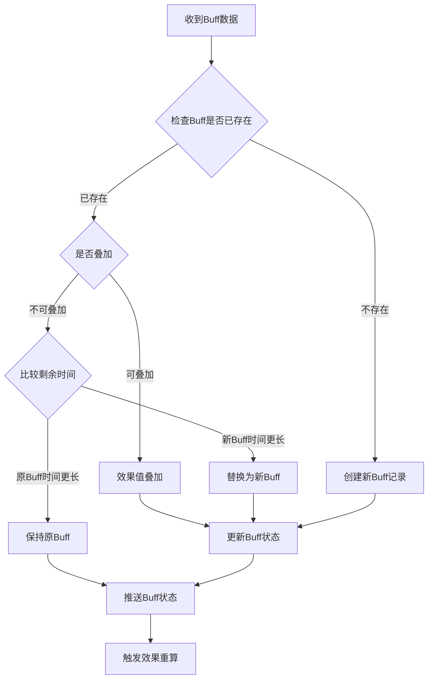
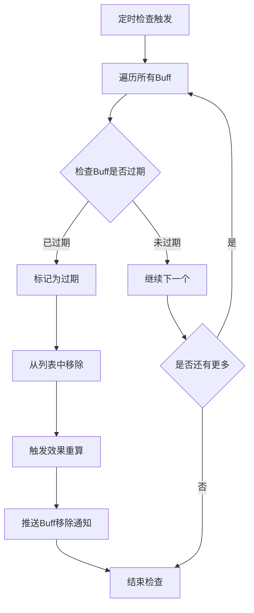
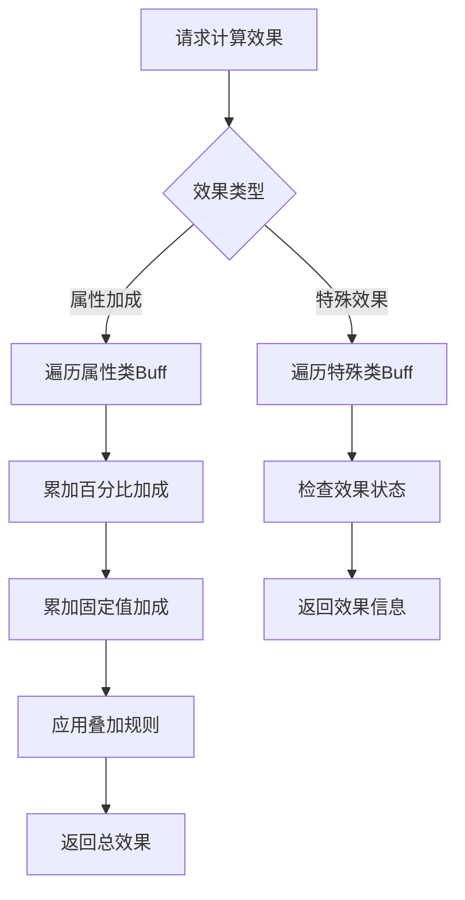

# 玩家Buff模块完整说明

## 一、模块概述

### 1.1 业务背景

玩家Buff模块是 K2C 游戏的核心增益管理系统，负责管理玩家身上所有Buff的状态和效果。作为客户端独立组件，本模块统一管理来自各个系统的Buff数据，提供Buff效果计算和状态展示功能。

### 1.2 目标用户

- **所有游戏玩家**：玩家身上携带的各种增益效果
- **系统开发者**：各模块通过本组件获取Buff加成效果
- **UI展示**：需要展示Buff状态和剩余时间的界面

### 1.3 核心价值

1. **统一管理**：集中管理所有来源的Buff数据
2. **效果计算**：提供准确的属性加成计算
3. **状态展示**：清晰展示Buff状态和剩余时间
4. **过期处理**：自动处理Buff过期逻辑

---

## 二、功能清单

### 2.1 Buff管理功能

| 功能名称 | 功能描述 | 用户价值 |
|---------|---------|---------|
| Buff添加 | 添加新的Buff效果 | 获得增益效果 |
| Buff移除 | 移除指定的Buff | 清除过期或无效Buff |
| Buff更新 | 更新Buff状态和剩余时间 | 保持数据准确 |
| Buff查询 | 查询特定Buff信息 | 了解增益详情 |

### 2.2 效果计算功能

| 功能名称 | 功能描述 | 用户价值 |
|---------|---------|---------|
| 属性加成计算 | 计算属性类Buff总加成 | 获取最终属性值 |
| 特殊效果查询 | 查询特殊效果Buff状态 | 处理特殊逻辑 |
| 加成叠加处理 | 处理多Buff叠加效果 | 准确计算总效果 |

### 2.3 状态展示功能

| 功能名称 | 功能描述 | 用户价值 |
|---------|---------|---------|
| Buff列表展示 | 展示所有激活的Buff | 了解当前增益状态 |
| 剩余时间显示 | 显示Buff剩余时间 | 规划游戏时间 |
| Buff详情查看 | 查看Buff详细效果 | 了解增益详情 |

---

## 三、业务流程详解

### 3.1 Buff添加流程



**详细步骤说明**：

1. **数据接收**
   - 从其他模块协议中解析Buff数据
   - 提取BuffID、效果值、剩余时间

2. **存在性检查**
   - 检查是否已有相同ID的Buff
   - 根据叠加规则处理

3. **状态更新**
   - 更新Buff列表
   - 推送变更通知

### 3.2 Buff过期处理流程



**详细步骤说明**：

1. **定时检查**
   - 每隔一定时间检查所有Buff
   - 判断是否超过过期时间

2. **过期处理**
   - 移除过期Buff
   - 重新计算总效果

3. **通知推送**
   - 推送Buff移除通知
   - 更新UI显示

### 3.3 效果计算流程



**详细步骤说明**：

1. **效果分类**
   - 属性加成类：攻击、防御、速度等
   - 特殊效果类：免疫、无敌、隐身等

2. **计算逻辑**
   - 百分比加成：累加后乘以基础值
   - 固定值加成：直接累加

3. **结果返回**
   - 返回总效果值
   - 返回效果列表

---

## 四、关键规则

### 4.1 Buff分类规则

1. **按来源分类**
   - 道具Buff：使用道具获得
   - 活动Buff：活动期间生效
   - VIP Buff：VIP特权加成
   - 技能Buff：角色技能效果

2. **按效果分类**
   - 攻击加成：提升攻击力
   - 防御加成：提升防御力
   - 速度加成：提升行动速度
   - 资源加成：提升资源产出
   - 特殊效果：免疫、无敌等

### 4.2 叠加规则

1. **同类Buff叠加**
   - 相同ID：取时间最长
   - 不同ID：效果可叠加

2. **效果上限**
   - 单类效果有叠加上限
   - 总效果不超过设定阈值

### 4.3 过期规则

1. **时间过期**
   - 到达过期时间自动移除
   - 剩余时间为0时触发移除

2. **条件过期**
   - 满足特定条件时移除
   - 如离开特定场景

### 4.4 展示规则

1. **显示优先级**
   - 按效果重要性排序
   - 永久Buff在前

2. **时间显示**
   - 大于1天：显示天数
   - 小于1天：显示时分秒
   - 即将过期：特殊提示

---

## 五、用户故事

### 5.1 道具使用玩家故事

> 作为一名普通玩家，我使用了一个"攻击提升药水"，获得了30%攻击加成，持续2小时。在Buff列表中，我可以看到这个Buff的图标和剩余时间。进入战斗后，我发现伤害确实提升了，这让我在副本中更有优势。

### 5.2 活动参与玩家故事

> 作为一名活跃玩家，我参与了周末双倍经验活动。系统自动给我添加了经验加成Buff，我看到Buff列表中多了一个金色的图标，显示"经验+100%"。这个Buff让我升级速度大大加快，我决定趁这个机会多刷一些副本。

### 5.3 VIP玩家故事

> 作为一名VIP玩家，我享受永久的VIP特权Buff。在Buff列表中，我的VIP Buff显示为永久状态，提供10%的资源产出加成。这个Buff让我的日常收益更高，是VIP特权的重要价值之一。

---

## 六、示例

### 6.1 Buff添加示例

**输入数据**：
```
BuffID: 1001
Buff名称: 攻击提升
来源: 道具使用
效果类型: 攻击加成
效果值: +30%
持续时间: 2小时
```

**添加结果**：
```
Buff状态: 已激活
剩余时间: 2:00:00
效果生效: 攻击力 +30%
```

### 6.2 效果计算示例

**当前Buff列表**：
```
Buff 1: 攻击+20%（道具，剩余1小时）
Buff 2: 攻击+10%（VIP，永久）
Buff 3: 防御+15%（活动，剩余3小时）
```

**效果计算**：
```
攻击加成: 20% + 10% = 30%
防御加成: 15%
基础攻击: 1000
实际攻击: 1000 × (1 + 30%) = 1300
```

### 6.3 Buff过期示例

**过期前状态**：
```
Buff: 攻击提升
剩余时间: 0:00:05
效果: 攻击+30%
```

**过期后状态**：
```
Buff状态: 已移除
效果消失: 攻击力恢复原值
通知推送: "攻击提升效果已消失"
```

### 6.4 多Buff叠加示例

**Buff组合**：
```
Buff 1: 攻击+20%（道具）
Buff 2: 攻击+10%（公会技能）
Buff 3: 攻击+5%（称号）
```

**叠加计算**：
```
百分比加成: 20% + 10% + 5% = 35%
基础攻击: 1000
最终攻击: 1000 × 1.35 = 1350
```

---

*文档生成时间: 2026-04-07*
