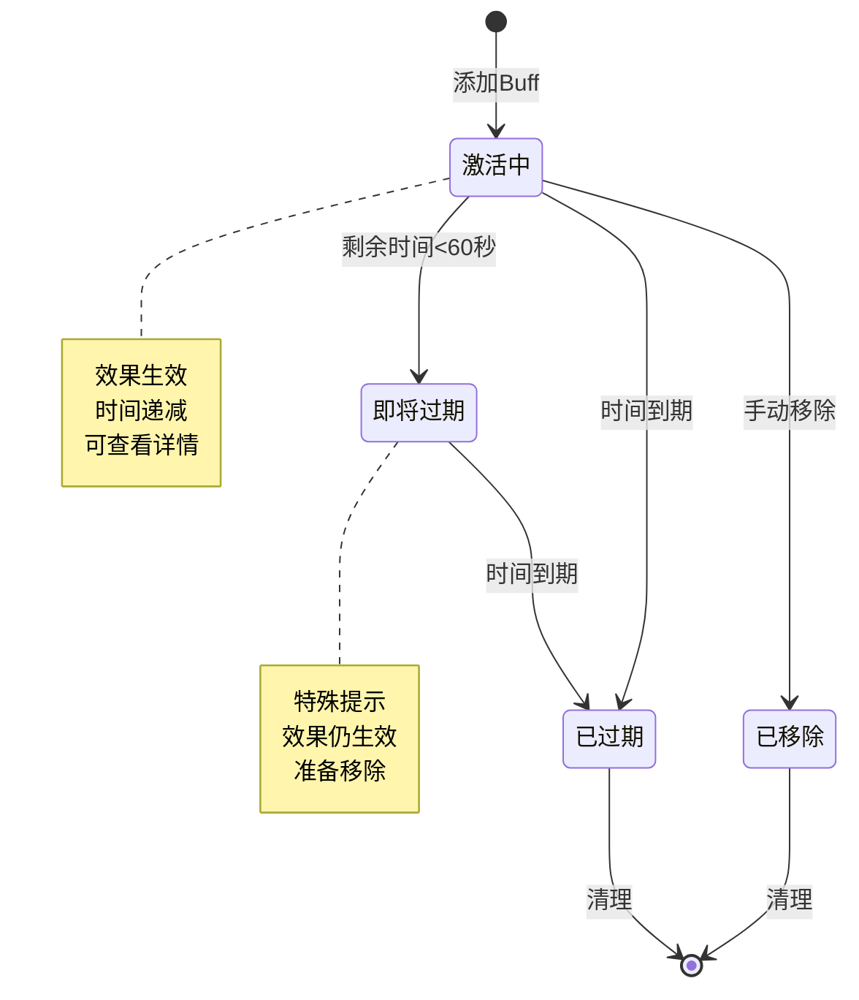
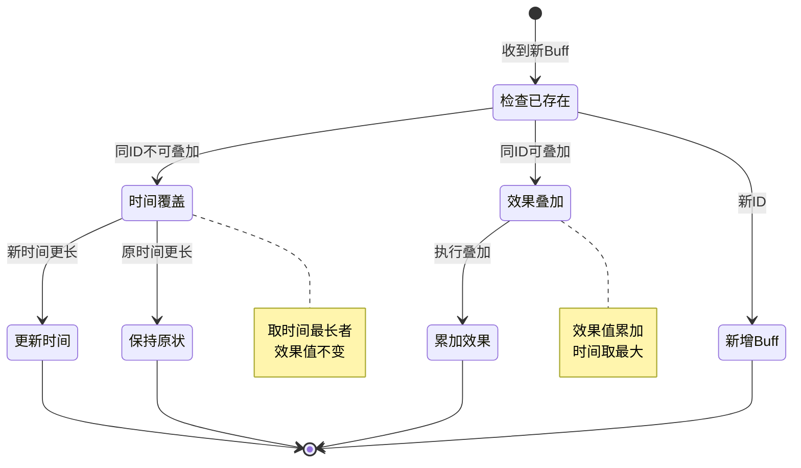
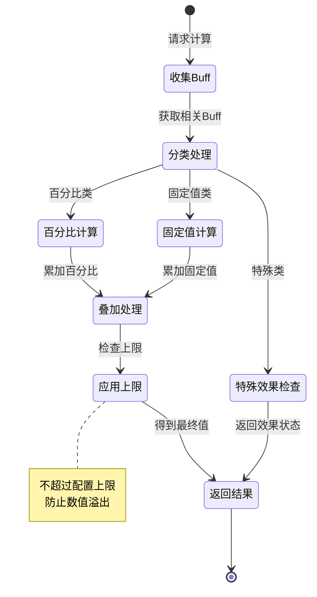
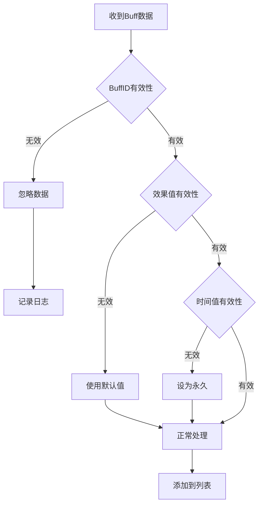

# 玩家Buff模块实现细节

## 一、计算公式

### 1.1 属性加成计算公式

```
最终属性 = 基础属性 × (1 + 百分比加成总和) + 固定值加成总和
```

**参数说明**：
- `基础属性`：玩家原始属性值
- `百分比加成总和`：所有百分比Buff加成之和
- `固定值加成总和`：所有固定值Buff加成之和

**示例计算**：
```
基础攻击：1000
百分比加成：20% + 10% + 5% = 35%
固定值加成：+50 + +30 = +80

最终攻击 = 1000 × (1 + 35%) + 80 = 1350 + 80 = 1430
```

### 1.2 资源产出加成计算公式

```
实际产出 = 基础产出 × (1 + 产出加成总和)
```

**示例计算**：
```
基础产出：100/小时
产出加成：VIP +10%，活动 +50%
加成总和：60%

实际产出 = 100 × 1.6 = 160/小时
```

### 1.3 Buff剩余时间计算公式

```
剩余时间 = 过期时间 - 当前时间
剩余秒数 = floor(剩余时间 / 1000)
```

**显示格式**：
```
大于24小时: X天X小时
1-24小时: X小时X分
1分-1小时: X分X秒
小于1分: X秒
```

### 1.4 叠加效果上限计算公式

```
实际加成 = min(加成总和, 效果上限)
```

**示例计算**：
```
加成总和：80%
效果上限：50%

实际加成 = min(80%, 50%) = 50%
```

### 1.5 Buff优先级计算公式

```
优先级分数 = 类型权重 × 100 + 稀有度权重 × 10 + 剩余时间权重
```

**类型权重**：
```
永久Buff: 10
道具Buff: 8
活动Buff: 6
技能Buff: 4
```

---

## 二、状态机定义

### 2.1 Buff生命周期状态机



### 2.2 Buff叠加状态机



### 2.3 效果计算状态机



---

## 三、数据约束

### 3.1 Buff信息数据约束

| 字段名 | 数据类型 | 取值范围 | 必填 | 说明 |
|--------|----------|----------|------|------|
| buffId | int | > 0 | 是 | Buff配置ID |
| buffType | int | 1-5 | 是 | Buff类型 |
| effectType | int | 1-10 | 是 | 效果类型 |
| effectValue | long | - | 是 | 效果值 |
| remainTime | long | >= 0 | 是 | 剩余时间（毫秒） |
| sourceType | int | 1-10 | 是 | 来源类型 |
| sourceId | long | >= 0 | 否 | 来源ID |
| addTime | datetime | - | 是 | 添加时间 |

### 3.2 Buff配置数据约束

| 字段名 | 数据类型 | 取值范围 | 必填 | 说明 |
|--------|----------|----------|------|------|
| buff_id | int | > 0 | 是 | Buff ID |
| buff_name | string | 1-50字符 | 是 | Buff名称 |
| buff_type | int | 1-5 | 是 | Buff类型 |
| effect_type | int | 1-10 | 是 | 效果类型 |
| effect_value | long | - | 是 | 基础效果值 |
| duration | long | >= 0 | 是 | 持续时间（0表示永久） |
| stack_type | int | 0-2 | 是 | 叠加类型：0不可,1时间,2效果 |
| max_stack | int | >= 1 | 否 | 最大叠加层数 |
| icon | string | - | 是 | 图标资源路径 |

### 3.3 Buff类型枚举

| 类型ID | 类型名 | 说明 |
|--------|--------|------|
| 1 | ATTACK | 攻击加成 |
| 2 | DEFENSE | 防御加成 |
| 3 | SPEED | 速度加成 |
| 4 | RESOURCE | 资源产量加成 |
| 5 | SPECIAL | 特殊效果 |

### 3.4 来源类型枚举

| 来源ID | 来源名 | 说明 |
|--------|--------|------|
| 1 | ITEM | 道具使用 |
| 2 | ACTIVITY | 活动加成 |
| 3 | VIP | VIP特权 |
| 4 | SKILL | 角色技能 |
| 5 | TITLE | 称号效果 |
| 6 | GUILD | 公会技能 |
| 7 | EQUIPMENT | 装备效果 |

---

## 四、错误处理策略

### 4.1 Buff模块内部错误处理

由于本模块为客户端独立组件，错误处理主要在客户端进行。

| 错误场景 | 处理策略 | 用户提示 |
|----------|----------|----------|
| Buff配置不存在 | 使用默认值或忽略 | 无（日志记录） |
| Buff数据异常 | 忽略该Buff | 无（日志记录） |
| 效果计算溢出 | 限制在上限 | 无 |
| 时间数据异常 | 使用默认时间 | 无 |

### 4.2 Buff数据验证流程



### 4.3 过期检查策略

| 检查时机 | 处理方式 |
|----------|----------|
| 每帧更新 | 检查并移除过期Buff |
| 获取效果时 | 过滤已过期Buff |
| UI刷新时 | 更新剩余时间显示 |

---

## 五、关键代码示例

### 5.1 Buff管理组件伪代码

```csharp
public class NPPlayerBuffComponent : NPComponentBase
{
    private List<NPPlayerBuffInfo> buffList;
    private Dictionary<int, NPPlayerBuffInfo> buffDict;

    // 添加Buff
    public void AddBuff(NPPlayerBuffInfo newBuff)
    {
        NPPlayerBuffInfo existing = GetBuff(newBuff.buffId);

        if (existing != null)
        {
            // 根据叠加类型处理
            BuffConfig config = GetBuffConfig(newBuff.buffId);
            switch (config.stackType)
            {
                case StackType.Time:
                    // 取时间最长
                    if (newBuff.remainTime > existing.remainTime)
                    {
                        existing.remainTime = newBuff.remainTime;
                    }
                    break;

                case StackType.Effect:
                    // 效果叠加
                    existing.effectValue += newBuff.effectValue;
                    existing.remainTime = Math.Max(existing.remainTime, newBuff.remainTime);
                    break;

                default:
                    // 不可叠加，刷新时间
                    existing.remainTime = newBuff.remainTime;
                    break;
            }
        }
        else
        {
            // 新增Buff
            buffList.Add(newBuff);
            buffDict[newBuff.buffId] = newBuff;
        }

        // 触发效果重算
        OnBuffChanged();
    }

    // 移除Buff
    public void RemoveBuff(int buffId)
    {
        NPPlayerBuffInfo buff = GetBuff(buffId);
        if (buff != null)
        {
            buffList.Remove(buff);
            buffDict.Remove(buffId);
            OnBuffChanged();
        }
    }

    // 获取Buff
    public NPPlayerBuffInfo GetBuff(int buffId)
    {
        return buffDict.ContainsKey(buffId) ? buffDict[buffId] : null;
    }

    // 检查是否有Buff
    public bool HasBuff(int buffId)
    {
        return buffDict.ContainsKey(buffId);
    }
}
```

### 5.2 效果计算伪代码

```csharp
public long GetTotalEffect(int effectType)
{
    long percentBonus = 0;
    long fixedBonus = 0;

    foreach (var buff in buffList)
    {
        if (buff.effectType != effectType) continue;
        if (buff.IsExpired()) continue;

        BuffConfig config = GetBuffConfig(buff.buffId);
        if (config.isPercent)
        {
            percentBonus += buff.effectValue;
        }
        else
        {
            fixedBonus += buff.effectValue;
        }
    }

    // 应用效果上限
    percentBonus = Math.Min(percentBonus, GetEffectCap(effectType, true));
    fixedBonus = Math.Min(fixedBonus, GetEffectCap(effectType, false));

    return percentBonus * 100 + fixedBonus; // 百分比以万分之一为单位
}

// 获取最终属性值
public long CalculateFinalAttribute(long baseValue, int effectType)
{
    long percentBonus = 0;
    long fixedBonus = 0;

    foreach (var buff in buffList)
    {
        if (buff.effectType != effectType) continue;
        if (buff.IsExpired()) continue;

        BuffConfig config = GetBuffConfig(buff.buffId);
        if (config.isPercent)
        {
            percentBonus += buff.effectValue;
        }
        else
        {
            fixedBonus += buff.effectValue;
        }
    }

    // 计算最终值
    long result = baseValue * (100 + percentBonus) / 100 + fixedBonus;
    return result;
}
```

### 5.3 过期检查伪代码

```csharp
public void Update(float deltaTime)
{
    List<NPPlayerBuffInfo> expiredList = new List<NPPlayerBuffInfo>();

    foreach (var buff in buffList)
    {
        if (buff.remainTime > 0)
        {
            buff.remainTime -= (long)(deltaTime * 1000);
            if (buff.remainTime <= 0)
            {
                expiredList.Add(buff);
            }
        }
    }

    // 移除过期Buff
    foreach (var expired in expiredList)
    {
        RemoveBuff(expired.buffId);
        OnBuffExpired(expired);
    }
}

// Buff过期回调
private void OnBuffExpired(NPPlayerBuffInfo buff)
{
    // 发送过期通知
    WinMsg.SendMsg(WinMsgType.ON_BUFF_EXPIRED, buff.buffId);

    // 刷新UI
    RefreshBuffUI();
}
```

### 5.4 Buff信息类伪代码

```csharp
public class NPPlayerBuffInfo
{
    public int buffId;          // Buff ID
    public int buffType;        // Buff类型
    public int effectType;      // 效果类型
    public long effectValue;    // 效果值
    public long remainTime;     // 剩余时间（毫秒）
    public int sourceType;      // 来源类型
    public long sourceId;       // 来源ID
    public long addTime;        // 添加时间戳

    // 是否已过期
    public bool IsExpired()
    {
        return remainTime <= 0;
    }

    // 是否是永久Buff
    public bool IsPermanent()
    {
        return remainTime < 0; // 负数表示永久
    }

    // 获取剩余时间描述
    public string GetRemainTimeDesc()
    {
        if (IsPermanent())
            return "永久";

        if (IsExpired())
            return "已过期";

        long seconds = remainTime / 1000;
        if (seconds >= 86400) // 大于1天
        {
            int days = (int)(seconds / 86400);
            int hours = (int)((seconds % 86400) / 3600);
            return $"{days}天{hours}小时";
        }
        else if (seconds >= 3600) // 大于1小时
        {
            int hours = (int)(seconds / 3600);
            int mins = (int)((seconds % 3600) / 60);
            return $"{hours}小时{mins}分";
        }
        else if (seconds >= 60) // 大于1分钟
        {
            int mins = (int)(seconds / 60);
            int secs = (int)(seconds % 60);
            return $"{mins}分{secs}秒";
        }
        else
        {
            return $"{seconds}秒";
        }
    }
}
```

### 5.5 UI刷新伪代码

```csharp
public void RefreshBuffUI()
{
    // 排序：永久在前，然后按剩余时间降序
    var sortedList = buffList
        .Where(b => !b.IsExpired())
        .OrderByDescending(b => b.IsPermanent() ? long.MaxValue : b.remainTime)
        .ThenBy(b => b.buffType)
        .ToList();

    // 更新UI列表
    buffUIList.UpdateList(sortedList);

    // 更新效果摘要
    UpdateEffectSummary();
}

private void UpdateEffectSummary()
{
    // 计算各类型总加成
    long attackBonus = GetTotalEffect(EffectType.Attack);
    long defenseBonus = GetTotalEffect(EffectType.Defense);
    long speedBonus = GetTotalEffect(EffectType.Speed);
    long resourceBonus = GetTotalEffect(EffectType.Resource);

    // 更新显示
    attackText.text = $"+{attackBonus}%";
    defenseText.text = $"+{defenseBonus}%";
    speedText.text = $"+{speedBonus}%";
    resourceText.text = $"+{resourceBonus}%";
}
```

---

## 六、跨模块依赖

### 6.1 数据来源模块

| 模块名称 | 数据来源 | 说明 |
|----------|----------|------|
| Module_Player | 玩家属性相关Buff | VIP、称号等 |
| Module_ItemOp | 使用道具获得Buff | 药水、卷轴等 |
| Module_ActivityOp | 活动Buff | 限时活动加成 |
| Module_Guild | 公会技能Buff | 公会科技加成 |

### 6.2 效果使用模块

| 模块名称 | 使用方式 | 说明 |
|----------|----------|------|
| Module_Player | 属性计算 | 最终属性包含Buff加成 |
| Module_Battle | 战斗属性 | 战斗中使用Buff效果 |
| Module_MarsBuilding | 产出计算 | 计算资源产出时使用 |
| Module_MarsExplore | 探索加成 | 探索效率加成 |

---

*文档生成时间: 2026-04-07*
