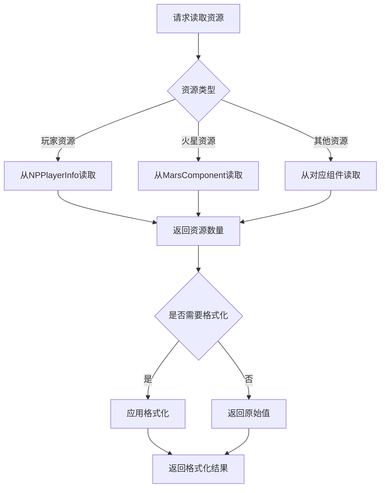
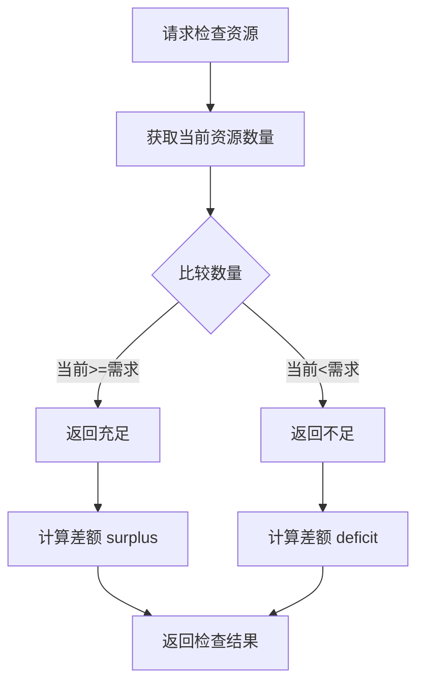
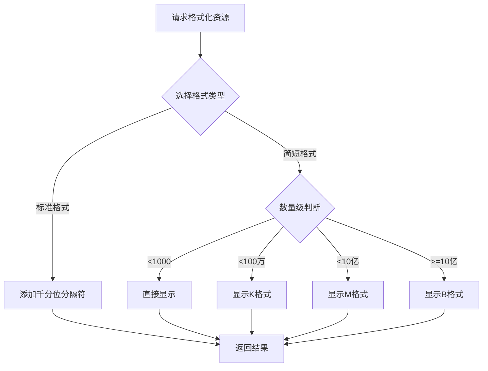
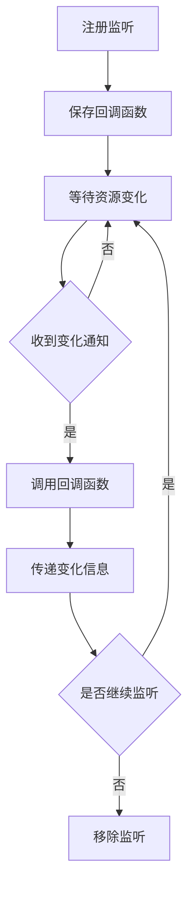

# 资源模块完整说明

## 一、模块概述

### 1.1 业务背景

资源模块是 K2C 游戏的核心基础组件，负责管理玩家各类资源的数量和显示。作为客户端独立组件，本模块提供统一的资源读取接口、格式化显示和变化监听功能，为游戏内所有需要资源展示的功能提供支持。

### 1.2 目标用户

- **所有游戏玩家**：查看和管理自己的各类资源
- **系统开发者**：通过统一接口获取资源数据
- **UI界面**：需要显示资源数量的各类界面

### 1.3 核心价值

1. **统一接口**：提供标准化的资源读取接口
2. **格式化显示**：支持多种资源显示格式
3. **变化监听**：实时响应资源变化更新UI
4. **辅助功能**：资源检查、比较等实用工具

---

## 二、功能清单

### 2.1 资源读取功能

| 功能名称 | 功能描述 | 用户价值 |
|---------|---------|---------|
| 获取资源数量 | 获取指定类型资源的数量 | 了解资源状况 |
| 获取所有资源 | 一次性获取所有资源信息 | 批量展示资源 |
| 获取资源上限 | 获取资源的存储上限 | 了解容量限制 |

### 2.2 资源检查功能

| 功能名称 | 功能描述 | 用户价值 |
|---------|---------|---------|
| 检查资源充足 | 检查资源是否满足需求 | 操作前验证 |
| 比较资源数量 | 比较两组资源的差异 | 分析资源变化 |
| 计算资源差额 | 计算达到目标需要多少 | 规划资源获取 |

### 2.3 资源显示功能

| 功能名称 | 功能描述 | 用户价值 |
|---------|---------|---------|
| 标准格式化 | 标准数字格式显示 | 清晰展示数量 |
| 简短格式化 | 简短格式显示（K/M/B） | 节省显示空间 |
| 带单位显示 | 带资源单位显示 | 完整信息展示 |

### 2.4 资源监听功能

| 功能名称 | 功能描述 | 用户价值 |
|---------|---------|---------|
| 变化监听 | 监听资源变化事件 | 实时更新UI |
| 变化通知 | 接收资源变化通知 | 了解资源动态 |
| 批量监听 | 同时监听多种资源 | 高效更新多个UI |

---

## 三、业务流程详解

### 3.1 资源读取流程



**详细步骤说明**：

1. **确定资源类型**
   - 根据资源ID确定资源所属模块
   - 选择正确的数据来源

2. **读取数据**
   - 从对应组件获取资源数量
   - 获取资源上限（如果有）

3. **格式化输出**
   - 根据需要选择显示格式
   - 返回格式化后的结果

### 3.2 资源检查流程



**详细步骤说明**：

1. **获取当前值**
   - 读取玩家当前资源数量
   - 可能需要考虑各种加成

2. **比较计算**
   - 比较当前值与需求值
   - 计算差额

3. **返回结果**
   - 返回是否充足的布尔值
   - 返回差额信息

### 3.3 资源显示格式化流程



**详细步骤说明**：

1. **格式选择**
   - 根据显示场景选择格式
   - 考虑UI空间限制

2. **数值处理**
   - 标准格式：添加逗号分隔
   - 简短格式：转换为K/M/B

3. **结果输出**
   - 返回格式化字符串
   - 可附加单位信息

### 3.4 资源变化监听流程



**详细步骤说明**：

1. **注册监听**
   - 指定监听的资源类型
   - 提供回调函数

2. **接收通知**
   - 服务端推送资源变化
   - 触发回调

3. **处理变化**
   - 更新UI显示
   - 执行相关逻辑

---

## 四、关键规则

### 4.1 资源分类规则

1. **基础货币**
   - 金币：基础货币，用于常规消费
   - 宝石：高级货币，可充值获得

2. **常规资源**
   - 食物：用于居民消耗
   - 木材：建造材料
   - 石头：建造材料
   - 铁矿：建造材料

3. **特殊资源**
   - 能源：火星基地运营资源
   - 研究点：科技研究消耗

### 4.2 资源显示规则

1. **显示格式**
   - 标准格式：1,234,567
   - 简短格式：1.23M
   - 带单位：1,234 金币

2. **颜色规则**
   - 充足：正常白色
   - 不足：警告红色
   - 已满：特殊颜色

3. **精度规则**
   - 1000以下：显示整数
   - 1000-100万：保留1位小数
   - 100万以上：保留2位小数

### 4.3 资源检查规则

1. **检查时机**
   - 操作前检查：确保资源充足
   - 定期检查：监控资源状态
   - UI更新时：显示检查结果

2. **检查结果**
   - 充足：允许操作
   - 不足：提示获取途径
   - 接近上限：提示消耗

### 4.4 监听规则

1. **监听范围**
   - 可监听单个资源类型
   - 可监听多个资源类型
   - 可监听所有资源变化

2. **回调时机**
   - 资源数量变化时
   - 资源上限变化时

---

## 五、用户故事

### 5.1 日常玩家故事

> 作为一名日常玩家，我经常需要查看自己的资源数量。在主界面上，我能看到金币和宝石的数量，数字格式清晰易读。当我想升级建筑时，系统会显示需要消耗的资源，并告诉我是否充足。如果资源不足，我会知道还差多少，可以规划如何获取。

### 5.2 UI开发者故事

> 作为一名UI开发者，我需要在各种界面显示资源信息。使用ResourceHelper类，我可以轻松格式化资源数量，比如将1234567显示为"1.23M"。我还注册了资源变化监听，当玩家获得或消耗资源时，UI会自动更新，不需要手动刷新。

### 5.3 系统策划故事

> 作为一名系统策划，我关注玩家对资源的感知。资源模块提供的各种显示格式让我可以针对不同场景选择最合适的方式。在背包界面用标准格式显示精确数量，在战斗结算界面用简短格式快速展示收益。

---

## 六、示例

### 6.1 资源读取示例

**读取金币数量**：
```csharp
long gold = NPPlayerInfo.Instance.GetResource(ResourceType.GOLD);
// 返回：1234567
```

**读取宝石数量**：
```csharp
long gem = NPPlayerInfo.Instance.GetResource(ResourceType.GEM);
// 返回：500
```

### 6.2 资源检查示例

**检查资源是否充足**：
```csharp
bool hasEnough = NPPlayerInfo.Instance.HasResource(ResourceType.GOLD, 1000);
// 金币 >= 1000 时返回 true
```

**获取资源差额**：
```csharp
long deficit = NPPlayerInfo.Instance.GetResourceDeficit(ResourceType.GOLD, 2000);
// 金币 1000，需要 2000，返回 -1000（缺 1000）
```

### 6.3 格式化显示示例

**标准格式**：
```
输入：1234567
输出：1,234,567
```

**简短格式**：
```
输入：1234567
输出：1.23M

输入：50000
输出：50K

输入：1500000000
输出：1.5B
```

**带单位格式**：
```
输入：金币，1234567
输出：1,234,567 金币
```

### 6.4 资源监听示例

**注册监听**：
```csharp
NPPlayerInfo.Instance.OnResourceChanged += (type, oldVal, newVal) => {
    if (type == ResourceType.GOLD)
    {
        UpdateGoldDisplay(newVal);
    }
};
```

**批量监听**：
```csharp
NPPlayerInfo.Instance.OnAnyResourceChanged += () => {
    UpdateAllResourceDisplay();
};
```

---

*文档生成时间: 2026-04-07*
