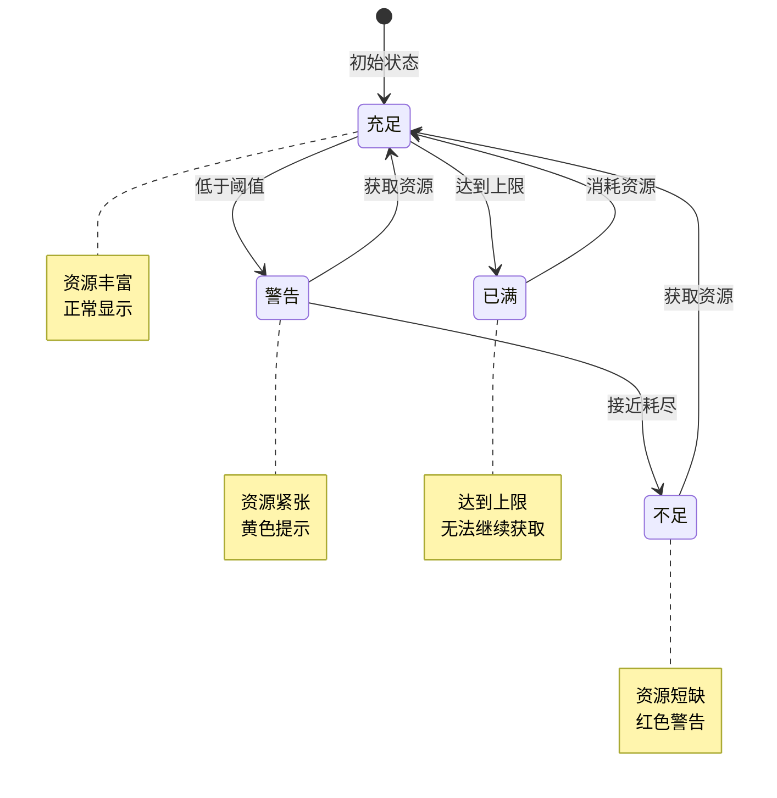
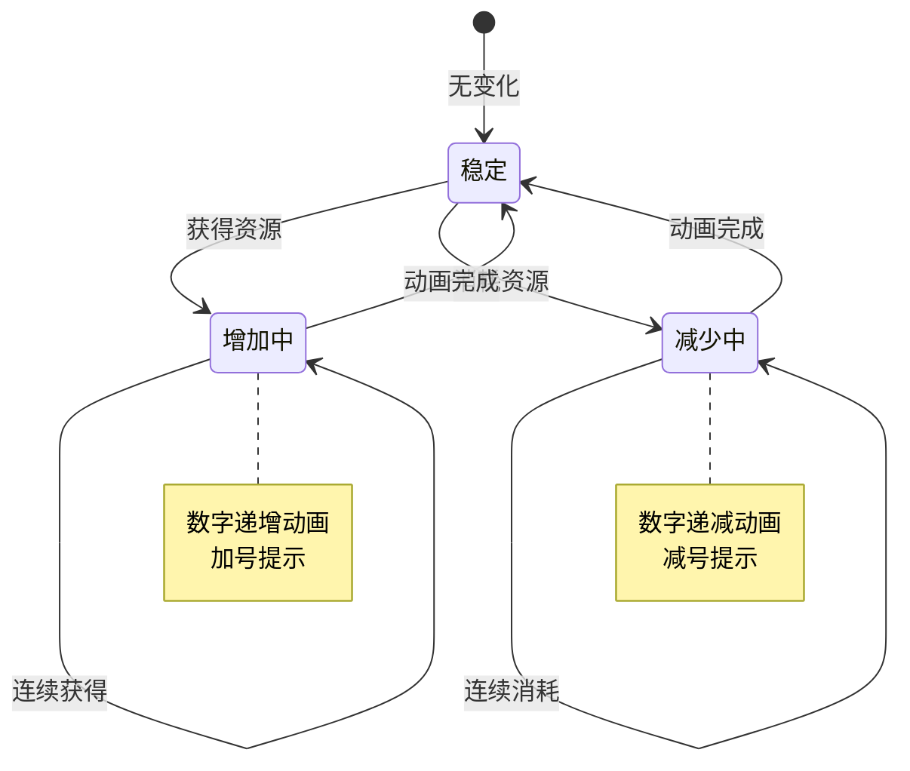
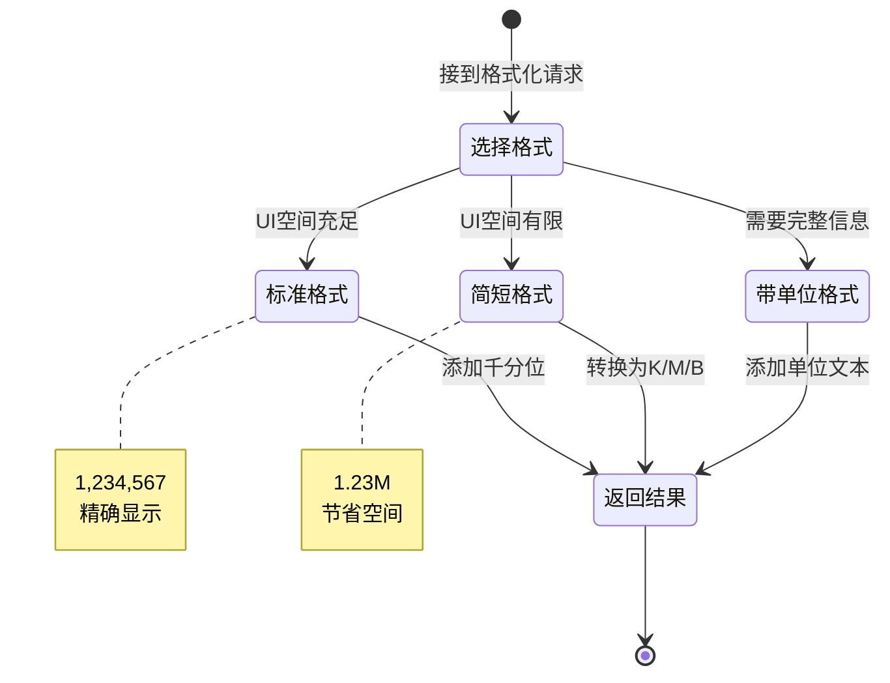
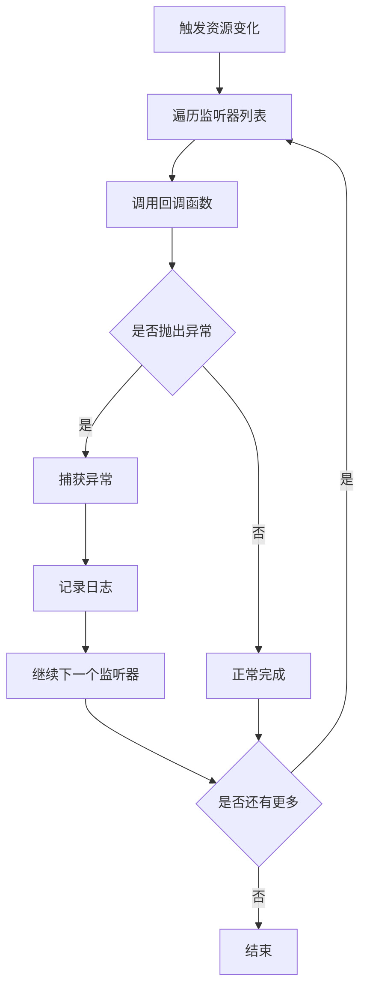

# 资源模块实现细节

## 一、计算公式

### 1.1 简短格式转换公式

```
显示值 = 实际值 / 单位基数
单位 = 根据数量级选择
```

**数量级判断**：
```
实际值 < 1000        → 显示原值，无单位
实际值 < 1,000,000   → 显示值 = 实际值 / 1000，单位 K
实际值 < 1,000,000,000 → 显示值 = 实际值 / 1,000,000，单位 M
实际值 >= 1,000,000,000 → 显示值 = 实际值 / 1,000,000,000，单位 B
```

**示例计算**：
```
实际值：1234567
数量级：M级别
显示值：1234567 / 1000000 = 1.234567
格式化：1.23M
```

### 1.2 资源差额计算公式

```
差额 = 当前值 - 需求值
```

**结果解读**：
```
差额 > 0：资源充足，差额为富余量
差额 = 0：资源刚好够用
差额 < 0：资源不足，差额绝对值为缺少量
```

**示例计算**：
```
当前值：500
需求值：800
差额 = 500 - 800 = -300
结果：缺少 300
```

### 1.3 资源充足百分比计算公式

```
充足百分比 = 当前值 / 需求值 × 100%
```

**示例计算**：
```
当前值：600
需求值：1000
充足百分比 = 600 / 1000 × 100% = 60%
```

### 1.4 千分位格式化公式

```
格式化结果 = 从右向左每3位添加逗号分隔符
```

**示例**：
```
原始值：1234567890
格式化：1,234,567,890
```

### 1.5 资源上限比例计算公式

```
上限比例 = 当前值 / 上限值 × 100%
```

**示例计算**：
```
当前值：800
上限值：1000
上限比例 = 800 / 1000 × 100% = 80%
```

---

## 二、状态机定义

### 2.1 资源状态机



### 2.2 资源变化状态机



### 2.3 格式选择状态机



---

## 三、数据约束

### 3.1 资源类型约束

| 类型ID | 类型名 | 取值范围 | 说明 |
|--------|--------|----------|------|
| 1 | GOLD | 0 - 9,999,999,999 | 金币 |
| 2 | GEM | 0 - 999,999 | 宝石 |
| 3 | FOOD | 0 - 99,999,999 | 食物 |
| 4 | WOOD | 0 - 99,999,999 | 木材 |
| 5 | STONE | 0 - 99,999,999 | 石头 |
| 6 | IRON | 0 - 99,999,999 | 铁矿 |
| 7 | ENERGY | 0 - 999,999 | 能源 |

### 3.2 资源信息数据约束

| 字段名 | 数据类型 | 取值范围 | 必填 | 说明 |
|--------|----------|----------|------|------|
| resourceId | int | 1-100 | 是 | 资源ID |
| resourceName | string | 1-20字符 | 是 | 资源名称 |
| currentAmount | long | >= 0 | 是 | 当前数量 |
| maxAmount | long | > 0 | 否 | 最大数量（可选） |
| icon | string | - | 是 | 图标资源路径 |

### 3.3 格式化配置约束

| 字段名 | 数据类型 | 取值范围 | 必填 | 说明 |
|--------|----------|----------|------|------|
| formatType | int | 0-2 | 是 | 格式类型 |
| precision | int | 0-4 | 是 | 小数位数 |
| showUnit | bool | - | 是 | 是否显示单位 |
| showIcon | bool | - | 是 | 是否显示图标 |

---

## 四、错误处理策略

### 4.1 资源模块内部错误处理

由于本模块为客户端独立组件，错误处理主要在客户端进行。

| 错误场景 | 处理策略 | 用户提示 |
|----------|----------|----------|
| 资源类型无效 | 返回0或默认值 | 无（日志记录） |
| 数值溢出 | 使用long.MaxValue | 显示为"满" |
| 格式化失败 | 返回原始字符串 | 无 |

### 4.2 资源检查错误处理

| 检查场景 | 处理策略 | 返回值 |
|----------|----------|--------|
| 资源类型不存在 | 返回不足 | false |
| 当前值为null | 当作0处理 | 根据需求值判断 |
| 需求值为负数 | 视为充足 | true |

### 4.3 监听器错误处理



---

## 五、关键代码示例

### 5.1 资源读取伪代码

```csharp
public class NPResourceHelper
{
    // 获取资源数量
    public static long GetResource(int resourceType)
    {
        NPPlayerInfo playerInfo = NPPlayerInfo.Instance;
        if (playerInfo == null) return 0;

        switch (resourceType)
        {
            case ResourceType.GOLD:
                return playerInfo.gold;
            case ResourceType.GEM:
                return playerInfo.gem;
            case ResourceType.FOOD:
                return playerInfo.food;
            case ResourceType.WOOD:
                return playerInfo.wood;
            case ResourceType.STONE:
                return playerInfo.stone;
            case ResourceType.IRON:
                return playerInfo.iron;
            case ResourceType.ENERGY:
                return playerInfo.energy;
            default:
                Debug.LogWarning($"Unknown resource type: {resourceType}");
                return 0;
        }
    }

    // 获取资源上限
    public static long GetResourceMax(int resourceType)
    {
        // 某些资源有上限，某些没有
        switch (resourceType)
        {
            case ResourceType.ENERGY:
                return NPPlayerInfo.Instance.energyMax;
            default:
                return long.MaxValue; // 无上限
        }
    }

    // 检查资源是否充足
    public static bool HasResource(int resourceType, long amount)
    {
        long current = GetResource(resourceType);
        return current >= amount;
    }

    // 获取资源差额
    public static long GetResourceDeficit(int resourceType, long amount)
    {
        long current = GetResource(resourceType);
        return current - amount;
    }
}
```

### 5.2 格式化显示伪代码

```csharp
public class ResourceHelper
{
    // 标准格式化（带千分位）
    public static string FormatAmount(long amount)
    {
        return amount.ToString("N0");
    }

    // 简短格式化（K/M/B）
    public static string FormatShort(long amount)
    {
        if (amount < 1000)
        {
            return amount.ToString();
        }
        else if (amount < 1000000)
        {
            return (amount / 1000.0).ToString("F1") + "K";
        }
        else if (amount < 1000000000)
        {
            return (amount / 1000000.0).ToString("F2") + "M";
        }
        else
        {
            return (amount / 1000000000.0).ToString("F2") + "B";
        }
    }

    // 带单位格式化
    public static string FormatWithUnit(long amount, string unitName)
    {
        return $"{FormatAmount(amount)} {unitName}";
    }

    // 根据配置选择格式
    public static string Format(long amount, FormatType formatType, string unitName = null)
    {
        switch (formatType)
        {
            case FormatType.Standard:
                return FormatAmount(amount);
            case FormatType.Short:
                return FormatShort(amount);
            case FormatType.WithUnit:
                return FormatWithUnit(amount, unitName);
            default:
                return amount.ToString();
        }
    }
}
```

### 5.3 资源变化监听伪代码

```csharp
public class NPPlayerInfo : MonoBehaviour
{
    // 资源变化事件
    public event Action<int, long, long> OnResourceChanged; // (type, oldVal, newVal)
    public event Action OnAnyResourceChanged;

    private Dictionary<int, long> resources = new Dictionary<int, long>();

    // 设置资源值
    public void SetResource(int type, long value)
    {
        if (!resources.ContainsKey(type))
        {
            resources[type] = 0;
        }

        long oldValue = resources[type];
        if (oldValue != value)
        {
            resources[type] = value;
            OnResourceChanged?.Invoke(type, oldValue, value);
            OnAnyResourceChanged?.Invoke();
        }
    }

    // 增加资源
    public void AddResource(int type, long amount)
    {
        long current = GetResource(type);
        SetResource(type, current + amount);
    }

    // 减少资源
    public bool CostResource(int type, long amount)
    {
        long current = GetResource(type);
        if (current < amount) return false;

        SetResource(type, current - amount);
        return true;
    }

    // 获取资源
    public long GetResource(int type)
    {
        return resources.ContainsKey(type) ? resources[type] : 0;
    }
}
```

### 5.4 资源检查工具伪代码

```csharp
public class ResourceChecker
{
    // 检查多个资源是否充足
    public static bool CheckResources(Dictionary<int, long> requirements)
    {
        foreach (var req in requirements)
        {
            if (!NPResourceHelper.HasResource(req.Key, req.Value))
            {
                return false;
            }
        }
        return true;
    }

    // 获取不足的资源列表
    public static Dictionary<int, long> GetDeficitResources(Dictionary<int, long> requirements)
    {
        Dictionary<int, long> deficits = new Dictionary<int, long>();

        foreach (var req in requirements)
        {
            long deficit = NPResourceHelper.GetResourceDeficit(req.Key, req.Value);
            if (deficit < 0)
            {
                deficits[req.Key] = -deficit;
            }
        }

        return deficits;
    }

    // 生成资源不足提示
    public static string GenerateDeficitMessage(Dictionary<int, long> deficits)
    {
        if (deficits.Count == 0)
            return "资源充足";

        List<string> messages = new List<string>();
        foreach (var deficit in deficits)
        {
            string name = GetResourceName(deficit.Key);
            messages.Add($"{name}缺少{ResourceHelper.FormatShort(deficit.Value)}");
        }

        return string.Join("，", messages);
    }
}
```

### 5.5 UI更新伪代码

```csharp
public class ResourceUI : MonoBehaviour
{
    public Text goldText;
    public Text gemText;
    public Text energyText;

    private void Start()
    {
        // 注册资源变化监听
        NPPlayerInfo.Instance.OnAnyResourceChanged += UpdateAllDisplay;
        UpdateAllDisplay();
    }

    private void OnDestroy()
    {
        // 移除监听
        NPPlayerInfo.Instance.OnAnyResourceChanged -= UpdateAllDisplay;
    }

    private void UpdateAllDisplay()
    {
        UpdateGoldDisplay();
        UpdateGemDisplay();
        UpdateEnergyDisplay();
    }

    private void UpdateGoldDisplay()
    {
        long gold = NPResourceHelper.GetResource(ResourceType.GOLD);
        goldText.text = ResourceHelper.FormatShort(gold);
    }

    private void UpdateGemDisplay()
    {
        long gem = NPResourceHelper.GetResource(ResourceType.GEM);
        gemText.text = ResourceHelper.FormatAmount(gem);
    }

    private void UpdateEnergyDisplay()
    {
        long energy = NPResourceHelper.GetResource(ResourceType.ENERGY);
        long maxEnergy = NPResourceHelper.GetResourceMax(ResourceType.ENERGY);
        energyText.text = $"{energy}/{maxEnergy}";

        // 根据百分比显示颜色
        float percent = (float)energy / maxEnergy;
        if (percent < 0.3f)
        {
            energyText.color = Color.red;
        }
        else if (percent < 0.7f)
        {
            energyText.color = Color.yellow;
        }
        else
        {
            energyText.color = Color.white;
        }
    }
}
```

---

## 六、跨模块依赖

### 6.1 数据来源模块

| 模块名称 | 数据来源 | 说明 |
|----------|----------|------|
| Module_Player | 玩家资源数据 | 金币、宝石等基础资源 |
| Module_MarsBuilding | 火星资源数据 | 能源、建筑材料等 |
| Module_MarsExplore | 探索资源数据 | 采集获得的资源 |

### 6.2 使用模块

| 模块名称 | 使用方式 | 说明 |
|----------|----------|------|
| 所有UI模块 | 资源显示 | 各界面的资源数量展示 |
| 所有消费模块 | 资源检查 | 操作前的资源验证 |
| 所有奖励模块 | 资源获取 | 奖励发放后的UI更新 |

---

*文档生成时间: 2026-04-07*
