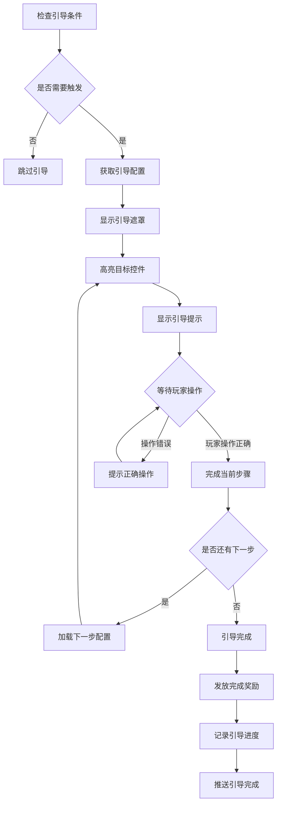
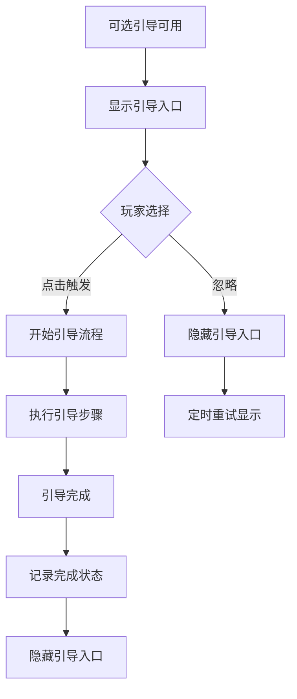
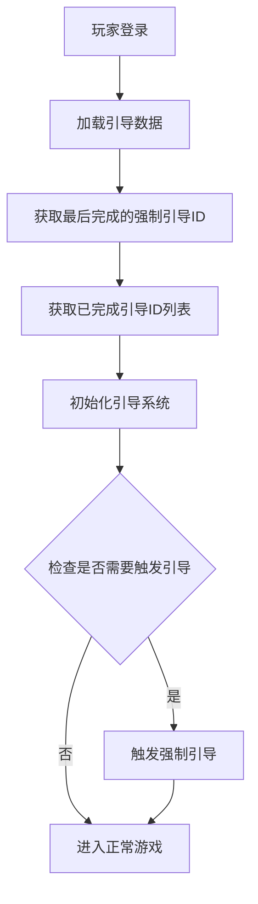
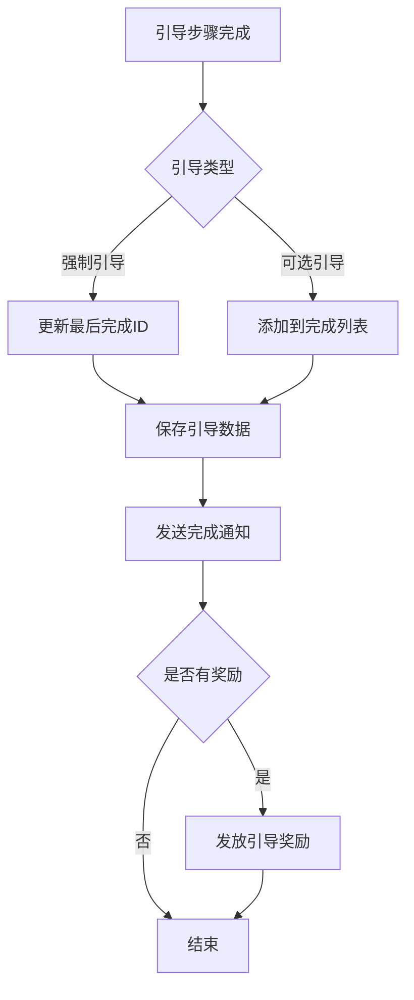

# 新手引导模块完整说明

## 一、模块概述

### 1.1 业务背景

新手引导模块是 K2C 游戏的核心引导系统，负责管理玩家的引导进度和引导流程。通过强制引导和可选引导两种方式，帮助新玩家快速熟悉游戏玩法，引导玩家逐步解锁和体验游戏内容。

### 1.2 目标用户

- **新玩家**：首次进入游戏的玩家，需要引导熟悉游戏
- **回流玩家**：长时间未登录的玩家，需要了解新功能
- **运营人员**：通过引导数据了解玩家进度

### 1.3 核心价值

1. **新手友好**：帮助新玩家快速上手游戏
2. **功能引导**：引导玩家发现和使用新功能
3. **进度追踪**：记录玩家引导完成情况
4. **数据支持**：为运营提供玩家进度数据

---

## 二、功能清单

### 2.1 强制引导功能

| 功能名称 | 功能描述 | 用户价值 |
|---------|---------|---------|
| 引导触发 | 触发强制引导流程 | 引导玩家操作 |
| 步骤执行 | 按步骤执行引导 | 逐步学习操作 |
| 进度记录 | 记录引导完成进度 | 断点续导 |
| 完成奖励 | 完成引导获得奖励 | 激励完成引导 |

### 2.2 可选引导功能

| 功能名称 | 功能描述 | 用户价值 |
|---------|---------|---------|
| 引导提示 | 显示可选引导入口 | 提示引导可用 |
| 手动触发 | 玩家主动触发引导 | 自主学习 |
| 完成记录 | 记录引导完成状态 | 避免重复引导 |

### 2.3 引导UI功能

| 功能名称 | 功能描述 | 用户价值 |
|---------|---------|---------|
| 遮罩显示 | 高亮目标控件 | 聚焦注意力 |
| 手指提示 | 显示点击位置提示 | 明确操作目标 |
| 文字说明 | 显示引导说明文字 | 解释操作目的 |
| 箭头指引 | 显示方向指引 | 引导移动方向 |

### 2.4 引导管理功能

| 功能名称 | 功能描述 | 用户价值 |
|---------|---------|---------|
| 引导跳过 | 跳过当前引导步骤 | 加快进度 |
| 引导重置 | 重置引导进度 | 重新学习 |
| 引导暂停 | 暂停引导流程 | 应对特殊情况 |

---

## 三、业务流程详解

### 3.1 强制引导流程



**详细步骤说明**：

1. **触发判断**
   - 检查玩家当前引导进度
   - 判断是否满足触发条件

2. **引导执行**
   - 显示遮罩层
   - 高亮目标控件
   - 显示操作提示

3. **步骤完成**
   - 玩家完成指定操作
   - 进入下一步或完成引导

### 3.2 可选引导流程



**详细步骤说明**：

1. **入口显示**
   - 检测可选引导是否可用
   - 在适当位置显示引导入口

2. **玩家选择**
   - 玩家可选择触发或忽略
   - 忽略后定时重新提示

3. **引导完成**
   - 完成后记录状态
   - 不再显示该引导入口

### 3.3 引导数据同步流程



**详细步骤说明**：

1. **数据加载**
   - 从服务端获取引导数据
   - 解析引导进度

2. **系统初始化**
   - 设置引导状态
   - 准备引导资源

3. **引导检查**
   - 根据进度判断是否触发引导
   - 执行引导或进入游戏

### 3.4 引导完成处理流程



**详细步骤说明**：

1. **进度更新**
   - 强制引导更新最后完成ID
   - 可选引导添加到完成列表

2. **数据保存**
   - 保存到本地
   - 同步到服务端

3. **奖励发放**
   - 检查是否有完成奖励
   - 发放奖励资源

---

## 四、关键规则

### 4.1 强制引导规则

1. **触发条件**
   - 玩家等级达到指定等级
   - 功能解锁时触发
   - 前置引导完成后触发

2. **执行规则**
   - 强制引导不可跳过
   - 必须按顺序完成
   - 玩家操作需匹配引导目标

3. **进度规则**
   - 记录最后完成的引导ID
   - 断线重连后继续进度

### 4.2 可选引导规则

1. **显示条件**
   - 相关功能解锁后显示
   - 未完成过该引导

2. **执行规则**
   - 可随时取消
   - 可重复执行

3. **记录规则**
   - 记录是否完成过
   - 完成后不再显示入口

### 4.3 引导UI规则

1. **遮罩规则**
   - 遮罩覆盖整个屏幕
   - 高亮区域可点击穿透

2. **提示规则**
   - 提示文字简洁明了
   - 手指动画循环播放

3. **交互规则**
   - 引导期间限制其他操作
   - 支持点击跳过（可选引导）

### 4.4 数据规则

1. **存储规则**
   - 强制引导存储最后完成ID
   - 可选引导存储已完成ID列表

2. **同步规则**
   - 登录时同步引导数据
   - 完成引导时实时同步

---

## 五、用户故事

### 5.1 新玩家故事

> 作为一名新玩家，我第一次进入游戏。系统自动触发了新手引导，教我如何创建角色、如何移动、如何进行战斗。引导用遮罩高亮显示我需要点击的按钮，还有手指动画提示操作位置。跟着引导一步步操作，我很快就学会了游戏的基本玩法，并获得了新手奖励。

### 5.2 功能解锁玩家故事

> 作为一名正在游戏的玩家，我的等级达到了10级，解锁了公会系统。系统自动触发了公会功能的强制引导，教我如何加入公会、如何参与公会活动。通过引导，我了解了公会玩法的核心内容，很快就找到了一个活跃的公会加入。

### 5.3 可选引导用户故事

> 作为一名想要深入了解游戏的玩家，我注意到界面上有一个小问号图标，提示有可选引导可以查看。点击后，系统引导我了解了竞技场玩法的详细规则。虽然这不是必须的，但通过这个引导，我对竞技场有了更清晰的认识。

---

## 六、示例

### 6.1 强制引导示例

**引导配置**：
```
引导ID: 1001
引导名称: 首次战斗引导
类型: 强制引导
步骤数: 5
触发条件: 等级达到3级
```

**引导步骤**：
```
步骤1: 提示点击"副本"按钮
步骤2: 提示选择第一个副本
步骤3: 提示点击"开始战斗"
步骤4: 引导战斗操作
步骤5: 提示领取战斗奖励
```

**完成结果**：
```
引导状态: 已完成
最后完成ID: 1001
获得奖励: 金币 × 500、经验 × 100
```

### 6.2 可选引导示例

**引导配置**：
```
引导ID: 2001
引导名称: 公会玩法介绍
类型: 可选引导
入口位置: 公会界面
触发条件: 加入公会后
```

**引导内容**：
```
步骤1: 介绍公会大厅功能
步骤2: 介绍公会任务
步骤3: 介绍公会商店
步骤4: 介绍公会BOSS
```

**完成结果**：
```
引导状态: 已完成
添加到完成列表: [2001]
不再显示入口提示
```

### 6.3 引导数据示例

**玩家引导数据**：
```
最后完成强制引导ID: 1010
已完成引导ID列表: [2001, 2002, 2005]
```

**判断逻辑**：
```
强制引导1001: 已完成 (1001 <= 1010)
强制引导1011: 未完成 (1011 > 1010)
可选引导2001: 已完成 (在列表中)
可选引导2003: 未完成 (不在列表中)
```

---

*文档生成时间: 2026-04-07*
