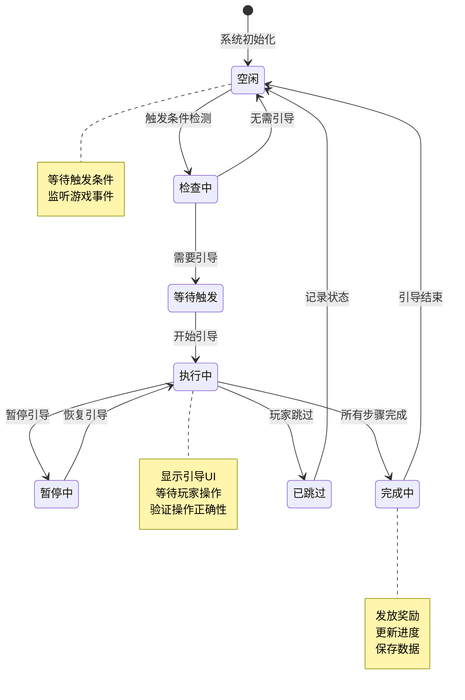
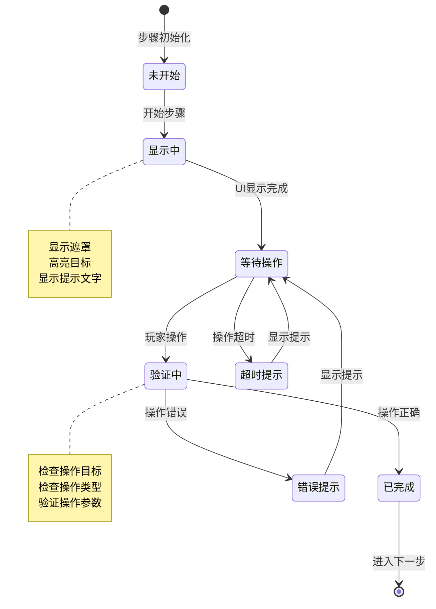
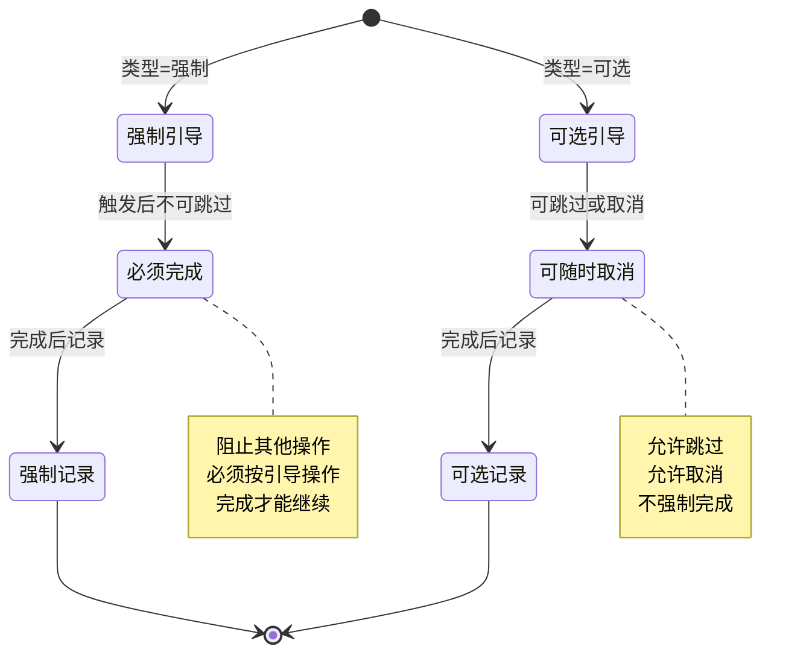
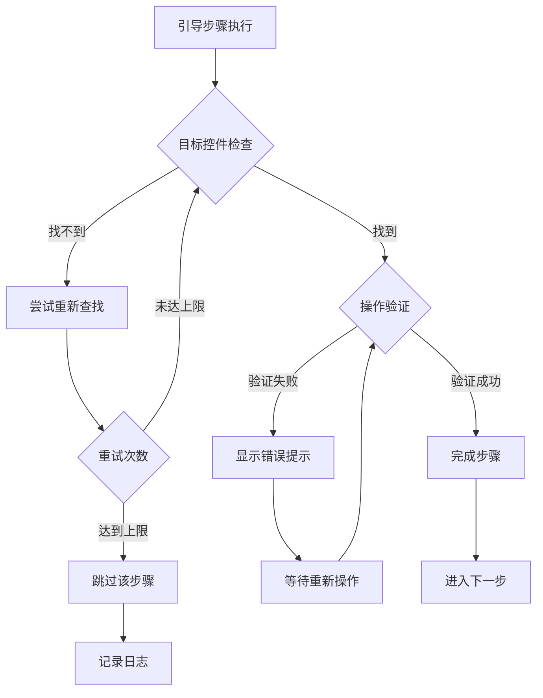

# 新手引导模块实现细节

## 一、计算公式

### 1.1 引导触发判断公式

```
强制引导需要触发 = 引导ID > 最后完成强制引导ID
可选引导需要触发 = 引导ID 不在已完成列表中
```

**示例计算**：
```
最后完成强制引导ID: 1005
新引导ID: 1006
判断: 1006 > 1005 → 需要触发
```

### 1.2 引导步骤进度计算公式

```
当前步骤进度 = 当前步骤索引 / 总步骤数 × 100%
```

**示例计算**：
```
当前步骤索引: 3
总步骤数: 5
进度 = 3 / 5 × 100% = 60%
```

### 1.3 引导完成奖励计算公式

```
奖励值 = base_reward × (1 + 引导复杂度系数)
```

**参数说明**：
- `base_reward`：基础奖励值
- `引导复杂度系数`：根据步骤数量和难度决定

**示例计算**：
```
base_reward = 100金币
引导复杂度系数 = 0.5（5步引导）

奖励值 = 100 × 1.5 = 150金币
```

### 1.4 引导超时检测公式

```
超时判定 = 当前时间 - 步骤开始时间 > 超时阈值
```

**示例计算**：
```
步骤开始时间: 10:00:00
当前时间: 10:01:30
超时阈值: 60秒
超时判定: 90秒 > 60秒 → 超时
```

### 1.5 引导跳过条件公式

```
允许跳过 = 引导类型 == 可选引导 OR (强制引导 AND 已重试次数 >= 最大重试次数)
```

---

## 二、状态机定义

### 2.1 引导系统状态机



### 2.2 引导步骤状态机



### 2.3 引导类型状态机



---

## 三、数据约束

### 3.1 引导数据约束

| 字段名 | 数据类型 | 取值范围 | 必填 | 说明 |
|--------|----------|----------|------|------|
| lastFinishForceTutorial | long | >= 0 | 是 | 最后完成的强制引导ID |
| finishTutorialId | List&lt;long&gt; | - | 是 | 已完成的引导ID列表 |

### 3.2 引导配置约束

| 字段名 | 数据类型 | 取值范围 | 必填 | 说明 |
|--------|----------|----------|------|------|
| id | long | > 0 | 是 | 引导ID |
| name | string | 1-50字符 | 是 | 引导名称 |
| type | int | 1-2 | 是 | 类型：1强制,2可选 |
| steps | json | - | 是 | 步骤配置列表 |
| trigger_condition | json | - | 是 | 触发条件 |
| reward | json | - | 否 | 完成奖励 |

### 3.3 引导步骤配置约束

| 字段名 | 数据类型 | 取值范围 | 必填 | 说明 |
|--------|----------|----------|------|------|
| stepIndex | int | >= 0 | 是 | 步骤索引 |
| targetPath | string | - | 是 | 目标控件路径 |
| targetType | int | 1-5 | 是 | 目标类型 |
| tipText | string | 1-200字符 | 否 | 提示文字 |
| tipPosition | int | 1-9 | 否 | 提示位置 |
| actionType | int | 1-5 | 是 | 操作类型 |
| actionParam | json | - | 否 | 操作参数 |
| timeout | int | >= 0 | 否 | 超时时间（秒） |

### 3.4 引导类型枚举

| 枚举值 | 类型名 | 说明 |
|--------|--------|------|
| NONE | 无 | 无引导 |
| FORCE | 强制引导 | 必须完成 |
| OPTIONAL | 可选引导 | 可选完成 |

---

## 四、错误处理策略

### 4.1 引导模块错误处理

| 错误场景 | 处理策略 | 用户提示 |
|----------|----------|----------|
| 引导配置不存在 | 跳过该引导 | 无 |
| 目标控件找不到 | 跳过该步骤 | 无 |
| 操作验证失败 | 显示错误提示 | "请按引导操作" |
| 引导数据异常 | 重置引导进度 | "引导数据异常，已重置" |

### 4.2 引导步骤错误处理流程



### 4.3 引导异常处理策略

| 异常类型 | 处理策略 | 后续操作 |
|----------|----------|----------|
| 目标不存在 | 跳过步骤或引导 | 记录日志 |
| 操作超时 | 显示超时提示 | 等待操作或自动跳过 |
| 网络异常 | 暂存本地 | 网络恢复后同步 |
| 数据损坏 | 重置引导 | 重新开始 |

---

## 五、关键代码示例

### 5.1 引导数据类伪代码

```csharp
public class TutorialData
{
    public long lastFinishForceTutorial;
    public List<long> finishTutorialId;

    // 判断强制引导是否需要触发
    public bool NeedTriggerForceTutorial(long tutorialId)
    {
        return tutorialId > lastFinishForceTutorial;
    }

    // 判断可选引导是否已完成
    public bool IsTutorialFinished(long tutorialId)
    {
        return finishTutorialId.Contains(tutorialId);
    }

    // 完成强制引导
    public void FinishForceTutorial(long tutorialId)
    {
        if (tutorialId > lastFinishForceTutorial)
        {
            lastFinishForceTutorial = tutorialId;
        }
    }

    // 完成可选引导
    public void FinishOptionalTutorial(long tutorialId)
    {
        if (!finishTutorialId.Contains(tutorialId))
        {
            finishTutorialId.Add(tutorialId);
        }
    }
}
```

### 5.2 引导管理器伪代码

```csharp
public class TutorialManager : MonoBehaviour
{
    private TutorialData tutorialData;
    private TutorialRefObj currentTutorial;
    private int currentStepIndex;
    private bool isExecuting;

    // 初始化引导系统
    public void Initialize(TutorialData data)
    {
        tutorialData = data;
        CheckAndTriggerTutorial();
    }

    // 检查并触发引导
    public void CheckAndTriggerTutorial()
    {
        // 获取下一个需要触发的引导
        TutorialRefObj nextTutorial = GetNextTutorial();
        if (nextTutorial != null)
        {
            StartTutorial(nextTutorial);
        }
    }

    // 开始引导
    public void StartTutorial(TutorialRefObj tutorial)
    {
        currentTutorial = tutorial;
        currentStepIndex = 0;
        isExecuting = true;

        ExecuteStep(0);
    }

    // 执行引导步骤
    private void ExecuteStep(int stepIndex)
    {
        if (stepIndex >= currentTutorial.steps.Count)
        {
            CompleteTutorial();
            return;
        }

        TutorialStep step = currentTutorial.steps[stepIndex];

        // 查找目标控件
        GameObject target = FindTarget(step.targetPath);
        if (target == null)
        {
            // 目标找不到，跳过该步骤
            ExecuteStep(stepIndex + 1);
            return;
        }

        // 显示引导UI
        ShowTutorialUI(target, step);

        // 开始超时检测
        if (step.timeout > 0)
        {
            StartCoroutine(TimeoutCheck(step.timeout));
        }
    }

    // 验证玩家操作
    public bool VerifyAction(GameObject target, int actionType)
    {
        TutorialStep step = currentTutorial.steps[currentStepIndex];

        // 验证目标
        if (target != FindTarget(step.targetPath))
            return false;

        // 验证操作类型
        if (actionType != step.actionType)
            return false;

        // 验证通过，进入下一步
        OnStepCompleted();
        return true;
    }

    // 步骤完成
    private void OnStepCompleted()
    {
        currentStepIndex++;
        ExecuteStep(currentStepIndex);
    }

    // 引导完成
    private void CompleteTutorial()
    {
        isExecuting = false;

        // 更新引导数据
        if (currentTutorial.type == TutorialType.Force)
        {
            tutorialData.FinishForceTutorial(currentTutorial.id);
        }
        else
        {
            tutorialData.FinishOptionalTutorial(currentTutorial.id);
        }

        // 发放奖励
        if (currentTutorial.reward != null)
        {
            RewardHelper.GiveReward(currentTutorial.reward);
        }

        // 保存数据
        SaveTutorialData();

        // 发送完成通知
        WinMsg.SendMsg(WinMsgType.ON_TUTORIAL_FINISH, currentTutorial.id);

        // 检查下一个引导
        CheckAndTriggerTutorial();
    }
}
```

### 5.3 引导UI显示伪代码

```csharp
public class TutorialUI : MonoBehaviour
{
    public GameObject maskPanel;
    public GameObject highlightArea;
    public Text tipText;
    public GameObject fingerAnimation;

    // 显示引导UI
    public void ShowTutorialUI(GameObject target, TutorialStep step)
    {
        // 激活遮罩
        maskPanel.SetActive(true);

        // 设置高亮区域
        SetHighlightArea(target);

        // 显示提示文字
        if (!string.IsNullOrEmpty(step.tipText))
        {
            tipText.text = step.tipText;
            tipText.gameObject.SetActive(true);
            SetTipPosition(step.tipPosition);
        }

        // 显示手指动画
        if (step.actionType == ActionType.Click)
        {
            ShowFingerAnimation(target.transform.position);
        }
    }

    // 设置高亮区域
    private void SetHighlightArea(GameObject target)
    {
        RectTransform targetRect = target.GetComponent<RectTransform>();
        highlightArea.SetActive(true);

        // 设置高亮区域大小和位置
        highlightArea.GetComponent<RectTransform>().sizeDelta = targetRect.sizeDelta;
        highlightArea.transform.position = target.transform.position;

        // 在遮罩上挖洞显示高亮区域
        maskPanel.GetComponent<TutorialMask>().SetHole(targetRect);
    }

    // 显示手指动画
    private void ShowFingerAnimation(Vector3 position)
    {
        fingerAnimation.SetActive(true);
        fingerAnimation.transform.position = position;
        // 播放点击动画
        fingerAnimation.GetComponent<Animator>().Play("ClickAnimation");
    }

    // 隐藏引导UI
    public void HideTutorialUI()
    {
        maskPanel.SetActive(false);
        highlightArea.SetActive(false);
        tipText.gameObject.SetActive(false);
        fingerAnimation.SetActive(false);
    }
}
```

### 5.4 服务端引导处理伪代码

```java
public class TutorialService
{
    // 完成强制引导
    public void finishForceTutorial(long playerId, long tutorialId)
    {
        TutorialData data = tutorialDao.getTutorialData(playerId);

        if (tutorialId > data.getLastFinishForceTutorial())
        {
            data.setLastFinishForceTutorial(tutorialId);
            tutorialDao.updateTutorialData(playerId, data);

            // 记录日志
            logTutorialFinish(playerId, tutorialId);
        }
    }

    // 完成可选引导
    public void finishOptionalTutorial(long playerId, long tutorialId)
    {
        TutorialData data = tutorialDao.getTutorialData(playerId);

        if (!data.getFinishTutorialId().contains(tutorialId))
        {
            data.addFinishTutorialId(tutorialId);
            tutorialDao.updateTutorialData(playerId, data);

            // 记录日志
            logTutorialFinish(playerId, tutorialId);
        }
    }

    // 获取引导数据
    public TutorialData getTutorialData(long playerId)
    {
        return tutorialDao.getTutorialData(playerId);
    }

    // 重置引导数据
    public void resetTutorialData(long playerId)
    {
        TutorialData data = new TutorialData();
        data.setLastFinishForceTutorial(0);
        data.setFinishTutorialId(new ArrayList<>());
        tutorialDao.updateTutorialData(playerId, data);
    }
}
```

### 5.5 引导触发条件检查伪代码

```csharp
public class TutorialTriggerChecker
{
    // 检查是否满足触发条件
    public bool CheckTriggerCondition(TutorialRefObj tutorial)
    {
        foreach (var condition in tutorial.triggerConditions)
        {
            if (!CheckSingleCondition(condition))
            {
                return false;
            }
        }
        return true;
    }

    // 检查单个条件
    private bool CheckSingleCondition(TutorialCondition condition)
    {
        switch (condition.type)
        {
            case ConditionType.Level:
                return NPPlayerInfo.Instance.level >= condition.value;

            case ConditionType.FunctionUnlock:
                return FunctionUnlockManager.Instance.IsUnlocked(condition.value);

            case ConditionType.PreTutorialFinish:
                return tutorialData.IsTutorialFinished(condition.value);

            case ConditionType.QuestComplete:
                return QuestManager.Instance.IsQuestCompleted(condition.value);

            default:
                return false;
        }
    }

    // 获取下一个需要触发的引导
    public TutorialRefObj GetNextTutorial()
    {
        List<TutorialRefObj> allTutorials = TutorialConfig.GetAllTutorials();

        // 按优先级排序
        allTutorials = allTutorials.OrderBy(t => t.priority).ToList();

        foreach (var tutorial in allTutorials)
        {
            // 检查是否已完成
            if (tutorial.type == TutorialType.Force)
            {
                if (!tutorialData.NeedTriggerForceTutorial(tutorial.id))
                    continue;
            }
            else
            {
                if (tutorialData.IsTutorialFinished(tutorial.id))
                    continue;
            }

            // 检查触发条件
            if (CheckTriggerCondition(tutorial))
            {
                return tutorial;
            }
        }

        return null;
    }
}
```

---

## 六、跨模块依赖

### 6.1 依赖模块

| 模块名称 | 依赖方式 | 说明 |
|----------|----------|------|
| Module_Player | 等级检测 | 触发条件包含等级判断 |
| Module_Quest | 任务关联 | 部分引导与任务关联 |
| Module_NPResource | 奖励发放 | 完成引导发放奖励 |

### 6.2 被依赖模块

| 模块名称 | 依赖方式 | 说明 |
|----------|----------|------|
| 所有功能模块 | 功能引导 | 新功能解锁时触发引导 |
| Module_Player | 引导进度 | 引导数据存储在玩家数据中 |

---

*文档生成时间: 2026-04-07*
