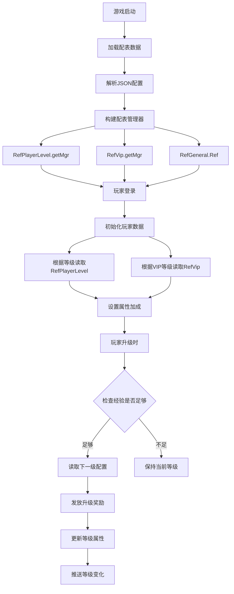
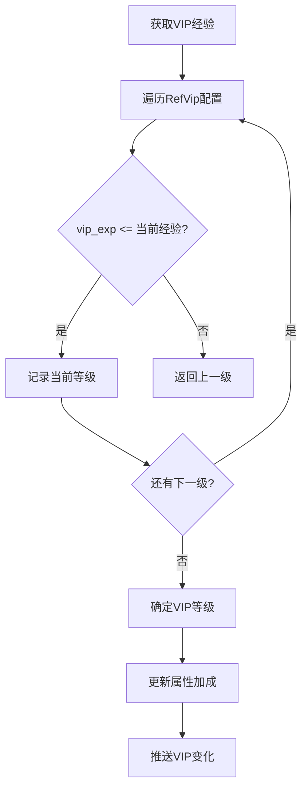
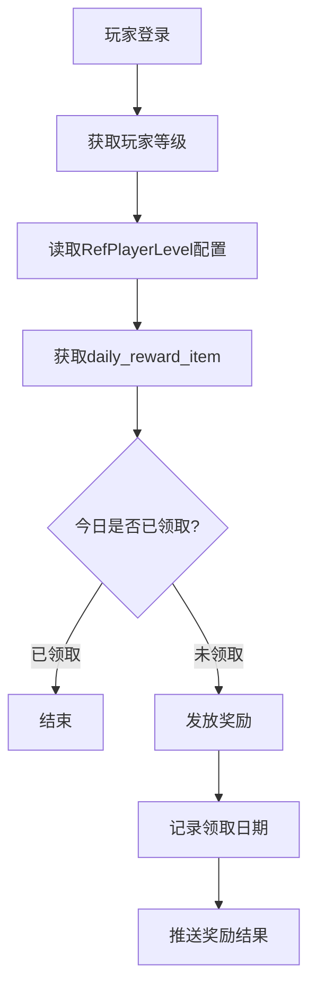
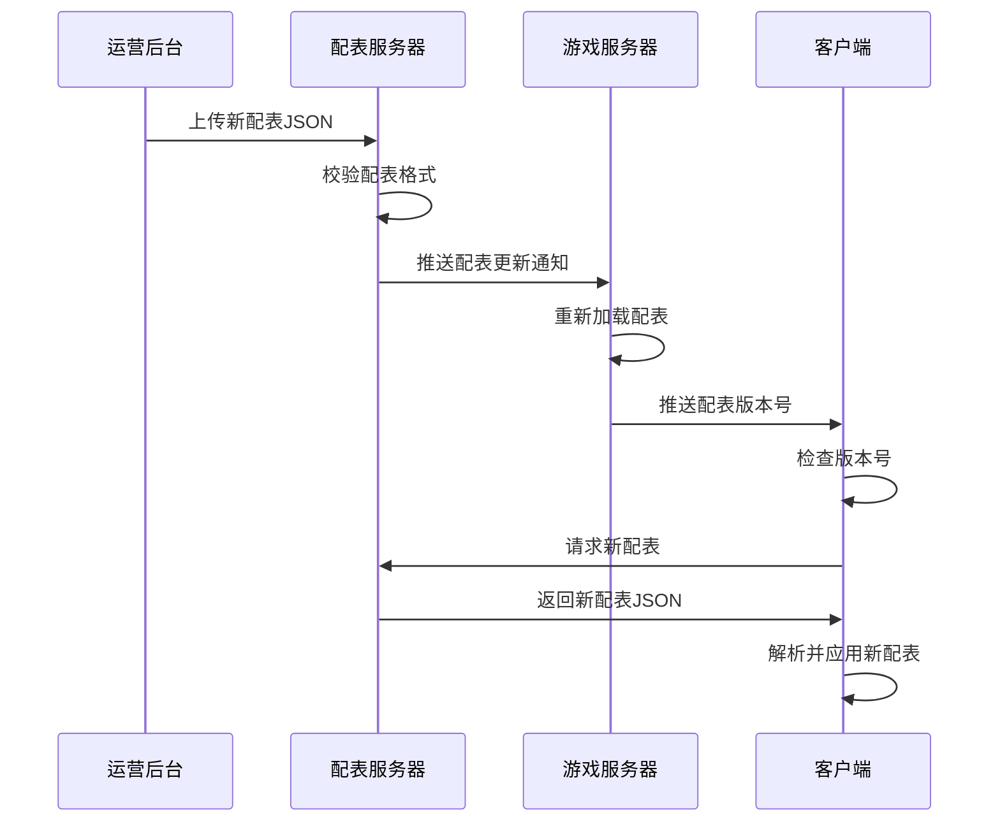

# 玩家模块数据配表文档

## 配表说明

玩家模块相关的配置数据主要存储在以下配表中:

| 配表名称 | 文件名 | 说明 |
|---------|--------|------|
| RefPlayerLevel | player_level_ref.json | 玩家等级配置 |
| RefVip | vip_ref.json | VIP等级配置 |
| RefGeneral | general_ref.json | 通用配置（含基础属性） |

---

## 一、玩家等级配表

### RefPlayerLevel - 玩家等级配置
**文件**: `player_level_ref.json`

| 字段名 | 类型 | 说明 | 示例值 |
|--------|------|------|--------|
| lvl | int | 等级 | 1, 2, 3... |
| exp | long | 升级所需经验 | 100, 500, 1000 |
| earnings | long | 升级所需赚速 | 100, 500, 1000 |
| lvl_up_cond | object | 升级条件配置 | `{condition_list}` |
| current_lvl_consume | NPCommon_ItemInfoList | 当前等级消耗道具列表 | `[item1, item2]` |
| reward_item_list | NPCommon_ItemInfoList | 升级奖励道具列表 | `[gold:1000, diamond:50]` |
| daily_reward_item | NPCommon_ItemInfo | 每日奖励道具 | `{type:1, id:0, count:100}` |
| player_property | NPPlayerPropertyList | 等级属性加成列表 | `[property1, property2]` |
| unlock_feature | object | 解锁功能 | `{feature_id: true}` |

### 等级配置示例

```json
{
  "lvl": 10,
  "exp": 1000,
  "earnings": 500,
  "lvl_up_cond": {
    "condition_list": [
      {"type": "LEVEL", "value": 9}
    ]
  },
  "reward_item_list": [
    {"itemType": 1, "itemId": 0, "count": 500},
    {"itemType": 2, "itemId": 0, "count": 50}
  ],
  "daily_reward_item": {
    "itemType": 1,
    "itemId": 0,
    "count": 100
  },
  "player_property": [
    {"type": "EXTRA_EARNINGS_ADD_PER", "value": 500}
  ]
}
```

---

## 二、VIP等级配表

### RefVip - VIP等级配置
**文件**: `vip_ref.json`

| 字段名 | 类型 | 说明 | 示例值 |
|--------|------|------|--------|
| vip_lvl | int | VIP等级 | 0, 1, 2... |
| vip_exp | long | 达到此等级所需VIP经验 | 0, 100, 500 |
| gain_item_list | NPCommon_ItemInfoList | VIP等级奖励道具列表 | `[diamond:100]` |
| recharge_reward_list | NPCommon_ItemInfoList | VIP充值奖励道具列表 | `[diamond:200]` |
| player_property | NPPlayerPropertyList | VIP属性加成列表 | `[property1]` |

### VIP配置示例

```json
{
  "vip_lvl": 5,
  "vip_exp": 5000,
  "gain_item_list": [
    {"itemType": 2, "itemId": 0, "count": 500}
  ],
  "recharge_reward_list": [
    {"itemType": 2, "itemId": 0, "count": 1000}
  ],
  "player_property": [
    {"type": "EXTRA_EARNINGS_ADD_PER", "value": 1000}
  ]
}
```

---

## 三、玩家参数枚举 (ENPPlayerParam)

**源码路径**: `ClientProtocol/NPEnum/ENPPlayerParam.cs`

### 完整参数列表 (共49个)

| 序号 | 参数名 | 类型 | 说明 | 示例值 |
|------|--------|------|------|--------|
| 0 | NONE | - | 无效默认值 | - |
| 1 | LEVEL | int | 玩家（领主）等级 | 10 |
| 2 | VIP_LVL | int | VIP等级 | 5 |
| 3 | GM_LVL | int | GM权限等级 | 0 |
| 4 | PLAYER_SKIN | long | 玩家使用皮肤Id | 70001 |
| 5 | ICON | long | 玩家头像ID | 10001 |
| 6 | ICON_BGK | long | 头像框ID | 20001 |
| 7 | BUBBLE | long | 玩家使用气泡框Id | 30001 |
| 8 | CREATE_TIME | long | 创角时间戳(秒) | 1640000000 |
| 9 | RECHARGED_GEM | long | 累计充值宝石数量 | 5000 |
| 10 | BIRTH_GIFTDE_COUM | int | 下次出生卷王次数 | 1 |
| 11 | LOGIN_DAY_COUNT | int | 累计登录天数 | 30 |
| 12 | LAST_LOGIN_DATE | int | 最后一次登录日期标记(YYYYMMDD) | 20260411 |
| 13 | LAST_TAKE_VERSION | long | 最后领取客户端版本奖励版本 | 100 |
| 14 | LAST_LEFT_BAG_TIME | long | 最后一次查看背包时间(秒) | 1640000000 |
| 15 | LAST_OFFLINE_MS | long | 最后一次离线时间戳(毫秒) | 1640000000000 |
| 16 | CUTE_ACTOR | long | 玩家Q版形象ID | 60001 |
| 17 | OFFLINE_PERIOD_REWARD_DURATION_MS | long | 离线期间奖励时长(毫秒) | 3600000 |
| 18 | POWER_MAX_RECORD | long | 玩家战力历史记录最高值 | 50000 |
| 19 | EARNINGS_MAX_RECORD | long | 玩家赚速历史记录最高值 | 20000 |
| 20 | PREFAB | long | 玩家预制形象ID | 50001 |
| 21 | LAST_DRAW_DAILY_REWARD_DATE | int | 最后一次领取每日奖励日期 | 20260411 |
| 22 | IS_SPACE_CAM_DRAG | int | 大地图摄像机是否拖拽(0-不可以 1-可以) | 1 |
| 23 | SERVER_START_DAYS | int | 服务器开启天数 | 100 |
| 24 | EXTRA_EARNINGS | long | 额外赚速 | 100 |
| 25 | IS_SET_DEFAULT | long | 已完成创角操作(0-否 1-是) | 1 |
| 26 | BUILDINGS_EARNINGS_MAX_RECORD | long | 建筑赚速历史记录最高值 | 10000 |
| 27 | CHILD_EARNINGS_MAX_RECORD | long | 子嗣赚速历史记录最高值 | 5000 |
| 28 | PLAYER_STAGE | long | 已废弃-玩家段位 | 0 |
| 29 | LAST_LOGIN_WEEK_TAG | long | 最后一次登录周标记 | 202615 |
| 30 | WEEK_LOGIN_DAY_COUNT | int | 本周登录天数 | 5 |
| 31 | LATEST_LOGIN_TIME_MS | long | 最近一次登录时间(毫秒) | 1640000000000 |
| 32 | SEVEN_DAYS_LOGIN_COUNT | int | 七日登录天数 | 7 |
| 33 | HAD_DRAW_VIP_REWARD_LIST | long | 已领取VIP奖励列表(二进制位表示) | 0b11111 |
| 34 | HAD_DRAW_VIP_RECHARGE_REWARD_LIST | long | 已领取VIP充值奖励列表(二进制位表示) | 0b11111 |
| 35 | NATION_POWER_MAX_RECORD | long | 已废弃-玩家国力历史记录最高值 | 0 |
| 36 | MARKET_NEXT_REFRESH_MS | long | 集市下次刷新时间(毫秒) | 1640000000000 |
| 37 | HERO_ATTR_MAX_RECORD | long | 已废弃-单一大臣属性值历史记录最高值 | 0 |
| 38 | CONSORT_CALL_NEXT_REFRESH_MS | long | 情人指定邀约下次刷新时间(毫秒) | 1640000000000 |
| 39 | LAST_GAIN_VISIT_REWARD_DAY | int | 最近一次领取拜访其他玩家奖励日期(YYYYMMDD) | 20260411 |
| 40 | ADULT_RECORD_BONUS | long | 子嗣记录收益总值 | 10000 |
| 41 | IS_SET_PREFAB | long | 已设置预制形象(0-否 1-是) | 1 |
| 42 | DAY_HAD_SEND_PAY_AI_TIMES | int | 每日已发送付费AI次数 | 0 |
| 43 | PENDING_ORDER_DB_ID | long | 待处理订单ID | 0 |
| 44 | IS_REFUSE_MARRY_REQUEST | int | 是否拒绝所有联姻请求(0-否 1-是) | 0 |
| 45 | HAD_MARS_POWER_RANK_OPENED | int | 是否开启过火星实力排行榜(0-否 1-是) | 0 |
| 46 | ROOM_SKIN | long | 房间皮肤ID | 40001 |
| 47 | MARS_GO_ROUTE_ARRIVE_COUNT | int | 累计抵达火星的玩家数量 | 0 |
| 48 | GIFTDE_CHILD_GRADUATE_COUNT | int | 卷王子嗣毕业历史数量 | 5 |

### 参数使用示例

```csharp
// 获取玩家等级
long level = NPPlayer.instance.playerInfo.getValue(ENPPlayerParam.LEVEL);

// 获取VIP等级
long vipLevel = NPPlayer.instance.playerInfo.getValue(ENPPlayerParam.VIP_LVL);

// 检查是否已领取VIP奖励
bool isDrawn = (NPPlayer.instance.playerInfo.getValue(ENPPlayerParam.HAD_DRAW_VIP_REWARD_LIST)
    & (1L << vipLevel)) != 0;
```

---

## 四、玩家数据对象 (PlayerBO)

**源码路径**: `USDB/Bo/PlayerBO.java`

### 数据库字段列表 (共63个字段)

| 字段序号 | 字段名 | 类型 | 说明 | 示例值 |
|----------|--------|------|------|--------|
| 0 | id | long | 数据库表唯一键值(自增) | 1 |
| 1 | cid | long | 玩家CID(主键) | 20001 |
| 2 | cname | String | 玩家名称 | "剑舞春秋" |
| 3 | icon | long | 玩家头像ID | 10001 |
| 4 | iconBgk | long | 玩家头像框ID | 20001 |
| 5 | title | long | 玩家当前使用的称号ID | 30001 |
| 6 | bubble | long | 玩家当前使用的气泡框ID | 40001 |
| 7 | createTime | int | 账号创建时间(秒) | 1640000000 |
| 8 | create_date | int | 账号创建日期 | 20260411 |
| 9 | createRoleTime | int | 创角时间(秒) | 1640000000 |
| 10 | create_role_date | int | 创角日期 | 20260411 |
| 11 | lvl | int | 玩家等级 | 10 |
| 12 | vipLvl | int | VIP等级 | 5 |
| 13 | gmLevel | int | GM权限等级 | 0 |
| 14 | player_lang | String | 玩家语言 | "zh_CN" |
| 15 | last_login_date | int | 最后登录日期 | 20260411 |
| 16 | login_day_count | int | 累计登录天数 | 30 |
| 17 | last_take_version | long | 最后领取奖励的客户端版本 | 100 |
| 18 | recharged_gem | long | 充值钻石数量 | 5000 |
| 19 | last_left_bag_time_s | int | 最后一次查看背包时间(秒) | 1640000000 |
| 20 | lastOfflineMs | long | 最后一次离线时间(毫秒) | 1640000000000 |
| 21 | prefab | long | 玩家预制形象配置ID | 50001 |
| 22 | is_set_default | long | 是否已创角(1-已设置) | 1 |
| 23 | player_stage | long | 玩家段位 | 0 |
| 24 | happy_value_cur_step_value | long | 当前阶段数值 | 0 |
| 25 | last_login_week_tag | long | 最后登录周标记 | 202615 |
| 26 | week_login_day_count | long | 本周登录天数 | 5 |
| 27 | latest_login_time_ms | long | 最近登录时间(毫秒) | 1640000000000 |
| 28 | uid | String | 平台账号 | "platform_uid" |
| 29 | adfrom | String | 渠道 | "default" |
| 30 | adfrom2 | String | 二级渠道 | "" |
| 31 | adid | String | 设备ID | "device_id" |
| 32 | clientPackageName | String | 客户端包名 | "com.game.k2c" |
| 33 | clientVerion | String | 客户端版本 | "1.0.0" |
| 34 | nation | String | 国家 | "CN" |
| 35 | ar_ip | String | 注册IP | "127.0.0.1" |
| 36 | sdkid | String | 渠道账号 | "" |
| 37 | recharged_money | long | 充值货币金额(分) | 50000 |
| 38 | power_max_record | long | 玩家实力历史记录最高值 | 50000 |
| 39 | earnings_max_record | long | 玩家赚速历史记录最高值 | 20000 |
| 40 | market_next_refresh_ms | long | 集市下次刷新时间 | 1640000000000 |
| 41 | last_log_section_day | int | 上次截面日志记录日期 | 20260411 |
| 42 | last_gain_visit_reward_day | int | 上次领取拜访奖励日期 | 20260411 |
| 43 | cute_actor_id | long | Q版形象ID | 60001 |
| 44 | consort_call_next_refresh_ms | long | 情人指定邀约下次刷新时间 | 1640000000000 |
| 45 | birth_giftde_coum | int | 下次出生卷王次数 | 1 |
| 46 | adult_record_bonus | long | 子嗣记录收益总值 | 10000 |
| 47 | last_draw_daily_reward_date | int | 最后领取每日奖励日期 | 20260411 |
| 48 | extra_earnings | long | 额外赚速 | 100 |
| 49 | building_earnings_max_record | long | 建筑赚速历史记录最高值 | 10000 |
| 50 | child_earnings_max_record | long | 子嗣赚速历史记录最高值 | 5000 |
| 51 | seven_days_login_cal_offset | int | 七天登录计算偏移量 | 0 |
| 52 | curTitle | byte[] | 当前称号数据(序列化) | bytes |
| 53 | curTitleShow | boolean | 当前称号是否对外展示 | true |
| 54 | curPlayerSkin | long | 当前玩家皮肤ID | 70001 |
| 55 | is_set_prefab | long | 是否已设置预制形象(1-已设置) | 1 |
| 56 | pending_order_db_id | long | 待处理订单数据ID | 0 |
| 57 | isMarsGoRouteDone | boolean | 火星-前往火星全部阶段完成 | false |
| 58 | had_draw_vip_level_reward | long | VIP等级奖励领取记录(位图) | 0b11111 |
| 59 | had_draw_vip_level_recharge_reward | long | VIP充值奖励领取记录(位图) | 0b11111 |
| 60 | isStoreReviews | boolean | 是否已商店评价 | false |
| 61 | room_skin | long | 房间皮肤ID | 40001 |
| 62 | giftde_child_graduate_count | int | 卷王子嗣毕业历史数量 | 5 |

### 数据库表结构

```sql
CREATE TABLE IF NOT EXISTS `player` (
    `id` bigint(20) NOT NULL AUTO_INCREMENT COMMENT '自增主键',
    `cid` bigint(20) NOT NULL DEFAULT '0' COMMENT '玩家CID',
    `cname` varchar(64) NOT NULL DEFAULT '' COMMENT '玩家名称',
    `icon` bigint(20) NOT NULL DEFAULT '0' COMMENT '玩家头像',
    `iconBgk` bigint(20) NOT NULL DEFAULT '0' COMMENT '玩家头像框',
    `title` bigint(20) NOT NULL DEFAULT '0' COMMENT '玩家当前使用的称号',
    `bubble` bigint(20) NOT NULL DEFAULT '0' COMMENT '玩家当前使用的气泡框',
    `lvl` int(11) NOT NULL DEFAULT '0' COMMENT '玩家等级',
    `vipLvl` int(11) NOT NULL DEFAULT '0' COMMENT 'VIP等级',
    `earnings_max_record` bigint(20) NOT NULL DEFAULT '0' COMMENT '玩家赚速历史记录最高值',
    `power_max_record` bigint(20) NOT NULL DEFAULT '0' COMMENT '玩家实力历史记录最高值',
    -- ... 其他字段
    KEY `cid` (`cid`),
    KEY `lastOfflineMs` (`lastOfflineMs`),
    PRIMARY KEY (`id`)
) COMMENT='玩家基本数据' engine=MyISAM DEFAULT CHARSET=utf8mb4;
```

---

## 五、玩家属性类型 (ENPPlayerPropertyType)

| 属性名 | 说明 | 计算公式 |
|--------|------|----------|
| EXTRA_EARNINGS_ADD_PER | 额外赚速加成百分比 | `(base + modifiers) / 10000` |
| 其他属性... | 根据配置扩展 | - |

---

## 六、玩家数据结构对象

### Player_GoldInfo - 金币信息
**路径**: `ClientProtocol/Common/PlayerObj/Player_GoldInfo.cs`

| 字段名 | 类型 | 说明 |
|--------|------|------|
| lastSettleTimeMs | long | 上次结算时间(毫秒) |
| count | long | 当前数量 |
| outputSpeed | long | 产出速度 |
| totalConsumeCount | long | 总消耗数量 |

### Player_StationInfo - 贸易站信息
**路径**: `ClientProtocol/Common/PlayerObj/Player_StationInfo.cs`

| 字段名 | 类型 | 说明 |
|--------|------|------|
| level | int | 贸易站等级 |
| hadOutputNum | long | 已产出数量 |
| hadOutputSec | long | 已产出时间(秒) |
| lastSettleTimeMs | long | 上次结算时间(毫秒) |

### Player_EventRecordInfo - 事件记录信息
**路径**: `ClientProtocol/Common/PlayerObj/Player_EventRecordInfo.cs`

| 字段名 | 类型 | 说明 |
|--------|------|------|
| type | EPlayerEventRecordType | 事件类型枚举 |
| subId | long | 子ID |
| count | long | 记录数量 |

### Player_HeroShowInfo - 大臣展示信息
**路径**: `ClientProtocol/Common/PlayerObj/Player_HeroShowInfo.cs`

| 字段名 | 类型 | 说明 |
|--------|------|------|
| cid | long | 玩家ID |
| heroId | long | 大臣ID |
| level | int | 大臣等级 |
| skinId | long | 大臣皮肤ID |

### Player_MarsEnergyInfo - 火星能量信息
**路径**: `ClientProtocol/Common/PlayerObj/Player_MarsEnergyInfo.cs`

| 字段名 | 类型 | 说明 |
|--------|------|------|
| lastSettleTimeMs | long | 上次结算时间(毫秒) |
| count | long | 当前能量值 |
| costSpeed | long | 消耗速度(分钟) |

---

## 七、配表加载方式

### 7.1 客户端加载

```csharp
// 获取玩家等级配置
RefPlayerLevel levelRef = RefPlayerLevel.getMgr().get(level);

// 获取VIP等级配置
RefVip vipRef = RefVip.getMgr().get(vipLevel);

// 获取玩家参数值
long iconId = NPPlayer.instance.playerComponent.getParamV(ENPPlayerParam.ICON);
long vipLvl = NPPlayer.instance.playerComponent.getParamV(ENPPlayerParam.VIP_LVL);

// 获取通用配置中的玩家属性
NPPlayerPropertyContainer container = NPPlayer.instance.playerPropertyMgr.getPropertyContainer();
long earningsAdd = container.getValue(ENPPlayerPropertyType.EXTRA_EARNINGS_ADD_PER);
```

### 7.2 服务端加载

```java
// 获取玩家等级配置
RefPlayerLevel levelRef = RefPlayerLevel.getMgr().get(level);

// 获取VIP等级配置
RefVip vipRef = RefVip.getMgr().get(vipLevel);

// 获取通用配置
RefGeneral generalRef = RefGeneral.Ref();

// 获取属性加成列表
NPPlayerPropertyList propertyList = levelRef.player_property;
```

---

## 八、配表数据流程图

### 8.1 配表加载流程



### 8.2 VIP等级判定流程



### 8.3 每日奖励计算流程



---

## 九、字段校验规则

### 9.1 等级配置校验

| 字段名 | 校验规则 | 异常处理 |
|--------|----------|----------|
| lvl | 必须唯一，范围 1-MAX | 配表加载时去重 |
| exp | 必须 > 0，递增 | 配表加载时校验递增 |
| earnings | 必须 >= 0 | 配表加载时校验 |
| reward_item_list | 可为空，元素必须有效 | 运行时校验道具ID |
| player_property | 可为空，类型必须有效 | 运行时校验属性类型 |

### 9.2 VIP配置校验

| 字段名 | 校验规则 | 异常处理 |
|--------|----------|----------|
| vip_lvl | 必须唯一，范围 0-MAX | 配表加载时去重 |
| vip_exp | 必须 >= 0，递增 | 配表加载时校验递增 |
| gain_item_list | 可为空，元素必须有效 | 运行时校验道具ID |
| recharge_reward_list | 可为空，元素必须有效 | 运行时校验道具ID |
| player_property | 可为空，类型必须有效 | 运行时校验属性类型 |

### 9.3 数据类型约束

| 数据类型 | 取值范围 | 存储格式 |
|----------|----------|----------|
| int | -2147483648 ~ 2147483647 | 32位整数 |
| long | -9223372036854775808 ~ 9223372036854775807 | 64位整数 |
| string | UTF-8编码 | 字符串 |
| object | JSON对象 | 序列化存储 |
| NPCommon_ItemInfoList | 道具列表数组 | 序列化存储 |
| NPPlayerPropertyList | 属性列表数组 | 序列化存储 |

---

## 十、配表热更新机制

### 10.1 配表更新流程



### 10.2 配表版本管理

```json
{
  "version": "1.0.5",
  "updateTime": "2026-04-11 10:00:00",
  "tables": {
    "player_level_ref": "hash_md5_1",
    "vip_ref": "hash_md5_2",
    "general_ref": "hash_md5_3"
  }
}
```

---

*文档生成时间: 2026-04-11*
*源码参考路径: `/game_server/UserServer/src/NPUSServer/NPUSUserMgr/UserComp/PlayerComp/`*