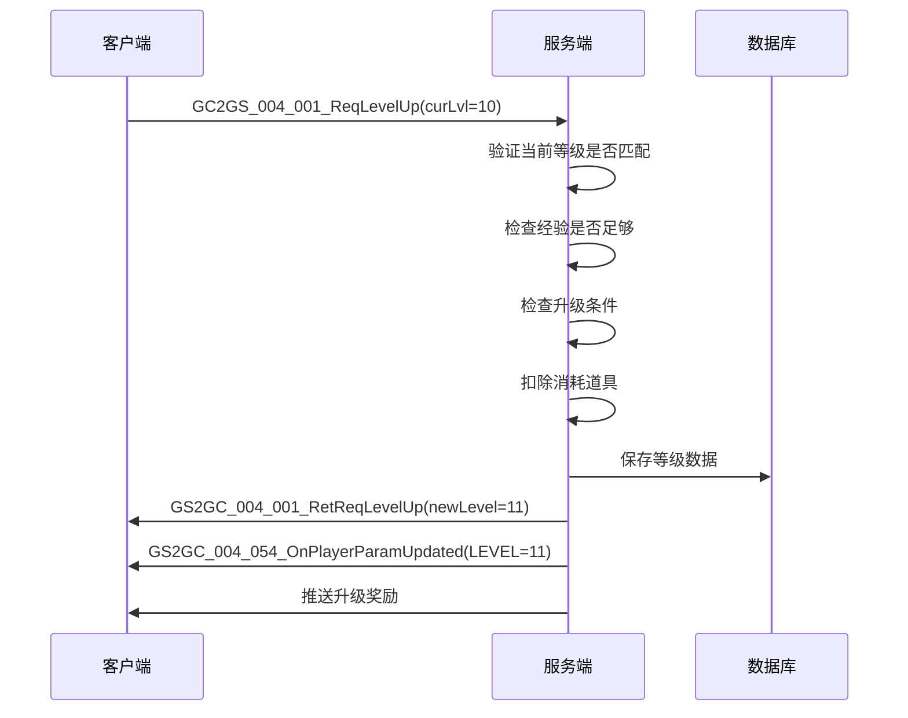
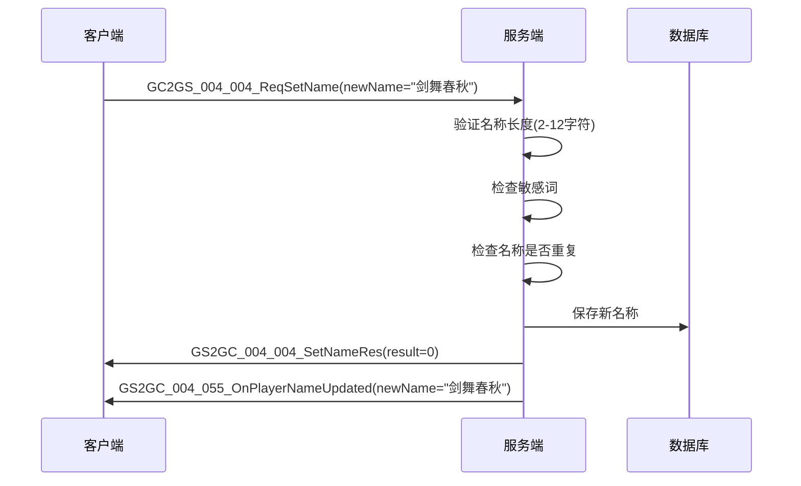
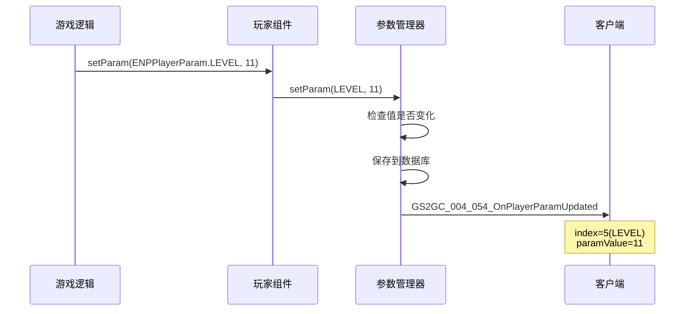

# 玩家模块协议文档

## 协议模块编号: p004

**源码路径**:
- 客户端请求: `ClientProtocol/GC2GS/p004_PlayerOp/`
- 服务端响应: `ClientProtocol/GS2GC/p004_PlayerOp/`

---

## 一、协议总览

### 1.1 协议分类

| 分类 | 主序号 | 说明 |
|------|--------|------|
| 玩家操作协议 | 4 | 玩家相关操作请求/响应 |

### 1.2 协议架构图

```mermaid
graph TB
    subgraph 客户端请求 GC2GS
        A1[001_ReqLevelUp 升级]
        A2[002_ReqGmCommand GM命令]
        A3[004_ReqSetName 设置名称]
        A4[005_ReqSetIcon 设置头像]
        A5[006_ReqSetPrefab 设置模型]
        A6[007_ReqSetIconBgk 设置头像框]
        A7[008_ReqSetDefault 设置默认]
        A8[009_ReqSetBubble 设置气泡]
        A9[010_ReqSomeOnePlayerInfo 获取玩家信息]
        A10[011_ReqSomeOnePlayerBriefInfo 获取简要信息]
        A11[012_ReqTitleRecordList 称号记录列表]
        A12[013_ReqReportPlayer 举报玩家]
        A13[014_ReqGainVisitOtherPlayerReward 拜访奖励]
        A14[015_ReqWeekCardSettleInfo 周卡结算信息]
        A15[019_ReqDrawDailyReward 领取每日奖励]
        A16[036_ReqDrawLoginCountReward 登录奖励]
        A17[037_ReqDrawVipLevelReward VIP等级奖励]
        A18[038_ReqDrawVipLevelRechargeReward VIP充值奖励]
    end

    subgraph 服务端响应 GS2GC
        B1[001_RetReqLevelUp 升级结果]
        B2[002_RetGmCommand GM命令结果]
        B3[004_SetNameRes 设置名称结果]
        B4[005_SetIconRes 设置头像结果]
        B5[010_RetSomeOnePlayerInfo 玩家信息]
        B6[051_PushCurrencyInfo 货币推送]
        B7[054_OnPlayerParamUpdated 参数更新推送]
        B8[055_OnPlayerNameUpdated 名称更新推送]
        B9[056_OnGoldInfoChg 金币信息变化]
    end

    A1 --> B1
    A3 --> B3
    A4 --> B4
    A9 --> B5
```



---

## 二、请求协议 (GC2GS)

### 2.1 等级相关

#### GC2GS_004_001_ReqLevelUp - 请求升级
**主序号**: 4 | **子序号**: 1

| 字段名 | 类型 | 说明 | 必填 |
|--------|------|------|------|
| curLvl | int | 当前等级(用于校验) | 是 |

**请求示例**:
```csharp
GC2GS_004_001_ReqLevelUp req = new GC2GS_004_001_ReqLevelUp();
req.setCurLvl(10);
// 发送请求
```

---

### 2.2 GM命令

#### GC2GS_004_002_ReqGmCommand - GM命令
**主序号**: 4 | **子序号**: 2

| 字段名 | 类型 | 说明 | 必填 |
|--------|------|------|------|
| command | string | GM命令 | 是 |
| param | string | 命令参数 | 否 |

**请求示例**:
```csharp
GC2GS_004_002_ReqGmCommand req = new GC2GS_004_002_ReqGmCommand();
req.setCommand("addexp");
req.setParam("1000");
```

---

### 2.3 信息设置

#### GC2GS_004_004_ReqSetName - 设置名称
**主序号**: 4 | **子序号**: 4

| 字段名 | 类型 | 说明 | 必填 | 校验规则 |
|--------|------|------|------|----------|
| newName | string | 新名称 | 是 | 2-12字符,无敏感词,全服唯一 |

**请求示例**:
```csharp
GC2GS_004_004_ReqSetName req = new GC2GS_004_004_ReqSetName();
req.setNewName("剑舞春秋");
```

#### GC2GS_004_005_ReqSetIcon - 设置头像
**主序号**: 4 | **子序号**: 5

| 字段名 | 类型 | 说明 | 必填 |
|--------|------|------|------|
| iconId | long | 头像ID | 是 |

**请求示例**:
```csharp
GC2GS_004_005_ReqSetIcon req = new GC2GS_004_005_ReqSetIcon();
req.setIconId(10001);
```

#### GC2GS_004_006_ReqSetPrefab - 设置模型
**主序号**: 4 | **子序号**: 6

| 字段名 | 类型 | 说明 | 必填 |
|--------|------|------|------|
| prefabId | long | 模型ID | 是 |

#### GC2GS_004_007_ReqSetIconBgk - 设置头像框
**主序号**: 4 | **子序号**: 7

| 字段名 | 类型 | 说明 | 必填 |
|--------|------|------|------|
| iconBgkId | long | 头像框ID | 是 |

#### GC2GS_004_008_ReqSetDefault - 设置默认
**主序号**: 4 | **子序号**: 8

| 字段名 | 类型 | 说明 | 必填 |
|--------|------|------|------|
| type | int | 类型 | 是 |

#### GC2GS_004_009_ReqSetBubble - 设置气泡
**主序号**: 4 | **子序号**: 9

| 字段名 | 类型 | 说明 | 必填 |
|--------|------|------|------|
| bubbleId | long | 气泡ID | 是 |

#### GC2GS_004_022_ReqSetCuteActor - 设置Q版形象
**主序号**: 4 | **子序号**: 22

| 字段名 | 类型 | 说明 | 必填 |
|--------|------|------|------|
| cuteActorId | long | Q版形象ID | 是 |

#### GC2GS_004_047_ReqSetRoomSkin - 设置房间皮肤
**主序号**: 4 | **子序号**: 47

| 字段名 | 类型 | 说明 | 必填 |
|--------|------|------|------|
| roomSkinId | long | 房间皮肤ID | 是 |

---

### 2.4 信息查询

#### GC2GS_004_010_ReqSomeOnePlayerInfo - 获取玩家信息
**主序号**: 4 | **子序号**: 10

| 字段名 | 类型 | 说明 | 必填 |
|--------|------|------|------|
| cid | long | 玩家ID | 是 |

**请求示例**:
```csharp
GC2GS_004_010_ReqSomeOnePlayerInfo req = new GC2GS_004_010_ReqSomeOnePlayerInfo();
req.setCid(20001);
```

#### GC2GS_004_011_ReqSomeOnePlayerBriefInfo - 获取玩家简要信息
**主序号**: 4 | **子序号**: 11

| 字段名 | 类型 | 说明 | 必填 |
|--------|------|------|------|
| cid | long | 玩家ID | 是 |

#### GC2GS_004_012_ReqTitleRecordList - 获取称号记录列表
**主序号**: 4 | **子序号**: 12

| 字段名 | 类型 | 说明 | 必填 |
|--------|------|------|------|
| - | - | 无参数 | - |

---

### 2.5 社交相关

#### GC2GS_004_013_ReqReportPlayer - 举报玩家
**主序号**: 4 | **子序号**: 13

| 字段名 | 类型 | 说明 | 必填 |
|--------|------|------|------|
| targetCid | long | 被举报玩家ID | 是 |
| reason | string | 举报原因 | 是 |

#### GC2GS_004_031_ReqSetShieldPlayer - 屏蔽玩家
**主序号**: 4 | **子序号**: 31

| 字段名 | 类型 | 说明 | 必填 |
|--------|------|------|------|
| targetCid | long | 被屏蔽玩家ID | 是 |

#### GC2GS_004_032_ReqUnsetShieldPlayer - 取消屏蔽玩家
**主序号**: 4 | **子序号**: 32

| 字段名 | 类型 | 说明 | 必填 |
|--------|------|------|------|
| targetCid | long | 被取消屏蔽玩家ID | 是 |

#### GC2GS_004_033_ReqTodayLikeCidInfo - 今日点赞信息
**主序号**: 4 | **子序号**: 33

| 字段名 | 类型 | 说明 | 必填 |
|--------|------|------|------|
| - | - | 无参数 | - |

#### GC2GS_004_034_ReqPlayerDetailLike - 点赞玩家
**主序号**: 4 | **子序号**: 34

| 字段名 | 类型 | 说明 | 必填 |
|--------|------|------|------|
| targetCid | long | 被点赞玩家ID | 是 |

#### GC2GS_004_035_ReqSelfLikeCount - 获取自己被点赞数
**主序号**: 4 | **子序号**: 35

| 字段名 | 类型 | 说明 | 必填 |
|--------|------|------|------|
| - | - | 无参数 | - |

---

### 2.6 奖励领取

#### GC2GS_004_019_ReqDrawDailyReward - 领取每日奖励
**主序号**: 4 | **子序号**: 19

| 字段名 | 类型 | 说明 | 必填 |
|--------|------|------|------|
| - | - | 无参数 | - |

#### GC2GS_004_036_ReqDrawLoginCountReward - 领取登录奖励
**主序号**: 4 | **子序号**: 36

| 字段名 | 类型 | 说明 | 必填 |
|--------|------|------|------|
| rewardId | long | 奖励ID | 是 |

#### GC2GS_004_037_ReqDrawVipLevelReward - 领取VIP等级奖励
**主序号**: 4 | **子序号**: 37

| 字段名 | 类型 | 说明 | 必填 |
|--------|------|------|------|
| vipLevel | int | VIP等级 | 是 |

#### GC2GS_004_038_ReqDrawVipLevelRechargeReward - 领取VIP充值奖励
**主序号**: 4 | **子序号**: 38

| 字段名 | 类型 | 说明 | 必填 |
|--------|------|------|------|
| vipLevel | int | VIP等级 | 是 |

---

### 2.7 周卡相关

#### GC2GS_004_015_ReqWeekCardSettleInfo - 周卡结算信息
**主序号**: 4 | **子序号**: 15

| 字段名 | 类型 | 说明 | 必填 |
|--------|------|------|------|
| - | - | 无参数 | - |

#### GC2GS_004_016_ReqWeekCardChgSetting - 周卡设置变更
**主序号**: 4 | **子序号**: 16

| 字段名 | 类型 | 说明 | 必填 |
|--------|------|------|------|
| setting | int | 设置项 | 是 |

#### GC2GS_004_017_ReqWeekCardActiveFreeTrial - 激活周卡免费试用
**主序号**: 4 | **子序号**: 17

| 字段名 | 类型 | 说明 | 必填 |
|--------|------|------|------|
| - | - | 无参数 | - |

#### GC2GS_004_018_ReqWeekCardChgNPC - 周卡NPC变更
**主序号**: 4 | **子序号**: 18

| 字段名 | 类型 | 说明 | 必填 |
|--------|------|------|------|
| npcId | long | NPC ID | 是 |

---

### 2.8 支付相关

#### GC2GS_004_020_ReqCreatePayOrder - 创建支付订单
**主序号**: 4 | **子序号**: 20

| 字段名 | 类型 | 说明 | 必填 |
|--------|------|------|------|
| productId | string | 商品ID | 是 |
| payType | int | 支付类型 | 是 |

#### GC2GS_004_021_ReqClientPayDone - 客户端支付完成
**主序号**: 4 | **子序号**: 21

| 字段名 | 类型 | 说明 | 必填 |
|--------|------|------|------|
| orderId | string | 订单ID | 是 |

#### GC2GS_004_026_ReqClientPayCancel - 客户端取消支付
**主序号**: 4 | **子序号**: 26

| 字段名 | 类型 | 说明 | 必填 |
|--------|------|------|------|
| orderId | string | 订单ID | 是 |

---

### 2.9 完整请求协议列表

| 协议名 | 主序号 | 子序号 | 说明 |
|--------|--------|--------|------|
| GC2GS_004_001_ReqLevelUp | 4 | 1 | 请求升级 |
| GC2GS_004_002_ReqGmCommand | 4 | 2 | GM命令 |
| GC2GS_004_004_ReqSetName | 4 | 4 | 设置名称 |
| GC2GS_004_005_ReqSetIcon | 4 | 5 | 设置头像 |
| GC2GS_004_006_ReqSetPrefab | 4 | 6 | 设置模型 |
| GC2GS_004_007_ReqSetIconBgk | 4 | 7 | 设置头像框 |
| GC2GS_004_008_ReqSetDefault | 4 | 8 | 设置默认 |
| GC2GS_004_009_ReqSetBubble | 4 | 9 | 设置气泡 |
| GC2GS_004_010_ReqSomeOnePlayerInfo | 4 | 10 | 获取玩家信息 |
| GC2GS_004_011_ReqSomeOnePlayerBriefInfo | 4 | 11 | 获取玩家简要信息 |
| GC2GS_004_012_ReqTitleRecordList | 4 | 12 | 获取称号记录列表 |
| GC2GS_004_013_ReqReportPlayer | 4 | 13 | 举报玩家 |
| GC2GS_004_014_ReqGainVisitOtherPlayerReward | 4 | 14 | 领取拜访奖励 |
| GC2GS_004_015_ReqWeekCardSettleInfo | 4 | 15 | 周卡结算信息 |
| GC2GS_004_016_ReqWeekCardChgSetting | 4 | 16 | 周卡设置变更 |
| GC2GS_004_017_ReqWeekCardActiveFreeTrial | 4 | 17 | 激活周卡试用 |
| GC2GS_004_018_ReqWeekCardChgNPC | 4 | 18 | 周卡NPC变更 |
| GC2GS_004_019_ReqDrawDailyReward | 4 | 19 | 领取每日奖励 |
| GC2GS_004_020_ReqCreatePayOrder | 4 | 20 | 创建支付订单 |
| GC2GS_004_021_ReqClientPayDone | 4 | 21 | 支付完成 |
| GC2GS_004_022_ReqSetCuteActor | 4 | 22 | 设置Q版形象 |
| GC2GS_004_023_ReqGainChatBox | 4 | 23 | 领取聊天框 |
| GC2GS_004_024_ReqRefreshChatBoxStatus | 4 | 24 | 刷新聊天框状态 |
| GC2GS_004_025_ReqHireEmployee | 4 | 25 | 雇佣员工 |
| GC2GS_004_026_ReqClientPayCancel | 4 | 26 | 取消支付 |
| GC2GS_004_027_ReqOrderVoucherPay | 4 | 27 | 订单券支付 |
| GC2GS_004_031_ReqSetShieldPlayer | 4 | 31 | 屏蔽玩家 |
| GC2GS_004_032_ReqUnsetShieldPlayer | 4 | 32 | 取消屏蔽 |
| GC2GS_004_033_ReqTodayLikeCidInfo | 4 | 33 | 今日点赞信息 |
| GC2GS_004_034_ReqPlayerDetailLike | 4 | 34 | 点赞玩家 |
| GC2GS_004_035_ReqSelfLikeCount | 4 | 35 | 自己被点赞数 |
| GC2GS_004_036_ReqDrawLoginCountReward | 4 | 36 | 领取登录奖励 |
| GC2GS_004_037_ReqDrawVipLevelReward | 4 | 37 | 领取VIP等级奖励 |
| GC2GS_004_038_ReqDrawVipLevelRechargeReward | 4 | 38 | 领取VIP充值奖励 |
| GC2GS_004_039_ReqBuyRankGiftPack | 4 | 39 | 购买排行榜礼包 |
| GC2GS_004_041_ReqGraveNewInfoList | 4 | 41 | 墓地新信息列表 |
| GC2GS_004_042_ReqGraveRecordList | 4 | 42 | 墓地记录列表 |
| GC2GS_004_043_ReqGraveCelebrate | 4 | 43 | 墓地庆祝 |
| GC2GS_004_044_ReqGraveConNewInfoList | 4 | 44 | 墓地亲具新信息列表 |
| GC2GS_004_045_ReqGraveConNewInfo | 4 | 45 | 墓地亲具新信息 |
| GC2GS_004_046_ReqTriggerPushGiftGroup | 4 | 46 | 触发推送礼包组 |
| GC2GS_004_047_ReqSetRoomSkin | 4 | 47 | 设置房间皮肤 |
| GC2GS_004_048_ReqMarkPushGiftAsRead | 4 | 48 | 标记推送礼包已读 |
| GC2GS_004_101_ReqRushExchange | 4 | 101 | 抢兑 |
| GC2GS_004_102_ReqRushExchangeRefresh | 4 | 102 | 抢兑刷新 |
| GC2GS_004_103_ReqRushExchangeReward | 4 | 103 | 抢兑奖励 |
| GC2GS_004_104_ReqSetLoverTarget | 4 | 104 | 设置恋人目标 |
| GC2GS_004_105_ReqClaimLover | 4 | 105 | 认领恋人 |

---

## 三、响应协议 (GS2GC)

### 3.1 等级相关响应

#### GS2GC_004_001_RetReqLevelUp - 升级结果
**主序号**: 4 | **子序号**: 1

| 字段名 | 类型 | 说明 |
|--------|------|------|
| newLevel | int | 新等级 |

**响应示例**:
```csharp
// 接收到响应
GS2GC_004_001_RetReqLevelUp res = ...;
int newLevel = res.getNewLevel(); // 获取新等级
```

#### GS2GC_004_002_RetGmCommand - GM命令结果
**主序号**: 4 | **子序号**: 2

| 字段名 | 类型 | 说明 |
|--------|------|------|
| result | int | 结果码 |
| message | string | 返回消息 |

---

### 3.2 信息设置响应

#### GS2GC_004_004_SetNameRes - 设置名称结果
**主序号**: 4 | **子序号**: 4

| 字段名 | 类型 | 说明 |
|--------|------|------|
| result | int | 结果码 |
| newName | string | 新名称 |

#### GS2GC_004_005_SetIconRes - 设置头像结果
**主序号**: 4 | **子序号**: 5

| 字段名 | 类型 | 说明 |
|--------|------|------|
| result | int | 结果码 |
| iconId | long | 头像ID |

#### GS2GC_004_006_RetSetPrefab - 设置模型结果
**主序号**: 4 | **子序号**: 6

| 字段名 | 类型 | 说明 |
|--------|------|------|
| result | int | 结果码 |
| prefabId | long | 模型ID |

#### GS2GC_004_007_SetIconBgkRes - 设置头像框结果
**主序号**: 4 | **子序号**: 7

| 字段名 | 类型 | 说明 |
|--------|------|------|
| result | int | 结果码 |
| iconBgkId | long | 头像框ID |

#### GS2GC_004_008_RetSetDefault - 设置默认结果
**主序号**: 4 | **子序号**: 8

| 字段名 | 类型 | 说明 |
|--------|------|------|
| result | int | 结果码 |

#### GS2GC_004_009_SetBubbleRes - 设置气泡结果
**主序号**: 4 | **子序号**: 9

| 字段名 | 类型 | 说明 |
|--------|------|------|
| result | int | 结果码 |
| bubbleId | long | 气泡ID |

---

### 3.3 信息查询响应

#### GS2GC_004_010_RetSomeOnePlayerInfo - 玩家信息
**主序号**: 4 | **子序号**: 10

| 字段名 | 类型 | 说明 |
|--------|------|------|
| someOneShowInfo | PlayerInfo_CommonShow | 玩家展示信息 |

#### GS2GC_004_011_RetSomeOnePlayerBriefInfo - 玩家简要信息
**主序号**: 4 | **子序号**: 11

| 字段名 | 类型 | 说明 |
|--------|------|------|
| briefInfo | PlayerInfo_Brief | 玩家简要信息 |

#### GS2GC_004_012_RetTitleRecordList - 称号记录列表
**主序号**: 4 | **子序号**: 12

| 字段名 | 类型 | 说明 |
|--------|------|------|
| titleList | List\<TitleInfo\> | 称号列表 |

---

### 3.4 推送协议

#### GS2GC_004_051_PushCurrencyInfo - 货币推送
**主序号**: 4 | **子序号**: 51

| 字段名 | 类型 | 说明 |
|--------|------|------|
| currencyInfo | NPCommon_CurrencyInfo | 货币信息 |

**响应示例**:
```csharp
GS2GC_004_051_PushCurrencyInfo push = ...;
NPCommon_CurrencyInfo info = push.getCurrencyInfo();
// 获取货币类型和数量
```

#### GS2GC_004_052_OnPlayerBuffRemove - Buff移除推送
**主序号**: 4 | **子序号**: 52

| 字段名 | 类型 | 说明 |
|--------|------|------|
| buffId | long | Buff ID |

#### GS2GC_004_053_OnPlayerBuffChg - Buff变化推送
**主序号**: 4 | **子序号**: 53

| 字段名 | 类型 | 说明 |
|--------|------|------|
| buffInfo | PlayerBuffInfo | Buff信息 |

#### GS2GC_004_054_OnPlayerParamUpdated - 参数更新推送
**主序号**: 4 | **子序号**: 54

| 字段名 | 类型 | 说明 |
|--------|------|------|
| index | int | 参数索引(ENPPlayerParam) |
| paramValue | long | 参数值 |

**源码定义** (`GS2GC_004_054_OnPlayerParamUpdated.cs`):
```csharp
public class GS2GC_004_054_OnPlayerParamUpdated : _IALProtocolStructure {
    private int index;          // 参数索引，对应 ENPPlayerParam 枚举
    private long paramValue;    // 参数值

    public byte getMainOrder() { return (byte)4; }
    public byte getSubOrder() { return (byte)54; }

    public int getIndex() { return index; }
    public long getParamValue() { return paramValue; }
}
```

**响应示例**:
```csharp
GS2GC_004_054_OnPlayerParamUpdated push = ...;
int paramIndex = push.getIndex();  // 对应ENPPlayerParam枚举
long value = push.getParamValue(); // 新值
```

#### GS2GC_004_055_OnPlayerNameUpdated - 名称更新推送
**主序号**: 4 | **子序号**: 55

| 字段名 | 类型 | 说明 |
|--------|------|------|
| newName | string | 新名称 |

#### GS2GC_004_056_OnGoldInfoChg - 金币信息变化推送
**主序号**: 4 | **子序号**: 56

| 字段名 | 类型 | 说明 |
|--------|------|------|
| goldInfo | Player_GoldInfo | 金币信息 |

#### GS2GC_004_057_OnStationInfoChg - 贸易站信息变化推送
**主序号**: 4 | **子序号**: 57

| 字段名 | 类型 | 说明 |
|--------|------|------|
| stationInfo | Player_StationInfo | 贸易站信息 |

#### GS2GC_004_058_OnLoginCountChg - 登录天数变化推送
**主序号**: 4 | **子序号**: 58

| 字段名 | 类型 | 说明 |
|--------|------|------|
| loginCount | int | 登录天数 |

#### GS2GC_004_059_PushActivityCurrencyInfo - 活动货币推送
**主序号**: 4 | **子序号**: 59

| 字段名 | 类型 | 说明 |
|--------|------|------|
| activityCurrencyInfo | ActivityCurrencyInfo | 活动货币信息 |

#### GS2GC_004_060_OnPlayerRecordChg - 玩家记录变化推送
**主序号**: 4 | **子序号**: 60

| 字段名 | 类型 | 说明 |
|--------|------|------|
| recordInfo | Player_RecordInfo | 记录信息 |

#### GS2GC_004_061_OnPlayerBuffTrigger - Buff触发推送
**主序号**: 4 | **子序号**: 61

| 字段名 | 类型 | 说明 |
|--------|------|------|
| buffId | long | Buff ID |

---

### 3.5 完整响应协议列表

| 协议名 | 主序号 | 子序号 | 类型 | 说明 |
|--------|--------|--------|------|------|
| GS2GC_004_001_RetReqLevelUp | 4 | 1 | 响应 | 升级结果 |
| GS2GC_004_002_RetGmCommand | 4 | 2 | 响应 | GM命令结果 |
| GS2GC_004_004_SetNameRes | 4 | 4 | 响应 | 设置名称结果 |
| GS2GC_004_005_SetIconRes | 4 | 5 | 响应 | 设置头像结果 |
| GS2GC_004_006_RetSetPrefab | 4 | 6 | 响应 | 设置模型结果 |
| GS2GC_004_007_SetIconBgkRes | 4 | 7 | 响应 | 设置头像框结果 |
| GS2GC_004_008_RetSetDefault | 4 | 8 | 响应 | 设置默认结果 |
| GS2GC_004_009_SetBubbleRes | 4 | 9 | 响应 | 设置气泡结果 |
| GS2GC_004_010_RetSomeOnePlayerInfo | 4 | 10 | 响应 | 玩家信息 |
| GS2GC_004_011_RetSomeOnePlayerBriefInfo | 4 | 11 | 响应 | 玩家简要信息 |
| GS2GC_004_012_RetTitleRecordList | 4 | 12 | 响应 | 称号记录列表 |
| GS2GC_004_013_RetReportPlayer | 4 | 13 | 响应 | 举报玩家结果 |
| GS2GC_004_014_RetGainVisitOtherPlayerReward | 4 | 14 | 响应 | 拜访奖励结果 |
| GS2GC_004_015_RetWeekCardSettleInfo | 4 | 15 | 响应 | 周卡结算信息 |
| GS2GC_004_019_RetDrawDailyReward | 4 | 19 | 响应 | 领取每日奖励结果 |
| GS2GC_004_036_RetDrawLoginCountReward | 4 | 36 | 响应 | 领取登录奖励结果 |
| GS2GC_004_037_RetDrawVipLevelReward | 4 | 37 | 响应 | 领取VIP等级奖励结果 |
| GS2GC_004_038_RetDrawVipLevelRechargeReward | 4 | 38 | 响应 | 领取VIP充值奖励结果 |
| GS2GC_004_051_PushCurrencyInfo | 4 | 51 | 推送 | 货币推送 |
| GS2GC_004_052_OnPlayerBuffRemove | 4 | 52 | 推送 | Buff移除 |
| GS2GC_004_053_OnPlayerBuffChg | 4 | 53 | 推送 | Buff变化 |
| GS2GC_004_054_OnPlayerParamUpdated | 4 | 54 | 推送 | 参数更新 |
| GS2GC_004_055_OnPlayerNameUpdated | 4 | 55 | 推送 | 名称更新 |
| GS2GC_004_056_OnGoldInfoChg | 4 | 56 | 推送 | 金币信息变化 |
| GS2GC_004_057_OnStationInfoChg | 4 | 57 | 推送 | 贸易站信息变化 |
| GS2GC_004_058_OnLoginCountChg | 4 | 58 | 推送 | 登录天数变化 |
| GS2GC_004_059_PushActivityCurrencyInfo | 4 | 59 | 推送 | 活动货币推送 |
| GS2GC_004_060_OnPlayerRecordChg | 4 | 60 | 推送 | 玩家记录变化 |
| GS2GC_004_061_OnPlayerBuffTrigger | 4 | 61 | 推送 | Buff触发 |
| GS2GC_004_062_OnGraveNewReward | 4 | 62 | 推送 | 墓地新奖励 |
| GS2GC_004_063_OnWeekCardChg | 4 | 63 | 推送 | 周卡变化 |
| GS2GC_004_064_OnRankGiftPackChg | 4 | 64 | 推送 | 排行榜礼包变化 |
| GS2GC_004_065_OnEventRecordChg | 4 | 65 | 推送 | 事件记录变化 |
| GS2GC_004_066_OnOrderAdd | 4 | 66 | 推送 | 订单新增 |
| GS2GC_004_067_OnOrderChg | 4 | 67 | 推送 | 订单变化 |
| GS2GC_004_068_OnForbidChatChg | 4 | 68 | 推送 | 禁言状态变化 |
| GS2GC_004_069_OnRemoveForbidChat | 4 | 69 | 推送 | 解除禁言 |
| GS2GC_004_071_OnShieldCidAdd | 4 | 71 | 推送 | 屏蔽玩家新增 |
| GS2GC_004_072_OnShieldCidRemove | 4 | 72 | 推送 | 屏蔽玩家移除 |
| GS2GC_004_073_OnTodayLikeCidInfoChg | 4 | 73 | 推送 | 今日点赞信息变化 |
| GS2GC_004_074_OnPushGiftPackGroupChg | 4 | 74 | 推送 | 推送礼包组变化 |
| GS2GC_004_075_OnRushExchangeChg | 4 | 75 | 推送 | 抢兑变化 |
| GS2GC_004_076_OnLoverCollectChg | 4 | 76 | 推送 | 恋人收集变化 |

---

## 四、协议交互流程图

### 4.1 玩家升级流程



### 4.2 设置名称流程



### 4.3 参数更新推送流程



---

## 五、协议注册示例

```csharp
// 协议处理器注册
public void RegisterProtocols()
{
    // 请求协议注册
    protocolHandler.Register<GC2GS_004_001_ReqLevelUp>(OnReqLevelUp);
    protocolHandler.Register<GC2GS_004_004_ReqSetName>(OnReqSetName);
    protocolHandler.Register<GC2GS_004_005_ReqSetIcon>(OnReqSetIcon);
    protocolHandler.Register<GC2GS_004_010_ReqSomeOnePlayerInfo>(OnReqSomeOnePlayerInfo);

    // 响应协议监听
    networkManager.AddListener<GS2GC_004_001_RetReqLevelUp>(OnRetLevelUp);
    networkManager.AddListener<GS2GC_004_054_OnPlayerParamUpdated>(OnPlayerParamUpdated);
    networkManager.AddListener<GS2GC_004_055_OnPlayerNameUpdated>(OnPlayerNameUpdated);
}
```

---

## 六、服务端协议处理器实现

### 6.1 升级协议处理器

```java
/**
 * 处理玩家升级请求
 */
public void OnReqLevelUp(NPPlayerContext _context, GC2GS_004_001_ReqLevelUp _proto)
{
    NPUSUserData userData = _context.getUserData();
    int curLvl = _proto.getCurLvl();

    // 调用玩家组件的升级方法
    Result result = userData.getPlayerComponent().checkLevelUp(curLvl, false, _context);

    if (result.isSucc()) {
        // 发送升级成功响应
        GS2GC_004_001_RetReqLevelUp res = new GS2GC_004_001_RetReqLevelUp();
        res.setNewLevel(userData.getPlayerComponent().getCurLvl());
        userData.sendMsgToGC(res);
    } else {
        // 发送错误码
        _context.sendError(result.getErr());
    }
}
```

### 6.2 改名协议处理器

```java
/**
 * 处理玩家改名请求
 */
public void OnReqSetName(NPPlayerContext _context, GC2GS_004_004_ReqSetName _proto)
{
    NPUSUserData userData = _context.getUserData();
    String newName = _proto.getNewName();

    // 参数校验
    if (newName == null || newName.length() < 2 || newName.length() > 12) {
        _context.sendError(CommErr.PARAM_ERROR);
        return;
    }

    // 敏感词检查
    if (FilterService.containsSensitiveWord(newName)) {
        _context.sendError(PlayerErr.NAME_CONTAIN_SENSITIVE_WORD);
        return;
    }

    // 调用改名方法
    Result result = userData.getPlayerComponent().setPlayerName(newName, true, _context);

    if (result.isSucc()) {
        GS2GC_004_004_SetNameRes res = new GS2GC_004_004_SetNameRes();
        res.setResult(0);
        res.setNewName(newName);
        userData.sendMsgToGC(res);

        // 推送名称更新
        GS2GC_004_055_OnPlayerNameUpdated push = new GS2GC_004_055_OnPlayerNameUpdated();
        push.setNewName(newName);
        userData.sendMsgToGC(push);
    } else {
        _context.sendError(result.getErr());
    }
}
```

### 6.3 设置头像协议处理器

```java
/**
 * 处理设置头像请求
 */
public void OnReqSetIcon(NPPlayerContext _context, GC2GS_004_005_ReqSetIcon _proto)
{
    NPUSUserData userData = _context.getUserData();
    long iconId = _proto.getIconId();

    // 检查头像是否已解锁
    if (!userData.getPlayerComponent().isIconUnlocked(iconId)) {
        _context.sendError(PlayerErr.ICON_NOT_UNLOCKED);
        return;
    }

    // 设置头像
    userData.getPlayerComponent().setParam(ENPPlayerParam.ICON, iconId);

    // 发送响应
    GS2GC_004_005_SetIconRes res = new GS2GC_004_005_SetIconRes();
    res.setResult(0);
    res.setIconId(iconId);
    userData.sendMsgToGC(res);
}
```

### 6.4 VIP奖励领取处理器

```java
/**
 * 处理VIP等级奖励领取请求
 */
public void OnReqDrawVipLevelReward(NPPlayerContext _context, GC2GS_004_037_ReqDrawVipLevelReward _proto)
{
    NPUSUserData userData = _context.getUserData();
    int vipLevel = _proto.getVipLevel();

    // 调用领取方法
    Result result = userData.getPlayerComponent().drawVipLvlReward(false, vipLevel, _context);

    if (result.isSucc()) {
        GS2GC_004_037_RetDrawVipLevelReward res = new GS2GC_004_037_RetDrawVipLevelReward();
        res.setResult(0);
        res.setVipLevel(vipLevel);
        userData.sendMsgToGC(res);
    } else {
        _context.sendError(result.getErr());
    }
}
```

---

## 七、协议错误码定义

### 7.1 通用错误码

| 错误码 | 常量名 | 说明 |
|--------|--------|------|
| 0 | SUCC | 成功 |
| 1 | FAIL | 失败 |
| 2 | PARAM_ERROR | 参数错误 |
| 3 | CONDITION_NOT_ENABLE | 条件不满足 |
| 4 | REF_NOT_FOUND | 配置不存在 |
| 5 | PLAYER_CACHE_ERR | 玩家缓存错误 |

### 7.2 玩家模块错误码

| 错误码 | 常量名 | 说明 | 触发场景 |
|--------|--------|------|----------|
| 40001 | PLAYER_NOT_FOUND | 玩家不存在 | 查询玩家信息时 |
| 40002 | NAME_ALREADY_EXISTS | 昵称已存在 | 改名时 |
| 40003 | NAME_CONTAIN_SENSITIVE_WORD | 昵称包含敏感词 | 改名时 |
| 40004 | NAME_LENGTH_INVALID | 昵称长度不合法 | 改名时 |
| 40005 | RESOURCE_NOT_ENOUGH | 资源不足 | 消耗资源时 |
| 40006 | BAG_FULL | 背包已满 | 获取道具时 |
| 40007 | LEVEL_NOT_ENOUGH | 等级不足 | 解锁功能时 |
| 40008 | FEATURE_NOT_UNLOCKED | 功能未解锁 | 访问功能时 |
| 40009 | ICON_NOT_UNLOCKED | 头像未解锁 | 设置头像时 |
| 40010 | TITLE_NOT_UNLOCKED | 称号未解锁 | 设置称号时 |
| 40011 | PLAYER_BANNED | 玩家已封禁 | 登录时 |
| 40012 | PLAYER_MUTED | 玩家已禁言 | 发言时 |
| 40013 | DAILY_LIMIT_REACHED | 每日次数已达上限 | 重复操作时 |
| 40014 | VIP_LEVEL_REWARD_NOT_MEET_REQUIRE | VIP等级奖励未满足条件 | 领取VIP奖励时 |
| 40015 | VIP_LEVEL_REWARD_HAD_DRAW | VIP等级奖励已领取 | 重复领取时 |

---

## 八、协议调试技巧

### 8.1 协议日志打印

```csharp
// 客户端协议日志
public void LogProtocol<T>(T proto, bool isSend) where T : _IALProtocolStructure
{
    string direction = isSend ? "SEND" : "RECV";
    Debug.Log($"[{direction}] {proto.GetType().Name}: {JsonUtility.ToJson(proto)}");
}

// 使用示例
NetworkManager.OnProtocolReceived += (proto) => LogProtocol(proto, false);
NetworkManager.OnProtocolSent += (proto) => LogProtocol(proto, true);
```

### 8.2 协议模拟测试

```csharp
// 模拟升级请求
public void TestLevelUp()
{
    GC2GS_004_001_ReqLevelUp req = new GC2GS_004_001_ReqLevelUp();
    req.setCurLvl(NPPlayer.instance.playerInfo.playerLevel);
    NetworkManager.Send(req);
}

// 模拟改名请求
public void TestSetName(string newName)
{
    GC2GS_004_004_ReqSetName req = new GC2GS_004_004_ReqSetName();
    req.setNewName(newName);
    NetworkManager.Send(req);
}
```

### 8.3 协议抓包分析

使用 Wireshark 或 Fiddler 抓取协议数据：
1. 设置过滤规则：`tcp.port == 游戏端口`
2. 分析协议头：主序号 + 子序号
3. 解析协议体：根据协议定义解析字段

---

*文档生成时间: 2026-04-11*
*源码参考路径: `/game_server/ClientProtocol/GC2GS/p004_PlayerOp/`*
*源码参考路径: `/game_server/ClientProtocol/GS2GC/p004_PlayerOp/`*