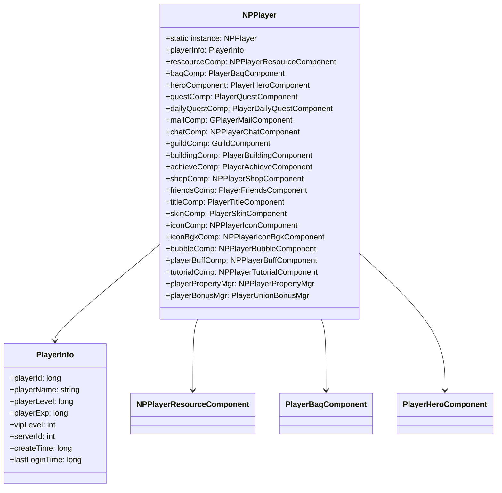
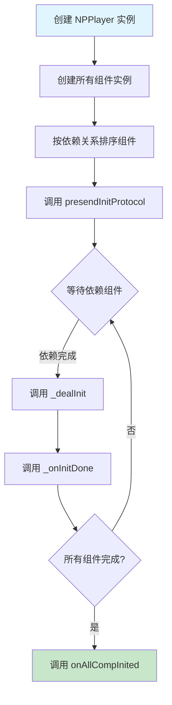

# 玩家基础模块客户端开发文档

## 一、核心管理类

### 1.1 NPPlayer
**路径**: `GameComponent/NPPlayer.cs`

**功能**: 玩家数据管理类，单例模式，管理所有玩家组件

```csharp
// 单例访问方式
public static NPPlayer instance
{
    get
    {
        if (!GRefdataCoreMgr.instance.isInitDone)
            return _g_instance;
        if (_g_instance == null)
            _g_instance = new NPPlayer();
        return _g_instance;
    }
}
```

#### 组件架构图



#### 主要组件属性

| 属性名 | 类型 | 说明 |
|--------|------|------|
| playerInfo | PlayerInfo | 玩家基础信息 |
| rescourceComp | NPPlayerResourceComponent | 资源组件 |
| bagComp | PlayerBagComponent | 背包组件 |
| heroComponent | PlayerHeroComponent | 英雄组件 |
| questComp | PlayerQuestComponent | 任务组件 |
| dailyQuestComp | PlayerDailyQuestComponent | 日常任务组件 |
| mailComp | GPlayerMailComponent | 邮件组件 |
| chatComp | NPPlayerChatComponent | 聊天组件 |
| guildComp | GuildComponent | 公会组件 |
| buildingComp | PlayerBuildingComponent | 建筑组件 |
| achieveComp | PlayerAchieveComponent | 成就组件 |
| shopComp | NPPlayerShopComponent | 商店组件 |
| friendsComp | PlayerFriendsComponent | 好友组件 |
| titleComp | PlayerTitleComponent | 称号组件 |
| skinComp | PlayerSkinComponent | 皮肤组件 |
| iconComp | NPPlayerIconComponent | 头像组件 |
| iconBgkComp | NPPlayerIconBgkComponent | 头像框组件 |
| bubbleComp | NPPlayerBubbleComponent | 气泡框组件 |
| playerBuffComp | NPPlayerBuffComponent | Buff组件 |
| tutorialComp | NPPlayerTutorialComponent | 引导组件 |
| playerPropertyMgr | NPPlayerPropertyMgr | 属性管理器 |
| playerBonusMgr | PlayerUnionBonusMgr | 加成管理器 |
| marsComp | MarsComponent | 火星基地组件 |
| towerComp | TowerComponent | 爬塔组件 |
| arenaComp | ArenaComponent | 竞技场组件 |
| stationComp | StationComponent | 贸易站组件 |
| childComp | PlayerChildComponent | 子嗣组件 |
| consortComp | GConsortComponent | 情人组件 |
| innComp | PlayerInnComponent | 旅店组件 |
| museumComp | PlayerMuseumComponent | 藏品组件 |
| graveComp | GraveComponent | 杰出者大厅组件 |

### 1.2 组件初始化流程

```csharp
public NPPlayer()
{
    _m_lPlayerSerialize = ALSerializeOpMgr.next();
    _m_mgrCompMgr = new NPPlayerComponentMgr();
    _m_playerBonusMgr = new PlayerUnionBonusMgr();

    // 初始化各组件
    _m_piPlayerInfo = new PlayerInfoComponent(_m_mgrCompMgr);
    _m_prPlayerRescource = new NPPlayerResourceComponent(_m_mgrCompMgr);
    _m_specialItemComponent = new PlayerSpecialItemComponent(_m_mgrCompMgr);
    _m_pbcPlayerBag = new PlayerBagComponent(_m_mgrCompMgr);
    // ... 更多组件初始化

    // 玩家属性管理
    _m_pmPropertyMgr = new NPPlayerPropertyMgr();

    // 注册相关属性容器
    _m_pmPropertyMgr.regPropertyContainer(_m_piPlayerInfo.playerInfo.playerPropertyContainer);
    _m_pmPropertyMgr.regPropertyContainer(_m_pbcPlayerBuffComponent.playerPropertyContainer);
    _m_pmPropertyMgr.regPropertyContainer(heroComponent.playerPropertyContainer);
    _m_pmPropertyMgr.initProperties();
}
```

---

### 1.2 PlayerInfo
**路径**: `GameComponent/NPPlayerInfo/PlayerInfo.cs`

**功能**: 玩家基础信息管理，包含等级、VIP、属性容器等

#### 关键属性和方法

```csharp
public partial class PlayerInfo : PlayerBaseInfo
{
    // 玩家属性容器
    protected NPPlayerPropertyContainer _m_pcPlayerPropertyContainer;

    // 等级引用对象
    private PlayerLvlRefObj _m_lrCurLevelRef;
    private PlayerLvlRefObj _m_lrNextLevelRef;
    private PlayerLvlRefObj _m_lrPreLevelRef;

    // 皮肤引用
    private PlayerSkinRefObj _m_curSkinRef;

    // 红点处理器
    private RedTipDealer _m_redDealer;

    // 等级变化事件
    public event Action onLevelChg;

    // 属性访问器
    public PlayerLvlRefObj curLevelRef { get { return _m_lrCurLevelRef; } }
    public PlayerLvlRefObj nextLevelRef { get { return _m_lrNextLevelRef; } }
    public PlayerSkinRefObj curSkinRef { get { return _m_curSkinRef; } }
    public NPPlayerPropertyContainer playerPropertyContainer { get { return _m_pcPlayerPropertyContainer; } }
}
```

#### 玩家基础信息

| 属性名 | 类型 | 说明 | 示例值 |
|--------|------|------|--------|
| CID | long | 玩家ID | 20001 |
| PlayerName | string | 玩家名称 | "剑舞春秋" |
| curLevelRef.lvl | int | 玩家等级 | 10 |
| curVipRef.vip_lvl | int | VIP等级 | 5 |
| curSkinRef.id | long | 当前皮肤ID | 70001 |
| curIcon.refId | long | 当前头像ID | 10001 |
| curIconBgk.refId | long | 当前头像框ID | 20001 |
| curBubble.refId | long | 当前气泡ID | 30001 |

#### 参数更新处理

```csharp
// CS参数更新
public bool updatePlayerParam(int _index, long _paramValue)
{
    long origParamValue = _m_arrPlayerParam[_index];
    _m_arrPlayerParam[_index] = _paramValue;

    if(origParamValue != _paramValue)
    {
        // 处理值变化导致的更新
        _checkUpdate((ENPPlayerParam)_index, origParamValue, _paramValue);
        // 广播玩家参数更新消息
        WinMsg.SendMsg(WinMsgType.ON_PLAYER_PARAM_CHANGE, _index, _paramValue);
    }
    return true;
}

// 值变化时的更新处理
private void _checkUpdate(ENPPlayerParam _paramType, long _origValue, long _curValue)
{
    switch(_paramType)
    {
        case ENPPlayerParam.LEVEL:
            // 等级变化时更新属性容器
            if (_m_lrCurLevelRef != null)
                _m_pcPlayerPropertyContainer.removeModifier(_m_lrCurLevelRef.player_property);
            _m_lrCurLevelRef = GRefdataCoreMgr.instance.playerLvlCore.getRef(_curValue);
            if(_m_lrCurLevelRef != null)
                _m_pcPlayerPropertyContainer.addModifier(_m_lrCurLevelRef.player_property);
            onLevelChg?.Invoke();
            break;
        case ENPPlayerParam.VIP_LVL:
            // VIP等级变化时更新属性
            VipRefObj oriVipRef = GRefdataCoreMgr.instance.vipRefCore.getRef(_origValue);
            VipRefObj curVipRef = GRefdataCoreMgr.instance.vipRefCore.getRef(_curValue);
            if(oriVipRef != null)
                _m_pcPlayerPropertyContainer.removeModifier(oriVipRef.player_property);
            if(curVipRef != null)
                _m_pcPlayerPropertyContainer.addModifier(curVipRef.player_property);
            break;
    }
}
```

---

## 二、资源组件

### NPPlayerResourceComponent
**路径**: `GameComponent/NPResource/NPPlayerResourceComponent.cs`

**功能**: 管理玩家各类资源

#### 资源类型枚举 (ECurrency)

| 枚举值 | 说明 | 用途 |
|--------|------|------|
| SILVER | 银两 | 基础货币 |
| GEM | 钻石 | 高级货币 |
| P_EXP | 玩家经验 | 升级 |
| VIP_EXP | VIP经验 | VIP升级 |
| ENERGY | 体力 | 副本消耗 |

#### 访问方式

```csharp
// 获取资源数量
long gold = NPPlayer.instance.rescourceComp.getResource(EResourceType.SILVER);
long diamond = NPPlayer.instance.rescourceComp.getResource(EResourceType.GEM);
long exp = NPPlayer.instance.rescourceComp.getResource(EResourceType.P_EXP);

// 监听资源变化
NPPlayer.instance.rescourceComp.onResourceChg += OnResourceChanged;
```

---

## 三、属性系统

### NPPlayerPropertyMgr
**功能**: 玩家属性管理器，统一管理所有属性加成

#### 主要方法

| 方法名 | 参数 | 返回值 | 说明 |
|--------|------|--------|------|
| regPropertyContainer | container | void | 注册属性容器 |
| initProperties | - | void | 初始化属性 |
| getProperty | type | long | 获取属性值 |
| recalculate | - | void | 重新计算属性 |
| propertyChgDelegate | - | Delegate | 属性变化委托 |

#### 属性类型 (ENPPlayerPropertyType)

| 属性名 | 说明 |
|--------|------|
| EXTRA_EARNINGS_ADD_PER | 额外赚速加成百分比 |

#### 使用示例

```csharp
// 获取属性值
long earningsAdd = NPPlayer.instance.playerPropertyMgr.getProperty(
    ENPPlayerPropertyType.EXTRA_EARNINGS_ADD_PER
);

// 监听属性变化
NPPlayer.instance.playerPropertyMgr.propertyChgDelegate().addHandler(
    this,
    new HandlerThree<ENPPlayerPropertyType, Long, Long>() {
        @Override
        public void handle(ENPPlayerPropertyType type, Long oldVal, Long newVal) {
            // 处理属性变化
        }
    }
);
```

---

## 四、组件生命周期

### 4.1 组件基类

#### _ANPBasicPlayerComponent
**路径**: `GameComponent/Basic/_ANPBasicPlayerComponent.cs`

#### 关键属性

| 属性名 | 类型 | 说明 |
|--------|------|------|
| isMustInit | bool | 是否必须初始化 |
| compType | ENPPlayerCompType | 组件类型 |
| dependCompList | ENPPlayerCompType[] | 依赖组件列表 |
| canPreInit | bool | 是否允许提前初始化 |

#### 关键方法

| 方法名 | 说明 |
|--------|------|
| presendInitProtocol | 预发送初始化协议 |
| _dealInit | 处理初始化 |
| _onInitDone | 初始化完成回调 |
| _onInitFail | 初始化失败回调 |
| _discard | 释放资源 |
| onAllCompInited | 所有组件初始化完成 |

---

### 4.2 组件初始化流程



#### 组件初始化代码示例

```csharp
public class NPPlayerIconComponent : _ANPBasicPlayerComponent
{
    public NPPlayerIconComponent() : base(ENPPlayerCompType.ICON_COMP)
    {
        // 设置依赖组件
        dependCompList = new ENPPlayerCompType[] {
            ENPPlayerCompType.PLAYER_COMP
        };
    }

    protected override void _dealInit()
    {
        // 处理初始化逻辑
        long iconId = NPPlayer.instance.playerInfo.iconId;
        // 加载头像资源...
        setInited();
    }

    public override void onAllCompInited()
    {
        // 所有组件初始化完成后的处理
    }
}
```

---

## 五、消息系统

### WinMsg
**功能**: 窗口消息系统，用于组件间通信

#### 消息类型定义

```csharp
public enum WinMsgType
{
    PLAYER_LEVEL_UP,        // 玩家升级
    PLAYER_NAME_CHANGED,    // 玩家改名
    PLAYER_ICON_CHANGED,    // 头像变化
    PLAYER_RESOURCE_CHANGED,// 资源变化
    PLAYER_PROPERTY_CHANGED,// 属性变化
    // ...
}
```

#### 注册消息

```csharp
// 注册消息回调
WinMsg.RegisterMsg(WinMsgType.PLAYER_LEVEL_UP, OnPlayerLevelUp);
WinMsg.RegisterMsgAct(WinMsgType.PLAYER_RESOURCE_CHANGED, OnResourceChanged);

// 消息处理函数
private void OnPlayerLevelUp(object[] args)
{
    int newLevel = (int)args[0];
    // 处理升级逻辑
}
```

#### 发送消息

```csharp
// 发送消息
WinMsg.SendMsg(WinMsgType.PLAYER_LEVEL_UP, newLevel);

// 发送带参数消息
WinMsg.SendMsg(WinMsgType.PLAYER_RESOURCE_CHANGED,
    resourceType, oldCount, newCount);
```

#### 注销消息

```csharp
// 注销消息
WinMsg.UnregisterMsg(WinMsgType.PLAYER_LEVEL_UP, OnPlayerLevelUp);
WinMsg.UnregisterMsgAct(WinMsgType.PLAYER_RESOURCE_CHANGED, OnResourceChanged);
```

---

## 六、协议监听

### 6.1 注册协议监听

```csharp
public void RegisterProtocolListeners()
{
    // 玩家参数更新推送
    NetworkManager.AddListener<GS2GC_004_054_OnPlayerParamUpdated>(
        OnPlayerParamUpdated
    );

    // 玩家名称更新推送
    NetworkManager.AddListener<GS2GC_004_055_OnPlayerNameUpdated>(
        OnPlayerNameUpdated
    );

    // 金币信息变化推送
    NetworkManager.AddListener<GS2GC_004_056_OnGoldInfoChg>(
        OnGoldInfoChg
    );
}
```

### 6.2 处理协议推送

```csharp
// 参数更新处理
private void OnPlayerParamUpdated(GS2GC_004_054_OnPlayerParamUpdated proto)
{
    ENPPlayerParam paramType = (ENPPlayerParam)proto.getIndex();
    long newValue = proto.getParamValue();

    switch (paramType)
    {
        case ENPPlayerParam.LEVEL:
            OnLevelChanged((int)newValue);
            break;
        case ENPPlayerParam.VIP_LVL:
            OnVipLevelChanged((int)newValue);
            break;
        case ENPPlayerParam.ICON:
            OnIconChanged(newValue);
            break;
        // ... 其他参数处理
    }
}

// 名称更新处理
private void OnPlayerNameUpdated(GS2GC_004_055_OnPlayerNameUpdated proto)
{
    string newName = proto.getNewName();
    NPPlayer.instance.playerInfo.playerName = newName;

    // 发送消息通知UI更新
    WinMsg.SendMsg(WinMsgType.PLAYER_NAME_CHANGED, newName);
}

// 金币信息变化处理
private void OnGoldInfoChg(GS2GC_004_056_OnGoldInfoChg proto)
{
    Player_GoldInfo goldInfo = proto.getGoldInfo();
    // 更新本地金币数据
    NPPlayer.instance.rescourceComp.updateGoldInfo(goldInfo);
}
```

---

## 七、访问示例

### 7.1 获取玩家实例和信息

```csharp
// 获取玩家实例
NPPlayer player = NPPlayer.instance;

// 获取玩家信息
long playerId = player.playerInfo.playerId;
string playerName = player.playerInfo.playerName;
long level = player.playerInfo.playerLevel;
int vipLevel = player.playerInfo.vipLevel;
```

### 7.2 获取资源

```csharp
// 获取各类资源
long gold = player.rescourceComp.getResource(EResourceType.SILVER);
long diamond = player.rescourceComp.getResource(EResourceType.GEM);
long exp = player.rescourceComp.getResource(EResourceType.P_EXP);
```

### 7.3 获取组件

```csharp
// 获取各组件
var heroComp = player.heroComponent;
var questComp = player.questComp;
var titleComp = player.titleComp;
var iconComp = player.iconComp;
```

### 7.4 发送请求协议

```csharp
// 发送升级请求
public void RequestLevelUp(int currentLevel)
{
    GC2GS_004_001_ReqLevelUp req = new GC2GS_004_001_ReqLevelUp();
    req.setCurLvl(currentLevel);
    NetworkManager.Send(req);
}

// 发送改名请求
public void RequestSetName(string newName)
{
    GC2GS_004_004_ReqSetName req = new GC2GS_004_004_ReqSetName();
    req.setNewName(newName);
    NetworkManager.Send(req);
}

// 发送设置头像请求
public void RequestSetIcon(long iconId)
{
    GC2GS_004_005_ReqSetIcon req = new GC2GS_004_005_ReqSetIcon();
    req.setIconId(iconId);
    NetworkManager.Send(req);
}

// 获取其他玩家信息
public void RequestPlayerInfo(long targetCid)
{
    GC2GS_004_010_ReqSomeOnePlayerInfo req = new GC2GS_004_010_ReqSomeOnePlayerInfo();
    req.setCid(targetCid);
    NetworkManager.Send(req);
}
```

---

## 八、UI窗口相关

### 8.1 玩家信息窗口

```csharp
public class PlayerInfoWindow : UIWindow
{
    // 玩家信息显示
    private Text nameText;
    private Text levelText;
    private Text vipText;
    private Image iconImage;

    protected override void OnOpen()
    {
        base.OnOpen();

        // 注册消息监听
        WinMsg.RegisterMsg(WinMsgType.PLAYER_NAME_CHANGED, OnNameChanged);
        WinMsg.RegisterMsg(WinMsgType.PLAYER_LEVEL_UP, OnLevelUp);

        // 刷新显示
        RefreshPlayerInfo();
    }

    protected override void OnClose()
    {
        // 注销消息监听
        WinMsg.UnregisterMsg(WinMsgType.PLAYER_NAME_CHANGED, OnNameChanged);
        WinMsg.UnregisterMsg(WinMsgType.PLAYER_LEVEL_UP, OnLevelUp);

        base.OnClose();
    }

    private void RefreshPlayerInfo()
    {
        PlayerInfo info = NPPlayer.instance.playerInfo;
        nameText.text = info.playerName;
        levelText.text = $"Lv.{info.playerLevel}";
        vipText.text = $"VIP{info.vipLevel}";
        // 加载头像...
    }

    private void OnNameChanged(object[] args)
    {
        nameText.text = NPPlayer.instance.playerInfo.playerName;
    }

    private void OnLevelUp(object[] args)
    {
        levelText.text = $"Lv.{NPPlayer.instance.playerInfo.playerLevel}";
    }
}
```

### 8.2 设置窗口

```csharp
public class PlayerSettingWindow : UIWindow
{
    // 设置界面元素
    private InputField nameInput;
    private Button changeNameBtn;
    private Button changeIconBtn;

    protected override void OnOpen()
    {
        base.OnOpen();

        // 绑定按钮事件
        changeNameBtn.onClick.AddListener(OnClickChangeName);
        changeIconBtn.onClick.AddListener(OnClickChangeIcon);
    }

    private void OnClickChangeName()
    {
        string newName = nameInput.text;
        if (ValidateName(newName))
        {
            // 发送改名请求
            ProtocolManager.RequestSetName(newName);
        }
    }

    private void OnClickChangeIcon()
    {
        // 打开头像选择窗口
        UIManager.OpenWindow<IconSelectWindow>();
    }

    private bool ValidateName(string name)
    {
        // 验证名称长度
        if (name.Length < 2 || name.Length > 12)
        {
            UIManager.ShowToast("名称长度需在2-12个字符之间");
            return false;
        }
        return true;
    }
}
```

---

## 九、场景逻辑

### 9.1 玩家场景控制器

```csharp
public class PlayerSceneController : MonoBehaviour
{
    private PlayerModel playerModel;

    private void Start()
    {
        // 初始化玩家模型
        InitPlayerModel();

        // 注册协议监听
        RegisterProtocolListeners();
    }

    private void InitPlayerModel()
    {
        long prefabId = NPPlayer.instance.playerComponent.getParamV(ENPPlayerParam.PREFAB);
        playerModel = ModelManager.CreatePlayerModel(prefabId);

        // 设置模型位置和朝向
        playerModel.transform.position = Vector3.zero;
        playerModel.transform.rotation = Quaternion.identity;
    }

    private void RegisterProtocolListeners()
    {
        NetworkManager.AddListener<GS2GC_004_054_OnPlayerParamUpdated>(
            OnPlayerParamUpdated
        );
    }

    private void OnPlayerParamUpdated(GS2GC_004_054_OnPlayerParamUpdated proto)
    {
        ENPPlayerParam paramType = (ENPPlayerParam)proto.getIndex();

        if (paramType == ENPPlayerParam.PREFAB)
        {
            // 模型变化，重新加载
            long newPrefabId = proto.getParamValue();
            ReloadPlayerModel(newPrefabId);
        }
    }

    private void ReloadPlayerModel(long prefabId)
    {
        // 销毁旧模型
        if (playerModel != null)
        {
            Destroy(playerModel.gameObject);
        }

        // 创建新模型
        playerModel = ModelManager.CreatePlayerModel(prefabId);
    }
}
```

---

## 十、最佳实践

### 10.1 单例访问注意事项

```csharp
// 注意：NPPlayer.instance 在配表加载完成前可能为空
public void SafeAccessPlayer()
{
    if (!GRefdataCoreMgr.instance.isInitDone)
    {
        Debug.LogWarning("配表尚未加载完成，NPPlayer不可用");
        return;
    }

    NPPlayer player = NPPlayer.instance;
    if (player == null)
    {
        Debug.LogError("NPPlayer实例为空");
        return;
    }

    // 安全访问玩家数据
    long level = player.playerInfo.playerLevel;
}
```

### 10.2 属性变化监听最佳实践

```csharp
// 使用弱引用或生命周期管理，避免内存泄漏
public class PlayerLevelWatcher : IDisposable
{
    private bool _disposed = false;

    public PlayerLevelWatcher()
    {
        WinMsg.RegisterMsg(WinMsgType.ON_PLAYER_PARAM_CHANGE, OnParamChange);
    }

    private void OnParamChange(object[] args)
    {
        ENPPlayerParam paramType = (ENPPlayerParam)args[0];
        long newValue = (long)args[1];

        if (paramType == ENPPlayerParam.LEVEL)
        {
            Debug.Log($"玩家等级变化: {newValue}");
        }
    }

    public void Dispose()
    {
        if (!_disposed)
        {
            WinMsg.UnregisterMsg(WinMsgType.ON_PLAYER_PARAM_CHANGE, OnParamChange);
            _disposed = true;
        }
    }
}

// 使用示例
private PlayerLevelWatcher _levelWatcher;

void Start()
{
    _levelWatcher = new PlayerLevelWatcher();
}

void OnDestroy()
{
    _levelWatcher?.Dispose();
}
```

### 10.3 资源操作最佳实践

```csharp
// 获取资源时注意缓存，避免频繁访问
public class ResourceManager
{
    private Dictionary<EResourceType, long> _resourceCache = new Dictionary<EResourceType, long>();

    // 获取资源（带缓存）
    public long GetResource(EResourceType type)
    {
        if (!_resourceCache.ContainsKey(type))
        {
            _resourceCache[type] = NPPlayer.instance.rescourceComp.getResource(type);
        }
        return _resourceCache[type];
    }

    // 监听资源变化，更新缓存
    public void ListenResourceChange()
    {
        WinMsg.RegisterMsg(WinMsgType.PLAYER_RESOURCE_CHANGED, OnResourceChanged);
    }

    private void OnResourceChanged(object[] args)
    {
        EResourceType type = (EResourceType)args[0];
        long newValue = (long)args[2];
        _resourceCache[type] = newValue;
    }
}
```

### 10.4 UI数据绑定最佳实践

```csharp
// 使用数据绑定模式，避免UI频繁更新
public class PlayerInfoBinder
{
    private Text _levelText;
    private Text _nameText;
    private Text _vipText;
    private Image _iconImage;

    private long _cachedLevel;
    private string _cachedName;
    private int _cachedVip;
    private long _cachedIconId;

    public void Bind(Text level, Text name, Text vip, Image icon)
    {
        _levelText = level;
        _nameText = name;
        _vipText = vip;
        _iconImage = icon;

        // 初始化数据
        RefreshAll();

        // 注册监听
        WinMsg.RegisterMsg(WinMsgType.ON_PLAYER_PARAM_CHANGE, OnParamChange);
    }

    public void Unbind()
    {
        WinMsg.UnregisterMsg(WinMsgType.ON_PLAYER_PARAM_CHANGE, OnParamChange);
    }

    private void RefreshAll()
    {
        UpdateLevel();
        UpdateName();
        UpdateVip();
        UpdateIcon();
    }

    private void OnParamChange(object[] args)
    {
        ENPPlayerParam paramType = (ENPPlayerParam)args[0];
        long newValue = (long)args[1];

        switch (paramType)
        {
            case ENPPlayerParam.LEVEL:
                if (newValue != _cachedLevel)
                {
                    _cachedLevel = newValue;
                    UpdateLevel();
                }
                break;
            case ENPPlayerParam.VIP_LVL:
                if (newValue != _cachedVip)
                {
                    _cachedVip = (int)newValue;
                    UpdateVip();
                }
                break;
            case ENPPlayerParam.ICON:
                if (newValue != _cachedIconId)
                {
                    _cachedIconId = newValue;
                    UpdateIcon();
                }
                break;
        }
    }

    private void UpdateLevel()
    {
        _levelText.text = $"Lv.{_cachedLevel}";
    }

    private void UpdateName()
    {
        _cachedName = NPPlayer.instance.playerInfo.playerName;
        _nameText.text = _cachedName;
    }

    private void UpdateVip()
    {
        _vipText.text = $"VIP{_cachedVip}";
    }

    private void UpdateIcon()
    {
        // 加载头像资源
        // IconLoader.LoadIcon(_cachedIconId, _iconImage);
    }
}
```

---

## 十一、调试技巧

### 11.1 日志调试

```csharp
// 玩家数据调试日志
public static class PlayerDebugLogger
{
    public static void LogPlayerInfo()
    {
        if (NPPlayer.instance == null)
        {
            Debug.LogWarning("NPPlayer instance is null");
            return;
        }

        PlayerInfo info = NPPlayer.instance.playerInfo;
        Debug.Log($"=== 玩家数据 ===");
        Debug.Log($"玩家ID: {info.playerId}");
        Debug.Log($"玩家名称: {info.playerName}");
        Debug.Log($"玩家等级: {info.playerLevel}");
        Debug.Log($"VIP等级: {info.vipLevel}");

        // 打印所有参数
        for (int i = 1; i <= 48; i++)
        {
            ENPPlayerParam param = (ENPPlayerParam)i;
            long value = NPPlayer.instance.playerComponent.getParamV(param);
            Debug.Log($"参数[{param}] = {value}");
        }
    }

    public static void LogPlayerResources()
    {
        var rescComp = NPPlayer.instance.rescourceComp;
        Debug.Log($"=== 玩家资源 ===");
        Debug.Log($"银两: {rescComp.getResource(EResourceType.SILVER)}");
        Debug.Log($"钻石: {rescComp.getResource(EResourceType.GEM)}");
        Debug.Log($"经验: {rescComp.getResource(EResourceType.P_EXP)}");
        Debug.Log($"VIP经验: {rescComp.getResource(EResourceType.VIP_EXP)}");
    }
}

// 使用快捷键触发调试
void Update()
{
    if (Input.GetKeyDown(KeyCode.P) && Input.GetKey(KeyCode.LeftShift))
    {
        PlayerDebugLogger.LogPlayerInfo();
        PlayerDebugLogger.LogPlayerResources();
    }
}
```

### 11.2 协议调试面板

```csharp
// 简易协议调试面板
public class ProtocolDebugPanel : MonoBehaviour
{
    [SerializeField] private InputField _nameInput;
    [SerializeField] private InputField _iconInput;
    [SerializeField] private Button _setNameBtn;
    [SerializeField] private Button _setIconBtn;
    [SerializeField] private Button _levelUpBtn;

    void Start()
    {
        _setNameBtn.onClick.AddListener(OnClickSetName);
        _setIconBtn.onClick.AddListener(OnClickSetIcon);
        _levelUpBtn.onClick.AddListener(OnClickLevelUp);
    }

    void OnClickSetName()
    {
        string name = _nameInput.text;
        if (!string.IsNullOrEmpty(name))
        {
            ProtocolManager.RequestSetName(name);
        }
    }

    void OnClickSetIcon()
    {
        if (long.TryParse(_iconInput.text, out long iconId))
        {
            ProtocolManager.RequestSetIcon(iconId);
        }
    }

    void OnClickLevelUp()
    {
        int currentLevel = (int)NPPlayer.instance.playerInfo.playerLevel;
        ProtocolManager.RequestLevelUp(currentLevel);
    }
}
```

### 11.3 内存泄漏检测

```csharp
// 检测消息注册泄漏
public class MessageLeakDetector
{
    private static Dictionary<string, int> _registrationCounts = new Dictionary<string, int>();

    public static void TrackRegistration(string msgType, string handlerName)
    {
        string key = $"{msgType}_{handlerName}";
        if (!_registrationCounts.ContainsKey(key))
        {
            _registrationCounts[key] = 0;
        }
        _registrationCounts[key]++;
    }

    public static void ReportLeaks()
    {
        Debug.Log("=== 消息注册泄漏检测 ===");
        foreach (var kvp in _registrationCounts)
        {
            if (kvp.Value > 1)
            {
                Debug.LogWarning($"潜在泄漏: {kvp.Key} 注册次数: {kvp.Value}");
            }
        }
    }
}
```

### 11.4 性能分析

```csharp
// 玩家模块性能分析
public class PlayerPerformanceAnalyzer
{
    // 统计属性计算耗时
    public static void AnalyzePropertyCalculation()
    {
        Stopwatch sw = new Stopwatch();
        sw.Start();

        NPPlayer.instance.playerPropertyMgr.recalculate();

        sw.Stop();
        Debug.Log($"属性计算耗时: {sw.ElapsedMilliseconds}ms");
    }

    // 统计资源获取耗时
    public static void AnalyzeResourceAccess()
    {
        Stopwatch sw = new Stopwatch();

        for (int i = 0; i < 1000; i++)
        {
            sw.Start();
            NPPlayer.instance.rescourceComp.getResource(EResourceType.SILVER);
            sw.Stop();
        }

        Debug.Log($"1000次资源获取耗时: {sw.ElapsedMilliseconds}ms, 平均: {sw.ElapsedMilliseconds / 1000f}ms");
    }
}
```

---

## 十二、常见问题解决

### 12.1 NPPlayer.instance 为空

**原因**：配表尚未加载完成或玩家未登录

**解决方案**：
```csharp
// 方案1：等待配表加载
if (!GRefdataCoreMgr.instance.isInitDone)
{
    // 延迟访问
    StartCoroutine(WaitForInit());
}

IEnumerator WaitForInit()
{
    yield return new WaitUntil(() => GRefdataCoreMgr.instance.isInitDone);
    // 现在可以安全访问
    NPPlayer player = NPPlayer.instance;
}

// 方案2：检查登录状态
if (NPPlayer.instance == null || NPPlayer.instance.playerInfo == null)
{
    Debug.LogWarning("玩家尚未登录");
    return;
}
```

### 12.2 协议响应未收到

**原因**：未注册协议监听或监听时机不对

**解决方案**：
```csharp
// 方案1：确保在登录后注册
void OnLoginSuccess()
{
    NetworkManager.AddListener<GS2GC_004_054_OnPlayerParamUpdated>(OnParamUpdated);
}

// 方案2：检查协议处理器
public void VerifyProtocolHandlers()
{
    bool hasHandler = NetworkManager.HasHandler<GS2GC_004_054_OnPlayerParamUpdated>();
    if (!hasHandler)
    {
        Debug.LogError("协议处理器未注册");
    }
}
```

### 12.3 资源数量显示不更新

**原因**：未监听资源变化推送

**解决方案**：
```csharp
// 注册货币变化推送
NetworkManager.AddListener<GS2GC_004_051_PushCurrencyInfo>(OnCurrencyPush);

private void OnCurrencyPush(GS2GC_004_051_PushCurrencyInfo proto)
{
    NPCommon_CurrencyInfo info = proto.getCurrencyInfo();
    // 更新UI显示
    UpdateCurrencyUI(info);
}
```

---

*文档生成时间: 2026-04-11*
*源码参考路径: `/game_server/ClientProtocol/`*