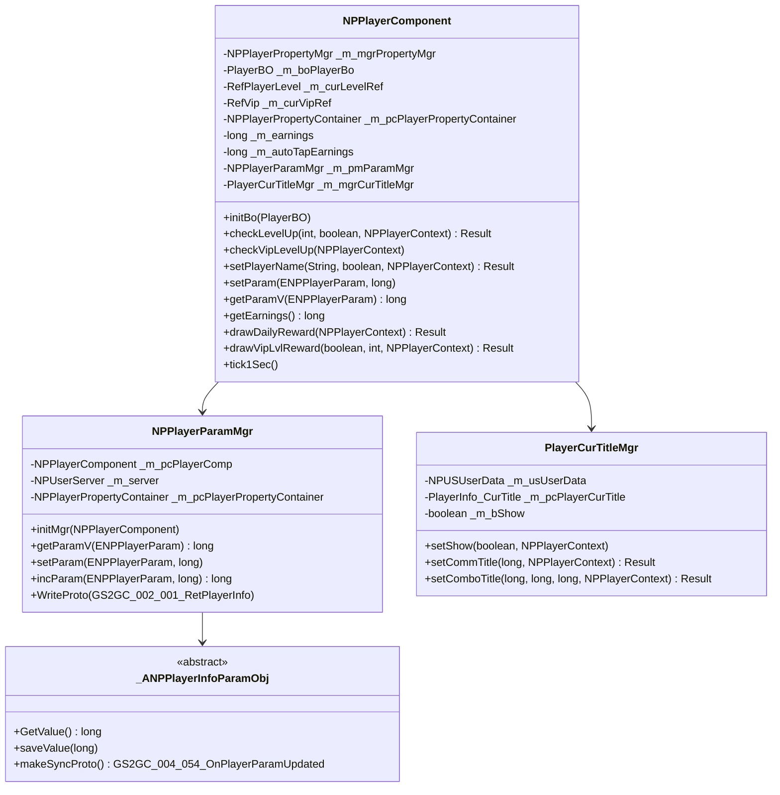
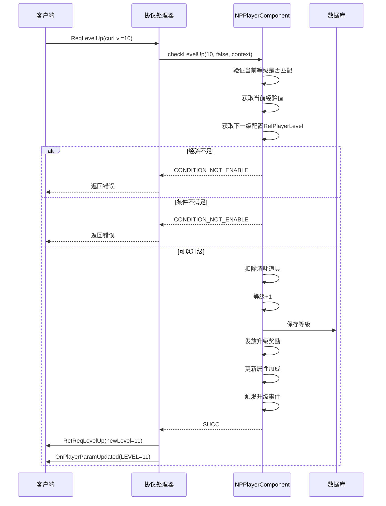
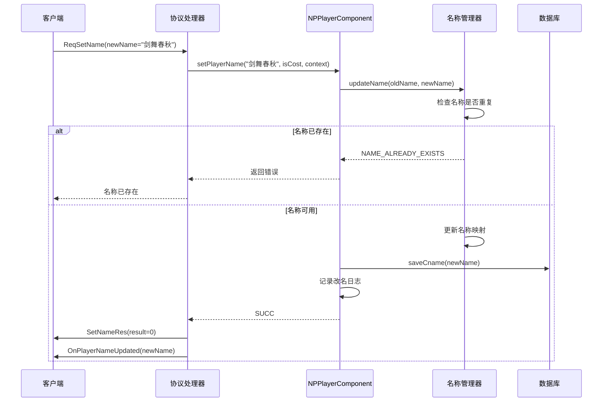
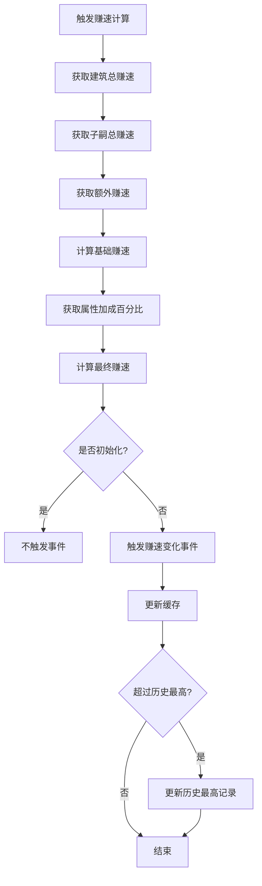
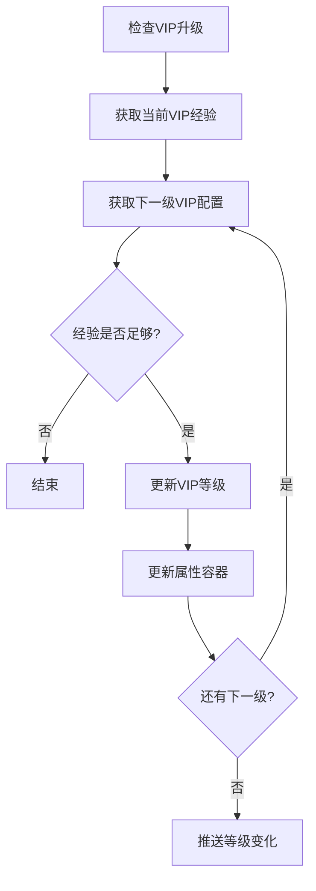
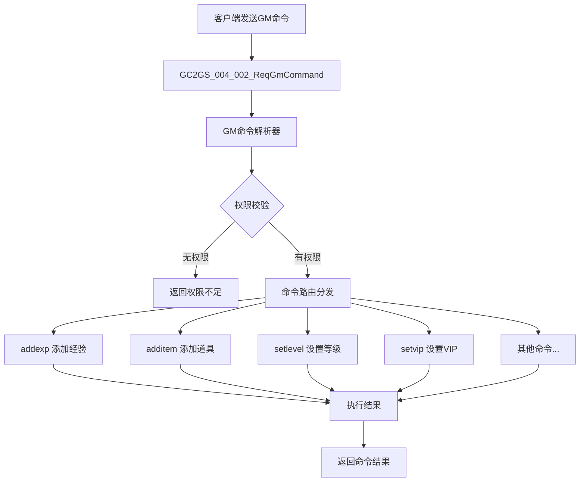

# 玩家模块服务端开发文档

## 一、模块架构

**源码路径**: `UserServer/src/NPUSServer/NPUSUserMgr/UserComp/PlayerComp/`

### 1.1 模块概述

玩家模块（Player Module）负责管理玩家核心数据，包括：
- 玩家基础信息管理
- 等级与经验管理
- 头像、头像框、气泡管理
- 称号系统
- 玩家属性管理
- 赚速计算

### 1.2 模块编号

协议模块编号: `p004`

### 1.3 架构图



---

## 二、核心数据结构

### 2.1 玩家信息 (PlayerBO)

**路径**: `USDB/Bo/PlayerBO.java`

| 字段名 | 类型 | 说明 |
|--------|------|------|
| cid | long | 角色ID (主键) |
| cname | string | 角色名称 |
| lvl | int | 等级 |
| icon | long | 头像ID |
| iconBgk | long | 头像框ID |
| bubble | long | 气泡ID |
| roomSkin | long | 房间皮肤ID |
| prefab | long | 模型ID |
| vipLvl | int | VIP等级 |
| gmLevel | int | GM等级 |
| createTime | long | 创建时间 |
| loginDayCount | int | 累计登录天数 |
| earningsMaxRecord | long | 赚速历史最高记录 |
| powerMaxRecord | long | 实力历史最高记录 |
| rechargedGem | long | 已充值钻石总额 |

### 2.2 玩家金币信息 (Player_GoldInfo)

**路径**: `ClientProtocol/Common/PlayerObj/Player_GoldInfo.cs`

| 字段名 | 类型 | 说明 |
|--------|------|------|
| lastSettleTimeMs | long | 上次结算时间(毫秒) |
| count | long | 当前数量 |
| outputSpeed | long | 产出速度 |
| totalConsumeCount | long | 总消耗数量 |

---

## 三、核心组件详解

### 3.1 NPPlayerComponent

**路径**: `NPUSServer/NPUSUserMgr/UserComp/PlayerComp/NPPlayerComponent.java`

玩家核心组件，继承自 `_ANPUserComponent`，实现 `_ITickableComponent` 和 `_IHandlerHolder` 接口。

#### 构造函数

```java
public NPPlayerComponent(NPUSUserData _userData)
{
    super(_userData, ENPPlayerCompType.PLAYER_COMP);

    _m_mgrPropertyMgr = new NPPlayerPropertyMgr();

    // 玩家属性容器
    _m_pcPlayerPropertyContainer = new NPPlayerPropertyContainer(getClass().getName());
    _m_pcPlayerPropertyContainer.addModifier(RefGeneral.Ref().player_property);

    // 赚速变更触发器
    _m_earningsChgDelegate = new ADelegateNone(this);
    _m_autoTapEarningsChgDelegate = new ADelegateNone(this);

    _m_pmParamMgr = new NPPlayerParamMgr();

    _m_mgrCurTitleMgr = new PlayerCurTitleMgr(getUserData());

    // 赚速延迟计算处理器(延迟100ms)
    _m_earningsCalLazyDealer = new LazyTaskDealer(() -> _calEarnings(false), 100);
}
```

#### 主要属性

| 属性名 | 类型 | 说明 |
|--------|------|------|
| _m_mgrPropertyMgr | NPPlayerPropertyMgr | 玩家属性管理对象 |
| _m_boPlayerBo | PlayerBO | 玩家数据对象 |
| _m_curLevelRef | RefPlayerLevel | 当前等级配置 |
| _m_curVipRef | RefVip | 当前VIP配置 |
| _m_pcPlayerPropertyContainer | NPPlayerPropertyContainer | 玩家属性容器 |
| _m_earnings | long | 每秒赚速 |
| _m_autoTapEarnings | long | 自动点击每秒赚速 |
| _m_earningsChgDelegate | ADelegateNone | 赚速变更触发器 |
| _m_pmParamMgr | NPPlayerParamMgr | 玩家参数管理器 |
| _m_mgrCurTitleMgr | PlayerCurTitleMgr | 当前称号管理器 |
| _m_earningsCalLazyDealer | LazyTaskDealer | 赚速延迟计算处理器 |

#### 主要方法

| 方法名 | 参数 | 返回值 | 说明 |
|--------|------|--------|------|
| initBo | PlayerBO | void | 初始化玩家数据 |
| checkLevelUp | int, boolean, NPPlayerContext | Result | 检查并执行升级 |
| checkVipLevelUp | NPPlayerContext | void | 检查VIP升级 |
| setPlayerName | String, boolean, NPPlayerContext | Result | 设置玩家名称 |
| setParam | ENPPlayerParam, long | void | 设置参数值 |
| getParamV | ENPPlayerParam | long | 获取参数值 |
| getEarnings | - | long | 获取赚速 |
| drawDailyReward | NPPlayerContext | Result | 领取每日奖励 |
| drawVipLvlReward | boolean, int, NPPlayerContext | Result | 领取VIP奖励 |
| tick1Sec | - | void | 每秒Tick |

---

### 3.2 NPPlayerParamMgr

**路径**: `NPUSServer/NPUSUserMgr/UserComp/PlayerComp/Param/NPPlayerParamMgr.java`

玩家参数管理器，继承自 `_TNPParamMgr<PlayerBO, _ANPPlayerInfoParamObj>`。

#### 主要功能

1. **参数注册**: 初始化时注册所有玩家参数
2. **参数同步**: 参数变化时自动同步到客户端
3. **参数持久化**: 参数变化时自动保存到数据库

#### 参数注册示例

```java
// 注册头像参数
registParam(new _ANPPlayerInfoParamObj(ENPPlayerParam.ICON, bo) {
    public long GetValue() {
        return getData().getIcon();
    }
    public void saveValue(long value) {
        getData().saveIcon(getUSServer().getBM(), value);
    }
});

// 注册等级参数
registParam(new _ANPPlayerInfoParamObj(ENPPlayerParam.LEVEL, bo) {
    public long GetValue() {
        return getData().getLvl();
    }
    public void saveValue(long value) {
        getData().saveLvl(getUSServer().getBM(), (int) value);
    }
});
```

---

### 3.3 PlayerCurTitleMgr

**路径**: `NPUSServer/NPUSUserMgr/UserComp/PlayerComp/PlayerCurTitleMgr.java`

当前称号管理器，管理玩家当前穿戴的称号。

#### 主要方法

| 方法名 | 参数 | 返回值 | 说明 |
|--------|------|--------|------|
| setShow | boolean, NPPlayerContext | void | 设置是否展示称号 |
| setCommTitle | long, NPPlayerContext | Result | 穿戴通用称号 |
| setComboTitle | long, long, long, NPPlayerContext | Result | 穿戴组合称号 |

---

## 四、初始化和事件处理

### 4.1 组件初始化完成后处理

```java
/**
 * 所有组件初始化完成后的处理
 */
public void onAllCompInitedDeal()
{
    // 相关组件属性计算
    getUserData().getConsortComponent()._initCalAllConsort();
    getUserData().getHeroComponent()._initCalAllHero();
    getUserData().getBuildingComponent()._initCalAllBuilding();

    // 计算赚速
    _calEarnings(true);

    // 检查提交玩家的最大赚速
    checkExceedMaxEarningsRecord();
    getUserData().getBuildingComponent().checkExceedMaxEarningsRecord();
    getUserData().getChildComponent().checkExceedMaxEarningsRecord();

    // 计算火星探险队伍实力
    getUserData().getMarsExploreComponent().getTeamMgr()._initCalTeamPower();
    // 火星建筑相关产出计算
    getUserData().getMarsBuildingComponent()._onAllCompInitedDeal();

    // 确保玩家缓存存在
    ensurePlayerCache();

    // 注册属性变化监听
    _m_mgrPropertyMgr.propertyChgDelegate().addHandler(this,
        new HandlerThree<ENPPlayerPropertyType, Long, Long>() {
            @Override
            public void handle(ENPPlayerPropertyType _type, Long _preValue, Long _curVal)
            {
                // CachePlayer同步修改属性变化
                PlayerCacheFunc.updateProperty(getUserData(), _type, _curVal);
                // 赚速加成变更要重新计算
                if (_type == ENPPlayerPropertyType.EXTRA_EARNINGS_ADD_PER)
                    setNeedCalEarnings();
            }
        });

    // 注册参数变化监听
    getUserData().Events.OnParamChg.addHandler(this,
        new HandlerThree<ENPPlayerParam, Long, Long>() {
            @Override
            public void handle(ENPPlayerParam _type, Long _oldVal, Long _curVal)
            {
                // CachePlayer同步修改参数变化
                PlayerCacheFunc.updateParam(getUserData(), _type, _curVal);
            }
        });
}
```

### 4.2 属性容器注册

```java
@Override
public void onInited()
{
    // 注册组件的玩家属性加成
    _m_mgrPropertyMgr.regPropertyContainer(_m_pcPlayerPropertyContainer);   // 玩家属性
    _m_mgrPropertyMgr.regPropertyContainer(getUserData().getBuffComponent().getPlayerPropertyContainer());    // buff组件
    _m_mgrPropertyMgr.regPropertyContainer(getUserData().getRecordComponent().getPlayerPropertyContainer());  // 记录组件
    _m_mgrPropertyMgr.regPropertyContainer(getUserData().getHeroComponent().getPlayerPropertyContainer());    // 大臣组件
    _m_mgrPropertyMgr.regPropertyContainer(getUserData().getConsortComponent().getPlayerPropertyContainer()); // 妃子组件
    _m_mgrPropertyMgr.regPropertyContainer(getUserData().getInnComponent().getPlayerPropertyContainer());     // 旅店组件
    _m_mgrPropertyMgr.regPropertyContainer(getUserData().getTreasureHuntComponent().getPropertyContainer()); // 太空寻宝组件
    _m_mgrPropertyMgr.regPropertyContainer(getUserData().getMarsComponent().getPlayerPropertyContainer());    // 火星组件
    _m_mgrPropertyMgr.regPropertyContainer(getUserData().getPrivilegeCardComponent().getPlayerPropertyContainer()); // 权益卡组件
    _m_mgrPropertyMgr.regPropertyContainer(getUserData().getForeverAddComponent().getPlayerPropertyContainer());    // 永久加成组件

    // 初始计算玩家属性
    _m_mgrPropertyMgr.initProperties();
}
```

---

## 四、业务逻辑流程

### 4.1 玩家升级流程



### 4.2 设置名称流程



### 4.3 赚速计算流程



### 4.4 VIP升级流程



---

## 五、数据库设计

### 5.1 玩家数据表 (player)

| 字段名 | 类型 | 说明 | 索引 |
|--------|------|------|------|
| id | BIGINT | 主键 | PK |
| cid | BIGINT | 角色ID | UK |
| cname | VARCHAR(64) | 角色名称 | UK |
| lvl | INT | 等级 | IDX |
| exp | BIGINT | 经验 | - |
| icon | BIGINT | 头像ID | - |
| icon_bgk | BIGINT | 头像框ID | - |
| bubble | BIGINT | 气泡ID | - |
| room_skin | BIGINT | 房间皮肤ID | - |
| prefab | BIGINT | 模型ID | - |
| vip_lvl | INT | VIP等级 | IDX |
| gm_level | INT | GM等级 | - |
| create_time | DATETIME | 创建时间 | IDX |
| update_time | DATETIME | 更新时间 | - |
| last_login_time | DATETIME | 最后登录时间 | IDX |

### 5.2 玩家改名日志表 (log_player_set_name)

| 字段名 | 类型 | 说明 |
|--------|------|------|
| id | BIGINT | 主键 |
| cid | BIGINT | 玩家ID |
| name | VARCHAR(64) | 新名称 |
| is_cost | TINYINT | 是否消耗道具 |
| create_time | DATETIME | 创建时间 |

### 5.3 玩家升级日志表 (log_player_level_up)

| 字段名 | 类型 | 说明 |
|--------|------|------|
| id | BIGINT | 主键 |
| cid | BIGINT | 玩家ID |
| ori_level | INT | 原等级 |
| new_level | INT | 新等级 |
| exp | BIGINT | 当前经验 |
| earnings | BIGINT | 当前赚速 |
| nation | VARCHAR(32) | 国家 |
| device_os | VARCHAR(32) | 设备系统 |
| create_time | DATETIME | 创建时间 |

---

## 六、服务配置

### 6.1 协议注册

```java
// 协议主序号
public const byte PLAYER_MODULE_ORDER = 4;

// 协议处理器注册
protocolHandler.Register<GC2GS_004_001_ReqLevelUp>(OnReqLevelUp);
protocolHandler.Register<GC2GS_004_004_ReqSetName>(OnReqSetName);
protocolHandler.Register<GC2GS_004_005_ReqSetIcon>(OnReqSetIcon);
protocolHandler.Register<GC2GS_004_010_ReqSomeOnePlayerInfo>(OnReqSomeOnePlayerInfo);
// ... 其他协议注册
```

### 6.2 服务依赖

玩家模块依赖以下服务：
- 玩家数据服务 (PlayerDataService)
- 资源服务 (CurrencyComponent)
- 配置数据服务 (RefdataService)
- 推送服务 (PushService)
- 过滤服务 (FilterService)
- 名称管理器 (UserNameEqualMgr)

---

## 七、关键代码示例

### 7.1 升级处理代码

```java
/**
 * 检查玩家是否可以升级
 * 一次最多升1级
 */
public Result checkLevelUp(int _curLvl, boolean _isForce, NPPlayerContext _context)
{
    getUserData().lockUser();
    try {
        // 判断玩家等级是否匹配
        if (_m_curLevelRef.lvl != _curLvl)
            return CommErr.PLAYER_CACHE_ERR;

        // 玩家当前经验
        long expCount = getUserData().getCurrencyComponent()
            .getItemCount(ECurrency.P_EXP.ordinal());

        // 查找下一级的等级配置
        RefPlayerLevel nextLevelRef = RefPlayerLevel.getMgr()
            .get(_m_curLevelRef.lvl + 1);
        if (nextLevelRef == null)
            return CommErr.REF_NOT_FOUND;

        // 如果经验不够则直接跳出
        if (expCount < nextLevelRef.exp)
            return CommErr.CONDITION_NOT_ENABLE;

        if (!_isForce) {
            // 判断升级条件是否满足
            if (!NPPlayerConditionDealerMgr.IsEnable(nextLevelRef.lvl_up_cond,
                    getUserData(), null))
                return CommErr.CONDITION_NOT_ENABLE;

            // 判断如果赚速不够则直接跳出
            if (getEarnings() < nextLevelRef.earnings)
                return CommErr.CONDITION_NOT_ENABLE;

            // 检查额外道具是否可以足额扣除消耗
            if (!getUserData().hasCostItemList(nextLevelRef.current_lvl_consume)
                    || !getUserData().spendItem(nextLevelRef.current_lvl_consume, _context))
                return CommErr.CONDITION_NOT_ENABLE;
        }

        // 刷新等级数据
        _m_curLevelRef = nextLevelRef;

        // 保存等级
        setParam(ENPPlayerParam.LEVEL, _m_curLevelRef.lvl);

        // 给予升级奖励
        getUserData().gainItemList(nextLevelRef.reward_item_list, _context);

        // 属性处理
        _m_pcPlayerPropertyContainer.removeModifier(oldLevelRef.player_property);
        _m_pcPlayerPropertyContainer.addModifier(_m_curLevelRef.player_property);

        // 触发升级事件
        getUserData().Events.OnPlayerLvlUp.onEvent(_m_curLevelRef.lvl);

        return Result.SUCC;
    } finally {
        getUserData().unlockUser();
    }
}
```

### 7.2 参数设置代码

```java
/**
 * 设置对应的值
 */
public void setParam(ENPPlayerParam _eParam, long _value)
{
    _ANPPlayerInfoParamObj param = getParam(_eParam);
    if (null == param) {
        USLog.error(_m_pcPlayerComp.getUSServer(),
            "setParam can not find param :" + _eParam);
        return;
    }

    long oldValue = param.GetValue();
    if (oldValue != _value) {
        // 保存到数据库
        param.saveValue(_value);

        // 同步到客户端
        _m_pcPlayerComp.getUserData().sendMsgToGC(param.makeSyncProto());

        // 触发参数变化事件
        _m_pcPlayerComp.getUserData().Events.OnParamChg.onAsyncEvent(
            _eParam, oldValue, _value);
    }
}
```

### 7.3 赚速计算代码

```java
/**
 * 计算赚速
 */
private void _calEarnings(boolean _isInit)
{
    getUserData().lockUser();
    try {
        long oriEarnings = 0;
        oriEarnings += getUserData().getBuildingComponent().getTotalEarning();
        oriEarnings += getUserData().getChildComponent().getTotalEarning();
        oriEarnings += getParamV(ENPPlayerParam.EXTRA_EARNINGS);

        // 计算最终值（加上属性加成百分比）
        _m_earnings = (long) Math.ceil(oriEarnings *
            (10000 + getPropertyMgr().getValue(ENPPlayerPropertyType.EXTRA_EARNINGS_ADD_PER))
            / 10000d);

        if (!_isInit) {
            // 触发赚速变化事件
            _m_earningsChgDelegate.onEvent();

            // 更新缓存
            PlayerCacheFunc.updateEarnings(getUserData(), _m_earnings);

            // 检查是否超过历史最大赚速
            checkExceedMaxEarningsRecord();
        }
    } finally {
        getUserData().unlockUser();
    }
}
```

### 7.4 VIP奖励领取代码

```java
/**
 * 领取VIP等级奖励
 */
public Result drawVipLvlReward(boolean _rechargeReward, int _vipLvl, NPPlayerContext _context)
{
    if (_vipLvl <= 0)
        return CommErr.PARAM_ERROR;

    RefVip ref = RefVip.getMgr().get(_vipLvl);
    if (null == ref)
        return CommErr.REF_NOT_FOUND;

    if (_vipLvl > 63) {
        USLog.error(getUSServer(),
            "player:{} drawVipLvlReward, vip lvl > 63, lvl:{}",
            getUserData().getCid(), _vipLvl);
        return CommErr.PARAM_ERROR;
    }

    ENPPlayerParam eParam = _rechargeReward ?
        ENPPlayerParam.HAD_DRAW_VIP_RECHARGE_REWARD_LIST :
        ENPPlayerParam.HAD_DRAW_VIP_REWARD_LIST;

    getUserData().lockUser();
    try {
        // 检查VIP等级
        if (null == _m_curVipRef || _vipLvl > _m_curVipRef.vip_lvl)
            return PlayerErr.VIP_LEVEL_REWARD_NOT_MEET_REQUIRE;

        // 已经领奖
        long hadDrawList = getParamV(eParam);
        if ((hadDrawList & (1L << _vipLvl)) != 0)
            return PlayerErr.VIP_LEVEL_REWARD_HAD_DRAW;

        // 设置标志位
        hadDrawList |= (1L << _vipLvl);
        setParam(eParam, hadDrawList);

        // 发放奖励
        if (_rechargeReward) {
            getUserData().gainItemList(ref.recharge_reward_list, _context);
        } else {
            getUserData().gainItemList(ref.gain_item_list, _context);
        }

        return Result.SUCC;
    } finally {
        getUserData().unlockUser();
    }
}
```

---

## 八、事件系统

### 8.1 玩家事件类型

| 事件名 | 说明 | 参数 |
|--------|------|------|
| OnPlayerLvlUp | 玩家升级事件 | newLevel |
| OnParamChg | 参数变化事件 | paramType, oldValue, newValue |
| OnPlayerBuffChg | Buff变化事件 | buffId |

### 8.2 事件监听示例

```java
// 监听参数变化事件
getUserData().Events.OnParamChg.addHandler(this,
    new HandlerThree<ENPPlayerParam, Long, Long>() {
        @Override
        public void handle(ENPPlayerParam _type, Long _oldVal, Long _curVal) {
            // CachePlayer同步修改参数变化
            PlayerCacheFunc.updateParam(getUserData(), _type, _curVal);
        }
    });
```

---

## 九、GM命令系统

### 9.1 GM命令架构



### 9.2 GM命令处理器

```java
/**
 * GM命令处理器
 */
public class GMCommandDealer
{
    /**
     * 处理GM命令
     */
    public static Result dealCommand(NPUSUserData _userData, String _command, String _param, NPPlayerContext _context)
    {
        // 权限检查
        if (_userData.getPlayerComponent().getParamV(ENPPlayerParam.GM_LVL) <= 0) {
            return Result.fail(CommErr.PERMISSION_DENIED);
        }

        // 命令路由
        String[] parts = _command.toLowerCase().split(" ");
        String cmd = parts[0];

        switch (cmd) {
            case "addexp":
                return dealAddExp(_userData, _param, _context);
            case "additem":
                return dealAddItem(_userData, _param, _context);
            case "setlevel":
                return dealSetLevel(_userData, _param, _context);
            case "setvip":
                return dealSetVip(_userData, _param, _context);
            case "addgem":
                return dealAddGem(_userData, _param, _context);
            case "addsilver":
                return dealAddSilver(_userData, _param, _context);
            case "cleardata":
                return dealClearData(_userData, _context);
            case "reloadconfig":
                return dealReloadConfig(_userData, _context);
            default:
                return Result.fail(CommErr.PARAM_ERROR);
        }
    }

    /**
     * 添加经验
     * 命令格式: addexp 1000
     */
    private static Result dealAddExp(NPUSUserData _userData, String _param, NPPlayerContext _context)
    {
        long exp = Long.parseLong(_param);
        _userData.getCurrencyComponent().addItem(ECurrency.P_EXP.ordinal(), exp, _context);
        return Result.SUCC;
    }

    /**
     * 设置等级
     * 命令格式: setlevel 50
     */
    private static Result dealSetLevel(NPUSUserData _userData, String _param, NPPlayerContext _context)
    {
        int targetLevel = Integer.parseInt(_param);
        boolean success = _userData.getPlayerComponent().forceSetLevel(targetLevel, _context);
        return success ? Result.SUCC : Result.fail(CommErr.PARAM_ERROR);
    }

    /**
     * 设置VIP等级
     * 命令格式: setvip 10
     */
    private static Result dealSetVip(NPUSUserData _userData, String _param, NPPlayerContext _context)
    {
        int vipLevel = Integer.parseInt(_param);
        _userData.getPlayerComponent().setParam(ENPPlayerParam.VIP_LVL, vipLevel);
        return Result.SUCC;
    }

    /**
     * 添加钻石
     * 命令格式: addgem 1000
     */
    private static Result dealAddGem(NPUSUserData _userData, String _param, NPPlayerContext _context)
    {
        long count = Long.parseLong(_param);
        _userData.getCurrencyComponent().addItem(ECurrency.GEM.ordinal(), count, _context);
        return Result.SUCC;
    }
}
```

### 9.3 GM命令列表

| 命令名 | 参数格式 | 说明 | 示例 |
|--------|----------|------|------|
| addexp | <数量> | 添加玩家经验 | addexp 1000 |
| additem | <道具类型> <道具ID> <数量> | 添加道具 | additem 1 1001 10 |
| setlevel | <等级> | 强制设置等级 | setlevel 50 |
| setvip | <VIP等级> | 设置VIP等级 | setvip 10 |
| addgem | <数量> | 添加钻石 | addgem 1000 |
| addsilver | <数量> | 添加银两 | addsilver 10000 |
| cleardata | - | 清除玩家数据 | cleardata |
| reloadconfig | - | 重新加载配置 | reloadconfig |

---

## 十、调试接口

### 10.1 玩家数据查询接口

```java
/**
 * 调试接口：查询玩家完整数据
 */
public class DebugPlayerQuery
{
    /**
     * 获取玩家调试信息
     */
    public static String getPlayerDebugInfo(NPUSUserData _userData)
    {
        StringBuilder sb = new StringBuilder();
        sb.append("=== 玩家调试信息 ===\n");

        // 基础信息
        PlayerBO bo = _userData.getPlayerComponent().getBo();
        sb.append(String.format("玩家ID: %d\n", bo.getCid()));
        sb.append(String.format("玩家名称: %s\n", bo.getCname()));
        sb.append(String.format("等级: %d\n", bo.getLvl()));
        sb.append(String.format("VIP等级: %d\n", bo.getVipLvl()));
        sb.append(String.format("GM等级: %d\n", bo.getGmLevel()));

        // 资源信息
        sb.append("\n=== 资源信息 ===\n");
        sb.append(String.format("银两: %d\n", _userData.getCurrencyComponent().getItemCount(ECurrency.SILVER.ordinal())));
        sb.append(String.format("钻石: %d\n", _userData.getCurrencyComponent().getItemCount(ECurrency.GEM.ordinal())));
        sb.append(String.format("经验: %d\n", _userData.getCurrencyComponent().getItemCount(ECurrency.P_EXP.ordinal())));
        sb.append(String.format("VIP经验: %d\n", _userData.getCurrencyComponent().getItemCount(ECurrency.VIP_EXP.ordinal())));

        // 赚速信息
        sb.append("\n=== 赚速信息 ===\n");
        sb.append(String.format("总赚速: %d\n", _userData.getPlayerComponent().getEarnings()));
        sb.append(String.format("建筑赚速: %d\n", _userData.getBuildingComponent().getTotalEarning()));
        sb.append(String.format("子嗣赚速: %d\n", _userData.getChildComponent().getTotalEarning()));

        return sb.toString();
    }

    /**
     * 获取玩家参数列表
     */
    public static String getPlayerParams(NPUSUserData _userData)
    {
        StringBuilder sb = new StringBuilder();
        sb.append("=== 玩家参数 ===\n");

        for (ENPPlayerParam param : ENPPlayerParam.values()) {
            if (param != ENPPlayerParam.NONE) {
                long value = _userData.getPlayerComponent().getParamV(param);
                sb.append(String.format("%s: %d\n", param.name(), value));
            }
        }

        return sb.toString();
    }
}
```

### 10.2 运维接口

```java
/**
 * 运维管理接口
 */
public class PlayerAdminService
{
    /**
     * 封禁玩家
     */
    public static Result banPlayer(long _cid, int _duration, String _reason)
    {
        NPUSUserData userData = UserDataCache.get(_cid);
        if (userData == null) {
            return Result.fail(CommErr.PLAYER_NOT_FOUND);
        }

        // 设置封禁状态
        userData.getPlayerComponent().setBanStatus(true, _duration, _reason);

        // 踢下线
        userData.kickOut("账号已被封禁");

        return Result.SUCC;
    }

    /**
     * 解封玩家
     */
    public static Result unbanPlayer(long _cid)
    {
        NPUSUserData userData = UserDataCache.get(_cid);
        if (userData == null) {
            return Result.fail(CommErr.PLAYER_NOT_FOUND);
        }

        userData.getPlayerComponent().setBanStatus(false, 0, "");
        return Result.SUCC;
    }

    /**
     * 禁言玩家
     */
    public static Result mutePlayer(long _cid, int _duration, String _reason)
    {
        NPUSUserData userData = UserDataCache.get(_cid);
        if (userData == null) {
            return Result.fail(CommErr.PLAYER_NOT_FOUND);
        }

        userData.getPlayerComponent().setMuteStatus(true, _duration, _reason);
        return Result.SUCC;
    }

    /**
     * 发送系统邮件
     */
    public static Result sendSystemMail(long _cid, String _title, String _content, List<ItemInfo> _attachments)
    {
        MailService.sendSystemMail(_cid, _title, _content, _attachments);
        return Result.SUCC;
    }
}
```

### 10.3 数据统计接口

```java
/**
 * 玩家数据统计
 */
public class PlayerStatistics
{
    /**
     * 获取在线玩家统计
     */
    public static Map<String, Object> getOnlinePlayerStats()
    {
        Map<String, Object> stats = new HashMap<>();

        // 在线人数
        int onlineCount = UserDataCache.getOnlineCount();
        stats.put("onlineCount", onlineCount);

        // 等级分布
        Map<Integer, Integer> levelDistribution = new HashMap<>();
        for (NPUSUserData userData : UserDataCache.getAllOnline()) {
            int level = userData.getPlayerComponent().getCurLvl();
            levelDistribution.merge(level, 1, Integer::sum);
        }
        stats.put("levelDistribution", levelDistribution);

        // VIP分布
        Map<Integer, Integer> vipDistribution = new HashMap<>();
        for (NPUSUserData userData : UserDataCache.getAllOnline()) {
            int vipLevel = (int) userData.getPlayerComponent().getParamV(ENPPlayerParam.VIP_LVL);
            vipDistribution.merge(vipLevel, 1, Integer::sum);
        }
        stats.put("vipDistribution", vipDistribution);

        return stats;
    }
}
```

---

## 十一、监控告警

### 11.1 关键指标监控

```java
/**
 * 玩家模块监控指标
 */
public class PlayerMetrics
{
    // 在线人数监控
    public static final Counter ONLINE_COUNT = Counter.build()
        .name("player_online_count")
        .help("当前在线玩家数量")
        .register();

    // 登录成功次数
    public static final Counter LOGIN_SUCCESS = Counter.build()
        .name("player_login_success_total")
        .help("登录成功总次数")
        .register();

    // 登录失败次数
    public static final Counter LOGIN_FAIL = Counter.build()
        .name("player_login_fail_total")
        .help("登录失败总次数")
        .labelNames("reason")
        .register();

    // 升级次数
    public static final Counter LEVEL_UP = Counter.build()
        .name("player_level_up_total")
        .help("玩家升级总次数")
        .register();

    // 协议处理耗时
    public static final Histogram PROTOCOL_DURATION = Histogram.build()
        .name("player_protocol_duration_seconds")
        .help("协议处理耗时")
        .labelNames("protocol")
        .register();
}
```

### 11.2 告警规则配置

```yaml
# 告警规则配置
groups:
  - name: player_alerts
    rules:
      - alert: OnlineCountLow
        expr: player_online_count < 100
        for: 5m
        labels:
          severity: warning
        annotations:
          summary: "在线人数过低"

      - alert: LoginFailRateHigh
        expr: rate(player_login_fail_total[5m]) / rate(player_login_success_total[5m]) > 0.1
        for: 2m
        labels:
          severity: critical
        annotations:
          summary: "登录失败率过高"

      - alert: ProtocolDurationSlow
        expr: histogram_quantile(0.95, player_protocol_duration_seconds) > 1
        for: 1m
        labels:
          severity: warning
        annotations:
          summary: "协议处理耗时过长"
```

---

*文档生成时间: 2026-04-11*
*源码参考路径: `/game_server/UserServer/src/NPUSServer/NPUSUserMgr/UserComp/PlayerComp/`*