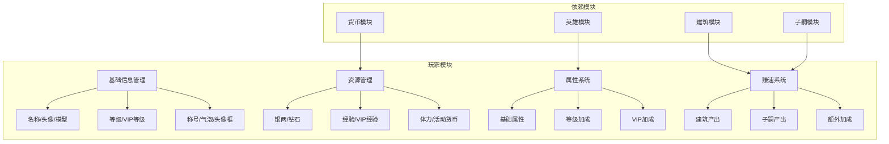
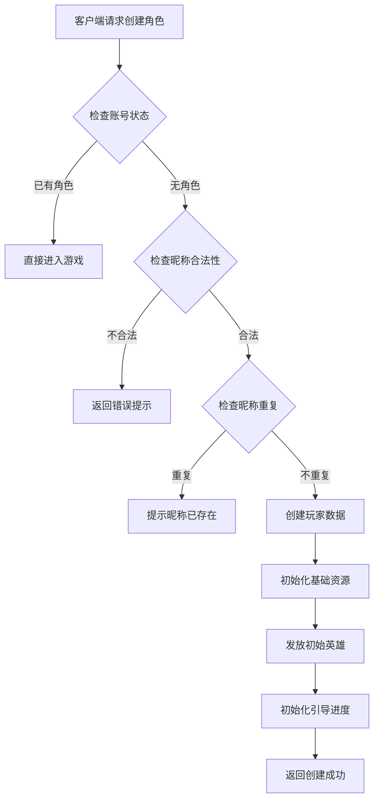
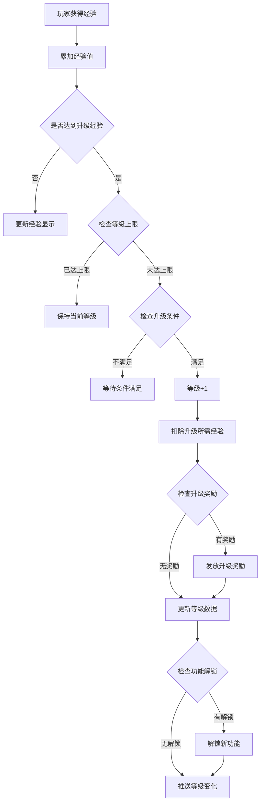
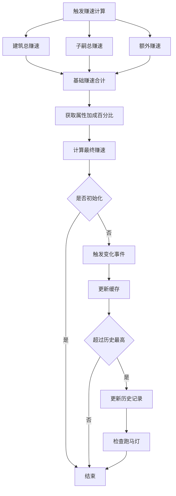
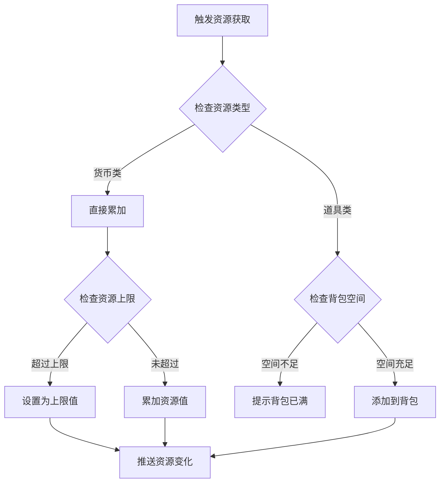
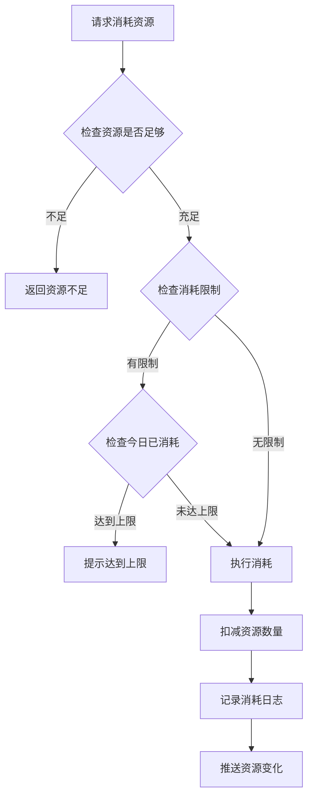
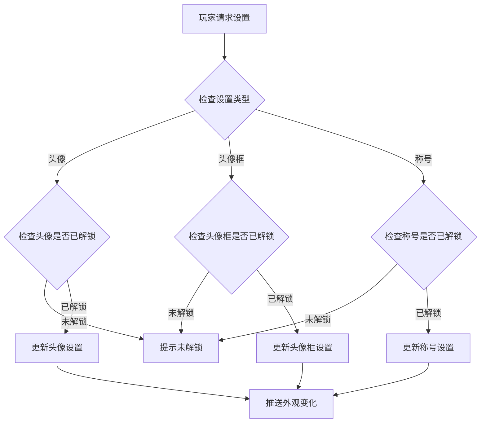
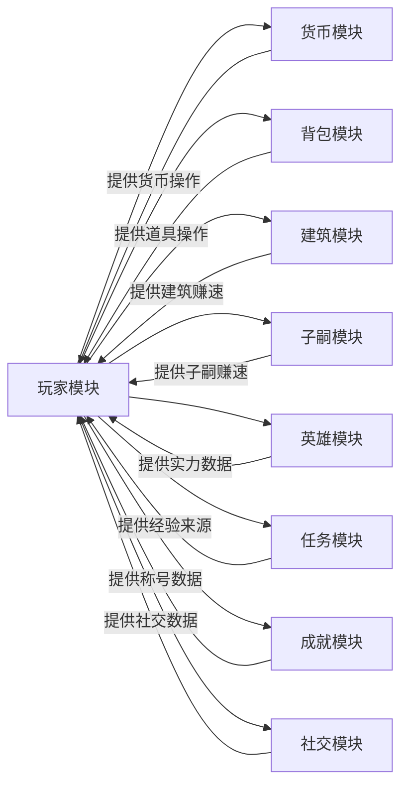

# 玩家模块完整说明

## 一、模块概述

### 1.1 业务背景

玩家模块是 K2C 游戏的核心基础模块，负责管理玩家的基础数据、属性、资源和个性化设置。所有其他游戏模块都依赖于玩家模块提供的身份认证、资源管理和基础属性支持。

### 1.2 目标用户

- **所有游戏玩家**：每个进入游戏的用户都是玩家模块的用户
- **运营人员**：通过玩家数据进行用户分析和运营决策

### 1.3 核心价值

1. **身份管理**：唯一标识玩家身份，管理账号信息
2. **资源管理**：统一管理玩家各类资源（货币、道具、体力等）
3. **进度追踪**：记录玩家游戏进度和成就
4. **个性化**：支持玩家自定义头像、昵称、称号等

### 1.4 模块架构总览



---

## 二、功能清单

### 2.1 基础信息功能

| 功能名称 | 功能描述 | 用户价值 |
|---------|---------|---------|
| 玩家创建 | 创建新玩家角色 | 开始游戏旅程 |
| 昵称设置 | 设置和修改玩家昵称 | 个性化身份展示 |
| 头像设置 | 选择和更换玩家头像 | 个性化展示 |
| 头像框设置 | 装备头像框 | 展示成就和身份 |
| 气泡框设置 | 装备聊天气泡 | 个性化聊天体验 |
| 称号设置 | 装备和展示称号 | 展示成就和荣誉 |
| 模型设置 | 设置玩家模型形象 | 个性化角色外观 |
| 房间皮肤 | 设置房间装饰风格 | 个性化房间展示 |

### 2.2 资源管理功能

| 功能名称 | 功能描述 | 用户价值 |
|---------|---------|---------|
| 资源获取 | 通过各种途径获取资源 | 积累游戏资本 |
| 资源消耗 | 消耗资源进行各种操作 | 推进游戏进程 |
| 资源上限 | 管理资源存储上限 | 了解资源限制 |
| 资源恢复 | 自动恢复特定资源 | 持续游戏体验 |

### 2.3 等级系统功能

| 功能名称 | 功能描述 | 用户价值 |
|---------|---------|---------|
| 经验获取 | 通过各种行为获取经验 | 提升等级 |
| 等级提升 | 消耗经验提升等级 | 解锁新功能 |
| 升级奖励 | 升级获得奖励 | 激励玩家成长 |
| 功能解锁 | 等级解锁新玩法 | 逐步引导游戏 |
| 每日奖励 | 按等级发放每日奖励 | 持续登录激励 |

### 2.4 属性系统功能

| 功能名称 | 功能描述 | 用户价值 |
|---------|---------|---------|
| 基础属性 | 玩家基础属性管理 | 核心游戏数据 |
| 属性加成 | 各种来源的属性加成 | 提升实力 |
| 永久加成 | 永久属性加成系统 | 长期成长 |

### 2.5 社交信息功能

| 功能名称 | 功能描述 | 用户价值 |
|---------|---------|---------|
| 签名设置 | 设置个人签名 | 表达个性 |
| 在线状态 | 显示在线状态 | 社交互动 |
| 最近登录 | 记录登录时间 | 运营数据 |
| 点赞系统 | 玩家互相点赞 | 社交互动 |
| 屏蔽系统 | 屏蔽指定玩家 | 隐私保护 |

---

## 三、业务流程详解

### 3.1 玩家创建流程



**详细步骤说明**：

1. **账号验证**
   - 验证账号是否已创建角色
   - 验证账号状态是否正常

2. **昵称验证**
   - 检查昵称长度（2-12个字符）
   - 检查昵称是否包含敏感词
   - 检查昵称是否已被使用

3. **数据初始化**
   - 创建玩家基础数据记录
   - 初始化资源（银两、钻石、体力等）
   - 发放初始英雄和装备
   - 设置初始引导进度

### 3.2 玩家升级流程



**详细步骤说明**：

1. **经验累加**
   - 计算获得的经验值
   - 累加到当前经验

2. **升级判定**
   - 检查是否满足升级条件（经验、赚速、道具）
   - 检查是否达到等级上限

3. **升级处理**
   - 扣除升级所需经验
   - 等级 +1
   - 更新等级配置

4. **奖励发放**
   - 查询升级奖励配置
   - 发放奖励到背包

5. **功能解锁**
   - 查询该等级解锁的功能
   - 更新功能解锁状态

### 3.3 赚速计算流程



### 3.4 资源获取流程



**详细步骤说明**：

1. **资源分类**
   - 货币类：银两、钻石、绑定钻石
   - 体力类：体力、耐力
   - 道具类：消耗品、材料

2. **容量检查**
   - 货币类检查是否超过上限
   - 道具类检查背包空间

3. **资源更新**
   - 更新玩家资源数据
   - 推送资源变化通知

### 3.5 资源消耗流程



### 3.6 个性化设置流程



---

## 四、关键规则

### 4.1 玩家等级规则

1. **等级上限**：根据配置表设定
2. **经验获取**：通过完成任务、副本、日常活动获得
3. **升级奖励**：每次升级获得固定奖励
4. **功能解锁**：特定等级解锁新功能
5. **每日奖励**：按等级发放每日奖励，升级时补发未领取的奖励

### 4.2 VIP等级规则

1. **VIP经验**：通过充值获得
2. **等级计算**：根据累计VIP经验确定VIP等级
3. **VIP特权**：不同VIP等级享有不同特权
4. **VIP奖励**：
   - VIP等级奖励：达到对应VIP等级可领取
   - VIP充值奖励：累计充值达标可领取

### 4.3 资源规则

1. **货币规则**
   - 银两：基础货币，无上限或较高上限
   - 钻石：高级货币，可充值获得
   - 绑定钻石：不可交易的钻石

2. **体力规则**
   - 基础上限：100 点
   - 恢复速度：每 5 分钟恢复 1 点
   - 可通过道具或钻石补充

3. **背包规则**
   - 初始容量：100 格
   - 可扩展至 500 格
   - 超出时无法获取新物品

### 4.4 个性化规则

1. **昵称规则**
   - 长度：2-12 个字符
   - 禁止敏感词
   - 全服唯一
   - 改名需消耗道具

2. **头像规则**
   - 需要先解锁才能使用
   - 解锁方式：等级、成就、活动

3. **称号规则**
   - 需要达成特定条件解锁
   - 可同时拥有多个称号
   - 只能展示一个称号
   - 称号可能有属性加成

---

## 五、用户故事

### 5.1 新玩家故事

> 作为一名新玩家，我下载游戏后首次进入，系统引导我创建角色。我输入了一个喜欢的昵称，系统确认可用后，我的角色创建成功。初始获得了 1000 银两和 100 体力，还有一个初始英雄。我迫不及待地开始了冒险。

### 5.2 活跃玩家故事

> 作为一名活跃玩家，我每天登录游戏领取奖励。通过完成日常任务，我积累了大量经验，今天终于升到了 50 级！解锁了公会系统，我立刻加入了朋友的公会。我的资源也积累了不少，准备参与下周的限时活动。

### 5.3 付费玩家故事

> 作为一名付费玩家，我购买了月卡和成长基金。每天登录都能领取额外奖励，升级还有返利。我用钻石购买了限定头像框，在好友列表中格外显眼。我还获得了专属称号，展示着我的VIP等级。

---

## 六、示例

### 6.1 玩家创建示例

**输入数据**：
- 账号ID：10000001
- 昵称：剑舞春秋
- 选择头像：默认头像 #1

**创建结果**：
```
玩家ID：20001
昵称：剑舞春秋
等级：1
经验：0/100
资源：
  - 银两：1000
  - 钻石：100
  - 体力：100/100
初始英雄：新手英雄（ID: 10001）
创建时间：2026-04-11 10:00:00
```

### 6.2 玩家升级示例

**初始状态**：
```
等级：9
经验：850/900
赚速：1000/秒
```

**获得经验**：
- 完成任务获得：200 经验

**升级结果**：
```
等级：10（+1）
经验：150/1200（剩余经验 + 新等级上限）
获得奖励：银两 x 500、钻石 x 50
解锁功能：公会系统
```

### 6.3 资源获取示例

**初始状态**：
```
银两：50,000
钻石：200
体力：80/100
```

**获取操作**：
- 领取邮件奖励：银两 x 10,000、钻石 x 100
- 使用体力药水：体力 + 20

**最终状态**：
```
银两：60,000（+10,000）
钻石：300（+100）
体力：100/100（+20，达到上限）
```

### 6.4 VIP升级示例

**初始状态**：
```
VIP等级：3
累计充值：800元
VIP经验：800
```

**充值操作**：
- 充值 100 元

**升级结果**：
```
VIP等级：4（+1）
累计充值：900元
VIP经验：900
VIP4特权解锁：
  - 每日奖励增加 50%
  - 背包扩展 20 格
  - 专属头像框
```

---

## 七、模块间关系



---

## 八、技术要点

### 8.1 线程安全

玩家模块的所有写操作都需要加锁保护：

```java
getUserData().lockUser();
try {
    // 执行玩家数据操作
} finally {
    getUserData().unlockUser();
}
```

### 8.2 数据同步

参数变化时自动同步到客户端：

```java
// 参数变化时
if (oldValue != _value) {
    param.saveValue(_value);
    getUserData().sendMsgToGC(param.makeSyncProto());
    Events.OnParamChg.onAsyncEvent(_eParam, oldValue, _value);
}
```

### 8.3 缓存更新

玩家数据变化时同步更新缓存：

```java
// 更新玩家缓存
PlayerCacheFunc.updateParam(getUserData(), _type, _curVal);
PlayerCacheFunc.updateEarnings(getUserData(), _m_earnings);
PlayerCacheFunc.updateName(getUserData(), newName);
```

---

*文档生成时间: 2026-04-11*

---

## 九、常见问题 FAQ

### 9.1 玩家创建相关

**Q: 玩家创建失败，提示"昵称已存在"怎么办？**

A: 玩家昵称全服唯一，需要更换其他昵称。建议：
1. 使用系统推荐昵称
2. 在昵称后添加数字后缀
3. 使用特殊字符组合

**Q: 玩家创建失败，提示"昵称包含敏感词"怎么办？**

A: 系统会自动过滤敏感词，需要修改昵称中的敏感部分。敏感词库由运营维护，包含：
- 违规词汇
- 广告词汇
- 政治敏感词汇

**Q: 玩家创建时可以自定义头像吗？**

A: 默认头像可以直接使用，其他头像需要通过解锁获得：
- 等级解锁
- 成就解锁
- 活动解锁
- 充值解锁

### 9.2 等级系统相关

**Q: 玩家经验满了为什么不升级？**

A: 升级需要同时满足以下条件：
1. 经验值达到升级要求
2. 赚速达到升级要求
3. 消耗指定道具（如果有）
4. 等级条件满足（如主线进度）

**Q: 升级后没有获得奖励？**

A: 检查以下情况：
1. 背包是否已满（邮件暂存）
2. 奖励是否直接发放到资源
3. 查看系统邮件

**Q: 等级上限是多少？如何提高？**

A: 等级上限由配置表 `RefPlayerLevel` 定义，提高上限需要：
1. 更新配置表
2. 版本更新公告

### 9.3 VIP系统相关

**Q: VIP经验如何获取？**

A: VIP经验获取途径：
1. 充值获得（1元 = 10 VIP经验）
2. 活动赠送
3. 系统补偿

**Q: VIP等级奖励可以重复领取吗？**

A: 不可以，每个VIP等级奖励只能领取一次：
- VIP等级奖励：达到对应VIP等级后领取
- VIP充值奖励：累计充值达到对应金额后领取

**Q: VIP特权有哪些？**

A: 不同VIP等级享有不同特权：
- VIP1-3：基础特权（体力上限增加、每日奖励加成）
- VIP4-6：中级特权（专属头像框、商店折扣）
- VIP7-10：高级特权（专属称号、专属皮肤）
- VIP11+：至尊特权（专属客服、定制服务）

### 9.4 资源系统相关

**Q: 银两有上限吗？超出怎么办？**

A: 银两有上限限制，超出部分会：
1. 通过邮件暂存（7天有效）
2. 提示玩家尽快使用

**Q: 体力如何恢复？**

A: 体力恢复方式：
1. 自动恢复：每5分钟恢复1点
2. 道具恢复：使用体力药水
3. 钻石购买：每日限购次数
4. 系统赠送：特定时间点（12:00、18:00、21:00）

**Q: 背包满了怎么办？**

A: 背包满了解决方案：
1. 清理无用道具（出售/分解）
2. 扩展背包格子（钻石购买）
3. 邮件暂存（有有效期）

### 9.5 个性化设置相关

**Q: 如何更改昵称？**

A: 更改昵称需要：
1. 消耗改名卡道具
2. 或消耗钻石
3. 昵称校验规则：2-12字符、无敏感词、全服唯一

**Q: 称号有什么用？**

A: 称号的作用：
1. 展示给其他玩家
2. 部分称号提供属性加成
3. 成就系统记录

**Q: 如何获取更多头像框？**

A: 头像框获取途径：
1. VIP等级解锁
2. 活动奖励
3. 成就奖励
4. 商城购买

### 9.6 技术问题

**Q: 登录时提示"数据加载失败"？**

A: 可能原因和解决方案：
1. 网络问题：检查网络连接
2. 服务器维护：等待维护结束
3. 账号异常：联系客服

**Q: 玩家数据显示异常？**

A: 尝试以下操作：
1. 重新登录
2. 清除缓存
3. 更新客户端版本
4. 联系客服处理

**Q: 支付后钻石没到账？**

A: 处理流程：
1. 等待5-10分钟（支付延迟）
2. 检查支付是否成功
3. 提交客服工单（附支付凭证）
4. 客服核实后补发

---

## 十、版本历史

### v1.0.0 (2026-04-11)
- 初始版本发布
- 完整文档结构建立
- 包含数据配表、协议、客户端开发、服务端开发、完整说明、实现细节

### 后续版本
- 根据功能迭代更新文档
- 补充更多业务场景说明
- 优化文档结构和可读性

---

## 十一、联系方式

如有问题，请联系：
- 技术支持：tech-support@example.com
- 运营支持：operation@example.com
- 客服中心：customer-service@example.com