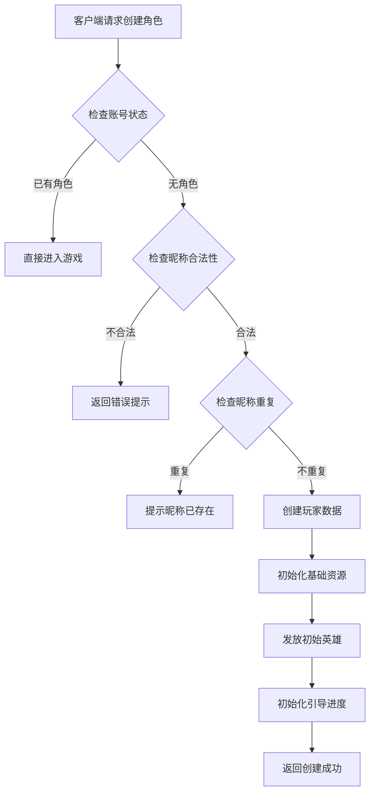
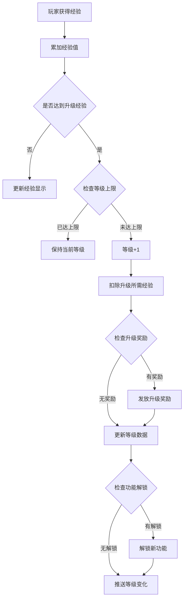
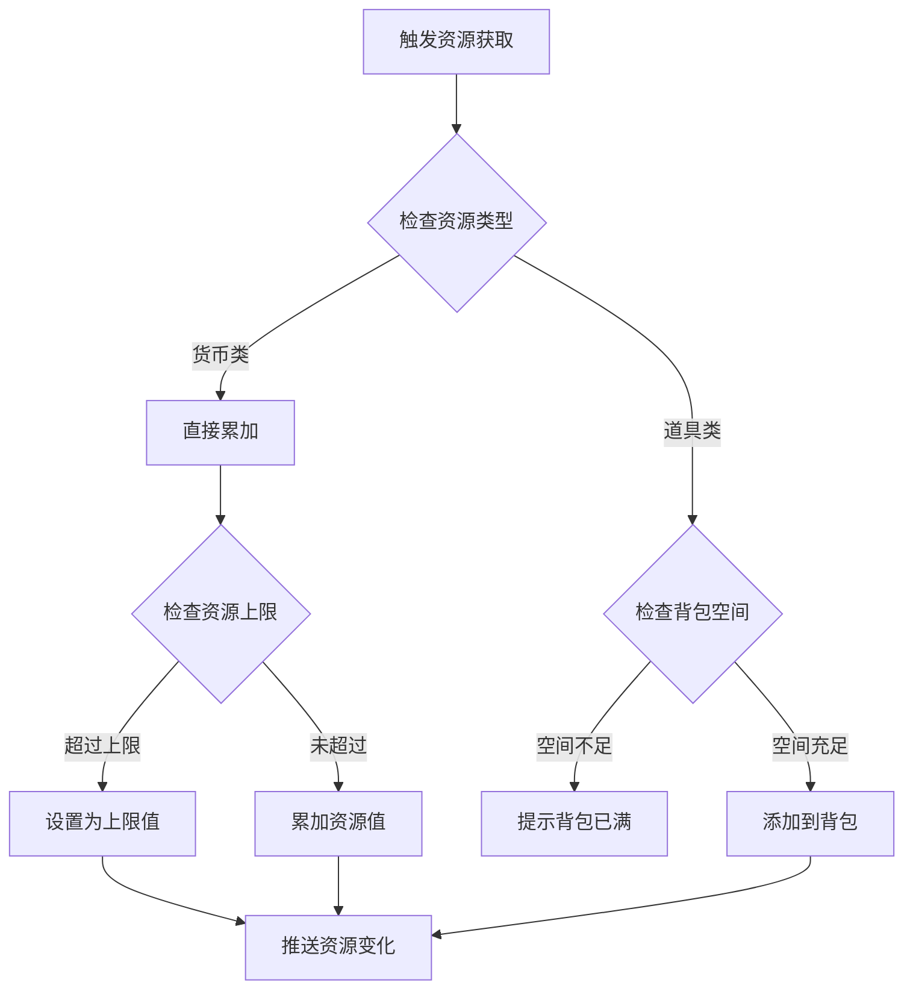
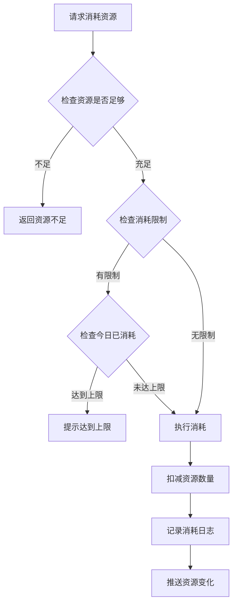
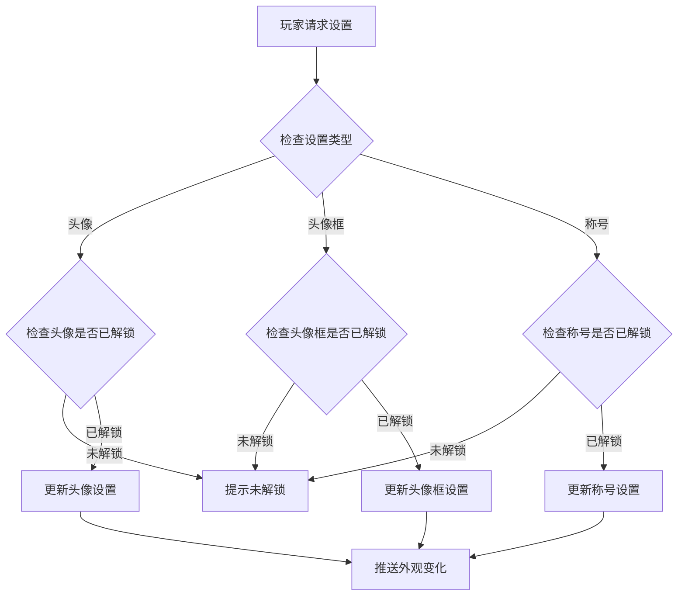

# 玩家模块完整说明

## 一、模块概述

### 1.1 业务背景

玩家模块是 K2C 游戏的核心基础模块，负责管理玩家的基础数据、属性、资源和个性化设置。所有其他游戏模块都依赖于玩家模块提供的身份认证、资源管理和基础属性支持。

### 1.2 目标用户

- **所有游戏玩家**：每个进入游戏的用户都是玩家模块的用户
- **运营人员**：通过玩家数据进行用户分析和运营决策

### 1.3 核心价值

1. **身份管理**：唯一标识玩家身份，管理账号信息
2. **资源管理**：统一管理玩家各类资源（货币、道具、体力等）
3. **进度追踪**：记录玩家游戏进度和成就
4. **个性化**：支持玩家自定义头像、昵称、称号等

---

## 二、功能清单

### 2.1 基础信息功能

| 功能名称 | 功能描述 | 用户价值 |
|---------|---------|---------|
| 玩家创建 | 创建新玩家角色 | 开始游戏旅程 |
| 昵称设置 | 设置和修改玩家昵称 | 个性化身份展示 |
| 头像设置 | 选择和更换玩家头像 | 个性化展示 |
| 头像框设置 | 装备头像框 | 展示成就和身份 |
| 气泡框设置 | 装备聊天气泡 | 个性化聊天体验 |
| 称号设置 | 装备和展示称号 | 展示成就和荣誉 |

### 2.2 资源管理功能

| 功能名称 | 功能描述 | 用户价值 |
|---------|---------|---------|
| 资源获取 | 通过各种途径获取资源 | 积累游戏资本 |
| 资源消耗 | 消耗资源进行各种操作 | 推进游戏进程 |
| 资源上限 | 管理资源存储上限 | 了解资源限制 |
| 资源恢复 | 自动恢复特定资源 | 持续游戏体验 |

### 2.3 等级系统功能

| 功能名称 | 功能描述 | 用户价值 |
|---------|---------|---------|
| 经验获取 | 通过各种行为获取经验 | 提升等级 |
| 等级提升 | 消耗经验提升等级 | 解锁新功能 |
| 升级奖励 | 升级获得奖励 | 激励玩家成长 |
| 功能解锁 | 等级解锁新玩法 | 逐步引导游戏 |

### 2.4 属性系统功能

| 功能名称 | 功能描述 | 用户价值 |
|---------|---------|---------|
| 基础属性 | 玩家基础属性管理 | 核心游戏数据 |
| 属性加成 | 各种来源的属性加成 | 提升实力 |
| 永久加成 | 永久属性加成系统 | 长期成长 |

### 2.5 社交信息功能

| 功能名称 | 功能描述 | 用户价值 |
|---------|---------|---------|
| 签名设置 | 设置个人签名 | 表达个性 |
| 在线状态 | 显示在线状态 | 社交互动 |
| 最近登录 | 记录登录时间 | 运营数据 |

---

## 三、业务流程详解

### 3.1 玩家创建流程



**详细步骤说明**：

1. **账号验证**
   - 验证账号是否已创建角色
   - 验证账号状态是否正常

2. **昵称验证**
   - 检查昵称长度（2-12个字符）
   - 检查昵称是否包含敏感词
   - 检查昵称是否已被使用

3. **数据初始化**
   - 创建玩家基础数据记录
   - 初始化资源（银两、钻石、体力等）
   - 发放初始英雄和装备
   - 设置初始引导进度

### 3.2 玩家升级流程



**详细步骤说明**：

1. **经验累加**
   - 计算获得的经验值
   - 累加到当前经验

2. **升级判定**
   - 检查是否满足升级条件
   - 检查是否达到等级上限

3. **升级处理**
   - 扣除升级所需经验
   - 等级 +1
   - 更新等级配置

4. **奖励发放**
   - 查询升级奖励配置
   - 发放奖励到背包

5. **功能解锁**
   - 查询该等级解锁的功能
   - 更新功能解锁状态

### 3.3 资源获取流程



**详细步骤说明**：

1. **资源分类**
   - 货币类：银两、钻石、绑定钻石
   - 体力类：体力、耐力
   - 道具类：消耗品、材料

2. **容量检查**
   - 货币类检查是否超过上限
   - 道具类检查背包空间

3. **资源更新**
   - 更新玩家资源数据
   - 推送资源变化通知

### 3.4 资源消耗流程



**详细步骤说明**：

1. **资源校验**
   - 检查资源类型是否正确
   - 检查资源数量是否充足

2. **限制检查**
   - 检查每日消耗限制
   - 检查累计消耗限制

3. **执行消耗**
   - 扣减资源数量
   - 记录消耗日志
   - 推送变化通知

### 3.5 个性化设置流程



---

## 四、关键规则

### 4.1 玩家等级规则

1. **等级上限**：最高 100 级
2. **经验获取**：通过完成任务、副本、日常活动获得
3. **升级奖励**：每次升级获得固定奖励
4. **功能解锁**：特定等级解锁新功能

### 4.2 资源规则

1. **货币规则**
   - 银两：基础货币，无上限或较高上限
   - 钻石：高级货币，可充值获得
   - 绑定钻石：不可交易的钻石

2. **体力规则**
   - 基础上限：100 点
   - 恢复速度：每 5 分钟恢复 1 点
   - 可通过道具或钻石补充

3. **背包规则**
   - 初始容量：100 格
   - 可扩展至 500 格
   - 超出时无法获取新物品

### 4.3 个性化规则

1. **昵称规则**
   - 长度：2-12 个字符
   - 禁止敏感词
   - 全服唯一

2. **头像规则**
   - 需要先解锁才能使用
   - 解锁方式：等级、成就、活动

3. **称号规则**
   - 需要达成特定条件解锁
   - 可同时拥有多个称号
   - 只能展示一个称号

---

## 五、用户故事

### 5.1 新玩家故事

> 作为一名新玩家，我下载游戏后首次进入，系统引导我创建角色。我输入了一个喜欢的昵称，系统确认可用后，我的角色创建成功。初始获得了 1000 银两和 100 体力，还有一个初始英雄。我迫不及待地开始了冒险。

### 5.2 活跃玩家故事

> 作为一名活跃玩家，我每天登录游戏领取奖励。通过完成日常任务，我积累了大量经验，今天终于升到了 50 级！解锁了公会系统，我立刻加入了朋友的公会。我的资源也积累了不少，准备参与下周的限时活动。

### 5.3 付费玩家故事

> 作为一名付费玩家，我购买了月卡和成长基金。每天登录都能领取额外奖励，升级还有返利。我用钻石购买了限定头像框，在好友列表中格外显眼。我还获得了专属称号，展示着我的VIP等级。

---

## 六、示例

### 6.1 玩家创建示例

**输入数据**：
- 账号ID：10000001
- 昵称：剑舞春秋
- 选择头像：默认头像 #1

**创建结果**：
```
玩家ID：20001
昵称：剑舞春秋
等级：1
经验：0/100
资源：
  - 银两：1000
  - 钻石：100
  - 体力：100/100
初始英雄：新手英雄（ID: 10001）
创建时间：2026-04-06 10:00:00
```

### 6.2 玩家升级示例

**初始状态**：
```
等级：9
经验：850/900
```

**获得经验**：
- 完成任务获得：200 经验

**升级结果**：
```
等级：10（+1）
经验：150/1200（剩余经验 + 新等级上限）
获得奖励：银两 × 500、钻石 × 50
解锁功能：公会系统
```

### 6.3 资源获取示例

**初始状态**：
```
银两：50,000
钻石：200
体力：80/100
```

**获取操作**：
- 领取邮件奖励：银两 × 10,000、钻石 × 100
- 使用体力药水：体力 + 20

**最终状态**：
```
银两：60,000（+10,000）
钻石：300（+100）
体力：100/100（+20，达到上限）
```

---

*文档生成时间: 2026-04-06*
