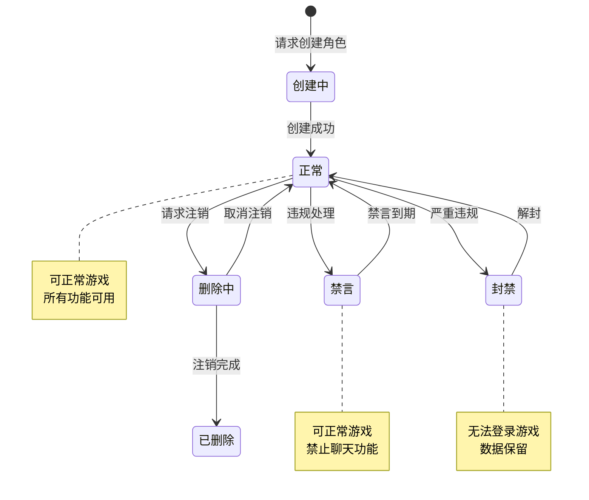
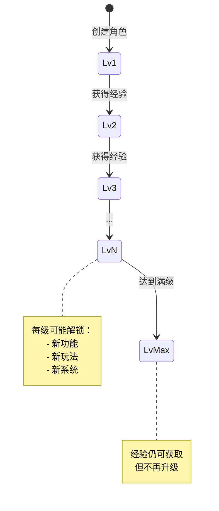
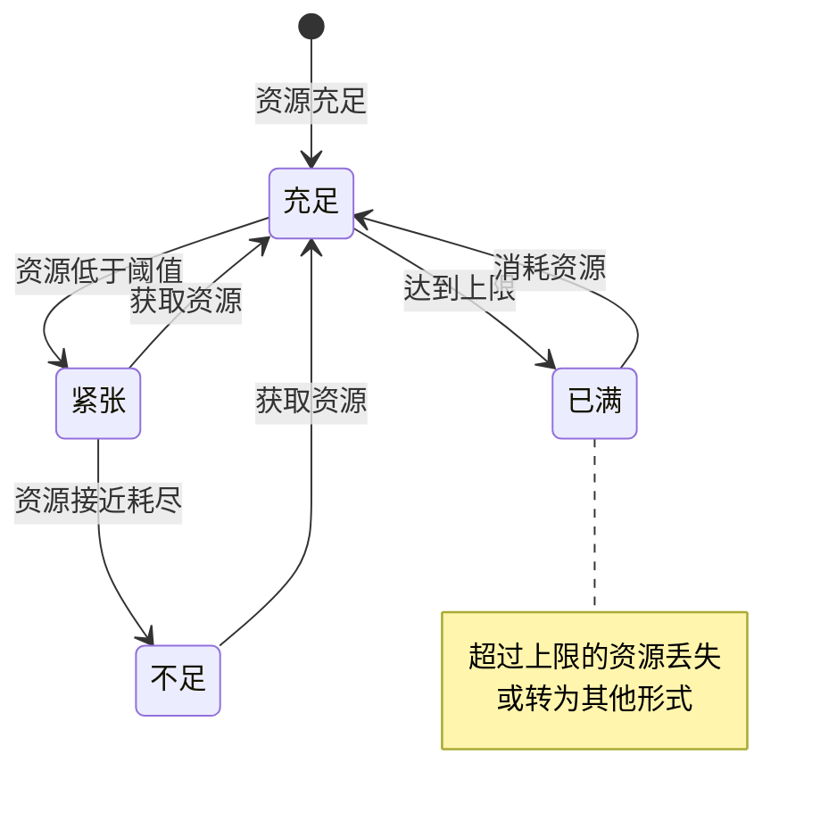
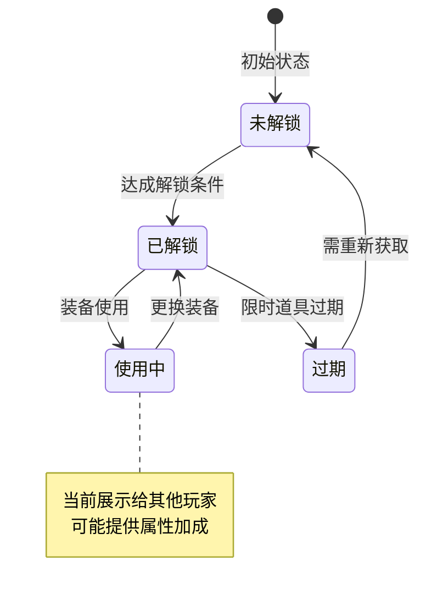
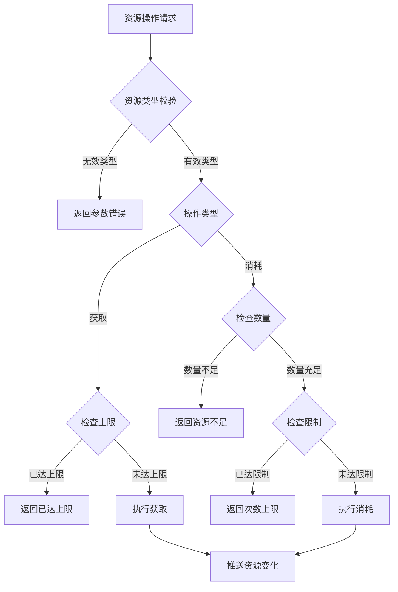

# 玩家模块实现细节

## 一、计算公式

### 1.1 升级经验计算公式

```
升级所需经验 = base_exp × level ^ exp_ratio
```

**参数说明**：
- `base_exp`：基础经验值（配置表）
- `level`：目标等级
- `exp_ratio`：经验系数（通常为 1.1-1.3）

**示例计算**：
```
base_exp = 100
exp_ratio = 1.2

10级升11级需要经验：100 × 10^1.2 = 100 × 15.85 ≈ 1585
50级升51级需要经验：100 × 50^1.2 = 100 × 189.46 ≈ 18946
```

### 1.2 资源恢复公式

```
恢复量 = floor((当前时间 - 上次恢复时间) / 恢复间隔)
实际恢复 = min(恢复量, 上限 - 当前值)
```

**参数说明**：
- `恢复间隔`：每次恢复的时间间隔（秒）
- `上限`：资源最大值

**示例计算**：
```
体力恢复间隔：300秒（5分钟）
体力上限：100
上次恢复时间：10:00
当前时间：10:30
当前体力：80

经过时间：1800秒
理论恢复量：1800 / 300 = 6点
实际恢复：min(6, 100-80) = 6点
恢复后体力：86点
```

### 1.3 总实力计算公式

```
总实力 = 英雄实力总和 + 玩家属性加成 + 称号加成 + 其他加成
```

**详细计算**：
```
英雄实力总和 = Σ(每个英雄的实力值)
玩家属性加成 = (等级 - 1) × level_power_ratio
称号加成 = 称号配置的固定实力值
其他加成 = VIP加成 + 公会技能加成 + 成就加成
```

### 1.4 VIP等级计算公式

```
VIP等级 = 获取VIP配置中累计充值 >= 玩家总充值 的最高等级
```

**示例计算**：
```
玩家总充值：5000元
VIP配置：
  VIP1: 累计充值 10元
  VIP2: 累计充值 100元
  VIP3: 累计充值 500元
  VIP4: 累计充值 2000元
  VIP5: 累计充值 5000元

VIP等级 = 5
```

---

## 二、状态机定义

### 2.1 玩家状态机



### 2.2 玩家等级状态机



### 2.3 资源状态机



### 2.4 头像/称号状态机



---

## 三、数据约束

### 3.1 玩家基础数据约束

| 字段名 | 数据类型 | 取值范围 | 必填 | 唯一性 | 说明 |
|--------|----------|----------|------|--------|------|
| playerId | long | > 0 | 是 | 是 | 玩家唯一ID |
| accountId | string | 非空 | 是 | 否 | 关联账号ID |
| nickname | string | 2-12字符 | 是 | 是 | 玩家昵称 |
| level | int | 1-100 | 是 | 否 | 玩家等级 |
| exp | long | >= 0 | 是 | 否 | 当前经验值 |
| vipLevel | int | 0-15 | 是 | 否 | VIP等级 |
| createTime | datetime | - | 是 | 否 | 创建时间 |
| lastLoginTime | datetime | - | 是 | 否 | 最后登录时间 |

### 3.2 玩家资源数据约束

| 字段名 | 数据类型 | 取值范围 | 必填 | 说明 |
|--------|----------|----------|------|------|
| silver | long | 0-9,999,999,999 | 是 | 银两 |
| diamond | long | 0-999,999 | 是 | 钻石 |
| bindDiamond | long | 0-999,999 | 是 | 绑定钻石 |
| energy | int | 0-200 | 是 | 体力（可扩展上限） |
| energyRecoverTime | datetime | - | 是 | 体力恢复时间 |
| stamina | int | 0-200 | 是 | 耐力 |

### 3.3 玩家外观数据约束

| 字段名 | 数据类型 | 取值范围 | 必填 | 说明 |
|--------|----------|----------|------|------|
| iconId | long | > 0 | 是 | 当前头像ID |
| iconBgkId | long | >= 0 | 是 | 当前头像框ID |
| bubbleId | long | >= 0 | 是 | 当前气泡框ID |
| titleId | long | >= 0 | 是 | 当前称号ID |
| signature | string | 0-50字符 | 否 | 个性签名 |

### 3.4 解锁数据约束

| 字段名 | 数据类型 | 取值范围 | 必填 | 说明 |
|--------|----------|----------|------|------|
| unlockId | long | > 0 | 是 | 解锁项ID |
| unlockType | int | 1-5 | 是 | 类型：1功能,2头像,3称号,4头像框,5气泡 |
| unlockTime | datetime | - | 是 | 解锁时间 |
| expireTime | datetime | - | 否 | 过期时间（限时） |

---

## 四、错误处理策略

### 4.1 玩家模块错误码

| 错误码 | 错误信息 | 处理策略 | 用户提示 |
|--------|----------|----------|----------|
| 40001 | 玩家不存在 | 检查玩家ID有效性 | "玩家数据异常，请重新登录" |
| 40002 | 昵称已存在 | 提示更换昵称 | "该昵称已被使用，请更换" |
| 40003 | 昵称包含敏感词 | 提示修改 | "昵称包含敏感词，请修改" |
| 40004 | 昵称长度不合法 | 提示合法长度 | "昵称长度需在2-12个字符之间" |
| 40005 | 资源不足 | 提示获取途径 | "资源不足，请获取更多资源" |
| 40006 | 背包已满 | 提示清理背包 | "背包已满，请清理后再试" |
| 40007 | 等级不足 | 提示所需等级 | "等级不足，需要达到X级" |
| 40008 | 功能未解锁 | 提示解锁条件 | "该功能尚未解锁" |
| 40009 | 头像未解锁 | 提示解锁条件 | "该头像尚未解锁" |
| 40010 | 称号未解锁 | 提示解锁条件 | "该称号尚未解锁" |
| 40011 | 玩家已封禁 | 说明封禁原因 | "账号已被封禁，请联系客服" |
| 40012 | 玩家已禁言 | 说明禁言时长 | "账号处于禁言状态" |
| 40013 | 每日次数已达上限 | 提示明日重置 | "今日次数已用完，请明日再来" |

### 4.2 资源错误处理流程



### 4.3 玩家状态错误处理

| 玩家状态 | 处理策略 | 允许操作 |
|----------|----------|----------|
| 正常 | 正常处理所有请求 | 所有操作 |
| 禁言 | 允许登录，拦截聊天相关 | 除聊天外所有操作 |
| 封禁 | 拒绝登录，返回封禁信息 | 无 |
| 删除中 | 允许取消删除 | 取消删除 |

---

## 五、关键代码示例

### 5.1 玩家创建伪代码

```csharp
public Result CreatePlayer(string accountId, string nickname, int defaultIconId)
{
    // 1. 检查账号是否已有角色
    if (playerService.HasPlayer(accountId))
        return Result.Error(40001, "该账号已有角色");

    // 2. 验证昵称
    if (string.IsNullOrEmpty(nickname) || nickname.Length < 2 || nickname.Length > 12)
        return Result.Error(40004, "昵称长度不合法");

    if (sensitiveWordService.Contains(nickname))
        return Result.Error(40003, "昵称包含敏感词");

    if (playerService.NicknameExists(nickname))
        return Result.Error(40002, "昵称已存在");

    // 3. 创建玩家
    PlayerInfo player = new PlayerInfo {
        playerId = idGenerator.NextId(),
        accountId = accountId,
        nickname = nickname,
        level = 1,
        exp = 0,
        vipLevel = 0,
        createTime = DateTime.Now,
        lastLoginTime = DateTime.Now
    };

    // 4. 初始化资源
    player.resources = new PlayerResources {
        silver = 1000,
        diamond = 100,
        bindDiamond = 0,
        energy = 100,
        energyRecoverTime = DateTime.Now,
        stamina = 100
    };

    // 5. 初始化外观
    player.appearance = new PlayerAppearance {
        iconId = defaultIconId,
        iconBgkId = 0,
        bubbleId = 0,
        titleId = 0
    };

    // 6. 保存数据
    playerService.CreatePlayer(player);

    // 7. 发放初始奖励
    RewardHelper.GiveInitialReward(player.playerId);

    // 8. 创建初始英雄
    heroService.CreateInitialHero(player.playerId);

    return Result.Success(player);
}
```

### 5.2 玩家升级伪代码

```csharp
public Result AddExp(long playerId, long expAmount)
{
    PlayerInfo player = playerService.GetPlayer(playerId);
    if (player == null)
        return Result.Error(40001, "玩家不存在");

    // 获取等级上限配置
    int maxLevel = configService.GetInt("max_player_level", 100);
    if (player.level >= maxLevel)
    {
        // 满级后经验不再累加
        return Result.Success(player);
    }

    // 累加经验
    player.exp += expAmount;

    // 检查是否升级
    List<int> levelUpList = new List<int>();
    while (player.level < maxLevel)
    {
        PlayerLevelRefObj levelRef = GetLevelRef(player.level + 1);
        if (player.exp < levelRef.exp)
            break;

        // 升级
        player.exp -= levelRef.exp;
        player.level++;
        levelUpList.Add(player.level);

        // 发放升级奖励
        if (levelRef.reward != null)
        {
            bagService.AddItems(playerId, levelRef.reward);
        }

        // 检查功能解锁
        CheckFunctionUnlock(player, player.level);
    }

    // 更新数据
    playerService.UpdatePlayer(player);

    // 推送升级通知
    if (levelUpList.Count > 0)
    {
        PushLevelUp(playerId, levelUpList);
    }

    return Result.Success(player);
}
```

### 5.3 资源操作伪代码

```csharp
public Result AddResource(long playerId, ResourceType type, long amount)
{
    PlayerInfo player = playerService.GetPlayer(playerId);
    if (player == null)
        return Result.Error(40001, "玩家不存在");

    ResourceConfig config = GetResourceConfig(type);
    if (config == null)
        return Result.Error(40005, "无效的资源类型");

    // 获取当前值
    long currentValue = player.GetResource(type);
    long maxValue = GetResourceMax(player, type);

    // 计算实际增加值（不超过上限）
    long actualAdd = Math.Min(amount, maxValue - currentValue);
    if (actualAdd <= 0)
        return Result.Error(40006, "资源已达上限");

    // 更新资源
    player.SetResource(type, currentValue + actualAdd);

    // 如果是恢复型资源，更新恢复时间
    if (config.needRecover)
    {
        player.SetRecoverTime(type, DateTime.Now);
    }

    // 保存并推送
    playerService.UpdatePlayer(player);
    PushResourceChange(playerId, type, currentValue + actualAdd);

    return Result.Success(new { actualAdd = actualAdd });
}

public Result CostResource(long playerId, ResourceType type, long amount, string reason)
{
    PlayerInfo player = playerService.GetPlayer(playerId);
    if (player == null)
        return Result.Error(40001, "玩家不存在");

    // 检查数量
    long currentValue = player.GetResource(type);
    if (currentValue < amount)
        return Result.Error(40005, "资源不足");

    // 检查每日限制
    ResourceConfig config = GetResourceConfig(type);
    if (config.dailyLimit > 0)
    {
        int todayUsed = GetTodayUsage(playerId, type);
        if (todayUsed + amount > config.dailyLimit)
            return Result.Error(40013, "每日次数已达上限");
    }

    // 扣减资源
    player.SetResource(type, currentValue - amount);

    // 记录日志
    LogResourceCost(playerId, type, amount, reason);

    // 保存并推送
    playerService.UpdatePlayer(player);
    PushResourceChange(playerId, type, currentValue - amount);

    return Result.Success();
}
```

### 5.4 体力恢复伪代码

```csharp
public void RecoverEnergy(long playerId)
{
    PlayerInfo player = playerService.GetPlayer(playerId);
    if (player == null) return;

    ResourceConfig config = GetResourceConfig(ResourceType.Energy);
    int maxEnergy = GetResourceMax(player, ResourceType.Energy);

    // 已满则不需要恢复
    if (player.resources.energy >= maxEnergy) return;

    // 计算恢复量
    TimeSpan elapsed = DateTime.Now - player.resources.energyRecoverTime;
    int recoverCount = (int)(elapsed.TotalSeconds / config.recoverInterval);

    if (recoverCount <= 0) return;

    // 计算实际恢复量
    int actualRecover = Math.Min(recoverCount, maxEnergy - player.resources.energy);
    player.resources.energy += actualRecover;

    // 更新恢复时间（只前进实际恢复的时间）
    player.resources.energyRecoverTime =
        player.resources.energyRecoverTime.AddSeconds(recoverCount * config.recoverInterval);

    // 如果满了，设置为当前时间
    if (player.resources.energy >= maxEnergy)
    {
        player.resources.energyRecoverTime = DateTime.Now;
    }

    playerService.UpdatePlayer(player);
    PushResourceChange(playerId, ResourceType.Energy, player.resources.energy);
}
```

### 5.5 外观设置伪代码

```csharp
public Result SetIcon(long playerId, long iconId)
{
    PlayerInfo player = playerService.GetPlayer(playerId);
    if (player == null)
        return Result.Error(40001, "玩家不存在");

    // 检查头像是否已解锁
    PlayerUnlock unlock = unlockService.GetUnlock(playerId, UnlockType.Icon, iconId);
    if (unlock == null)
        return Result.Error(40009, "头像未解锁");

    // 检查是否过期（限时头像）
    if (unlock.expireTime.HasValue && unlock.expireTime.Value < DateTime.Now)
        return Result.Error(40009, "头像已过期");

    // 更新头像
    player.appearance.iconId = iconId;
    playerService.UpdatePlayer(player);

    // 推送外观变化
    PushAppearanceChange(playerId, player.appearance);

    return Result.Success();
}
```

---

## 六、性能优化建议

### 6.1 缓存策略

1. **玩家数据缓存**
   - 登录时加载到 Redis 缓存
   - 修改后异步写入数据库
   - 下线后延迟清理缓存

2. **资源上限缓存**
   - VIP 等级相关的上限配置缓存
   - 减少配置表查询

### 6.2 数据库优化

1. **分表策略**
   - 玩家基础数据和资源数据分表
   - 按玩家ID取模分表

2. **索引设计**
   - playerId 主键索引
   - accountId 唯一索引
   - nickname 唯一索引
   - lastLoginTime 普通索引（用于清理）

### 6.3 批量操作

1. **经验累加**：批量处理多个经验来源
2. **资源推送**：合并多次资源变化推送
3. **解锁检查**：一次性查询所有解锁状态

---

*文档生成时间: 2026-04-06*
