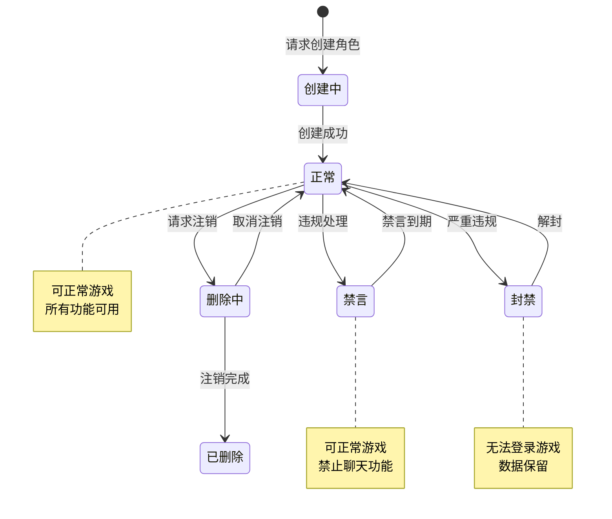
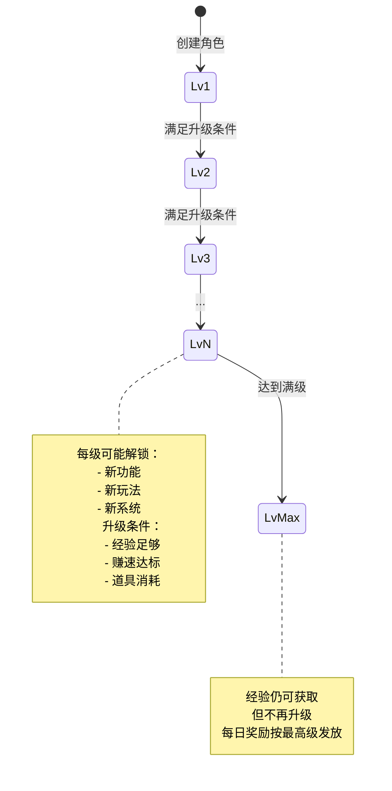
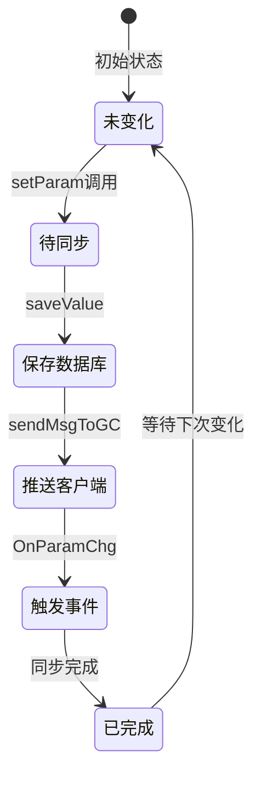
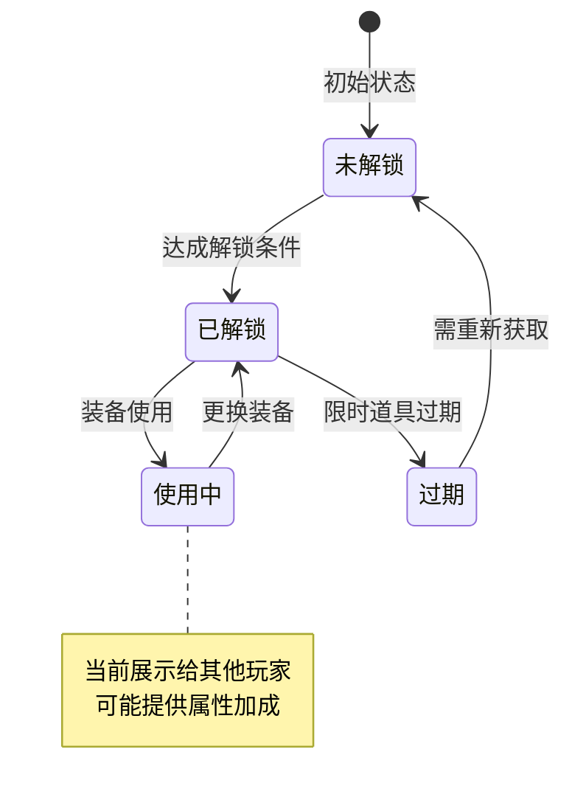
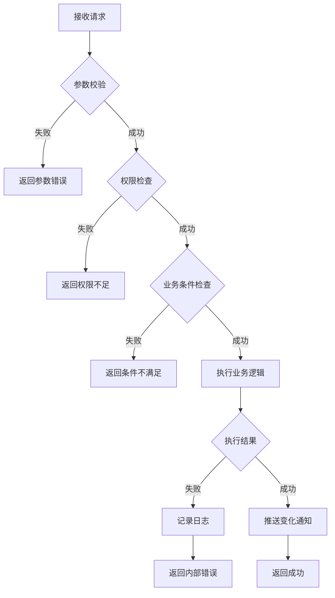

# 玩家模块实现细节

## 一、计算公式

### 1.1 升级经验计算公式

```
升级所需经验 = RefPlayerLevel[lvl].exp
```

经验值来自配置表 `RefPlayerLevel`，每个等级有独立的经验需求。

**示例计算**：
```
1级升2级需要经验：RefPlayerLevel[2].exp = 100
10级升11级需要经验：RefPlayerLevel[11].exp = 1000
50级升51级需要经验：RefPlayerLevel[51].exp = 50000
```

### 1.2 赚速计算公式

```
最终赚速 = ceil((建筑赚速 + 子嗣赚速 + 额外赚速) * (10000 + 属性加成百分比) / 10000)
```

**参数说明**：
- `建筑赚速`：所有建筑产出总和
- `子嗣赚速`：所有成年子嗣产出总和
- `额外赚速`：玩家参数 `EXTRA_EARNINGS`
- `属性加成百分比`：属性 `EXTRA_EARNINGS_ADD_PER`

**示例计算**：
```
建筑赚速 = 5000
子嗣赚速 = 3000
额外赚速 = 500
属性加成百分比 = 2000 (20%)

基础赚速 = 5000 + 3000 + 500 = 8500
最终赚速 = ceil(8500 * (10000 + 2000) / 10000) = ceil(10200) = 10200
```

**源码实现**：
```java
private void _calEarnings(boolean _isInit)
{
    getUserData().lockUser();
    try {
        long oriEarnings = 0;
        oriEarnings += getUserData().getBuildingComponent().getTotalEarning();
        oriEarnings += getUserData().getChildComponent().getTotalEarning();
        oriEarnings += getParamV(ENPPlayerParam.EXTRA_EARNINGS);

        // 计算最终值
        _m_earnings = (long) Math.ceil(oriEarnings *
            (10000 + getPropertyMgr().getValue(ENPPlayerPropertyType.EXTRA_EARNINGS_ADD_PER))
            / 10000d);

        if (!_isInit) {
            _m_earningsChgDelegate.onEvent();
            PlayerCacheFunc.updateEarnings(getUserData(), _m_earnings);
            checkExceedMaxEarningsRecord();
        }
    } finally {
        getUserData().unlockUser();
    }
}
```

### 1.3 VIP等级计算

```
VIP等级 = 遍历RefVip配置，找到vip_exp <= 当前VIP经验的最高等级
```

**源码实现**：
```java
public void checkVipLevelUp(NPPlayerContext _context)
{
    getUserData().lockUser();
    try {
        long vipExpCount = getUserData().getCurrencyComponent()
            .getItemCount(ECurrency.VIP_EXP.ordinal());

        RefVip targetVipRef = null;
        RefVip nextVipRef = RefVip.getMgr().get(_m_curVipRef.vip_lvl + 1);

        while (nextVipRef != null) {
            if (vipExpCount < nextVipRef.vip_exp)
                break;

            targetVipRef = nextVipRef;
            nextVipRef = RefVip.getMgr().get(nextVipRef.vip_lvl + 1);
        }

        if (targetVipRef != null) {
            setParam(ENPPlayerParam.VIP_LVL, targetVipRef.vip_lvl);
            _m_pcPlayerPropertyContainer.replaceModifier(
                _m_curVipRef.player_property, targetVipRef.player_property);
            _m_curVipRef = targetVipRef;
        }
    } finally {
        getUserData().unlockUser();
    }
}
```

### 1.4 已领取VIP奖励位图计算

```
已领取标记 = hadDrawList & (1L << vipLvl)
设置标记 = hadDrawList | (1L << vipLvl)
```

**示例计算**：
```
已领取列表 hadDrawList = 0b10110 (二进制)
表示已领取 VIP2, VIP3, VIP5 的奖励

检查VIP4是否已领取：
0b10110 & (1L << 4) = 0b10110 & 0b10000 = 0 -> 未领取

设置VIP4已领取：
0b10110 | (1L << 4) = 0b10110 | 0b10000 = 0b11110
```

---

## 二、状态机定义

### 2.1 玩家状态机



### 2.2 玩家等级状态机



### 2.3 参数变化状态机



### 2.4 称号穿戴状态机



---

## 三、数据约束

### 3.1 玩家基础数据约束

| 字段名 | 数据类型 | 取值范围 | 必填 | 唯一性 | 说明 |
|--------|----------|----------|------|--------|------|
| cid | long | > 0 | 是 | 是 | 玩家唯一ID |
| cname | string | 2-12字符 | 是 | 是 | 玩家昵称 |
| lvl | int | 1-MAX | 是 | 否 | 玩家等级 |
| vipLvl | int | 0-MAX | 是 | 否 | VIP等级 |
| gmLevel | int | 0-10 | 是 | 否 | GM等级 |
| createTime | long | > 0 | 是 | 否 | 创建时间戳 |
| loginDayCount | int | >= 0 | 是 | 否 | 累计登录天数 |

### 3.2 玩家参数约束

| 参数名 | 数据类型 | 取值范围 | 说明 |
|--------|----------|----------|------|
| ICON | long | > 0 | 头像ID |
| ICON_BGK | long | >= 0 | 头像框ID (0表示无) |
| BUBBLE | long | >= 0 | 气泡ID (0表示无) |
| ROOM_SKIN | long | >= 0 | 房间皮肤ID (0表示无) |
| LEVEL | int | >= 1 | 等级 |
| VIP_LVL | int | >= 0 | VIP等级 |
| EARNINGS_MAX_RECORD | long | >= 0 | 赚速历史最高 |
| RECHARGED_GEM | long | >= 0 | 累计充值钻石 |

### 3.3 解锁数据约束

| 字段名 | 数据类型 | 取值范围 | 说明 |
|--------|----------|----------|------|
| unlockId | long | > 0 | 解锁项ID |
| unlockType | int | 1-7 | 类型：1功能,2头像,3称号,4头像框,5气泡,6模型,7房间皮肤 |
| unlockTime | long | > 0 | 解锁时间戳 |
| expireTime | long | >= 0 | 过期时间（0表示永久） |

---

## 四、错误处理策略

### 4.1 玩家模块错误码

| 错误码 | 错误信息 | 处理策略 | 用户提示 |
|--------|----------|----------|----------|
| 40001 | 玩家不存在 | 检查玩家ID有效性 | "玩家数据异常，请重新登录" |
| 40002 | 昵称已存在 | 提示更换昵称 | "该昵称已被使用，请更换" |
| 40003 | 昵称包含敏感词 | 提示修改 | "昵称包含敏感词，请修改" |
| 40004 | 昵称长度不合法 | 提示合法长度 | "昵称长度需在2-12个字符之间" |
| 40005 | 资源不足 | 提示获取途径 | "资源不足，请获取更多资源" |
| 40006 | 背包已满 | 提示清理背包 | "背包已满，请清理后再试" |
| 40007 | 等级不足 | 提示所需等级 | "等级不足，需要达到X级" |
| 40008 | 功能未解锁 | 提示解锁条件 | "该功能尚未解锁" |
| 40009 | 头像未解锁 | 提示解锁条件 | "该头像尚未解锁" |
| 40010 | 称号未解锁 | 提示解锁条件 | "该称号尚未解锁" |
| 40011 | 玩家已封禁 | 说明封禁原因 | "账号已被封禁，请联系客服" |
| 40012 | 玩家已禁言 | 说明禁言时长 | "账号处于禁言状态" |
| 40013 | 每日次数已达上限 | 提示明日重置 | "今日次数已用完，请明日再来" |
| 40014 | VIP等级奖励未满足 | 提示VIP等级 | "VIP等级不足" |
| 40015 | VIP等级奖励已领取 | 提示已领取 | "该奖励已领取" |

### 4.2 错误处理流程



---

## 五、关键代码示例

### 5.1 玩家组件初始化

```java
public void initBo(PlayerBO _bo)
{
    // 设置数据对象
    _m_boPlayerBo = _bo;

    // 初始化参数管理器
    _m_pmParamMgr.initMgr(this);

    // 初始化等级
    if (!reInitLevel()) {
        getUserData().setDataLoadFail();
        return;
    }

    // 初始化VIP等级
    _m_curVipRef = RefVip.getMgr().get(getParamV(ENPPlayerParam.VIP_LVL));
    if (null == _m_curVipRef) {
        USLog.error(getUSServer(), "player:{} initBo get vip ref failed",
            getUserData().getCid());
        getUserData().setDataLoadFail();
        return;
    }
    _m_pcPlayerPropertyContainer.addModifier(_m_curVipRef.player_property);

    // 加载当前称号数据
    getCurTitleMgr()._initFromBo(_m_boPlayerBo);

    // 设置初始化完成
    setInited();
}
```

### 5.2 所有组件初始化完成后的处理

```java
public void onAllCompInitedDeal()
{
    // 相关组件属性计算
    getUserData().getConsortComponent()._initCalAllConsort();
    getUserData().getHeroComponent()._initCalAllHero();
    getUserData().getBuildingComponent()._initCalAllBuilding();

    // 计算赚速
    _calEarnings(true);

    // 检查提交玩家的最大赚速
    checkExceedMaxEarningsRecord();
    getUserData().getBuildingComponent().checkExceedMaxEarningsRecord();
    getUserData().getChildComponent().checkExceedMaxEarningsRecord();

    // 计算火星探险队伍实力
    getUserData().getMarsExploreComponent().getTeamMgr()._initCalTeamPower();

    // 火星建筑相关产出计算
    getUserData().getMarsBuildingComponent()._onAllCompInitedDeal();

    // 确保玩家缓存存在
    ensurePlayerCache();

    // 注册属性变化监听
    _m_mgrPropertyMgr.propertyChgDelegate().addHandler(this,
        new HandlerThree<ENPPlayerPropertyType, Long, Long>() {
            @Override
            public void handle(ENPPlayerPropertyType _type, Long _preValue, Long _curVal) {
                // CachePlayer同步修改属性变化
                PlayerCacheFunc.updateProperty(getUserData(), _type, _curVal);
                // 赚速加成变更要重新计算
                if (_type == ENPPlayerPropertyType.EXTRA_EARNINGS_ADD_PER)
                    setNeedCalEarnings();
            }
        });

    // 注册参数变化监听
    getUserData().Events.OnParamChg.addHandler(this,
        new HandlerThree<ENPPlayerParam, Long, Long>() {
            @Override
            public void handle(ENPPlayerParam _type, Long _oldVal, Long _curVal) {
                // CachePlayer同步修改参数变化
                PlayerCacheFunc.updateParam(getUserData(), _type, _curVal);
            }
        });
}
```

### 5.3 强制设置等级（GM命令）

```java
/**
 * 强制设置玩家等级（仅用于GM命令）
 */
public boolean forceSetLevel(int _targetLevel, NPPlayerContext _context)
{
    getUserData().lockUser();
    try {
        // 查找目标等级配置
        RefPlayerLevel targetLevelRef = RefPlayerLevel.getMgr().get(_targetLevel);
        if (targetLevelRef == null) {
            USLog.error(getUSServer(), "forceSetLevel - ref not found: targetLevel={}",
                _targetLevel);
            return false;
        }

        // 保存旧等级信息
        RefPlayerLevel oldLevelRef = _m_curLevelRef;
        int oldLevel = oldLevelRef != null ? oldLevelRef.lvl : 1;

        // 移除旧等级的属性加成
        if (_m_curLevelRef != null) {
            _m_pcPlayerPropertyContainer.removeModifier(_m_curLevelRef.player_property);
        }

        // 更新等级配置
        _m_curLevelRef = targetLevelRef;

        // 添加新等级的属性加成
        _m_pcPlayerPropertyContainer.addModifier(_m_curLevelRef.player_property);

        // 保存等级参数
        setParam(ENPPlayerParam.LEVEL, _m_curLevelRef.lvl);

        // 同步经验值
        getUserData().getCurrencyComponent().setCurrencyCount(
            ECurrency.P_EXP.ordinal(), targetLevelRef.exp, _context);

        // 重新计算赚速
        _calEarnings(false);

        // 记录日志
        LogPlayerLevelUpBO logBo = new LogPlayerLevelUpBO();
        logBo.setCid(getBM(), getUserData().getCid());
        logBo.setOriLevel(getBM(), oldLevel);
        logBo.setExp(getBM(), targetLevelRef.exp);
        logBo.setNewLevel(getBM(), _m_curLevelRef.lvl);
        CommLogDB.log(getBM(), logBo, _context);

        return true;
    } finally {
        getUserData().unlockUser();
    }
}
```

### 5.4 参数同步到客户端

```java
// _ANPPlayerInfoParamObj.java
public GS2GC_004_054_OnPlayerParamUpdated makeSyncProto()
{
    GS2GC_004_054_OnPlayerParamUpdated proto = new GS2GC_004_054_OnPlayerParamUpdated();
    proto.setIndex(getIndex());
    proto.setParamValue(GetValue());
    return proto;
}
```

---

## 六、性能优化

### 6.1 赚速延迟计算

使用 `LazyTaskDealer` 实现延迟计算，避免频繁重算：

```java
// 创建延迟任务处理器（延迟100ms）
_m_earningsCalLazyDealer = new LazyTaskDealer(
    () -> _calEarnings(false), 100
);

// 标记需要计算
public void setNeedCalEarnings()
{
    _m_earningsCalLazyDealer.setNeedDeal();
}
```

### 6.2 缓存策略

1. **玩家数据缓存**
   - 登录时加载到 Redis 缓存
   - 修改后异步写入数据库
   - 下线后延迟清理缓存

2. **参数缓存同步**
   - 参数变化时同步更新缓存
   - 减少缓存穿透

```java
// 参数变化时同步更新缓存
PlayerCacheFunc.updateParam(getUserData(), _type, _curVal);
PlayerCacheFunc.updateEarnings(getUserData(), _m_earnings);
PlayerCacheFunc.updateName(getUserData(), newName);
```

### 6.3 属性计算优化

1. **增量计算**：只在属性变化时重算
2. **批量更新**：合并多次变化后统一推送
3. **脏标记**：标记需要重算的属性

### 6.4 数据库优化

1. **分表策略**
   - 玩家基础数据和资源数据分表
   - 按玩家ID取模分表

2. **索引设计**
   - cid 主键索引
   - cname 唯一索引
   - lastLoginTime 普通索引

---

## 七、日志记录

### 7.1 改名日志

```java
LogPlayerSetNameBO logBo = new LogPlayerSetNameBO();
logBo.setCid(bmObj, getUserData().getCid());
logBo.setName(bmObj, _m_boPlayerBo.getCname());
logBo.setIsCost(bmObj, _isCost);
CommLogDB.log(bmObj, logBo, _context);
```

### 7.2 升级日志

```java
LogPlayerLevelUpBO logBo = new LogPlayerLevelUpBO();
logBo.setCid(bmObj, getUserData().getCid());
logBo.setOriLevel(bmObj, oldLevelRef.lvl);
logBo.setExp(bmObj, expCount);
logBo.setEarnings(bmObj, getEarnings());
logBo.setNewLevel(bmObj, _m_curLevelRef.lvl);
logBo.setNation(bmObj, getUserData().getSdkInfo().nation);
logBo.setDeviceOs(bmObj, getUserData().getSdkInfo().deviceType.name());
logBo.setCreateRoleTime(bmObj, getUserData().getPlayerComponent().getBo().getCreateRoleTime());
CommLogDB.log(bmObj, logBo, _context);
```

### 7.3 截面日志

```java
public void logSection(ELogSectionType _sectionLogType)
{
    LogSectionPlayerV2BO logBo = new LogSectionPlayerV2BO();
    logBo.setSectionType(getUSServer().getBM(), _sectionLogType.ordinal());
    logBo.setCid(bmObj, getUserData().getCid());
    logBo.setVillageEarning(bmObj, getUserData().getBuildingComponent().getBuildingSpeedSum());
    logBo.setChildEarning(bmObj, getUserData().getChildComponent().getBonusSum());
    logBo.setLevel(bmObj, getUserData().getPlayerComponent().getCurLvl());
    // ... 更多字段
    CommLogDB.log(bmObj, logBo);
}
```

---

## 八、扩展点

### 8.1 添加新的玩家参数

1. 在 `ENPPlayerParam` 枚举中添加新参数
2. 在 `NPPlayerParamMgr.initMgr()` 中注册参数
3. 实现参数的 `GetValue()` 和 `saveValue()` 方法

```java
// 示例：添加新参数
registParam(new _ANPPlayerInfoParamObj(ENPPlayerParam.NEW_PARAM, bo) {
    public long GetValue() {
        return getData().getNewParam();
    }
    public void saveValue(long value) {
        getData().saveNewParam(getUSServer().getBM(), value);
    }
});
```

### 8.2 添加新的协议

1. 在 `ClientProtocol/GC2GS/p004_PlayerOp/` 添加请求协议
2. 在 `ClientProtocol/GS2GC/p004_PlayerOp/` 添加响应协议
3. 在服务端添加协议处理器

### 8.3 添加新的属性类型

1. 在 `ENPPlayerPropertyType` 枚举中添加新属性
2. 在相关配置表中添加属性定义
3. 在属性容器中添加计算逻辑

---

## 九、边界情况处理

### 9.1 等级边界

```java
/**
 * 等级边界检查
 */
public Result checkLevelUp(int _curLvl, boolean _isForce, NPPlayerContext _context)
{
    // 边界检查：等级不能小于1
    if (_curLvl < 1) {
        return Result.fail(CommErr.PARAM_ERROR);
    }

    // 边界检查：当前等级是否匹配
    if (_m_curLevelRef.lvl != _curLvl) {
        return Result.fail(CommErr.PLAYER_CACHE_ERR);
    }

    // 边界检查：是否已达到最高等级
    RefPlayerLevel nextLevelRef = RefPlayerLevel.getMgr().get(_m_curLevelRef.lvl + 1);
    if (nextLevelRef == null) {
        return Result.fail(CommErr.LEVEL_MAX_REACHED);
    }

    // 边界检查：经验是否溢出
    long expCount = getUserData().getCurrencyComponent().getItemCount(ECurrency.P_EXP.ordinal());
    if (expCount < nextLevelRef.exp) {
        return Result.fail(CommErr.CONDITION_NOT_ENABLE);
    }

    // ... 后续处理
}
```

### 9.2 赚速边界

```java
/**
 * 赚速计算边界处理
 */
private void _calEarnings(boolean _isInit)
{
    getUserData().lockUser();
    try {
        long oriEarnings = 0;

        // 建筑赚速（可能为负值时的处理）
        long buildingEarnings = getUserData().getBuildingComponent().getTotalEarning();
        oriEarnings += Math.max(0, buildingEarnings);

        // 子嗣赚速
        long childEarnings = getUserData().getChildComponent().getTotalEarning();
        oriEarnings += Math.max(0, childEarnings);

        // 额外赚速（可能为负值）
        long extraEarnings = getParamV(ENPPlayerParam.EXTRA_EARNINGS);
        oriEarnings += extraEarnings;

        // 边界检查：赚速不能为负
        oriEarnings = Math.max(0, oriEarnings);

        // 赚速上限检查
        long maxEarnings = RefGeneral.Ref().max_earnings;
        if (oriEarnings > maxEarnings) {
            oriEarnings = maxEarnings;
        }

        // 计算最终值（加成后）
        long propertyAdd = getPropertyMgr().getValue(ENPPlayerPropertyType.EXTRA_EARNINGS_ADD_PER);
        propertyAdd = Math.max(0, propertyAdd); // 加成不能为负

        _m_earnings = (long) Math.ceil(oriEarnings * (10000 + propertyAdd) / 10000d);

        // 最终边界检查
        _m_earnings = Math.max(0, _m_earnings);
        _m_earnings = Math.min(_m_earnings, maxEarnings);

        // ... 后续处理
    } finally {
        getUserData().unlockUser();
    }
}
```

### 9.3 参数值边界

```java
/**
 * 参数设置边界检查
 */
public void setParam(ENPPlayerParam _eParam, long _value)
{
    _ANPPlayerInfoParamObj param = getParam(_eParam);
    if (null == param) {
        return;
    }

    // 根据参数类型进行边界检查
    switch (_eParam) {
        case LEVEL:
            _value = Math.max(1, _value);
            _value = Math.min(_value, RefGeneral.Ref().max_level);
            break;
        case VIP_LVL:
            _value = Math.max(0, _value);
            _value = Math.min(_value, RefGeneral.Ref().max_vip_level);
            break;
        case ICON:
        case ICON_BGK:
        case BUBBLE:
        case ROOM_SKIN:
            _value = Math.max(0, _value);
            break;
        case EARNINGS_MAX_RECORD:
        case POWER_MAX_RECORD:
            _value = Math.max(0, _value);
            break;
    }

    // 调用实际设置
    param.saveValue(_value);
    // ... 后续处理
}
```

### 9.4 VIP奖励领取边界

```java
/**
 * VIP奖励领取边界检查
 */
public Result drawVipLvlReward(boolean _rechargeReward, int _vipLvl, NPPlayerContext _context)
{
    // 参数边界检查
    if (_vipLvl <= 0 || _vipLvl > RefGeneral.Ref().max_vip_level) {
        return Result.fail(CommErr.PARAM_ERROR);
    }

    // VIP等级上限检查（位图使用限制）
    if (_vipLvl > 63) {
        USLog.error(getUSServer(), "player:{} drawVipLvlReward, vip lvl > 63, lvl:{}",
            getUserData().getCid(), _vipLvl);
        return Result.fail(CommErr.PARAM_ERROR);
    }

    // 配置检查
    RefVip ref = RefVip.getMgr().get(_vipLvl);
    if (null == ref) {
        return Result.fail(CommErr.REF_NOT_FOUND);
    }

    // ... 后续处理
}
```

---

## 十、异常处理

### 10.1 异常捕获模板

```java
/**
 * 统一异常处理模板
 */
public Result safeExecute(NPPlayerContext _context, RunnableWithResult operation)
{
    try {
        return operation.run();
    } catch (NumberFormatException e) {
        USLog.error(getUSServer(), "Number format error: {}", e.getMessage());
        return Result.fail(CommErr.PARAM_ERROR);
    } catch (NullPointerException e) {
        USLog.error(getUSServer(), "Null pointer error: {}", e.getMessage());
        return Result.fail(CommErr.INTERNAL_ERROR);
    } catch (Exception e) {
        USLog.error(getUSServer(), "Unexpected error: {}", e.getMessage());
        return Result.fail(CommErr.INTERNAL_ERROR);
    }
}

// 使用示例
public Result someOperation(NPPlayerContext _context)
{
    return safeExecute(_context, () -> {
        // 业务逻辑
        return Result.SUCC;
    });
}
```

### 10.2 数据一致性保障

```java
/**
 * 带事务的数据操作
 */
public Result executeWithTransaction(NPPlayerContext _context, TransactionOperation operation)
{
    getUserData().lockUser();
    try {
        // 开始事务
        getUserData().beginTransaction();

        // 执行操作
        Result result = operation.execute();
        if (result.isSucc()) {
            // 提交事务
            getUserData().commitTransaction();
        } else {
            // 回滚事务
            getUserData().rollbackTransaction();
        }

        return result;
    } catch (Exception e) {
        // 异常回滚
        getUserData().rollbackTransaction();
        USLog.error(getUSServer(), "Transaction error: {}", e.getMessage());
        return Result.fail(CommErr.INTERNAL_ERROR);
    } finally {
        getUserData().unlockUser();
    }
}
```

### 10.3 网络异常处理

```java
/**
 * 协议发送重试机制
 */
public void sendMsgWithRetry(NPUSUserData _userData, _IALProtocolStructure _msg, int _maxRetry)
{
    int retryCount = 0;
    while (retryCount < _maxRetry) {
        try {
            _userData.sendMsgToGC(_msg);
            return;
        } catch (Exception e) {
            retryCount++;
            USLog.warn(getUSServer(), "Send msg failed, retry: {}/{}", retryCount, _maxRetry);

            if (retryCount >= _maxRetry) {
                USLog.error(getUSServer(), "Send msg failed after {} retries", _maxRetry);
                // 标记玩家需要重连
                _userData.setNeedReconnect(true);
            }
        }
    }
}
```

### 10.4 数据库异常处理

```java
/**
 * 数据库操作重试
 */
public Result saveWithRetry(PlayerBO _bo, int _maxRetry)
{
    int retryCount = 0;
    while (retryCount < _maxRetry) {
        try {
            _bo.save(getBM());
            return Result.SUCC;
        } catch (SQLException e) {
            retryCount++;
            USLog.error(getUSServer(), "Database save failed, retry: {}/{}, error: {}",
                retryCount, _maxRetry, e.getMessage());

            if (retryCount >= _maxRetry) {
                // 最后一次失败，记录到待重试队列
                PendingSaveQueue.add(_bo);
                return Result.fail(CommErr.DB_ERROR);
            }

            // 等待后重试
            try {
                Thread.sleep(100 * retryCount);
            } catch (InterruptedException ie) {
                Thread.currentThread().interrupt();
            }
        }
    }
    return Result.fail(CommErr.DB_ERROR);
}
```

---

## 十一、安全检查

### 11.1 输入验证

```java
/**
 * 玩家输入验证工具类
 */
public class PlayerInputValidator
{
    /**
     * 验证玩家昵称
     */
    public static boolean validateName(String _name)
    {
        // 长度检查
        if (_name == null || _name.length() < 2 || _name.length() > 12) {
            return false;
        }

        // 字符检查（只允许中文、英文、数字）
        for (char c : _name.toCharArray()) {
            if (!isAllowedChar(c)) {
                return false;
            }
        }

        // 敏感词检查
        if (FilterService.containsSensitiveWord(_name)) {
            return false;
        }

        return true;
    }

    private static boolean isAllowedChar(char c)
    {
        return Character.isLetterOrDigit(c) || isChinese(c);
    }

    private static boolean isChinese(char c)
    {
        Character.UnicodeBlock ub = Character.UnicodeBlock.of(c);
        return ub == Character.UnicodeBlock.CJK_UNIFIED_IDEOGRAPHS
            || ub == Character.UnicodeBlock.CJK_COMPATIBILITY_IDEOGRAPHS
            || ub == Character.UnicodeBlock.CJK_UNIFIED_IDEOGRAPHS_EXTENSION_A;
    }
}
```

### 11.2 权限检查

```java
/**
 * 权限检查工具类
 */
public class PermissionChecker
{
    /**
     * 检查GM权限
     */
    public static boolean checkGmPermission(NPUSUserData _userData, int _requiredLevel)
    {
        long gmLevel = _userData.getPlayerComponent().getParamV(ENPPlayerParam.GM_LVL);
        return gmLevel >= _requiredLevel;
    }

    /**
     * 检查VIP权限
     */
    public static boolean checkVipPermission(NPUSUserData _userData, int _requiredVipLevel)
    {
        long vipLevel = _userData.getPlayerComponent().getParamV(ENPPlayerParam.VIP_LVL);
        return vipLevel >= _requiredVipLevel;
    }

    /**
     * 检查玩家状态
     */
    public static boolean checkPlayerStatus(NPUSUserData _userData)
    {
        // 检查是否被封禁
        if (_userData.getPlayerComponent().isBanned()) {
            return false;
        }

        // 检查是否在线
        if (!_userData.isOnline()) {
            return false;
        }

        return true;
    }
}
```

### 11.3 防作弊检查

```java
/**
 * 防作弊检查
 */
public class AntiCheatChecker
{
    /**
     * 检查升级请求是否合法
     */
    public static boolean checkLevelUpRequest(NPUSUserData _userData, int _curLvl)
    {
        // 时间间隔检查（防止快速升级）
        long lastLevelUpTime = _userData.getPlayerComponent().getLastLevelUpTime();
        long currentTime = System.currentTimeMillis();
        if (currentTime - lastLevelUpTime < 1000) { // 1秒内不能连续升级
            USLog.warn(_userData.getServer(), "Player {} level up too fast", _userData.getCid());
            return false;
        }

        // 等级跳跃检查
        int actualLevel = _userData.getPlayerComponent().getCurLvl();
        if (_curLvl != actualLevel) {
            USLog.warn(_userData.getServer(), "Player {} level mismatch: reported={}, actual={}",
                _userData.getCid(), _curLvl, actualLevel);
            return false;
        }

        return true;
    }

    /**
     * 检查资源变化是否合法
     */
    public static boolean checkResourceChange(NPUSUserData _userData, long _change, long _expectedMax)
    {
        // 单次变化量检查
        if (Math.abs(_change) > _expectedMax) {
            USLog.warn(_userData.getServer(), "Player {} resource change too large: {}",
                _userData.getCid(), _change);
            return false;
        }

        return true;
    }
}
```

---

## 十二、测试用例

### 12.1 等级系统测试用例

```java
@Test
public void testLevelUp_Success()
{
    // 准备：设置足够的经验和赚速
    _userData.getCurrencyComponent().addItem(ECurrency.P_EXP.ordinal(), 10000, _context);
    _userData.getBuildingComponent().setTotalEarning(1000);

    // 执行：请求升级
    Result result = _playerComponent.checkLevelUp(1, false, _context);

    // 验证：升级成功
    assertTrue(result.isSucc());
    assertEquals(2, _playerComponent.getCurLvl());
}

@Test
public void testLevelUp_ExpNotEnough()
{
    // 准备：经验不足
    _userData.getCurrencyComponent().addItem(ECurrency.P_EXP.ordinal(), 50, _context);

    // 执行
    Result result = _playerComponent.checkLevelUp(1, false, _context);

    // 验证：升级失败
    assertFalse(result.isSucc());
    assertEquals(CommErr.CONDITION_NOT_ENABLE, result.getErr());
}

@Test
public void testLevelUp_MaxLevel()
{
    // 准备：已达到最高等级
    _playerComponent.forceSetLevel(RefGeneral.Ref().max_level, _context);

    // 执行
    Result result = _playerComponent.checkLevelUp(RefGeneral.Ref().max_level, false, _context);

    // 验证：无法继续升级
    assertFalse(result.isSucc());
}
```

### 12.2 赚速计算测试用例

```java
@Test
public void testEarningsCalculation()
{
    // 准备数据
    long buildingEarnings = 5000;
    long childEarnings = 3000;
    long extraEarnings = 500;
    long propertyAdd = 2000; // 20%

    // 设置
    _userData.getBuildingComponent().setTotalEarning(buildingEarnings);
    _userData.getChildComponent().setTotalEarning(childEarnings);
    _playerComponent.setParam(ENPPlayerParam.EXTRA_EARNINGS, extraEarnings);
    _playerComponent.setPropertyValue(ENPPlayerPropertyType.EXTRA_EARNINGS_ADD_PER, propertyAdd);

    // 计算
    _playerComponent._calEarnings(false);

    // 验证
    // (5000 + 3000 + 500) * (10000 + 2000) / 10000 = 8500 * 1.2 = 10200
    assertEquals(10200, _playerComponent.getEarnings());
}

@Test
public void testEarningsCalculation_Zero()
{
    // 准备：所有产出为0
    _userData.getBuildingComponent().setTotalEarning(0);
    _userData.getChildComponent().setTotalEarning(0);
    _playerComponent.setParam(ENPPlayerParam.EXTRA_EARNINGS, 0);

    // 计算
    _playerComponent._calEarnings(false);

    // 验证：赚速为0
    assertEquals(0, _playerComponent.getEarnings());
}
```

---

*文档生成时间: 2026-04-11*
*源码参考路径: `/game_server/UserServer/src/NPUSServer/NPUSUserMgr/UserComp/PlayerComp/`*