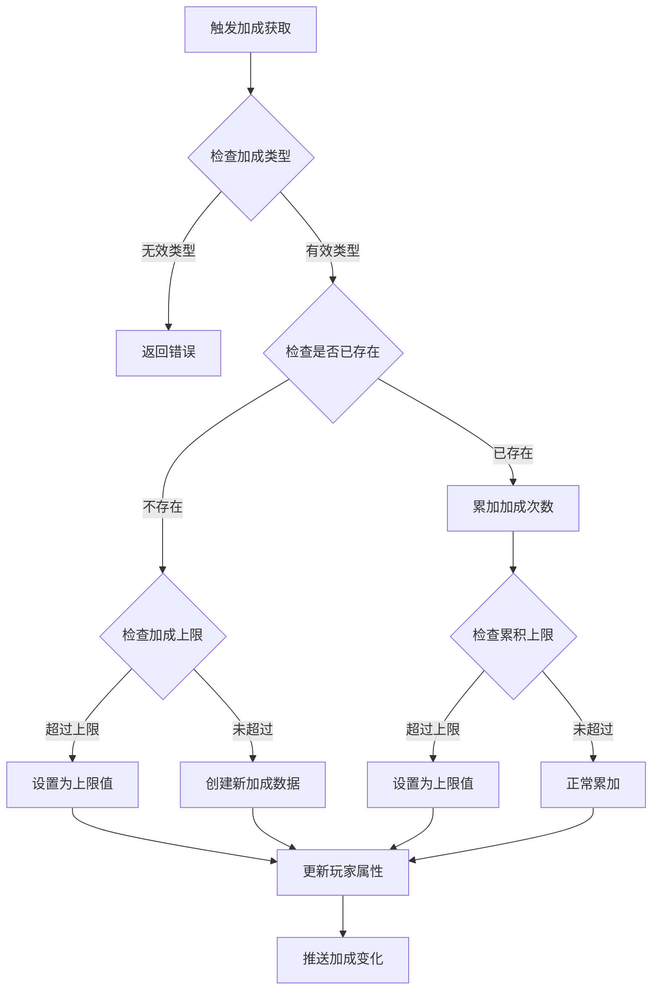
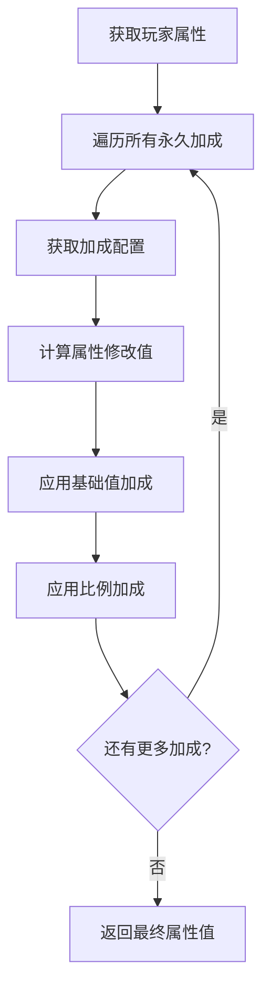
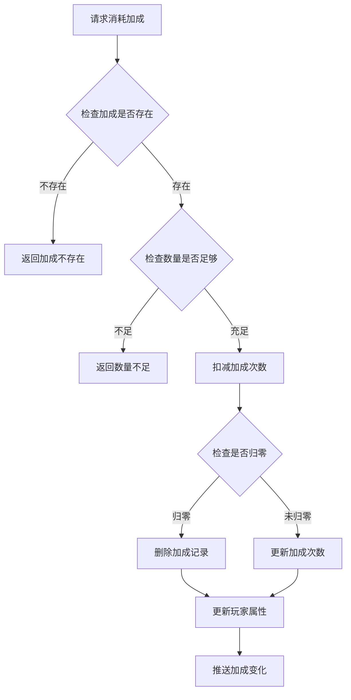

# 永久属性加成模块完整说明

## 一、模块概述

### 1.1 业务背景

永久属性加成模块是 K2C 游戏的核心成长模块之一，负责管理玩家的永久属性加成数据。玩家通过各种途径获得的永久加成会持续生效，为玩家提供长期的属性提升，是玩家实力成长的重要组成部分。

### 1.2 目标用户

- **所有游戏玩家**：每位玩家都可以通过各种途径获得永久加成
- **运营人员**：通过配置不同的加成类型丰富游戏内容

### 1.3 核心价值

1. **永久提升**：获得的加成永久有效，不会消失
2. **累积成长**：相同类型加成可累积，提供持续成长感
3. **属性强化**：直接增强玩家核心属性，提升游戏体验
4. **灵活配置**：支持多种属性类型的加成配置

---

## 二、功能清单

### 2.1 加成管理功能

| 功能名称 | 功能描述 | 用户价值 |
|---------|---------|---------|
| 加成获取 | 通过奖励、任务等途径获得加成 | 提升玩家属性 |
| 加成累积 | 相同类型加成次数累积 | 持续强化效果 |
| 加成上限 | 控制单类型加成最大次数 | 平衡游戏数值 |
| 加成消耗 | 特殊情况下可消耗加成 | 支持特殊玩法 |

### 2.2 属性类型功能

| 功能名称 | 功能描述 | 用户价值 |
|---------|---------|---------|
| 实力加成 | 增加玩家实力值 | 提升战斗力 |
| 产速加成 | 增加资源产出速度 | 加速资源获取 |
| 效率加成 | 增加操作效率 | 优化游戏体验 |
| 容量加成 | 增加存储容量 | 扩大资源上限 |

---

## 三、业务流程详解

### 3.1 获得永久加成流程



**详细步骤说明**：

1. **类型验证**
   - 验证加成ID是否有效
   - 获取加成配置信息

2. **上限检查**
   - 检查配置中的加成次数上限
   - 计算实际可获得的数量

3. **数据处理**
   - 创建新的加成记录或更新已有记录
   - 同步更新玩家属性容器

4. **通知推送**
   - 推送加成变化到客户端
   - 触发属性变化相关事件

### 3.2 属性加成计算流程



**详细步骤说明**：

1. **遍历加成**
   - 获取玩家所有永久加成列表
   - 逐个处理加成效果

2. **属性计算**
   - 根据配置计算基础值加成
   - 根据配置计算比例加成
   - 累加到属性容器

### 3.3 消耗永久加成流程



---

## 四、关键规则

### 4.1 加成规则

1. **上限规则**
   - 每种加成类型有独立的上限配置
   - 上限为0表示无上限限制
   - 超过上限的部分将被丢弃

2. **累积规则**
   - 相同ID的加成会累加次数
   - 不同ID的加成独立计算

3. **属性规则**
   - 加成同时支持固定值和比例值
   - 固定值加成先计算，比例加成后计算

### 4.2 数据规则

1. **持久化规则**
   - 加成数据持久化存储到数据库
   - 玩家登录时自动加载

2. **同步规则**
   - 加成变化时实时推送到客户端
   - 属性变化同步到相关模块

---

## 五、用户故事

### 5.1 新玩家故事

> 作为一名新玩家，我完成了新手引导任务，获得了一个永久实力加成奖励。系统提示我获得了10点实力值的永久提升，我感觉到自己的角色变强了。查看属性面板，我的实力值确实增加了，这让我更有动力继续游戏。

### 5.2 活跃玩家故事

> 作为一名活跃玩家，我每天都参与公会活动。通过公会贡献兑换，我获得了多个永久产速加成。现在我的资源产出速度比刚入会时快了30%，这种持续成长的感觉让我每天都充满期待。

### 5.3 付费玩家故事

> 作为一名付费玩家，我购买了成长基金，可以获得大量永久加成奖励。每解锁一个奖励里程碑，我就能获得多个类型的永久加成。累计下来，我的各项属性都有了显著提升，这些投入让我的游戏体验更好。

---

## 六、示例

### 6.1 获得加成示例

**输入数据**：
- 玩家ID：20001
- 加成ID：1001（实力加成）
- 获得次数：10

**配置数据**：
```json
{
  "id": 1001,
  "add_limit": 100,
  "player_pro_add": {
    "property_type": 1,
    "add_value": 100,
    "add_ratio": 0.01
  }
}
```

**处理结果**：
```
加成ID：1001
加成次数：10
属性变化：
  - 实力值 +1000 (100 × 10)
  - 实力比例 +10% (0.01 × 10)
```

### 6.2 达到上限示例

**初始状态**：
```
加成ID：1001
当前次数：95
上限：100
```

**获得操作**：
- 获得20次加成

**处理结果**：
```
加成ID：1001
最终次数：100（达到上限，超出部分丢弃）
实际获得：5次
属性变化：
  - 实力值 +500（实际获得的次数）
```

### 6.3 属性计算示例

**玩家加成列表**：
```
加成ID：1001（实力）- 次数：50
加成ID：1002（产速）- 次数：30
加成ID：1003（效率）- 次数：20
```

**配置数据**：
```
1001: 实力 +100/次, 比例 +1%/次
1002: 产速 +50/次, 比例 +0.5%/次
1003: 效率 +30/次, 比例 +0.3%/次
```

**最终属性加成**：
```
实力值：+5000, 比例 +50%
产速值：+1500, 比例 +15%
效率值：+600, 比例 +6%
```

---

*文档生成时间: 2026-04-07*
