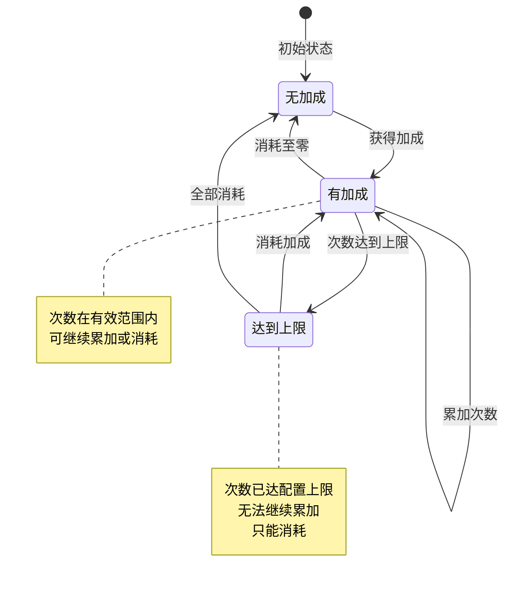
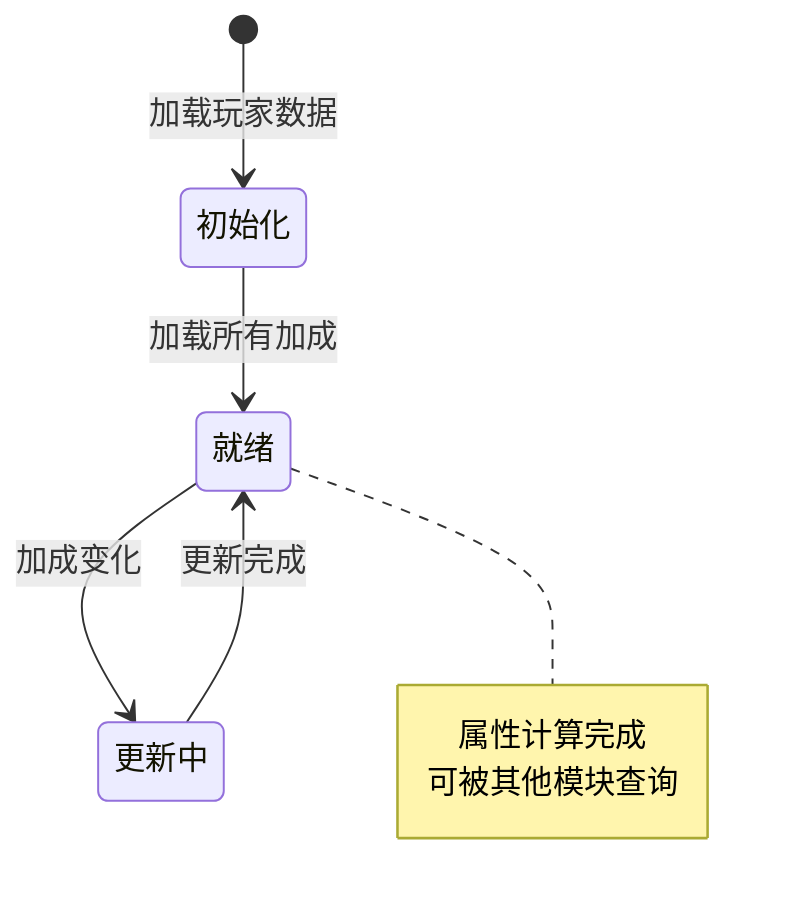
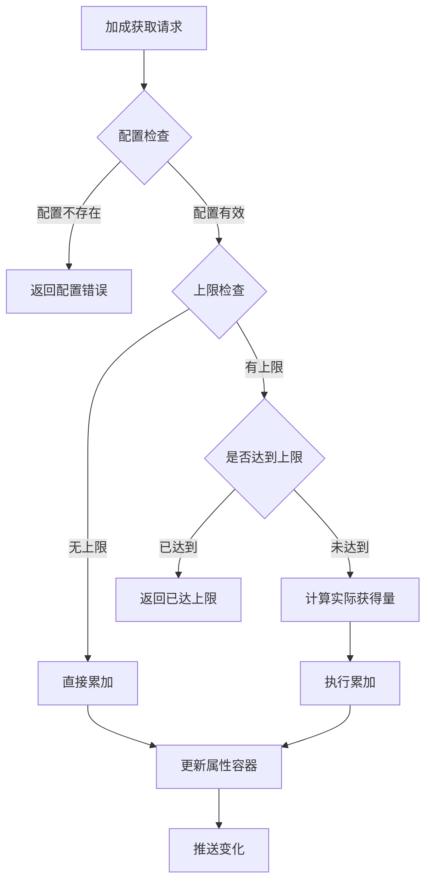

# 永久属性加成模块实现细节

## 一、计算公式

### 1.1 属性加成计算公式

```
最终属性值 = (基础属性 + 固定值加成总和) × (1 + 比例加成总和)
```

**参数说明**：
- `基础属性`：玩家原始属性值
- `固定值加成总和`：所有永久加成的固定值总和
- `比例加成总和`：所有永久加成的比例值总和

**示例计算**：
```
基础实力：1000
永久加成ID 1001：次数50，每次+100固定值，+1%比例
永久加成ID 1002：次数30，每次+50固定值，+0.5%比例

固定值加成总和 = 100 × 50 + 50 × 30 = 5000 + 1500 = 6500
比例加成总和 = 1% × 50 + 0.5% × 30 = 50% + 15% = 65%

最终属性值 = (1000 + 6500) × (1 + 0.65) = 7500 × 1.65 = 12375
```

### 1.2 实际获得次数计算公式

```
实际获得次数 = min(请求次数, 上限 - 当前次数)
```

**参数说明**：
- `请求次数`：尝试获得的次数
- `上限`：配置的加成次数上限（0表示无限制）
- `当前次数`：已有的加成次数

**示例计算**：
```
请求次数：20
上限：100
当前次数：95

实际获得次数 = min(20, 100 - 95) = min(20, 5) = 5
```

### 1.3 属性修改器生成公式

```
属性修改器 = {
    propertyType: config.property_type,
    addValue: config.add_value × count,
    addRatio: config.add_ratio × count
}
```

---

## 二、状态机定义

### 2.1 永久加成状态机



### 2.2 属性容器状态机



---

## 三、数据约束

### 3.1 永久加成配置约束

| 字段名 | 数据类型 | 取值范围 | 必填 | 唯一性 | 说明 |
|--------|----------|----------|------|--------|------|
| id | long | > 0 | 是 | 是 | 加成配置ID |
| add_limit | int | >= 0 | 是 | 否 | 加成次数上限，0表示无限制 |
| player_pro_add | object | 非空 | 是 | 否 | 属性修改器配置 |

### 3.2 永久加成数据约束

| 字段名 | 数据类型 | 取值范围 | 必填 | 唯一性 | 说明 |
|--------|----------|----------|------|--------|------|
| id | BIGINT | > 0 | 是 | 是 | 记录主键 |
| cid | BIGINT | > 0 | 是 | 否 | 玩家CID |
| item_id | BIGINT | > 0 | 是 | 否 | 加成配置ID |
| item_count | INT | >= 0 | 是 | 否 | 加成次数 |

### 3.3 属性修改器约束

| 字段名 | 数据类型 | 取值范围 | 必填 | 说明 |
|--------|----------|----------|------|------|
| property_type | int | 1-10 | 是 | 属性类型枚举值 |
| add_value | long | >= 0 | 是 | 固定值加成 |
| add_ratio | float | 0.0-1.0 | 是 | 比例加成 |

### 3.4 联合约束

| 约束类型 | 约束描述 |
|----------|----------|
| 唯一性约束 | 同一玩家的同一加成ID只能有一条记录 |
| 外键约束 | item_id 必须存在于配置表中 |
| 数值约束 | item_count 不能超过配置的 add_limit |

---

## 四、错误处理策略

### 4.1 永久加成模块错误码

| 错误码 | 错误信息 | 处理策略 | 用户提示 |
|--------|----------|----------|----------|
| 60001 | 加成配置不存在 | 检查配置ID | "加成类型无效" |
| 60002 | 加成已达上限 | 丢弃超出部分 | "加成已达上限" |
| 60003 | 加成数量不足 | 阻止消耗操作 | "加成数量不足" |
| 60004 | 属性类型无效 | 检查配置 | "系统错误" |

### 4.2 加成获取错误处理流程



### 4.3 加成消耗错误处理

| 错误场景 | 处理策略 | 回滚机制 |
|----------|----------|----------|
| 加成不存在 | 返回错误码 | 无需回滚 |
| 数量不足 | 返回错误码 | 无需回滚 |
| 属性更新失败 | 返回错误码 | 回滚加成消耗 |

---

## 五、关键代码示例

### 5.1 获得永久加成伪代码

```csharp
public Result GainForeverAdd(long playerId, long addId, int count, string reason)
{
    // 1. 获取玩家数据
    PlayerInfo player = playerService.GetPlayer(playerId);
    if (player == null)
        return Result.Error(40001, "玩家不存在");

    // 2. 获取加成配置
    ForeverAddConfig config = configService.GetForeverAddConfig(addId);
    if (config == null)
        return Result.Error(60001, "加成配置不存在");

    // 3. 查找已有加成
    ForeverAddInfo existingAdd = foreverAddDao.SelectByPlayerAndId(playerId, addId);

    if (existingAdd == null)
    {
        // 4. 创建新加成
        int actualCount = count;
        if (config.add_limit > 0)
            actualCount = Math.Min(count, config.add_limit);

        ForeverAddInfo newAdd = new ForeverAddInfo {
            PlayerId = playerId,
            ItemId = addId,
            ItemCount = actualCount
        };
        foreverAddDao.Insert(newAdd);

        // 5. 更新属性容器
        NPPlayerPropertyModifier modifier = CreateModifier(config, actualCount);
        player.PropertyContainer.AddModifier(modifier);
    }
    else
    {
        // 6. 累加已有加成
        int newCount = existingAdd.ItemCount + count;
        if (config.add_limit > 0)
            newCount = Math.Min(newCount, config.add_limit);

        int actualAdd = newCount - existingAdd.ItemCount;
        if (actualAdd > 0)
        {
            existingAdd.ItemCount = newCount;
            foreverAddDao.Update(existingAdd);

            // 7. 更新属性容器
            NPPlayerPropertyModifier oldModifier = CreateModifier(config, existingAdd.ItemCount - actualAdd);
            NPPlayerPropertyModifier newModifier = CreateModifier(config, newCount);
            player.PropertyContainer.RemoveModifier(oldModifier);
            player.PropertyContainer.AddModifier(newModifier);
        }
    }

    // 8. 记录日志
    LogForeverAddGain(playerId, addId, count, reason);

    // 9. 推送变化
    PushForeverAddChange(playerId, addId, existingAdd?.ItemCount ?? count);

    return Result.Success();
}
```

### 5.2 消耗永久加成伪代码

```csharp
public Result SpendForeverAdd(long playerId, long addId, int count, string reason)
{
    // 1. 获取玩家数据
    PlayerInfo player = playerService.GetPlayer(playerId);
    if (player == null)
        return Result.Error(40001, "玩家不存在");

    // 2. 获取加成配置
    ForeverAddConfig config = configService.GetForeverAddConfig(addId);
    if (config == null)
        return Result.Error(60001, "加成配置不存在");

    // 3. 查找已有加成
    ForeverAddInfo existingAdd = foreverAddDao.SelectByPlayerAndId(playerId, addId);
    if (existingAdd == null || existingAdd.ItemCount < count)
        return Result.Error(60003, "加成数量不足");

    // 4. 获取加成配置
    ForeverAddConfig config = configService.GetForeverAddConfig(addId);

    // 5. 更新属性容器（先移除旧的）
    NPPlayerPropertyModifier oldModifier = CreateModifier(config, existingAdd.ItemCount);
    player.PropertyContainer.RemoveModifier(oldModifier);

    // 6. 扣减数量
    existingAdd.ItemCount -= count;

    if (existingAdd.ItemCount <= 0)
    {
        // 7. 数量为零，删除记录
        foreverAddDao.Delete(existingAdd);
    }
    else
    {
        // 8. 还有剩余，更新记录
        NPPlayerPropertyModifier newModifier = CreateModifier(config, existingAdd.ItemCount);
        player.PropertyContainer.AddModifier(newModifier);
        foreverAddDao.Update(existingAdd);
    }

    // 9. 记录日志
    LogForeverAddSpend(playerId, addId, count, reason);

    // 10. 推送变化
    PushForeverAddChange(playerId, addId, existingAdd.ItemCount);

    return Result.Success();
}
```

### 5.3 属性修改器创建伪代码

```csharp
private NPPlayerPropertyModifier CreateModifier(ForeverAddConfig config, int count)
{
    return new NPPlayerPropertyModifier
    {
        PropertyType = config.player_pro_add.property_type,
        AddValue = config.player_pro_add.add_value * count,
        AddRatio = config.player_pro_add.add_ratio * count
    };
}
```

### 5.4 查询玩家总加成伪代码

```csharp
public Dictionary<int, long> GetTotalAddValues(long playerId)
{
    Dictionary<int, long> result = new Dictionary<int, long>();

    List<ForeverAddInfo> addList = foreverAddDao.SelectByPlayer(playerId);

    foreach (ForeverAddInfo add in addList)
    {
        ForeverAddConfig config = configService.GetForeverAddConfig(add.ItemId);
        if (config == null) continue;

        int propType = config.player_pro_add.property_type;
        long addValue = config.player_pro_add.add_value * add.ItemCount;

        if (!result.ContainsKey(propType))
            result[propType] = 0;

        result[propType] += addValue;
    }

    return result;
}
```

---

## 六、跨模块依赖

### 6.1 依赖模块

| 模块名称 | 依赖类型 | 依赖说明 |
|----------|----------|----------|
| Player模块 | 强依赖 | 需要获取玩家数据和属性容器 |
| Config模块 | 强依赖 | 需要读取加成配置表 |
| Item模块 | 弱依赖 | 加成可作为物品类型发放 |
| Log模块 | 弱依赖 | 记录加成获取/消耗日志 |

### 6.2 被依赖关系

| 模块名称 | 被依赖方式 | 说明 |
|----------|------------|------|
| 战斗模块 | 属性查询 | 计算战斗属性时查询加成 |
| 任务模块 | 奖励发放 | 作为任务奖励发放 |
| 商店模块 | 购买奖励 | 作为商品奖励发放 |
| 活动模块 | 活动奖励 | 作为活动奖励发放 |

### 6.3 接口定义

```csharp
// 供其他模块调用的接口
public interface IForeverAddService
{
    // 获得加成
    Result GainForeverAdd(long playerId, long addId, int count, string reason);

    // 消耗加成
    Result SpendForeverAdd(long playerId, long addId, int count, string reason);

    // 查询加成次数
    int GetAddCount(long playerId, long addId);

    // 查询所有加成
    List<ForeverAddInfo> GetAllAdds(long playerId);
}
```

---

*文档生成时间: 2026-04-07*
