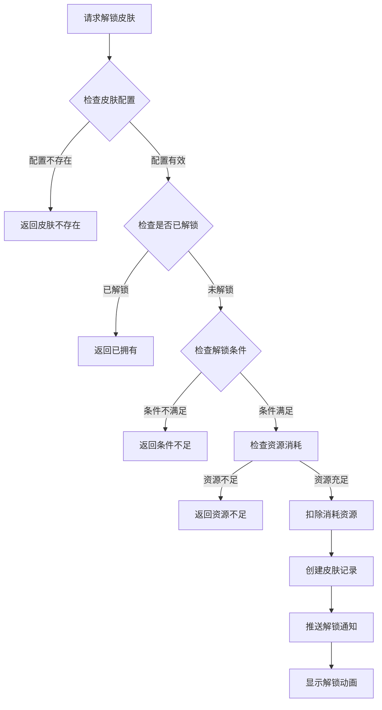
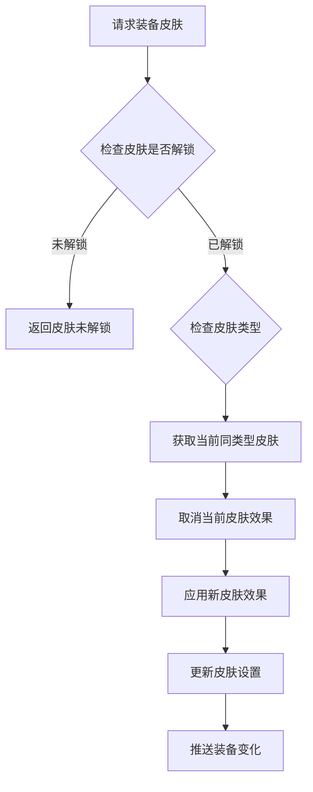
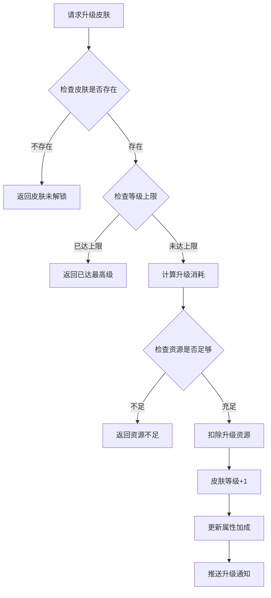
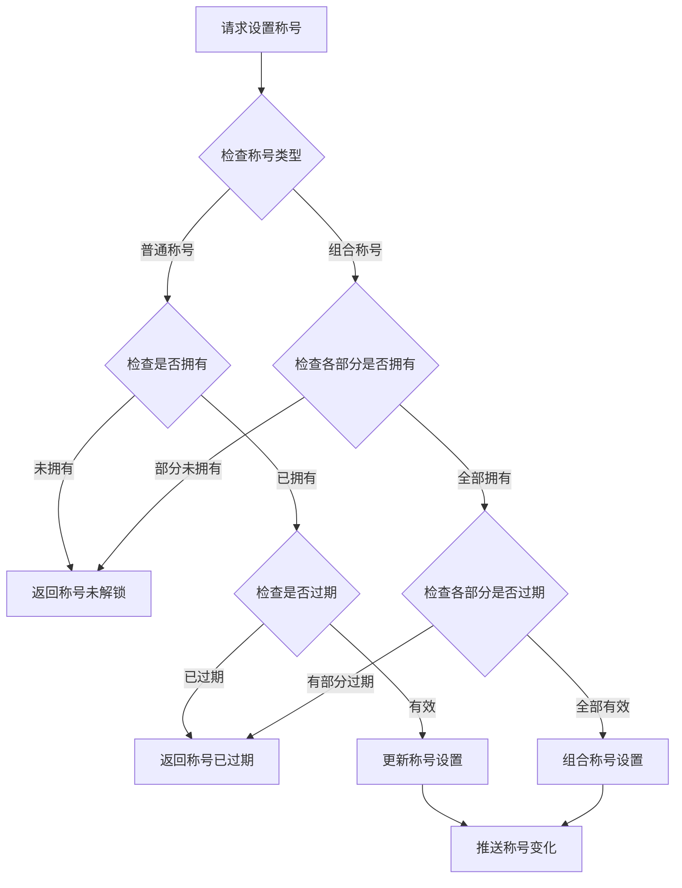

# 玩家皮肤模块完整说明

## 一、模块概述

### 1.1 业务背景

玩家皮肤模块是 K2C 游戏的个性化装扮系统，负责管理玩家的皮肤、称号、头像框等外观装饰。玩家可以通过解锁和装备各种皮肤来展示个性，同时部分皮肤还提供属性加成，兼具美观与实用性。

### 1.2 目标用户

- **所有游戏玩家**：每位玩家都可以获得和使用皮肤
- **付费玩家**：通过付费获得稀有限定皮肤
- **运营人员**：配置皮肤解锁条件和活动

### 1.3 核心价值

1. **个性化展示**：丰富的皮肤选择让玩家展示独特个性
2. **成就系统**：部分皮肤作为成就奖励，增加游戏目标感
3. **属性加成**：皮肤提供额外属性，增强玩家实力
4. **商业价值**：付费皮肤是重要的收入来源

---

## 二、功能清单

### 2.1 皮肤管理功能

| 功能名称 | 功能描述 | 用户价值 |
|---------|---------|---------|
| 皮肤解锁 | 通过条件解锁皮肤 | 获得新皮肤 |
| 皮肤装备 | 设置当前使用的皮肤 | 展示个性化外观 |
| 皮肤卸下 | 取消当前皮肤设置 | 恢复默认外观 |
| 皮肤升级 | 提升皮肤等级 | 增强属性加成 |

### 2.2 皮肤类型功能

| 功能名称 | 功能描述 | 用户价值 |
|---------|---------|---------|
| 角色皮肤 | 更改角色外观 | 个性化角色形象 |
| 房间皮肤 | 更改房间装饰 | 个性化游戏空间 |
| 场景皮肤 | 更改场景背景 | 个性化游戏环境 |

### 2.3 称号管理功能

| 功能名称 | 功能描述 | 用户价值 |
|---------|---------|---------|
| 普通称号 | 单一称号展示 | 展示成就和身份 |
| 组合称号 | 三部分自由组合 | 创造独特称号组合 |
| 称号展示 | 设置是否对他人展示 | 控制隐私设置 |

---

## 三、业务流程详解

### 3.1 皮肤解锁流程



**详细步骤说明**：

1. **配置验证**
   - 验证皮肤ID是否有效
   - 获取皮肤配置信息（品质、类型、解锁条件）

2. **状态检查**
   - 检查玩家是否已解锁该皮肤
   - 避免重复解锁

3. **条件验证**
   - 检查解锁条件（等级、成就、VIP等）
   - 检查资源消耗（钻石、道具等）

4. **执行解锁**
   - 扣除消耗资源
   - 创建皮肤记录
   - 推送通知到客户端

### 3.2 皮肤装备流程



**详细步骤说明**：

1. **状态验证**
   - 检查皮肤是否已解锁
   - 检查皮肤类型是否匹配

2. **切换处理**
   - 取消当前同类型皮肤的属性加成
   - 应用新皮肤的属性加成

3. **数据更新**
   - 更新玩家的皮肤设置
   - 推送变化到客户端

### 3.3 皮肤升级流程



### 3.4 称号设置流程



---

## 四、关键规则

### 4.1 皮肤规则

1. **解锁规则**
   - 部分皮肤有解锁条件（等级、成就、活动）
   - 部分皮肤需要消耗资源解锁
   - 限定皮肤有获取时间限制

2. **装备规则**
   - 同类型皮肤只能装备一个
   - 卸下皮肤恢复默认外观
   - 皮肤属性加成可叠加

3. **升级规则**
   - 皮肤可升级提升属性
   - 升级消耗随等级递增
   - 每个皮肤有等级上限

### 4.2 称号规则

1. **普通称号规则**
   - 需要先解锁才能使用
   - 部分称号有有效期限制
   - 同一时间只能展示一个称号

2. **组合称号规则**
   - 由前缀、特效、背景三部分组成
   - 三部分需要分别解锁
   - 可以自由组合三部分

---

## 五、用户故事

### 5.1 新玩家故事

> 作为一名新玩家，我完成了新手任务，获得了一个新手专属皮肤。我打开皮肤界面，看到这个皮肤有简单的属性加成。我点击装备，我的角色外观立即改变了，看起来更加酷炫。这让我对继续游戏充满了期待。

### 5.2 活跃玩家故事

> 作为一名活跃玩家，我参与了许多活动，收集了不少皮肤。最近活动送了一个可升级的限定皮肤，我每天努力收集升级材料。今天终于把皮肤升到了5级，属性加成非常可观。我的朋友看到我的新皮肤都很羡慕。

### 5.3 付费玩家故事

> 作为一名付费玩家，我购买了赛季通行证，可以获得赛季限定皮肤。我还购买了皮肤礼包，里面有几个高品质皮肤。这些皮肤不仅外观精美，属性加成也很强。我在公会里展示我的皮肤收藏，大家都觉得很酷。

---

## 六、示例

### 6.1 皮肤解锁示例

**输入数据**：
- 玩家ID：20001
- 皮肤ID：1001（角色皮肤-烈焰战甲）
- 皮肤类型：ROLE

**配置数据**：
```json
{
  "skin_id": 1001,
  "skin_name": "烈焰战甲",
  "skin_type": 1,
  "quality": 4,
  "unlock_condition": {
    "level": 30
  },
  "upgrade_cost": [
    {"itemId": 5001, "count": 10},
    {"itemId": 5002, "count": 5}
  ],
  "max_level": 10
}
```

**解锁结果**：
```
皮肤ID：1001
皮肤名称：烈焰战甲
皮肤等级：1
解锁时间：2026-04-07 10:00:00
```

### 6.2 皮肤升级示例

**初始状态**：
```
皮肤ID：1001
当前等级：3
属性加成：实力+300
```

**升级操作**：
- 消耗材料：强化石x30、金币x5000

**升级结果**：
```
皮肤ID：1001
新等级：4
新属性加成：实力+400
```

### 6.3 组合称号示例

**玩家拥有的组合称号部分**：
```
前缀ID：101 - "传说之"
特效ID：201 - "闪耀"特效
背景ID：301 - 红色底框
```

**组合设置**：
```
前缀：传说之
后缀：（由其他系统提供）
特效：闪耀
背景：红色

最终称号显示：【传说之】xxx【闪耀】（红色背景）
```

---

*文档生成时间: 2026-04-07*
