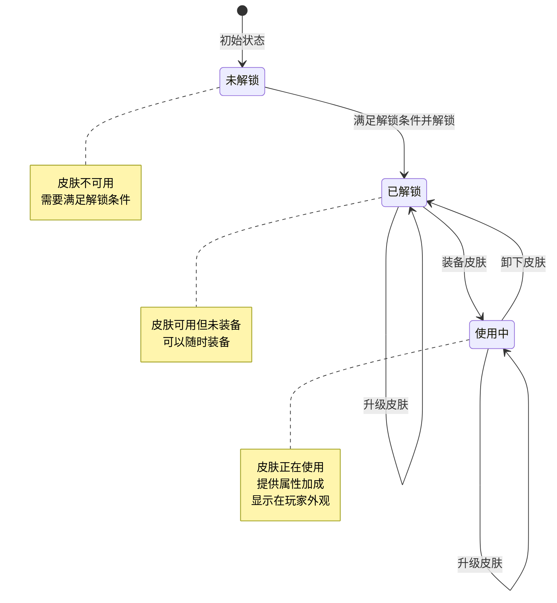
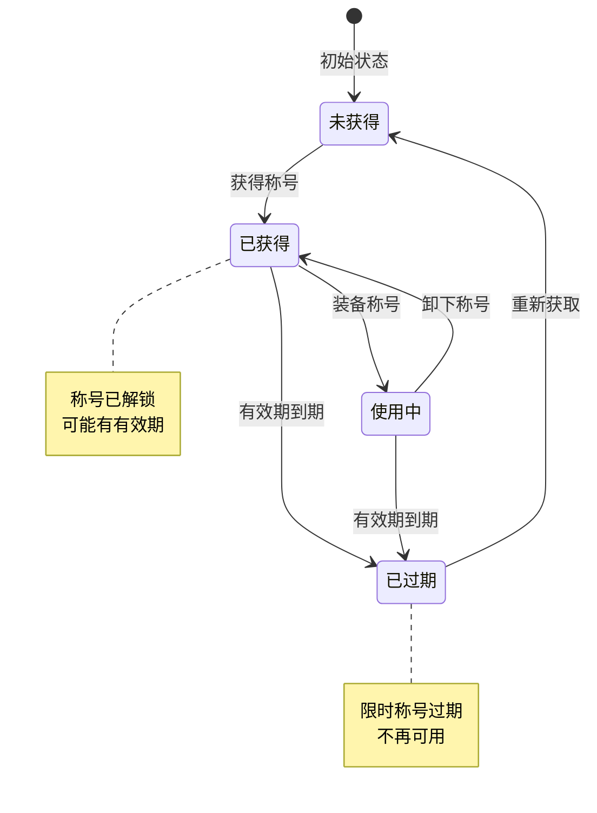
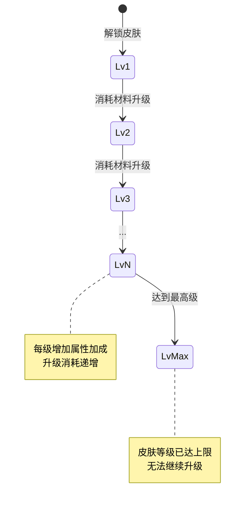
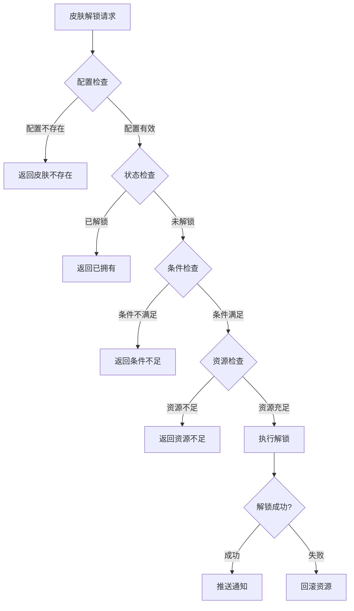

# 玩家皮肤模块实现细节

## 一、计算公式

### 1.1 皮肤属性加成计算公式

```
皮肤属性加成 = 基础属性 × (1 + 等级 × 成长系数)
```

**参数说明**：
- `基础属性`：皮肤1级时的属性加成
- `等级`：皮肤当前等级
- `成长系数`：配置的每级成长比例

**示例计算**：
```
皮肤基础实力加成：100
当前等级：5
成长系数：0.2

皮肤属性加成 = 100 × (1 + 5 × 0.2) = 100 × 2 = 200
```

### 1.2 升级消耗计算公式

```
升级消耗 = 基础消耗 × (1 + 等级 × 消耗系数)^指数
```

**参数说明**：
- `基础消耗`：1升2级的消耗
- `等级`：当前等级
- `消耗系数`：每级消耗增长率
- `指数`：消耗增长指数

**示例计算**：
```
基础消耗：100钻石
当前等级：4（要升到5级）
消耗系数：0.5
指数：1.5

升级消耗 = 100 × (1 + 4 × 0.5)^1.5 = 100 × 3^1.5 = 100 × 5.2 ≈ 520钻石
```

### 1.3 皮肤总战力计算公式

```
皮肤总战力 = Σ(每个已装备皮肤的战力值)
```

---

## 二、状态机定义

### 2.1 皮肤状态机



### 2.2 称号状态机



### 2.3 皮肤等级状态机



---

## 三、数据约束

### 3.1 皮肤配置约束

| 字段名 | 数据类型 | 取值范围 | 必填 | 唯一性 | 说明 |
|--------|----------|----------|------|--------|------|
| skin_id | int | > 0 | 是 | 是 | 皮肤ID |
| skin_name | string | 1-50字符 | 是 | 否 | 皮肤名称 |
| skin_type | int | 1-3 | 是 | 否 | 皮肤类型 |
| quality | int | 1-5 | 是 | 否 | 品质等级 |
| max_level | int | 1-10 | 是 | 否 | 最大等级 |

### 3.2 玩家皮肤数据约束

| 字段名 | 数据类型 | 取值范围 | 必填 | 唯一性 | 说明 |
|--------|----------|----------|------|--------|------|
| id | BIGINT | > 0 | 是 | 是 | 记录主键 |
| player_id | BIGINT | > 0 | 是 | 否 | 玩家ID |
| skin_id | INT | > 0 | 是 | 否 | 皮肤ID |
| skin_level | INT | 1-max_level | 是 | 否 | 皮肤等级 |
| unlock_time | DATETIME | - | 是 | 否 | 解锁时间 |

### 3.3 称号配置约束

| 字段名 | 数据类型 | 取值范围 | 必填 | 说明 |
|--------|----------|----------|------|------|
| title_id | long | > 0 | 是 | 称号ID |
| title_name | string | 1-20字符 | 是 | 称号名称 |
| title_type | int | 1-2 | 是 | 类型：1普通，2组合 |
| expire_type | int | 0-2 | 是 | 过期类型：0永久，1限时，2条件 |

### 3.4 玩家称号数据约束

| 字段名 | 数据类型 | 取值范围 | 必填 | 说明 |
|--------|----------|----------|------|------|
| id | BIGINT | > 0 | 是 | 记录主键 |
| player_id | BIGINT | > 0 | 是 | 玩家ID |
| title_id | BIGINT | > 0 | 是 | 称号ID |
| title_type | INT | 1-2 | 是 | 称号类型 |
| expire_time | DATETIME | - | 否 | 过期时间（NULL表示永久） |
| unlock_time | DATETIME | - | 是 | 解锁时间 |
| viewed | TINYINT | 0-1 | 是 | 是否已查看 |

### 3.5 组合称号约束

| 约束类型 | 约束描述 |
|----------|----------|
| 唯一性约束 | 同一玩家的同一皮肤/称号只能有一条记录 |
| 外键约束 | skin_id 必须存在于皮肤配置表 |
| 范围约束 | skin_level 不能超过配置的 max_level |

---

## 四、错误处理策略

### 4.1 皮肤模块错误码

| 错误码 | 错误信息 | 处理策略 | 用户提示 |
|--------|----------|----------|----------|
| 61001 | 皮肤配置不存在 | 检查皮肤ID | "皮肤不存在" |
| 61002 | 皮肤已解锁 | 检查皮肤状态 | "您已拥有该皮肤" |
| 61003 | 皮肤未解锁 | 检查皮肤状态 | "您还未解锁该皮肤" |
| 61004 | 解锁条件不满足 | 检查解锁条件 | "解锁条件不满足" |
| 61005 | 皮肤已达最高级 | 检查等级上限 | "皮肤已达最高等级" |
| 61006 | 称号已过期 | 检查过期时间 | "称号已过期" |
| 61007 | 称号未解锁 | 检查称号状态 | "您还未获得该称号" |

### 4.2 皮肤解锁错误处理流程



### 4.3 称号过期检查策略

| 检查时机 | 处理方式 | 说明 |
|----------|----------|------|
| 登录时 | 遍历检查所有称号 | 清理过期称号 |
| 装备时 | 检查单个称号 | 阻止装备过期称号 |
| 定时检查 | 每小时检查一次 | 自动移除过期称号 |

---

## 五、关键代码示例

### 5.1 解锁皮肤伪代码

```csharp
public Result UnlockSkin(long playerId, int skinId)
{
    // 1. 获取皮肤配置
    PlayerSkinConfig config = skinConfigDao.getById(skinId);
    if (config == null)
        return Result.Error(61001, "皮肤不存在");

    // 2. 检查是否已解锁
    PlayerSkin existingSkin = skinDao.selectByPlayerAndSkin(playerId, skinId);
    if (existingSkin != null)
        return Result.Error(61002, "皮肤已解锁");

    // 3. 检查解锁条件
    if (!checkUnlockCondition(playerId, config.unlock_condition))
        return Result.Error(61004, "解锁条件不满足");

    // 4. 检查并扣除消耗
    if (config.cost_list != null && config.cost_list.Count > 0)
    {
        if (!itemService.checkItems(playerId, config.cost_list))
            return Result.Error(40005, "资源不足");

        itemService.consumeItems(playerId, config.cost_list, "解锁皮肤");
    }

    // 5. 创建皮肤记录
    PlayerSkin skin = new PlayerSkin
    {
        PlayerId = playerId,
        SkinId = skinId,
        SkinLevel = 1,
        UnlockTime = DateTime.Now
    };
    skinDao.insert(skin);

    // 6. 应用属性加成（如果有）
    ApplySkinBonus(playerId, skin);

    // 7. 推送通知
    PushSkinUnlock(playerId, skinId);

    return Result.Success(skin);
}
```

### 5.2 装备皮肤伪代码

```csharp
public Result SetCurrentSkin(long playerId, int skinId, int skinType)
{
    // 1. 获取皮肤配置
    PlayerSkinConfig config = skinConfigDao.getById(skinId);
    if (config == null)
        return Result.Error(61001, "皮肤不存在");

    // 2. 检查皮肤类型
    if (config.skin_type != skinType)
        return Result.Error(61001, "皮肤类型不匹配");

    // 3. 检查是否已解锁
    PlayerSkin skin = skinDao.selectByPlayerAndSkin(playerId, skinId);
    if (skin == null)
        return Result.Error(61003, "皮肤未解锁");

    // 4. 获取当前装备的同类型皮肤
    int currentSkinId = playerDao.getCurrentSkinId(playerId, skinType);

    // 5. 移除当前皮肤的属性加成
    if (currentSkinId > 0)
    {
        RemoveSkinBonus(playerId, currentSkinId);
    }

    // 6. 应用新皮肤的属性加成
    ApplySkinBonus(playerId, skinId);

    // 7. 更新皮肤设置
    playerDao.setCurrentSkinId(playerId, skinType, skinId);

    // 8. 推送变化
    PushSkinChange(playerId, skinId, skinType);

    return Result.Success();
}
```

### 5.3 升级皮肤伪代码

```csharp
public Result UpgradeSkin(long playerId, int skinId)
{
    // 1. 获取皮肤信息
    PlayerSkin skin = skinDao.selectByPlayerAndSkin(playerId, skinId);
    if (skin == null)
        return Result.Error(61003, "皮肤未解锁");

    // 2. 获取皮肤配置
    PlayerSkinConfig config = skinConfigDao.getById(skinId);

    // 3. 检查等级上限
    if (skin.SkinLevel >= config.max_level)
        return Result.Error(61005, "皮肤已达最高级");

    // 4. 计算升级消耗
    List<ItemInfo> costList = CalculateUpgradeCost(config, skin.SkinLevel);

    // 5. 检查并扣除资源
    if (!itemService.checkItems(playerId, costList))
        return Result.Error(40005, "资源不足");

    itemService.consumeItems(playerId, costList, "升级皮肤");

    // 6. 更新皮肤等级
    skin.SkinLevel++;
    skinDao.updateById(skin);

    // 7. 更新属性加成
    UpdateSkinBonus(playerId, skinId, skin.SkinLevel);

    // 8. 推送通知
    PushSkinUpgrade(playerId, skinId, skin.SkinLevel);

    return Result.Success(skin);
}
```

### 5.4 设置称号伪代码

```csharp
public Result SetTitle(long playerId, long titleId)
{
    // 1. 获取称号信息
    PlayerTitle title = titleDao.selectByPlayerAndTitle(playerId, titleId);
    if (title == null)
        return Result.Error(61007, "称号未解锁");

    // 2. 检查是否过期
    if (title.ExpireTime.HasValue && title.ExpireTime.Value < DateTime.Now)
    {
        // 移除过期称号
        titleDao.delete(title);
        return Result.Error(61006, "称号已过期");
    }

    // 3. 更新当前称号
    PlayerBase player = playerDao.selectById(playerId);
    player.CurTitleId = titleId;
    playerDao.updateById(player);

    // 4. 推送变化
    PushTitleChange(playerId, titleId);

    return Result.Success();
}
```

### 5.5 计算升级消耗伪代码

```csharp
private List<ItemInfo> CalculateUpgradeCost(PlayerSkinConfig config, int currentLevel)
{
    List<ItemInfo> costList = new List<ItemInfo>();

    foreach (UpgradeCost baseCost in config.upgrade_cost)
    {
        // 计算升级消耗（指数增长）
        long count = (long)(baseCost.count * Math.Pow(1 + currentLevel * 0.5, 1.5));

        costList.Add(new ItemInfo
        {
            ItemId = baseCost.itemId,
            Count = count
        });
    }

    return costList;
}
```

---

## 六、跨模块依赖

### 6.1 依赖模块

| 模块名称 | 依赖类型 | 依赖说明 |
|----------|----------|----------|
| Player模块 | 强依赖 | 需要获取玩家数据和属性容器 |
| Item模块 | 强依赖 | 解锁和升级需要消耗物品 |
| Config模块 | 强依赖 | 需要读取皮肤配置表 |
| Resource模块 | 弱依赖 | 可能需要消耗货币资源 |

### 6.2 被依赖关系

| 模块名称 | 被依赖方式 | 说明 |
|----------|------------|------|
| 战斗模块 | 属性查询 | 战斗中应用皮肤属性加成 |
| 社交模块 | 外观展示 | 显示玩家皮肤和称号 |
| 商店模块 | 购买奖励 | 作为商品出售 |
| 活动模块 | 活动奖励 | 作为活动奖励发放 |

### 6.3 接口定义

```csharp
// 供其他模块调用的接口
public interface IPlayerSkinService
{
    // 解锁皮肤
    Result UnlockSkin(long playerId, int skinId);

    // 装备皮肤
    Result SetCurrentSkin(long playerId, int skinId, int skinType);

    // 卸下皮肤
    Result UnsetCurrentSkin(long playerId, int skinType);

    // 升级皮肤
    Result UpgradeSkin(long playerId, int skinId);

    // 获取玩家所有皮肤
    List<PlayerSkin> GetAllSkins(long playerId);

    // 获取当前装备皮肤
    int GetCurrentSkinId(long playerId, int skinType);

    // 设置称号
    Result SetTitle(long playerId, long titleId);

    // 设置组合称号
    Result SetComboTitle(long playerId, long preId, long sfxId, long bgId);
}
```

---

*文档生成时间: 2026-04-07*
