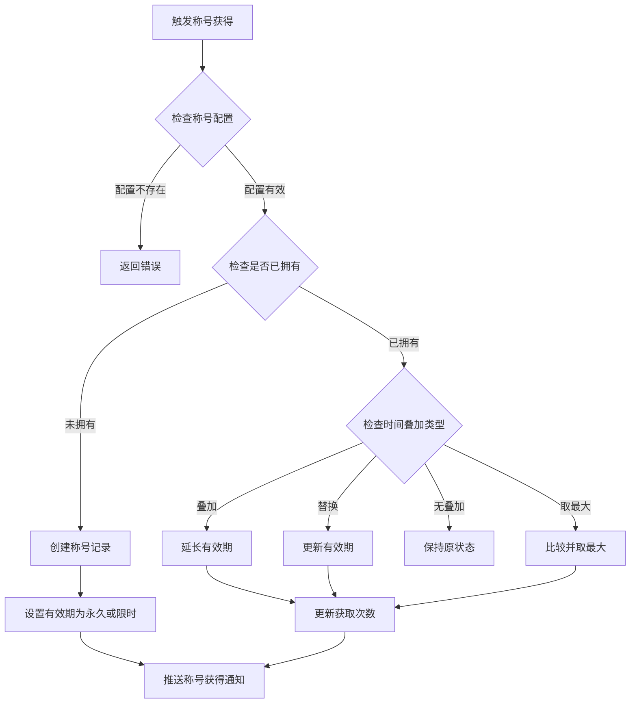
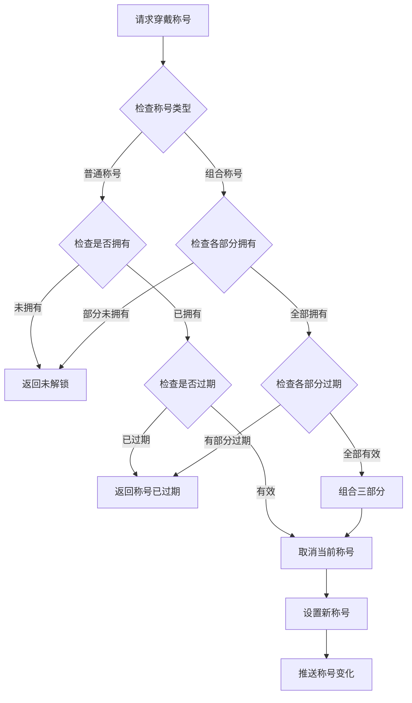
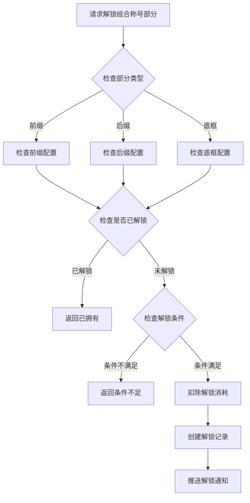
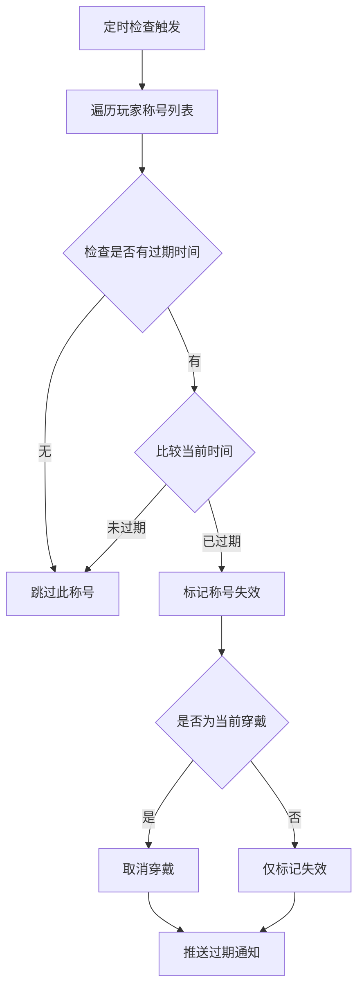

# 玩家称号模块完整说明

## 一、模块概述

### 1.1 业务背景

玩家称号模块是 K2C 游戏的成就展示系统，负责管理玩家的称号数据。玩家通过各种途径获得的称号可以展示给其他玩家，展示自己的游戏成就和身份地位。系统支持普通称号和组合称号两种类型，满足玩家个性化展示需求。

### 1.2 目标用户

- **所有游戏玩家**：每位玩家都可以获得和展示称号
- **成就型玩家**：追求各种称号的收集和展示
- **社交型玩家**：通过称号展示自己的身份和成就

### 1.3 核心价值

1. **成就展示**：称号是玩家游戏成就的直观展示
2. **荣誉标识**：稀有称号彰显玩家身份和实力
3. **个性化**：组合称号支持自由搭配，创造独特称号
4. **激励驱动**：获取称号成为玩家追求的目标

---

## 二、功能清单

### 2.1 普通称号功能

| 功能名称 | 功能描述 | 用户价值 |
|---------|---------|---------|
| 称号获得 | 通过成就、活动等获得称号 | 获得荣誉标识 |
| 称号穿戴 | 设置当前展示的称号 | 展示成就 |
| 称号查看 | 标记称号为已查看 | 管理红点提示 |
| 称号过期 | 限时称号到期自动失效 | 控制时效性 |

### 2.2 组合称号功能

| 功能名称 | 功能描述 | 用户价值 |
|---------|---------|---------|
| 前缀解锁 | 解锁组合称号前缀部分 | 自由组合称号 |
| 后缀解锁 | 解锁组合称号后缀部分 | 自由组合称号 |
| 底框解锁 | 解锁组合称号底框部分 | 自由组合称号 |
| 组合穿戴 | 将三部分组合穿戴 | 创造独特称号 |

### 2.3 展示设置功能

| 功能名称 | 功能描述 | 用户价值 |
|---------|---------|---------|
| 展示开关 | 设置是否对其他玩家展示 | 控制隐私 |
| 称号预览 | 预览称号展示效果 | 选择合适的称号 |

---

## 三、业务流程详解

### 3.1 获得普通称号流程



**详细步骤说明**：

1. **配置验证**
   - 验证称号ID是否有效
   - 获取称号配置信息（类型、有效期等）

2. **状态检查**
   - 检查玩家是否已拥有该称号
   - 根据时间叠加类型处理有效期

3. **时间叠加处理**
   - ADD：新时间叠加到现有效期
   - REPLACE：用新时间替换现有效期
   - MAX：取现有效期和新时间的最大值
   - NONE：保持现有效期不变

4. **数据更新**
   - 更新获取次数和最后获取时间
   - 标记为未查看状态

### 3.2 穿戴称号流程



**详细步骤说明**：

1. **类型判断**
   - 区分普通称号和组合称号
   - 组合称号需要分别检查三部分

2. **状态验证**
   - 检查称号是否已解锁
   - 检查称号是否过期（限时称号）

3. **穿戴处理**
   - 取消当前穿戴的称号
   - 设置新的称号
   - 更新展示状态

### 3.3 组合称号解锁流程



### 3.4 称号过期处理流程



---

## 四、关键规则

### 4.1 普通称号规则

1. **有效期规则**
   - 永久称号：expireTimeS为0或负数
   - 限时称号：有明确的过期时间戳
   - 时间叠加：根据配置决定叠加方式

2. **穿戴规则**
   - 同一时间只能穿戴一个称号
   - 过期称号无法穿戴
   - 可设置是否对他人展示

### 4.2 组合称号规则

1. **组成规则**
   - 由前缀、后缀、底框三部分组成
   - 三部分需要分别解锁
   - 可自由组合已解锁的各部分

2. **展示规则**
   - 组合称号优先级高于普通称号
   - 各部分可单独设置已查看状态

### 4.3 红点规则

1. **红点触发**
   - 获得新称号时显示红点
   - 设置已查看后红点消失

---

## 五、用户故事

### 5.1 新玩家故事

> 作为一名新玩家，我刚完成新手引导，系统奖励了我一个"初出茅庐"称号。虽然这个称号很普通，但这是我在游戏中的第一个荣誉标识。我点击穿戴，称号显示在我的角色名字上方，感觉很有成就感。

### 5.2 活跃玩家故事

> 作为一名活跃玩家，我参与了很多活动，收集了不少称号。最近我解锁了组合称号的前缀"传说之"和底框"金色边框"，再加上之前的特效"闪耀"，组合起来非常炫酷。其他玩家看到我的称号都来问我怎么获得的。

### 5.3 成就型玩家故事

> 作为一名追求成就的玩家，我努力完成了各种挑战。终于获得了稀有的"巅峰王者"称号，这是服务器前100名才能拥有的限时称号。我立即穿戴展示，向所有人证明我的实力。一个月后称号过期了，但这激励我继续努力再次获得。

---

## 六、示例

### 6.1 获得普通称号示例

**输入数据**：
- 玩家ID：20001
- 称号ID：1001（新手冒险者）
- 有效期：永久

**配置数据**：
```json
{
  "id": 1001,
  "title_name": "新手冒险者",
  "add_type": "NONE",
  "expire_type": 0
}
```

**获得结果**：
```
称号ID：1001
称号名称：新手冒险者
过期时间：永久
获得时间：2026-04-07 10:00:00
获取次数：1
已查看：否
```

### 6.2 限时称号时间叠加示例

**初始状态**：
```
称号ID：2001（荣耀战神）
过期时间：2026-04-10 10:00:00
当前时间：2026-04-07 10:00:00
```

**再次获得**：
- 新获得7天有效期
- 叠加类型：ADD

**处理结果**：
```
新过期时间：2026-04-17 10:00:00（原时间+7天）
获取次数：2
```

### 6.3 组合称号示例

**玩家拥有的组合称号部分**：
```
前缀列表：
  - 101: "传说之"
  - 102: "永恒之"

后缀列表：
  - 201: "闪耀"特效
  - 202: "烈焰"特效

底框列表：
  - 301: 金色边框
  - 302: 红色边框
```

**组合穿戴**：
```
选择前缀：101 - "传说之"
选择后缀：201 - "闪耀"
选择底框：301 - 金色边框

最终展示：
【传说之】玩家名称【闪耀】（金色边框）
```

---

*文档生成时间: 2026-04-07*
