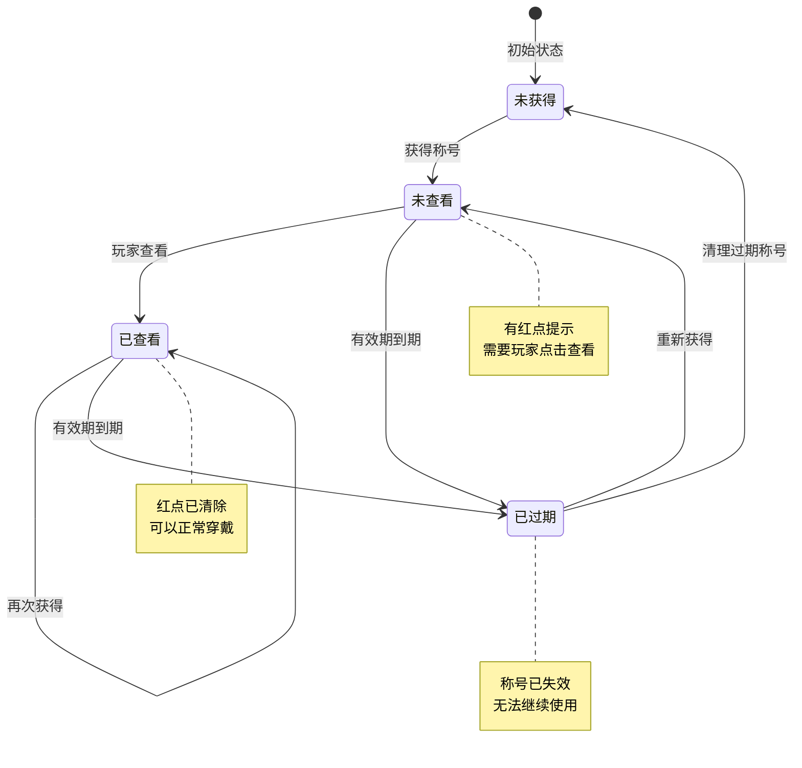
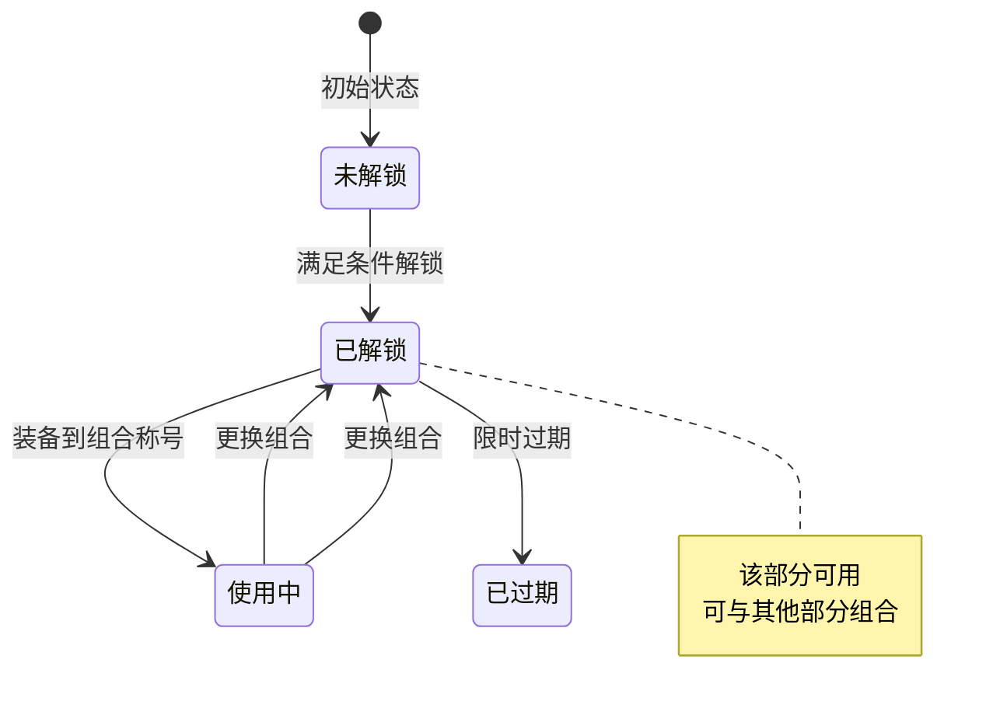
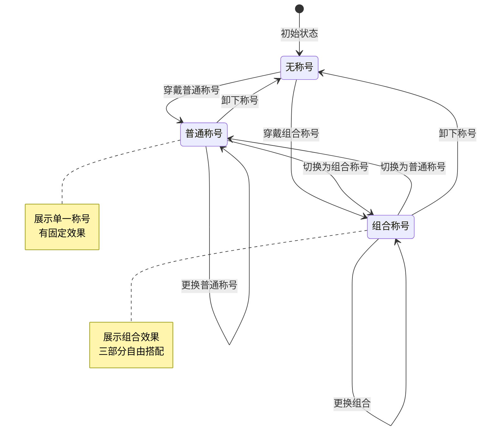
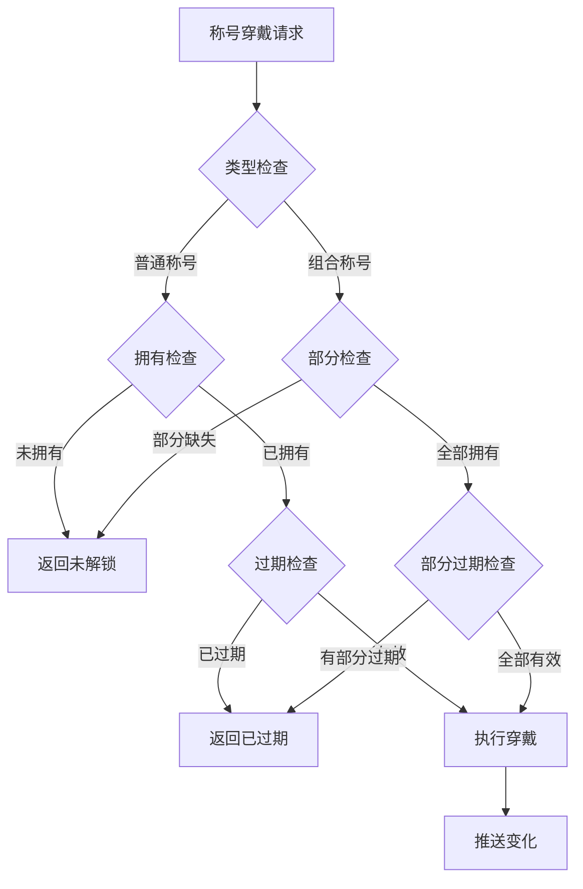

# 玩家称号模块实现细节

## 一、计算公式

### 1.1 时间叠加计算公式

```
新过期时间 = 根据叠加类型计算
```

**叠加类型说明**：
- `NONE`：保持原有过期时间不变
- `ADD`：新过期时间 = 原过期时间 + 新增时长
- `REPLACE`：新过期时间 = 当前时间 + 新增时长
- `MAX`：新过期时间 = max(原过期时间, 当前时间 + 新增时长)

**示例计算**：
```
原过期时间：2026-04-10 10:00:00
当前时间：2026-04-07 10:00:00
新增时长：7天

NONE类型：新过期时间 = 2026-04-10 10:00:00（不变）
ADD类型：新过期时间 = 2026-04-17 10:00:00（原时间+7天）
REPLACE类型：新过期时间 = 2026-04-14 10:00:00（当前时间+7天）
MAX类型：新过期时间 = max(4月10日, 4月14日) = 2026-04-14 10:00:00
```

### 1.2 称号有效判断公式

```
称号有效 = (expireTimeS <= 0) OR (expireTimeS > 当前时间戳)
```

**参数说明**：
- `expireTimeS`：过期时间戳（秒级）
- `expireTimeS <= 0`：表示永久称号
- `expireTimeS > 当前时间戳`：限时称号未过期

### 1.3 组合称号展示公式

```
展示文本 = [前缀文本] + 玩家名称 + [后缀文本]
展示样式 = 底框样式
```

---

## 二、状态机定义

### 2.1 普通称号状态机



### 2.2 组合称号状态机



### 2.3 当前穿戴称号状态机



---

## 三、数据约束

### 3.1 普通称号配置约束

| 字段名 | 数据类型 | 取值范围 | 必填 | 唯一性 | 说明 |
|--------|----------|----------|------|--------|------|
| id | long | > 0 | 是 | 是 | 称号配置ID |
| title_name | string | 1-20字符 | 是 | 否 | 称号名称 |
| add_type | int | 0-3 | 是 | 否 | 时间叠加类型 |
| expire_type | int | 0-2 | 是 | 否 | 过期类型 |

### 3.2 组合称号配置约束

| 字段名 | 数据类型 | 取值范围 | 必填 | 唯一性 | 说明 |
|--------|----------|----------|------|--------|------|
| id | long | > 0 | 是 | 是 | 部分ID |
| name | string | 1-20字符 | 是 | 否 | 部分名称 |
| unlock_condition | object | - | 否 | 否 | 解锁条件 |

### 3.3 玩家称号数据约束

| 字段名 | 数据类型 | 取值范围 | 必填 | 说明 |
|--------|----------|----------|------|------|
| id | BIGINT | > 0 | 是 | 记录主键 |
| cid | BIGINT | > 0 | 是 | 玩家CID |
| title_id | BIGINT | > 0 | 是 | 称号ID |
| expire_time_s | INT | - | 是 | 过期时间戳（<=0表示永久） |
| viewed | TINYINT | 0-1 | 是 | 是否已查看 |
| last_gain_ts | INT | > 0 | 是 | 上次获取时间戳 |
| gain_count | INT | >= 1 | 是 | 获取次数 |

### 3.4 组合称号部分数据约束

| 字段名 | 数据类型 | 取值范围 | 必填 | 说明 |
|--------|----------|----------|------|------|
| id | BIGINT | > 0 | 是 | 记录主键 |
| cid | BIGINT | > 0 | 是 | 玩家CID |
| part_id | BIGINT | > 0 | 是 | 部分配置ID |
| part_type | INT | 1-3 | 是 | 部分类型（1前缀/2后缀/3底框） |
| unlock_time | DATETIME | - | 是 | 解锁时间 |

### 3.5 当前穿戴称号约束

| 字段名 | 数据类型 | 取值范围 | 必填 | 说明 |
|--------|----------|----------|------|------|
| player_id | BIGINT | > 0 | 是 | 玩家ID |
| title_type | INT | 1-2 | 是 | 称号类型（1普通/2组合） |
| title_data | BLOB | - | 是 | 称号数据（序列化） |

---

## 四、错误处理策略

### 4.1 称号模块错误码

| 错误码 | 错误信息 | 处理策略 | 用户提示 |
|--------|----------|----------|----------|
| 62001 | 称号配置不存在 | 检查称号ID | "称号不存在" |
| 62002 | 称号已拥有 | 检查拥有状态 | "您已拥有该称号" |
| 62003 | 称号未解锁 | 检查解锁状态 | "您还未获得该称号" |
| 62004 | 称号已过期 | 检查过期时间 | "该称号已过期" |
| 62005 | 组合称号部分未解锁 | 检查各部分状态 | "部分组件未解锁" |
| 62006 | 解锁条件不满足 | 检查解锁条件 | "解锁条件不满足" |

### 4.2 称号穿戴错误处理流程



### 4.3 过期检查策略

| 检查时机 | 检查方式 | 处理动作 |
|----------|----------|----------|
| 登录时 | 遍历所有称号 | 清理过期称号，推送通知 |
| 穿戴时 | 检查单个称号 | 阻止穿戴过期称号 |
| 定时任务 | 每小时检查 | 批量清理过期称号 |

---

## 五、关键代码示例

### 5.1 获得称号伪代码

```csharp
public Result GainTitle(long playerId, long titleId, int durationDays)
{
    // 1. 获取称号配置
    RefPlayerTitle titleRef = titleConfigDao.getById(titleId);
    if (titleRef == null)
        return Result.Error(62001, "称号不存在");

    // 2. 查找已有称号
    PlayerTitle existingTitle = titleDao.selectByPlayerAndTitle(playerId, titleId);

    // 计算新的过期时间
    int newExpireTimeS = 0;
    if (durationDays > 0)
    {
        int addSeconds = durationDays * 86400;
        int nowTimeS = TimeUtil.GetNowTimeSec();

        if (existingTitle != null && existingTitle.ExpireTimeS > 0)
        {
            // 根据叠加类型计算
            switch (titleRef.add_type)
            {
                case ENPTimeAddType.NONE:
                    newExpireTimeS = existingTitle.ExpireTimeS;
                    break;
                case ENPTimeAddType.ADD:
                    newExpireTimeS = existingTitle.ExpireTimeS + addSeconds;
                    break;
                case ENPTimeAddType.REPLACE:
                    newExpireTimeS = nowTimeS + addSeconds;
                    break;
                case ENPTimeAddType.MAX:
                    newExpireTimeS = Math.Max(existingTitle.ExpireTimeS, nowTimeS + addSeconds);
                    break;
            }
        }
        else
        {
            newExpireTimeS = nowTimeS + addSeconds;
        }
    }

    if (existingTitle == null)
    {
        // 3. 创建新称号
        PlayerTitle newTitle = new PlayerTitle
        {
            Cid = playerId,
            TitleId = titleId,
            ExpireTimeS = newExpireTimeS,
            Viewed = false,
            LastGainTs = TimeUtil.GetNowTimeSec(),
            GainCount = 1
        };
        titleDao.insert(newTitle);
    }
    else
    {
        // 4. 更新已有称号
        existingTitle.ExpireTimeS = newExpireTimeS;
        existingTitle.Viewed = false;
        existingTitle.LastGainTs = TimeUtil.GetNowTimeSec();
        existingTitle.GainCount++;
        titleDao.update(existingTitle);
    }

    // 5. 推送通知
    PushTitleGain(playerId, titleId);

    return Result.Success();
}
```

### 5.2 穿戴普通称号伪代码

```csharp
public Result SetCommTitle(long playerId, long titleId)
{
    // 1. 获取称号信息
    PlayerTitle title = titleDao.selectByPlayerAndTitle(playerId, titleId);
    if (title == null)
        return Result.Error(62003, "称号未解锁");

    // 2. 检查是否过期
    if (!IsTitleValid(title))
        return Result.Error(62004, "称号已过期");

    // 3. 更新当前穿戴称号
    PlayerCurTitle curTitle = new PlayerCurTitle
    {
        Type = ENPPlayerTitleType.COMMON,
        TitleId = titleId
    };
    playerDao.setCurTitle(playerId, curTitle);

    // 4. 推送变化
    PushCurTitleChange(playerId, curTitle);

    return Result.Success();
}
```

### 5.3 穿戴组合称号伪代码

```csharp
public Result SetComboTitle(long playerId, long preId, long sfxId, long bgId)
{
    // 1. 检查各部分是否解锁
    PlayerTitleComboPre pre = comboPreDao.selectByPlayerAndPart(playerId, preId);
    PlayerTitleComboSfx sfx = comboSfxDao.selectByPlayerAndPart(playerId, sfxId);
    PlayerTitleComboBg bg = comboBgDao.selectByPlayerAndPart(playerId, bgId);

    if (pre == null || sfx == null || bg == null)
        return Result.Error(62005, "组合称号部分未解锁");

    // 2. 检查各部分是否过期
    if (!IsComboPartValid(pre) || !IsComboPartValid(sfx) || !IsComboPartValid(bg))
        return Result.Error(62004, "部分称号已过期");

    // 3. 更新当前穿戴的组合称号
    PlayerCurTitle curTitle = new PlayerCurTitle
    {
        Type = ENPPlayerTitleType.COMBO,
        PreId = preId,
        SfxId = sfxId,
        BgId = bgId
    };
    playerDao.setCurTitle(playerId, curTitle);

    // 4. 推送变化
    PushCurTitleChange(playerId, curTitle);

    return Result.Success();
}
```

### 5.4 检查称号有效性伪代码

```csharp
public bool IsTitleValid(PlayerTitle title)
{
    // 永久称号
    if (title.ExpireTimeS <= 0)
        return true;

    // 限时称号检查是否过期
    return title.ExpireTimeS > TimeUtil.GetNowTimeSec();
}
```

### 5.5 清理过期称号伪代码

```csharp
public void CleanExpiredTitles(long playerId)
{
    int nowTimeS = TimeUtil.GetNowTimeSec();

    // 1. 获取所有称号
    List<PlayerTitle> titleList = titleDao.selectByPlayer(playerId);

    foreach (PlayerTitle title in titleList)
    {
        // 2. 检查是否过期
        if (title.ExpireTimeS > 0 && title.ExpireTimeS <= nowTimeS)
        {
            // 3. 删除过期称号
            titleDao.delete(title);

            // 4. 如果是当前穿戴的称号，需要取消穿戴
            PlayerCurTitle curTitle = playerDao.getCurTitle(playerId);
            if (curTitle.Type == ENPPlayerTitleType.COMMON && curTitle.TitleId == title.TitleId)
            {
                playerDao.clearCurTitle(playerId);
                PushCurTitleChange(playerId, null);
            }

            // 5. 推送称号移除通知
            PushTitleRemove(playerId, title.TitleId);
        }
    }
}
```

---

## 六、跨模块依赖

### 6.1 依赖模块

| 模块名称 | 依赖类型 | 依赖说明 |
|----------|----------|----------|
| Player模块 | 强依赖 | 需要获取玩家数据 |
| Config模块 | 强依赖 | 需要读取称号配置表 |
| Item模块 | 弱依赖 | 称号可作为物品类型发放 |
| RedDot模块 | 弱依赖 | 新称号需要触发红点 |

### 6.2 被依赖关系

| 模块名称 | 被依赖方式 | 说明 |
|----------|------------|------|
| 社交模块 | 称号展示 | 显示玩家称号信息 |
| 任务模块 | 奖励发放 | 作为任务奖励发放 |
| 活动模块 | 活动奖励 | 作为活动奖励发放 |
| 成就模块 | 成就奖励 | 作为成就奖励发放 |

### 6.3 接口定义

```csharp
// 供其他模块调用的接口
public interface IPlayerTitleService
{
    // 获得称号
    Result GainTitle(long playerId, long titleId, int durationDays);

    // 穿戴普通称号
    Result SetCommTitle(long playerId, long titleId);

    // 穿戴组合称号
    Result SetComboTitle(long playerId, long preId, long sfxId, long bgId);

    // 解锁组合称号前缀
    Result UnlockComboPre(long playerId, long preId);

    // 解锁组合称号后缀
    Result UnlockComboSfx(long playerId, long sfxId);

    // 解锁组合称号底框
    Result UnlockComboBg(long playerId, long bgId);

    // 设置称号已查看
    Result SetTitleViewed(long playerId, long titleId);

    // 获取玩家所有称号
    List<PlayerTitle> GetAllTitles(long playerId);

    // 获取当前穿戴称号
    PlayerCurTitle GetCurTitle(long playerId);

    // 检查称号是否有效
    bool IsTitleValid(PlayerTitle title);
}
```

---

*文档生成时间: 2026-04-07*
