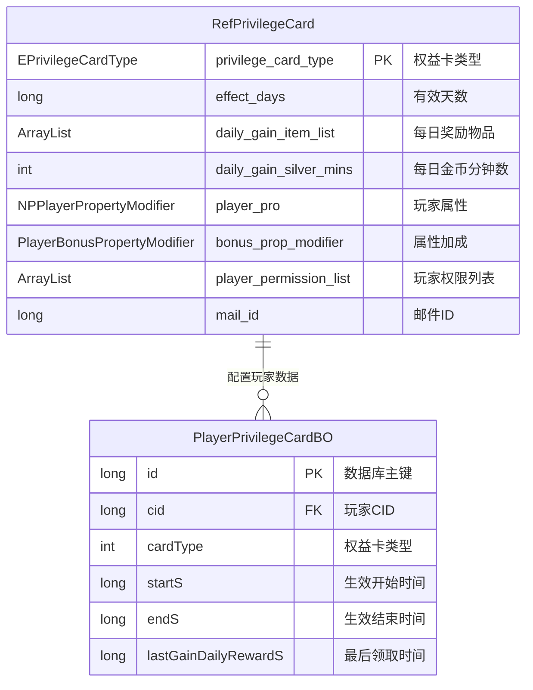
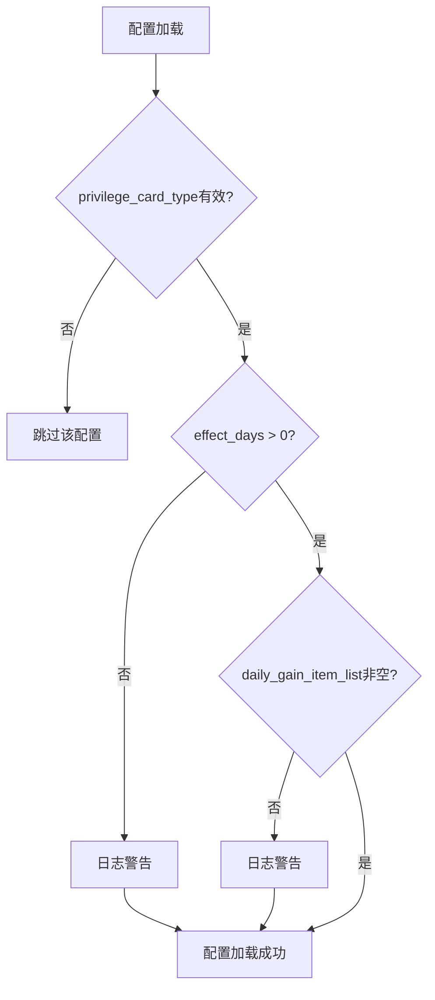

# 权益卡数据配表文档

## 一、配表概览



---

## 二、权益卡配置表 (RefPrivilegeCard)

### 2.1 表信息

| 属性 | 值 |
|------|-----|
| **表名** | `privilege_card` |
| **配置文件** | `privilege_card.json` |
| **服务端类** | `NPGameRes.Refs.PrivilegeCard.RefPrivilegeCard` |
| **客户端类** | `GOE.PrivilegeCardRefObj` |

### 2.2 完整字段列表

| 字段名 | 类型 | 默认值 | 说明 |
|--------|------|--------|------|
| privilege_card_type | EPrivilegeCardType | NONE | 权益卡类型（主键） |
| effect_days | long | 0 | 有效天数 |
| daily_gain_item_list | ArrayList&lt;NPCommonCostItem&gt; | 空列表 | 每日可领取的物品列表 |
| daily_gain_silver_mins | int | 0 | 每日可领取金币时间（分钟） |
| player_pro | NPPlayerPropertyModifier | null | 玩家属性修改器 |
| bonus_prop_modifier | PlayerBonusPropertyModifier | null | 属性加成修改器 |
| player_permission_list | ArrayList&lt;Long&gt; | 空列表 | 玩家权限列表 |
| mail_id | long | 0 | 自动结算邮件ID |
| gift_pack_id | long | 0 | 购买礼包ID（客户端） |
| privilege_desc_title_list | List&lt;string&gt; | null | 特权描述标题列表（客户端） |
| privilege_desc_content_list | List&lt;DescWithParamPair&gt; | null | 特权描述内容列表（客户端） |
| reward_desc | string | null | 获得奖励描述（客户端） |
| reward_desc_args | List&lt;string&gt; | null | 获得奖励描述参数（客户端） |

### 2.3 配置示例

```json
[
  {
    "privilege_card_type": "MONTH",
    "effect_days": 30,
    "daily_gain_item_list": [
      {"itemType": "CURRENCY", "itemId": 1, "count": 100},
      {"itemType": "CURRENCY", "itemId": 2, "count": 50}
    ],
    "daily_gain_silver_mins": 60,
    "player_pro": {
      "speedAdd": 100,
      "speedRatio": 0.1
    },
    "bonus_prop_modifier": {
      "bonusType": "SPEED",
      "value": 100,
      "ratio": 0.1
    },
    "player_permission_list": [1, 2, 3],
    "mail_id": 10001,
    "gift_pack_id": 20001,
    "privilege_desc_title_list": ["每日奖励", "产速加成"],
    "privilege_desc_content_list": [
      {"desc": "每日领取%d钻石", "params": [100]},
      {"desc": "产速提升%.0f%%", "params": [10]}
    ],
    "reward_desc": "获得%d天权益卡",
    "reward_desc_args": ["30"]
  },
  {
    "privilege_card_type": "YEAR",
    "effect_days": 365,
    "daily_gain_item_list": [
      {"itemType": "CURRENCY", "itemId": 1, "count": 200},
      {"itemType": "CURRENCY", "itemId": 2, "count": 100}
    ],
    "daily_gain_silver_mins": 120,
    "player_pro": {
      "speedAdd": 200,
      "speedRatio": 0.2,
      "powerAdd": 100,
      "powerRatio": 0.05
    },
    "bonus_prop_modifier": {
      "bonusType": "SPEED",
      "value": 200,
      "ratio": 0.2
    },
    "player_permission_list": [1, 2, 3, 4, 5],
    "mail_id": 10002,
    "gift_pack_id": 20002
  }
]
```

---

## 三、权益卡类型枚举 (EPrivilegeCardType)

### 3.1 枚举定义

**服务端路径**: `Common.PrivilegeCardEnum.EPrivilegeCardType`

| 枚举值 | 序号 | 说明 |
|--------|------|------|
| NONE | 0 | 无/无效 |
| MONTH | 1 | 月卡 |
| YEAR | 2 | 年卡 |

### 3.2 枚举使用示例

```java
// Java 服务端
EPrivilegeCardType cardType = EPrivilegeCardType.MONTH;
int ordinal = cardType.ordinal(); // 1
EPrivilegeCardType fromInt = EPrivilegeCardType.EPrivilegeCardType_FromInt(1); // MONTH
```

```csharp
// C# 客户端
EPrivilegeCardType cardType = EPrivilegeCardType.MONTH;
int ordinal = (int)cardType; // 1
```

---

## 四、关联数据结构

### 4.1 NPCommonCostItem - 奖励物品

| 字段名 | 类型 | 说明 |
|--------|------|------|
| itemType | ENPItemType | 物品类型 |
| itemId | long | 物品ID |
| count | int | 物品数量 |

### 4.2 NPPlayerPropertyModifier - 玩家属性修改器

| 字段名 | 类型 | 说明 |
|--------|------|------|
| speedAdd | long | 产速固定加成 |
| speedRatio | float | 产速比例加成 |
| powerAdd | long | 实力固定加成 |
| powerRatio | float | 实力比例加成 |

### 4.3 PlayerBonusPropertyModifier - 属性加成修改器

| 字段名 | 类型 | 说明 |
|--------|------|------|
| bonusType | EBonusPropertyType | 加成属性类型 |
| value | long | 固定值加成 |
| ratio | float | 比例加成 |

---

## 五、玩家权益卡数据表 (PlayerPrivilegeCardBO)

### 5.1 表信息

| 属性 | 值 |
|------|-----|
| **表名** | `player_privilege_card` |
| **服务端类** | `USDB.Bo.PlayerPrivilegeCardBO` |
| **数据库标签** | EDBTag.main |

### 5.2 完整字段列表

| 字段名 | 数据库类型 | Java类型 | 说明 |
|--------|-----------|----------|------|
| id | bigint(20) AUTO_INCREMENT | long | 自增主键 |
| cid | bigint(20) | long | 玩家CID |
| cardType | int(11) | int | 权益卡类型枚举值 |
| startS | bigint(20) | long | 生效开始时间戳（秒） |
| endS | bigint(20) | long | 生效结束时间戳（秒） |
| lastGainDailyRewardS | bigint(20) | long | 最后一次领取每日奖励的时间戳（秒） |

### 5.3 建表SQL

```sql
CREATE TABLE IF NOT EXISTS `player_privilege_card` (
    `id` bigint(20) NOT NULL AUTO_INCREMENT COMMENT '自增主键',
    `cid` bigint(20) NOT NULL DEFAULT '0' COMMENT '玩家CID',
    `cardType` int(11) NOT NULL DEFAULT '0' COMMENT '权益卡类型',
    `startS` bigint(20) NOT NULL DEFAULT '0' COMMENT '生效开始时间戳（秒）',
    `endS` bigint(20) NOT NULL DEFAULT '0' COMMENT '生效结束时间戳（秒）',
    `lastGainDailyRewardS` bigint(20) NOT NULL DEFAULT '0' COMMENT '最后一次领取每日奖励的时间戳（秒）',
    KEY `cid` (`cid`),
    PRIMARY KEY (`id`)
) COMMENT='玩家权益卡数据' engine=MyISAM DEFAULT CHARSET=utf8mb4 COLLATE utf8mb4_general_ci AUTO_INCREMENT=1;
```

### 5.4 索引说明

| 索引名 | 索引字段 | 索引类型 |
|--------|----------|----------|
| PRIMARY | id | 主键 |
| cid | cid | 普通索引 |

---

## 六、配表加载方式

### 6.1 服务端加载

```java
// 获取权益卡配置管理器
RefTableContainer<RefPrivilegeCard> mgr = RefPrivilegeCard.getMgr();

// 根据类型获取配置
RefPrivilegeCard ref = mgr.get(EPrivilegeCardType.MONTH.ordinal());

// 获取配置字段
long effectDays = ref.effect_days;
ArrayList<NPCommonCostItem> dailyItems = ref.daily_gain_item_list;
```

### 6.2 客户端加载

```csharp
// 获取权益卡配置管理器
GSOPrivilegeCardRefSet refSet = GRefdataCoreMgr.instance.privilegeCardRefCore;

// 根据类型获取配置
PrivilegeCardRefObj refObj = refSet.getRef((long)EPrivilegeCardType.MONTH);

// 获取配置字段
long effectDays = refObj.effect_days;
List<NPCommonCostItem> dailyItems = refObj.daily_gain_item_list;
```

### 6.3 资源加载路径

| 属性 | 值 |
|------|-----|
| assetPath | `refdata/privilege_card_refdata.unity3d` |
| objName | `privilege_card` |

---

## 七、数据校验规则

### 7.1 配置校验

| 字段名 | 校验规则 |
|--------|----------|
| privilege_card_type | 必填，不能为NONE |
| effect_days | 必须 > 0 |
| daily_gain_item_list | 不能为空列表 |
| daily_gain_silver_mins | 必须 >= 0 |
| mail_id | 必须 > 0（用于自动结算） |

### 7.2 数据约束



---

*文档生成时间: 2026-04-12*
