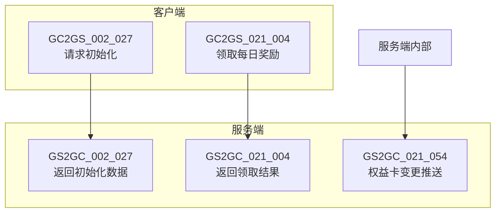
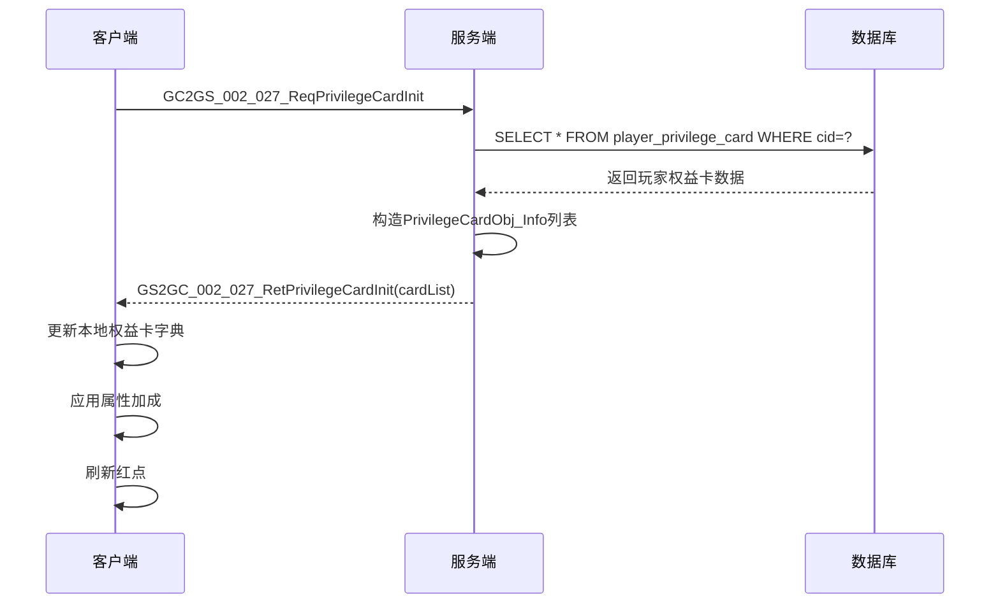
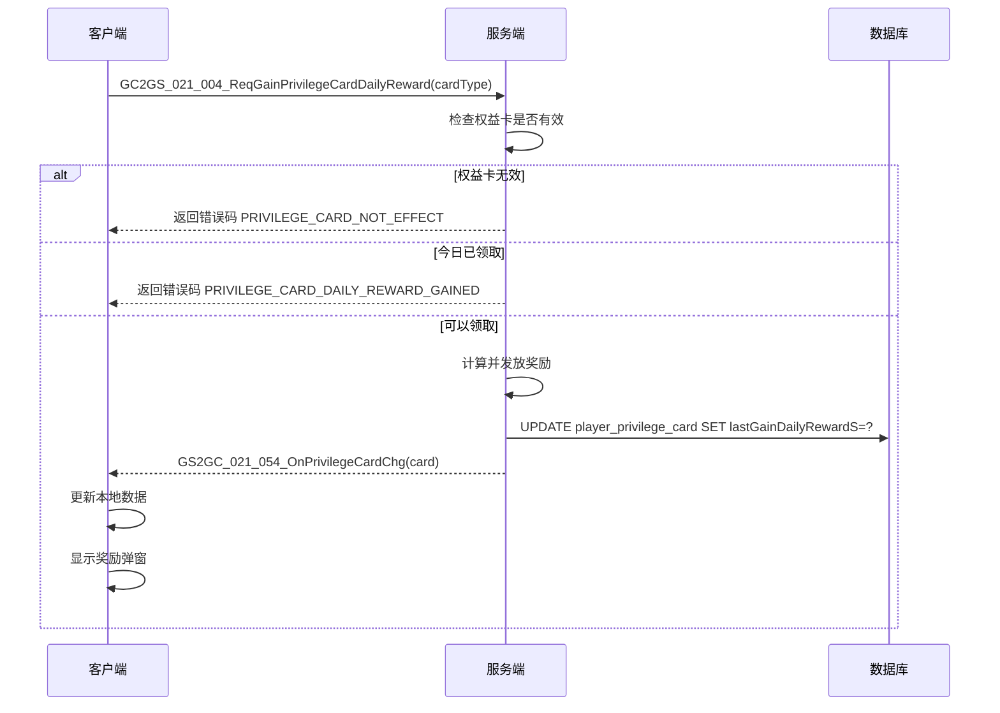
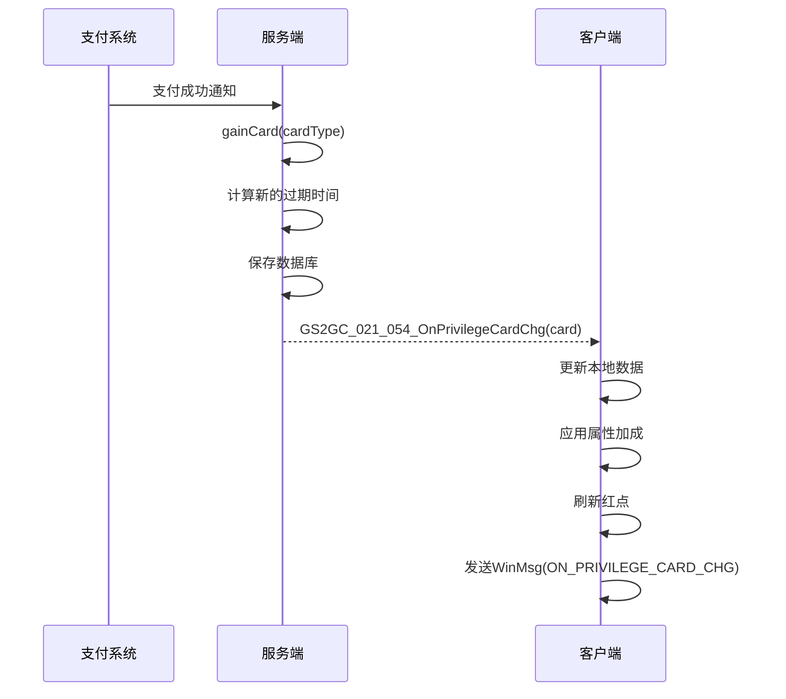
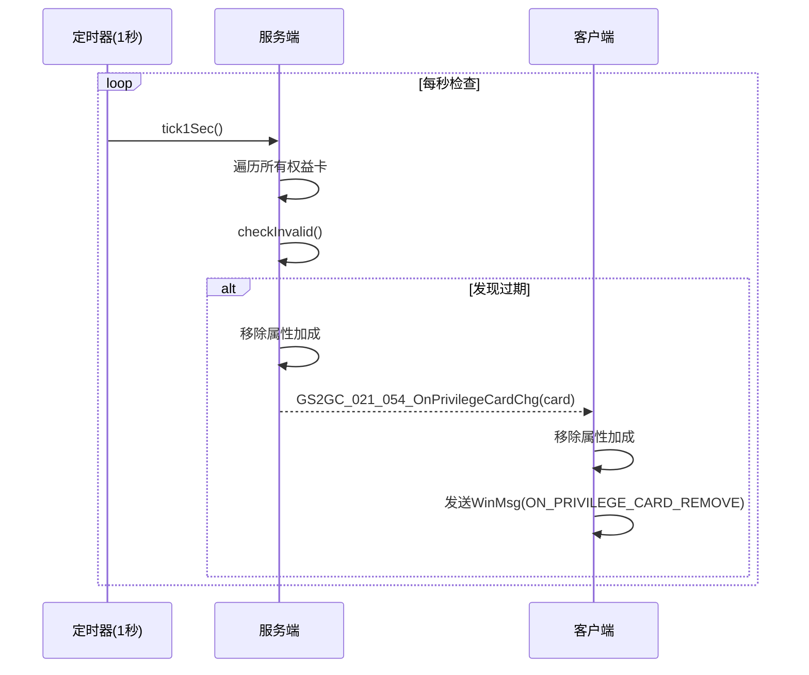

# 权益卡协议文档

## 协议模块编号

| 模块 | 主协议号 | 说明 |
|------|----------|------|
| InitOp | p002 | 初始化相关协议 |
| PlayerInfo | p021 | 玩家信息相关协议 |

---

## 一、协议概览图



---

## 二、客户端请求协议 (GC2GS)

### 2.1 GC2GS_002_027_ReqPrivilegeCardInit - 请求权益卡初始化

**功能说明**: 请求获取玩家所有权益卡数据

**协议号**: main=2, sub=27

**请求参数**: 无

**请求示例**:
```csharp
// 客户端发送
NPPlayer.instance.privilegeCardComponent.reqPrivilegeCardInit();
```

```java
// 协议结构
public class GC2GS_002_027_ReqPrivilegeCardInit {
    // 无参数
}
```

---

### 2.2 GC2GS_021_004_ReqGainPrivilegeCardDailyReward - 领取每日奖励

**功能说明**: 领取权益卡每日奖励

**协议号**: main=21, sub=4

**请求参数**:

| 字段名 | 类型 | 说明 |
|--------|------|------|
| cardType | EPrivilegeCardType | 权益卡类型 |

**协议结构**:
```java
public class GC2GS_021_004_ReqGainPrivilegeCardDailyReward {
    private EPrivilegeCardType cardType;  // 权益卡类型
}
```

**请求示例**:
```csharp
// 客户端发送 - 领取月卡每日奖励
NPPlayer.instance.privilegeCardComponent.reqGainPrivilegeCardDailyReward(
    EPrivilegeCardType.MONTH,
    (succ, msg) => {
        if (succ) {
            Debug.Log("领取成功");
        } else {
            Debug.Log("领取失败: " + msg.getErrorMsg());
        }
    }
);
```

---

## 三、服务端响应协议 (GS2GC)

### 3.1 GS2GC_002_027_RetPrivilegeCardInit - 返回权益卡初始化数据

**功能说明**: 返回玩家所有权益卡数据

**协议号**: main=2, sub=27

**响应参数**:

| 字段名 | 类型 | 说明 |
|--------|------|------|
| cardList | List&lt;PrivilegeCardObj_Info&gt; | 权益卡列表 |

**协议结构**:
```java
public class GS2GC_002_027_RetPrivilegeCardInit {
    private List<PrivilegeCardObj_Info> cardList;  // 权益卡列表
}
```

---

### 3.2 GS2GC_021_004_RetGainPrivilegeCardDailyReward - 领取每日奖励结果

**功能说明**: 返回领取每日奖励结果

**协议号**: main=21, sub=4

**响应参数**:

| 字段名 | 类型 | 说明 |
|--------|------|------|
| cardType | EPrivilegeCardType | 权益卡类型 |
| rewardList | List&lt;RewardItem&gt; | 奖励列表 |

---

### 3.3 GS2GC_021_054_OnPrivilegeCardChg - 权益卡变化推送

**功能说明**: 推送权益卡数据变化（激活、续费、过期等）

**协议号**: main=21, sub=54

**推送参数**:

| 字段名 | 类型 | 说明 |
|--------|------|------|
| card | PrivilegeCardObj_Info | 变化的权益卡信息 |

**协议结构**:
```java
public class GS2GC_021_054_OnPrivilegeCardChg {
    private PrivilegeCardObj_Info card;  // 权益卡数据
}
```

---

## 四、数据结构定义

### 4.1 PrivilegeCardObj_Info - 权益卡信息

**用途**: 协议传输的权益卡数据结构

| 字段名 | 类型 | 说明 |
|--------|------|------|
| cardType | EPrivilegeCardType | 权益卡类型 |
| startS | long | 生效开始时间戳（秒） |
| endS | long | 生效结束时间戳（秒） |
| lastGainDailyRewardS | long | 最后一次领取每日奖励的时间戳（秒） |

**协议结构**:
```java
public class PrivilegeCardObj_Info {
    private EPrivilegeCardType cardType;        // 权益卡类型
    private long startS;                         // 生效开始时间戳（秒）
    private long endS;                           // 生效结束时间戳（秒）
    private long lastGainDailyRewardS;          // 最后领取时间戳（秒）
}
```

**数据大小**: 28 bytes (不含协议头)

---

## 五、协议调用流程

### 5.1 权益卡初始化流程



### 5.2 领取每日奖励流程



### 5.3 权益卡激活/变化推送流程



### 5.4 权益卡过期检查流程



---

## 六、错误码定义

| 错误码 | 错误名称 | 说明 | 用户提示 |
|--------|----------|------|----------|
| 63001 | PRIVILEGE_CARD_NOT_FOUND | 权益卡配置不存在 | "权益卡类型无效" |
| 63002 | PRIVILEGE_CARD_NOT_EFFECT | 权益卡未激活或已过期 | "权益卡未激活或已过期" |
| 63003 | PRIVILEGE_CARD_EXPIRED | 权益卡已过期 | "权益卡已过期，请续费" |
| 63004 | PRIVILEGE_CARD_DAILY_REWARD_GAINED | 今日奖励已领取 | "今日奖励已领取" |

**错误处理示例**:
```csharp
NPPlayer.instance.privilegeCardComponent.reqGainPrivilegeCardDailyReward(
    EPrivilegeCardType.MONTH,
    (succ, msg) => {
        if (!succ) {
            switch (msg.getErrorCode()) {
                case 63002:
                    // 权益卡未激活
                    ShowTips("请先开通权益卡");
                    break;
                case 63004:
                    // 今日已领取
                    ShowTips("今日奖励已领取，请明天再来");
                    break;
                default:
                    ShowTips("领取失败: " + msg.getErrorMsg());
                    break;
            }
        }
    }
);
```

---

## 七、协议使用代码示例

### 7.1 服务端协议构造

```java
// 构造权益卡初始化响应
public void makeInitResponse(NPUSUserData userData) {
    ArrayList<PrivilegeCardObj_Info> cardList = new ArrayList<>();
    userData.getPrivilegeCardComponent().makeProto(cardList);

    GS2GC_002_027_RetPrivilegeCardInit response = new GS2GC_002_027_RetPrivilegeCardInit();
    response.setCardList(cardList);

    userData.sendMsgToGC(response);
}

// 构造权益卡变化推送
public void pushCardChange(PrivilegeCardInfo info) {
    GS2GC_021_054_OnPrivilegeCardChg msg = new GS2GC_021_054_OnPrivilegeCardChg();
    msg.setCard(info.toProto());

    getUserData().sendMsgToGC(msg);
}
```

### 7.2 客户端协议处理

```csharp
// 处理权益卡初始化响应
public void retPrivilegeCardInit(GS2GC_002_027_RetPrivilegeCardInit msg) {
    if (msg == null) return;

    foreach (var cardInfo in msg.getCardList()) {
        if (cardInfo == null) continue;

        PrivilegeCardInfo info = new PrivilegeCardInfo(cardInfo);
        if (info.isActivate) {
            _m_dPrivilegeCardDic[cardInfo.getCardType()] = info;
            // 应用属性加成
            _replacePlayerProperty(null, info.refObj?.player_pro);
            _replaceBonus(null, info.refObj?.bonus_prop_modifier);
        }
    }

    _refreshRedTip();
    setInitDone();
}

// 处理权益卡变化推送
public void onPrivilegeCardChg(GS2GC_021_054_OnPrivilegeCardChg msg) {
    if (msg == null || msg.getCard() == null) return;

    bool oriIsActivate = false;
    PrivilegeCardInfo cardInfo = null;

    if (_m_dPrivilegeCardDic.TryGetValue(msg.getCard().getCardType(), out cardInfo)) {
        oriIsActivate = cardInfo.isActivate;
        cardInfo.updateInfo(msg.getCard());
    } else {
        cardInfo = new PrivilegeCardInfo(msg.getCard());
        if (cardInfo.isActivate)
            _m_dPrivilegeCardDic[msg.getCard().getCardType()] = cardInfo;
    }

    // 处理状态变化
    if (!oriIsActivate && cardInfo.isActivate) {
        // 新激活
        _replacePlayerProperty(null, cardInfo.refObj?.player_pro);
        _replaceBonus(null, cardInfo.refObj?.bonus_prop_modifier);
    } else if (oriIsActivate && !cardInfo.isActivate) {
        // 已过期
        _replacePlayerProperty(cardInfo.refObj?.player_pro, null);
        _replaceBonus(cardInfo.refObj?.bonus_prop_modifier, null);
        _m_dPrivilegeCardDic.Remove(msg.getCard().getCardType());
        WinMsg.SendMsg(WinMsgType.ON_PRIVILEGE_CARD_REMOVE, msg.getCard().getCardType());
    }

    _refreshRedTip();
    WinMsg.SendMsg(WinMsgType.ON_PRIVILEGE_CARD_CHG, msg.getCard().getCardType());
}
```

---

## 八、消息类型定义

### 8.1 客户端消息事件

| 消息类型 | 说明 | 参数 |
|----------|------|------|
| ON_PRIVILEGE_CARD_CHG | 权益卡变化 | EPrivilegeCardType |
| ON_PRIVILEGE_CARD_REMOVE | 权益卡移除/过期 | EPrivilegeCardType |
| ON_CROSS_DAY | 跨天事件 | 无 |

### 8.2 消息监听示例

```csharp
// 监听权益卡变化
WinMsg.RegisterMsgAct(WinMsgType.ON_PRIVILEGE_CARD_CHG, (cardType) => {
    Debug.Log($"权益卡变化: {cardType}");
    RefreshUI();
});

// 监听权益卡移除
WinMsg.RegisterMsgAct(WinMsgType.ON_PRIVILEGE_CARD_REMOVE, (cardType) => {
    Debug.Log($"权益卡已过期: {cardType}");
    ShowExpiredTips(cardType);
});

// 监听跨天事件
WinMsg.RegisterMsgAct(WinMsgType.ON_CROSS_DAY, () => {
    _refreshRedTip();
});
```

---

*文档生成时间: 2026-04-12*
