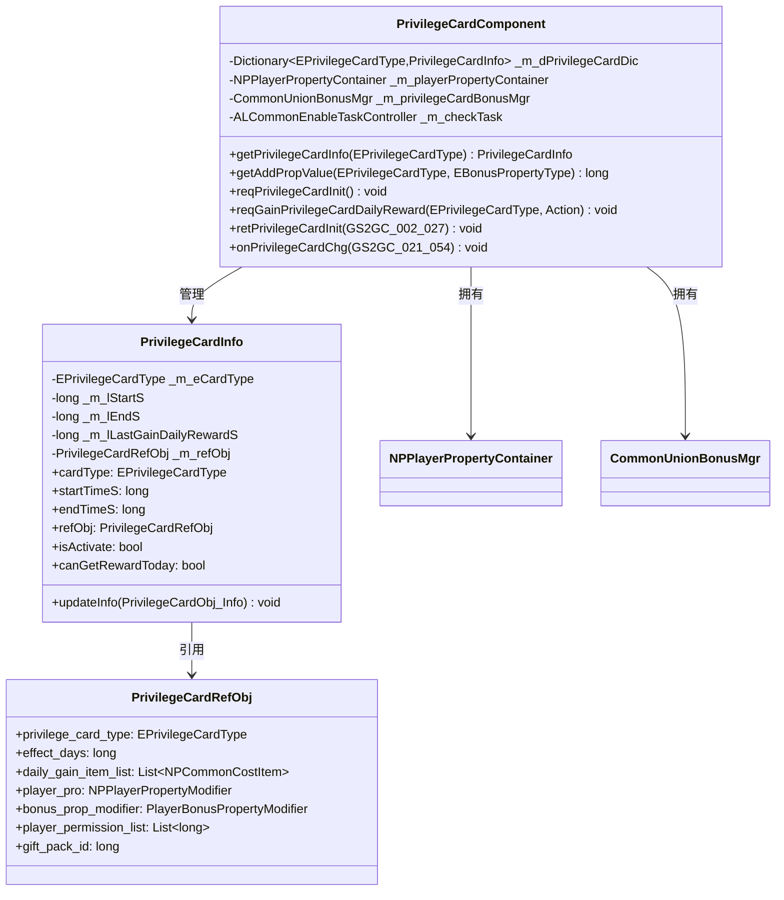

# 权益卡客户端开发文档

## 一、模块架构图



---

## 二、核心组件类

### 2.1 PrivilegeCardComponent

**路径**: `game_client/Assets/Scripts/LogicScripts/GameComponent/PrivilegeCard/PrivilegeCardComponent.cs`

**继承关系**:
```
PrivilegeCardComponent : _ANPBasicPlayerComponent
```

**组件类型**: `ENPPlayerCompType.PRIVILEGE_CARD`

#### 完整字段列表

| 字段名 | 类型 | 访问修饰符 | 说明 |
|--------|------|-----------|------|
| _m_dPrivilegeCardDic | Dictionary&lt;EPrivilegeCardType, PrivilegeCardInfo&gt; | private | 权益卡信息字典 |
| _m_playerPropertyContainer | NPPlayerPropertyContainer | private | 玩家属性容器 |
| _m_privilegeCardBonusMgr | CommonUnionBonusMgr | private | 权益卡Bonus管理器 |
| _m_checkTask | ALCommonEnableTaskController | private | 定时检查任务 |
| _m_lNeedRemoveType | List&lt;EPrivilegeCardType&gt; | private | 需要移除的权益卡类型列表 |

#### 完整属性列表

| 属性名 | 类型 | 说明 |
|--------|------|------|
| playerPropertyContainer | NPPlayerPropertyContainer | 玩家属性容器（只读） |
| compType | ENPPlayerCompType | 组件类型（重写） |
| isMustInit | bool | 是否必须初始化（true） |
| canPreInit | bool | 是否允许提前初始化（true） |
| dependCompList | ENPPlayerCompType[] | 依赖组件列表（空） |

#### 完整方法列表

| 方法名 | 参数 | 返回值 | 说明 |
|--------|------|--------|------|
| getPrivilegeCardInfo | EPrivilegeCardType _type | PrivilegeCardInfo | 获取权益卡信息 |
| getAddPropValue | EPrivilegeCardType _cardType, EBonusPropertyType _propType | long | 获取属性加成值 |
| reqPrivilegeCardInit | 无 | void | 请求权益卡初始化 |
| reqGainPrivilegeCardDailyReward | EPrivilegeCardType _type, Action callback | void | 请求领取每日奖励 |
| retPrivilegeCardInit | GS2GC_002_027_RetPrivilegeCardInit _msg | void | 处理初始化响应 |
| onPrivilegeCardChg | GS2GC_021_054_OnPrivilegeCardChg _msg | void | 处理权益卡变化 |
| presendInitProtocol | 无 | void | 提前发送初始化协议 |

---

### 2.2 PrivilegeCardInfo

**路径**: `game_client/Assets/Scripts/LogicScripts/GameComponent/PrivilegeCard/PrivilegeCardInfo.cs`

#### 完整字段列表

| 字段名 | 类型 | 说明 |
|--------|------|------|
| _m_eCardType | EPrivilegeCardType | 权益卡类型 |
| _m_lStartS | long | 生效开始时间戳（秒） |
| _m_lEndS | long | 生效结束时间戳（秒） |
| _m_lLastGainDailyRewardS | long | 最后一次领取每日奖励的时间戳（秒） |
| _m_refObj | PrivilegeCardRefObj | 配置数据引用 |

#### 完整属性列表

| 属性名 | 类型 | 计算逻辑 |
|--------|------|----------|
| cardType | EPrivilegeCardType | 权益卡类型 |
| startTimeS | long | 生效开始时间戳 |
| endTimeS | long | 生效结束时间戳 |
| refObj | PrivilegeCardRefObj | 配置数据引用 |
| isActivate | bool | `endTimeS > 0 && serverTimeTagS <= endTimeS` |
| canGetRewardToday | bool | `isActivate && (lastGainDailyRewardS == 0 || !同一天)` |

---

## 三、数据管理

### 3.1 权益卡字典管理

```csharp
// 权益卡信息字典
[NotNull] private Dictionary<EPrivilegeCardType, PrivilegeCardInfo> _m_dPrivilegeCardDic
    = new Dictionary<EPrivilegeCardType, PrivilegeCardInfo>();

// 玩家属性容器
[NotNull] private NPPlayerPropertyContainer _m_playerPropertyContainer
    = new NPPlayerPropertyContainer("privilegeCard");

// Bonus管理器
[NotNull] private readonly CommonUnionBonusMgr _m_privilegeCardBonusMgr
    = new CommonUnionBonusMgr(EUnionBonusMgrTag.PRIVILEGE_CARD);
```

### 3.2 获取权益卡信息

```csharp
/// <summary>
/// 根据类型获取权益卡信息
/// </summary>
public PrivilegeCardInfo getPrivilegeCardInfo(EPrivilegeCardType _type)
{
    if (_m_dPrivilegeCardDic.TryGetValue(_type, out PrivilegeCardInfo cardInfo))
        return cardInfo;
    return null;
}
```

### 3.3 获取属性加成值

```csharp
/// <summary>
/// 获取属性加成值
/// </summary>
public long getAddPropValue(EPrivilegeCardType _cardType, EBonusPropertyType _propType)
{
    if (_m_dPrivilegeCardDic.TryGetValue(_cardType, out PrivilegeCardInfo info)
        && info != null && info.isActivate
        && info.refObj != null && info.refObj.bonus_prop_modifier != null)
    {
        return info.refObj.bonus_prop_modifier.getPropValue(_propType);
    }
    return 0;
}
```

---

## 四、请求方法

### 4.1 初始化请求

```csharp
/// <summary>
/// 发送初始化协议提前申请内容
/// </summary>
public override void presendInitProtocol()
{
    reqPrivilegeCardInit();
}

/// <summary>
/// 请求权益卡初始化
/// </summary>
public void reqPrivilegeCardInit()
{
    NPGSClientListener.sendMsgByLog(GSWriter_002_InitOp.make_002_027_ReqPrivilegeCardInit());
}
```

### 4.2 领取每日奖励

```csharp
/// <summary>
/// 请求领取权益卡每日奖励
/// </summary>
/// <param name="_type">权益卡类型</param>
/// <param name="_callback">回调函数</param>
public void reqGainPrivilegeCardDailyReward(
    EPrivilegeCardType _type,
    Action<bool, GS2GC_021_004_RetGainPrivilegeCardDailyReward> _callback = null)
{
    NPGSClientListener.sendRequestByLog(
        new GC2GS_021_004_ReqGainPrivilegeCardDailyReward(_type),
        new CommonRequestSucFailSameCallbackProtocolDealer<GS2GC_021_004_RetGainPrivilegeCardDailyReward>(_callback)
    );
}
```

---

## 五、消息处理

### 5.1 初始化响应处理

```csharp
/// <summary>
/// 权益卡初始化
/// </summary>
public void retPrivilegeCardInit(GS2GC_002_027_RetPrivilegeCardInit _msg)
{
    if (_msg == null) return;

    for (int i = 0; i < _msg.getCardList().Count; i++)
    {
        PrivilegeCardObj_Info cardInfo = _msg.getCardList()[i];
        if (cardInfo == null) continue;

        PrivilegeCardInfo info = new PrivilegeCardInfo(cardInfo);
        if (info.isActivate)
        {
            _m_dPrivilegeCardDic[cardInfo.getCardType()] = info;
            // 更新玩家属性
            _replacePlayerProperty(null, info.refObj?.player_pro);
            // 更新属性加成
            _replaceBonus(null, info?.refObj?.bonus_prop_modifier);
        }
    }

    // 刷新红点
    _refreshRedTip();
    setInitDone();
}
```

### 5.2 权益卡变化处理

```csharp
/// <summary>
/// 权益卡变更推送
/// </summary>
public void onPrivilegeCardChg(GS2GC_021_054_OnPrivilegeCardChg _msg)
{
    if (_msg == null || _msg.getCard() == null) return;

    // 原本是否激活
    bool oriIsActivate = false;
    PrivilegeCardInfo cardInfo = null;

    if (_m_dPrivilegeCardDic.TryGetValue(_msg.getCard().getCardType(), out cardInfo) && cardInfo != null)
    {
        oriIsActivate = cardInfo.isActivate;
        cardInfo.updateInfo(_msg.getCard());
    }
    else
    {
        oriIsActivate = false;
        cardInfo = new PrivilegeCardInfo(_msg.getCard());
        if (cardInfo.isActivate)
            _m_dPrivilegeCardDic[_msg.getCard().getCardType()] = cardInfo;
    }

    // 状态变化处理
    if (!oriIsActivate && cardInfo.isActivate)
    {
        // 新激活
        _replacePlayerProperty(null, cardInfo.refObj?.player_pro);
        _replaceBonus(null, cardInfo.refObj?.bonus_prop_modifier);
    }

    if (oriIsActivate && !cardInfo.isActivate)
    {
        // 已过期
        _replacePlayerProperty(cardInfo.refObj?.player_pro, null);
        _replaceBonus(cardInfo.refObj?.bonus_prop_modifier, null);
        _m_dPrivilegeCardDic.Remove(_msg.getCard().getCardType());
        WinMsg.SendMsg(WinMsgType.ON_PRIVILEGE_CARD_REMOVE, _msg.getCard().getCardType());
    }

    _refreshRedTip();
    NPPlayer.instance.buildingComp.recalAllBusinessBuilding();
    WinMsg.SendMsg(WinMsgType.ON_PRIVILEGE_CARD_CHG, _msg.getCard().getCardType());
}
```

---

## 六、定时检查

### 6.1 检查逻辑

```csharp
/// <summary>
/// 定时检查（每秒执行）
/// </summary>
private void _tickCheck()
{
    // 获取需要移除的权益卡类型
    _m_lNeedRemoveType.Clear();
    foreach (PrivilegeCardInfo cardInfo in _m_dPrivilegeCardDic.Values)
    {
        if (cardInfo != null && !cardInfo.isActivate)
            _m_lNeedRemoveType.Add(cardInfo.cardType);
    }

    // 移除过期的权益卡
    if (_m_lNeedRemoveType.Count > 0)
    {
        foreach (EPrivilegeCardType cardType in _m_lNeedRemoveType)
        {
            if (!_m_dPrivilegeCardDic.ContainsKey(cardType)) continue;

            PrivilegeCardInfo cardInfo = _m_dPrivilegeCardDic[cardType];
            // 移除玩家属性
            _replacePlayerProperty(cardInfo?.refObj?.player_pro, null);
            // 移除属性加成
            _replaceBonus(cardInfo?.refObj?.bonus_prop_modifier, null);
            // 移除数据
            _m_dPrivilegeCardDic.Remove(cardType);
            // 刷新建筑属性加成
            NPPlayer.instance.buildingComp.recalAllBusinessBuilding();
            // 发送消息
            WinMsg.SendMsg(WinMsgType.ON_PRIVILEGE_CARD_REMOVE, cardType);
        }
        _m_lNeedRemoveType.Clear();
        // 刷新红点
        _refreshRedTip();
    }
}

/// <summary>
/// 开启定时检查
/// </summary>
private void _startCheck()
{
    _m_checkTask.setDisable();
    _m_checkTask = ALCommonTaskController.CommonEnableDurationActionAddMonoTask(_tickCheck, 1.0f);
}

/// <summary>
/// 关闭定时检查
/// </summary>
private void _stopCheck()
{
    _m_checkTask.setDisable();
}
```

---

## 七、红点系统

### 7.1 红点刷新

```csharp
/// <summary>
/// 刷新红点
/// </summary>
private void _refreshRedTip()
{
    long redTipCount = 0;
    foreach (PrivilegeCardInfo cardInfo in _m_dPrivilegeCardDic.Values)
    {
        if (cardInfo != null && cardInfo.canGetRewardToday)
            redTipCount++;
    }
    RedTipMgr.instance.setCountByRefRedTipId(RedTipConst.RED_PRIVILEGE_CARD, redTipCount);
}

/// <summary>
/// 发生了跨天
/// </summary>
private void _onCrossDay()
{
    _refreshRedTip();
}
```

---

## 八、UI窗口开发

### 8.1 窗口类列表

| 类名 | 路径 | 说明 |
|------|------|------|
| GGUIWndPrivilegeCardPage | GameWndGui/GGui/PrivilegeCard/ | 权益卡页面 |
| GGUIWndSubPrivilegeCard | GameWndGui/GGui/PrivilegeCard/ | 权益卡子页面 |
| GGUIWndPrivilegeCardDescContainer | GameWndGui/GGui/PrivilegeCard/ | 权益卡描述容器 |
| GGUIWndPrivilegeCardDescContainerItem | GameWndGui/GGui/PrivilegeCard/ | 权益卡描述项 |

### 8.2 UI使用示例

```csharp
// 在UI中获取权益卡数据
public class PrivilegeCardUI : MonoBehaviour
{
    private void OnEnable()
    {
        // 监听权益卡变化
        WinMsg.RegisterMsgAct(WinMsgType.ON_PRIVILEGE_CARD_CHG, OnCardChanged);
        WinMsg.RegisterMsgAct(WinMsgType.ON_PRIVILEGE_CARD_REMOVE, OnCardRemoved);

        RefreshUI();
    }

    private void OnDisable()
    {
        WinMsg.UnregisterMsgAct(WinMsgType.ON_PRIVILEGE_CARD_CHG, OnCardChanged);
        WinMsg.UnregisterMsgAct(WinMsgType.ON_PRIVILEGE_CARD_REMOVE, OnCardRemoved);
    }

    private void RefreshUI()
    {
        // 获取月卡信息
        PrivilegeCardInfo monthCard = NPPlayer.instance.privilegeCardComponent
            .getPrivilegeCardInfo(EPrivilegeCardType.MONTH);

        if (monthCard != null && monthCard.isActivate)
        {
            // 显示月卡激活状态
            ShowCardActive(monthCard);

            // 显示剩余天数
            long remainSeconds = monthCard.endTimeS - FpsAndPingMgr.instance.serverTimeTagS;
            int remainDays = (int)(remainSeconds / 86400);
            txtRemainDays.text = $"剩余 {remainDays} 天";

            // 显示领取按钮状态
            btnReward.interactable = monthCard.canGetRewardToday;
            redDot.SetActive(monthCard.canGetRewardToday);
        }
        else
        {
            // 显示未激活状态
            ShowCardInactive();
        }
    }

    private void OnCardChanged(EPrivilegeCardType cardType)
    {
        RefreshUI();
    }

    private void OnCardRemoved(EPrivilegeCardType cardType)
    {
        if (cardType == EPrivilegeCardType.MONTH)
        {
            ShowCardExpired();
        }
        RefreshUI();
    }

    // 领取每日奖励
    public void OnClickReward()
    {
        NPPlayer.instance.privilegeCardComponent.reqGainPrivilegeCardDailyReward(
            EPrivilegeCardType.MONTH,
            (succ, msg) => {
                if (succ)
                {
                    ShowRewardEffect(msg.getRewardList());
                }
            }
        );
    }
}
```

---

## 九、配置数据访问

### 9.1 获取配置数据

```csharp
// 获取权益卡配置管理器
GSOPrivilegeCardRefSet refSet = GRefdataCoreMgr.instance.privilegeCardRefCore;

// 根据类型获取配置
PrivilegeCardRefObj refObj = refSet.getRef((long)EPrivilegeCardType.MONTH);

// 访问配置字段
long effectDays = refObj.effect_days;
List<NPCommonCostItem> dailyItems = refObj.daily_gain_item_list;
string rewardDesc = refObj.reward_desc;
```

### 9.2 配置数据类

```csharp
public class PrivilegeCardRefObj : _IALBasicRefObj
{
    public long _refId { get { return (long)privilege_card_type; } }
    public EPrivilegeCardType privilege_card_type;   // 权益卡类型
    public long effect_days;                         // 有效天数
    public List<NPCommonCostItem> daily_gain_item_list; // 每日奖励物品列表
    public NPPlayerPropertyModifier player_pro;      // 玩家属性
    public long gift_pack_id;                         // 购买礼包ID
    public List<string> privilege_desc_title_list;  // 特权描述标题列表
    public List<DescWithParamPair> privilege_desc_content_list; // 特权描述内容列表
    public string reward_desc;                        // 获得奖励描述
    public List<string> reward_desc_args;             // 获得奖励描述参数
    public List<long> player_permission_list;         // 玩家权限列表
    public PlayerBonusPropertyModifier bonus_prop_modifier; // 属性加成
}
```

---

## 十、完整使用示例

### 10.1 初始化流程

```csharp
// 1. 组件初始化
protected override void _dealInit()
{
    // 空实现，实际通过 presendInitProtocol 提前发送请求
}

// 2. 提前发送初始化协议
public override void presendInitProtocol()
{
    reqPrivilegeCardInit();
}

// 3. 组件加载完成
protected override void _onInitDone()
{
    _m_privilegeCardBonusMgr.setParent(NPPlayer.instance.playerBonusMgr);
    _startCheck();
    WinMsg.RegisterMsgAct(WinMsgType.ON_CROSS_DAY, _onCrossDay);
}
```

### 10.2 查询权益卡状态

```csharp
// 检查月卡是否激活
PrivilegeCardInfo monthCard = NPPlayer.instance.privilegeCardComponent
    .getPrivilegeCardInfo(EPrivilegeCardType.MONTH);
bool isMonthCardActive = monthCard != null && monthCard.isActivate;

// 检查是否可领取今日奖励
bool canGetReward = monthCard != null && monthCard.canGetRewardToday;

// 获取剩余天数
if (monthCard != null)
{
    long remainSeconds = monthCard.endTimeS - FpsAndPingMgr.instance.serverTimeTagS;
    int remainDays = (int)(remainSeconds / 86400);
}

// 获取产速加成
long speedBonus = NPPlayer.instance.privilegeCardComponent
    .getAddPropValue(EPrivilegeCardType.MONTH, EBonusPropertyType.SPEED);
```

---

*文档生成时间: 2026-04-12*