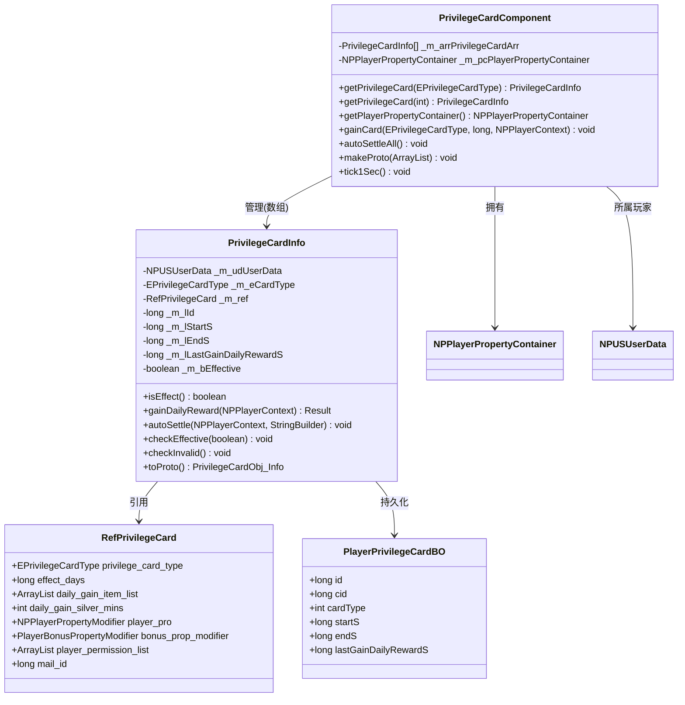

# 权益卡服务端开发文档

## 一、模块架构图



---

## 二、核心类详解

### 2.1 PrivilegeCardComponent

**路径**: `NPUSServer/NPUSUserMgr/UserComp/PrivilegeCardComp/PrivilegeCardComponent.java`

**继承关系**:
```java
public class PrivilegeCardComponent extends _ANPUserComponent
    implements _IUserItemBasicDealer, _ITickableComponent, _IHandlerHolder
```

**组件类型**: `ENPPlayerCompType.PRIVILEGE_CARD`

#### 完整字段列表

| 字段名 | 类型 | 说明 |
|--------|------|------|
| _m_arrPrivilegeCardArr | PrivilegeCardInfo[] | 权益卡数据数组（按枚举序号索引） |
| _m_pcPlayerPropertyContainer | NPPlayerPropertyContainer | 玩家属性容器 |

#### 完整方法列表

| 方法名 | 参数 | 返回值 | 说明 |
|--------|------|--------|------|
| getPrivilegeCard | EPrivilegeCardType _type | PrivilegeCardInfo | 获取权益卡信息（按类型） |
| getPrivilegeCard | int _type | PrivilegeCardInfo | 获取权益卡信息（按序号） |
| getPlayerPropertyContainer | 无 | NPPlayerPropertyContainer | 获取玩家属性容器 |
| gainCard | EPrivilegeCardType, long, NPPlayerContext | void | 获得权益卡 |
| autoSettleAll | 无 | void | 自动结算所有权益卡 |
| makeProto | ArrayList&lt;PrivilegeCardObj_Info&gt; | void | 构造数据协议 |
| tick1Sec | 无 | void | 每秒定时检查 |
| _init | 无 | void | 初始化加载数据 |
| _initFromBoList | List&lt;PlayerPrivilegeCardBO&gt; | void | 从BO列表初始化 |
| onInited | 无 | void | 初始化完成回调 |

---

### 2.2 PrivilegeCardInfo

**路径**: `NPUSServer/NPUSUserMgr/UserComp/PrivilegeCardComp/PrivilegeCardInfo.java`

#### 完整字段列表

| 字段名 | 类型 | 说明 |
|--------|------|------|
| _m_udUserData | NPUSUserData | 玩家数据 |
| _m_eCardType | EPrivilegeCardType | 权益卡类型 |
| _m_ref | RefPrivilegeCard | 配置数据引用 |
| _m_lId | long | 数据库记录ID |
| _m_lStartS | long | 生效开始时间（秒） |
| _m_lEndS | long | 生效结束时间（秒） |
| _m_lLastGainDailyRewardS | long | 最后一次领取每日奖励的时间戳（秒） |
| _m_bEffective | boolean | 当前是否生效标志 |

#### 完整方法列表

| 方法名 | 参数 | 返回值 | 说明 |
|--------|------|--------|------|
| getUserData | 无 | NPUSUserData | 获取玩家数据 |
| getCardType | 无 | EPrivilegeCardType | 获取权益卡类型 |
| getRef | 无 | RefPrivilegeCard | 获取配置引用 |
| getId | 无 | long | 获取记录ID |
| getStartS | 无 | long | 获取开始时间 |
| getEndS | 无 | long | 获取结束时间 |
| getLastGainDailyRewardS | 无 | long | 获取最后领取时间 |
| isEffect | 无 | boolean | 是否生效 |
| gainDailyReward | NPPlayerContext | Result | 领取每日奖励 |
| autoSettle | NPPlayerContext, StringBuilder | void | 自动结算 |
| checkEffective | boolean | void | 检查生效状态 |
| checkInvalid | 无 | void | 检查失效状态 |
| toProto | 无 | PrivilegeCardObj_Info | 转换为协议对象 |
| _addCount | long, NPPlayerContext | void | 增加次数（续费） |
| _loadBo | PlayerPrivilegeCardBO | void | 加载数据库记录 |
| _save | 无 | void | 保存到数据库 |
| cmdSet | int, int, int | void | GM命令设置数据 |

---

## 三、数据库设计

### 3.1 数据表结构

**表名**: `player_privilege_card`

```sql
CREATE TABLE IF NOT EXISTS `player_privilege_card` (
    `id` bigint(20) NOT NULL AUTO_INCREMENT COMMENT '自增主键',
    `cid` bigint(20) NOT NULL DEFAULT '0' COMMENT '玩家CID',
    `cardType` int(11) NOT NULL DEFAULT '0' COMMENT '权益卡类型',
    `startS` bigint(20) NOT NULL DEFAULT '0' COMMENT '生效开始时间戳（秒）',
    `endS` bigint(20) NOT NULL DEFAULT '0' COMMENT '生效结束时间戳（秒）',
    `lastGainDailyRewardS` bigint(20) NOT NULL DEFAULT '0' COMMENT '最后一次领取每日奖励的时间戳（秒）',
    KEY `cid` (`cid`),
    PRIMARY KEY (`id`)
) COMMENT='玩家权益卡数据' engine=MyISAM DEFAULT CHARSET=utf8mb4 COLLATE utf8mb4_general_ci AUTO_INCREMENT=1;
```

### 3.2 数据库操作类 (PlayerPrivilegeCardBO)

**路径**: `USDB/Bo/PlayerPrivilegeCardBO.java`

| 字段名 | 数据库字段 | 类型 | 说明 |
|--------|-----------|------|------|
| id | id | long | 自增主键 |
| cid | cid | long | 玩家CID |
| cardType | cardType | int | 权益卡类型枚举值 |
| startS | startS | long | 生效开始时间戳（秒） |
| endS | endS | long | 生效结束时间戳（秒） |
| lastGainDailyRewardS | lastGainDailyRewardS | long | 最后领取时间戳（秒） |

---

## 四、核心逻辑实现

### 4.1 初始化加载

```java
@Override
protected void _init()
{
    getUserData().getUSServer().getBM().getBM(PlayerPrivilegeCardBO.class)
        .findAll("cid", getUserData().getCid(),
            new _ASelectCallback<List<PlayerPrivilegeCardBO>>()
            {
                @Override
                public void dealFail()
                {
                    USLog.error(getUserData().getUSServer(),
                        "Can not load PrivilegeCard Data[cid:" + getUserData().getCid() + "]");
                    getUserData().setDataLoadFail();
                }

                @Override
                public void dealSuc(List<PlayerPrivilegeCardBO> _boList)
                {
                    _initFromBoList(_boList);
                }
            });
}

private void _initFromBoList(List<PlayerPrivilegeCardBO> _boList)
{
    for (int i = 0; i < _boList.size(); i++)
    {
        PlayerPrivilegeCardBO bo = _boList.get(i);
        if (null == bo) continue;

        PrivilegeCardInfo info = getPrivilegeCard(bo.getCardType());
        if (null == info)
        {
            USLog.error(getUSServer(), "player:{} cardType:{} load bo fail, not find obj.",
                getCid(), bo.getCardType());
            continue;
        }

        info._loadBo(bo);
    }

    setInited();
}

@Override
public void onInited()
{
    // 初始化加载
    for (int i = 0; i < _m_arrPrivilegeCardArr.length; i++)
    {
        PrivilegeCardInfo info = _m_arrPrivilegeCardArr[i];
        if (null == info) continue;

        info._onInited();
    }
}
```

### 4.2 获得权益卡

```java
/**
 * 获取权益卡
 * @param _type 权益卡类型
 * @param _count 购买数量
 * @param _context 上下文
 */
public void gainCard(EPrivilegeCardType _type, long _count, NPPlayerContext _context)
{
    getUserData().lockUser();

    try
    {
        PrivilegeCardInfo info = getPrivilegeCard(_type);
        if (null == info)
        {
            USLog.error(getUSServer(), "player:{} cardType:{} gain card fail, not find obj.",
                getCid(), _type);
            return;
        }

        if (null == info.getRef())
        {
            USLog.error(getUSServer(), "player:{} cardType:{} gain card fail, not find ref.",
                getCid(), _type);
            return;
        }

        // 增加次数
        info._addCount(_count, _context);

        // 检查生效
        info.checkEffective(true);

        // 推送数据
        getUserData().sendMsgToGC(US2GCWriter_021_PlayerInfo.make_054_OnPrivilegeCardChg(info));
    }
    finally
    {
        getUserData().unlockUser();
    }
}
```

### 4.3 增加次数（续费）

```java
/**
 * 增加次数
 * @param _count 购买数量
 * @param _context 上下文
 */
protected void _addCount(long _count, NPPlayerContext _context)
{
    if (null == _m_ref)
    {
        USLog.error(getUSServer(), "player:{} cardType:{} _addCount fail, not find ref.",
            getCid(), _m_eCardType);
        return;
    }

    // 根据当前卡状态是否超时来重新计算
    if (isEffect())
    {
        // 尚未失效，截至时间直接累加
        _m_lEndS += _m_ref.effect_days * 86400 * _count;
    }
    else
    {
        // 已经失效，重新计算
        long nowS = CommonFunc.getNowTimeSec();
        _m_lStartS = nowS;
        _m_lEndS = _m_lStartS + _m_ref.effect_days * 86400 * _count;
    }

    // 更新数据
    _save();
}
```

### 4.4 领取每日奖励

```java
/**
 * 领取权益卡每日奖励
 * @param _context 上下文
 * @return 结果
 */
public Result gainDailyReward(NPPlayerContext _context)
{
    getUserData().lockUser();

    try
    {
        // 检查激活状态
        if (!isEffect())
            return PlayerErr.PRIVILEGE_CARD_NOT_EFFECT;

        int nowS = CommonFunc.getNowTimeSec();
        // 检查上次领取奖励时间
        int nowZeroS = CommonFunc.getZeroClockS(nowS); // 当前时间的0点时刻
        // 今天已经领取奖励
        if (_m_lLastGainDailyRewardS > nowZeroS)
            return PlayerErr.PRIVILEGE_CARD_DAILY_REWARD_GAINED;

        // 更新上次时间
        _m_lLastGainDailyRewardS = nowS;
        _save();
        // 推送数据
        getUserData().sendMsgToGC(
            US2GCWriter_021_PlayerInfo.make_054_OnPrivilegeCardChg(this));

        // 领取奖励
        getUserData().gainItemList(_m_ref.daily_gain_item_list, _context);
        // 领取金币奖励
        SpecialItemDealer_Gold goldDealer = getUserData().getSpecialItemComponent()
            .getDealer(ESpecialItemType.GOLD, SpecialItemDealer_Gold.class);
        if (null != goldDealer)
        {
            goldDealer.gainItemBySecs(_m_ref.daily_gain_silver_mins * 60, true, false, _context);
        }

        return Result.SUCC;
    }
    finally
    {
        getUserData().unlockUser();
    }
}
```

### 4.5 自动结算

```java
/**
 * 自动结算部分（不超过今天0点）
 * @param _context 上下文
 * @param _sb 日志字符串
 */
public void autoSettle(NPPlayerContext _context, StringBuilder _sb)
{
    getUserData().lockUser();

    try
    {
        // 数据配置不存在
        if (null == _m_ref) return;

        // 权益卡从未生效
        if (_m_lStartS <= 0) return;

        // 如果昨天已经领取，无需再次处理
        int lastDayZeroS = CommonFunc.getZeroClockSecByOffsetDays(1);
        if (_m_lLastGainDailyRewardS >= lastDayZeroS) return;

        // 计算开始时间
        long settleStartS = Math.max(_m_lLastGainDailyRewardS, _m_lStartS);
        // 截至时间不能超过今天0点（当天允许玩家手动领取）
        long lastDayLimitS = lastDayZeroS + 86400 - 1;
        long settleEndS = Math.min(_m_lEndS, lastDayLimitS);

        // 更新最后一次领取时间
        _m_lLastGainDailyRewardS = lastDayLimitS;
        _save();

        // 计算经过的天数，补充上购卡当天的奖励
        int diffDays = CommonFunc.getDayDiff(settleStartS * 1000, settleEndS * 1000) + 1;
        if (diffDays <= 0) return;

        // 计算附件
        ArrayList<NPCommonCostItem> itemList = new ArrayList<>();
        ArrayList<NPCommonCostItem> dailyGainItemList = _m_ref.daily_gain_item_list;
        for (int i = 0; i < dailyGainItemList.size(); i++)
        {
            NPCommonCostItem item = dailyGainItemList.get(i);
            if (null == item) continue;

            NPCommonCostItem gainItem = item.duplicate();
            gainItem.setCount(item.getCount() * diffDays);
            itemList.add(gainItem);
        }

        // 领取金币奖励
        long earns = 0;
        SpecialItemDealer_Gold goldDealer = getUserData().getSpecialItemComponent()
            .getDealer(ESpecialItemType.GOLD, SpecialItemDealer_Gold.class);
        if (null != goldDealer)
        {
            earns = goldDealer.getEarnings();
            if (earns > 0)
            {
                itemList.add(new NPCommonCostItem(ENPItemType.CURRENCY,
                    ECurrency.SILVER.ordinal(), earns * diffDays));
            }
        }

        // 发送邮件
        Mail_Data mailData = new Mail_Data();
        mailData.setMailRefId(_m_ref.mail_id);
        mailData.getItemList().getItemList().addAll(CommonFunc.costItemListToProto(itemList));
        MailSystem.addMail(getUSServer(), getUserData().getCid(), mailData,
            NPPlayerContext.createNew(ENPGameEvent.ACTIVITY_CLOSE));
    }
    finally
    {
        getUserData().unlockUser();
    }
}
```

### 4.6 定时检查

```java
@Override
public void tick1Sec()
{
    getUserData().lockUser();

    try
    {
        for (int i = 0; i < _m_arrPrivilegeCardArr.length; i++)
        {
            PrivilegeCardInfo info = _m_arrPrivilegeCardArr[i];
            if (null == info) continue;

            // 检查权益卡失效情况
            info.checkInvalid();
        }
    }
    finally
    {
        getUserData().unlockUser();
    }
}
```

### 4.7 检查生效/失效

```java
/**
 * 检查权益卡是否生效
 * @param _push 是否推送
 */
public void checkEffective(boolean _push)
{
    getUserData().lockUser();

    try
    {
        // 已标记生效状态不处理
        if (_m_bEffective) return;

        // 未生效状态不处理
        if (!isEffect()) return;

        // 更新标记位
        _m_bEffective = true;

        // 推送数据
        if (_push)
        {
            getUserData().sendMsgToGC(
                US2GCWriter_021_PlayerInfo.make_054_OnPrivilegeCardChg(this));
        }

        // 增加玩家加成/权限
        if (null != _m_ref)
        {
            // 增加玩家属性部分
            getUserData().getPrivilegeCardComponent().getPlayerPropertyContainer()
                .addModifier(_m_ref.player_pro);
            // 增加玩家bonus属性部分
            getUserData().getBonusMgr().addTotalModifier(_m_ref.bonus_prop_modifier);
            // 更新玩家的权限
            getUserData().getPlayerPermissionsComponent()
                .addPermissionList(_m_ref.player_permission_list, _push);
        }
    }
    finally
    {
        getUserData().unlockUser();
    }
}

/**
 * 检查权益卡是否失效
 */
public void checkInvalid()
{
    getUserData().lockUser();

    try
    {
        // 未标记生效状态不处理
        if (!_m_bEffective) return;

        // 已生效状态不处理
        if (isEffect()) return;

        // 更新标记位
        _m_bEffective = false;

        // 推送数据
        getUserData().sendMsgToGC(
            US2GCWriter_021_PlayerInfo.make_054_OnPrivilegeCardChg(this));

        // 移除玩家加成/权限
        if (null != _m_ref)
        {
            // 移除玩家属性
            getUserData().getPrivilegeCardComponent().getPlayerPropertyContainer()
                .removeModifier(_m_ref.player_pro);
            // 移除玩家bonus属性部分
            getUserData().getBonusMgr().removeTotalModifier(_m_ref.bonus_prop_modifier);
            // 更新玩家的权限
            getUserData().getPlayerPermissionsComponent()
                .reduPermissionList(_m_ref.player_permission_list, true);
        }
    }
    finally
    {
        getUserData().unlockUser();
    }
}
```

---

## 五、物品接口实现

### 5.1 接口实现

```java
public class PrivilegeCardComponent extends _ANPUserComponent
    implements _IUserItemBasicDealer, _ITickableComponent, _IHandlerHolder
{
    @Override
    public ENPItemType getItemType()
    {
        return ENPItemType.PRIVILEGE_CARD;
    }

    @Override
    public long getItemCount(long _itemId)
    {
        return hasItem(_itemId, 1) ? 1 : 0;
    }

    @Override
    public boolean hasItem(long _itemId, long _count)
    {
        PrivilegeCardInfo info = getPrivilegeCard((int) _itemId);
        return null != info && info.isEffect();
    }

    @Override
    public void initGainItem(long _itemId, long _count, NPPlayerContext _context)
    {
        gainItem(_itemId, _count, isInited(), _context);
    }

    @Override
    public void gainItem(long _itemId, long _count, boolean _isNotMerge, NPPlayerContext _context)
    {
        gainCard(EPrivilegeCardType.EPrivilegeCardType_FromInt((int) _itemId), _count, _context);
    }

    @Override
    public boolean spendItem(long _itemId, long _count, NPPlayerContext _context)
    {
        return false; // 权益卡不支持消耗
    }
}
```

---

## 六、协议构造

### 6.1 构造数据协议

```java
/**
 * 构造数据协议
 * @param _list 协议列表
 */
public void makeProto(ArrayList<PrivilegeCardObj_Info> _list)
{
    getUserData().lockUser();

    try
    {
        for (int i = 0; i < _m_arrPrivilegeCardArr.length; i++)
        {
            PrivilegeCardInfo info = _m_arrPrivilegeCardArr[i];
            if (null == info) continue;

            _list.add(info.toProto());
        }
    }
    finally
    {
        getUserData().unlockUser();
    }
}
```

### 6.2 单个权益卡协议

```java
/**
 * 构造权益卡数据
 * @return 协议对象
 */
public PrivilegeCardObj_Info toProto()
{
    PrivilegeCardObj_Info proto = new PrivilegeCardObj_Info();
    proto.setCardType(_m_eCardType);
    proto.setStartS(_m_lStartS);
    proto.setEndS(_m_lEndS);
    proto.setLastGainDailyRewardS(_m_lLastGainDailyRewardS);

    return proto;
}
```

---

## 七、跨模块依赖

### 7.1 依赖模块

| 模块名称 | 依赖类型 | 依赖说明 |
|----------|----------|----------|
| Player模块 | 强依赖 | 需要获取玩家数据和属性容器 |
| Item模块 | 强依赖 | 发放奖励需要调用物品模块 |
| Config模块 | 强依赖 | 需要读取权益卡配置表 |
| Mail模块 | 强依赖 | 自动结算需要发送邮件 |
| Bonus模块 | 强依赖 | 属性加成管理 |
| Permission模块 | 弱依赖 | 玩家权限管理 |
| Pay模块 | 弱依赖 | 购买权益卡时触发激活 |

### 7.2 被依赖关系

| 模块名称 | 被依赖方式 | 说明 |
|----------|------------|------|
| 战斗模块 | 属性查询 | 战斗中应用权益卡属性加成 |
| RedDot模块 | 红点触发 | 可领取奖励时触发红点 |
| UI模块 | 状态展示 | 显示权益卡状态和倒计时 |
| Login模块 | 登录处理 | 登录时触发自动结算 |
| Building模块 | 属性刷新 | 权益卡变化时刷新建筑属性 |

---

## 八、GM命令

### 8.1 CmdPrivilegeCard

**路径**: `NPUSServer/GMCommand/Cmds/CmdPrivilegeCard.java`

```java
// GM命令使用示例
// 设置权益卡时间
// cmdSet <cardType> <startS> <endS> <lastGainS>

// 例如：
// 设置月卡生效30天
cmdSet 1 0 <当前时间+30天> 0
```

---

*文档生成时间: 2026-04-12*