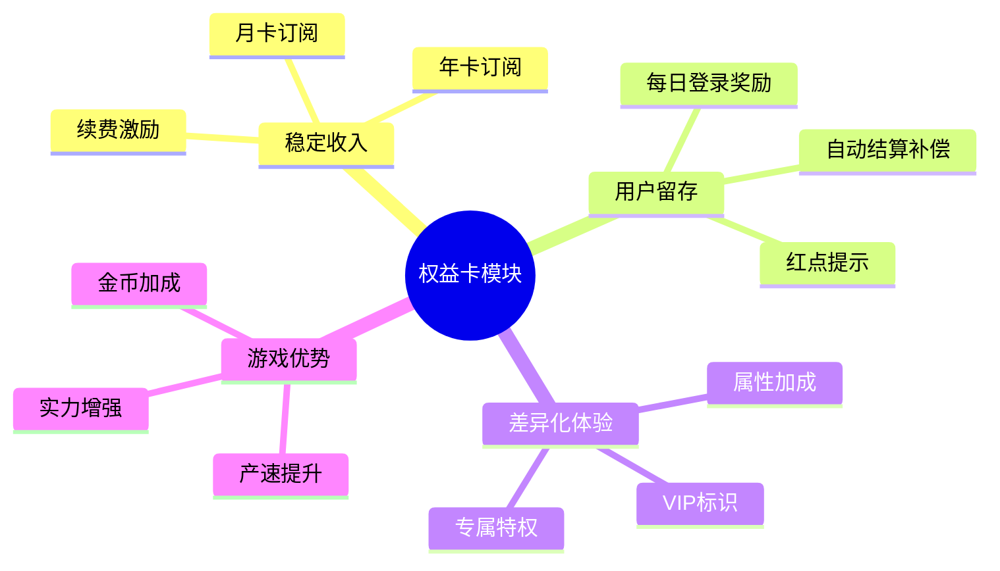
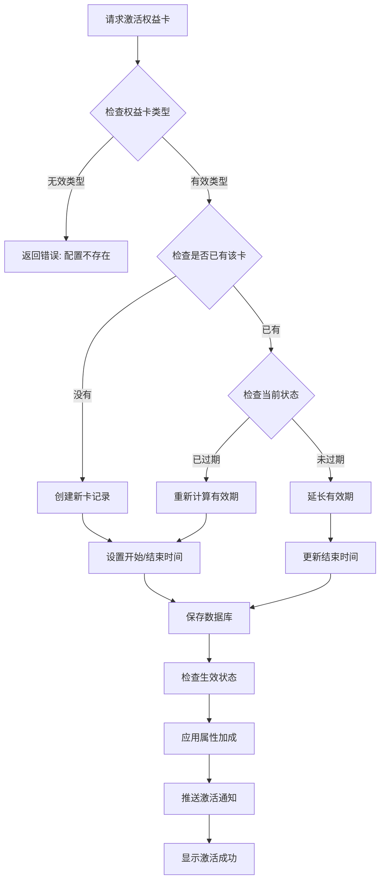
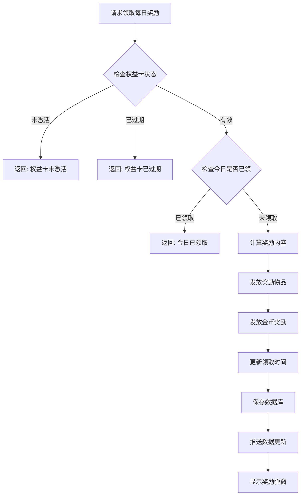
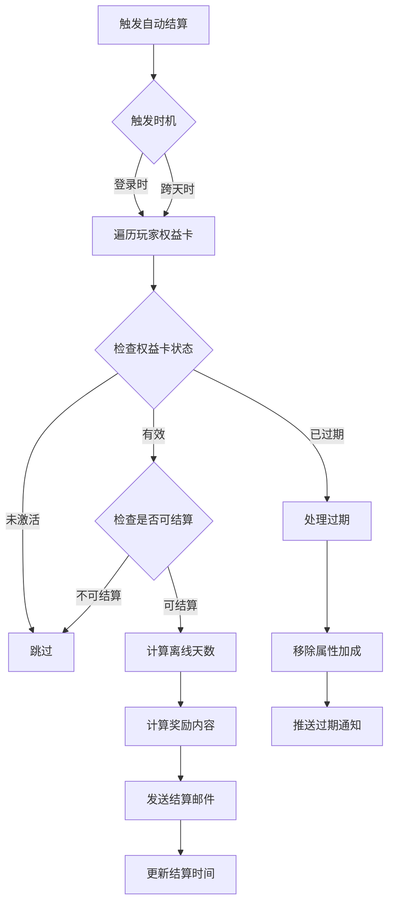
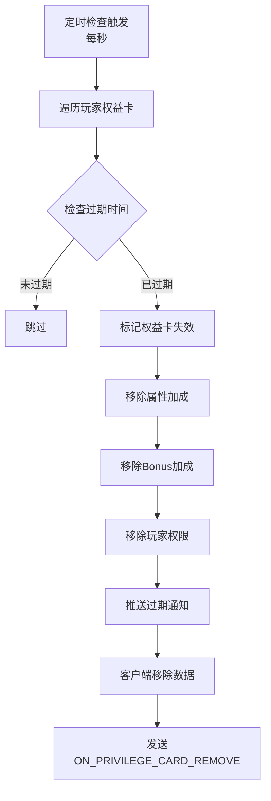
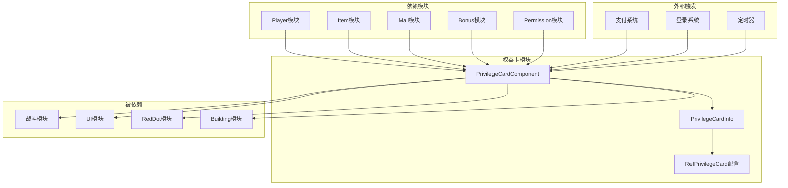

# 权益卡模块完整说明

## 一、模块概述

### 1.1 业务背景

权益卡模块是 K2C 游戏的会员订阅系统，负责管理玩家的权益卡数据。玩家可以通过购买月卡、年卡等权益卡获得持续的游戏福利，包括每日奖励、属性加成、特权功能等。权益卡是游戏重要的商业变现方式之一。

### 1.2 目标用户

| 用户类型 | 用户需求 | 核心价值 |
|---------|---------|---------|
| 付费玩家 | 购买权益卡享受特权 | 专属奖励、属性加成 |
| 活跃玩家 | 每日登录领取奖励 | 持续福利激励 |
| 运营人员 | 配置权益卡内容 | 灵活配置活动 |

### 1.3 核心价值



---

## 二、功能清单

### 2.1 权益卡管理功能

| 功能名称 | 功能描述 | 用户价值 |
|---------|---------|---------|
| 卡片激活 | 购买或激活权益卡 | 开始享受权益 |
| 有效期管理 | 管理权益卡剩余时间 | 了解权益状态 |
| 续费延期 | 续费延长有效期 | 连续享受权益 |
| 过期处理 | 权益卡过期自动处理 | 自动清理失效卡 |

### 2.2 权益卡类型功能

| 卡片类型 | 有效期 | 每日奖励 | 属性加成 | 特权 |
|---------|--------|---------|---------|------|
| 月卡 | 30天 | 钻石+体力+金币 | 产速+10% | 基础特权 |
| 年卡 | 365天 | 钻石+体力+金币（更多） | 产速+20%、实力+5% | 高级特权 |

### 2.3 特权功能

| 功能名称 | 功能描述 | 用户价值 |
|---------|---------|---------|
| 属性加成 | 提供属性提升 | 游戏实力增强 |
| 每日奖励 | 每天领取专属奖励 | 稳定资源获取 |
| 自动结算 | 离线期间自动累积奖励 | 不错过任何福利 |
| 特权标识 | 显示VIP身份 | 身份认同感 |
| 玩家权限 | 解锁专属功能 | 更多游戏内容 |

---

## 三、业务流程详解

### 3.1 权益卡激活流程



**详细步骤说明**：

| 步骤 | 操作 | 说明 |
|------|------|------|
| 1. 类型验证 | 验证权益卡类型是否有效 | 获取权益卡配置信息 |
| 2. 状态检查 | 检查玩家是否已有该类型权益卡 | 查询数据库记录 |
| 3. 有效期计算 | 计算新的过期时间 | 未过期累加，已过期重新计算 |
| 4. 数据保存 | 创建或更新权益卡记录 | 写入数据库 |
| 5. 生效处理 | 应用属性加成到玩家 | 更新玩家属性 |
| 6. 通知推送 | 推送激活成功通知 | 客户端更新显示 |

### 3.2 每日奖励领取流程



**详细步骤说明**：

| 步骤 | 操作 | 说明 |
|------|------|------|
| 1. 状态验证 | 检查权益卡是否激活且未过期 | 调用isEffect()方法 |
| 2. 领取检查 | 检查今日是否已领取 | 比较上次领取时间和今日0点 |
| 3. 奖励发放 | 发放配置的奖励物品 | 按配置列表发放 |
| 4. 金币发放 | 发放金币产速收益 | 按配置分钟数计算 |
| 5. 数据更新 | 更新领取时间戳 | 写入数据库 |
| 6. 推送通知 | 推送数据变化通知 | 客户端刷新状态 |

### 3.3 自动结算流程



**自动结算规则**：

| 规则 | 说明 |
|------|------|
| 结算范围 | 从上次领取时间到昨天23:59:59 |
| 当天不结算 | 当天奖励留给玩家手动领取 |
| 邮件发放 | 自动结算奖励通过邮件发放 |
| 包含金币 | 自动结算包含金币产速收益 |

### 3.4 权益卡过期流程



---

## 四、关键规则

### 4.1 权益卡规则

#### 有效期规则

| 卡片类型 | 有效天数 | 续费叠加方式 |
|---------|---------|-------------|
| 月卡 | 30天 | 未过期累加，已过期重新计算 |
| 年卡 | 365天 | 未过期累加，已过期重新计算 |

**有效期计算公式**：
```
新过期时间 = 当前已生效 ?
    原过期时间 + 有效天数 × 购买数量 × 86400 :
    当前时间 + 有效天数 × 购买数量 × 86400
```

#### 奖励规则

| 规则 | 说明 |
|------|------|
| 每日限制 | 每天只能领取一次 |
| 领取时间 | 以0点为界判断是否同一天 |
| 奖励内容 | 在配置表daily_gain_item_list中定义 |
| 金币奖励 | 根据daily_gain_silver_mins配置分钟数计算 |

#### 属性加成规则

| 规则 | 说明 |
|------|------|
| 生效时机 | 权益卡激活时立即生效 |
| 失效时机 | 权益卡过期时立即移除 |
| 叠加规则 | 多种权益卡属性可叠加 |

### 4.2 结算规则

#### 自动结算时机

| 时机 | 说明 |
|------|------|
| 登录时 | 玩家登录时调用autoSettleAll |
| 跨天时 | 服务端跨天事件触发 |

#### 自动结算限制

| 限制 | 说明 |
|------|------|
| 当天不结算 | 当天奖励留给玩家手动领取 |
| 截止时间 | 结算到昨天23:59:59 |
| 邮件发送 | 结算奖励通过邮件发放 |

---

## 五、用户故事

### 5.1 月卡玩家故事

> 作为一名月卡玩家，我购买了30天的月卡。每天登录游戏，我都能领取月卡专属奖励，包括钻石和道具。这让我每天都有动力登录游戏。月卡还给了我10%的产速加成，让我资源积累更快。30天快到了，我准备续费月卡。

**关键体验点**：
- 购买后立即生效
- 每日登录领取奖励
- 产速提升感知明显
- 续费延期方便

### 5.2 年卡玩家故事

> 作为一名长期玩家，我直接购买了年卡。年卡比月卡更划算，不仅价格优惠，还赠送了额外的特权。每天我都能领取更丰厚的奖励，还有专属的年卡标识。一年的权益让我可以安心游戏，不用担心每月续费。

**关键体验点**：
- 长期权益更优惠
- 更多特权功能
- 专属标识彰显身份
- 无需频繁续费

### 5.3 自动结算体验

> 作为一名忙碌的玩家，有时候我可能一两天没时间登录游戏。权益卡的自动结算功能让我不会错过任何奖励。等我再次登录时，离线期间的奖励都会通过邮件自动发放给我。这种贴心的设计让我感觉游戏很人性化。

**关键体验点**：
- 离线不损失奖励
- 邮件自动发放
- 无需担心错过

---

## 六、示例场景

### 6.1 月卡激活示例

**输入数据**：
- 玩家ID：20001
- 权益卡类型：MONTH（月卡）
- 购买数量：1

**配置数据**：
```json
{
  "privilege_card_type": "MONTH",
  "effect_days": 30,
  "daily_gain_item_list": [
    {"itemType": "CURRENCY", "itemId": 1, "count": 100},
    {"itemType": "CURRENCY", "itemId": 2, "count": 50}
  ],
  "daily_gain_silver_mins": 60,
  "bonus_prop_modifier": {
    "bonusType": "SPEED",
    "value": 100,
    "ratio": 0.1
  }
}
```

**激活结果**：
```
权益卡类型：MONTH
开始时间：2026-04-12 10:00:00
结束时间：2026-05-12 10:00:00（30天后）
属性加成：产速+10%
状态：已激活
```

### 6.2 续费延期示例

**初始状态**：
```
权益卡类型：MONTH
结束时间：2026-04-20 10:00:00（还有8天）
```

**续费操作**：购买1张月卡

**续费结果**：
```
结束时间：2026-05-20 10:00:00（原结束时间+30天）
```

### 6.3 每日奖励领取示例

**初始状态**：
```
权益卡类型：MONTH
上次领取时间：2026-04-11 10:00:00
当前时间：2026-04-12 10:00:00
```

**领取操作**：点击领取每日奖励

**领取结果**：
```
获得奖励：
  - 钻石 x 100
  - 体力 x 50
  - 金币 x 60分钟产速收益
更新后：
  - 上次领取时间：2026-04-12 10:00:00
```

### 6.4 自动结算示例

**初始状态**：
```
权益卡类型：MONTH
上次领取时间：2026-04-10 10:00:00
当前时间：2026-04-12 10:00:00（离线2天）
```

**登录触发自动结算**：
```
结算天数：2天（4-10到4-11，不含当天4-12）
发送邮件内容：
  - 钻石 x 200（100×2天）
  - 体力 x 100（50×2天）
  - 金币 x 120分钟产速收益
更新后：
  - 上次领取时间：2026-04-11 23:59:59
```

### 6.5 年卡属性加成叠加示例

**玩家权益卡状态**：
```
月卡：激活中
  - 产速+10%
  - 每日奖励：钻石100、体力50

年卡：激活中
  - 产速+20%
  - 实力+5%
  - 每日奖励：钻石200、体力100
```

**最终属性加成**：
```
产速加成：+30%（月卡10% + 年卡20%）
实力加成：+5%（年卡提供）
每日奖励：可分别领取月卡和年卡奖励
```

---

## 七、模块关系图



---

## 八、常见问题FAQ

| 问题 | 答案 |
|------|------|
| 权益卡过期后还能续费吗？ | 可以，续费后从当前时间重新计算有效期 |
| 多种权益卡的属性加成会叠加吗？ | 会，月卡和年卡的属性加成可以叠加 |
| 离线期间的奖励会丢失吗？ | 不会，自动结算会通过邮件补发离线奖励 |
| 当天的奖励可以自动结算吗？ | 不可以，当天的奖励需要玩家手动领取 |
| 续费时有效期如何计算？ | 未过期时累加到原有效期后，已过期时从当前时间重新计算 |

---

*文档生成时间: 2026-04-12*