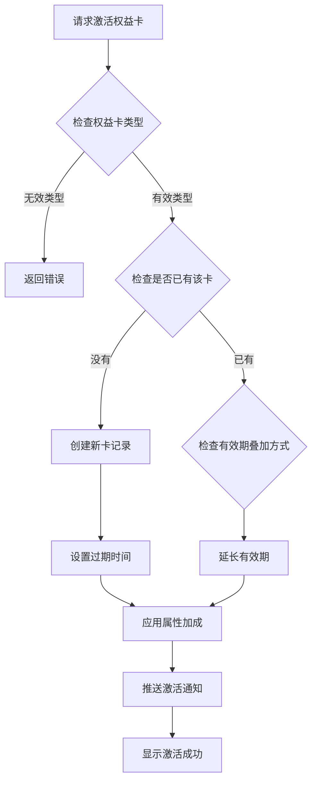
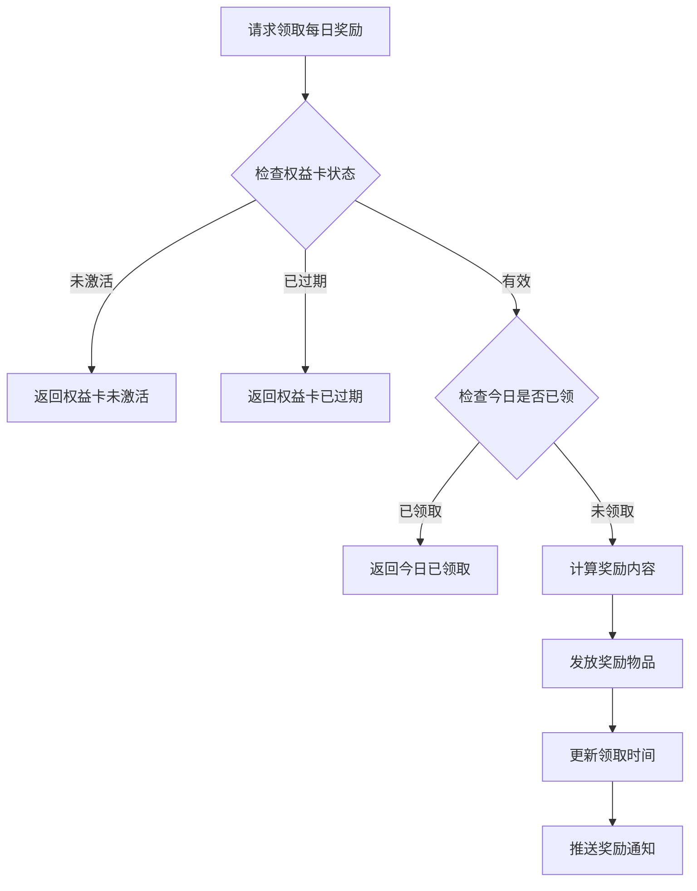
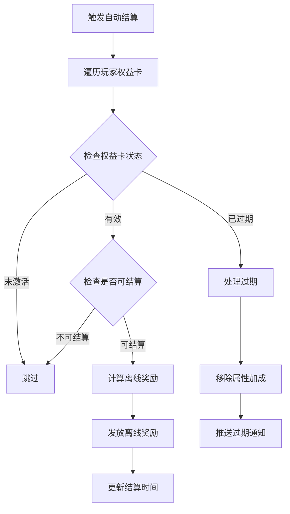
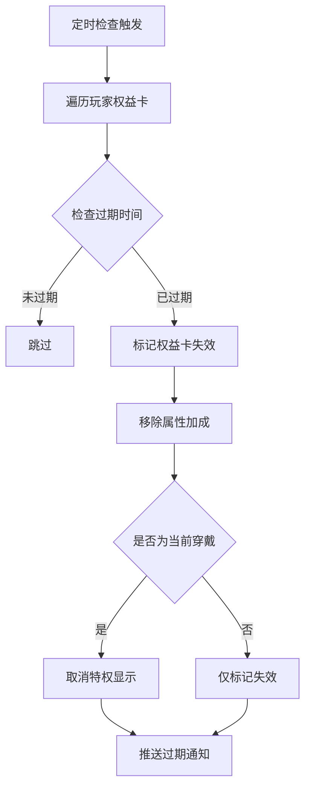

# 权益卡模块完整说明

## 一、模块概述

### 1.1 业务背景

权益卡模块是 K2C 游戏的会员订阅系统，负责管理玩家的权益卡数据。玩家可以通过购买月卡、年卡等权益卡获得持续的游戏福利，包括每日奖励、属性加成、特权功能等。权益卡是游戏重要的商业变现方式之一。

### 1.2 目标用户

- **付费玩家**：购买权益卡享受特权的核心用户
- **活跃玩家**：权益卡提供每日奖励激励登录
- **运营人员**：配置权益卡内容和活动

### 1.3 核心价值

1. **稳定收入**：权益卡提供稳定的订阅收入
2. **用户留存**：每日奖励激励玩家持续登录
3. **差异化体验**：付费用户享受更多特权
4. **属性加成**：提供实质性的游戏优势

---

## 二、功能清单

### 2.1 权益卡管理功能

| 功能名称 | 功能描述 | 用户价值 |
|---------|---------|---------|
| 卡片激活 | 购买或激活权益卡 | 开始享受权益 |
| 有效期管理 | 管理权益卡剩余时间 | 了解权益状态 |
| 每日奖励 | 每日领取专属奖励 | 持续获取福利 |
| 自动结算 | 离线期间自动累积奖励 | 不错过任何福利 |

### 2.2 权益卡类型功能

| 功能名称 | 功能描述 | 用户价值 |
|---------|---------|---------|
| 月卡 | 30天有效期，每日奖励 | 经济实惠的选择 |
| 年卡 | 365天有效期，每日奖励 | 长期玩家的最优选择 |

### 2.3 特权功能

| 功能名称 | 功能描述 | 用户价值 |
|---------|---------|---------|
| 属性加成 | 提供属性提升 | 游戏实力增强 |
| 每日奖励 | 每天领取专属奖励 | 稳定资源获取 |
| 特权标识 | 显示VIP身份 | 身份认同感 |

---

## 三、业务流程详解

### 3.1 权益卡激活流程



**详细步骤说明**：

1. **类型验证**
   - 验证权益卡类型是否有效
   - 获取权益卡配置信息

2. **状态检查**
   - 检查玩家是否已有该类型权益卡
   - 计算新的过期时间

3. **激活处理**
   - 创建或更新权益卡记录
   - 应用属性加成到玩家

4. **通知推送**
   - 推送激活成功通知
   - 触发相关事件

### 3.2 每日奖励领取流程



**详细步骤说明**：

1. **状态验证**
   - 检查权益卡是否激活
   - 检查权益卡是否过期

2. **领取检查**
   - 检查今日是否已领取
   - 对比上次领取时间和今日日期

3. **奖励发放**
   - 根据配置计算奖励内容
   - 发放奖励到玩家背包

4. **数据更新**
   - 更新领取时间
   - 更新累计领取天数

### 3.3 自动结算流程



### 3.4 权益卡过期流程



---

## 四、关键规则

### 4.1 权益卡规则

1. **有效期规则**
   - 月卡：30天有效期
   - 年卡：365天有效期
   - 可叠加：续费时延长有效期

2. **奖励规则**
   - 每日奖励每天只能领取一次
   - 奖励内容在配置中定义
   - 累计领取天数记录玩家忠诚度

3. **属性加成规则**
   - 权益卡激活时立即生效
   - 权益卡过期时立即移除
   - 多种权益卡属性可叠加

### 4.2 结算规则

1. **自动结算**
   - 跨天时自动结算未领取奖励
   - 最多累积一定天数的奖励

2. **过期处理**
   - 过期后无法继续领取奖励
   - 过期前累积的奖励可补领

---

## 五、用户故事

### 5.1 月卡玩家故事

> 作为一名月卡玩家，我购买了30天的月卡。每天登录游戏，我都能领取月卡专属奖励，包括钻石和道具。这让我每天都有动力登录游戏。月卡还给了我10%的产速加成，让我资源积累更快。30天快到了，我准备续费月卡。

### 5.2 年卡玩家故事

> 作为一名长期玩家，我直接购买了年卡。年卡比月卡更划算，不仅价格优惠，还赠送了额外的特权。每天我都能领取更丰厚的奖励，还有专属的年卡标识。一年的权益让我可以安心游戏，不用担心每月续费。

### 5.3 自动结算体验

> 作为一名忙碌的玩家，有时候我可能一两天没时间登录游戏。权益卡的自动结算功能让我不会错过任何奖励。等我再次登录时，离线期间的奖励都会自动发放给我。这种贴心的设计让我感觉游戏很人性化。

---

## 六、示例

### 6.1 月卡激活示例

**输入数据**：
- 玩家ID：20001
- 权益卡类型：MONTH（月卡）

**配置数据**：
```json
{
  "id": 1,
  "cardType": "MONTH",
  "duration_days": 30,
  "daily_reward": {
    "items": [
      {"itemId": 1001, "count": 100},  // 100钻石
      {"itemId": 2001, "count": 50}    // 50体力
    ]
  },
  "bonus_prop_modifier": {
    "bonusType": "SPEED",
    "value": 100,
    "ratio": 0.1
  }
}
```

**激活结果**：
```
权益卡类型：MONTH
过期时间：2026-05-07 10:00:00（30天后）
激活时间：2026-04-07 10:00:00
属性加成：产速+10%
累计获得天数：0
```

### 6.2 每日奖励领取示例

**初始状态**：
```
权益卡类型：MONTH
上次领取时间：2026-04-06 10:00:00
当前时间：2026-04-07 10:00:00
```

**领取操作**：
- 请求领取每日奖励

**领取结果**：
```
获得奖励：
  - 钻石 x 100
  - 体力 x 50
更新后：
  - 上次领取时间：2026-04-07 10:00:00
  - 累计获得天数：1
```

### 6.3 年卡属性加成示例

**玩家权益卡状态**：
```
月卡：激活中，产速+10%
年卡：激活中，产速+20%，实力+5%
```

**最终属性加成**：
```
产速加成：+30%（月卡10% + 年卡20%）
实力加成：+5%（年卡提供）
```

---

*文档生成时间: 2026-04-07*
