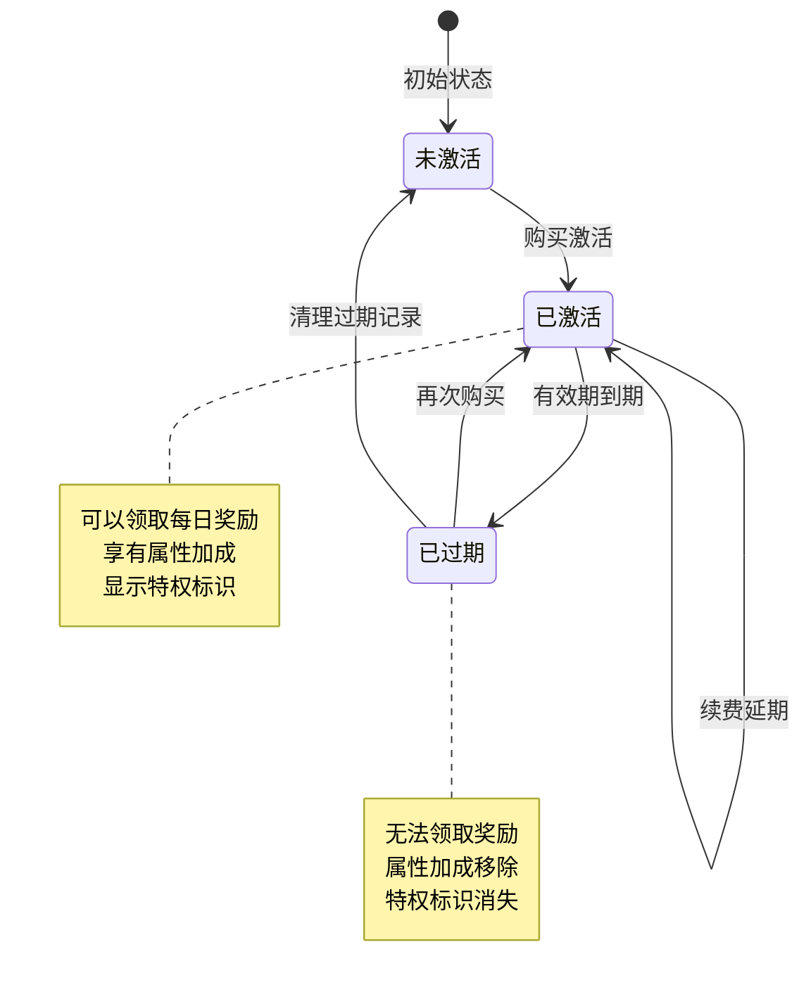
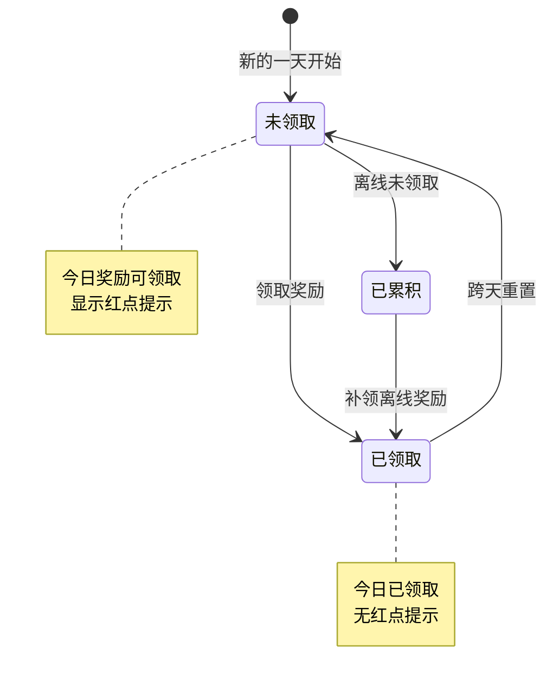
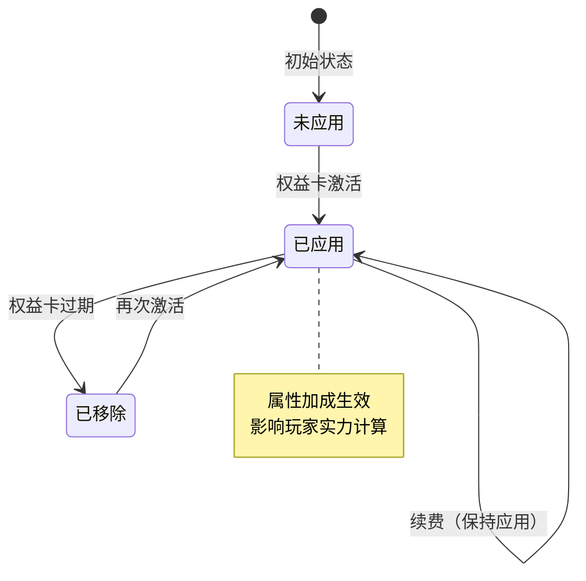
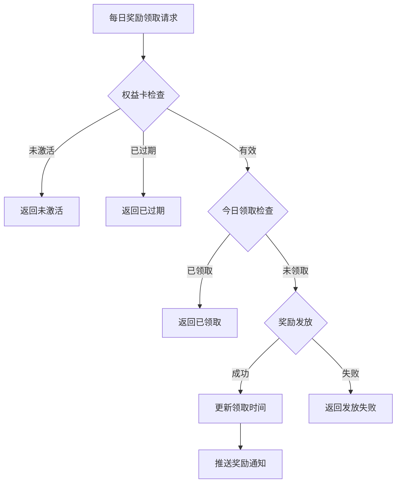

# 权益卡模块实现细节

## 一、计算公式

### 1.1 过期时间计算公式

```
新过期时间 = 根据当前状态计算
```

**计算逻辑**：
- 无权益卡：新过期时间 = 当前时间 + 有效期天数
- 有权益卡（未过期）：新过期时间 = 原过期时间 + 有效期天数
- 有权益卡（已过期）：新过期时间 = 当前时间 + 有效期天数

**示例计算**：
```
有效期：30天
当前时间：2026-04-07 10:00:00

情况1 - 无权益卡：
  新过期时间 = 2026-04-07 10:00:00 + 30天 = 2026-05-07 10:00:00

情况2 - 有权益卡（未过期，原过期时间：2026-04-15 10:00:00）：
  新过期时间 = 2026-04-15 10:00:00 + 30天 = 2026-05-15 10:00:00

情况3 - 有权益卡（已过期，原过期时间：2026-04-01 10:00:00）：
  新过期时间 = 2026-04-07 10:00:00 + 30天 = 2026-05-07 10:00:00
```

### 1.2 每日奖励可领取判断公式

```
可领取 = 权益卡有效 AND (上次领取时间 == NULL OR 上次领取日期 != 今日日期)
```

**参数说明**：
- `权益卡有效`：过期时间 > 当前时间
- `上次领取日期`：上次领取时间的日期部分
- `今日日期`：当前时间的日期部分

### 1.3 离线奖励计算公式

```
离线奖励天数 = min(今日日期 - 上次结算日期, 最大累积天数)
```

**参数说明**：
- `今日日期`：当前时间的日期部分
- `上次结算日期`：上次自动结算的日期部分
- `最大累积天数`：配置的最大累积天数限制

---

## 二、状态机定义

### 2.1 权益卡状态机



### 2.2 每日奖励状态机



### 2.3 属性加成状态机



---

## 三、数据约束

### 3.1 权益卡配置约束

| 字段名 | 数据类型 | 取值范围 | 必填 | 唯一性 | 说明 |
|--------|----------|----------|------|--------|------|
| id | long | > 0 | 是 | 是 | 权益卡配置ID |
| cardType | string | MONTH/YEAR | 是 | 是 | 权益卡类型 |
| duration_days | int | > 0 | 是 | 否 | 有效天数 |
| daily_reward | object | 非空 | 是 | 否 | 每日奖励配置 |
| bonus_prop_modifier | object | - | 否 | 否 | 属性加成配置 |

### 3.2 玩家权益卡数据约束

| 字段名 | 数据类型 | 取值范围 | 必填 | 说明 |
|--------|----------|----------|------|------|
| id | BIGINT | > 0 | 是 | 记录主键 |
| cid | BIGINT | > 0 | 是 | 玩家CID |
| card_type | INT | 1-2 | 是 | 权益卡类型枚举值 |
| expire_time_s | INT | > 0 | 是 | 过期时间戳 |
| last_reward_time_s | INT | >= 0 | 是 | 上次领奖时间戳 |
| total_gain_days | INT | >= 0 | 是 | 累计获得天数 |

### 3.3 属性加成配置约束

| 字段名 | 数据类型 | 取值范围 | 必填 | 说明 |
|--------|----------|----------|------|------|
| bonusType | string | - | 是 | 加成属性类型 |
| value | long | >= 0 | 是 | 固定值加成 |
| ratio | float | 0.0-1.0 | 是 | 比例加成 |

### 3.4 每日奖励配置约束

| 字段名 | 数据类型 | 取值范围 | 必填 | 说明 |
|--------|----------|----------|------|------|
| items | array | 非空 | 是 | 奖励物品列表 |
| items[].itemId | long | > 0 | 是 | 物品ID |
| items[].count | int | > 0 | 是 | 物品数量 |

---

## 四、错误处理策略

### 4.1 权益卡模块错误码

| 错误码 | 错误信息 | 处理策略 | 用户提示 |
|--------|----------|----------|----------|
| 63001 | 权益卡配置不存在 | 检查卡片类型 | "权益卡类型无效" |
| 63002 | 权益卡未激活 | 检查激活状态 | "您未开通该权益卡" |
| 63003 | 权益卡已过期 | 检查过期时间 | "权益卡已过期，请续费" |
| 63004 | 今日奖励已领取 | 检查领取时间 | "今日奖励已领取" |
| 63005 | 属性加成配置错误 | 检查配置表 | "系统错误" |

### 4.2 每日奖励领取错误处理流程



### 4.3 过期处理策略

| 处理时机 | 处理方式 | 说明 |
|----------|----------|------|
| 登录时 | 检查所有权益卡 | 移除过期卡片的属性加成 |
| 定时检查 | 每分钟检查 | 实时处理过期 |
| 领取时 | 检查单个卡片 | 阻止过期卡片领取 |

---

## 五、关键代码示例

### 5.1 激活权益卡伪代码

```csharp
public Result GainCard(long playerId, EPrivilegeCardType cardType, int count)
{
    // 1. 获取权益卡配置
    RefPrivilegeCard cardRef = privilegeCardConfigDao.getByType(cardType);
    if (cardRef == null)
        return Result.Error(63001, "权益卡配置不存在");

    // 2. 获取已有权益卡
    PrivilegeCardInfo existingCard = privilegeCardDao.selectByPlayerAndType(playerId, cardType);

    int nowTimeS = TimeUtil.GetNowTimeSec();
    int addSeconds = cardRef.duration_days * 86400 * count;
    int newExpireTimeS;

    if (existingCard == null || existingCard.ExpireTimeS <= nowTimeS)
    {
        // 新卡或已过期：从当前时间开始计算
        newExpireTimeS = nowTimeS + addSeconds;
    }
    else
    {
        // 未过期：延长有效期
        newExpireTimeS = existingCard.ExpireTimeS + addSeconds;
    }

    if (existingCard == null)
    {
        // 3. 创建新权益卡
        PrivilegeCardInfo newCard = new PrivilegeCardInfo
        {
            Cid = playerId,
            CardType = cardType,
            ExpireTimeS = newExpireTimeS,
            LastRewardTimeS = 0,
            TotalGainDays = 0
        };
        privilegeCardDao.insert(newCard);

        // 4. 应用属性加成
        ApplyCardBonus(playerId, cardRef);
    }
    else
    {
        // 5. 更新已有权益卡
        existingCard.ExpireTimeS = newExpireTimeS;
        privilegeCardDao.update(existingCard);

        // 如果之前已过期，重新应用属性加成
        if (existingCard.ExpireTimeS <= nowTimeS)
        {
            ApplyCardBonus(playerId, cardRef);
        }
    }

    // 6. 推送通知
    PushCardChange(playerId, cardType, newExpireTimeS);

    return Result.Success();
}
```

### 5.2 领取每日奖励伪代码

```csharp
public Result GainDailyReward(long playerId, EPrivilegeCardType cardType)
{
    // 1. 获取权益卡信息
    PrivilegeCardInfo card = privilegeCardDao.selectByPlayerAndType(playerId, cardType);
    if (card == null)
        return Result.Error(63002, "权益卡未激活");

    // 2. 检查是否过期
    int nowTimeS = TimeUtil.GetNowTimeSec();
    if (card.ExpireTimeS <= nowTimeS)
        return Result.Error(63003, "权益卡已过期");

    // 3. 检查今日是否已领取
    DateTime now = DateTime.Now;
    DateTime lastRewardDate = TimeUtil.UnixTimeStampToDateTime(card.LastRewardTimeS);
    if (lastRewardDate.Date == now.Date)
        return Result.Error(63004, "今日奖励已领取");

    // 4. 获取权益卡配置
    RefPrivilegeCard cardRef = privilegeCardConfigDao.getByType(cardType);

    // 5. 发放奖励
    List<RewardItem> rewards = new List<RewardItem>();
    foreach (var item in cardRef.daily_reward.items)
    {
        itemService.GiveItem(playerId, item.itemId, item.count);
        rewards.Add(new RewardItem { ItemId = item.itemId, Count = item.count });
    }

    // 6. 更新领取记录
    card.LastRewardTimeS = nowTimeS;
    card.TotalGainDays++;
    privilegeCardDao.update(card);

    // 7. 推送奖励通知
    PushDailyRewardResult(playerId, cardType, rewards);

    return Result.Success(rewards);
}
```

### 5.3 自动结算伪代码

```csharp
public void AutoSettleAll(long playerId)
{
    int nowTimeS = TimeUtil.GetNowTimeSec();
    DateTime now = DateTime.Now;

    // 获取所有权益卡
    List<PrivilegeCardInfo> cards = privilegeCardDao.selectByPlayer(playerId);

    foreach (PrivilegeCardInfo card in cards)
    {
        // 检查是否过期
        if (card.ExpireTimeS <= nowTimeS)
        {
            // 处理过期
            HandleCardExpired(playerId, card);
            continue;
        }

        // 检查是否有未领取的奖励
        DateTime lastRewardDate = TimeUtil.UnixTimeStampToDateTime(card.LastRewardTimeS);
        int offlineDays = (int)(now.Date - lastRewardDate.Date).TotalDays;

        if (offlineDays > 0 && offlineDays <= MAX_OFFLINE_DAYS)
        {
            // 发放离线奖励
            RefPrivilegeCard cardRef = privilegeCardConfigDao.getByType(card.CardType);
            for (int i = 0; i < offlineDays; i++)
            {
                foreach (var item in cardRef.daily_reward.items)
                {
                    itemService.GiveItem(playerId, item.itemId, item.count);
                }
            }

            // 更新领取记录
            card.LastRewardTimeS = nowTimeS;
            card.TotalGainDays += offlineDays;
            privilegeCardDao.update(card);
        }
    }
}
```

### 5.4 应用属性加成伪代码

```csharp
private void ApplyCardBonus(long playerId, RefPrivilegeCard cardRef)
{
    if (cardRef.bonus_prop_modifier == null)
        return;

    PlayerInfo player = playerService.GetPlayer(playerId);

    // 创建属性修改器
    NPPlayerPropertyModifier modifier = new NPPlayerPropertyModifier
    {
        PropertyType = GetPropertyType(cardRef.bonus_prop_modifier.bonusType),
        AddValue = cardRef.bonus_prop_modifier.value,
        AddRatio = cardRef.bonus_prop_modifier.ratio
    };

    // 应用到玩家属性容器
    player.PropertyContainer.AddModifier(modifier, $"PrivilegeCard_{cardRef.cardType}");
}
```

### 5.5 检查权益卡有效性伪代码

```csharp
public bool IsCardValid(PrivilegeCardInfo card)
{
    if (card == null)
        return false;

    return card.ExpireTimeS > TimeUtil.GetNowTimeSec();
}

public bool CanGetDailyReward(PrivilegeCardInfo card)
{
    if (!IsCardValid(card))
        return false;

    DateTime now = DateTime.Now;
    if (card.LastRewardTimeS <= 0)
        return true;

    DateTime lastRewardDate = TimeUtil.UnixTimeStampToDateTime(card.LastRewardTimeS);
    return lastRewardDate.Date != now.Date;
}
```

---

## 六、跨模块依赖

### 6.1 依赖模块

| 模块名称 | 依赖类型 | 依赖说明 |
|----------|----------|----------|
| Player模块 | 强依赖 | 需要获取玩家数据和属性容器 |
| Item模块 | 强依赖 | 发放奖励需要调用物品模块 |
| Config模块 | 强依赖 | 需要读取权益卡配置表 |
| Pay模块 | 弱依赖 | 购买权益卡时触发激活 |

### 6.2 被依赖关系

| 模块名称 | 被依赖方式 | 说明 |
|----------|------------|------|
| 战斗模块 | 属性查询 | 战斗中应用权益卡属性加成 |
| RedDot模块 | 红点触发 | 可领取奖励时触发红点 |
| UI模块 | 状态展示 | 显示权益卡状态和倒计时 |
| Login模块 | 登录处理 | 登录时触发自动结算 |

### 6.3 接口定义

```csharp
// 供其他模块调用的接口
public interface IPrivilegeCardService
{
    // 激活权益卡
    Result GainCard(long playerId, EPrivilegeCardType cardType, int count);

    // 领取每日奖励
    Result GainDailyReward(long playerId, EPrivilegeCardType cardType);

    // 检查权益卡是否有效
    bool IsCardValid(PrivilegeCardInfo card);

    // 检查是否可领取每日奖励
    bool CanGetDailyReward(PrivilegeCardInfo card);

    // 获取权益卡信息
    PrivilegeCardInfo GetCardInfo(long playerId, EPrivilegeCardType cardType);

    // 获取所有权益卡
    List<PrivilegeCardInfo> GetAllCards(long playerId);

    // 获取属性加成值
    long GetAddPropValue(EPrivilegeCardType cardType, EBonusPropertyType propType);
}
```

---

*文档生成时间: 2026-04-07*
