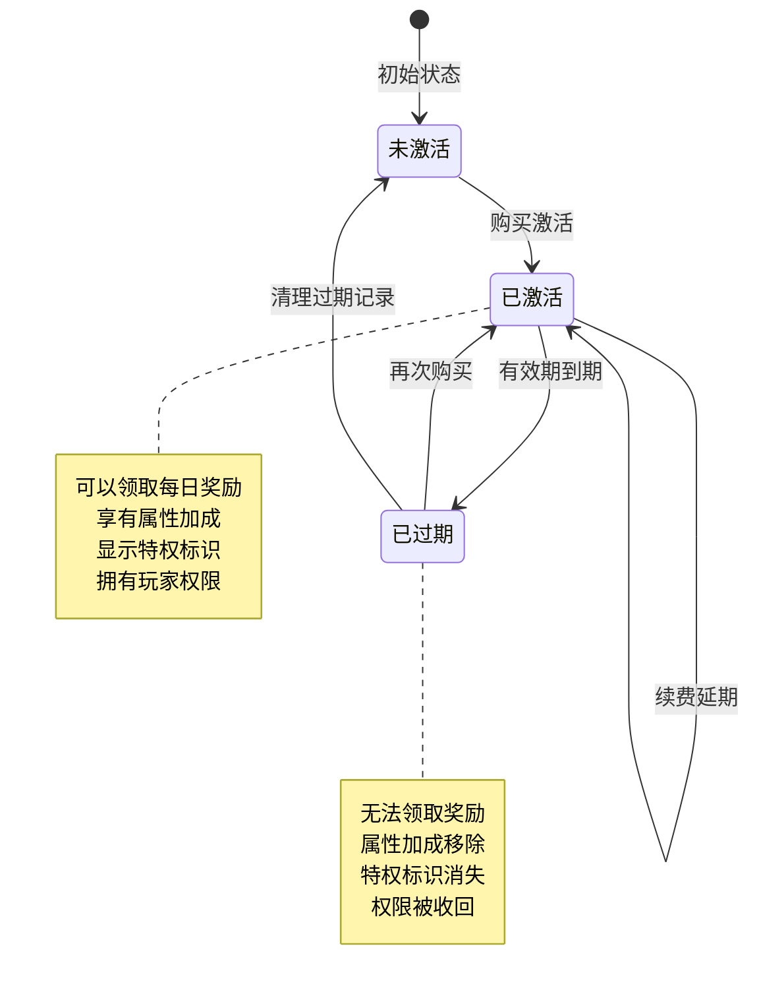
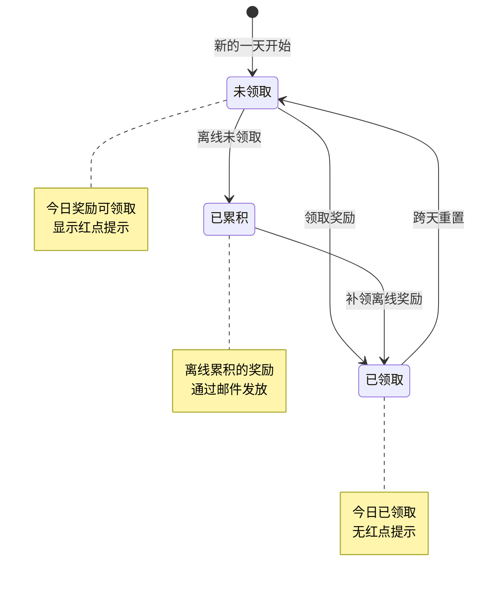
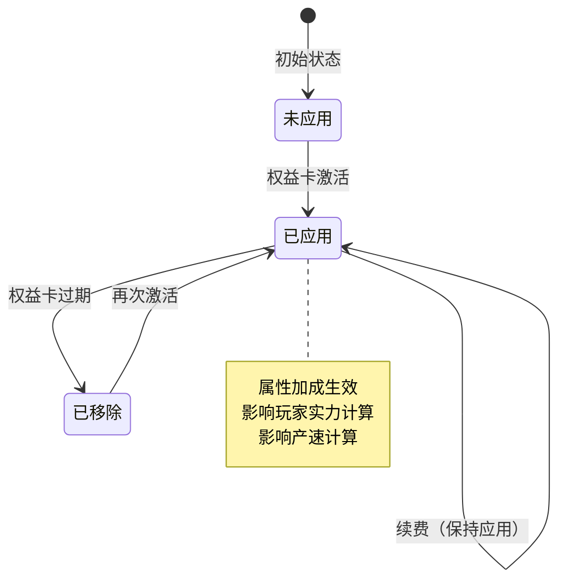
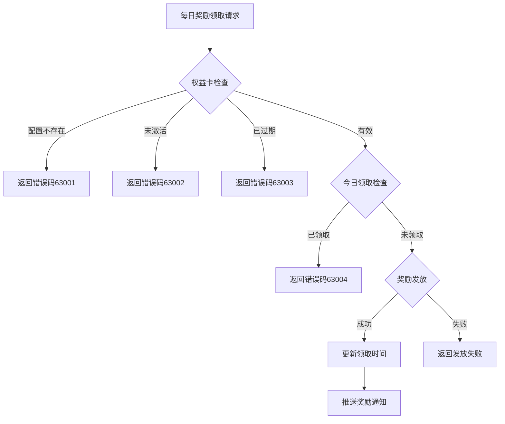

# 权益卡模块实现细节

## 一、计算公式

### 1.1 过期时间计算公式

```
新过期时间 = 根据当前状态计算
```

**计算逻辑**：

| 状态 | 计算公式 |
|------|----------|
| 无权益卡 | `新过期时间 = 当前时间 + 有效期天数 × 86400 × 购买数量` |
| 有权益卡（未过期） | `新过期时间 = 原过期时间 + 有效期天数 × 86400 × 购买数量` |
| 有权益卡（已过期） | `新过期时间 = 当前时间 + 有效期天数 × 86400 × 购买数量` |

**示例计算**：
```
有效期：30天
购买数量：1
当前时间：2026-04-12 10:00:00（时间戳：1744426800）

情况1 - 无权益卡：
  新过期时间 = 1744426800 + 30 × 86400 = 1747020000
  日期表示：2026-05-12 10:00:00

情况2 - 有权益卡（未过期，原过期时间：2026-04-20 10:00:00）：
  新过期时间 = 1745031600 + 30 × 86400 = 1747624800
  日期表示：2026-05-20 10:00:00

情况3 - 有权益卡（已过期，原过期时间：2026-04-01 10:00:00）：
  新过期时间 = 1744426800 + 30 × 86400 = 1747020000
  日期表示：2026-05-12 10:00:00
```

### 1.2 每日奖励可领取判断公式

```
可领取 = 权益卡有效 AND (上次领取时间 == 0 OR 上次领取日期 != 今日日期)
```

**参数说明**：

| 参数 | 说明 |
|------|------|
| 权益卡有效 | `过期时间 > 当前服务器时间` |
| 上次领取日期 | 上次领取时间的日期部分（以0点为界） |
| 今日日期 | 当前服务器时间的日期部分 |

**代码实现**：
```java
// 服务端判断
public boolean canGetDailyReward()
{
    if (!isEffect()) return false;

    int nowS = CommonFunc.getNowTimeSec();
    int nowZeroS = CommonFunc.getZeroClockS(nowS);

    return _m_lLastGainDailyRewardS <= nowZeroS;
}
```

```csharp
// 客户端判断
public bool canGetRewardToday
{
    get
    {
        return isActivate &&
            (_m_lLastGainDailyRewardS == 0 ||
             !TimeUtil.serverTimeMsIsInSameDay(_m_lLastGainDailyRewardS * 1000,
                 FpsAndPingMgr.instance.serverTimeTag));
    }
}
```

### 1.3 自动结算计算公式

```
离线奖励天数 = min(结算截止时间对应的天数 - 上次结算天数, 最大累积天数)
```

**计算逻辑**：

```
结算开始时间 = max(上次领取时间, 权益卡开始时间)
结算截止时间 = min(权益卡结束时间, 昨天23:59:59)
离线天数 = 天数差(结算开始时间, 结算截止时间) + 1
```

**示例计算**：
```
权益卡时间范围：2026-04-01 00:00:00 ~ 2026-05-01 00:00:00
上次领取时间：2026-04-10 10:00:00
当前时间：2026-04-13 10:00:00

结算开始时间：2026-04-10 10:00:00（上次领取时间）
结算截止时间：2026-04-12 23:59:59（昨天最后时刻）
离线天数 = 天数差(4-10, 4-12) + 1 = 2 + 1 = 3天

发放奖励 = 每日奖励 × 3天
```

### 1.4 金币收益计算公式

```
金币收益 = 产速 × 每日可领取分钟数 × 60秒
```

**示例计算**：
```
玩家产速：100金币/秒
每日可领取分钟数：60分钟

每日金币收益 = 100 × 60 × 60 = 360000金币
```

---

## 二、状态机定义

### 2.1 权益卡状态机



**状态转换触发条件**：

| 当前状态 | 触发事件 | 目标状态 | 执行操作 |
|---------|---------|---------|---------|
| 未激活 | 购买权益卡 | 已激活 | 设置时间、应用属性 |
| 已激活 | 续费 | 已激活 | 延长有效期 |
| 已激活 | 过期时间到 | 已过期 | 移除属性、推送通知 |
| 已过期 | 再次购买 | 已激活 | 重新计算时间、应用属性 |

### 2.2 每日奖励状态机



### 2.3 属性加成状态机



---

## 三、数据约束

### 3.1 权益卡配置约束

| 字段名 | 数据类型 | 取值范围 | 必填 | 唯一性 | 说明 |
|--------|----------|----------|------|--------|------|
| privilege_card_type | enum | MONTH/YEAR | 是 | 是 | 权益卡类型（主键） |
| effect_days | long | > 0 | 是 | 否 | 有效天数 |
| daily_gain_item_list | array | 非空 | 是 | 否 | 每日奖励配置 |
| daily_gain_silver_mins | int | >= 0 | 是 | 否 | 每日金币分钟数 |
| player_pro | object | - | 否 | 否 | 玩家属性配置 |
| bonus_prop_modifier | object | - | 否 | 否 | 属性加成配置 |
| player_permission_list | array | - | 否 | 否 | 玩家权限列表 |
| mail_id | long | > 0 | 是 | 否 | 自动结算邮件ID |

### 3.2 玩家权益卡数据约束

| 字段名 | 数据类型 | 取值范围 | 必填 | 说明 |
|--------|----------|----------|------|------|
| id | BIGINT | > 0 | 是 | 记录主键（自增） |
| cid | BIGINT | > 0 | 是 | 玩家CID |
| cardType | INT | 1-2 | 是 | 权益卡类型枚举值 |
| startS | BIGINT | >= 0 | 是 | 生效开始时间戳 |
| endS | BIGINT | >= 0 | 是 | 生效结束时间戳 |
| lastGainDailyRewardS | BIGINT | >= 0 | 是 | 最后领取时间戳 |

### 3.3 属性加成配置约束

| 字段名 | 数据类型 | 取值范围 | 必填 | 说明 |
|--------|----------|----------|------|------|
| bonusType | string | 有效属性类型 | 是 | 加成属性类型 |
| value | long | >= 0 | 是 | 固定值加成 |
| ratio | float | 0.0-1.0 | 是 | 比例加成 |

### 3.4 每日奖励配置约束

| 字段名 | 数据类型 | 取值范围 | 必填 | 说明 |
|--------|----------|----------|------|------|
| itemType | enum | 有效物品类型 | 是 | 物品类型 |
| itemId | long | > 0 | 是 | 物品ID |
| count | int | > 0 | 是 | 物品数量 |

---

## 四、错误处理策略

### 4.1 权益卡模块错误码

| 错误码 | 错误名称 | 触发场景 | 处理策略 | 用户提示 |
|--------|----------|----------|----------|----------|
| 63001 | PRIVILEGE_CARD_NOT_FOUND | 配置不存在 | 检查配置表 | "权益卡类型无效" |
| 63002 | PRIVILEGE_CARD_NOT_EFFECT | 权益卡未激活或已过期 | 检查激活状态 | "权益卡未激活或已过期" |
| 63003 | PRIVILEGE_CARD_EXPIRED | 权益卡已过期 | 检查过期时间 | "权益卡已过期，请续费" |
| 63004 | PRIVILEGE_CARD_DAILY_REWARD_GAINED | 今日奖励已领取 | 检查领取时间 | "今日奖励已领取" |
| 63005 | PRIVILEGE_CARD_CONFIG_ERROR | 属性加成配置错误 | 检查配置表 | "系统错误" |

### 4.2 每日奖励领取错误处理流程



### 4.3 过期处理策略

| 处理时机 | 处理方式 | 说明 |
|----------|----------|------|
| 登录时 | 检查所有权益卡 | 移除过期卡片的属性加成 |
| 定时检查 | 每秒检查 | 实时处理过期 |
| 领取时 | 检查单个卡片 | 阻止过期卡片领取 |
| 协议推送时 | 检查状态 | 推送最新状态 |

### 4.4 错误处理代码示例

```java
// 服务端错误处理
public Result gainDailyReward(NPPlayerContext _context)
{
    getUserData().lockUser();

    try
    {
        // 检查激活状态
        if (!isEffect())
            return PlayerErr.PRIVILEGE_CARD_NOT_EFFECT; // 63002

        int nowS = CommonFunc.getNowTimeSec();
        int nowZeroS = CommonFunc.getZeroClockS(nowS);

        // 今天已经领取奖励
        if (_m_lLastGainDailyRewardS > nowZeroS)
            return PlayerErr.PRIVILEGE_CARD_DAILY_REWARD_GAINED; // 63004

        // ... 发放奖励逻辑

        return Result.SUCC;
    }
    finally
    {
        getUserData().unlockUser();
    }
}
```

```csharp
// 客户端错误处理
public void OnClickReward()
{
    NPPlayer.instance.privilegeCardComponent.reqGainPrivilegeCardDailyReward(
        EPrivilegeCardType.MONTH,
        (succ, msg) => {
            if (!succ)
            {
                switch (msg.getErrorCode())
                {
                    case 63002:
                        ShowTips("请先开通权益卡");
                        OpenPurchaseWindow();
                        break;
                    case 63004:
                        ShowTips("今日奖励已领取，请明天再来");
                        break;
                    default:
                        ShowTips("领取失败: " + msg.getErrorMsg());
                        break;
                }
                return;
            }
            ShowRewardEffect(msg.getRewardList());
        }
    );
}
```

---

## 五、关键代码示例

### 5.1 激活权益卡伪代码

```java
public void gainCard(EPrivilegeCardType _type, long _count, NPPlayerContext _context)
{
    // 1. 获取权益卡配置
    RefPrivilegeCard cardRef = RefPrivilegeCard.getMgr().get(_type.ordinal());
    if (cardRef == null)
    {
        USLog.error("权益卡配置不存在: {}", _type);
        return;
    }

    // 2. 获取已有权益卡
    PrivilegeCardInfo info = getPrivilegeCard(_type);

    // 3. 计算新的过期时间
    long nowS = CommonFunc.getNowTimeSec();
    long addSeconds = cardRef.effect_days * 86400 * _count;

    if (info.isEffect())
    {
        // 未过期：延长有效期
        info._m_lEndS += addSeconds;
    }
    else
    {
        // 已过期或新卡：重新计算
        info._m_lStartS = nowS;
        info._m_lEndS = nowS + addSeconds;
    }

    // 4. 保存数据库
    info._save();

    // 5. 检查生效状态
    info.checkEffective(true);

    // 6. 推送通知
    getUserData().sendMsgToGC(
        US2GCWriter_021_PlayerInfo.make_054_OnPrivilegeCardChg(info));
}
```

### 5.2 领取每日奖励伪代码

```java
public Result gainDailyReward(NPPlayerContext _context)
{
    // 1. 检查权益卡状态
    if (!isEffect())
        return PlayerErr.PRIVILEGE_CARD_NOT_EFFECT;

    // 2. 检查今日是否已领取
    int nowS = CommonFunc.getNowTimeSec();
    int nowZeroS = CommonFunc.getZeroClockS(nowS);
    if (_m_lLastGainDailyRewardS > nowZeroS)
        return PlayerErr.PRIVILEGE_CARD_DAILY_REWARD_GAINED;

    // 3. 更新领取时间
    _m_lLastGainDailyRewardS = nowS;
    _save();

    // 4. 推送数据更新
    getUserData().sendMsgToGC(
        US2GCWriter_021_PlayerInfo.make_054_OnPrivilegeCardChg(this));

    // 5. 发放物品奖励
    getUserData().gainItemList(_m_ref.daily_gain_item_list, _context);

    // 6. 发放金币奖励
    SpecialItemDealer_Gold goldDealer = getUserData().getSpecialItemComponent()
        .getDealer(ESpecialItemType.GOLD, SpecialItemDealer_Gold.class);
    if (goldDealer != null)
    {
        goldDealer.gainItemBySecs(_m_ref.daily_gain_silver_mins * 60, true, false, _context);
    }

    return Result.SUCC;
}
```

### 5.3 自动结算伪代码

```java
public void autoSettle(NPPlayerContext _context, StringBuilder _sb)
{
    // 1. 检查前置条件
    if (_m_ref == null) return;          // 配置不存在
    if (_m_lStartS <= 0) return;         // 从未生效

    // 2. 检查是否需要结算
    int lastDayZeroS = CommonFunc.getZeroClockSecByOffsetDays(1);
    if (_m_lLastGainDailyRewardS >= lastDayZeroS) return; // 昨天已领取

    // 3. 计算结算时间范围
    long settleStartS = Math.max(_m_lLastGainDailyRewardS, _m_lStartS);
    long lastDayLimitS = lastDayZeroS + 86400 - 1; // 昨天23:59:59
    long settleEndS = Math.min(_m_lEndS, lastDayLimitS);

    // 4. 更新领取时间
    _m_lLastGainDailyRewardS = lastDayLimitS;
    _save();

    // 5. 计算离线天数
    int diffDays = CommonFunc.getDayDiff(settleStartS * 1000, settleEndS * 1000) + 1;
    if (diffDays <= 0) return;

    // 6. 计算奖励内容
    ArrayList<NPCommonCostItem> itemList = new ArrayList<>();
    for (NPCommonCostItem item : _m_ref.daily_gain_item_list)
    {
        NPCommonCostItem gainItem = item.duplicate();
        gainItem.setCount(item.getCount() * diffDays);
        itemList.add(gainItem);
    }

    // 7. 添加金币奖励
    SpecialItemDealer_Gold goldDealer = getUserData().getSpecialItemComponent()
        .getDealer(ESpecialItemType.GOLD, SpecialItemDealer_Gold.class);
    if (goldDealer != null)
    {
        long earns = goldDealer.getEarnings();
        if (earns > 0)
        {
            itemList.add(new NPCommonCostItem(ENPItemType.CURRENCY,
                ECurrency.SILVER.ordinal(), earns * diffDays));
        }
    }

    // 8. 发送邮件
    Mail_Data mailData = new Mail_Data();
    mailData.setMailRefId(_m_ref.mail_id);
    mailData.getItemList().getItemList().addAll(CommonFunc.costItemListToProto(itemList));
    MailSystem.addMail(getUSServer(), getCid(), mailData, _context);
}
```

### 5.4 应用属性加成伪代码

```java
public void checkEffective(boolean _push)
{
    // 1. 检查是否已经生效
    if (_m_bEffective) return;
    if (!isEffect()) return;

    // 2. 标记生效
    _m_bEffective = true;

    // 3. 推送数据
    if (_push)
    {
        getUserData().sendMsgToGC(
            US2GCWriter_021_PlayerInfo.make_054_OnPrivilegeCardChg(this));
    }

    // 4. 应用属性加成
    if (_m_ref != null)
    {
        // 增加玩家属性
        getUserData().getPrivilegeCardComponent().getPlayerPropertyContainer()
            .addModifier(_m_ref.player_pro);

        // 增加Bonus属性
        getUserData().getBonusMgr().addTotalModifier(_m_ref.bonus_prop_modifier);

        // 增加玩家权限
        getUserData().getPlayerPermissionsComponent()
            .addPermissionList(_m_ref.player_permission_list, _push);
    }
}
```

### 5.5 检查权益卡有效性伪代码

```java
// 服务端检查
public boolean isEffect()
{
    return _m_ref != null && _m_lEndS > CommonFunc.getNowTimeSec();
}

public boolean canGetDailyReward()
{
    if (!isEffect()) return false;

    int nowS = CommonFunc.getNowTimeSec();
    int nowZeroS = CommonFunc.getZeroClockS(nowS);

    return _m_lLastGainDailyRewardS <= nowZeroS;
}
```

```csharp
// 客户端检查
public bool isActivate
{
    get { return _m_lEndS > 0 && FpsAndPingMgr.instance.serverTimeTagS <= _m_lEndS; }
}

public bool canGetRewardToday
{
    get
    {
        return isActivate &&
            (_m_lLastGainDailyRewardS == 0 ||
             !TimeUtil.serverTimeMsIsInSameDay(_m_lLastGainDailyRewardS * 1000,
                 FpsAndPingMgr.instance.serverTimeTag));
    }
}
```

---

## 六、跨模块依赖

### 6.1 依赖模块

| 模块名称 | 依赖类型 | 依赖说明 |
|----------|----------|----------|
| Player模块 | 强依赖 | 需要获取玩家数据和属性容器 |
| Item模块 | 强依赖 | 发放奖励需要调用物品模块 |
| Config模块 | 强依赖 | 需要读取权益卡配置表 |
| Mail模块 | 强依赖 | 自动结算需要发送邮件 |
| Bonus模块 | 强依赖 | 属性加成管理 |
| Permission模块 | 弱依赖 | 玩家权限管理 |
| Pay模块 | 弱依赖 | 购买权益卡时触发激活 |

### 6.2 被依赖关系

| 模块名称 | 被依赖方式 | 说明 |
|----------|------------|------|
| 战斗模块 | 属性查询 | 战斗中应用权益卡属性加成 |
| RedDot模块 | 红点触发 | 可领取奖励时触发红点 |
| UI模块 | 状态展示 | 显示权益卡状态和倒计时 |
| Login模块 | 登录处理 | 登录时触发自动结算 |
| Building模块 | 属性刷新 | 权益卡变化时刷新建筑属性 |

### 6.3 接口定义

```java
// 供其他模块调用的接口
public interface IPrivilegeCardService
{
    // 激活权益卡
    void gainCard(EPrivilegeCardType cardType, long count, NPPlayerContext context);

    // 领取每日奖励
    Result gainDailyReward(NPPlayerContext context);

    // 检查权益卡是否有效
    boolean isEffect();

    // 检查是否可领取每日奖励
    boolean canGetDailyReward();

    // 获取权益卡信息
    PrivilegeCardInfo getPrivilegeCard(EPrivilegeCardType cardType);

    // 获取属性加成值
    long getAddPropValue(EPrivilegeCardType cardType, EBonusPropertyType propType);

    // 构造协议数据
    void makeProto(ArrayList<PrivilegeCardObj_Info> list);
}
```

---

## 七、性能优化建议

### 7.1 数据库优化

| 优化项 | 建议 |
|--------|------|
| 索引 | 确保cid字段有索引 |
| 批量查询 | 登录时一次性加载所有权益卡 |
| 延迟写入 | 使用markField标记脏字段，批量更新 |

### 7.2 内存优化

| 优化项 | 建议 |
|--------|------|
| 数组存储 | 使用数组按枚举序号存储，避免Map开销 |
| 配置引用 | 权益卡信息只存储配置引用，不复制配置数据 |
| 懒加载 | 配置数据按需加载 |

### 7.3 网络优化

| 优化项 | 建议 |
|--------|------|
| 增量推送 | 只推送变化的权益卡数据 |
| 协议压缩 | 使用二进制协议减少传输量 |
| 合并推送 | 多个权益卡变化时合并推送 |

---

*文档生成时间: 2026-04-12*