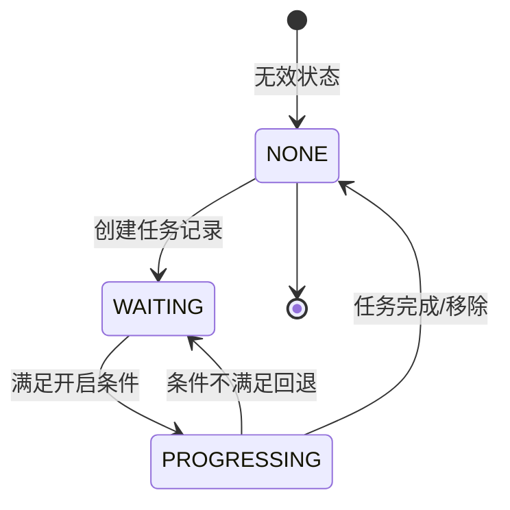
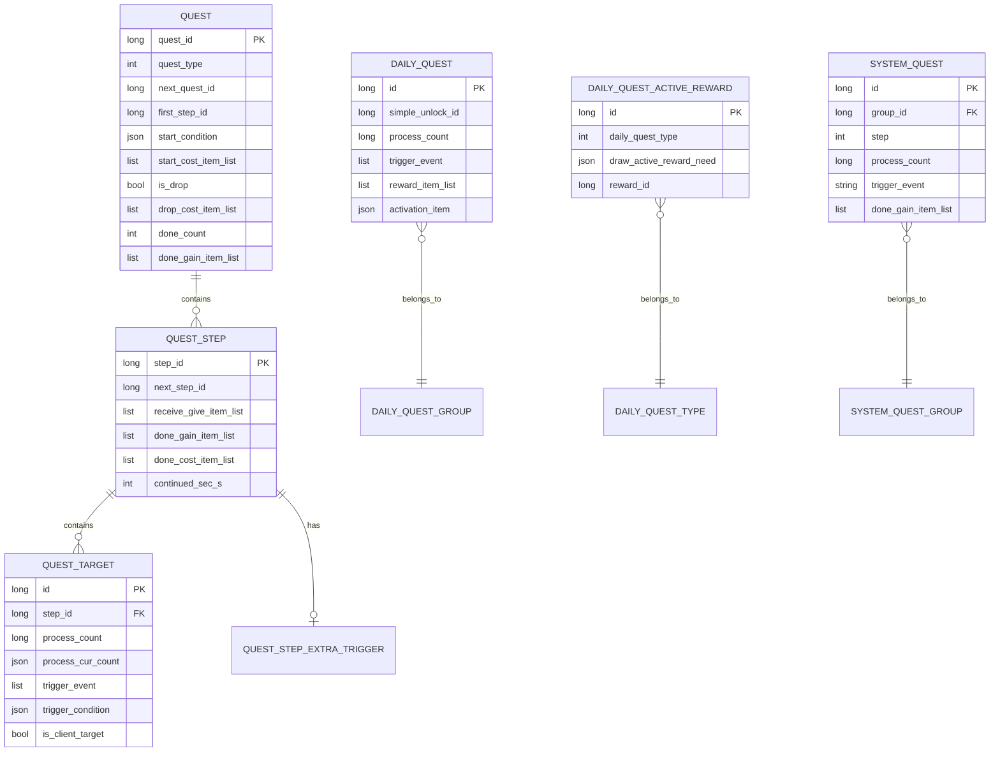
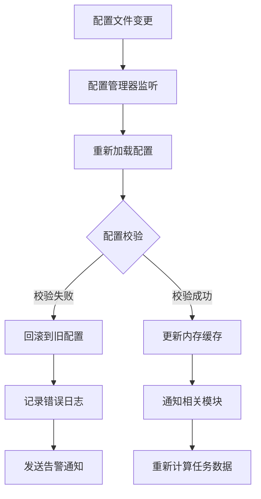

# 任务模块数据配表文档

## 配表说明

任务模块相关的配置数据主要存储在以下配表中。配表采用 JSON 格式，通过 RefTable 注解映射到对应的配置类。

---

## 一、任务配置表

### 1.1 RefQuest - 任务配置

**文件**: `quest.json`
**路径**: `game_server/GameRes/src/NPGameRes/Refs/Quest/RefQuest.java`

| 字段名 | 类型 | 说明 | 必填 | 示例 |
|--------|------|------|------|------|
| quest_id | long | 任务配置ID（主键） | 是 | 10001 |
| quest_type | EQuestType | 任务类型枚举 | 是 | MAIN |
| next_quest_id | long | 下一个任务ID，0表示无后续 | 是 | 10002 |
| first_step_id | long | 任务第一步步骤ID | 是 | 20001 |
| start_condition | NPPlayerConditionGroupObj | 开启条件（条件组对象） | 否 | {条件组} |
| start_cost_item_list | ArrayList&lt;NPCommonCostItem&gt; | 开启任务扣除的物品列表 | 否 | [{item:GOLD, count:100}] |
| is_drop | boolean | 是否可以主动放弃 | 是 | true/false |
| drop_cost_item_list | ArrayList&lt;NPCommonCostItem&gt; | 放弃任务扣除的物品列表 | 否 | [{item:GOLD, count:50}] |
| ext_drop_effect | NPPlayerEffectListParse | 放弃任务的额外效果 | 否 | {效果列表} |
| done_count | int | 可以完成的次数上限，0表示无限 | 是 | 1 |
| done_gain_item_list | ArrayList&lt;NPCommonCostItem&gt; | 完成任务奖励物品列表 | 否 | [{item:EXP, count:500}] |
| tip_reward | ENpRewardShowType | 奖励展示方式 | 否 | TIP/NORMAL |

**运行时字段**:

| 字段名 | 类型 | 说明 |
|--------|------|------|
| listStep | List&lt;RefQuestStep&gt; | 任务步骤列表（配置加载后填充） |

**任务类型枚举 EQuestType**:

| 枚举值 | 数值 | 说明 | 使用场景 |
|--------|------|------|----------|
| NONE | 0 | 无类型 | 默认值 |
| MAIN | 1 | 主线任务 | 引导玩家推进剧情，唯一进行中 |
| BRANCH | 2 | 支线任务 | 可选完成，多任务并行 |
| WISH | 3 | 心愿任务 | 玩家自选的特殊任务 |

---

### 1.2 RefQuestStep - 任务步骤配置

**文件**: `quest_step.json`
**路径**: `game_server/GameRes/src/NPGameRes/Refs/Quest/RefQuestStep.java`

| 字段名 | 类型 | 说明 | 必填 | 示例 |
|--------|------|------|------|------|
| step_id | long | 步骤配置ID（主键） | 是 | 20001 |
| next_step_id | long | 下一步步骤ID，0表示无后续 | 是 | 20002 |
| receive_give_item_list | ArrayList&lt;NPCommonCostItem&gt; | 进入步骤给予的物品 | 否 | [{item:KEY, count:1}] |
| done_gain_item_list | ArrayList&lt;NPCommonCostItem&gt; | 完成步骤奖励物品列表 | 否 | [{item:EXP, count:100}] |
| tip_reward | ENpRewardShowType | 奖励展示方式 | 否 | TIP/NORMAL |
| done_cost_item_list | ArrayList&lt;NPCommonCostItem&gt; | 完成步骤扣除的物品列表 | 否 | [{item:ENERGY, count:10}] |
| ext_done_effect | NPPlayerEffectListParse | 完成步骤后的额外效果 | 否 | {效果列表} |
| continued_sec_s | int | 步骤持续时间（秒），0表示永久 | 是 | 3600 |

**运行时字段**:

| 字段名 | 类型 | 说明 |
|--------|------|------|
| listTarget | List&lt;RefQuestTarget&gt; | 步骤目标列表（配置加载后填充） |

**步骤超时计算**:
```java
// getStepExpireTimeS() 方法
return continued_sec_s > 0 ? CommonFunc.getNowTimeSec() + continued_sec_s : 0;
```

---

### 1.3 RefQuestTarget - 任务目标配置

**文件**: `quest_target.json`
**路径**: `game_server/GameRes/src/NPGameRes/Refs/Quest/RefQuestTarget.java`

| 字段名 | 类型 | 说明 | 必填 | 示例 |
|--------|------|------|------|------|
| id | long | 目标配置ID（主键） | 是 | 30001 |
| step_id | long | 所属步骤ID | 是 | 20001 |
| process_count | long | 进度目标值（完成条件） | 是 | 3 |
| process_cur_count | NPPlayerVariableGroupObj | 进度当前值（高级公式） | 否 | {公式:击杀怪物数} |
| trigger_count_rate | NPCountRate | 触发器计数累计倍率 | 否 | 1.0 |
| trigger_event | ArrayList&lt;String&gt; | 触发器事件列表 | 是 | ["KILL_MONSTER"] |
| trigger_condition | NPPlayerConditionGroupObj | 触发器触发条件 | 否 | {怪物ID==1001} |
| ext_trigger_effect | NPPlayerEffectListParse | 触发时额外效果 | 否 | {效果列表} |
| is_client_target | boolean | 是否客户端判断的目标 | 是 | false |

**目标进度计算公式**:
```
当前进度 = 高级公式计算值(process_cur_count) + 服务端计数(curCount)
完成条件 = 当前进度 >= process_count
```

---

### 1.4 RefQuestStepExtraTrigger - 步骤额外触发配置

**文件**: `quest_step_extra_trigger.json`

| 字段名 | 类型 | 说明 | 必填 | 示例 |
|--------|------|------|------|------|
| step_id | long | 步骤ID（主键） | 是 | 20001 |
| trigger_event_list | ArrayList&lt;String&gt; | 触发事件列表 | 是 | ["PLAYER_LEVEL_UP"] |
| trigger_condition | NPPlayerConditionGroupObj | 触发条件 | 否 | {等级>=10} |
| ext_trigger_effect | NPPlayerEffectListParse | 触发效果 | 否 | {效果列表} |

---

## 二、日常任务配置表

### 2.1 RefDailyQuest - 日常任务配置

**文件**: `daily_quest.json`
**路径**: `game_server/GameRes/src/NPGameRes/Refs/Quest/DailyQuest/RefDailyQuest.java`

| 字段名 | 类型 | 说明 | 必填 | 示例 |
|--------|------|------|------|------|
| id | long | 任务配置ID（主键） | 是 | 40001 |
| simple_unlock_id | long | 解锁ID | 否 | 50001 |
| process_count | long | 进度目标值 | 是 | 3 |
| process_cur_count | NPPlayerVariableGroupObj | 进度当前值（高级公式） | 否 | {公式} |
| trigger_count_rate | NPCountRate | 触发器计数累计倍率 | 否 | 1.0 |
| trigger_event | ArrayList&lt;String&gt; | 触发器事件列表 | 是 | ["PASS_DUNGEON"] |
| trigger_condition | NPPlayerConditionGroupObj | 触发器触发条件 | 否 | {条件} |
| reward_item_list | ArrayList&lt;NPCommonCostItem&gt; | 奖励列表 | 否 | [{item:GOLD, count:100}] |
| activation_item | NPCommonCostItem | 完成获得活跃度 | 是 | {item:ACTIVE_POINT, count:10} |
| tip_reward | ENpRewardShowType | 奖励展示样式 | 否 | TIP |

---

### 2.2 RefDailyQuestActiveReward - 活跃度奖励配置

**文件**: `daily_quest_active_reward.json`
**路径**: `game_server/GameRes/src/NPGameRes/Refs/Quest/DailyQuest/RefDailyQuestActiveReward.java`

| 字段名 | 类型 | 说明 | 必填 | 示例 |
|--------|------|------|------|------|
| id | long | 配置ID（主键） | 是 | 1 |
| daily_quest_type | EDailyQuestType | 日常任务类型 | 是 | DAY |
| draw_active_reward_need | NPCommonCostItem | 领奖条件（需要达到的活跃度） | 是 | {count:20} |
| reward_id | long | 奖励ID | 是 | 60001 |

**日常任务类型枚举 EDailyQuestType**:

| 枚举值 | 数值 | 说明 |
|--------|------|------|
| NONE | 0 | 无类型 |
| DAY | 1 | 每日任务 |
| INN | 2 | 旅店任务 |
| TREASURE_HUNT | 3 | 太空寻宝任务 |

---

### 2.3 RefDailyQuestGroup - 日常任务组配置

**文件**: `daily_quest_group.json`

| 字段名 | 类型 | 说明 | 示例 |
|--------|------|------|------|
| id | long | 组ID | 1 |
| name | string | 组名称 | 每日任务 |
| quest_list | ArrayList&lt;Long&gt; | 任务ID列表 | [40001, 40002] |

---

### 2.4 RefDailyQuestRefresh - 日常任务刷新配置

**文件**: `daily_quest_refresh.json`

| 字段名 | 类型 | 说明 | 示例 |
|--------|------|------|------|
| id | long | 配置ID | 1 |
| refresh_cost | NPCommonCostItem | 刷新消耗 | {item:DIAMOND, count:10} |

---

## 三、系统任务配置表

### 3.1 RefSystemQuest - 系统任务配置

**文件**: `system_quest.json`
**路径**: `game_server/GameRes/src/NPGameRes/Refs/Quest/SystemQuest/RefSystemQuest.java`

| 字段名 | 类型 | 说明 | 必填 | 示例 |
|--------|------|------|------|------|
| id | long | 任务ID（主键） | 是 | 60001 |
| group_id | long | 所属组ID | 是 | 50001 |
| step | int | 任务步骤序号 | 是 | 1 |
| tip_reward | ENpRewardShowType | 奖励展示样式 | 否 | TIP |
| done_gain_item_list | List&lt;NPCommonCostItem&gt; | 奖励列表 | 否 | [{item:TITLE, count:1}] |
| process_count | long | 进度目标值 | 是 | 100 |
| process_cur_count | NPPlayerVariableGroupObj | 计数器的高级公式 | 否 | {公式} |
| trigger_count_rate | NPCountRate | 触发器计数累计倍率 | 否 | 1.0 |
| trigger_event | String | 触发器事件 | 是 | "KILL_MONSTER" |
| trigger_condition | NPPlayerConditionGroupObj | 触发条件 | 否 | {条件} |
| ext_trigger_effect | NPPlayerEffectListParse | 触发时额外效果 | 否 | {效果} |
| is_client_target | boolean | 是否客户端判断的目标值 | 是 | false |
| is_set | boolean | 是否设置值（默认false：使用变量） | 否 | false |

---

## 四、任务状态枚举

### 4.1 EQuestStatus - 任务状态

**路径**: `ClientProtocol/Common/QuestEnum/EQuestStatus.cs`

| 枚举值 | 数值 | 说明 | 使用场景 |
|--------|------|------|----------|
| NONE | 0 | 无状态 | 任务数据无效 |
| WAITING | 1 | 等待中 | 任务已创建但未满足开启条件 |
| PROGRESSING | 2 | 进行中 | 任务正在进行，有当前步骤 |



---

## 五、配表加载方式

### 5.1 服务端配表获取

```java
// 获取任务配置
RefQuest questRef = RefQuest.getMgr().get(questId);

// 获取步骤配置
RefQuestStep stepRef = RefQuestStep.getMgr().get(stepId);

// 获取目标配置
RefQuestTarget targetRef = RefQuestTarget.getMgr().get(targetId);

// 获取日常任务配置
RefDailyQuest dailyRef = RefDailyQuest.getMgr().get(dailyId);

// 获取系统任务配置
RefSystemQuest systemRef = RefSystemQuest.getMgr().get(systemId);

// 根据组ID和步骤获取系统任务
RefSystemQuest systemRef = RefSystemQuest.getMgr().getQuestRef(groupId, step);
```

### 5.2 客户端配表获取

```csharp
// 获取任务配置
QuestRefObj questRef = GRefdataCoreMgr.instance.questMap.getRef(questId);

// 获取步骤配置
QuestStepRefObj stepRef = GRefdataCoreMgr.instance.questStepMap.getRef(stepId);

// 获取目标配置
QuestTargetRefObj targetRef = GRefdataCoreMgr.instance.questTargetMap.getRef(targetId);
```

---

## 六、配表关系图



---

## 七、配表配置示例

### 7.1 主线任务配置示例

```json
{
    "quest_id": 10001,
    "quest_type": "MAIN",
    "next_quest_id": 10002,
    "first_step_id": 20001,
    "start_condition": {
        "conditions": [
            {"type": "PLAYER_LEVEL", "value": 1}
        ]
    },
    "start_cost_item_list": [],
    "is_drop": false,
    "drop_cost_item_list": [],
    "ext_drop_effect": null,
    "done_count": 1,
    "done_gain_item_list": [
        {"item_type": "EXP", "item_id": 0, "count": 500},
        {"item_type": "GOLD", "item_id": 0, "count": 1000}
    ],
    "tip_reward": "TIP"
}
```

### 7.2 任务步骤配置示例

```json
{
    "step_id": 20001,
    "next_step_id": 20002,
    "receive_give_item_list": [],
    "done_gain_item_list": [
        {"item_type": "EXP", "item_id": 0, "count": 100}
    ],
    "tip_reward": "NORMAL",
    "done_cost_item_list": [],
    "ext_done_effect": null,
    "continued_sec_s": 0
}
```

### 7.3 任务目标配置示例

```json
{
    "id": 30001,
    "step_id": 20001,
    "process_count": 5,
    "process_cur_count": {
        "variable_type": "KILL_MONSTER_COUNT",
        "params": {}
    },
    "trigger_count_rate": {"rate": 1.0},
    "trigger_event": ["KILL_MONSTER"],
    "trigger_condition": {
        "conditions": [
            {"type": "MONSTER_ID", "value": 1001}
        ]
    },
    "ext_trigger_effect": null,
    "is_client_target": false
}
```

### 7.4 日常任务配置示例

```json
{
    "id": 40001,
    "simple_unlock_id": 0,
    "process_count": 3,
    "process_cur_count": null,
    "trigger_count_rate": {"rate": 1.0},
    "trigger_event": ["PASS_DUNGEON"],
    "trigger_condition": null,
    "reward_item_list": [
        {"item_type": "GOLD", "item_id": 0, "count": 100}
    ],
    "activation_item": {"item_type": "ACTIVE_POINT", "item_id": 0, "count": 10},
    "tip_reward": "NORMAL"
}
```

### 7.5 活跃度奖励配置示例

```json
{
    "id": 1,
    "daily_quest_type": "DAY",
    "draw_active_reward_need": {"item_type": "ACTIVE_POINT", "item_id": 0, "count": 20},
    "reward_id": 60001
}
```

### 7.6 系统任务配置示例

```json
{
    "id": 60001,
    "group_id": 50001,
    "step": 1,
    "tip_reward": "TIP",
    "done_gain_item_list": [
        {"item_type": "TITLE", "item_id": 1001, "count": 1}
    ],
    "process_count": 100,
    "process_cur_count": {
        "variable_type": "TOTAL_KILL_COUNT",
        "params": {}
    },
    "trigger_count_rate": {"rate": 1.0},
    "trigger_event": "KILL_MONSTER",
    "trigger_condition": null,
    "ext_trigger_effect": null,
    "is_client_target": false,
    "is_set": false
}
```

---

## 八、物品消耗配置说明

### 8.1 NPCommonCostItem 结构

| 字段名 | 类型 | 说明 |
|--------|------|------|
| item_type | String | 物品类型 |
| item_id | long | 物品ID |
| count | long | 数量 |

### 8.2 常用消耗类型

| 类型 | 说明 | 使用场景 |
|------|------|----------|
| GOLD | 金币 | 任务开启/放弃消耗 |
| DIAMOND | 钻石 | 刷新日常任务 |
| ENERGY | 体力 | 完成任务消耗 |
| ITEM | 普通道具 | 特殊任务消耗 |

---

## 九、条件配置说明

### 9.1 NPPlayerConditionGroupObj 结构

```json
{
    "conditions": [
        {
            "type": "CONDITION_TYPE",
            "value": 100,
            "params": {}
        }
    ],
    "logic": "AND"
}
```

### 9.2 常用条件类型

| 条件类型 | 说明 | 参数 |
|----------|------|------|
| PLAYER_LEVEL | 玩家等级 | value: 等级值 |
| QUEST_DONE | 任务完成 | value: 任务ID |
| ITEM_COUNT | 物品数量 | item_type, item_id, value |
| MONSTER_ID | 怪物ID | value: 怪物ID |
| DUNGEON_ID | 副本ID | value: 副本ID |

---

## 十、配表数据约束

### 10.1 任务配置约束

| 字段名 | 数据类型 | 取值范围 | 必填 | 唯一性 | 默认值 | 说明 |
|--------|----------|----------|------|--------|--------|------|
| quest_id | long | > 0 | 是 | 是 | - | 任务配置ID，全局唯一 |
| quest_type | EQuestType | NONE/MAIN/BRANCH/WISH | 是 | 否 | NONE | 任务类型枚举 |
| next_quest_id | long | >= 0 | 是 | 否 | 0 | 下一个任务ID，0表示无后续 |
| first_step_id | long | > 0 | 是 | 否 | - | 第一步步骤ID，必须存在 |
| done_count | int | >= 0 | 是 | 否 | 0 | 完成次数上限，0表示无限 |
| is_drop | boolean | true/false | 是 | 否 | false | 是否可以放弃 |

### 10.2 任务步骤约束

| 字段名 | 数据类型 | 取值范围 | 必填 | 唯一性 | 默认值 | 说明 |
|--------|----------|----------|------|--------|--------|------|
| step_id | long | > 0 | 是 | 是 | - | 步骤配置ID，全局唯一 |
| next_step_id | long | >= 0 | 是 | 否 | 0 | 下一步ID，0表示无后续 |
| continued_sec_s | int | >= 0 | 是 | 否 | 0 | 持续时间（秒），0表示永久 |

### 10.3 任务目标约束

| 字段名 | 数据类型 | 取值范围 | 必填 | 唯一性 | 默认值 | 说明 |
|--------|----------|----------|------|--------|--------|------|
| id | long | > 0 | 是 | 是 | - | 目标配置ID，全局唯一 |
| step_id | long | > 0 | 是 | 否 | - | 所属步骤ID |
| process_count | long | > 0 | 是 | 否 | - | 目标进度值 |
| trigger_event | List<String> | 非空 | 是 | 否 | - | 触发事件列表 |
| is_client_target | boolean | true/false | 是 | 否 | false | 是否客户端触发 |

### 10.4 数据校验规则

```java
// 任务配置校验
public void validateQuestConfig(RefQuest ref) {
    // 1. 检查任务链完整性
    if (ref.next_quest_id > 0) {
        RefQuest nextRef = RefQuest.getMgr().get(ref.next_quest_id);
        if (nextRef == null) {
            throw new ConfigException("next_quest_id not found: " + ref.next_quest_id);
        }
    }

    // 2. 检查首步骤存在
    RefQuestStep stepRef = RefQuestStep.getMgr().get(ref.first_step_id);
    if (stepRef == null) {
        throw new ConfigException("first_step_id not found: " + ref.first_step_id);
    }

    // 3. 检查步骤链完整性
    Set<Long> visitedSteps = new HashSet<>();
    validateStepChain(stepRef, visitedSteps);
}

// 步骤链校验
private void validateStepChain(RefQuestStep step, Set<Long> visited) {
    if (visited.contains(step.step_id)) {
        throw new ConfigException("step cycle detected: " + step.step_id);
    }
    visited.add(step.step_id);

    if (step.next_step_id > 0) {
        RefQuestStep nextStep = RefQuestStep.getMgr().get(step.next_step_id);
        if (nextStep == null) {
            throw new ConfigException("next_step_id not found: " + step.next_step_id);
        }
        validateStepChain(nextStep, visited);
    }
}
```

---

## 十一、配置热更新机制

### 11.1 热更新流程



### 11.2 配置版本管理

```java
// 配置版本控制
public class QuestConfigVersion {
    private long version;           // 配置版本号
    private long loadTime;          // 加载时间戳
    private String configMd5;       // 配置MD5校验

    public boolean isNeedReload(long newVersion) {
        return newVersion > version;
    }
}
```

---

## 十二、配置调试技巧

### 12.1 GM命令调试配置

```
// 重新加载任务配置
gm config reload quest

// 查询任务配置信息
gm config query quest <questId>

// 验证任务链完整性
gm config verify quest_chain <questId>

// 输出任务配置详情
gm config dump quest <questId>
```

### 12.2 常见配置问题排查

| 问题现象 | 可能原因 | 排查方法 |
|----------|----------|----------|
| 任务无法接取 | first_step_id 不存在 | 检查步骤配置表 |
| 任务无法完成 | 步骤链断裂 | 检查 next_step_id 连续性 |
| 目标不触发 | trigger_event 配置错误 | 检查事件名称拼写 |
| 进度不更新 | process_count 配置为0 | 检查目标配置 |

---

*文档生成时间: 2026-04-11*
