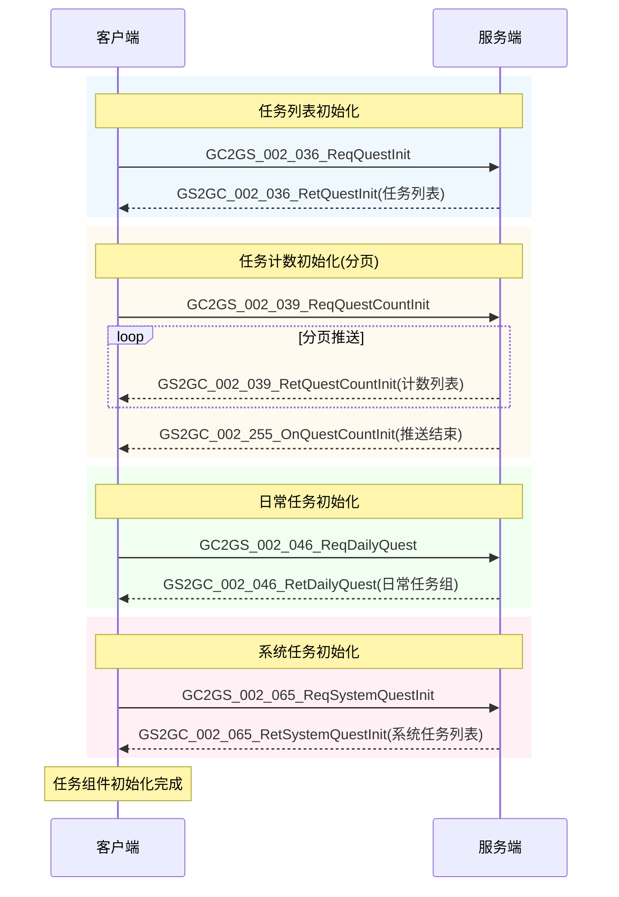
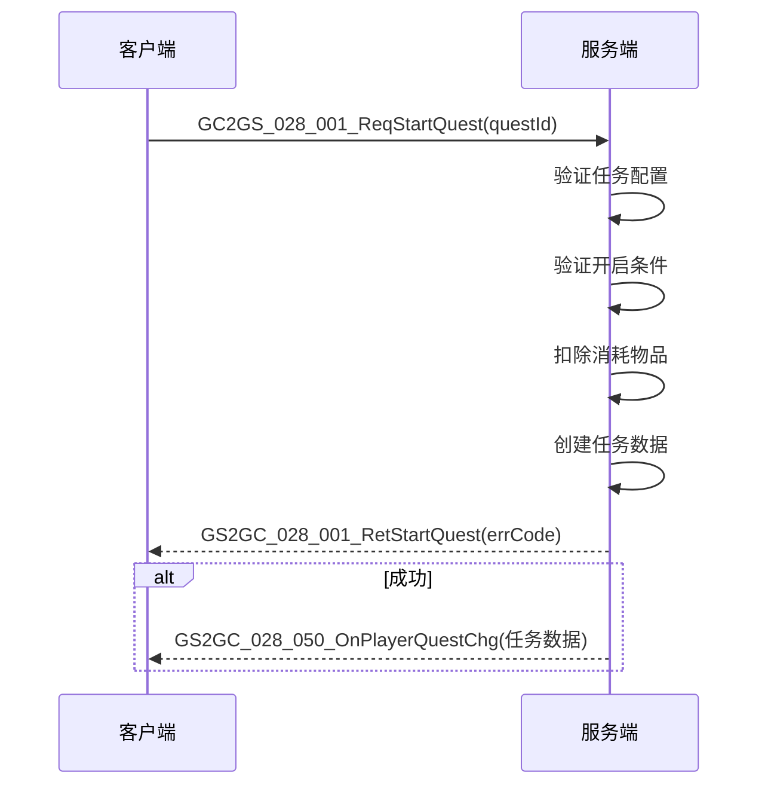
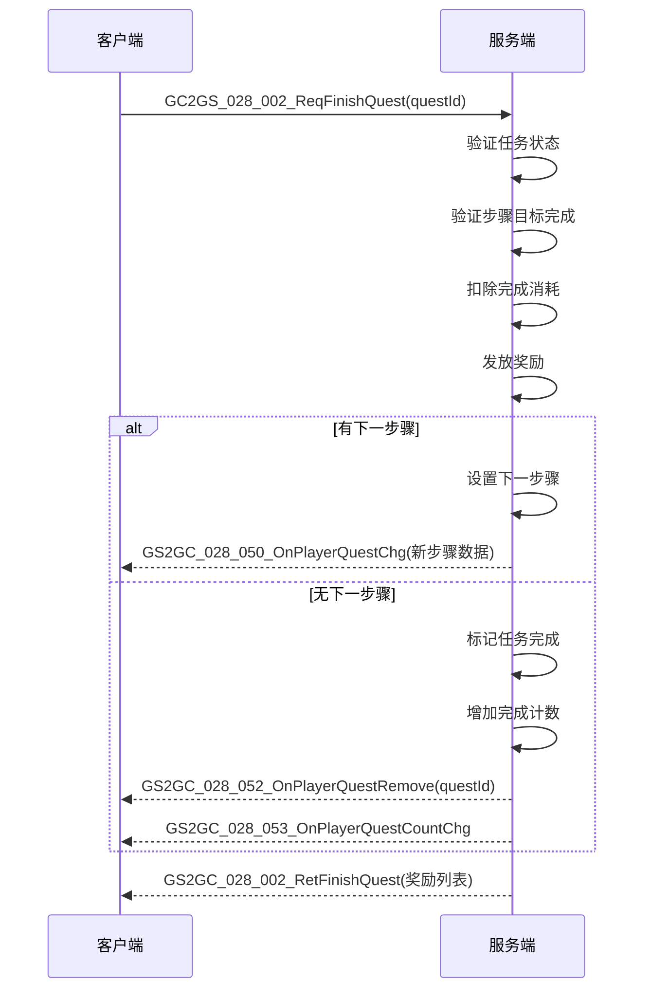
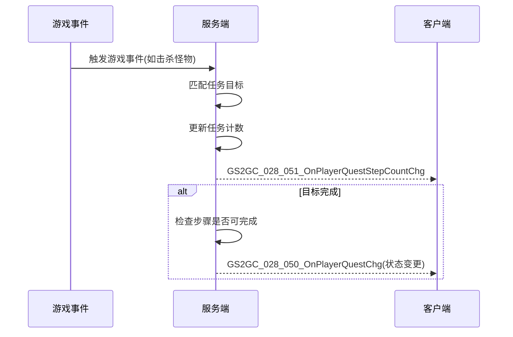
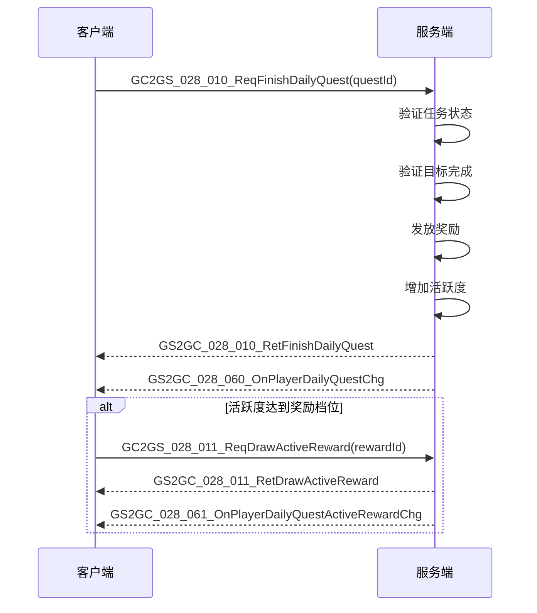
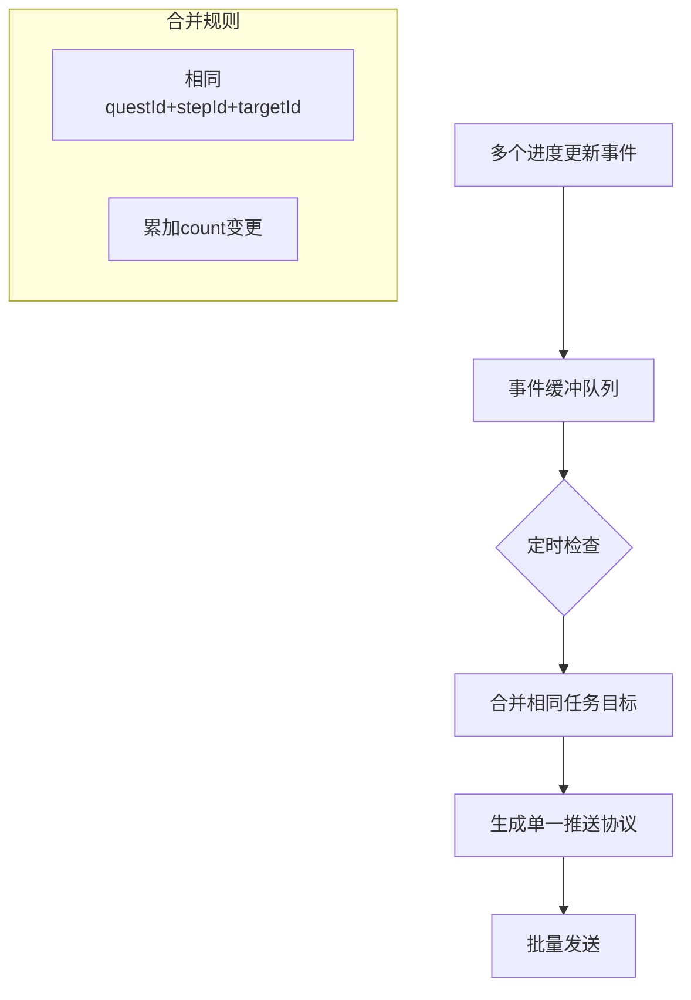

# 任务模块协议文档

## 协议模块编号: p028

---

## 一、主线任务协议

### 1.1 任务操作请求

#### GC2GS_028_001_ReqStartQuest - 开始任务

**路径**: `ClientProtocol/GC2GS/p028_QuestOp/GC2GS_028_001_ReqStartQuest.cs`

| 字段名 | 类型 | 说明 | 必填 |
|--------|------|------|------|
| questId | long | 任务配置ID | 是 |

**请求示例**:
```csharp
NPGSClientListener.sendRequestByLog(
    GSWriter_028_QuestOp.make_001_ReqStartQuest(questId),
    callback
);
```

---

#### GC2GS_028_002_ReqFinishQuest - 完成任务

**路径**: `ClientProtocol/GC2GS/p028_QuestOp/GC2GS_028_002_ReqFinishQuest.cs`

| 字段名 | 类型 | 说明 | 必填 |
|--------|------|------|------|
| questId | long | 任务配置ID | 是 |

**请求示例**:
```csharp
NPGSClientListener.sendRequestByLog(
    GSWriter_028_QuestOp.make_002_ReqFinishQuest(questId),
    callback
);
```

---

#### GC2GS_028_003_ReqDropQuest - 放弃任务

**路径**: `ClientProtocol/GC2GS/p028_QuestOp/GC2GS_028_003_ReqDropQuest.cs`

| 字段名 | 类型 | 说明 | 必填 |
|--------|------|------|------|
| questId | long | 任务配置ID | 是 |

**请求示例**:
```csharp
NPGSClientListener.sendRequestByLog(
    GSWriter_028_QuestOp.make_003_ReqDropQuest(questId),
    callback
);
```

---

#### GC2GS_028_004_ReqAddClientTargetCount - 增加客户端目标计数

**路径**: `ClientProtocol/GC2GS/p028_QuestOp/GC2GS_028_004_ReqAddClientTargetCount.cs`

| 字段名 | 类型 | 说明 | 必填 |
|--------|------|------|------|
| questId | long | 任务ID | 是 |
| questStepId | long | 任务步骤ID | 是 |
| targetId | long | 目标ID | 是 |
| count | long | 增加数量 | 是 |

**请求示例**:
```csharp
NPGSClientListener.sendMsgByLog(
    GSWriter_028_QuestOp.make_004_ReqAddClientTargetCount(questId, stepId, targetId, count)
);
```

---

### 1.2 任务操作响应

#### GS2GC_028_001_RetStartQuest - 开始任务结果

**路径**: `ClientProtocol/GS2GC/p028_QuestOp/GS2GC_028_001_RetStartQuest.cs`

| 字段名 | 类型 | 说明 |
|--------|------|------|
| errCode | int | 错误码，0表示成功 |

**错误码说明**:

| 错误码 | 常量名 | 说明 |
|--------|--------|------|
| 0 | SUCC | 成功 |
| 140009 | QUEST_NOT_EXIST | 任务不存在 |
| 140011 | QUEST_START_COND_ERROR | 任务开启条件未通过 |
| 140010 | QUEST_DONE_EXCEED_ERROR | 任务完成次数超过限制 |
| 140012 | QUEST_START_COST_ITEM_ERROR | 任务开启消耗物品不足 |
| 140013 | QUEST_START_COST_ITEM_FAIL | 任务开启消耗物品失败 |

---

#### GS2GC_028_002_RetFinishQuest - 完成任务结果

**路径**: `ClientProtocol/GS2GC/p028_QuestOp/GS2GC_028_002_RetFinishQuest.cs`

| 字段名 | 类型 | 说明 |
|--------|------|------|
| errCode | int | 错误码，0表示成功 |
| questStepId | long | 任务步骤ID |
| itemList | List&lt;NPCommon_ItemInfo&gt; | 获得的奖励列表 |

---

#### GS2GC_028_003_RetDropQuest - 放弃任务结果

**路径**: `ClientProtocol/GS2GC/p028_QuestOp/GS2GC_028_003_RetDropQuest.cs`

| 字段名 | 类型 | 说明 |
|--------|------|------|
| errCode | int | 错误码，0表示成功 |

---

#### GS2GC_028_004_RetAddClientTargetCount - 增加客户端计数结果

**路径**: `ClientProtocol/GS2GC/p028_QuestOp/GS2GC_028_004_RetAddClientTargetCount.cs`

| 字段名 | 类型 | 说明 |
|--------|------|------|
| errCode | int | 错误码，0表示成功 |

---

## 二、日常任务协议

### 2.1 日常任务操作请求

#### GC2GS_028_010_ReqFinishDailyQuest - 完成日常任务

**路径**: `ClientProtocol/GC2GS/p028_QuestOp/GC2GS_028_010_ReqFinishDailyQuest.cs`

| 字段名 | 类型 | 说明 | 必填 |
|--------|------|------|------|
| questId | long | 任务ID | 是 |

---

#### GC2GS_028_011_ReqDrawActiveReward - 领取活跃度奖励

**路径**: `ClientProtocol/GC2GS/p028_QuestOp/GC2GS_028_011_ReqDrawActiveReward.cs`

| 字段名 | 类型 | 说明 | 必填 |
|--------|------|------|------|
| rewardId | long | 奖励ID | 是 |

---

#### GC2GS_028_012_ReqDailyQuestTryFresh - 刷新日常任务

**路径**: `ClientProtocol/GC2GS/p028_QuestOp/GC2GS_028_012_ReqDailyQuestTryFresh.cs`

| 字段名 | 类型 | 说明 | 必填 |
|--------|------|------|------|
| questId | long | 任务ID | 是 |

---

#### GC2GS_028_013_ReqDailyQuestAKeyDrawFinishReward - 一键领取完成奖励

**路径**: `ClientProtocol/GC2GS/p028_QuestOp/GC2GS_028_013_ReqDailyQuestAKeyDrawFinishReward.cs`

| 字段名 | 类型 | 说明 | 必填 |
|--------|------|------|------|
| - | - | 无参数 | - |

---

#### GC2GS_028_014_ReqDailyQuestAKeyDrawActiveReward - 一键领取活跃奖励

**路径**: `ClientProtocol/GC2GS/p028_QuestOp/GC2GS_028_014_ReqDailyQuestAKeyDrawActiveReward.cs`

| 字段名 | 类型 | 说明 | 必填 |
|--------|------|------|------|
| - | - | 无参数 | - |

---

### 2.2 日常任务操作响应

#### GS2GC_028_010_RetFinishDailyQuest - 完成日常任务结果

| 字段名 | 类型 | 说明 |
|--------|------|------|
| errCode | int | 错误码 |
| questId | long | 任务ID |

**错误码说明**:

| 错误码 | 常量名 | 说明 |
|--------|--------|------|
| 140001 | DAILY_QUEST_NOT_EXIST | 日常任务不存在 |
| 140002 | DAILY_QUEST_HAS_FINISH | 日常任务已经完成 |

---

#### GS2GC_028_011_RetDrawActiveReward - 领取活跃度奖励结果

| 字段名 | 类型 | 说明 |
|--------|------|------|
| errCode | int | 错误码 |
| rewardId | long | 奖励ID |
| itemList | List&lt;NPCommon_ItemInfo&gt; | 获得的奖励列表 |

**错误码说明**:

| 错误码 | 常量名 | 说明 |
|--------|--------|------|
| 140003 | DAILY_QUEST_NOT_REACH_SCORE_REQUIRE | 活跃度不满足 |
| 140005 | DAILY_QUEST_ACTIVE_POINT_NOT_ENOUGH | 活跃度不够 |
| 140006 | DAILY_QUEST_ACTIVE_REWARD_HAS_DRAW | 活跃奖励已被领取 |

---

#### GS2GC_028_012_RetDailyQuestTryFresh - 刷新日常任务结果

| 字段名 | 类型 | 说明 |
|--------|------|------|
| errCode | int | 错误码 |
| questId | long | 任务ID |

**错误码说明**:

| 错误码 | 常量名 | 说明 |
|--------|--------|------|
| 140007 | DAILY_QUEST_SERIAL_NOT_EQUAL | 刷新序列号不匹配 |

---

#### GS2GC_028_013_RetDailyQuestAKeyDrawFinishReward - 一键领取完成奖励结果

| 字段名 | 类型 | 说明 |
|--------|------|------|
| errCode | int | 错误码 |
| itemList | List&lt;NPCommon_ItemInfo&gt; | 获得的奖励列表 |

---

#### GS2GC_028_014_RetDailyQuestAKeyDrawActiveReward - 一键领取活跃奖励结果

| 字段名 | 类型 | 说明 |
|--------|------|------|
| errCode | int | 错误码 |
| itemList | List&lt;NPCommon_ItemInfo&gt; | 获得的奖励列表 |

**错误码说明**:

| 错误码 | 常量名 | 说明 |
|--------|--------|------|
| 140008 | DAILY_QUEST_A_KEY_DRAW_FUNC_NOT_UNLOCK | 一键完成功能未解锁 |

---

## 三、系统任务协议

### 3.1 系统任务操作请求

#### GC2GS_028_020_ReqSystemQuestDrawReward - 系统任务领奖

**路径**: `ClientProtocol/GC2GS/p028_QuestOp/GC2GS_028_020_ReqSystemQuestDrawReward.cs`

| 字段名 | 类型 | 说明 | 必填 |
|--------|------|------|------|
| questId | long | 任务ID | 是 |

---

#### GC2GS_028_021_ReqSystemQuestAddClientCount - 系统任务增加客户端计数

**路径**: `ClientProtocol/GC2GS/p028_QuestOp/GC2GS_028_021_ReqSystemQuestAddClientCount.cs`

| 字段名 | 类型 | 说明 | 必填 |
|--------|------|------|------|
| targetId | long | 目标ID | 是 |
| count | long | 增加数量 | 是 |

---

### 3.2 系统任务操作响应

#### GS2GC_028_020_RetSystemQuestDrawReward - 系统任务领奖结果

| 字段名 | 类型 | 说明 |
|--------|------|------|
| errCode | int | 错误码 |
| questId | long | 任务ID |
| itemList | List&lt;NPCommon_ItemInfo&gt; | 获得的奖励列表 |

---

#### GS2GC_028_021_RetSystemQuestAddClientCount - 系统任务增加客户端计数结果

| 字段名 | 类型 | 说明 |
|--------|------|------|
| errCode | int | 错误码 |

---

## 四、推送协议

### 4.1 主线任务推送

#### GS2GC_028_050_OnPlayerQuestChg - 任务变更推送

**路径**: `ClientProtocol/GS2GC/p028_QuestOp/GS2GC_028_050_OnPlayerQuestChg.cs`

| 字段名 | 类型 | 说明 |
|--------|------|------|
| questInfo | Quest_info | 任务完整数据 |

**Quest_info 结构**:

| 字段名 | 类型 | 说明 |
|--------|------|------|
| questId | long | 任务配置ID |
| questStatus | EQuestStatus | 任务状态（WAITING/PROGRESSING） |
| questStep | Quest_Step | 任务步骤数据 |

**Quest_Step 结构**:

| 字段名 | 类型 | 说明 |
|--------|------|------|
| questStep | long | 步骤ID |
| targetList | List&lt;Quest_Target&gt; | 目标列表 |
| expireTimeTagS | int | 超时时间戳（秒），0表示永久 |

**Quest_Target 结构**:

| 字段名 | 类型 | 说明 |
|--------|------|------|
| targetId | long | 目标配置ID |
| curCount | long | 当前计数 |

---

#### GS2GC_028_051_OnPlayerQuestStepCountChg - 任务步骤目标计数变更推送

**路径**: `ClientProtocol/GS2GC/p028_QuestOp/GS2GC_028_051_OnPlayerQuestStepCountChg.cs`

| 字段名 | 类型 | 说明 |
|--------|------|------|
| questId | long | 任务ID |
| questStep | long | 步骤ID |
| targetId | long | 目标ID |
| curCount | long | 当前计数 |

---

#### GS2GC_028_052_OnPlayerQuestRemove - 任务移除推送

**路径**: `ClientProtocol/GS2GC/p028_QuestOp/GS2GC_028_052_OnPlayerQuestRemove.cs`

| 字段名 | 类型 | 说明 |
|--------|------|------|
| questId | long | 任务ID |

---

#### GS2GC_028_053_OnPlayerQuestCountChg - 任务完成次数变更推送

**路径**: `ClientProtocol/GS2GC/p028_QuestOp/GS2GC_028_053_OnPlayerQuestCountChg.cs`

| 字段名 | 类型 | 说明 |
|--------|------|------|
| questCount | Quest_Count | 任务计数数据 |

**Quest_Count 结构**:

| 字段名 | 类型 | 说明 |
|--------|------|------|
| questId | long | 任务配置ID |
| doneCount | int | 完成次数 |

---

### 4.2 日常任务推送

#### GS2GC_028_060_OnPlayerDailyQuestChg - 日常任务变更推送

**路径**: `ClientProtocol/GS2GC/p028_QuestOp/GS2GC_028_060_OnPlayerDailyQuestChg.cs`

| 字段名 | 类型 | 说明 |
|--------|------|------|
| dailyQuestInfo | DailyQuest_Info | 日常任务数据 |

**DailyQuest_Info 结构**:

| 字段名 | 类型 | 说明 |
|--------|------|------|
| targetId | long | 目标配置ID |
| curCount | long | 当前计数 |
| isFinish | bool | 是否已完成并领取奖励 |

---

#### GS2GC_028_061_OnPlayerDailyQuestActiveRewardChg - 活跃度奖励变更推送

**路径**: `ClientProtocol/GS2GC/p028_QuestOp/GS2GC_028_061_OnPlayerDailyQuestActiveRewardChg.cs`

| 字段名 | 类型 | 说明 |
|--------|------|------|
| activeRewardList | List&lt;int&gt; | 已领取的活跃度奖励档位列表 |

---

### 4.3 系统任务推送

#### GS2GC_028_070_OnPlayerSystemQuestChg - 系统任务变更推送

**路径**: `ClientProtocol/GS2GC/p028_QuestOp/GS2GC_028_070_OnPlayerSystemQuestChg.cs`

| 字段名 | 类型 | 说明 |
|--------|------|------|
| systemQuestInfo | SystemQuest_Info | 系统任务数据 |

**SystemQuest_Info 结构**:

| 字段名 | 类型 | 说明 |
|--------|------|------|
| groupId | long | 组ID |
| step | int | 步骤 |
| count | long | 计数 |

---

## 五、初始化协议

### GC2GS_002_036_ReqQuestInit - 请求任务列表初始化

**路径**: `ClientProtocol/GC2GS/p002_InitOp/GC2GS_002_036_ReqQuestInit.cs`

| 字段名 | 类型 | 说明 | 必填 |
|--------|------|------|------|
| - | - | 无参数 | - |

---

### GS2GC_002_036_RetQuestInit - 任务列表初始化响应

**路径**: `ClientProtocol/GS2GC/p002_InitOp/GS2GC_002_036_RetQuestInit.cs`

| 字段名 | 类型 | 说明 |
|--------|------|------|
| questList | List&lt;Quest_info&gt; | 任务列表 |

---

### GC2GS_002_039_ReqQuestCountInit - 请求任务计数初始化

**路径**: `ClientProtocol/GC2GS/p002_InitOp/GC2GS_002_039_ReqQuestCountInit.cs`

| 字段名 | 类型 | 说明 | 必填 |
|--------|------|------|------|
| - | - | 无参数 | - |

---

### GS2GC_002_039_RetQuestCountInit - 任务计数初始化响应（分页推送）

**路径**: `ClientProtocol/GS2GC/p002_InitOp/GS2GC_002_039_RetQuestCountInit.cs`

| 字段名 | 类型 | 说明 |
|--------|------|------|
| questCountList | List&lt;Quest_Count&gt; | 任务计数列表 |

---

### GS2GC_002_255_OnQuestCountInit - 任务计数初始化完成通知

| 字段名 | 类型 | 说明 |
|--------|------|------|
| - | - | 表示分页推送结束 |

---

### GC2GS_002_046_ReqDailyQuest - 请求日常任务初始化

**路径**: `ClientProtocol/GC2GS/p002_InitOp/GC2GS_002_046_ReqDailyQuest.cs`

| 字段名 | 类型 | 说明 | 必填 |
|--------|------|------|------|
| - | - | 无参数 | - |

---

### GS2GC_002_046_RetDailyQuest - 日常任务初始化响应

**路径**: `ClientProtocol/GS2GC/p002_InitOp/GS2GC_002_046_RetDailyQuest.cs`

| 字段名 | 类型 | 说明 |
|--------|------|------|
| dailyQuestGroupList | List&lt;DailyQuest_Group&gt; | 日常任务组列表 |

---

### GC2GS_002_065_ReqSystemQuestInit - 请求系统任务初始化

**路径**: `ClientProtocol/GC2GS/p002_InitOp/GC2GS_002_065_ReqSystemQuestInit.cs`

| 字段名 | 类型 | 说明 | 必填 |
|--------|------|------|------|
| - | - | 无参数 | - |

---

### GS2GC_002_065_RetSystemQuestInit - 系统任务初始化响应

**路径**: `ClientProtocol/GS2GC/p002_InitOp/GS2GC_002_065_RetSystemQuestInit.cs`

| 字段名 | 类型 | 说明 |
|--------|------|------|
| systemQuestList | List&lt;SystemQuest_Info&gt; | 系统任务列表 |

---

## 六、协议交互流程图

### 6.1 任务初始化流程



### 6.2 开始任务流程



### 6.3 完成任务流程



### 6.4 任务进度更新流程



### 6.5 日常任务完成流程



---

## 七、错误码定义

### 7.1 任务错误码 (QuestErr)

**路径**: `game_server/Common/src/NPCommon/ErrMain/QuestErr.java`

| 错误码 | 常量名 | 说明 | 处理建议 |
|--------|--------|------|----------|
| 140001 | DAILY_QUEST_NOT_EXIST | 日常任务不存在 | 检查任务配置 |
| 140002 | DAILY_QUEST_HAS_FINISH | 日常任务已经完成 | 刷新任务列表 |
| 140003 | DAILY_QUEST_NOT_REACH_SCORE_REQUIRE | 活跃度不满足领取条件 | 提示完成更多任务 |
| 140004 | DAILY_QUEST_NOT_UNLOCK | 日常任务尚未解锁 | 提示解锁条件 |
| 140005 | DAILY_QUEST_ACTIVE_POINT_NOT_ENOUGH | 活跃度不够 | 提示完成更多任务 |
| 140006 | DAILY_QUEST_ACTIVE_REWARD_HAS_DRAW | 活跃奖励已被领取 | 跳过重复领取 |
| 140007 | DAILY_QUEST_SERIAL_NOT_EQUAL | 刷新序列号不匹配 | 刷新任务列表 |
| 140008 | DAILY_QUEST_A_KEY_DRAW_FUNC_NOT_UNLOCK | 一键完成功能未解锁 | 提示解锁条件 |
| 140009 | QUEST_NOT_EXIST | 任务不存在 | 检查任务配置 |
| 140010 | QUEST_DONE_EXCEED_ERROR | 任务完成次数超过限制 | 提示次数上限 |
| 140011 | QUEST_START_COND_ERROR | 任务开启条件未通过 | 提示具体条件 |
| 140012 | QUEST_START_COST_ITEM_ERROR | 任务开启消耗物品不足 | 提示缺少的物品 |
| 140013 | QUEST_START_COST_ITEM_FAIL | 任务开启消耗物品失败 | 检查物品状态 |
| 140014 | QUEST_FINISH_FAIL | 任务完成失败 | 检查任务状态 |
| 140015 | QUEST_DROP_FAIL | 任务放弃失败 | 检查任务是否可放弃 |
| 140016 | QUEST_CLIENT_CHG_COUNT_FAIL | 修改任务计数失败 | 检查任务目标状态 |

---

## 八、协议使用示例

### 8.1 客户端发起任务请求

```csharp
// 开始任务
NPPlayer.instance.questComp.reqStartQuest(questId, () => {
    ALLog.Info("任务开始成功");
});

// 完成任务
NPPlayer.instance.questComp.reqFinishQuest(questId, (rewardList) => {
    if (rewardList != null) {
        // 处理奖励展示
        ShowRewardUI(rewardList);
    }
});

// 放弃任务
NPPlayer.instance.questComp.reqDropQuest(questId);
```

### 8.2 服务端推送任务变更

```java
// 服务端推送任务变更
getUserData().sendMsgToGC(
    US2GCWriter_028_QuestOp.make_050_OnPlayerQuestChg(quest.toProto())
);

// 服务端推送任务目标计数变更
getUserData().sendMsgToGC(
    US2GCWriter_028_QuestOp.make_051_OnPlayerQuestStepCountChg(
        questId, stepId, targetId, curCount
    )
);

// 服务端推送任务移除
getUserData().sendMsgToGC(
    US2GCWriter_028_QuestOp.make_052_OnPlayerQuestRemove(questId)
);

// 服务端推送任务计数变更
getUserData().sendMsgToGC(
    US2GCWriter_028_QuestOp.make_053_OnPlayerQuestCountChg(questCount.toProto())
);
```

### 8.3 客户端处理推送协议

```csharp
// 注册推送协议处理
public class GSSubDealer_028_050_OnPlayerQuestChg
{
    public static void dealSubMsg(GS2GC_028_050_OnPlayerQuestChg _info)
    {
        if (_info == null) return;

        NPPlayer.instance.questComp.updateQuest(_info.getQuestInfo());

        // 发送消息通知UI更新
        WinMsg.SendMsg(WinMsgType.QUEST_UPDATE, _info.getQuestInfo());
    }
}

// 处理目标计数变更
public class GSSubDealer_028_051_OnPlayerQuestStepCountChg
{
    public static void dealSubMsg(GS2GC_028_051_OnPlayerQuestStepCountChg _info)
    {
        if (_info == null) return;

        NPPlayer.instance.questComp.updateTargetCount(_info);

        // 发送消息通知UI更新
        WinMsg.SendMsg(WinMsgType.QUEST_TARGET_UPDATE, _info);
    }
}
```

---

## 九、协议总览表

### 9.1 请求协议汇总

| 主序号 | 子序号 | 协议名 | 说明 |
|--------|--------|--------|------|
| 28 | 1 | GC2GS_028_001_ReqStartQuest | 开始任务 |
| 28 | 2 | GC2GS_028_002_ReqFinishQuest | 完成任务 |
| 28 | 3 | GC2GS_028_003_ReqDropQuest | 放弃任务 |
| 28 | 4 | GC2GS_028_004_ReqAddClientTargetCount | 增加客户端计数 |
| 28 | 10 | GC2GS_028_010_ReqFinishDailyQuest | 完成日常任务 |
| 28 | 11 | GC2GS_028_011_ReqDrawActiveReward | 领取活跃度奖励 |
| 28 | 12 | GC2GS_028_012_ReqDailyQuestTryFresh | 刷新日常任务 |
| 28 | 13 | GC2GS_028_013_ReqDailyQuestAKeyDrawFinishReward | 一键领取完成奖励 |
| 28 | 14 | GC2GS_028_014_ReqDailyQuestAKeyDrawActiveReward | 一键领取活跃奖励 |
| 28 | 20 | GC2GS_028_020_ReqSystemQuestDrawReward | 系统任务领奖 |
| 28 | 21 | GC2GS_028_021_ReqSystemQuestAddClientCount | 系统任务增加客户端计数 |

### 9.2 响应/推送协议汇总

| 主序号 | 子序号 | 协议名 | 说明 |
|--------|--------|--------|------|
| 28 | 1 | GS2GC_028_001_RetStartQuest | 开始任务结果 |
| 28 | 2 | GS2GC_028_002_RetFinishQuest | 完成任务结果 |
| 28 | 3 | GS2GC_028_003_RetDropQuest | 放弃任务结果 |
| 28 | 4 | GS2GC_028_004_RetAddClientTargetCount | 增加客户端计数结果 |
| 28 | 10 | GS2GC_028_010_RetFinishDailyQuest | 完成日常任务结果 |
| 28 | 11 | GS2GC_028_011_RetDrawActiveReward | 领取活跃度奖励结果 |
| 28 | 12 | GS2GC_028_012_RetDailyQuestTryFresh | 刷新日常任务结果 |
| 28 | 13 | GS2GC_028_013_RetDailyQuestAKeyDrawFinishReward | 一键领取完成奖励结果 |
| 28 | 14 | GS2GC_028_014_RetDailyQuestAKeyDrawActiveReward | 一键领取活跃奖励结果 |
| 28 | 20 | GS2GC_028_020_RetSystemQuestDrawReward | 系统任务领奖结果 |
| 28 | 21 | GS2GC_028_021_RetSystemQuestAddClientCount | 系统任务增加计数结果 |
| 28 | 50 | GS2GC_028_050_OnPlayerQuestChg | 任务变更推送 |
| 28 | 51 | GS2GC_028_051_OnPlayerQuestStepCountChg | 目标计数变更推送 |
| 28 | 52 | GS2GC_028_052_OnPlayerQuestRemove | 任务移除推送 |
| 28 | 53 | GS2GC_028_053_OnPlayerQuestCountChg | 任务计数变更推送 |
| 28 | 60 | GS2GC_028_060_OnPlayerDailyQuestChg | 日常任务变更推送 |
| 28 | 61 | GS2GC_028_061_OnPlayerDailyQuestActiveRewardChg | 活跃度奖励变更推送 |
| 28 | 70 | GS2GC_028_070_OnPlayerSystemQuestChg | 系统任务变更推送 |

---

## 十、协议安全机制

### 10.1 协议校验

```csharp
// 客户端协议校验
public class QuestProtocolValidator
{
    // 任务ID校验
    public static bool ValidateQuestId(long questId)
    {
        if (questId <= 0)
        {
            ALLog.Error("Invalid questId: " + questId);
            return false;
        }
        return true;
    }

    // 目标计数校验
    public static bool ValidateCount(long count)
    {
        if (count < 0 || count > 10000)
        {
            ALLog.Error("Invalid count: " + count);
            return false;
        }
        return true;
    }
}
```

### 10.2 服务端参数校验

```java
// 协议参数校验
public Result validateRequest(GC2GS_028_001_ReqStartQuest req)
{
    // 1. 任务ID校验
    if (req.questId <= 0)
    {
        USLog.warn("Invalid questId: {}, cid: {}", req.questId, getUserData().getCid());
        return CommErr.PARAM_ERROR;
    }

    // 2. 配置存在校验
    RefQuest ref = RefQuest.getMgr().get(req.questId);
    if (ref == null)
    {
        return QuestErr.QUEST_NOT_EXIST;
    }

    return Result.SUCC;
}
```

### 10.3 协议幂等性处理

```java
// 任务操作幂等性保证
public Result startQuestByClient(long questId, NPPlayerContext context)
{
    // 检查任务是否已存在
    PlayerQuestInfo existingQuest = _m_hmQuestMap.get(questId);
    if (existingQuest != null)
    {
        // 如果已进行中，直接返回成功并推送当前数据
        if (existingQuest.isProgressing())
        {
            getUserData().sendMsgToGC(
                US2GCWriter_028_QuestOp.make_050_OnPlayerQuestChg(existingQuest.toProto())
            );
            return Result.SUCC;
        }
    }

    // 正常流程处理...
}
```

---

## 十一、协议性能优化

### 11.1 协议合并策略



### 11.2 推送频率控制

```java
// 推送频率限制
public class QuestPushLimiter
{
    private static final int MIN_PUSH_INTERVAL_MS = 100; // 最小推送间隔

    private Map<Long, Long> lastPushTimeMap = new HashMap<>();

    public boolean canPush(long questId)
    {
        long now = System.currentTimeMillis();
        Long lastTime = lastPushTimeMap.get(questId);
        if (lastTime == null || now - lastTime >= MIN_PUSH_INTERVAL_MS)
        {
            lastPushTimeMap.put(questId, now);
            return true;
        }
        return false;
    }
}
```

### 11.3 协议压缩

```java
// 任务数据压缩传输
public Quest_info compressQuestData(PlayerQuestInfo quest)
{
    Quest_info proto = quest.toProto();

    // 只传输必要字段，减少协议大小
    // 空列表不传输
    if (proto.questStep.targetList.isEmpty())
    {
        proto.questStep.targetList = null;
    }

    return proto;
}
```

---

## 十二、协议监控与日志

### 12.1 协议监控指标

| 监控指标 | 说明 | 告警阈值 |
|----------|------|----------|
| 协议耗时 | 从接收到处理完成的时间 | > 100ms |
| 失败率 | 协议返回错误的比例 | > 5% |
| 推送延迟 | 服务端到客户端推送延迟 | > 200ms |
| 重试次数 | 协议重试请求次数 | > 3次/分钟 |

### 12.2 协议日志记录

```java
// 协议日志埋点
public void logProtocol(String protocolName, long cid, long startTime, Result result)
{
    long elapsed = System.currentTimeMillis() - startTime;

    LogProtocolBO log = new LogProtocolBO();
    log.setCid(bmObj, cid);
    log.setProtocolName(bmObj, protocolName);
    log.setElapsedMs(bmObj, elapsed);
    log.setResultCode(bmObj, result.getCode());
    log.setTimestamp(bmObj, startTime);

    CommLogDB.log(bmObj, log);

    // 性能告警
    if (elapsed > 100)
    {
        USLog.warn("Protocol slow: {}, elapsed: {}ms, cid: {}", protocolName, elapsed, cid);
    }
}
```

---

## 十三、协议兼容性

### 13.1 协议版本控制

```java
// 协议版本管理
public class ProtocolVersionManager
{
    // 协议版本号
    public static final int PROTOCOL_VERSION = 1;

    // 版本兼容检查
    public static boolean isCompatible(int clientVersion)
    {
        return clientVersion <= PROTOCOL_VERSION;
    }

    // 协议降级处理
    public static Quest_info downgradeProtocol(Quest_info data, int targetVersion)
    {
        if (targetVersion < PROTOCOL_VERSION)
        {
            // 去除新版本字段
            data.questStep.newField = null;
        }
        return data;
    }
}
```

### 13.2 协议扩展机制

```csharp
// 协议扩展字段设计
public class Quest_info
{
    // 核心字段（必须）
    public long questId;
    public EQuestStatus questStatus;
    public Quest_Step questStep;

    // 扩展字段（可选）
    public Dictionary<string, object> extData;  // 扩展数据字典

    // 新增字段通过扩展字典传递，保证向后兼容
}
```

---

*文档生成时间: 2026-04-11*
