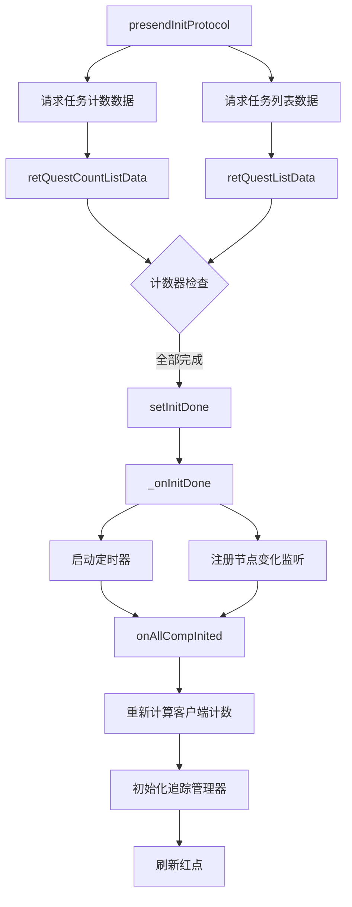
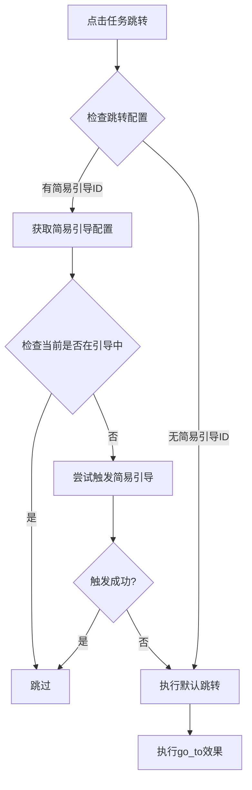
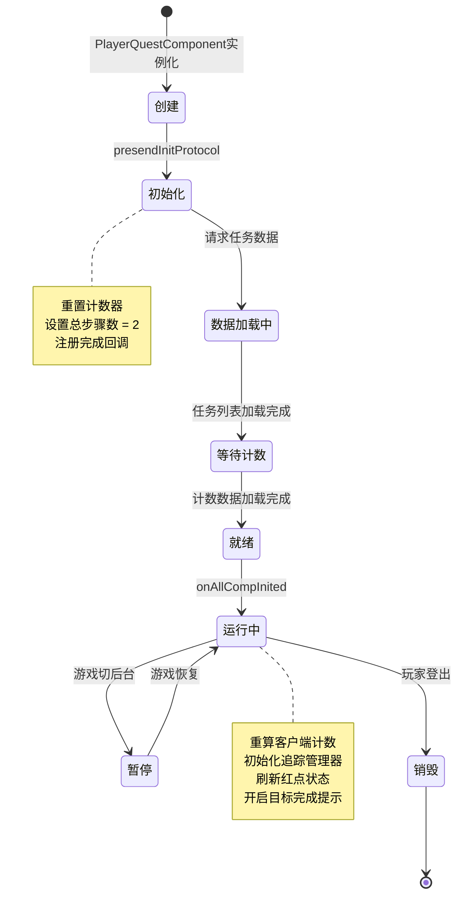
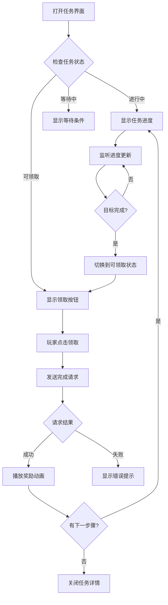

# 任务模块客户端开发文档

## 一、组件架构

### 1.1 核心组件类

#### PlayerQuestComponent
**路径**: `game_client/Assets/Scripts/LogicScripts/GameComponent/Quest/PlayerQuestComponent.cs`

**功能**: 任务模块管理类，管理玩家任务数据

**继承关系**:
```
PlayerQuestComponent : _ANPBasicPlayerComponent
```

**协议模块**: p028_QuestOp

**组件类型**: `ENPPlayerCompType.QUEST`

**依赖组件**:
- `ENPPlayerCompType.BASIC_INFO`

**主要属性**:

| 属性名 | 类型 | 说明 |
|--------|------|------|
| questItemMgr | QuestItemMgr | 任务数据管理类 |
| questCountItemMgr | QuestCountItemMgr | 任务计数管理类 |
| questEntryIsShow | bool | 任务入口是否展示中 |
| canShowTargetFinishTip | bool | 是否可显示目标完成提示 |
| followListenMsgList | List&lt;WinMsgType&gt; | 追踪任务监听的消息列表 |

**关键方法**:

| 方法名 | 参数 | 返回值 | 说明 |
|--------|------|--------|------|
| checkCanAcceptQuest | questId, showTip | bool | 检查能否接受任务 |
| getMainQuestDoneCount | - | long | 获取主线任务完成数量 |
| tryShowQuestEntryTip | - | void | 尝试展示任务入口提示 |
| refreshRedTip | - | void | 刷新红点状态 |
| reqStartQuest | questId, callback | void | 请求开始任务 |
| reqFinishQuest | questId, callback | void | 请求完成任务 |
| reqDropQuest | questId | void | 请求放弃任务 |
| updateQuest | Quest_info | void | 更新任务数据 |
| updateTargetCount | GS2GC_028_051 | void | 更新目标计数 |
| removeQuest | questId | void | 移除任务 |
| updateQuestCount | Quest_Count | void | 更新任务计数 |

**初始化流程**:



**关键代码**:

```csharp
public class PlayerQuestComponent : _ANPBasicPlayerComponent
{
    // 依赖的组件
    private ENPPlayerCompType[] _m_dependCompList = new[] { ENPPlayerCompType.BASIC_INFO };

    // 当前任务的数据管理类
    [NotNull] private readonly QuestItemMgr _m_questItemMgr;

    // 任务计数管理类
    [NotNull] private readonly QuestCountItemMgr _m_questCountItemMgr;

    // 追踪任务监听的WinMsg列表
    private List<WinMsgType> _m_lFollowListenMsgList = new List<WinMsgType>()
    {
        WinMsgType.QUEST_REMOVE,
        WinMsgType.QUEST_UPDATE,
        WinMsgType.QUEST_TARGET_UPDATE
    };

    public override void presendInitProtocol()
    {
        _m_stepCounter.resetAll();
        _m_stepCounter.chgTotalStepCount(2);
        _m_stepCounter.regAllDoneDelegate(setInitDone);

        _m_questCountItemMgr.clear();
        _reqQuestCountListData();
        _reqQuestListData();
    }

    public override void onAllCompInited()
    {
        // 重新计算客户端计数
        if (null != _m_questItemMgr)
            _m_questItemMgr.reCalcCurCusCount();

        // 初始化追踪任务
        QuestFollowMgr.instance.init();
        // 刷新红点
        refreshRedTip();

        _m_bCanShowTargetFinishTip = true;
    }
}
```

---

### 1.2 任务信息类

#### QuestItem
**路径**: `game_client/Assets/Scripts/LogicScripts/GameComponent/Quest/QuestItem.cs`

**功能**: 管理单个任务数据，实现任务追踪接口

**继承关系**:
```
QuestItem : _IFollowableQuest
```

**主要属性**:

| 属性名 | 类型 | 说明 |
|--------|------|------|
| questId | long | 任务ID |
| questStatus | EQuestStatus | 任务状态 |
| questRef | QuestRefObj | 配表数据引用 |
| stepItem | QuestStepItem | 当前步骤数据 |

**关键方法**:

| 方法名 | 参数 | 返回值 | 说明 |
|--------|------|--------|------|
| update | Quest_info | void | 更新任务数据 |
| getStepIdIsDone | stepId | bool | 检查步骤是否完成 |
| getDoneStepIdList | - | List&lt;long&gt; | 获取已完成步骤列表 |
| isAllStepDone | - | bool | 是否全部步骤完成 |
| curStepIsLastStep | - | bool | 当前是否最后一步 |
| reCalcCurCusCount | - | void | 重新计算客户端计数 |

**任务追踪接口实现**:

| 接口属性 | 说明 |
|----------|------|
| questType | 任务类型（主线/支线/心愿） |
| id | 任务ID |
| sortId | 排序ID |
| questStepStatus | 步骤状态 |
| title | 任务标题 |
| showStr | 展示文本 |
| curCountStr | 当前计数文本 |
| targetCountStr | 目标计数文本 |
| progressStr | 进度文本 |
| expireTimeTagS | 超时时间戳 |

---

#### QuestStepItem
**路径**: `game_client/Assets/Scripts/LogicScripts/GameComponent/Quest/QuestStepItem.cs`

**功能**: 管理任务步骤数据

**主要属性**:

| 属性名 | 类型 | 说明 |
|--------|------|------|
| questStepId | long | 步骤ID |
| questStepRefObj | QuestStepRefObj | 步骤配表引用 |
| questId | long | 所属任务ID |
| expireTimeTagS | int | 超时时间戳 |

**关键方法**:

| 方法名 | 说明 |
|--------|------|
| update | 更新步骤数据 |
| getCurTarget | 获取当前目标 |
| checkStepCanGet | 检查步骤是否可领取 |
| getQuestStepStatus | 获取步骤状态 |

**步骤状态枚举**:

| 枚举值 | 说明 |
|--------|------|
| QUEST_DOING | 进行中 |
| QUEST_CANGET | 可领取 |
| QUEST_DONE | 已完成 |

---

#### QuestTargetItem
**路径**: `game_client/Assets/Scripts/LogicScripts/GameComponent/Quest/QuestTargetItem.cs`

**功能**: 管理任务目标数据

**主要属性**:

| 属性名 | 类型 | 说明 |
|--------|------|------|
| questTargetId | long | 目标ID |
| targetRefObj | QuestTargetRefObj | 目标配表引用 |
| stepRefObj | QuestStepRefObj | 步骤配表引用 |

**关键方法**:

| 方法名 | 参数 | 返回值 | 说明 |
|--------|------|--------|------|
| getQuestTargetRealCount | - | long | 获取实际计数（服务端+客户端） |
| getQuestTargetIsFinish | - | bool | 目标是否完成 |
| setCurCount | count | void | 设置服务端计数 |
| reCalcCurCusCount | - | void | 重新计算客户端计数 |

**客户端触发目标处理**:

```csharp
// 客户端触发进度变更
private void _triggerClientTarget(object[] _objs)
{
    int addCount = 1;
    // 发送消息给服务器增加进度
    NPGSClientListener.sendMsgByLog(
        GSWriter_028_QuestOp.make_004_ReqAddClientTargetCount(
            _m_stepItem.questId,
            _m_stepItem.questStepId,
            _m_questTargetId,
            addCount
        )
    );
}
```

**目标计数计算**:

```csharp
public long getQuestTargetRealCount()
{
    if (null == _m_targetRefObj || null == _m_targetRefObj.process_cur_count)
        return _m_curCount;

    // 高级公式计算值 + 服务端计数
    return _m_curCount + _m_curCusCount;
}

public bool getQuestTargetIsFinish()
{
    if (null == _m_targetRefObj)
        return false;

    return getQuestTargetRealCount() >= _m_targetRefObj.process_count;
}
```

---

### 1.3 任务计数类

#### QuestCountItemMgr
**路径**: `game_client/Assets/Scripts/LogicScripts/GameComponent/Quest/QuestCountItemMgr.cs`

**功能**: 管理任务完成次数

**主要方法**:

| 方法名 | 说明 |
|--------|------|
| initQuestCountListData | 初始化任务计数列表 |
| updateQuestCount | 更新任务计数 |
| getDoneCount | 获取指定任务的完成次数 |
| checkQuestDoneCountIsMax | 检查完成次数是否达到上限 |
| getMainQuestDoneCount | 获取主线任务完成数量 |

---

## 二、协议接口

### 2.1 请求协议

| 协议名 | 说明 | 调用方法 |
|--------|------|----------|
| GC2GS_028_001_ReqStartQuest | 开始任务 | reqStartQuest |
| GC2GS_028_002_ReqFinishQuest | 完成任务 | reqFinishQuest |
| GC2GS_028_003_ReqDropQuest | 放弃任务 | reqDropQuest |
| GC2GS_028_004_ReqAddClientTargetCount | 增加客户端目标计数 | 内部调用 |

### 2.2 响应协议

| 协议名 | 说明 | 处理方法 |
|--------|------|----------|
| GS2GC_028_001_RetStartQuest | 开始任务结果 | 回调处理 |
| GS2GC_028_002_RetFinishQuest | 完成任务结果 | 回调处理 |
| GS2GC_028_003_RetDropQuest | 放弃任务结果 | 回调处理 |
| GS2GC_028_050_OnPlayerQuestChg | 任务变更推送 | updateQuest |
| GS2GC_028_051_OnPlayerQuestStepCountChg | 目标计数变更推送 | updateTargetCount |
| GS2GC_028_052_OnPlayerQuestRemove | 任务移除推送 | removeQuest |
| GS2GC_028_053_OnPlayerQuestCountChg | 任务完成次数变更推送 | updateQuestCount |

---

## 三、UI窗口

### 3.1 窗口类列表

**窗口目录**: `game_client/Assets/Scripts/LogicScripts/GameWndGui/GGui/Quest/`

| 类名 | 说明 | 路径 |
|------|------|------|
| GGUIWndQuestMain | 任务主界面 | GGUIWndQuestMain.cs |
| GGUIWndQuestPage | 任务页面 | GGUIWndQuestPage.cs |
| GGUIWndQuestMainTab | 任务标签页 | GGUIWndQuestMainTab.cs |
| GGUIWndQuestCompleteTips | 任务完成提示 | GGUIWndQuestCompleteTips.cs |
| GGUIWndSystemQuestDetail | 系统任务详情 | GGUIWndSystemQuestDetail.cs |

**Mono目录**: `game_client/Assets/Scripts/ResScripts/NPGUIMono/GGUIMono/Quest/`

| 类名 | 说明 |
|------|------|
| GGUIMonoQuestMain | 任务主界面Mono |
| GGUIMonoQuestPage | 任务页面Mono |
| GGUIMonoQuestCompleteTips | 任务完成提示Mono |
| GGUIMonoSystemQuestDetail | 系统任务详情Mono |

### 3.2 日常任务UI

**窗口目录**: `game_client/Assets/Scripts/LogicScripts/GameWndGui/GGui/DailyQuest/`

| 类名 | 说明 |
|------|------|
| GGUIWndDailyQuestPage | 日常任务页面 |
| GGUIWndDailyQuestContainer | 日常任务容器 |
| GGUIWndDailyQuestContainerItem | 日常任务项 |
| GGUIWndDailyQuestScoreRewardPreview | 活跃度奖励预览 |

---

## 四、消息事件

### 4.1 任务相关消息

| 消息类型 | 说明 | 触发时机 |
|----------|------|----------|
| WinMsgType.QUEST_ADD | 任务新增 | 收到任务新增推送 |
| WinMsgType.QUEST_REMOVE | 任务移除 | 任务被移除 |
| WinMsgType.QUEST_UPDATE | 任务更新 | 任务状态变更 |
| WinMsgType.QUEST_TARGET_UPDATE | 任务目标更新 | 目标进度变更 |
| WinMsgType.QUEST_FINISH | 任务完成 | 任务完成时 |

### 4.2 消息注册示例

```csharp
// 注册消息监听
WinMsg.RegisterMsgAct(WinMsgType.QUEST_UPDATE, OnQuestUpdate);
WinMsg.RegisterMsgAct(WinMsgType.QUEST_TARGET_UPDATE, OnTargetUpdate);

// 注销消息监听
WinMsg.UnregisterMsgAct(WinMsgType.QUEST_UPDATE, OnQuestUpdate);
WinMsg.UnregisterMsgAct(WinMsgType.QUEST_TARGET_UPDATE, OnTargetUpdate);
```

---

## 五、访问方式

### 5.1 获取任务组件

```csharp
// 获取任务组件
PlayerQuestComponent questComp = NPPlayer.instance.questComp;

// 获取任务管理器
QuestItemMgr mgr = questComp.questItemMgr;

// 获取日常任务组件（如果有）
PlayerDailyQuestComponent dailyComp = NPPlayer.instance.dailyQuestComp;

// 获取系统任务组件
PlayerSystemQuestComponent systemComp = NPPlayer.instance.systemQuestComp;
```

### 5.2 获取任务数据

```csharp
// 获取指定任务
QuestItem quest = mgr.getQuestItem(questId);

// 获取当前任务列表
List<QuestItem> questList = new List<QuestItem>();
mgr.getCurQuestList(questList);

// 检查是否拥有任务
bool hasQuest = mgr.hasQuest(questId);

// 获取当前任务数量
int count = mgr.getCurQuestListCount();
```

### 5.3 获取任务进度

```csharp
// 获取任务步骤
QuestStepItem step = quest.stepItem;

// 获取当前目标
QuestTargetItem target = step.getCurTarget();

// 获取进度
long curCount = target.getQuestTargetRealCount();
long targetCount = target.targetRefObj.process_count;
bool isFinish = target.getQuestTargetIsFinish();

// 获取进度文本
string progress = quest.progressStr;  // "当前 2/3"
string curStr = quest.curCountStr;    // "2"
string targetStr = quest.targetCountStr; // "3"
```

---

## 六、任务跳转

### 6.1 任务跳转流程



### 6.2 任务跳转实现

```csharp
public void dealQuestGoto()
{
    QuestTargetItem targetItem = stepItem.getCurTarget();
    if (null == targetItem || null == targetItem.targetRefObj || null == targetItem.targetRefObj.go_to)
        return;

    // 执行跳转效果
    NPSimpleTutorialRefObj simpleTutorialRefObj = GRefdataCoreMgr.instance.simpleTutorialRefCore.getRef(
        targetItem.targetRefObj.go_to_simple_tutorial_id
    );

    if (null == simpleTutorialRefObj)
    {
        targetItem.targetRefObj.go_to.dealEffect();
        return;
    }

    // 设置简易引导
    SimpleTutorialController.instance.setCurCurGuide(simpleTutorialRefObj);

    if (Game.instance.isInTutorial)
        return;

    // 如果没执行成功，执行默认跳转
    if (!SimpleTutorialController.instance.checkStartSimpleTutorial(QueueMgr.instance._lastNode.nodeTag))
    {
        targetItem.targetRefObj.go_to.dealEffect();
    }
}
```

---

## 七、任务追踪系统

### 7.1 QuestFollowMgr

**路径**: `game_client/Assets/Scripts/LogicScripts/GameComponent/Quest/Follow/QuestFollowMgr.cs`

**功能**: 管理任务追踪显示

**主要方法**:

| 方法名 | 说明 |
|--------|------|
| init | 初始化追踪管理器 |
| checkAndAutoFollow | 检查并自动追踪 |
| setCurFollow | 设置当前追踪任务 |
| clear | 清空追踪数据 |

### 7.2 追踪任务选择逻辑

```csharp
// 任务追踪优先级
// 1. 主线任务优先
// 2. 可领取状态优先
// 3. 进行中状态优先
// 4. 按sortId排序
```

### 7.3 追踪接口定义

```csharp
public interface _IFollowableQuest
{
    EQuestType questType { get; }      // 任务类型
    long id { get; }                   // 任务ID
    int sortId { get; }                // 排序ID
    ENPQuestStepStatusEnum questStepStatus { get; } // 步骤状态
    string title { get; }              // 任务标题
    string showStr { get; }            // 展示文本
    string curCountStr { get; }        // 当前计数文本
    string targetCountStr { get; }     // 目标计数文本
    string progressStr { get; }        // 进度文本
    int expireTimeTagS { get; }        // 超时时间戳
}
```

---

## 八、红点系统

### 8.1 红点刷新

```csharp
public void refreshRedTip()
{
    if (!isInitDone)
        return;

    long count = 0;
    List<QuestItem> questList = ListPool<QuestItem>.Get();
    NPPlayer.instance.questComp.questItemMgr.getCurQuestList(questList);

    for (int i = 0; i < questList.Count; i++)
    {
        // 判断是可领取的主线任务
        if (questList[i] != null &&
            questList[i].questStepStatus == ENPQuestStepStatusEnum.QUEST_CANGET &&
            questList[i].id == GRefdataCoreMgr.instance.npGeneral.default_quest_id)
        {
            count++;
        }
    }

    ListPool<QuestItem>.Release(questList);
    RedTipMgr.instance.setCountByRefRedTipId(RedTipConst.RED_MAIN_QUEST_PAGE, count);
}
```

### 8.2 红点触发时机

| 时机 | 说明 |
|------|------|
| 组件初始化完成 | onAllCompInited |
| 任务变更推送 | updateQuest |
| 目标计数变更 | updateTargetCount |
| 任务移除 | removeQuest |

---

## 九、任务完成提示

### 9.1 任务入口提示

```csharp
public void tryShowQuestEntryTip()
{
    // 如果任务入口已经展示中，则不再展示
    if (_m_bQuestEntryIsShow)
    {
        _m_bNeedShowFinishTip = false;
        return;
    }

    _m_bNeedShowFinishTip = true;

    if (!_checkCanShowEntryTip())
        return;

    _IFollowableQuest curFollow = QuestFollowMgr.instance.curFollow;
    if (curFollow != null && curFollow.questStepStatus == ENPQuestStepStatusEnum.QUEST_CANGET)
    {
        NPGUIAddSceneCenterTip.instance.showQuestEntryTip();
        _m_bNeedShowFinishTip = false;
    }
}
```

### 9.2 目标完成提示

```csharp
private void _checkCanShowTip(long _lastCount)
{
    long curTotalCount = getQuestTargetRealCount();
    if (!NPPlayer.instance.questComp.canShowTargetFinishTip ||
        _lastCount == curTotalCount ||
        _m_targetRefObj == null)
        return;

    if (_lastCount < _m_targetRefObj.process_count &&
        curTotalCount >= _m_targetRefObj.process_count &&
        _m_targetRefObj.done_center_tip_id > 0)
    {
        NPGUIAddSceneCenterTip.instance.showIconTextTip(
            null,
            _m_targetRefObj.getTargetStr(),
            _m_targetRefObj.done_center_tip_id
        );
    }
}
```

---

## 十、使用示例

### 10.1 完整任务流程示例

```csharp
// 1. 检查是否可以接受任务
if (NPPlayer.instance.questComp.checkCanAcceptQuest(questId, true))
{
    // 2. 请求开始任务
    NPPlayer.instance.questComp.reqStartQuest(questId, () => {
        ALLog.Info("任务开始成功");

        // 3. 获取任务数据
        QuestItem quest = NPPlayer.instance.questComp.questItemMgr.getQuestItem(questId);
        if (quest != null)
        {
            // 4. 展示任务信息
            string title = quest.title;
            string progress = quest.progressStr;
            ALLog.Info($"任务: {title}, 进度: {progress}");
        }
    });
}

// 5. 监听任务更新
WinMsg.RegisterMsgAct(WinMsgType.QUEST_TARGET_UPDATE, (QuestTargetItem target) => {
    ALLog.Info($"目标进度更新: {target.getQuestTargetRealCount()}/{target.targetRefObj.process_count}");
});

// 6. 完成任务
NPPlayer.instance.questComp.reqFinishQuest(questId, (rewardList) => {
    if (rewardList != null)
    {
        // 展示奖励
        ShowRewardUI(rewardList);
    }
});
```

### 10.2 任务跳转示例

```csharp
// 获取任务并执行跳转
QuestItem quest = NPPlayer.instance.questComp.questItemMgr.getQuestItem(questId);
if (quest != null)
{
    quest.dealQuestGoto();
}
```

### 10.3 检查任务状态示例

```csharp
// 检查任务是否可接受
bool canAccept = NPPlayer.instance.questComp.checkCanAcceptQuest(questId, true);

// 检查任务是否正在进行
QuestItem quest = NPPlayer.instance.questComp.questItemMgr.getQuestItem(questId);
bool isInProgress = quest != null && quest.questStatus == EQuestStatus.PROGRESSING;

// 检查步骤是否可领取
QuestStepItem step = quest?.stepItem;
bool canReceive = step != null && step.getQuestStepStatus() == ENPQuestStepStatusEnum.QUEST_CANGET;

// 检查任务完成次数
int doneCount = NPPlayer.instance.questComp.questCountItemMgr.getDoneCount(questId);
bool isMaxCount = NPPlayer.instance.questComp.questCountItemMgr.checkQuestDoneCountIsMax(questId);
```

### 10.4 获取主线任务信息

```csharp
// 获取主线任务完成数量
long mainQuestCount = NPPlayer.instance.questComp.getMainQuestDoneCount();

// 获取当前主线任务
QuestItem mainQuest = null;
List<QuestItem> questList = new List<QuestItem>();
NPPlayer.instance.questComp.questItemMgr.getCurQuestList(questList);
foreach (var quest in questList)
{
    if (quest.questRef.questType == EQuestType.MAIN)
    {
        mainQuest = quest;
        break;
    }
}
```

---

## 十一、日常任务组件

### 11.1 PlayerDailyQuestComponent

**路径**: `game_client/Assets/Scripts/LogicScripts/GameComponent/Quest/Daily/PlayerDailyQuestComponent.cs`

**主要属性**:

| 属性名 | 类型 | 说明 |
|--------|------|------|
| dailyQuestGroupList | List&lt;DailyQuestGroupItem&gt; | 日常任务组列表 |
| activeRewardList | List&lt;int&gt; | 已领取的活跃度奖励档位 |

**关键方法**:

| 方法名 | 说明 |
|--------|------|
| reqFinishDailyQuest | 请求完成日常任务 |
| reqDrawActiveReward | 请求领取活跃度奖励 |
| reqDailyQuestTryFresh | 请求刷新日常任务 |
| reqDailyQuestAKeyDrawFinishReward | 一键领取完成奖励 |
| reqDailyQuestAKeyDrawActiveReward | 一键领取活跃奖励 |

---

## 十二、系统任务组件

### 12.1 PlayerSystemQuestComponent

**路径**: `game_client/Assets/Scripts/LogicScripts/GameComponent/Quest/System/PlayerSystemQuestComponent.cs`

**主要属性**:

| 属性名 | 类型 | 说明 |
|--------|------|------|
| systemQuestGroupList | List&lt;SystemQuestGroupInfo&gt; | 系统任务组列表 |

**关键方法**:

| 方法名 | 说明 |
|--------|------|
| reqSystemQuestDrawReward | 请求领取系统任务奖励 |
| reqSystemQuestAddClientCount | 请求增加客户端计数 |

---

## 十三、组件生命周期

### 13.1 组件生命周期图



### 13.2 生命周期关键方法

| 阶段 | 方法 | 说明 |
|------|------|------|
| 创建 | 构造函数 | 初始化管理器对象 |
| 初始化 | presendInitProtocol | 发起数据请求 |
| 就绪 | setInitDone | 标记初始化完成 |
| 运行 | onAllCompInited | 所有组件就绪后的处理 |
| 销毁 | dispose | 清理资源和监听 |

---

## 十四、UI交互详解

### 14.1 任务界面状态管理



### 14.2 任务追踪UI实现

```csharp
// 任务追踪面板控制器
public class QuestFollowPanel : MonoBehaviour
{
    private List<QuestFollowItem> _followItems = new List<QuestFollowItem>();

    // 初始化
    public void Init()
    {
        // 监听任务变更
        WinMsg.RegisterMsgAct(WinMsgType.QUEST_UPDATE, OnQuestUpdate);
        WinMsg.RegisterMsgAct(WinMsgType.QUEST_TARGET_UPDATE, OnTargetUpdate);
        WinMsg.RegisterMsgAct(WinMsgType.QUEST_REMOVE, OnQuestRemove);

        // 初始化追踪任务
        RefreshFollowList();
    }

    // 刷新追踪列表
    private void RefreshFollowList()
    {
        // 获取追踪任务
        _IFollowableQuest followQuest = QuestFollowMgr.instance.curFollow;
        if (followQuest == null)
        {
            // 尝试自动选择追踪任务
            QuestFollowMgr.instance.checkAndAutoFollow();
            followQuest = QuestFollowMgr.instance.curFollow;
        }

        // 更新UI显示
        UpdateFollowUI(followQuest);
    }

    // 任务更新处理
    private void OnQuestUpdate(Quest_info questInfo)
    {
        var followQuest = QuestFollowMgr.instance.curFollow;
        if (followQuest != null && followQuest.id == questInfo.questId)
        {
            UpdateFollowUI(followQuest);
        }
    }

    // 清理
    public void Dispose()
    {
        WinMsg.UnregisterMsgAct(WinMsgType.QUEST_UPDATE, OnQuestUpdate);
        WinMsg.UnregisterMsgAct(WinMsgType.QUEST_TARGET_UPDATE, OnTargetUpdate);
        WinMsg.UnregisterMsgAct(WinMsgType.QUEST_REMOVE, OnQuestRemove);
    }
}
```

---

## 十五、性能优化实践

### 15.1 对象池使用

```csharp
// 任务列表使用对象池优化
public void refreshQuestList()
{
    List<QuestItem> questList = ListPool<QuestItem>.Get();

    try
    {
        NPPlayer.instance.questComp.questItemMgr.getCurQuestList(questList);

        for (int i = 0; i < questList.Count; i++)
        {
            // 处理任务列表
            ProcessQuestItem(questList[i]);
        }
    }
    finally
    {
        ListPool<QuestItem>.Release(questList);
    }
}
```

### 15.2 事件节流

```csharp
// 任务进度更新节流处理
public class QuestUpdateThrottler
{
    private float _lastUpdateTime;
    private const float UPDATE_INTERVAL = 0.5f; // 500ms节流

    private Queue<QuestTargetItem> _pendingUpdates = new Queue<QuestTargetItem>();

    public void EnqueueUpdate(QuestTargetItem target)
    {
        _pendingUpdates.Enqueue(target);

        float now = Time.realtimeSinceStartup;
        if (now - _lastUpdateTime >= UPDATE_INTERVAL)
        {
            FlushUpdates();
            _lastUpdateTime = now;
        }
    }

    private void FlushUpdates()
    {
        while (_pendingUpdates.Count > 0)
        {
            var target = _pendingUpdates.Dequeue();
            ProcessTargetUpdate(target);
        }
    }
}
```

### 15.3 UI优化

```csharp
// 任务列表虚拟滚动优化
public class QuestListVirtualScroll : MonoBehaviour
{
    [SerializeField] private ScrollRect _scrollRect;
    [SerializeField] private GameObject _itemPrefab;

    private List<QuestItem> _questDataList = new List<QuestItem>();
    private Dictionary<int, QuestListItem> _visibleItems = new Dictionary<int, QuestListItem>();

    private int _firstVisibleIndex;
    private int _lastVisibleIndex;

    // 更新可见项
    public void UpdateVisibleItems()
    {
        float scrollPos = _scrollRect.verticalNormalizedPosition;
        int totalCount = _questDataList.Count;

        // 计算可见范围
        _firstVisibleIndex = Mathf.Max(0, Mathf.FloorToInt(scrollPos * totalCount) - 2);
        _lastVisibleIndex = Mathf.Min(totalCount - 1, _firstVisibleIndex + 5);

        // 回收不可见项
        RecycleInvisibleItems();

        // 创建新可见项
        for (int i = _firstVisibleIndex; i <= _lastVisibleIndex; i++)
        {
            if (!_visibleItems.ContainsKey(i))
            {
                CreateItem(i);
            }
        }
    }
}
```

---

## 十六、调试与测试

### 16.1 调试命令

```csharp
// 客户端调试命令
public static class QuestDebugCommands
{
    // 打印当前任务状态
    [DebugCommand("quest_status")]
    public static void PrintQuestStatus()
    {
        var questComp = NPPlayer.instance.questComp;
        var questList = new List<QuestItem>();
        questComp.questItemMgr.getCurQuestList(questList);

        foreach (var quest in questList)
        {
            Debug.Log($"任务: {quest.questId}, 状态: {quest.questStatus}, " +
                      $"步骤: {quest.stepItem?.questStepId}, 进度: {quest.progressStr}");
        }
    }

    // 打印任务计数
    [DebugCommand("quest_count")]
    public static void PrintQuestCount(long questId)
    {
        var count = NPPlayer.instance.questComp.questCountItemMgr.getDoneCount(questId);
        Debug.Log($"任务 {questId} 完成次数: {count}");
    }

    // 模拟任务完成
    [DebugCommand("quest_sim_finish")]
    public static void SimulateQuestFinish(long questId)
    {
        NPPlayer.instance.questComp.reqFinishQuest(questId, (rewards) => {
            Debug.Log($"任务完成，奖励数量: {rewards?.Count ?? 0}");
        });
    }
}
```

### 16.2 单元测试示例

```csharp
[TestFixture]
public class QuestItemTests
{
    [Test]
    public void TestQuestProgressCalculation()
    {
        // 准备测试数据
        var questItem = CreateTestQuestItem(1001, processCount: 10);

        // 设置当前进度
        questItem.setCurCount(5);

        // 验证进度
        Assert.AreEqual(5, questItem.curCount);
        Assert.AreEqual("5/10", questItem.progressStr);
        Assert.IsFalse(questItem.getQuestTargetIsFinish());
    }

    [Test]
    public void TestQuestCompletion()
    {
        var questItem = CreateTestQuestItem(1001, processCount: 10);
        questItem.setCurCount(10);

        Assert.IsTrue(questItem.getQuestTargetIsFinish());
    }
}
```

---

*文档生成时间: 2026-04-11*
