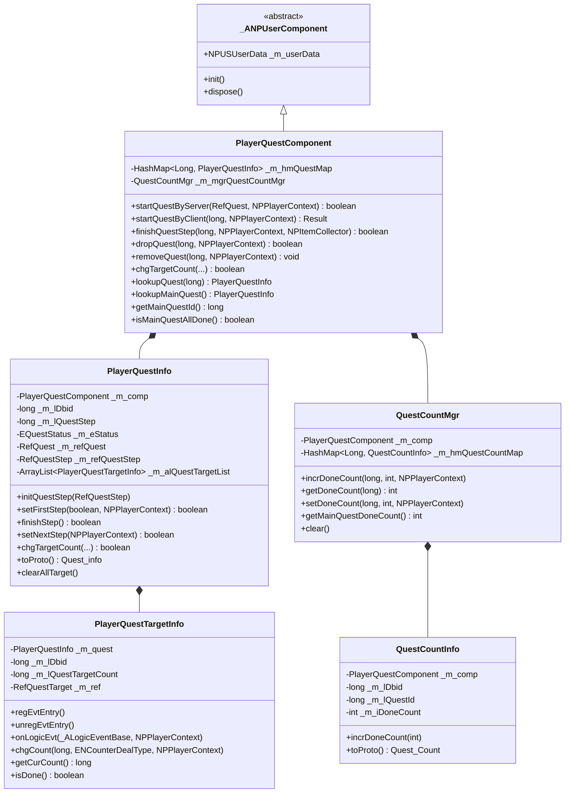
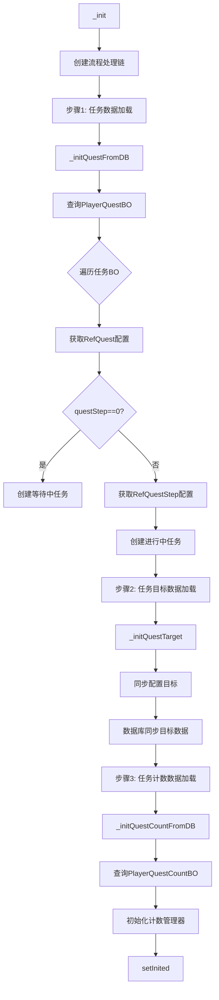
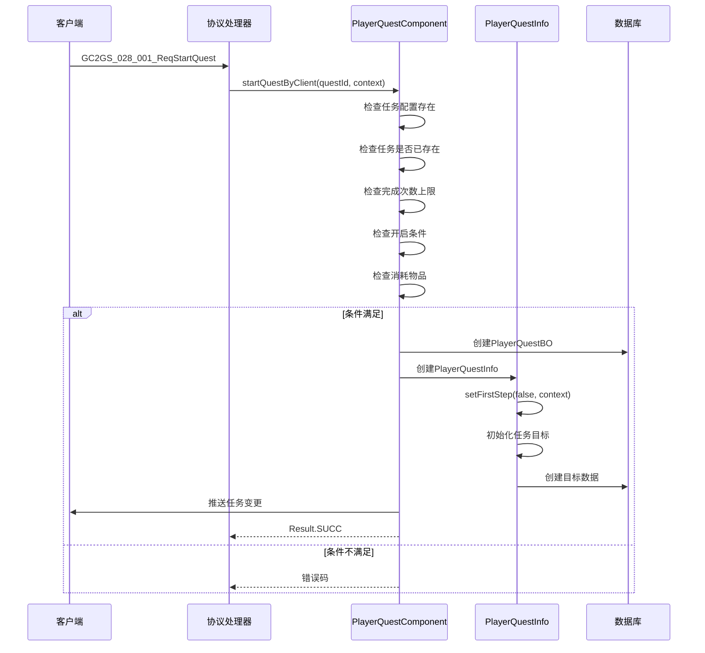
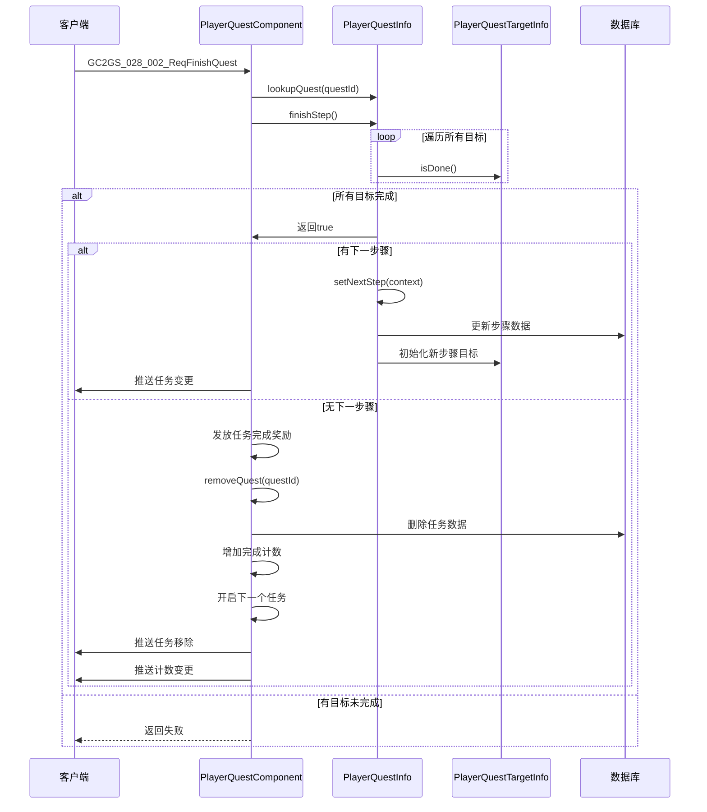
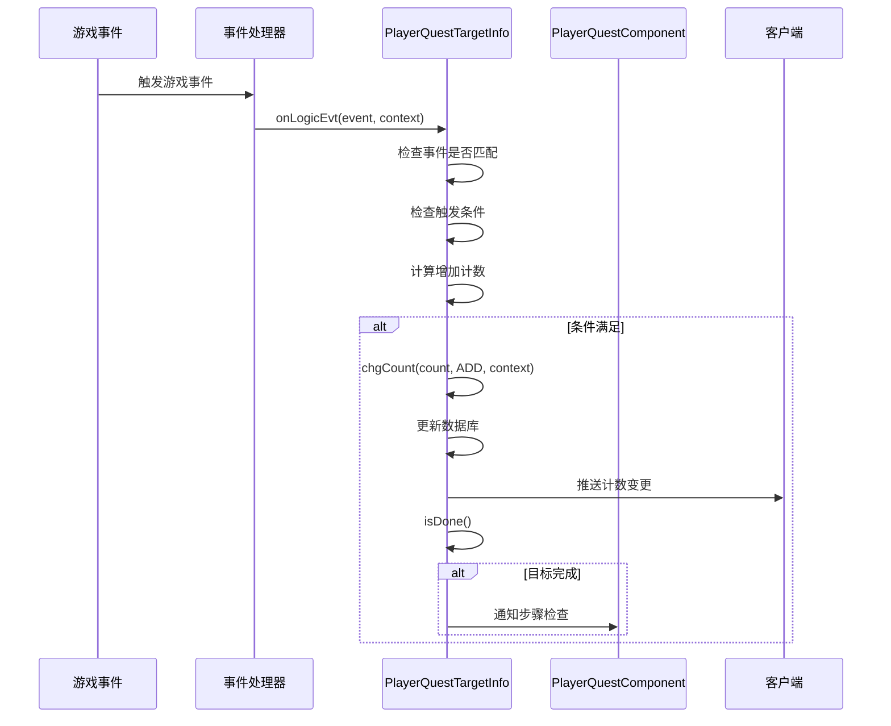
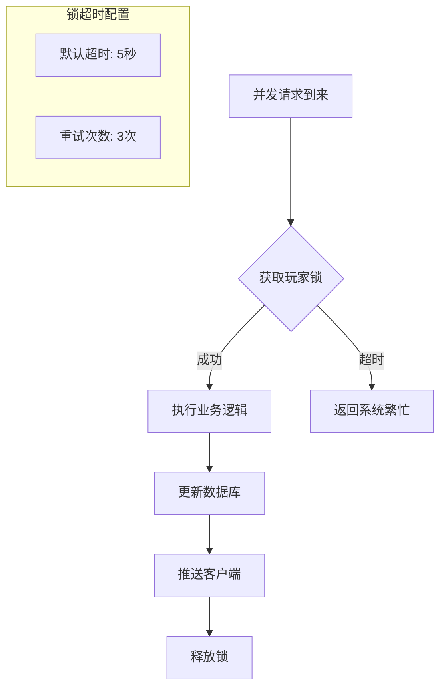
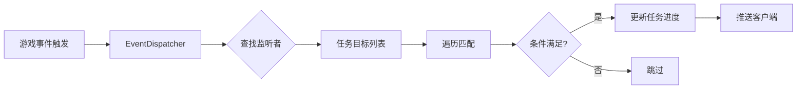
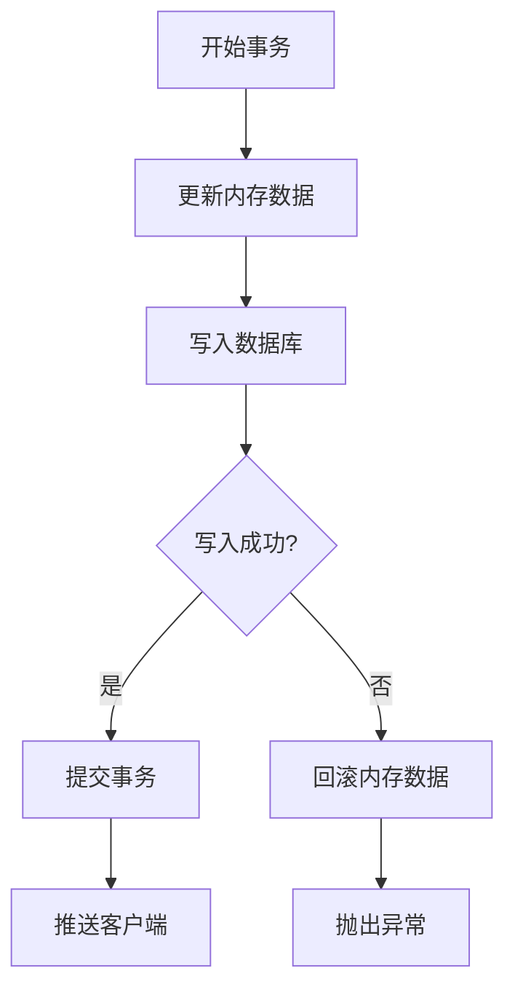

# 任务模块服务端开发文档

## 一、模块架构

### 1.1 模块概述

任务模块（Quest Module）负责管理游戏中的各类任务，包括：
- 主线任务进度管理
- 日常任务系统
- 系统任务（成就、目标等）
- 活跃度系统
- 任务目标追踪

### 1.2 模块编号

协议模块编号: `p028`

### 1.3 类结构图



---

## 二、核心数据结构

### 2.1 任务数据 (Quest_info)

**路径**: `ClientProtocol/Common/QuestObj/Quest_info.cs`

| 字段名 | 类型 | 说明 |
|--------|------|------|
| questId | long | 任务配置ID |
| questStatus | EQuestStatus | 任务状态（WAITING/PROGRESSING） |
| questStep | Quest_Step | 任务步骤数据 |

### 2.2 任务步骤数据 (Quest_Step)

**路径**: `ClientProtocol/Common/QuestObj/Quest_Step.cs`

| 字段名 | 类型 | 说明 |
|--------|------|------|
| questStep | long | 步骤ID |
| targetList | List&lt;Quest_Target&gt; | 目标列表 |
| expireTimeTagS | int | 超时时间戳（秒），0表示永久 |

### 2.3 任务目标数据 (Quest_Target)

**路径**: `ClientProtocol/Common/QuestObj/Quest_Target.cs`

| 字段名 | 类型 | 说明 |
|--------|------|------|
| targetId | long | 目标配置ID |
| curCount | long | 当前计数 |

### 2.4 任务计数 (Quest_Count)

**路径**: `ClientProtocol/Common/QuestObj/Quest_Count.cs`

| 字段名 | 类型 | 说明 |
|--------|------|------|
| questId | long | 任务配置ID |
| doneCount | int | 完成次数 |

### 2.5 任务状态枚举 (EQuestStatus)

**路径**: `ClientProtocol/Common/QuestEnum/EQuestStatus.cs`

| 枚举值 | 数值 | 说明 |
|--------|------|------|
| NONE | 0 | 无状态/无效 |
| WAITING | 1 | 等待中（未满足开启条件） |
| PROGRESSING | 2 | 进行中 |

---

## 三、数据库设计

### 3.1 任务数据表 (player_quest)

**对应BO**: `USDB.Bo.PlayerQuestBO`

| 字段名 | 类型 | 说明 |
|--------|------|------|
| id | BIGINT | 主键 |
| cid | BIGINT | 玩家CID |
| quest_id | BIGINT | 任务配置ID |
| quest_step | BIGINT | 当前步骤ID |
| step_expire_time_tag | INT | 步骤超时时间戳 |
| create_time | DATETIME | 创建时间 |
| update_time | DATETIME | 更新时间 |

**索引设计**:
- 主键索引: `id`
- 玩家索引: `idx_cid` (cid)

### 3.2 任务目标数据表 (player_quest_target)

**对应BO**: `USDB.Bo.PlayerQuestTargetBO`

| 字段名 | 类型 | 说明 |
|--------|------|------|
| id | BIGINT | 主键 |
| cid | BIGINT | 玩家CID |
| quest_id | BIGINT | 任务配置ID |
| quest_step | BIGINT | 步骤ID |
| quest_target | BIGINT | 目标ID |
| quest_target_count | BIGINT | 目标计数 |

**索引设计**:
- 主键索引: `id`
- 复合索引: `idx_cid_quest` (cid, quest_id)

### 3.3 任务计数表 (player_quest_count)

**对应BO**: `USDB.Bo.PlayerQuestCountBO`

| 字段名 | 类型 | 说明 |
|--------|------|------|
| id | BIGINT | 主键 |
| cid | BIGINT | 玩家CID |
| quest_id | BIGINT | 任务配置ID |
| done_count | INT | 完成次数 |

**索引设计**:
- 主键索引: `id`
- 复合索引: `idx_cid_quest` (cid, quest_id)

---

## 四、协议处理

### 4.1 请求协议 (GC2GS)

#### 任务操作

| 协议名 | 主序号 | 子序号 | 说明 |
|--------|--------|--------|------|
| GC2GS_028_001_ReqStartQuest | 28 | 1 | 开始任务 |
| GC2GS_028_002_ReqFinishQuest | 28 | 2 | 完成任务 |
| GC2GS_028_003_ReqDropQuest | 28 | 3 | 放弃任务 |

#### 日常任务

| 协议名 | 主序号 | 子序号 | 说明 |
|--------|--------|--------|------|
| GC2GS_028_010_ReqFinishDailyQuest | 28 | 10 | 完成日常任务 |
| GC2GS_028_011_ReqDrawActiveReward | 28 | 11 | 领取活跃度奖励 |
| GC2GS_028_012_ReqDailyQuestTryFresh | 28 | 12 | 尝试刷新日常任务 |
| GC2GS_028_013_ReqDailyQuestAKeyDrawFinishReward | 28 | 13 | 一键领取完成奖励 |
| GC2GS_028_014_ReqDailyQuestAKeyDrawActiveReward | 28 | 14 | 一键领取活跃度奖励 |

#### 系统任务

| 协议名 | 主序号 | 子序号 | 说明 |
|--------|--------|--------|------|
| GC2GS_028_020_ReqSystemQuestDrawReward | 28 | 20 | 领取系统任务奖励 |
| GC2GS_028_021_ReqSystemQuestAddClientCount | 28 | 21 | 添加客户端计数 |

---

## 五、核心逻辑流程

### 5.1 组件初始化流程



### 5.2 开始任务流程



### 5.3 完成任务步骤流程



### 5.4 任务进度更新流程



---

## 六、关键代码实现

### 6.1 服务器开启任务

```java
public boolean startQuestByServer(RefQuest _ref, NPPlayerContext _context)
{
    if (null == _ref)
        return false;

    getUserData().lockUser();

    try
    {
        PlayerQuestInfo quest = _m_hmQuestMap.get(_ref.quest_id);

        // 已存在的任务检查
        if (null != quest)
        {
            if (quest.isInvalid())
                return false;

            if (quest.isProgressing())
            {
                // 推送协议
                getUserData().sendMsgToGC(
                    US2GCWriter_028_QuestOp.make_050_OnPlayerQuestChg(quest.toProto())
                );
                return true;
            }
        }
        else
        {
            // 检查完成次数
            if (_ref.done_count > 0 &&
                _m_mgrQuestCountMgr.getDoneCount(_ref.quest_id) >= _ref.done_count)
            {
                return false;
            }

            // 创建等待中的任务
            PlayerQuestBO bo = new PlayerQuestBO();
            bo.setCid(bmObj, getUserData().getCid());
            bo.setQuestId(bmObj, _ref.quest_id);
            bo.insert(bmObj);

            quest = new PlayerQuestInfo(this, bo, _ref);
            _m_hmQuestMap.put(quest.getQuestId(), quest);
        }

        // 检查是否可以开启
        do
        {
            if (!NPPlayerConditionDealerMgr.IsEnable(_ref.start_condition, getUserData(), null))
                break;

            if (!getUserData().hasCostItemList(_ref.start_cost_item_list) ||
                !getUserData().spendCostItemList(_ref.start_cost_item_list, _context))
            {
                break;
            }

            quest.setFirstStep(true, _context);

        } while (false);

        // 推送协议
        getUserData().sendMsgToGC(
            US2GCWriter_028_QuestOp.make_050_OnPlayerQuestChg(quest.toProto())
        );

        quest._log(ENpLogType.ADD, _context);

        return true;
    }
    finally
    {
        getUserData().unlockUser();
    }
}
```

### 6.2 客户端发起开始任务

```java
public Result startQuestByClient(long _questId, NPPlayerContext _context)
{
    // 任务配置
    RefQuest ref = RefQuest.getMgr().get(_questId);
    if (null == ref)
    {
        USLog.error(getUSServer(), "start quest fail, not find ref, cid:{} quest:{}",
            getUserData().getCid(), _questId);
        return CommErr.REF_NOT_FOUND;
    }

    getUserData().lockUser();

    try
    {
        PlayerQuestInfo quest = _m_hmQuestMap.get(_questId);
        // 已经存在的任务，再次尝试开启
        if (null != quest)
        {
            if (startQuestByServer(ref, _context))
                return Result.SUCC;

            return QuestErr.QUEST_NOT_EXIST;
        }

        // 检查完成次数
        if (ref.done_count > 0 && _m_mgrQuestCountMgr.getDoneCount(_questId) >= ref.done_count)
        {
            return QuestErr.QUEST_DONE_EXCEED_ERROR;
        }

        // 检查开启条件
        if (!NPPlayerConditionDealerMgr.IsEnable(ref.start_condition, getUserData(), null))
        {
            return QuestErr.QUEST_START_COND_ERROR;
        }

        // 消耗物品
        if (!getUserData().hasCostItemList(ref.start_cost_item_list))
        {
            return QuestErr.QUEST_START_COST_ITEM_ERROR;
        }
        if (!getUserData().spendCostItemList(ref.start_cost_item_list, _context))
        {
            return QuestErr.QUEST_START_COST_ITEM_FAIL;
        }

        BM bmObj = getUSServer().getBM();

        // 创建任务
        PlayerQuestBO bo = new PlayerQuestBO();
        bo.setCid(bmObj, getUserData().getCid());
        bo.setQuestId(bmObj, ref.quest_id);
        bo.insert(bmObj);

        quest = new PlayerQuestInfo(this, bo, ref);
        _m_hmQuestMap.put(quest.getQuestId(), quest);

        // 设置首步骤
        quest.setFirstStep(false, _context);

        // 推送协议
        getUserData().sendMsgToGC(
            US2GCWriter_028_QuestOp.make_050_OnPlayerQuestChg(quest.toProto())
        );

        // 日志数据
        quest._log(ENpLogType.ADD, _context);

        return Result.SUCC;
    }
    finally
    {
        getUserData().unlockUser();
    }
}
```

### 6.3 任务目标事件处理

```java
protected void onLogicEvt(_ALogicEventBase _evt, NPPlayerContext _context)
{
    NPVarInfo varInfo = EventParamVarTypeMap.getInstance().makeVarInfo(_evt);

    // 检查触发条件
    if (!NPPlayerConditionDealerMgr.IsEnable(
        _m_ref.trigger_condition,
        getQuest().getComp().getUserData(),
        varInfo))
    {
        return;
    }

    // 增加任务计数
    long chgCount = _evt.getValue(_m_ref.trigger_count_rate);
    if (chgCount != 0)
    {
        addCount(chgCount, _context);
    }

    // 触发额外效果
    NPPlayerEffectDealer.dealEffect(
        _m_ref.ext_trigger_effect,
        getQuest().getComp().getUserData(),
        varInfo,
        _context
    );
}
```

### 6.4 任务计数变更

```java
protected void chgCount(long _chgCount, ENCounterDealType _dealType, NPPlayerContext _context)
{
    long oriCount = _m_lQuestTargetCount;

    // 计算当前计数
    long curCount = 0;
    switch (_dealType)
    {
        case REDUCE:
            curCount = oriCount - _chgCount;
            break;
        case SET:
            curCount = _chgCount;
            break;
        case SET_GT:
            curCount = oriCount < _chgCount ? _chgCount : oriCount;
            break;
        case ADD:
        default:
            curCount = oriCount + _chgCount;
            break;
    }

    _m_lQuestTargetCount = curCount;

    BM bmObj = getUSServer().getBM();

    // 更新数据库
    if (_m_lDbid == 0)
    {
        PlayerQuestTargetBO bo = new PlayerQuestTargetBO();
        bo.setCid(bmObj, getQuest().getComp().getUserData().getCid());
        bo.setQuestId(bmObj, _m_quest.getQuestId());
        bo.setQuestStep(bmObj, _m_quest.getQuestStep());
        bo.setQuestTarget(bmObj, _m_ref.id);
        bo.setQuestTargetCount(bmObj, _m_lQuestTargetCount);
        bo.insert(bmObj);

        _m_lDbid = bo.getId();
    }
    else
    {
        ALMySqlUpdateValue updateValue = new ALMySqlUpdateValue();
        updateValue.addValueObj("quest_target_count", _m_lQuestTargetCount);
        bmObj.getBM(PlayerQuestTargetBO.class).update("id", _m_lDbid, updateValue);
    }

    // 推送协议
    getQuest().getComp().getUserData().sendMsgToGC(
        US2GCWriter_028_QuestOp.make_051_OnPlayerQuestStepCountChg(
            _m_quest.getQuestId(),
            _m_quest.getQuestStep(),
            _m_ref.id,
            _m_lQuestTargetCount
        )
    );

    // 记录日志
    LogQuestTargetBO logBo = new LogQuestTargetBO();
    logBo.setCid(bmObj, getQuest().getComp().getUserData().getCid());
    logBo.setQuestId(bmObj, _m_quest.getQuestId());
    logBo.setQuestDbid(bmObj, _m_quest.getDbid());
    logBo.setStep(bmObj, _m_quest.getQuestStep());
    logBo.setTarget(bmObj, getTargetId());
    logBo.setOriCount(bmObj, oriCount);
    logBo.setCurCount(bmObj, getTargetSelfCount());
    CommLogDB.log(bmObj, logBo, _context);
}
```

### 6.5 完成任务步骤

```java
public boolean finishQuestStep(long _questId, NPPlayerContext _context, NPItemCollector _itemCollector)
{
    getUserData().lockUser();

    try
    {
        PlayerQuestInfo quest = _m_hmQuestMap.get(_questId);
        if (null == quest || !quest.isProgressing())
            return false;

        long curStep = quest.getQuestStep();

        // 1. 检查步骤是否完成
        if (!quest.finishStep())
            return false;

        // 2. 扣除完成消耗
        getUserData().spendCostItemList(quest.getStepRef().done_cost_item_list, _context);

        // 3. 发放步骤奖励
        NPPlayerContext gainContext = NPPlayerContext.createNew(_context);
        getUserData().gainItemList(quest.getStepRef().done_gain_item_list, gainContext);

        // 4. 执行完成效果
        NPPlayerEffectDealer.dealEffect(
            quest.getStepRef().ext_done_effect,
            getUserData(),
            null,
            gainContext
        );

        // 5. 发送奖励信息
        if (!gainContext.getCollector().isEmpty())
        {
            getUserData().sendMsgToGC(
                gainContext.getCollector().toProto(quest.getStepRef().tip_reward)
            );
            _itemCollector.addItemList(gainContext.getCollector().getAllItemList());
        }

        // 6. 检查下一步骤
        if (!quest.hasNextStep())
        {
            // 任务完成
            NPPlayerContext doneContext = NPPlayerContext.createNew(_context);
            getUserData().gainItemList(quest.getRef().done_gain_item_list, doneContext);

            if (!doneContext.getCollector().isEmpty())
            {
                getUserData().sendMsgToGC(
                    doneContext.getCollector().toProto(quest.getRef().tip_reward)
                );
                _itemCollector.addItemList(doneContext.getCollector().getAllItemList());
            }

            // 移除任务
            removeQuest(_questId, _context);

            // 增加完成计数
            _m_mgrQuestCountMgr.incrDoneCount(_questId, 1, _context);

            // 开启下一个任务
            if (quest.getRef().next_quest_id > 0)
            {
                RefQuest questRef = RefQuest.getMgr().get(quest.getRef().next_quest_id);
                startQuestByServer(questRef, _context);
            }
        }
        else
        {
            // 进入下一步骤
            quest.setNextStep(_context);
            quest._log(ENpLogType.SET, _context);
        }

        return true;
    }
    finally
    {
        getUserData().unlockUser();
    }
}
```

---

## 七、服务配置

### 7.1 协议注册

```java
// 协议主序号
public const byte QUEST_MODULE_ORDER = 28;

// 协议处理器注册
protocolHandler.Register<GC2GS_028_001_ReqStartQuest>(OnStartQuest);
protocolHandler.Register<GC2GS_028_002_ReqFinishQuest>(OnFinishQuest);
protocolHandler.Register<GC2GS_028_003_ReqDropQuest>(OnDropQuest);
protocolHandler.Register<GC2GS_028_004_ReqAddClientTargetCount>(OnAddClientTargetCount);
protocolHandler.Register<GC2GS_028_010_ReqFinishDailyQuest>(OnFinishDailyQuest);
protocolHandler.Register<GC2GS_028_011_ReqDrawActiveReward>(OnDrawActiveReward);
protocolHandler.Register<GC2GS_028_012_ReqDailyQuestTryFresh>(OnDailyQuestTryFresh);
protocolHandler.Register<GC2GS_028_013_ReqDailyQuestAKeyDrawFinishReward>(OnAKeyDrawFinishReward);
protocolHandler.Register<GC2GS_028_014_ReqDailyQuestAKeyDrawActiveReward>(OnAKeyDrawActiveReward);
protocolHandler.Register<GC2GS_028_020_ReqSystemQuestDrawReward>(OnSystemQuestDrawReward);
protocolHandler.Register<GC2GS_028_021_ReqSystemQuestAddClientCount>(OnSystemQuestAddClientCount);
```

### 7.2 服务依赖

任务模块依赖以下服务：
- 玩家数据服务 (PlayerDataService)
- 资源服务 (ResourceService)
- 配置数据服务 (RefdataService)
- 推送服务 (PushService)
- 事件服务 (EventService)

---

## 八、GM命令

### 8.1 GM命令列表

| 方法名 | 说明 |
|--------|------|
| gmSetMainTargetCount | 设置主线任务目标计数 |
| gmSetTargetCount | 设置指定目标计数 |
| gmFinishCurMainQuestStep | 完成当前主线任务步骤 |
| gmFinishQuestStep | 完成指定任务步骤 |
| gmSetMainQuest | 设置指定主线任务 |
| gmFinishAllMainQuest | 完成全部主线任务 |
| gmSetAllFinishDone | 设置所有任务完成 |
| gmSetQuestStep | 设置指定任务步骤 |
| gmResetAll | 重置所有任务数据 |

### 8.2 GM命令示例

```java
// 设置指定主线任务
public boolean gmSetMainQuest(RefQuest _ref, NPPlayerContext _context)
{
    if (null == _ref || _ref.quest_type != EQuestType.MAIN)
        return false;

    // 移除原有的主线任务
    for (PlayerQuestInfo quest : _m_hmQuestMap.values())
    {
        if (quest.getRef().quest_type == EQuestType.MAIN)
        {
            removeQuest(quest.getQuestId(), _context);
            break;
        }
    }

    // 设置前置任务完成计数
    ArrayList<RefQuest> beforeQuestList = MainQuestMgr.getInstance().getBeforeQuestList(_ref.quest_id);
    for (RefQuest questRef : beforeQuestList)
    {
        getCountMgr().incrDoneCount(questRef.quest_id, 1, _context);
    }

    // 清理完成计数
    getCountMgr().setDoneCount(_ref.quest_id, 0, _context);

    // 设置当前主线任务
    startQuestByServer(_ref, _context);

    return true;
}

// 完成全部主线任务
public void gmFinishAllMainQuest(NPPlayerContext _context)
{
    getUserData().lockUser();

    try
    {
        ArrayList<RefQuest> allMainQuestList = MainQuestMgr.getInstance().getAllList();
        RefQuest lastMainQuest = allMainQuestList.get(allMainQuestList.size() - 1);

        startQuestByServer(lastMainQuest, _context);
        gmFinishQuestStep(lastMainQuest.quest_id, _context);

        for (RefQuest questRef : allMainQuestList)
        {
            getCountMgr().setDoneCount(questRef.quest_id, 1, _context);
            if (lastMainQuest.quest_id != questRef.quest_id)
            {
                removeQuest(questRef.quest_id, _context);
            }
        }
    }
    finally
    {
        getUserData().unlockUser();
    }
}
```

---

## 九、错误处理

### 9.1 错误码定义

| 错误码 | 常量名 | 说明 | 处理建议 |
|--------|--------|------|----------|
| 140001 | DAILY_QUEST_NOT_EXIST | 日常任务不存在 | 检查任务配置 |
| 140002 | DAILY_QUEST_HAS_FINISH | 日常任务已经完成 | 刷新任务列表 |
| 140009 | QUEST_NOT_EXIST | 任务不存在 | 检查任务配置 |
| 140010 | QUEST_DONE_EXCEED_ERROR | 任务完成次数超限 | 提示次数上限 |
| 140011 | QUEST_START_COND_ERROR | 任务开启条件未通过 | 提示具体条件 |
| 140012 | QUEST_START_COST_ITEM_ERROR | 开启消耗物品不足 | 提示缺少的物品 |
| 140013 | QUEST_START_COST_ITEM_FAIL | 开启消耗物品失败 | 检查物品状态 |
| 140014 | QUEST_FINISH_FAIL | 任务完成失败 | 检查任务状态 |
| 140015 | QUEST_DROP_FAIL | 任务放弃失败 | 检查任务是否可放弃 |
| 140016 | QUEST_CLIENT_CHG_COUNT_FAIL | 修改任务计数失败 | 检查任务目标状态 |

---

## 十、日志记录

### 10.1 任务日志表结构

**LogQuestBO**:

| 字段名 | 类型 | 说明 |
|--------|------|------|
| cid | long | 玩家CID |
| log_type | int | 日志类型（ADD/SET/DEL） |
| quest_id | long | 任务配置ID |
| quest_dbid | long | 任务数据库ID |
| type | int | 任务类型 |
| step | long | 当前步骤 |
| expired_ts | int | 超时时间戳 |
| status | int | 任务状态 |

### 10.2 目标日志表结构

**LogQuestTargetBO**:

| 字段名 | 类型 | 说明 |
|--------|------|------|
| cid | long | 玩家CID |
| quest_id | long | 任务配置ID |
| quest_dbid | long | 任务数据库ID |
| step | long | 当前步骤 |
| target | long | 目标ID |
| ori_count | long | 原始计数 |
| cur_count | long | 当前计数 |

---

## 十一、并发处理机制

### 11.1 线程安全设计

```java
// 任务组件线程安全
public class PlayerQuestComponent extends _ANPUserComponent
{
    // 所有操作必须加锁
    public boolean startQuestByServer(RefQuest _ref, NPPlayerContext _context)
    {
        getUserData().lockUser();  // 加锁
        try
        {
            // 业务逻辑处理
            return _startQuestInternal(_ref, _context);
        }
        finally
        {
            getUserData().unlockUser();  // 解锁
        }
    }
}
```

### 11.2 并发场景处理



### 11.3 死锁预防

```java
// 锁获取顺序规范
public class LockOrder
{
    // 1. 玩家锁 (getUserData().lockUser())
    // 2. 公会锁 (getGuildData().lockGuild())
    // 3. 全局锁 (getServer().lockGlobal())

    // 禁止反向获取锁，防止死锁
}

// 锁超时机制
public class LockTimeoutHandler
{
    private static final int LOCK_TIMEOUT_MS = 5000;

    public boolean tryLockWithTimeout(UserData userData)
    {
        long startTime = System.currentTimeMillis();
        while (!userData.tryLock())
        {
            if (System.currentTimeMillis() - startTime > LOCK_TIMEOUT_MS)
            {
                USLog.error("Lock timeout, cid: {}", userData.getCid());
                return false;
            }
            Thread.sleep(10);
        }
        return true;
    }
}
```

---

## 十二、事件处理机制

### 12.1 事件监听注册

```java
// 任务目标事件注册
public class PlayerQuestTargetInfo
{
    // 注册事件监听
    public void regEvtEntry()
    {
        if (_m_ref == null || _m_ref.trigger_event == null)
            return;

        for (String evtName : _m_ref.trigger_event)
        {
            getQuest().getComp().getUserData()
                .getEventDispatcher()
                .registerListener(evtName, this::_onLogicEvt);
        }
    }

    // 注销事件监听
    public void unregEvtEntry()
    {
        if (_m_ref == null || _m_ref.trigger_event == null)
            return;

        for (String evtName : _m_ref.trigger_event)
        {
            getQuest().getComp().getUserData()
                .getEventDispatcher()
                .unregisterListener(evtName, this::_onLogicEvt);
        }
    }
}
```

### 12.2 事件分发流程



### 12.3 事件类型定义

| 事件类型 | 说明 | 参数 |
|----------|------|------|
| PLAYER_LEVEL_UP | 玩家升级 | level |
| KILL_MONSTER | 击杀怪物 | monsterId, count |
| PASS_DUNGEON | 通关副本 | dungeonId |
| GET_HERO | 获得英雄 | heroId |
| UPGRADE_BUILDING | 升级建筑 | buildingId |
| SPEND_GOLD | 消费金币 | amount |
| ADD_FRIEND | 添加好友 | friendId |
| JOIN_GUILD | 加入公会 | guildId |

---

## 十三、数据持久化策略

### 13.1 数据库操作封装

```java
// 任务数据持久化
public class PlayerQuestInfo
{
    // 创建任务记录
    public void insertToDB()
    {
        BM bmObj = getUSServer().getBM();
        PlayerQuestBO bo = new PlayerQuestBO();
        bo.setCid(bmObj, getComp().getUserData().getCid());
        bo.setQuestId(bmObj, _m_refQuest.quest_id);
        bo.setQuestStep(bmObj, _m_lQuestStep);
        bo.setStepExpireTimeTag(bmObj, getStepExpireTimeS());
        bo.insert(bmObj);
        _m_lDbid = bo.getId();
    }

    // 更新任务记录
    public void updateToDB()
    {
        BM bmObj = getUSServer().getBM();
        ALMySqlUpdateValue updateValue = new ALMySqlUpdateValue();
        updateValue.addValueObj("quest_step", _m_lQuestStep);
        updateValue.addValueObj("step_expire_time_tag", getStepExpireTimeS());
        bmObj.getBM(PlayerQuestBO.class).update("id", _m_lDbid, updateValue);
    }

    // 删除任务记录
    public void deleteFromDB()
    {
        BM bmObj = getUSServer().getBM();
        bmObj.getBM(PlayerQuestBO.class).delete("id", _m_lDbid);
    }
}
```

### 13.2 批量操作优化

```java
// 批量插入目标数据
public void batchInsertTargets(List<PlayerQuestTargetInfo> targets)
{
    BM bmObj = getUSServer().getBM();
    List<PlayerQuestTargetBO> boList = new ArrayList<>();

    for (PlayerQuestTargetInfo target : targets)
    {
        PlayerQuestTargetBO bo = new PlayerQuestTargetBO();
        bo.setCid(bmObj, getComp().getUserData().getCid());
        bo.setQuestId(bmObj, _m_quest.getQuestId());
        bo.setQuestStep(bmObj, _m_quest.getQuestStep());
        bo.setQuestTarget(bmObj, target.getTargetId());
        bo.setQuestTargetCount(bmObj, target.getCurCount());
        boList.add(bo);
    }

    // 批量插入
    bmObj.getBM(PlayerQuestTargetBO.class).batchInsert(boList);
}
```

### 13.3 数据一致性保证



---

## 十四、监控与告警

### 14.1 关键监控指标

| 指标名称 | 说明 | 告警阈值 |
|----------|------|----------|
| quest_create_count | 任务创建数量 | - |
| quest_complete_count | 任务完成数量 | - |
| quest_fail_count | 任务失败数量 | > 100/min |
| quest_event_latency | 事件处理延迟 | > 50ms |
| quest_db_latency | 数据库操作延迟 | > 100ms |
| quest_lock_wait_time | 锁等待时间 | > 500ms |

### 14.2 监控埋点

```java
// 监控埋点示例
public void finishQuestStep(long questId, NPPlayerContext context)
{
    long startTime = System.currentTimeMillis();

    try
    {
        // 业务逻辑
        // ...

        // 成功计数
        MetricsCollector.increment("quest_complete_count");
    }
    catch (Exception e)
    {
        // 失败计数
        MetricsCollector.increment("quest_fail_count");
        throw e;
    }
    finally
    {
        // 记录耗时
        long elapsed = System.currentTimeMillis() - startTime;
        MetricsCollector.recordLatency("quest_finish_latency", elapsed);
    }
}
```

### 14.3 日志规范

```java
// 结构化日志
public void logQuestOperation(String operation, long questId, Result result)
{
    USLog.info("QuestOperation|cid:{}|op:{}|questId:{}|result:{}|elapsed:{}",
        getUserData().getCid(),
        operation,
        questId,
        result.getCode(),
        System.currentTimeMillis() - _startTime
    );
}
```

---

*文档生成时间: 2026-04-11*
