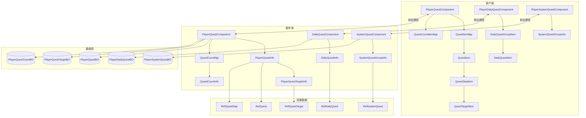
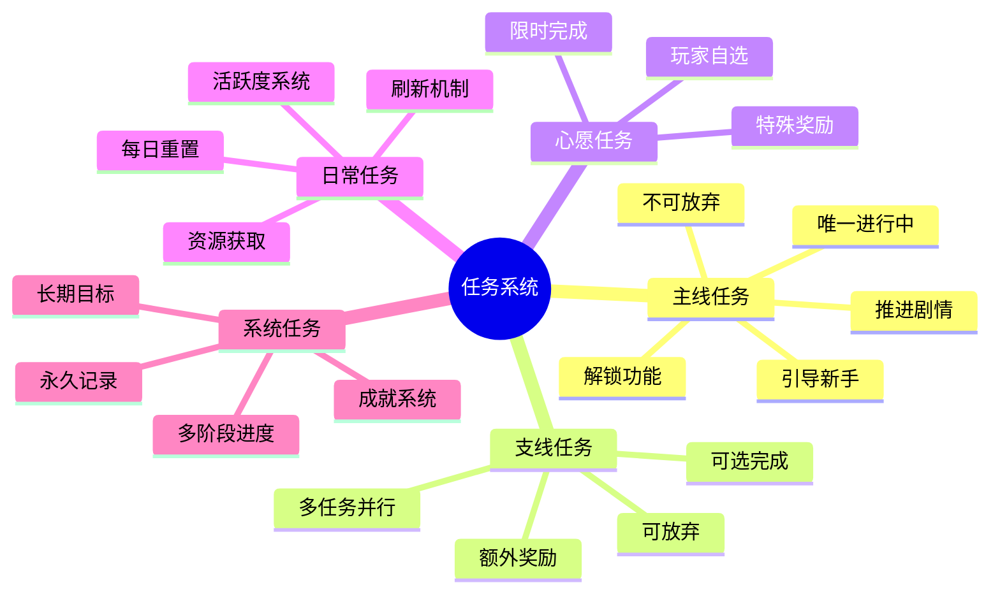
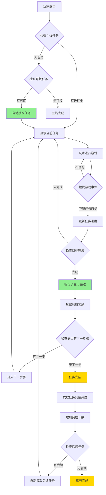
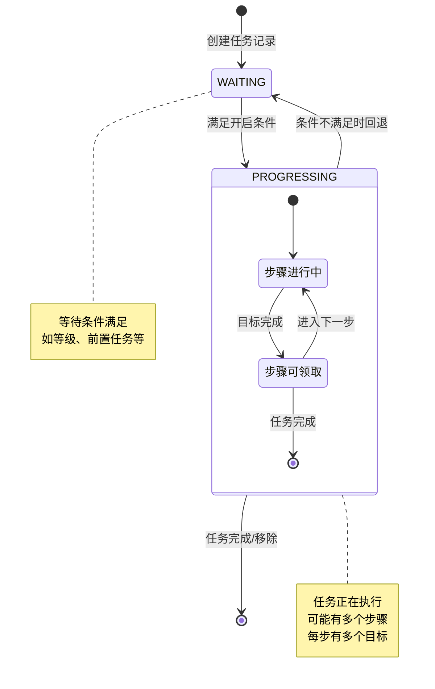
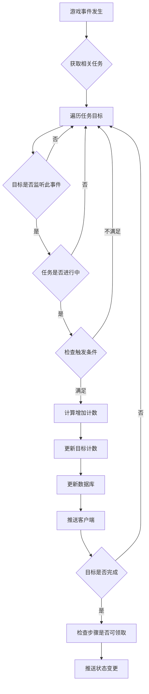
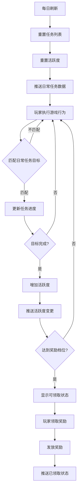
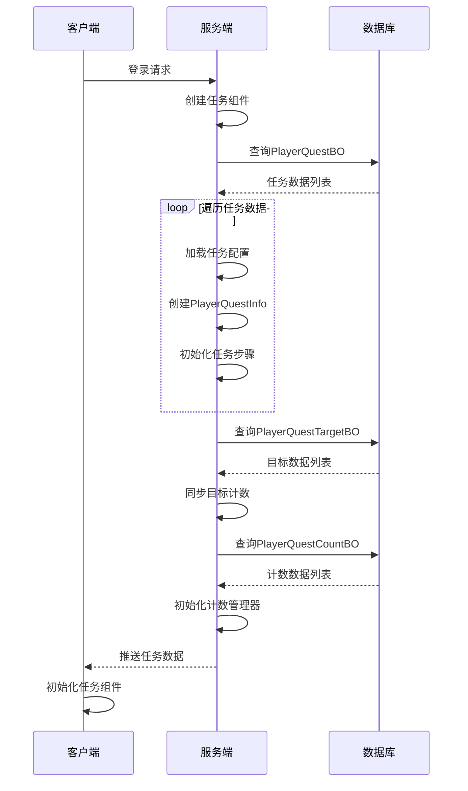
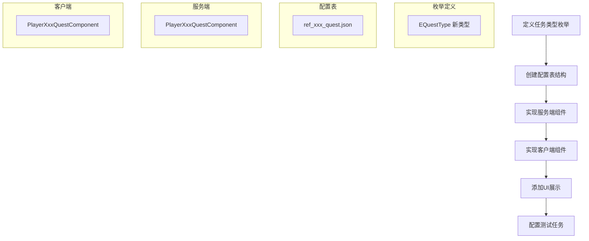
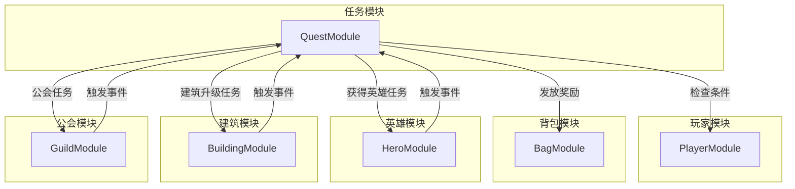
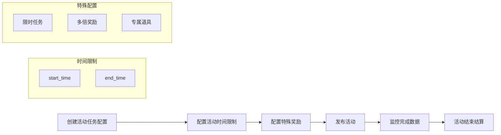

# 任务模块完整说明

## 一、模块概述

### 1.1 业务背景

任务模块是 K2C 游戏的引导和进度追踪系统。通过主线任务引导玩家逐步了解游戏玩法，通过日常任务增加玩家粘性，通过成就任务给予玩家长期目标。任务系统是连接各个游戏模块的纽带。

### 1.2 目标用户

- **新手玩家**：通过主线任务了解游戏玩法
- **活跃玩家**：通过日常任务获取每日资源
- **目标型玩家**：通过成就任务追求长期目标

### 1.3 核心价值

1. **游戏引导**：主线任务引导玩家了解各个系统
2. **玩家粘性**：日常任务增加每日登录动机
3. **目标感**：成就任务提供长期追求目标
4. **资源产出**：任务奖励是重要的资源获取途径

---

## 二、系统架构

### 2.1 模块架构图



### 2.2 任务类型



---

## 三、功能清单

### 3.1 主线任务功能

| 功能名称 | 功能描述 | 用户价值 |
|---------|---------|---------|
| 任务接取 | 自动接取可接任务 | 推进游戏进度 |
| 任务追踪 | 显示当前任务进度 | 了解任务目标 |
| 任务完成 | 达成任务目标后完成 | 获得任务奖励 |
| 奖励领取 | 领取任务完成奖励 | 获取资源收益 |
| 任务跳转 | 快速跳转到相关功能 | 便捷操作 |
| 步骤奖励 | 每个步骤完成有奖励 | 持续激励 |

### 3.2 日常任务功能

| 功能名称 | 功能描述 | 用户价值 |
|---------|---------|---------|
| 每日刷新 | 每日重置任务列表 | 新的开始 |
| 任务进度 | 实时更新任务进度 | 了解完成情况 |
| 活跃度奖励 | 达到活跃度领取奖励 | 额外收益 |
| 快速完成 | 消耗钻石快速完成 | 节省时间 |
| 任务刷新 | 消耗资源刷新任务 | 选择偏好 |
| 一键领取 | 一键领取所有奖励 | 便捷操作 |

### 3.3 系统任务功能

| 功能名称 | 功能描述 | 用户价值 |
|---------|---------|---------|
| 成就解锁 | 达成条件解锁成就 | 荣誉感 |
| 成就展示 | 展示已获成就 | 炫耀展示 |
| 成就奖励 | 成就达成奖励 | 长期收益 |
| 多阶段 | 任务有多个阶段 | 持续目标 |

---

## 四、业务流程详解

### 4.1 主线任务完整流程



**详细步骤说明**：

1. **任务接取**
   - 登录时检查是否有可接任务
   - 自动接取符合条件的主线任务
   - 更新任务列表显示

2. **进度追踪**
   - 监听游戏事件
   - 匹配任务目标条件
   - 更新任务进度

3. **任务完成**
   - 检测目标达成
   - 标记任务步骤完成状态
   - 发送完成通知

4. **奖励领取**
   - 玩家点击领取
   - 发放奖励资源
   - 触发后续任务

### 4.2 任务状态流转



### 4.3 任务目标触发流程



### 4.4 日常任务流程



---

## 五、关键规则

### 5.1 主线任务规则

| 规则名称 | 规则描述 |
|----------|----------|
| 任务顺序 | 必须按顺序完成，有前置任务依赖 |
| 章节划分 | 任务按章节组织，完成章节解锁下一章 |
| 唯一性 | 同时只能有一个主线任务进行中 |
| 自动接取 | 满足条件时自动接取，无需手动操作 |
| 不可放弃 | 主线任务不可主动放弃 |
| 完成计数 | 完成后增加计数，用于判断是否可重复接取 |

### 5.2 日常任务规则

| 规则名称 | 规则描述 |
|----------|----------|
| 刷新时间 | 每日凌晨5点重置 |
| 任务数量 | 每日固定数量日常任务 |
| 活跃度系统 | 完成任务获得活跃度，活跃度达阈值可领奖励 |
| 活跃度档位 | 20/40/60/80/100 五档奖励 |
| 刷新机制 | 可消耗资源刷新单个任务 |

### 5.3 任务目标类型

| 目标类型 | 说明 | 触发事件示例 |
|---------|------|-------------|
| 升级 | 玩家等级达到指定值 | PLAYER_LEVEL_UP |
| 获得英雄 | 获得指定或任意英雄 | GET_HERO |
| 通关副本 | 通过指定副本 | PASS_DUNGEON |
| 建筑升级 | 升级指定建筑 | UPGRADE_BUILDING |
| 英雄培养 | 英雄达到指定等级 | HERO_LEVEL_UP |
| 装备穿戴 | 穿戴指定品质装备 | EQUIP_ITEM |
| 公会加入 | 加入公会 | JOIN_GUILD |
| 社交互动 | 添加好友 | ADD_FRIEND |
| 消费 | 累计消费资源 | SPEND_GOLD |
| 客户端触发 | 由客户端主动上报 | 自定义消息 |

---

## 六、数据流转

### 6.1 数据初始化流程



### 6.2 数据同步机制

| 同步场景 | 同步内容 | 触发时机 |
|----------|----------|----------|
| 初始化同步 | 全量任务数据 | 玩家登录 |
| 任务新增 | 单个任务数据 | 接取任务 |
| 任务更新 | 任务状态/步骤 | 状态变更 |
| 目标更新 | 目标计数 | 进度变化 |
| 任务移除 | 任务ID | 完成/放弃 |

---

## 七、接口说明

### 7.1 客户端接口

| 接口名 | 说明 | 参数 |
|--------|------|------|
| reqStartQuest | 请求开始任务 | questId, callback |
| reqFinishQuest | 请求完成任务 | questId, callback |
| reqDropQuest | 请求放弃任务 | questId |
| checkCanAcceptQuest | 检查可否接受 | questId, showTip |
| getMainQuestDoneCount | 获取主线完成数 | - |
| refreshRedTip | 刷新红点 | - |

### 7.2 服务端接口

| 接口名 | 说明 | 参数 |
|--------|------|------|
| startQuestByServer | 服务端开启任务 | ref, context |
| startQuestByClient | 客户端开启任务 | questId, context |
| finishQuestStep | 完成任务步骤 | questId, context, collector |
| dropQuest | 放弃任务 | questId, context |
| removeQuest | 移除任务 | questId, context |
| chgTargetCount | 修改目标计数 | questId, stepId, targetId, count, dealType, context |
| lookupMainQuest | 查找当前主线任务 | - |
| getMainQuestId | 获取当前主线任务ID | - |
| isMainQuestAllDone | 检查所有主线任务是否完成 | - |

---

## 八、示例

### 8.1 主线任务配置示例

```json
{
    "quest_id": 10001,
    "quest_type": "MAIN",
    "name": "初来乍到",
    "chapter": 1,
    "step": 1,
    "description": "欢迎来到游戏世界",
    "target": {
        "type": "LEVEL_UP",
        "param": 2,
        "count": 1
    },
    "reward": [
        {"item_type": "EXP", "count": 100},
        {"item_type": "GOLD", "count": 500}
    ],
    "pre_quest": 0,
    "next_quest": 10002
}
```

### 8.2 玩家执行过程示例

```
1. 玩家创建角色后，系统自动检查主线任务
2. 检测到 quest_id=10001 可接取
3. 创建任务数据，状态=PROGRESSING
4. 初始化任务步骤 first_step_id=20001
5. 初始化步骤目标 target_id=30001 (升级到2级)
6. 推送任务数据到客户端

--- 玩家进行新手引导 ---

7. 玩家完成新手战斗，获得经验
8. 触发 PLAYER_LEVEL_UP 事件
9. 服务端匹配任务目标 30001
10. 更新目标计数 curCount=1
11. 检查目标完成：curCount(1) >= process_count(1)
12. 标记步骤可领取
13. 推送状态变更到客户端

--- 玩家领取奖励 ---

14. 玩家点击领取
15. 发放奖励：EXP×100, GOLD×500
16. 检查是否有下一步骤
17. 无下一步骤，任务完成
18. 增加完成计数 doneCount=1
19. 检查后续任务 next_quest_id=10002
20. 自动接取后续任务 10002
```

### 8.3 日常任务示例

**今日任务列表**:

| 任务ID | 名称 | 目标 | 进度 | 活跃度 |
|--------|------|------|------|--------|
| DAILY-001 | 英勇战斗 | 通关副本3次 | 2/3 | 10 |
| DAILY-002 | 英雄培养 | 升级英雄1次 | 0/1 | 10 |
| DAILY-003 | 每日签到 | 领取签到奖励 | 0/1 | 20 |

**活跃度进度**:
- 当前活跃度: 30
- 已解锁奖励: 20活跃度奖励
- 待解锁奖励: 40/60/80/100活跃度奖励

---

## 九、注意事项

### 9.1 开发注意事项

1. **线程安全**: 服务端所有任务操作必须加锁
2. **数据一致性**: 先更新数据库再推送客户端
3. **事件注册**: 任务目标的事件监听需要正确注册/注销
4. **内存管理**: 及时清理完成的任务数据

### 9.2 配置注意事项

1. **任务链完整性**: 确保 next_quest_id 链路完整
2. **步骤顺序**: 确保 next_step_id 链路完整
3. **条件配置**: 开启条件必须可达成
4. **奖励配置**: 奖励物品必须存在

### 9.3 测试要点

| 测试项 | 测试内容 |
|--------|----------|
| 任务接取 | 条件满足/不满足、重复接取、次数限制 |
| 任务完成 | 目标完成、步骤切换、任务链触发 |
| 任务放弃 | 可放弃/不可放弃、放弃消耗 |
| 日常任务 | 每日重置、活跃度计算、奖励领取 |
| 并发测试 | 多线程操作、数据一致性 |

---

## 十、扩展机制

### 10.1 新增任务类型

1. 在 EQuestType 枚举中添加新类型
2. 创建对应的配置表和配置类
3. 实现服务端和客户端处理逻辑
4. 添加UI展示

### 10.2 新增目标类型

1. 定义新的触发事件
2. 在配置中添加对应的事件名称
3. 服务端实现事件触发和条件匹配
4. 客户端实现进度展示

### 10.3 任务效果扩展

1. 完成效果：通过 ext_done_effect 配置
2. 触发效果：通过 ext_trigger_effect 配置
3. 放弃效果：通过 ext_drop_effect 配置

---

## 十一、性能指标

### 11.1 响应时间指标

| 操作类型 | 目标响应时间 | 说明 |
|----------|--------------|------|
| 任务接取 | < 100ms | 从请求到推送完成 |
| 任务完成 | < 150ms | 包含奖励发放 |
| 进度更新 | < 50ms | 事件触发到推送 |
| 初始化加载 | < 500ms | 包含所有任务数据 |

### 11.2 吞吐量指标

| 指标 | 目标值 | 说明 |
|------|--------|------|
| 并发任务数 | 100/服务器 | 同时处理任务数 |
| 事件处理QPS | 1000/服务器 | 每秒处理事件数 |
| 数据库写入TPS | 500/服务器 | 每秒事务数 |

### 11.3 资源消耗指标

| 资源类型 | 单玩家内存 | 说明 |
|----------|------------|------|
| 任务数据 | ~2KB | 所有进行中任务 |
| 计数数据 | ~1KB | 完成次数记录 |
| 配置缓存 | ~5MB | 全量配置数据 |

---

## 十二、扩展机制详解

### 12.1 新增任务类型



### 12.2 新增目标类型

**步骤1: 定义事件类型**

```java
// 事件类型定义
public enum EQuestEventType
{
    PLAYER_LEVEL_UP,      // 玩家升级
    KILL_MONSTER,         // 击杀怪物
    PASS_DUNGEON,         // 通关副本
    GET_HERO,             // 获得英雄
    UPGRADE_BUILDING,     // 升级建筑
    SPEND_GOLD,           // 消费金币
    CLIENT_TRIGGER        // 客户端触发
}
```

**步骤2: 实现事件触发**

```java
// 事件触发点
public void onKillMonster(long monsterId, int count)
{
    // 构建事件参数
    NPVarInfo varInfo = new NPVarInfo();
    varInfo.setParam("monsterId", monsterId);
    varInfo.setParam("count", count);

    // 分发事件
    getUserData().getEventDispatcher().dispatchEvent("KILL_MONSTER", varInfo);
}
```

**步骤3: 配置目标**

```json
{
    "id": 30001,
    "step_id": 20001,
    "process_count": 100,
    "trigger_event": ["KILL_MONSTER"],
    "trigger_condition": {
        "conditions": [
            {"type": "MONSTER_ID", "value": 1001}
        ]
    },
    "is_client_target": false
}
```

### 12.3 任务效果扩展

```java
// 自定义效果处理器
public class QuestEffectHandler
{
    public static void dealEffect(NPPlayerEffectListParse effect, NPUserData userData, NPVarInfo varInfo)
    {
        if (effect == null) return;

        for (NPPlayerEffectObj effectObj : effect.effects)
        {
            switch (effectObj.type)
            {
                case ADD_ITEM:
                    userData.gainItem(effectObj.itemType, effectObj.itemId, effectObj.count);
                    break;
                case TRIGGER_EVENT:
                    userData.getEventDispatcher().dispatchEvent(effectObj.eventName, varInfo);
                    break;
                case UNLOCK_FUNCTION:
                    userData.getFunctionComponent().unlockFunction(effectObj.functionId);
                    break;
                // 扩展更多效果类型...
            }
        }
    }
}
```

---

## 十三、跨模块交互

### 13.1 模块依赖关系



### 13.2 事件订阅机制

```java
// 跨模块事件订阅
public class QuestEventSubscriber
{
    public void subscribeAll()
    {
        // 订阅玩家事件
        subscribe("PLAYER_LEVEL_UP", this::onPlayerLevelUp);

        // 订阅英雄事件
        subscribe("GET_HERO", this::onGetHero);
        subscribe("HERO_LEVEL_UP", this::onHeroLevelUp);

        // 订阅建筑事件
        subscribe("UPGRADE_BUILDING", this::onUpgradeBuilding);

        // 订阅副本事件
        subscribe("PASS_DUNGEON", this::onPassDungeon);
    }
}
```

### 13.3 条件判断集成

```java
// 跨模块条件判断
public class QuestConditionChecker
{
    public static boolean checkCondition(NPPlayerConditionObj condition, NPUserData userData)
    {
        switch (condition.type)
        {
            case PLAYER_LEVEL:
                return userData.getLevel() >= condition.value;

            case QUEST_DONE:
                return userData.getQuestComponent().getDoneCount(condition.value) > 0;

            case ITEM_COUNT:
                return userData.getBagComponent().getItemCount(condition.itemType, condition.itemId) >= condition.value;

            case HERO_OWN:
                return userData.getHeroComponent().hasHero(condition.value);

            case BUILDING_LEVEL:
                return userData.getBuildingComponent().getBuildingLevel(condition.value) >= condition.level;

            default:
                return false;
        }
    }
}
```

---

## 十四、安全与风控

### 14.1 任务刷量防护

```java
// 任务次数限制
public boolean checkQuestLimit(long questId)
{
    RefQuest ref = RefQuest.getMgr().get(questId);
    if (ref == null) return false;

    // 检查完成次数
    int doneCount = _m_mgrQuestCountMgr.getDoneCount(questId);
    if (ref.done_count > 0 && doneCount >= ref.done_count)
    {
        USLog.warn("Quest done count exceed, cid:{}, quest:{}, count:{}",
            getUserData().getCid(), questId, doneCount);
        return false;
    }

    return true;
}

// 进度更新频率限制
public boolean checkUpdateRate(long questId, long targetId)
{
    String key = questId + "_" + targetId;
    Long lastTime = _m_lastUpdateTimeMap.get(key);

    long now = System.currentTimeMillis();
    if (lastTime != null && now - lastTime < 1000) // 1秒内只能更新一次
    {
        USLog.warn("Quest update too fast, cid:{}, key:{}", getUserData().getCid(), key);
        return false;
    }

    _m_lastUpdateTimeMap.put(key, now);
    return true;
}
```

### 14.2 异常数据检测

```java
// 异常数据检测
public void detectAbnormalData()
{
    for (PlayerQuestInfo quest : _m_hmQuestMap.values())
    {
        // 检测进度异常
        for (PlayerQuestTargetInfo target : quest.getTargetList())
        {
            if (target.getCurCount() > target.getRef().process_count * 10)
            {
                USLog.error("Abnormal quest target count, cid:{}, quest:{}, target:{}, count:{}",
                    getUserData().getCid(),
                    quest.getQuestId(),
                    target.getTargetId(),
                    target.getCurCount()
                );
            }
        }
    }
}
```

---

## 十五、运营支持

### 15.1 运营活动任务



### 15.2 数据统计支持

| 统计维度 | 说明 | 用途 |
|----------|------|------|
| 任务完成率 | 完成人数/接取人数 | 评估任务难度 |
| 任务耗时 | 完成时间分布 | 优化任务设计 |
| 任务放弃率 | 放弃人数/接取人数 | 识别问题任务 |
| 活跃度分布 | 各档位领取人数 | 调整奖励配置 |

### 15.3 热更新配置

```java
// 配置热更新
public void reloadQuestConfig()
{
    // 1. 备份当前配置
    Map<Long, RefQuest> oldConfig = new HashMap<>(RefQuest.getMgr().getAll());

    try
    {
        // 2. 加载新配置
        RefQuest.getMgr().reload();

        // 3. 验证新配置
        validateConfig();

        // 4. 应用新配置
        applyNewConfig();

        USLog.info("Quest config reloaded successfully");
    }
    catch (Exception e)
    {
        // 5. 回滚到旧配置
        RefQuest.getMgr().restore(oldConfig);
        USLog.error("Quest config reload failed, rollback", e);
    }
}
```

---

*文档生成时间: 2026-04-11*
