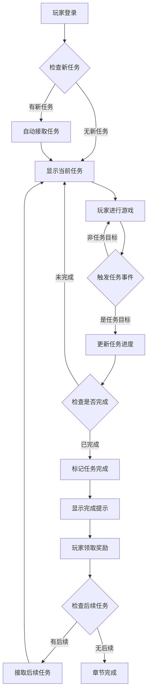
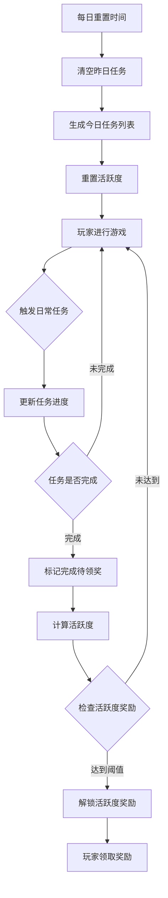
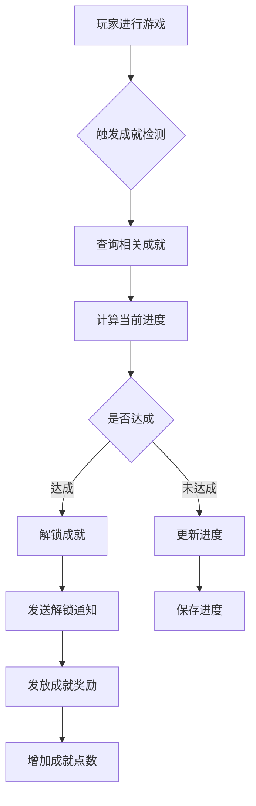

# 任务模块完整说明

## 一、模块概述

### 1.1 业务背景

任务模块是 K2C 游戏的引导和进度追踪系统。通过主线任务引导玩家逐步了解游戏玩法，通过日常任务增加玩家粘性，通过成就任务给予玩家长期目标。任务系统是连接各个游戏模块的纽带。

### 1.2 目标用户

- **新手玩家**：通过主线任务了解游戏玩法
- **活跃玩家**：通过日常任务获取每日资源
- **目标型玩家**：通过成就任务追求长期目标

### 1.3 核心价值

1. **游戏引导**：主线任务引导玩家了解各个系统
2. **玩家粘性**：日常任务增加每日登录动机
3. **目标感**：成就任务提供长期追求目标
4. **资源产出**：任务奖励是重要的资源获取途径

---

## 二、功能清单

### 2.1 主线任务功能

| 功能名称 | 功能描述 | 用户价值 |
|---------|---------|---------|
| 任务接取 | 自动接取可接任务 | 推进游戏进度 |
| 任务追踪 | 显示当前任务进度 | 了解任务目标 |
| 任务完成 | 达成任务目标后完成 | 获得任务奖励 |
| 奖励领取 | 领取任务完成奖励 | 获取资源收益 |
| 任务跳转 | 快速跳转到相关功能 | 便捷操作 |

### 2.2 日常任务功能

| 功能名称 | 功能描述 | 用户价值 |
|---------|---------|---------|
| 每日刷新 | 每日重置任务列表 | 新的开始 |
| 任务进度 | 实时更新任务进度 | 了解完成情况 |
| 活跃度奖励 | 达到活跃度领取奖励 | 额外收益 |
| 快速完成 | 消耗钻石快速完成 | 节省时间 |

### 2.3 周常任务功能

| 功能名称 | 功能描述 | 用户价值 |
|---------|---------|---------|
| 每周刷新 | 每周一重置任务 | 周期目标 |
| 进度累积 | 本周内累积完成 | 弹性安排 |
| 周活跃奖励 | 周活跃度奖励 | 高额奖励 |

### 2.4 成就任务功能

| 功能名称 | 功能描述 | 用户价值 |
|---------|---------|---------|
| 成就解锁 | 达成条件解锁成就 | 荣誉感 |
| 成就展示 | 展示已获成就 | 炫耀展示 |
| 成就奖励 | 成就达成奖励 | 长期收益 |
| 成就点数 | 累积成就点数 | 总体进度 |

### 2.5 限时任务功能

| 功能名称 | 功能描述 | 用户价值 |
|---------|---------|---------|
| 活动任务 | 活动期间特殊任务 | 参与活动 |
| 限时挑战 | 限时完成的挑战 | 紧迫感 |
| 累充任务 | 累计充值奖励 | 付费激励 |

---

## 三、业务流程详解

### 3.1 主线任务流程



**详细步骤说明**：

1. **任务接取**
   - 登录时检查是否有可接任务
   - 自动接取符合条件的主线任务
   - 更新任务列表显示

2. **进度追踪**
   - 监听游戏事件
   - 匹配任务目标条件
   - 更新任务进度

3. **任务完成**
   - 检测目标达成
   - 标记任务完成状态
   - 发送完成通知

4. **奖励领取**
   - 玩家点击领取
   - 发放奖励资源
   - 触发后续任务

### 3.2 日常任务流程



**详细步骤说明**：

1. **每日重置**
   - 固定时间（如凌晨5点）重置
   - 清空昨日任务进度
   - 生成新的日常任务列表

2. **任务生成**
   - 从日常任务池中随机抽取
   - 根据玩家等级调整任务难度
   - 生成固定数量的日常任务

3. **活跃度计算**
   - 每个任务有对应活跃度
   - 累积活跃度解锁档位奖励
   - 活跃度档位：20/40/60/80/100

### 3.3 成就任务流程



**详细步骤说明**：

1. **触发检测**
   - 游戏事件触发成就检测
   - 相关事件：升级、获得英雄、通关等

2. **进度更新**
   - 查询玩家相关成就进度
   - 更新进度数据
   - 检查是否达成

3. **成就解锁**
   - 标记成就完成时间
   - 发放成就奖励
   - 更新成就点数

---

## 四、关键规则

### 4.1 主线任务规则

1. **任务顺序**：必须按顺序完成，有前置任务依赖
2. **章节划分**：任务按章节组织，完成章节解锁下一章
3. **奖励类型**：经验、银两、道具、英雄等
4. **跳转功能**：点击任务可跳转到对应功能界面

### 4.2 日常任务规则

1. **刷新时间**：每日凌晨5点重置
2. **任务数量**：每日8个日常任务
3. **活跃度系统**：完成任务获得活跃度，活跃度达阈值可领奖励
4. **快速完成**：可消耗钻石快速完成任务

### 4.3 成就任务规则

1. **成就分类**：成长、战斗、收集、社交、活动等
2. **成就等级**：普通、稀有、史诗、传说
3. **成就点数**：不同等级成就点数不同
4. **永久有效**：成就不会重置

### 4.4 任务目标类型

| 目标类型 | 说明 | 示例 |
|---------|------|------|
| 升级 | 玩家等级达到指定值 | 玩家达到10级 |
| 获得英雄 | 获得指定或任意英雄 | 获得1个英雄 |
| 通关副本 | 通过指定副本 | 通关第一章第3关 |
| 建筑升级 | 升级指定建筑 | 主殿升至5级 |
| 英雄培养 | 英雄达到指定等级 | 任意英雄达到20级 |
| 装备穿戴 | 穿戴指定品质装备 | 穿戴紫色装备 |
| 公会加入 | 加入公会 | 成功加入公会 |
| 社交互动 | 添加好友 | 添加3个好友 |
| 消费 | 累计消费资源 | 累计消费10000银两 |

---

## 五、用户故事

### 5.1 新手玩家故事

> 作为一名新手玩家，我刚进入游戏，主线任务引导我完成了新手教程。任务告诉我"升级主殿到2级"，我点击任务直接跳转到建筑界面，完成了升级。完成任务后，我获得了银两和经验奖励，还解锁了招募功能。主线任务让我清楚地知道下一步该做什么。

### 5.2 日常玩家故事

> 作为一名日常玩家，我每天上线第一件事就是查看日常任务。今天的任务包括"通关3次副本"、"升级1次英雄"、"领取1次邮件"等。我依次完成这些任务，活跃度逐渐增加到80、100。最后我领取了所有活跃度奖励，获得了钻石和体力。

### 5.3 成就追求者故事

> 作为一名喜欢追求成就的玩家，我经常查看成就系统。我发现有一个"英雄收藏家"成就，需要收集30个不同的英雄。我已经收集了25个，还差5个。这个成就激励我继续招募英雄，最终我解锁了这个稀有成就，获得了专属头像框奖励。

---

## 六、示例

### 6.1 主线任务示例

**任务配置**：
```
任务ID：1001
任务名称：初来乍到
章节：第一章
步骤：1
目标：玩家等级达到2级
奖励：银两×500、经验×100
前置任务：无
后续任务：1002
```

**玩家执行过程**：
```
1. 玩家创建角色后自动接取任务1001
2. 玩家进行新手引导获得经验
3. 玩家升到2级，任务完成
4. 玩家领取奖励：银两×500、经验×100
5. 自动接取后续任务1002
```

### 6.2 日常任务示例

**今日任务列表**：
```
任务ID：日常-001
名称：英勇战斗
目标：通关任意副本3次
进度：0/3
活跃度：10

任务ID：日常-002
名称：英雄培养
目标：升级任意英雄1次
进度：0/1
活跃度：10

任务ID：日常-003
名称：每日签到
目标：领取每日签到奖励
进度：0/1
活跃度：20
```

**完成情况**：
```
活跃度总计：40
已解锁奖励：20活跃度奖励（银两×1000）
待解锁奖励：40/60/80/100活跃度奖励
```

### 6.3 成就任务示例

**成就配置**：
```
成就ID：ACH001
名称：初出茅庐
分类：成长
等级：普通
目标：玩家等级达到10级
奖励：钻石×50、称号"初出茅庐"
成就点数：10
```

**解锁过程**：
```
玩家等级：9级 → 10级
系统检测：等级成就ACH001达成
解锁奖励：钻石×50、称号"初出茅庐"
成就点数：+10
```

---

*文档生成时间: 2026-04-06*
