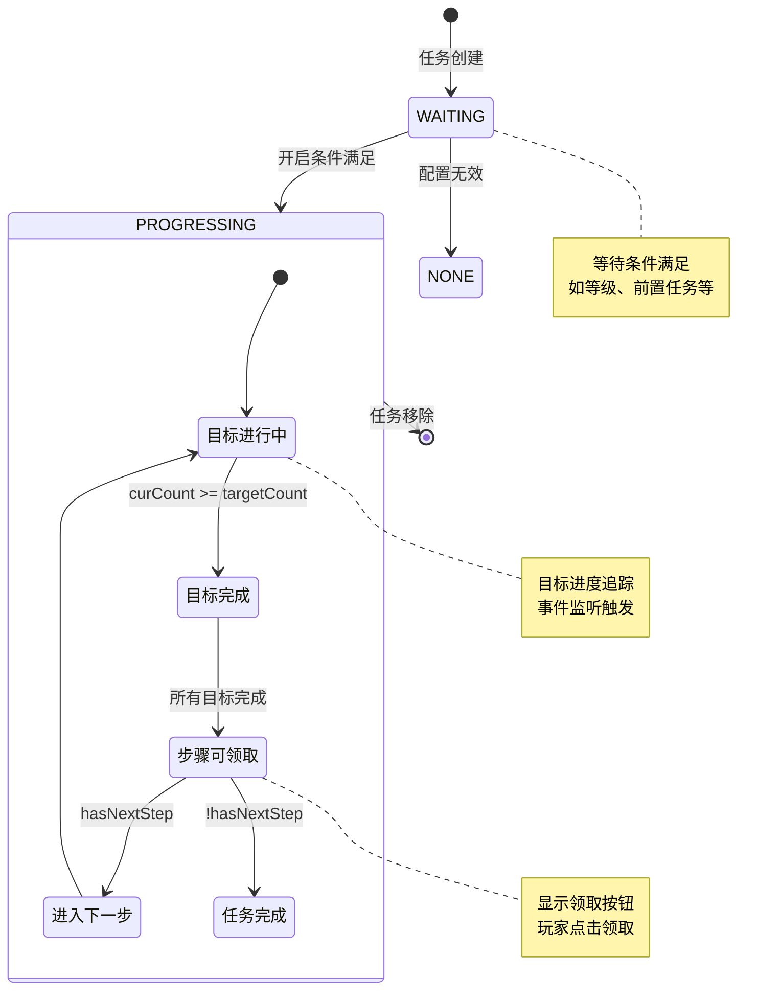
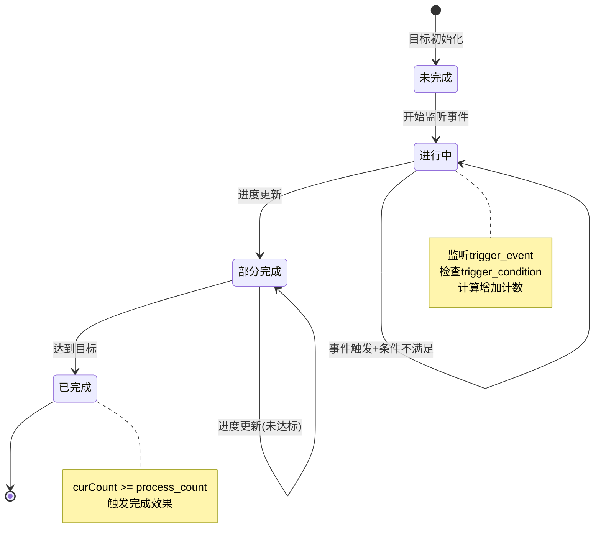
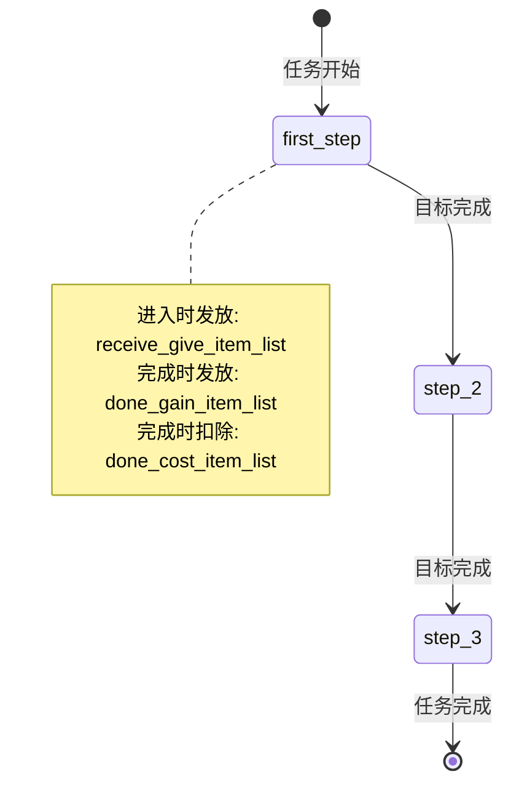
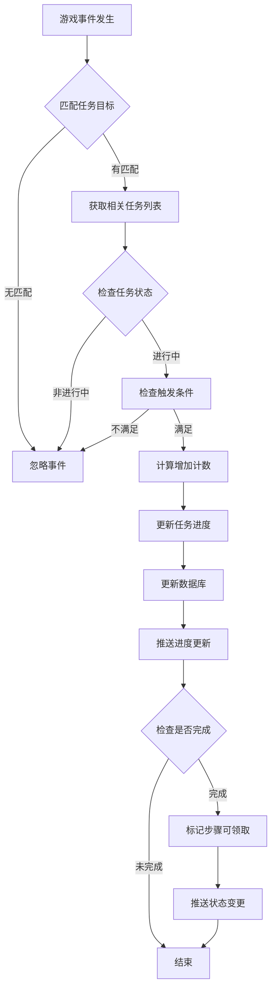
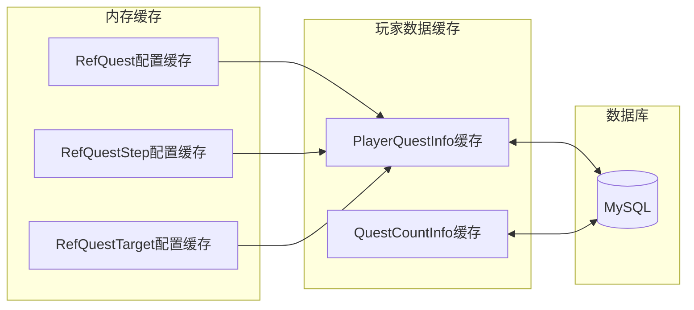
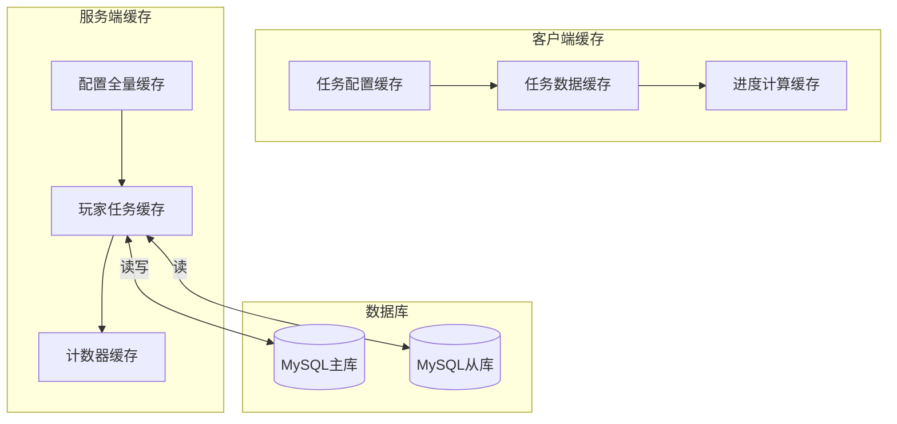
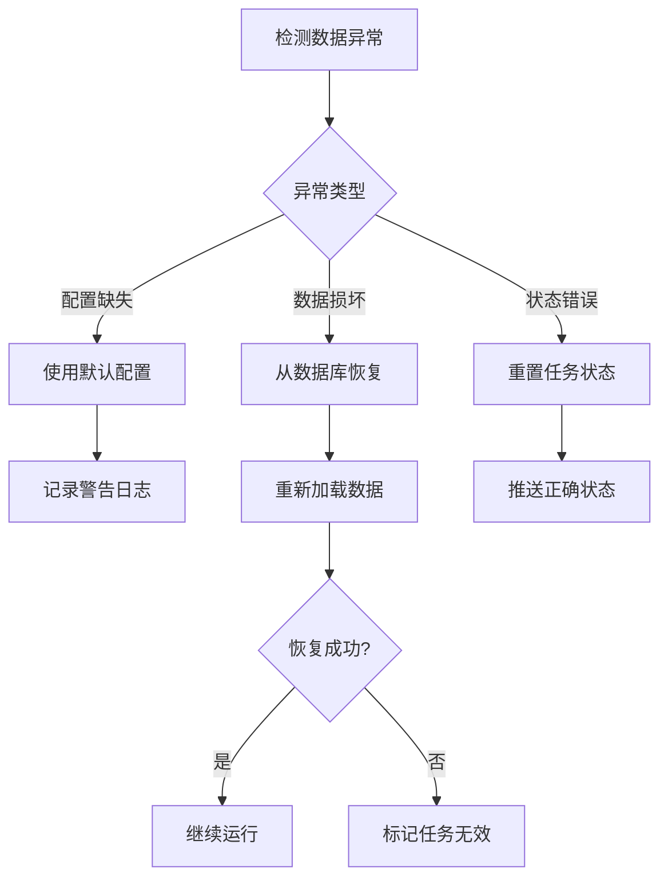

# 任务模块实现细节

## 一、计算公式

### 1.1 目标进度计算

```
当前进度 = 高级公式计算值(process_cur_count) + 服务端计数(curCount)
完成条件 = 当前进度 >= process_count
完成率 = 当前进度 / process_count × 100%
```

**示例计算**:
```
任务目标：击杀怪物100只
高级公式计算值：玩家总击杀怪物数 = 50
服务端计数：本次任务击杀数 = 30
当前进度 = 50 + 30 = 80
完成率 = 80 / 100 × 100% = 80%
```

### 1.2 活跃度奖励计算

```
活跃度奖励档位 = max(已解锁档位列表)
累计活跃度 = Σ(已完成任务的活跃度)
```

**档位配置示例**:
```
档位1：活跃度 20 → 奖励：银两×1000
档位2：活跃度 40 → 奖励：体力×50
档位3：活跃度 60 → 奖励：钻石×30
档位4：活跃度 80 → 奖励：招募券×1
档位5：活跃度 100 → 奖励：钻石×50
```

### 1.3 任务计数变更类型

| 类型 | 计算方式 | 说明 |
|------|----------|------|
| ADD | curCount = oriCount + chgCount | 累加 |
| REDUCE | curCount = oriCount - chgCount | 减少 |
| SET | curCount = chgCount | 直接设置 |
| SET_GT | curCount = max(oriCount, chgCount) | 取大值设置 |

---

## 二、状态机定义

### 2.1 主线任务状态机



### 2.2 任务目标状态机



### 2.3 任务步骤流转



---

## 三、数据约束

### 3.1 主线任务数据约束

| 字段名 | 数据类型 | 取值范围 | 必填 | 说明 |
|--------|----------|----------|------|------|
| quest_id | long | > 0 | 是 | 任务配置ID |
| quest_type | int | 0-3 | 是 | 类型：0无,1主线,2支线,3心愿 |
| quest_status | int | 0-2 | 是 | 状态：0无,1等待,2进行中 |
| quest_step | long | >= 0 | 是 | 当前步骤ID，0表示等待中 |
| step_expire_time_tag | int | >= 0 | 是 | 步骤超时时间戳，0表示永久 |
| create_time | datetime | - | 否 | 创建时间 |
| update_time | datetime | - | 否 | 更新时间 |

### 3.2 任务目标数据约束

| 字段名 | 数据类型 | 取值范围 | 必填 | 说明 |
|--------|----------|----------|------|------|
| id | long | > 0 | 是 | 主键ID |
| cid | long | > 0 | 是 | 玩家CID |
| quest_id | long | > 0 | 是 | 任务配置ID |
| quest_step | long | > 0 | 是 | 步骤ID |
| quest_target | long | > 0 | 是 | 目标ID |
| quest_target_count | long | >= 0 | 是 | 目标计数 |

### 3.3 任务计数数据约束

| 字段名 | 数据类型 | 取值范围 | 必填 | 说明 |
|--------|----------|----------|------|------|
| id | long | > 0 | 是 | 主键ID |
| cid | long | > 0 | 是 | 玩家CID |
| quest_id | long | > 0 | 是 | 任务配置ID |
| done_count | int | >= 0 | 是 | 完成次数 |

---

## 四、错误处理策略

### 4.1 任务模块错误码

| 错误码 | 错误信息 | 处理策略 | 用户提示 |
|--------|----------|----------|----------|
| 28001 | 任务不存在 | 检查任务配置 | "任务数据异常" |
| 28002 | 任务条件不满足 | 提示具体条件 | "任务条件不满足：XXX" |
| 28003 | 任务未完成 | 检查任务进度 | "任务尚未完成" |
| 28004 | 奖励已领取 | 跳过重复领取 | "奖励已领取" |
| 28005 | 前置任务未完成 | 提示前置任务 | "请先完成前置任务" |
| 28006 | 任务已过期 | 刷新任务列表 | "任务已过期" |
| 28007 | 完成次数超限 | 检查次数上限 | "任务完成次数已达上限" |
| 28008 | 开启消耗不足 | 提示缺少物品 | "物品不足，无法开启任务" |

### 4.2 任务事件处理流程



### 4.3 任务异常处理

| 异常场景 | 处理方式 | 用户影响 |
|----------|----------|----------|
| 任务配置缺失 | 记录日志，跳过该任务 | 无 |
| 奖励配置错误 | 使用默认奖励，记录日志 | 奖励可能变化 |
| 进度更新失败 | 重试3次，记录日志 | 进度可能丢失 |
| 重复领取 | 直接返回成功，不发奖励 | 无 |
| 步骤配置缺失 | 标记任务无效，记录日志 | 任务不可用 |

---

## 五、关键代码示例

### 5.1 服务端任务进度更新

```java
// PlayerQuestTargetInfo.java
protected void onLogicEvt(_ALogicEventBase _evt, NPPlayerContext _context)
{
    // 1. 构建变量信息
    NPVarInfo varInfo = EventParamVarTypeMap.getInstance().makeVarInfo(_evt);

    // 2. 检查触发条件
    if (!NPPlayerConditionDealerMgr.IsEnable(
        _m_ref.trigger_condition,
        getQuest().getComp().getUserData(),
        varInfo))
    {
        return;
    }

    // 3. 计算增加计数
    long chgCount = _evt.getValue(_m_ref.trigger_count_rate);
    if (chgCount != 0)
    {
        addCount(chgCount, _context);
    }

    // 4. 触发额外效果
    NPPlayerEffectDealer.dealEffect(
        _m_ref.ext_trigger_effect,
        getQuest().getComp().getUserData(),
        varInfo,
        _context
    );
}
```

### 5.2 服务端任务计数变更

```java
// PlayerQuestTargetInfo.java
protected void chgCount(long _chgCount, ENCounterDealType _dealType, NPPlayerContext _context)
{
    // 1. 保存原始计数
    long oriCount = _m_lQuestTargetCount;

    // 2. 根据类型计算新计数
    long curCount = 0;
    switch (_dealType)
    {
        case REDUCE:
            curCount = oriCount - _chgCount;
            break;
        case SET:
            curCount = _chgCount;
            break;
        case SET_GT:
            curCount = oriCount < _chgCount ? _chgCount : oriCount;
            break;
        case ADD:
        default:
            curCount = oriCount + _chgCount;
            break;
    }

    _m_lQuestTargetCount = curCount;

    // 3. 更新数据库
    BM bmObj = getUSServer().getBM();
    if (_m_lDbid == 0)
    {
        // 创建新记录
        PlayerQuestTargetBO bo = new PlayerQuestTargetBO();
        bo.setCid(bmObj, getQuest().getComp().getUserData().getCid());
        bo.setQuestId(bmObj, _m_quest.getQuestId());
        bo.setQuestStep(bmObj, _m_quest.getQuestStep());
        bo.setQuestTarget(bmObj, _m_ref.id);
        bo.setQuestTargetCount(bmObj, _m_lQuestTargetCount);
        bo.insert(bmObj);
        _m_lDbid = bo.getId();
    }
    else
    {
        // 更新现有记录
        ALMySqlUpdateValue updateValue = new ALMySqlUpdateValue();
        updateValue.addValueObj("quest_target_count", _m_lQuestTargetCount);
        bmObj.getBM(PlayerQuestTargetBO.class).update("id", _m_lDbid, updateValue);
    }

    // 4. 推送协议
    getQuest().getComp().getUserData().sendMsgToGC(
        US2GCWriter_028_QuestOp.make_051_OnPlayerQuestStepCountChg(
            _m_quest.getQuestId(),
            _m_quest.getQuestStep(),
            _m_ref.id,
            _m_lQuestTargetCount
        )
    );

    // 5. 记录日志
    LogQuestTargetBO logBo = new LogQuestTargetBO();
    logBo.setCid(bmObj, getQuest().getComp().getUserData().getCid());
    logBo.setQuestId(bmObj, getQuest().getQuestId());
    logBo.setQuestDbid(bmObj, getQuest().getDbid());
    logBo.setStep(bmObj, getQuest().getQuestStep());
    logBo.setTarget(bmObj, getTargetId());
    logBo.setOriCount(bmObj, oriCount);
    logBo.setCurCount(bmObj, getTargetSelfCount());
    CommLogDB.log(bmObj, logBo, _context);
}
```

### 5.3 服务端完成任务步骤

```java
// PlayerQuestComponent.java
public boolean finishQuestStep(long _questId, NPPlayerContext _context, NPItemCollector _itemCollector)
{
    getUserData().lockUser();

    try
    {
        PlayerQuestInfo quest = _m_hmQuestMap.get(_questId);
        if (null == quest || !quest.isProgressing())
            return false;

        long curStep = quest.getQuestStep();

        // 1. 检查步骤是否完成
        if (!quest.finishStep())
            return false;

        // 2. 扣除完成消耗
        getUserData().spendCostItemList(quest.getStepRef().done_cost_item_list, _context);

        // 3. 发放步骤奖励
        NPPlayerContext gainContext = NPPlayerContext.createNew(_context);
        getUserData().gainItemList(quest.getStepRef().done_gain_item_list, gainContext);

        // 4. 执行完成效果
        NPPlayerEffectDealer.dealEffect(
            quest.getStepRef().ext_done_effect,
            getUserData(),
            null,
            gainContext
        );

        // 5. 发送奖励信息
        if (!gainContext.getCollector().isEmpty())
        {
            getUserData().sendMsgToGC(
                gainContext.getCollector().toProto(quest.getStepRef().tip_reward)
            );
            _itemCollector.addItemList(gainContext.getCollector().getAllItemList());
        }

        // 6. 检查下一步骤
        if (!quest.hasNextStep())
        {
            // 任务完成
            NPPlayerContext doneContext = NPPlayerContext.createNew(_context);
            getUserData().gainItemList(quest.getRef().done_gain_item_list, doneContext);

            if (!doneContext.getCollector().isEmpty())
            {
                getUserData().sendMsgToGC(
                    doneContext.getCollector().toProto(quest.getRef().tip_reward)
                );
                _itemCollector.addItemList(doneContext.getCollector().getAllItemList());
            }

            // 移除任务
            removeQuest(_questId, _context);

            // 增加完成计数
            _m_mgrQuestCountMgr.incrDoneCount(_questId, 1, _context);

            // 开启下一个任务
            if (quest.getRef().next_quest_id > 0)
            {
                RefQuest questRef = RefQuest.getMgr().get(quest.getRef().next_quest_id);
                startQuestByServer(questRef, _context);
            }
        }
        else
        {
            // 进入下一步骤
            quest.setNextStep(_context);
            quest._log(ENpLogType.SET, _context);
        }

        return true;
    }
    finally
    {
        getUserData().unlockUser();
    }
}
```

### 5.4 客户端任务目标计数更新

```csharp
// QuestTargetItem.cs
public void setCurCount(long _curCount)
{
    if (_curCount == _m_curCount)
        return;

    // 保存原始计数
    long lastTotalCount = getQuestTargetRealCount();

    // 更新服务端计数
    _m_curCount = _curCount;

    // 发送目标更新消息
    WinMsg.SendMsg(WinMsgType.QUEST_TARGET_UPDATE, this);

    // 检查是否完成
    if (getQuestTargetIsFinish())
        _m_stepItem.checkStepCanGet(true);

    // 检查是否显示完成提示
    _checkCanShowTip(lastTotalCount);

    // 检查是否触发引导
    _checkTriggerTutorial(lastTotalCount);
}

public long getQuestTargetRealCount()
{
    if (null == _m_targetRefObj || null == _m_targetRefObj.process_cur_count)
        return _m_curCount;

    // 高级公式计算值 + 服务端计数
    return _m_curCount + _m_curCusCount;
}

public bool getQuestTargetIsFinish()
{
    if (null == _m_targetRefObj)
        return false;

    return getQuestTargetRealCount() >= _m_targetRefObj.process_count;
}
```

### 5.5 客户端触发任务进度

```csharp
// QuestTargetItem.cs
private void _triggerClientTarget(object[] _objs)
{
    int addCount = 1;

    // 发送消息给服务器增加进度
    // 本地不直接修改进度，等待服务端推送
    NPGSClientListener.sendMsgByLog(
        GSWriter_028_QuestOp.make_004_ReqAddClientTargetCount(
            _m_stepItem.questId,
            _m_stepItem.questStepId,
            _m_questTargetId,
            addCount
        )
    );
}
```

---

## 六、性能优化建议

### 6.1 缓存策略



**优化措施**:
1. **配置缓存**: 全量加载任务配置到内存
2. **玩家缓存**: 玩家进行中任务缓存到内存
3. **事件订阅**: 只订阅进行中任务相关的事件

### 6.2 事件处理优化

| 优化项 | 描述 |
|--------|------|
| 事件过滤 | 根据任务状态过滤不必要的事件 |
| 批量处理 | 合并多个事件批量处理进度更新 |
| 异步处理 | 任务进度更新可异步执行，不阻塞主流程 |
| 延迟写入 | 进度更新可先写入缓存，定时批量写库 |

### 6.3 数据库优化

| 优化项 | 描述 |
|--------|------|
| 分表策略 | 按玩家ID分表存储任务数据 |
| 索引设计 | playerId + questId 复合索引 |
| 定期清理 | 定期清理过期的日常任务数据 |
| 批量操作 | 使用批量插入减少数据库交互 |

### 6.4 内存管理

```java
// 任务组件释放时清理资源
@Override
public void dispose()
{
    getUserData().lockUser();

    try
    {
        // 注销全部任务监听
        for (PlayerQuestInfo quest : _m_hmQuestMap.values())
        {
            if (null == quest)
                return;

            // 清除当前所有目标（注销事件监听）
            quest.clearAllTarget();
        }
    }
    finally
    {
        getUserData().unlockUser();
    }
}
```

---

## 七、日志记录

### 7.1 任务日志表结构

**LogQuestBO**:

| 字段名 | 类型 | 说明 |
|--------|------|------|
| cid | long | 玩家CID |
| log_type | int | 日志类型（ADD/SET/DEL） |
| quest_id | long | 任务配置ID |
| quest_dbid | long | 任务数据库ID |
| type | int | 任务类型 |
| step | long | 当前步骤 |
| expired_ts | int | 超时时间戳 |
| status | int | 任务状态 |

### 7.2 目标日志表结构

**LogQuestTargetBO**:

| 字段名 | 类型 | 说明 |
|--------|------|------|
| cid | long | 玩家CID |
| quest_id | long | 任务配置ID |
| quest_dbid | long | 任务数据库ID |
| step | long | 当前步骤 |
| target | long | 目标ID |
| ori_count | long | 原始计数 |
| cur_count | long | 当前计数 |

---

## 八、调试技巧

### 8.1 GM命令调试

```
// 设置主线任务进度
gm quest set_main_target_count <count>

// 完成当前主线步骤
gm quest finish_main_step

// 设置指定任务步骤
gm quest set_step <questId> <stepId>

// 重置所有任务
gm quest reset_all
```

### 8.2 日志调试

```java
// 关键日志点
USLog.error(getUSServer(), "start quest fail, not find first step, cid:{} quest:{}",
    getUserData().getCid(), _questId);

USLog.error(getUSServer(), "can not set next step, ref is null, cid:{} quest:{}, nextStep:{}",
    getUserData().getCid(), _m_refQuest.quest_id, _m_refQuestStep.next_step_id);
```

---

## 九、缓存设计

### 9.1 多级缓存架构



### 9.2 缓存策略配置

```java
// 缓存配置
public class QuestCacheConfig
{
    // 配置缓存：全量加载，永不过期
    public static final CacheConfig CONFIG_CACHE = new CacheConfig(
        CacheType.FULL_LOAD,
        ExpirePolicy.NEVER
    );

    // 玩家任务缓存：按需加载，30分钟过期
    public static final CacheConfig PLAYER_QUEST_CACHE = new CacheConfig(
        CacheType.LAZY_LOAD,
        ExpirePolicy.TIME_BASED,
        30 * 60 * 1000  // 30分钟
    );

    // 计数器缓存：写穿透策略
    public static final CacheConfig COUNT_CACHE = new CacheConfig(
        CacheType.WRITE_THROUGH,
        ExpirePolicy.NEVER
    );
}
```

### 9.3 缓存一致性

```java
// 缓存更新策略
public class QuestCacheManager
{
    // 写穿透：同时更新缓存和数据库
    public void updateQuestWithCache(PlayerQuestInfo quest)
    {
        // 1. 更新数据库
        quest.updateToDB();

        // 2. 更新缓存
        _m_cache.put(quest.getQuestId(), quest);

        // 3. 推送客户端
        pushQuestChange(quest);
    }

    // 失效策略：删除时同时失效
    public void invalidateQuest(long questId)
    {
        // 1. 从缓存移除
        _m_cache.remove(questId);

        // 2. 从数据库删除
        deleteFromDB(questId);
    }
}
```

---

## 十、批量处理优化

### 10.1 批量初始化优化

```java
// 任务初始化批量处理
public void initQuestFromDB()
{
    BM bmObj = getUSServer().getBM();

    // 批量查询任务数据
    List<PlayerQuestBO> questBOList = bmObj.getBM(PlayerQuestBO.class)
        .selectAll("cid", getUserData().getCid());

    // 批量查询目标数据
    List<PlayerQuestTargetBO> targetBOList = bmObj.getBM(PlayerQuestTargetBO.class)
        .selectAll("cid", getUserData().getCid());

    // 构建目标索引
    Map<Long, List<PlayerQuestTargetBO>> targetMap = targetBOList.stream()
        .collect(Collectors.groupingBy(PlayerQuestTargetBO::getQuestId));

    // 批量创建任务对象
    for (PlayerQuestBO bo : questBOList)
    {
        RefQuest ref = RefQuest.getMgr().get(bo.getQuestId());
        if (ref == null) continue;

        PlayerQuestInfo quest = new PlayerQuestInfo(this, bo, ref);
        _m_hmQuestMap.put(quest.getQuestId(), quest);

        // 设置目标数据
        List<PlayerQuestTargetBO> targets = targetMap.get(bo.getQuestId());
        if (targets != null)
        {
            quest.initTargets(targets);
        }
    }
}
```

### 10.2 批量推送优化

```java
// 批量推送进度更新
public class QuestPushBatcher
{
    private List<QuestPushTask> _pendingTasks = new ArrayList<>();
    private ScheduledExecutorService _scheduler;

    public void addPushTask(long questId, long stepId, long targetId, long count)
    {
        _pendingTasks.add(new QuestPushTask(questId, stepId, targetId, count));

        // 累积到一定数量或时间后批量推送
        if (_pendingTasks.size() >= 10)
        {
            flush();
        }
    }

    public void flush()
    {
        if (_pendingTasks.isEmpty()) return;

        // 合并相同目标的更新
        Map<String, QuestPushTask> merged = new HashMap<>();
        for (QuestPushTask task : _pendingTasks)
        {
            String key = task.questId + "_" + task.stepId + "_" + task.targetId;
            merged.merge(key, task, (old, neu) -> {
                old.count = neu.count; // 取最新值
                return old;
            });
        }

        // 批量推送
        for (QuestPushTask task : merged.values())
        {
            sendPush(task);
        }

        _pendingTasks.clear();
    }
}
```

---

## 十一、内存管理

### 11.1 内存使用分析

| 数据类型 | 单条大小 | 数量估算 | 总内存 |
|----------|----------|----------|--------|
| RefQuest | ~500B | 1000条 | ~500KB |
| RefQuestStep | ~300B | 5000条 | ~1.5MB |
| RefQuestTarget | ~200B | 20000条 | ~4MB |
| PlayerQuestInfo | ~1KB | 50条/玩家 | ~50KB |
| PlayerQuestTargetInfo | ~200B | 200条/玩家 | ~40KB |

### 11.2 内存优化策略

```java
// 对象池复用
public class QuestObjectPool
{
    private static final ObjectPool<PlayerQuestInfo> QUEST_POOL =
        new ObjectPool<>(() -> new PlayerQuestInfo(), 100);

    private static final ObjectPool<PlayerQuestTargetInfo> TARGET_POOL =
        new ObjectPool<>(() -> new PlayerQuestTargetInfo(), 500);

    public static PlayerQuestInfo acquireQuest()
    {
        return QUEST_POOL.acquire();
    }

    public static void releaseQuest(PlayerQuestInfo quest)
    {
        quest.reset();
        QUEST_POOL.release(quest);
    }
}
```

### 11.3 内存泄漏防护

```java
// 任务完成后的清理
public void removeQuest(long questId, NPPlayerContext context)
{
    PlayerQuestInfo quest = _m_hmQuestMap.remove(questId);
    if (quest == null) return;

    // 1. 注销事件监听
    quest.clearAllTarget();

    // 2. 删除数据库记录
    quest.deleteFromDB();

    // 3. 清理引用
    quest.dispose();

    // 4. 推送移除消息
    getUserData().sendMsgToGC(
        US2GCWriter_028_QuestOp.make_052_OnPlayerQuestRemove(questId)
    );

    // 5. 记录日志
    quest._log(ENpLogType.DEL, context);
}
```

---

## 十二、容错与恢复

### 12.1 数据恢复机制



### 12.2 异常处理代码

```java
// 数据一致性检查
public void validateQuestData()
{
    for (PlayerQuestInfo quest : _m_hmQuestMap.values())
    {
        try
        {
            // 检查配置有效性
            if (quest.getRef() == null)
            {
                USLog.error("Quest ref is null, cid:{}, questId:{}",
                    getUserData().getCid(), quest.getQuestId());
                quest.markInvalid();
                continue;
            }

            // 检查步骤有效性
            if (quest.isProgressing() && quest.getStepRef() == null)
            {
                USLog.error("Quest step ref is null, cid:{}, questId:{}, step:{}",
                    getUserData().getCid(), quest.getQuestId(), quest.getQuestStep());
                quest.markInvalid();
                continue;
            }

            // 检查目标完整性
            quest.validateTargets();
        }
        catch (Exception e)
        {
            USLog.error("Quest validation error, cid:{}, questId:{}",
                getUserData().getCid(), quest.getQuestId(), e);
            quest.markInvalid();
        }
    }
}
```

### 12.3 服务降级策略

```java
// 服务降级处理
public class QuestServiceDegradation
{
    private volatile boolean _isDegraded = false;

    // 开启降级模式
    public void enableDegradation()
    {
        _isDegraded = true;
        USLog.warn("Quest service enter degraded mode");
    }

    // 降级模式下的任务处理
    public Result handleQuestRequestDegraded(long questId)
    {
        if (_isDegraded)
        {
            // 降级模式：只允许完成已进行中的任务，不允许开始新任务
            PlayerQuestInfo quest = _m_hmQuestMap.get(questId);
            if (quest == null)
            {
                return QuestErr.QUEST_SERVICE_UNAVAILABLE;
            }
        }

        return handleQuestRequest(questId);
    }
}
```

---

## 十三、测试用例

### 13.1 单元测试用例

```java
// 任务服务单元测试
@Test
public void testStartQuestSuccess()
{
    // 准备测试数据
    long questId = 10001;
    NPPlayerContext context = createTestContext();

    // 执行测试
    Result result = questComponent.startQuestByClient(questId, context);

    // 验证结果
    assertEquals(Result.SUCC, result);
    assertNotNull(questComponent.lookupQuest(questId));
}

@Test
public void testStartQuestConditionNotMet()
{
    // 准备测试数据：设置不满足条件的玩家
    long questId = 10002; // 需要等级10
    setPlayerLevel(5);

    // 执行测试
    Result result = questComponent.startQuestByClient(questId, createTestContext());

    // 验证结果
    assertEquals(QuestErr.QUEST_START_COND_ERROR, result);
}

@Test
public void testQuestProgressUpdate()
{
    // 准备已开始的任务
    long questId = 10001;
    startQuest(questId);

    // 触发事件
    triggerEvent("KILL_MONSTER", monsterId, 1);

    // 验证进度更新
    PlayerQuestInfo quest = questComponent.lookupQuest(questId);
    assertTrue(quest.getCurrentTarget().getCurCount() > 0);
}
```

### 13.2 压力测试场景

| 测试场景 | 并发数 | 目标QPS | 目标延迟 |
|----------|--------|---------|----------|
| 任务接取 | 100 | 500 | < 100ms |
| 任务完成 | 100 | 500 | < 150ms |
| 事件触发 | 100 | 2000 | < 50ms |
| 数据加载 | 50 | 100 | < 500ms |

### 13.3 边界测试用例

```java
// 边界值测试
@Test
public void testQuestCountBoundary()
{
    // 测试完成次数上限
    long questId = 10003; // done_count = 3

    // 完成3次
    for (int i = 0; i < 3; i++)
    {
        startAndFinishQuest(questId);
    }

    // 第4次应该失败
    Result result = questComponent.startQuestByClient(questId, createTestContext());
    assertEquals(QuestErr.QUEST_DONE_EXCEED_ERROR, result);
}

@Test
public void testQuestProgressBoundary()
{
    // 测试进度溢出
    PlayerQuestTargetInfo target = createTarget(processCount: 100);

    // 设置超大值
    target.chgCount(Long.MAX_VALUE / 2, ENCounterDealType.ADD, createTestContext());

    // 验证不会溢出
    assertTrue(target.getCurCount() >= 0);
}
```

---

## 十四、常见问题排查

### 14.1 问题排查清单

| 问题现象 | 可能原因 | 排查步骤 |
|----------|----------|----------|
| 任务无法接取 | 条件不满足 | 检查 start_condition 配置 |
| 进度不更新 | 事件未触发 | 检查 trigger_event 配置 |
| 无法完成 | 目标未完成 | 检查所有目标的 curCount |
| 奖励未收到 | 发放失败 | 检查背包容量和物品配置 |
| 重复推送 | 推送重复 | 检查推送去重逻辑 |

### 14.2 日志查询命令

```sql
-- 查询玩家任务日志
SELECT * FROM log_quest WHERE cid = 12345 ORDER BY create_time DESC LIMIT 100;

-- 查询任务操作失败记录
SELECT * FROM log_quest WHERE cid = 12345 AND log_type = 'FAIL' ORDER BY create_time DESC;

-- 查询目标进度变更
SELECT * FROM log_quest_target WHERE quest_id = 10001 AND step = 20001 ORDER BY create_time DESC;
```

---

*文档生成时间: 2026-04-11*