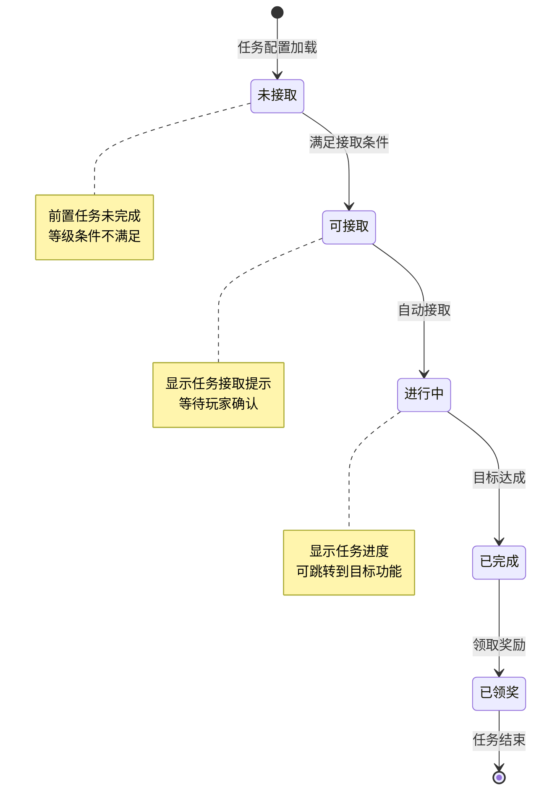
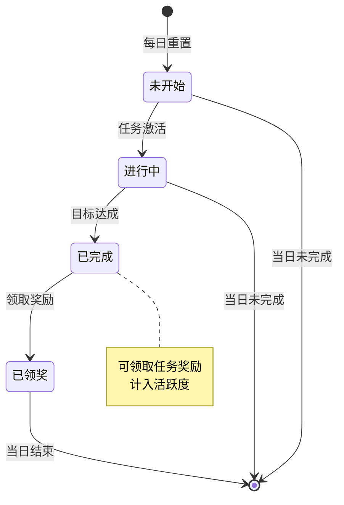
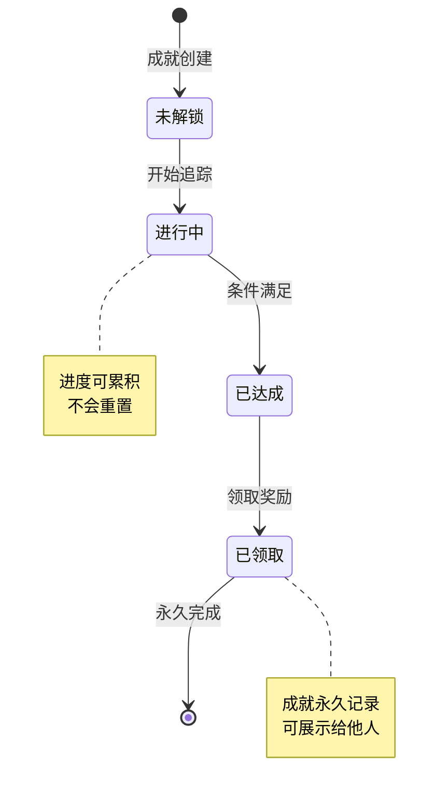
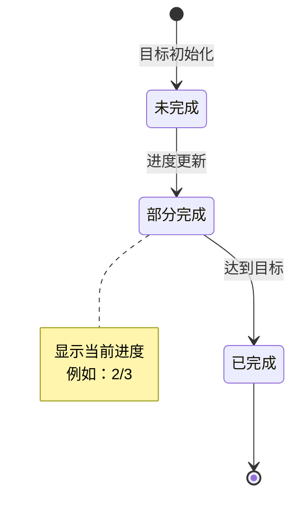
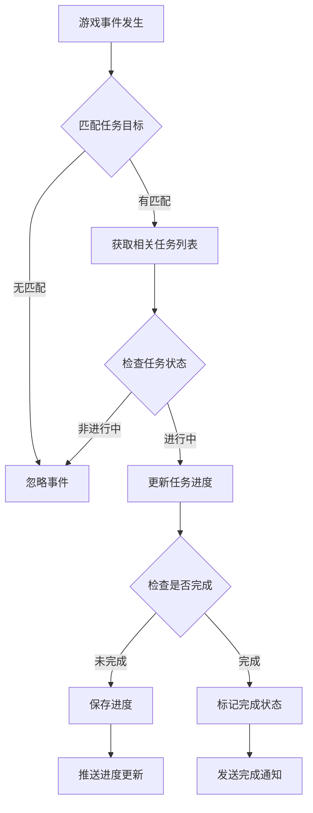

# 任务模块实现细节

## 一、计算公式

### 1.1 活跃度奖励计算

```
活跃度奖励档位 = max(已解锁档位列表)
累计活跃度 = Σ(已完成任务的活跃度)
```

**档位配置示例**：
```
档位1：活跃度 20 → 奖励：银两×1000
档位2：活跃度 40 → 奖励：体力×50
档位3：活跃度 60 → 奖励：钻石×30
档位4：活跃度 80 → 奖励：招募券×1
档位5：活跃度 100 → 奖励：钻石×50
```

### 1.2 任务进度计算

```
任务进度 = min(当前完成数, 目标数量)
完成率 = 当前完成数 / 目标数量 × 100%
```

**示例计算**：
```
任务目标：通关副本3次
当前完成：2次
进度：2/3
完成率：66.7%
```

### 1.3 成就点数计算

```
总成就点数 = Σ(已解锁成就的点数)
成就等级系数：
  - 普通：10点
  - 稀有：20点
  - 史诗：50点
  - 传说：100点
```

### 1.4 任务奖励计算

```
基础奖励 = 配置表固定奖励
等级系数 = 1 + (玩家等级 - 解锁等级) × 0.05
实际奖励 = 基础奖励 × min(等级系数, 2.0)
```

**示例计算**：
```
任务解锁等级：10级
配置奖励：银两×1000
玩家等级：15级

等级系数 = 1 + (15 - 10) × 0.05 = 1.25
实际奖励 = 1000 × 1.25 = 1250银两
```

---

## 二、状态机定义

### 2.1 主线任务状态机



### 2.2 日常任务状态机



### 2.3 成就任务状态机



### 2.4 任务目标状态机



---

## 三、数据约束

### 3.1 主线任务数据约束

| 字段名 | 数据类型 | 取值范围 | 必填 | 说明 |
|--------|----------|----------|------|------|
| questId | long | > 0 | 是 | 任务配置ID |
| chapter | int | 1-100 | 是 | 所属章节 |
| step | int | 1-50 | 是 | 章节内步骤 |
| status | int | 0-3 | 是 | 状态：0未接,1进行中,2完成,3领奖 |
| progress | int | >= 0 | 是 | 当前进度 |
| acceptTime | datetime | - | 否 | 接取时间 |
| completeTime | datetime | - | 否 | 完成时间 |

### 3.2 日常任务数据约束

| 字段名 | 数据类型 | 取值范围 | 必填 | 说明 |
|--------|----------|----------|------|------|
| dailyId | string | 日期+序号 | 是 | 每日任务ID |
| questId | long | > 0 | 是 | 任务配置ID |
| status | int | 0-2 | 是 | 状态：0进行中,1完成,2领奖 |
| progress | int | >= 0 | 是 | 当前进度 |
| activePoint | int | 5-20 | 是 | 活跃度点数 |
| date | date | - | 是 | 任务日期 |

### 3.3 活跃度数据约束

| 字段名 | 数据类型 | 取值范围 | 必填 | 说明 |
|--------|----------|----------|------|------|
| date | date | - | 是 | 日期 |
| totalActive | int | 0-200 | 是 | 总活跃度 |
| claimedLevels | array | - | 是 | 已领取的档位列表 |

### 3.4 成就数据约束

| 字段名 | 数据类型 | 取值范围 | 必填 | 说明 |
|--------|----------|----------|------|------|
| achieveId | long | > 0 | 是 | 成就配置ID |
| status | int | 0-2 | 是 | 状态：0进行中,1达成,2领取 |
| progress | int | >= 0 | 是 | 当前进度 |
| unlockTime | datetime | - | 否 | 达成时间 |

---

## 四、错误处理策略

### 4.1 任务模块错误码

| 错误码 | 错误信息 | 处理策略 | 用户提示 |
|--------|----------|----------|----------|
| 28001 | 任务不存在 | 检查任务配置 | "任务数据异常" |
| 28002 | 任务条件不满足 | 提示具体条件 | "任务条件不满足：XXX" |
| 28003 | 任务未完成 | 检查任务进度 | "任务尚未完成" |
| 28004 | 奖励已领取 | 跳过重复领取 | "奖励已领取" |
| 28005 | 前置任务未完成 | 提示前置任务 | "请先完成前置任务" |
| 28006 | 任务已过期 | 刷新任务列表 | "任务已过期" |
| 28007 | 活跃度不足 | 提示需要活跃度 | "活跃度不足，还需X点" |
| 28008 | 活跃度奖励已领取 | 跳过重复领取 | "该档位奖励已领取" |
| 28009 | 成就未达成 | 提示达成条件 | "成就尚未达成" |
| 28010 | 成就奖励已领取 | 跳过重复领取 | "成就奖励已领取" |

### 4.2 任务事件处理流程



### 4.3 任务异常处理

| 异常场景 | 处理方式 | 用户影响 |
|----------|----------|----------|
| 任务配置缺失 | 记录日志，跳过该任务 | 无 |
| 奖励配置错误 | 使用默认奖励，记录日志 | 奖励可能变化 |
| 进度更新失败 | 重试3次，记录日志 | 进度可能丢失 |
| 重复领取 | 直接返回成功，不发奖励 | 无 |

---

## 五、关键代码示例

### 5.1 任务进度更新伪代码

```csharp
public void OnGameEvent(long playerId, GameEvent gameEvent)
{
    // 1. 获取玩家所有进行中的任务
    List<QuestInfo> activeQuests = questService.GetActiveQuests(playerId);

    foreach (var quest in activeQuests)
    {
        QuestRefObj questRef = GetQuestRef(quest.questId);
        if (questRef == null) continue;

        // 2. 检查事件是否匹配任务目标
        if (!MatchQuestTarget(questRef.target, gameEvent))
            continue;

        // 3. 更新任务进度
        quest.progress++;
        questService.UpdateQuest(quest);

        // 4. 检查是否完成
        if (quest.progress >= questRef.target.count)
        {
            quest.status = QuestStatus.Completed;
            quest.completeTime = DateTime.Now;
            questService.UpdateQuest(quest);

            // 5. 发送完成通知
            PushQuestComplete(playerId, quest);
        }
        else
        {
            // 6. 推送进度更新
            PushQuestProgress(playerId, quest);
        }
    }
}

private bool MatchQuestTarget(QuestTarget target, GameEvent gameEvent)
{
    switch (target.type)
    {
        case TargetType.LevelUp:
            return gameEvent.type == EventType.LevelUp;
        case TargetType.GetHero:
            return gameEvent.type == EventType.GetHero;
        case TargetType.PassDungeon:
            return gameEvent.type == EventType.PassDungeon &&
                   (target.param == 0 || gameEvent.dungeonId == target.param);
        case TargetType.UpgradeBuilding:
            return gameEvent.type == EventType.UpgradeBuilding &&
                   (target.param == 0 || gameEvent.buildingId == target.param);
        default:
            return false;
    }
}
```

### 5.2 日常任务重置伪代码

```csharp
public void DailyReset(long playerId)
{
    // 1. 获取昨日活跃度（用于统计）
    int yesterdayActive = questService.GetDailyActive(playerId, DateTime.Today.AddDays(-1));

    // 2. 清空昨日任务
    questService.ClearDailyQuests(playerId);

    // 3. 生成今日任务
    List<DailyQuestRefObj> dailyPool = GetDailyQuestPool();
    List<DailyQuestRefObj> todayQuests = SelectDailyQuests(dailyPool, 8);

    foreach (var questRef in todayQuests)
    {
        DailyQuestInfo daily = new DailyQuestInfo {
            dailyId = $"{DateTime.Today:yyyyMMdd}_{questRef.id}",
            questId = questRef.id,
            status = QuestStatus.InProgress,
            progress = 0,
            activePoint = questRef.activePoint,
            date = DateTime.Today
        };
        questService.CreateDailyQuest(playerId, daily);
    }

    // 4. 重置活跃度
    questService.ResetDailyActive(playerId);

    // 5. 推送任务列表
    PushDailyQuestList(playerId);
}
```

### 5.3 任务奖励领取伪代码

```csharp
public Result ClaimQuestReward(long playerId, long questId)
{
    // 1. 获取任务数据
    QuestInfo quest = questService.GetQuest(playerId, questId);
    if (quest == null)
        return Result.Error(28001, "任务不存在");

    // 2. 检查任务状态
    if (quest.status != QuestStatus.Completed)
        return Result.Error(28003, "任务未完成");

    if (quest.status == QuestStatus.Claimed)
        return Result.Error(28004, "奖励已领取");

    // 3. 获取奖励配置
    QuestRefObj questRef = GetQuestRef(questId);
    if (questRef == null || questRef.reward == null)
        return Result.Error(28001, "任务配置异常");

    // 4. 计算奖励（可能有等级加成）
    List<RewardItem> rewards = CalculateRewards(playerId, questRef.reward);

    // 5. 发放奖励
    bagService.AddItems(playerId, rewards);

    // 6. 更新任务状态
    quest.status = QuestStatus.Claimed;
    questService.UpdateQuest(quest);

    // 7. 检查并接取后续任务
    if (questRef.nextQuest > 0)
    {
        AcceptNextQuest(playerId, questRef.nextQuest);
    }

    // 8. 推送奖励和状态变化
    PushQuestClaimed(playerId, quest);
    PushBagChange(playerId, rewards);

    return Result.Success(rewards);
}
```

### 5.4 活跃度奖励领取伪代码

```csharp
public Result ClaimActiveReward(long playerId, int level)
{
    // 1. 获取活跃度数据
    DailyActiveInfo activeInfo = questService.GetDailyActive(playerId);
    if (activeInfo == null)
        return Result.Error(28007, "活跃度数据异常");

    // 2. 检查活跃度是否达到
    DailyActiveRefObj levelRef = GetActiveLevelRef(level);
    if (activeInfo.totalActive < levelRef.point)
        return Result.Error(28007, $"活跃度不足，需要{levelRef.point}点");

    // 3. 检查是否已领取
    if (activeInfo.claimedLevels.Contains(level))
        return Result.Error(28008, "该档位奖励已领取");

    // 4. 发放奖励
    bagService.AddItems(playerId, levelRef.reward);

    // 5. 记录已领取
    activeInfo.claimedLevels.Add(level);
    questService.UpdateDailyActive(activeInfo);

    // 6. 推送变化
    PushActiveRewardClaimed(playerId, level, levelRef.reward);

    return Result.Success(levelRef.reward);
}
```

### 5.5 成就检测伪代码

```csharp
public void CheckAchievement(long playerId, AchieveType type, int value)
{
    // 1. 获取相关成就列表
    List<AchieveRefObj> achieveList = GetAchieveByType(type);

    foreach (var achieveRef in achieveList)
    {
        // 2. 检查是否已完成
        AchieveInfo achieve = achieveService.GetAchieve(playerId, achieveRef.id);
        if (achieve != null && achieve.status == AchieveStatus.Claimed)
            continue;

        // 3. 创建进度（如果不存在）
        if (achieve == null)
        {
            achieve = new AchieveInfo {
                achieveId = achieveRef.id,
                status = AchieveStatus.InProgress,
                progress = 0
            };
            achieveService.CreateAchieve(playerId, achieve);
        }

        // 4. 更新进度
        achieve.progress = value;

        // 5. 检查是否达成
        if (achieve.progress >= achieveRef.targetValue && achieve.status == AchieveStatus.InProgress)
        {
            achieve.status = AchieveStatus.Achieved;
            achieve.unlockTime = DateTime.Now;

            // 发送达成通知
            PushAchieveUnlock(playerId, achieveRef);
        }

        achieveService.UpdateAchieve(achieve);
    }
}
```

---

## 六、性能优化建议

### 6.1 缓存策略

1. **任务配置缓存**：全量加载任务配置到内存
2. **进行中任务缓存**：玩家进行中任务缓存到 Redis
3. **事件订阅优化**：只订阅进行中任务相关的事件

### 6.2 事件处理优化

1. **批量事件处理**：合并多个事件批量处理
2. **异步处理**：任务进度更新异步执行
3. **事件过滤**：根据任务状态过滤不必要的事件

### 6.3 数据库优化

1. **分表策略**：按玩家ID分表存储任务数据
2. **索引设计**：playerId + status 复合索引
3. **定期清理**：定期清理过期的日常任务数据

---

*文档生成时间: 2026-04-06*
