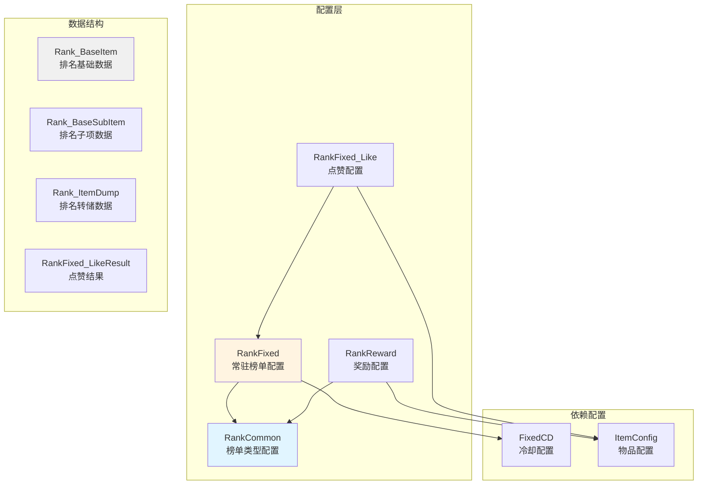
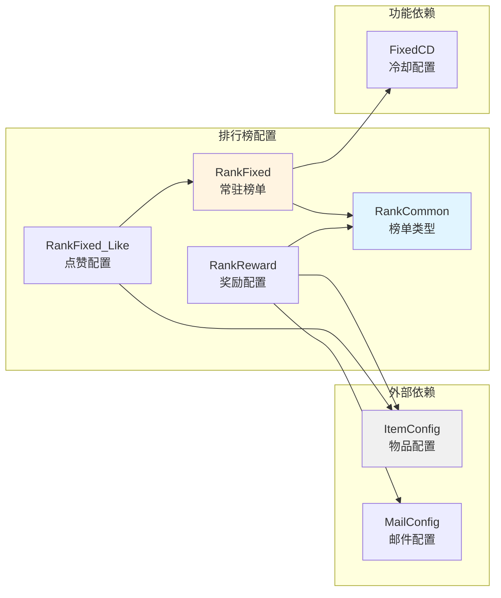

# 排行榜系统 - 数据配表

## 概述

排行榜系统 (RankOp, p031) 展示各类排名数据，包括战力榜、等级榜、竞技榜等。本模块支持跨服排行榜和单服排行榜，提供点赞、一键点赞等社交功能。

## 配表架构图



## 配表文件清单

| 配表名称 | 文件名 | 说明 | 使用场景 |
|---------|--------|------|---------|
| RankCommon | rank_common.xlsx | 排行榜类型配置 | 定义榜单基础属性 |
| RankFixed | rank_fixed.xlsx | 常驻榜单配置 | 定义具体榜单实例 |
| RankReward | rank_reward.xlsx | 排名奖励配置 | 周期奖励发放 |
| RankFixed_Like | rank_fixed_like.xlsx | 点赞配置 | 点赞次数和奖励 |

---

## 1. 排行榜类型配置 (RankCommon)

### 1.1 完整字段列表

| 字段名 | 类型 | 必填 | 默认值 | 说明 | 示例 |
|-------|------|------|--------|------|------|
| id | int | ✓ | - | 榜单类型ID | 1 |
| rank_type | int | ✓ | - | 榜单类型枚举值 (ERankType) | 1 (PLAYER) |
| rank_name | string | ✓ | - | 榜单名称（多语言key） | rank_player |
| rank_icon | string | ✗ | "" | 榜单图标路径 | "UI/Icon/Rank/player" |
| show_count | int | ✓ | 100 | 显示数量 (10-1000) | 100 |
| refresh_type | int | ✓ | 1 | 刷新类型：1=实时，2=定时 | 1 |
| refresh_time | int | ✗ | 3600 | 刷新间隔（秒），最小60秒 | 3600 |
| score_name | string | ✓ | - | 分数名称（多语言key） | rank_score_power |
| detail_show_type | int | ✗ | 1 | 详情展示类型 (ERankDetailShowType) | 1 |
| is_cross | bool | ✗ | false | 是否支持跨服 | true |
| cross_server_type | int | ✗ | 0 | 跨服类型：0=不跨服，1=同类型服，2=全服 | 1 |
| desc | string | ✗ | "" | 榜单描述 | "玩家排行榜" |

### 1.2 排行榜类型枚举 (ERankType)

```csharp
/// <summary>
/// 排行榜类型枚举 - 定义榜单的基本分类
/// </summary>
public enum ERankType
{
    /// <summary>
    /// 无效类型
    /// </summary>
    NONE = 0,

    /// <summary>
    /// 玩家排行榜 - 按玩家综合实力排名
    /// </summary>
    PLAYER = 1,

    /// <summary>
    /// 联盟排行榜 - 按公会/联盟总战力排名
    /// </summary>
    GUILD = 2,

    /// <summary>
    /// 活动组队排行榜 - 按活动组队积分排名
    /// </summary>
    ACTIVITY_TEAM = 3,
}
```

### 1.3 详情展示类型枚举 (ERankDetailShowType)

```csharp
/// <summary>
/// 排行榜详细信息展示类型 - 决定点击排名项时展示的详情页面类型
/// </summary>
public enum ERankDetailShowType
{
    /// <summary>
    /// 无效类型
    /// </summary>
    NONE = 0,

    /// <summary>
    /// 玩家详情 - 显示玩家个人信息
    /// </summary>
    PLAYER = 1,

    /// <summary>
    /// 大臣详情 - 显示大臣/英雄详细信息
    /// </summary>
    HERO = 2,
}
```

### 1.4 刷新类型枚举

```csharp
/// <summary>
/// 榜单刷新类型
/// </summary>
public enum ERankRefreshType
{
    /// <summary>
    /// 实时刷新 - 分数变化立即更新排名
    /// </summary>
    REALTIME = 1,

    /// <summary>
    /// 定时刷新 - 按配置间隔定时更新
    /// </summary>
    SCHEDULED = 2,
}
```

### 1.5 跨服类型枚举

```csharp
/// <summary>
/// 跨服类型枚举
/// </summary>
public enum ECrossServerType
{
    /// <summary>
    /// 不跨服 - 仅本服玩家参与
    /// </summary>
    NONE = 0,

    /// <summary>
    /// 同类型服务器 - 相同服务器类型之间跨服
    /// </summary>
    SAME_TYPE = 1,

    /// <summary>
    /// 全服 - 所有服务器之间跨服
    /// </summary>
    ALL = 2,
}
```

### 1.6 配置示例

```json
{
  "id": 1,
  "rank_type": 1,
  "rank_name": "rank_player",
  "rank_icon": "UI/Icon/Rank/player",
  "show_count": 100,
  "refresh_type": 1,
  "refresh_time": 3600,
  "score_name": "rank_score_power",
  "detail_show_type": 1,
  "is_cross": true,
  "cross_server_type": 1,
  "desc": "玩家排行榜"
}
```

---

## 2. 常驻榜单配置 (RankFixed)

### 2.1 完整字段列表

| 字段名 | 类型 | 必填 | 默认值 | 说明 | 示例 |
|-------|------|------|--------|------|------|
| id | long | ✓ | - | 常驻榜单实例ID | 1001 |
| rank_id | int | ✓ | - | 关联的榜单类型ID (RankCommon.id) | 1 |
| rank_name | string | ✓ | - | 榜单名称 | "玩家榜-跨服" |
| is_cross | bool | ✗ | false | 是否跨服榜 | true |
| like_fixed_cd_id | int | ✓ | - | 点赞冷却ID (FixedCD.id) | 1001 |
| max_like_count | int | ✗ | 10 | 每日最大点赞次数 (1-100) | 10 |
| like_reward_id | int | ✗ | 0 | 点赞奖励ID | 1001 |
| settlement_type | int | ✗ | 1 | 结算类型：1=每日，2=每周，3=每月 | 1 |
| settlement_time | string | ✗ | "00:00" | 结算时间 | "00:00" |
| show_my_rank | bool | ✗ | true | 是否显示我的排名 | true |
| show_my_score | bool | ✗ | true | 是否显示我的分数 | true |
| unlock_condition | string | ✗ | "" | 解锁条件 | "level>=10" |

### 2.2 配置示例

```json
{
  "id": 1001,
  "rank_id": 1,
  "rank_name": "玩家榜-跨服",
  "is_cross": true,
  "like_fixed_cd_id": 1001,
  "max_like_count": 10,
  "like_reward_id": 1001,
  "settlement_type": 1,
  "settlement_time": "00:00",
  "show_my_rank": true,
  "show_my_score": true,
  "unlock_condition": "level>=10"
}
```

---

## 3. 排行榜奖励配置 (RankReward)

### 3.1 完整字段列表

| 字段名 | 类型 | 必填 | 默认值 | 说明 | 示例 |
|-------|------|------|--------|------|------|
| id | int | ✓ | - | 奖励配置ID | 1001 |
| rank_id | int | ✓ | - | 榜单类型ID (RankCommon.id) | 1 |
| min_rank | int | ✓ | - | 最低排名（包含），必须 ≤ max_rank | 1 |
| max_rank | int | ✓ | - | 最高排名（包含），必须 ≥ min_rank | 1 |
| reward_list | array | ✓ | - | 奖励列表 | [{itemId:1001, count:100}] |
| mail_title | string | ✗ | "" | 邮件标题（多语言key） | rank_reward_title |
| mail_content | string | ✗ | "" | 邮件内容（多语言key） | rank_reward_content |
| settlement_type | int | ✗ | 1 | 结算类型：1=每日，2=每周，3=每月 | 1 |

### 3.2 奖励项字段

| 字段名 | 类型 | 说明 | 示例 |
|-------|------|------|------|
| itemId | int | 物品ID (ItemConfig.id) | 1001 |
| count | int | 物品数量 | 100 |

### 3.3 配置示例

```json
[
  {
    "id": 1001,
    "rank_id": 1,
    "min_rank": 1,
    "max_rank": 1,
    "reward_list": [
      {"itemId": 1001, "count": 1000},
      {"itemId": 1002, "count": 10}
    ],
    "mail_title": "rank_reward_title_1",
    "mail_content": "rank_reward_content_1",
    "settlement_type": 1
  },
  {
    "id": 1002,
    "rank_id": 1,
    "min_rank": 2,
    "max_rank": 3,
    "reward_list": [
      {"itemId": 1001, "count": 500}
    ],
    "mail_title": "rank_reward_title_2",
    "mail_content": "rank_reward_content_2",
    "settlement_type": 1
  },
  {
    "id": 1003,
    "rank_id": 1,
    "min_rank": 4,
    "max_rank": 10,
    "reward_list": [
      {"itemId": 1001, "count": 300}
    ],
    "mail_title": "rank_reward_title_3",
    "mail_content": "rank_reward_content_3",
    "settlement_type": 1
  },
  {
    "id": 1004,
    "rank_id": 1,
    "min_rank": 11,
    "max_rank": 50,
    "reward_list": [
      {"itemId": 1001, "count": 100}
    ],
    "mail_title": "rank_reward_title_4",
    "mail_content": "rank_reward_content_4",
    "settlement_type": 1
  }
]
```

---

## 4. 点赞配置 (RankFixed_Like)

### 4.1 完整字段列表

| 字段名 | 类型 | 必填 | 默认值 | 说明 | 示例 |
|-------|------|------|--------|------|------|
| id | int | ✓ | - | 点赞配置ID | 1001 |
| rank_fixed_id | long | ✓ | - | 关联的常驻榜单ID (RankFixed.id) | 1001 |
| like_count | int | ✓ | - | 需要点赞次数（达成奖励条件） | 10 |
| reward_list | array | ✓ | - | 奖励列表 | [{itemId:1001, count:10}] |

### 4.2 配置示例

```json
{
  "id": 1001,
  "rank_fixed_id": 1001,
  "like_count": 10,
  "reward_list": [
    {"itemId": 1001, "count": 10}
  ]
}
```

---

## 5. 冷却配置 (FixedCD)

### 5.1 点赞冷却配置

| 字段名 | 类型 | 说明 | 示例 |
|-------|------|------|------|
| id | int | 冷却ID | 1001 |
| cd_type | int | 冷却类型：1=每日重置 | 1 |
| cd_time | int | 冷却时间（秒） | 86400 |
| max_count | int | 最大次数 | 10 |

### 5.2 配置示例

```json
{
  "id": 1001,
  "cd_type": 1,
  "cd_time": 86400,
  "max_count": 10
}
```

---

## 6. 数据结构定义

### 6.1 Rank_BaseItem（排名基础数据）

```csharp
/// <summary>
/// 排行榜基础数据 - 表示一个排名项的完整信息
/// </summary>
public class Rank_BaseItem
{
    /// <summary>
    /// 排名主体ID（玩家ID或公会ID）
    /// 示例：玩家ID 20001，公会ID 30001
    /// </summary>
    public long key { get; set; }

    /// <summary>
    /// 分数来源ID（如英雄ID、大臣ID等）
    /// 用于区分同一主体的不同分数来源
    /// 示例：大臣ID 10001 表示该分数来自某大臣
    /// 默认值：0 表示无特定来源
    /// </summary>
    public long sourceId { get; set; }

    /// <summary>
    /// 分数值
    /// 必须大于等于 0
    /// </summary>
    public long score { get; set; }

    /// <summary>
    /// 排名（1-100）
    /// 1 表示第一名
    /// </summary>
    public int rank { get; set; }
}
```

**数据示例**：

```json
{
  "key": 20001,
  "sourceId": 0,
  "score": 999999,
  "rank": 1
}
```

### 6.2 Rank_BaseSubItem（排名子项数据）

```csharp
/// <summary>
/// 排行榜子项数据 - 用于展示排名详情中的子排名项
/// </summary>
public class Rank_BaseSubItem
{
    /// <summary>
    /// 子项主体ID（如大臣ID、英雄ID等）
    /// </summary>
    public long key { get; set; }

    /// <summary>
    /// 分数来源ID（二级来源）
    /// </summary>
    public long sourceId { get; set; }

    /// <summary>
    /// 分数值
    /// </summary>
    public long score { get; set; }
}
```

**数据示例**：

```json
{
  "key": 10001,
  "sourceId": 0,
  "score": 50000
}
```

### 6.3 Rank_ItemDump（排名转储数据）

```csharp
/// <summary>
/// 排行榜转储数据 - 用于数据迁移和快照存储
/// </summary>
public class Rank_ItemDump
{
    /// <summary>
    /// 排名主体ID
    /// </summary>
    public long key { get; set; }

    /// <summary>
    /// 团体ID（如公会ID）
    /// 用于区分玩家所属团体
    /// </summary>
    public long groupId { get; set; }

    /// <summary>
    /// 排名
    /// </summary>
    public int rank { get; set; }

    /// <summary>
    /// 分数值
    /// </summary>
    public long score { get; set; }
}
```

**数据示例**：

```json
{
  "key": 20001,
  "groupId": 30001,
  "rank": 1,
  "score": 999999
}
```

### 6.4 RankFixed_LikeResult（点赞结果）

```csharp
/// <summary>
/// 常驻排行榜点赞结果 - 点赞操作返回的完整信息
/// </summary>
public class RankFixed_LikeResult
{
    /// <summary>
    /// 常驻排行榜ID
    /// </summary>
    public long rankFixedId { get; set; }

    /// <summary>
    /// 被点赞者的基础数据
    /// </summary>
    public Rank_BaseItem info { get; set; }

    /// <summary>
    /// 点赞积分（被点赞者累计获得的点赞数）
    /// </summary>
    public long likeScore { get; set; }

    /// <summary>
    /// 点赞奖励列表
    /// </summary>
    public List<NPCommon_ItemInfo> rewardItemList { get; set; }
}
```

**数据示例**：

```json
{
  "rankFixedId": 1001,
  "info": {
    "key": 20001,
    "sourceId": 0,
    "score": 999999,
    "rank": 1
  },
  "likeScore": 10,
  "rewardItemList": [
    {"itemId": 1001, "count": 10}
  ]
}
```

---

## 7. 配置验证规则

### 7.1 字段约束

| 字段 | 约束规则 | 错误提示 |
|------|---------|---------|
| show_count | 范围：10-1000 | 显示数量必须在10-1000之间 |
| refresh_time | 最小值：60秒 | 刷新间隔至少60秒 |
| min_rank | 必须 ≤ max_rank | 最低排名不能大于最高排名 |
| max_like_count | 范围：1-100 | 每日点赞次数必须在1-100之间 |
| score | 必须 ≥ 0 | 分数不能为负数 |
| rank | 必须 ≥ 1 | 排名必须大于0 |

### 7.2 配置依赖关系图



---

## 8. 配置关系矩阵

| 配置表 | RankCommon | RankFixed | RankReward | RankFixed_Like | FixedCD | ItemConfig |
|-------|------------|-----------|------------|----------------|---------|------------|
| RankCommon | - | 被引用 | 被引用 | - | - | - |
| RankFixed | 引用 | - | - | 被引用 | 引用 | - |
| RankReward | 引用 | - | - | - | - | 引用 |
| RankFixed_Like | - | 引用 | - | - | - | 引用 |

---

## 9. 配表路径

| 配置类型 | 客户端路径 | 服务端路径 |
|---------|-----------|-----------|
| Excel源文件 | `game_server/DBTool/source_db/Rank*.xlsx` | `game_server/DBTool/source_db/Rank*.xlsx` |
| 客户端配置 | `game_client/Assets/Scripts/ResScripts/NPGameRes/Refs/Rank/` | - |
| 服务端配置 | - | `game_server/Config/rank/` |
| 协议定义 | `game_server/ClientProtocol/Common/RankObj/` | `game_server/ServerProtocol/src/Common/RankObj/` |
| 枚举定义 | `game_client/Assets/Scripts/ClientProtocol/NPEnum/ERankType.cs` | - |

---

## 10. 常见问题

### Q1: 如何新增一个排行榜类型？

1. 在 `ERankType` 枚举中添加新类型
2. 在 `RankCommon` 配置中新增一行
3. 如需常驻榜单，在 `RankFixed` 中配置
4. 如需奖励，在 `RankReward` 中配置

### Q2: 如何配置跨服排行榜？

1. 在 `RankCommon` 中设置 `is_cross = true`
2. 在 `RankFixed` 中设置 `is_cross = true`
3. 配置 `cross_server_type` 指定跨服范围
4. 确保跨服服务器配置正确

### Q3: 点赞次数如何重置？

点赞次数通过 `FixedCD` 配置管理，每日零点自动重置。冷却时间设置为 86400 秒（24小时）。

### Q4: 如何配置多级排名？

使用 `sourceId` 字段区分同一主体的不同排名来源：
- `key` = 玩家ID
- `sourceId` = 大臣/英雄ID
- `score` = 该大臣/英雄的分数

---

## 11. 数据字典

| 术语 | 说明 |
|-----|------|
| rankFixedId | 常驻排行榜实例ID，对应 RankFixed 配置的 id |
| rank_id | 榜单类型ID，对应 RankCommon 配置的 id |
| key | 排名主体ID，可以是玩家ID或公会ID |
| sourceId | 分数来源ID，用于区分同一主体的不同分数来源 |
| isCross | 是否跨服，true 表示跨服榜单，false 表示单服榜单 |

---

*文档更新时间: 2026-04-11*
*文档维护者: 天天 (AI助手)*
