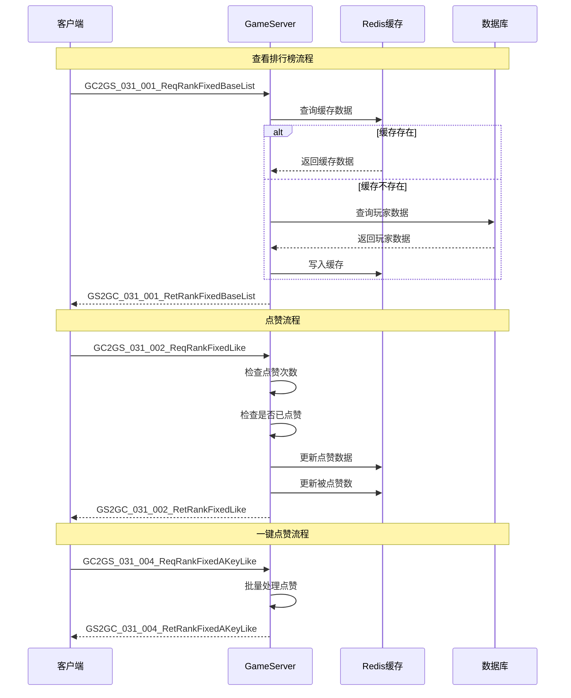
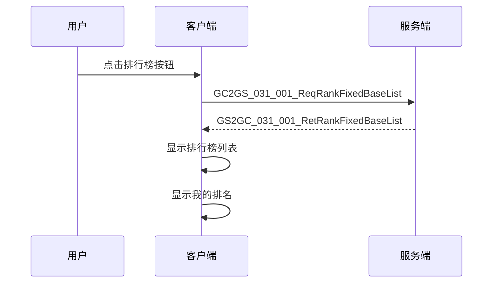
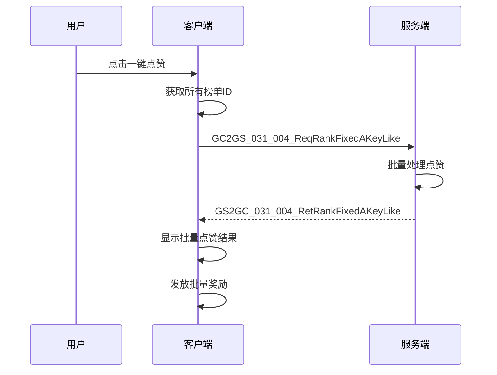

# 排行榜系统 - 协议文档

## 协议编号

模块编号：p031 (RankOp)

---

## 协议交互流程图



---

## 客户端请求协议 (GC2GS)

### 1. GC2GS_031_001_ReqRankFixedBaseList

**说明**：请求排行榜基础列表

#### 请求参数

| 字段名 | 类型 | 必填 | 说明 | 示例 |
|-------|------|------|------|------|
| rankFixedId | long | ✓ | 常驻排行榜实例ID | 1001 |
| isCross | bool | ✗ | 是否跨服（默认false） | true |

#### 协议定义

```csharp
/// <summary>
/// 请求常驻排行榜基础信息
/// </summary>
public class GC2GS_031_001_ReqRankFixedBaseList
{
    /// <summary>
    /// 常驻排行榜实例ID
    /// </summary>
    public long rankFixedId { get; set; }

    /// <summary>
    /// 是否跨服
    /// </summary>
    public bool isCross { get; set; }
}
```

#### 请求示例

```json
{
  "rankFixedId": 1001,
  "isCross": true
}
```

#### 返回协议

GS2GC_031_001_RetRankFixedBaseList

---

### 2. GC2GS_031_002_ReqRankFixedLike

**说明**：请求点赞指定榜单的第一个玩家

#### 请求参数

| 字段名 | 类型 | 必填 | 说明 | 示例 |
|-------|------|------|------|------|
| rankFixedId | long | ✓ | 常驻排行榜实例ID | 1001 |
| isCross | bool | ✗ | 是否跨服（默认false） | true |

#### 协议定义

```csharp
/// <summary>
/// 请求常驻排行榜点赞
/// </summary>
public class GC2GS_031_002_ReqRankFixedLike
{
    /// <summary>
    /// 常驻排行榜实例ID
    /// </summary>
    public long rankFixedId { get; set; }

    /// <summary>
    /// 是否跨服
    /// </summary>
    public bool isCross { get; set; }
}
```

#### 请求示例

```json
{
  "rankFixedId": 1001,
  "isCross": true
}
```

#### 返回协议

GS2GC_031_002_RetRankFixedLike

---

### 3. GC2GS_031_003_ReqRankFixedLikeScore

**说明**：请求指定玩家的点赞积分信息

#### 请求参数

| 字段名 | 类型 | 必填 | 说明 | 示例 |
|-------|------|------|------|------|
| rankFixedId | long | ✓ | 常驻排行榜实例ID | 1001 |
| key | long | ✓ | 玩家ID或公会ID | 20001 |
| isCross | bool | ✗ | 是否跨服（默认false） | true |

#### 协议定义

```csharp
/// <summary>
/// 请求常驻排行榜点赞积分信息
/// </summary>
public class GC2GS_031_003_ReqRankFixedLikeScore
{
    /// <summary>
    /// 常驻排行榜实例ID
    /// </summary>
    public long rankFixedId { get; set; }

    /// <summary>
    /// 排名主体ID（玩家ID或公会ID）
    /// </summary>
    public long key { get; set; }

    /// <summary>
    /// 是否跨服
    /// </summary>
    public bool isCross { get; set; }
}
```

#### 请求示例

```json
{
  "rankFixedId": 1001,
  "key": 20001,
  "isCross": true
}
```

#### 返回协议

GS2GC_031_003_RetRankFixedLikeScore

---

### 4. GC2GS_031_004_ReqRankFixedAKeyLike

**说明**：请求一键点赞多个榜单

#### 请求参数

| 字段名 | 类型 | 必填 | 说明 | 示例 |
|-------|------|------|------|------|
| rankFixedIdList | List&lt;long&gt; | ✓ | 常驻排行榜ID列表 | [1001, 1002, 1003] |
| isCross | bool | ✗ | 是否跨服（默认false） | true |

#### 协议定义

```csharp
/// <summary>
/// 请求常驻排行榜一键点赞
/// </summary>
public class GC2GS_031_004_ReqRankFixedAKeyLike
{
    /// <summary>
    /// 常驻排行榜ID列表
    /// </summary>
    public List<long> rankFixedIdList { get; set; }

    /// <summary>
    /// 是否跨服
    /// </summary>
    public bool isCross { get; set; }
}
```

#### 请求示例

```json
{
  "rankFixedIdList": [1001, 1002, 1003],
  "isCross": true
}
```

#### 返回协议

GS2GC_031_004_RetRankFixedAKeyLike

---

### 5. GC2GS_031_005_ReqRankFixedInfoByRank

**说明**：请求按排名获取排行榜信息

#### 请求参数

| 字段名 | 类型 | 必填 | 说明 | 示例 |
|-------|------|------|------|------|
| rankFixedId | long | ✓ | 常驻排行榜实例ID | 1001 |
| rank | int | ✓ | 排名（1-100） | 1 |
| isCross | bool | ✗ | 是否跨服（默认false） | true |

#### 协议定义

```csharp
/// <summary>
/// 请求常驻排行榜信息通过排名
/// </summary>
public class GC2GS_031_005_ReqRankFixedInfoByRank
{
    /// <summary>
    /// 常驻排行榜实例ID
    /// </summary>
    public long rankFixedId { get; set; }

    /// <summary>
    /// 排名（1-100）
    /// </summary>
    public int rank { get; set; }

    /// <summary>
    /// 是否跨服
    /// </summary>
    public bool isCross { get; set; }
}
```

#### 请求示例

```json
{
  "rankFixedId": 1001,
  "rank": 1,
  "isCross": true
}
```

#### 返回协议

GS2GC_031_005_RetRankFixedInfoByRank

---

### 6. GC2GS_031_006_ReqRankFixedInfoByKey

**说明**：请求按键值（玩家ID/公会ID）获取排行榜信息

#### 请求参数

| 字段名 | 类型 | 必填 | 说明 | 示例 |
|-------|------|------|------|------|
| rankFixedId | long | ✓ | 常驻排行榜实例ID | 1001 |
| key | long | ✓ | 玩家ID或公会ID | 20001 |
| isCross | bool | ✗ | 是否跨服（默认false） | true |

#### 协议定义

```csharp
/// <summary>
/// 请求常驻排行榜通过主体ID
/// </summary>
public class GC2GS_031_006_ReqRankFixedInfoByKey
{
    /// <summary>
    /// 常驻排行榜实例ID
    /// </summary>
    public long rankFixedId { get; set; }

    /// <summary>
    /// 排名主体ID
    /// </summary>
    public long key { get; set; }

    /// <summary>
    /// 是否跨服
    /// </summary>
    public bool isCross { get; set; }
}
```

#### 请求示例

```json
{
  "rankFixedId": 1001,
  "key": 20001,
  "isCross": true
}
```

#### 返回协议

GS2GC_031_006_RetRankFixedInfoByKey

---

## 服务端响应协议 (GS2GC)

### 1. GS2GC_031_001_RetRankFixedBaseList

**说明**：返回排行榜基础列表

#### 响应字段

| 字段名 | 类型 | 说明 |
|-------|------|------|
| baseItemlist | List&lt;Rank_BaseItem&gt; | 排名基础数据列表 |

#### 协议定义

```csharp
/// <summary>
/// 返回排行榜基础列表
/// </summary>
public class GS2GC_031_001_RetRankFixedBaseList
{
    /// <summary>
    /// 基础数据列表
    /// </summary>
    public List<Rank_BaseItem> baseItemlist { get; set; }
}
```

#### 响应示例

```json
{
  "baseItemlist": [
    {
      "key": 20001,
      "sourceId": 0,
      "score": 999999,
      "rank": 1
    },
    {
      "key": 20002,
      "sourceId": 0,
      "score": 888888,
      "rank": 2
    }
  ]
}
```

---

### 2. GS2GC_031_002_RetRankFixedLike

**说明**：返回点赞结果

#### 响应字段

| 字段名 | 类型 | 说明 |
|-------|------|------|
| likeResult | RankFixed_LikeResult | 点赞结果对象 |

#### 协议定义

```csharp
/// <summary>
/// 返回点赞结果
/// </summary>
public class GS2GC_031_002_RetRankFixedLike
{
    /// <summary>
    /// 点赞结果
    /// </summary>
    public RankFixed_LikeResult likeResult { get; set; }
}
```

#### 响应示例

```json
{
  "likeResult": {
    "rankFixedId": 1001,
    "info": {
      "key": 20001,
      "sourceId": 0,
      "score": 999999,
      "rank": 1
    },
    "likeScore": 10,
    "rewardItemList": [
      {"itemId": 1001, "count": 10}
    ]
  }
}
```

---

### 3. GS2GC_031_003_RetRankFixedLikeScore

**说明**：返回点赞积分信息

#### 响应字段

| 字段名 | 类型 | 说明 |
|-------|------|------|
| likeScore | long | 点赞积分 |

---

### 4. GS2GC_031_004_RetRankFixedAKeyLike

**说明**：返回一键点赞结果列表

#### 响应字段

| 字段名 | 类型 | 说明 |
|-------|------|------|
| likeResultList | List&lt;RankFixed_LikeResult&gt; | 点赞结果列表 |

---

### 5. GS2GC_031_005_RetRankFixedInfoByRank

**说明**：返回按排名查询的信息

#### 响应字段

| 字段名 | 类型 | 说明 |
|-------|------|------|
| info | Rank_BaseItem | 排名信息 |

---

### 6. GS2GC_031_006_RetRankFixedInfoByKey

**说明**：返回按键值查询的信息

#### 响应字段

| 字段名 | 类型 | 说明 |
|-------|------|------|
| info | Rank_BaseItem | 排名信息 |

---

## 公共数据结构

### Rank_BaseItem（排名基础数据）

| 字段名 | 类型 | 必填 | 说明 |
|-------|------|------|------|
| key | long | ✓ | 排名主体ID（玩家ID或公会ID） |
| sourceId | long | ✗ | 分数来源ID（如英雄ID、大臣ID等） |
| score | long | ✓ | 分数值 |
| rank | int | ✓ | 排名（1-100） |

```csharp
/// <summary>
/// 排行榜基础数据
/// </summary>
public class Rank_BaseItem
{
    private long key;           // 排名主体ID
    private long sourceId;      // 分数来源ID
    private long score;         // 分数
    private int rank;           // 排名
}
```

### RankFixed_LikeResult（点赞结果）

| 字段名 | 类型 | 必填 | 说明 |
|-------|------|------|------|
| rankFixedId | long | ✓ | 常驻排行榜ID |
| info | Rank_BaseItem | ✓ | 被点赞者信息 |
| likeScore | long | ✓ | 点赞积分 |
| rewardItemList | List&lt;ItemInfo&gt; | ✗ | 奖励列表 |

```csharp
/// <summary>
/// 常驻排行榜点赞结果
/// </summary>
public class RankFixed_LikeResult
{
    private long rankFixedId;                       // 常驻排行榜ID
    private Rank_BaseItem info;                     // 基础数据
    private long likeScore;                         // 点赞积分
    private List<NPCommon_ItemInfo> rewardItemList; // 奖励列表
}
```

---

## 错误码定义

| 错误码 | 错误信息 | 说明 | 客户端提示 |
|-------|---------|------|-----------|
| 64001 | RANK_TYPE_INVALID | 榜单类型无效 | "榜单不存在" |
| 64002 | LIKE_COUNT_EXCEEDED | 今日点赞次数已用完 | "今日点赞次数已用完" |
| 64003 | ALREADY_LIKED | 已经点赞过 | "您已点赞过该玩家" |
| 64004 | CANNOT_LIKE_SELF | 不能给自己点赞 | "不能给自己点赞" |
| 64005 | PLAYER_NOT_IN_RANK | 玩家不在榜单中 | "该玩家不在榜单中" |
| 64006 | RANK_NOT_FOUND | 排名不存在 | "该排名不存在" |
| 64007 | CROSS_RANK_NOT_OPEN | 跨服排行榜未开启 | "跨服排行榜未开启" |
| 64008 | LIKE_TARGET_NOT_FOUND | 点赞对象不存在 | "点赞对象不存在" |

---

## 协议使用场景

### 场景1：打开排行榜界面



### 场景2：点赞操作


### 场景3：一键点赞



---

## 协议性能优化建议

### 1. 缓存策略

- 排行榜数据使用 Redis 缓存，缓存时间 1 小时
- 点赞次数使用 Redis 计数器，每日零点重置

### 2. 请求优化

- 避免频繁请求排行榜，使用缓存数据
- 一键点赞时，批量处理减少请求次数
- 使用 `isCross` 参数区分跨服和单服请求

### 3. 数据压缩

- 排名数据列表支持压缩传输
- 只传输必要的字段，减少数据量

---

## 协议文件路径

| 协议类型 | 文件路径 |
|---------|---------|
| GC2GS 协议 | `game_server/ClientProtocol/GC2GS/p031_RankOp/` |
| GS2GC 协议 | `game_server/ClientProtocol/GS2GC/p031_RankOp/` |
| 公共数据结构 | `game_server/ClientProtocol/Common/RankObj/` |
| 服务端协议 | `game_server/ServerProtocol/src/GC2GS/p031_RankOp/` |

---

*文档更新时间: 2026-04-11*
