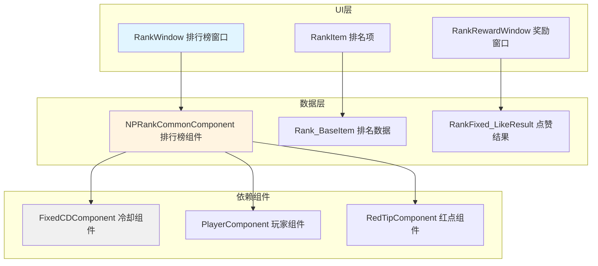
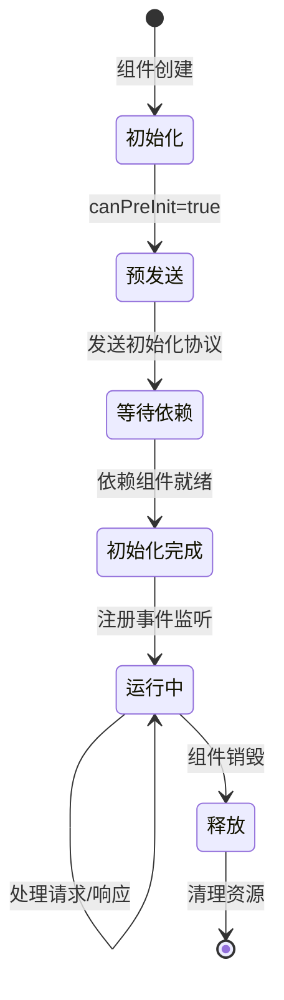
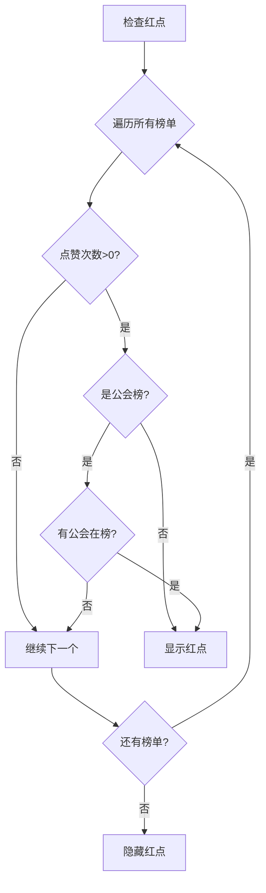

# 排行榜系统 - 客户端开发

## 组件架构图



---

## 组件结构

```
GameComponent/NPRankCommon/
├── NPRankCommonComponent.cs      # 排行榜管理组件
└── (数据结构定义在协议层)
    ├── Rank_BaseItem             # 排名基础数据
    ├── Rank_BaseSubItem          # 排名子项数据
    ├── Rank_ItemDump             # 排名项转储
    └── RankFixed_LikeResult      # 点赞结果
```

---

## 核心组件：NPRankCommonComponent

### 组件定义

```csharp
namespace GOE
{
    /// <summary>
    /// 通用排行榜管理类
    /// </summary>
    public class NPRankCommonComponent : _ANPBasicPlayerComponent
    {
        // 是否有公会在排行榜中
        private Dictionary<long, bool> _m_bHaveGuildInRankDic;

        public NPRankCommonComponent(NPPlayerComponentMgr _compMgr) : base(_compMgr)
        {
        }

        // 是否必要型初始化组件
        public override bool isMustInit { get { return true; } }

        // 获取组件类型
        public override ENPPlayerCompType compType
        {
            get { return ENPPlayerCompType.RANK_COMMON; }
        }

        // 依赖的组件队列
        public override ENPPlayerCompType[] dependCompList
        {
            get { return new ENPPlayerCompType[] { ENPPlayerCompType.FIXED_CD }; }
        }

        // 是否允许提前初始化
        public override bool canPreInit { get { return true; } }
    }
}
```

### 组件生命周期



---

## 核心API

### 1. 请求排行榜列表

```csharp
/// <summary>
/// 请求常驻排行榜列表基础信息
/// </summary>
/// <param name="_rankFixedId">常驻排行榜实例ID</param>
/// <param name="_callBack">回调函数</param>
public void reqRankFixedBaseList(
    long _rankFixedId,
    Action<GS2GC_031_001_RetRankFixedBaseList> _callBack)
{
    NPGSClientListener.sendRequestByLog(
        GSWriter_031_RankOp.make_001_ReqRankFixedBaseList(_rankFixedId),
        new CommonErrCodeRequestCallbackProtocolDealer<GS2GC_031_001_RetRankFixedBaseList>((info) =>
        {
            if (null != info && null != _callBack)
                _callBack(info);
        }));
}
```

**使用示例**：

```csharp
// 请求战力排行榜
long rankFixedId = 1001; // 战力榜实例ID
NPRankCommonComponent.instance.reqRankFixedBaseList(rankFixedId, (response) =>
{
    if (response != null)
    {
        List<Rank_BaseItem> rankList = response.getBaseItemlist();
        // 更新UI显示
        UpdateRankUI(rankList);
    }
});
```

---

### 2. 请求点赞

```csharp
/// <summary>
/// 对排行榜点赞
/// </summary>
/// <param name="_rankFixedId">常驻排行榜实例ID</param>
/// <param name="_callBack">回调函数</param>
public void reqRankFixedLike(
    long _rankFixedId,
    Action<RankFixed_LikeResult> _callBack)
{
    NPGSClientListener.sendRequestByLog(
        GSWriter_031_RankOp.make_002_ReqRankFixedLike(_rankFixedId),
        new CommonErrCodeRequestCallbackProtocolDealer<GS2GC_031_002_RetRankFixedLike>((info) =>
        {
            if (null != info && null != _callBack)
                _callBack(info.getLikeResult());
        }));
}
```

**使用示例**：

```csharp
// 点赞战力榜
long rankFixedId = 1001;
NPRankCommonComponent.instance.reqRankFixedLike(rankFixedId, (result) =>
{
    if (result != null)
    {
        // 显示点赞成功效果
        ShowLikeEffect(result);

        // 发放奖励
        if (result.rewardItemList != null && result.rewardItemList.Count > 0)
        {
            ShowRewardPanel(result.rewardItemList);
        }
    }
});
```

---

### 3. 请求一键点赞

```csharp
/// <summary>
/// 对排行榜一键点赞
/// </summary>
/// <param name="_rankFixedIdList">榜单ID列表</param>
/// <param name="_callBack">回调函数</param>
public void reqRankFixedAKeyLike(
    List<long> _rankFixedIdList,
    Action<List<RankFixed_LikeResult>> _callBack)
{
    NPGSClientListener.sendRequestByLog(
        GSWriter_031_RankOp.make_004_ReqRankFixedAKeyLike(_rankFixedIdList),
        new CommonErrCodeRequestCallbackProtocolDealer<GS2GC_031_004_RetRankFixedAKeyLike>((info) =>
        {
            if (null != info && null != _callBack)
                _callBack(info.getLikeResultList());
        }));
}
```

**使用示例**：

```csharp
// 一键点赞所有榜单
List<long> rankFixedIds = new List<long> { 1001, 1002, 1003, 1004 };
NPRankCommonComponent.instance.reqRankFixedAKeyLike(rankFixedIds, (results) =>
{
    if (results != null && results.Count > 0)
    {
        // 统计总奖励
        List<ItemInfo> allRewards = new List<ItemInfo>();
        foreach (var result in results)
        {
            if (result.rewardItemList != null)
            {
                allRewards.AddRange(result.rewardItemList);
            }
        }

        // 显示批量奖励
        if (allRewards.Count > 0)
        {
            ShowRewardPanel(allRewards);
        }
    }
});
```

---

### 4. 根据排名查询信息

```csharp
/// <summary>
/// 根据排名请求玩家排行榜相关数据
/// </summary>
/// <param name="_rankFixedId">榜单实例ID</param>
/// <param name="_rank">排名</param>
/// <param name="_callBack">回调函数</param>
public void reqInRankPlayerInfoByRank(
    long _rankFixedId,
    int _rank,
    Action<Rank_BaseItem> _callBack)
{
    NPGSClientListener.sendRequestByLog(
        GSWriter_031_RankOp.make_005_ReqRankFixedInfoByRank(_rankFixedId, _rank),
        new CommonErrCodeRequestCallbackProtocolDealer<GS2GC_031_005_RetRankFixedInfoByRank>((info) =>
        {
            if (null != info && null != _callBack)
                _callBack(info.getInfo());
        }));
}
```

**使用示例**：

```csharp
// 查询第1名玩家信息
NPRankCommonComponent.instance.reqInRankPlayerInfoByRank(1001, 1, (info) =>
{
    if (info != null)
    {
        // 显示第1名玩家详情
        ShowPlayerDetail(info.key, info.score);
    }
});
```

---

### 5. 根据ID查询排名

```csharp
/// <summary>
/// 根据玩家ID请求排行榜相关数据
/// </summary>
/// <param name="_rankFixedId">榜单实例ID</param>
/// <param name="_cid">玩家ID</param>
/// <param name="_callBack">回调函数</param>
public void reqInRankPlayerInfoByCid(
    long _rankFixedId,
    long _cid,
    Action<Rank_BaseItem> _callBack)
{
    NPGSClientListener.sendRequestByLog(
        GSWriter_031_RankOp.make_006_ReqRankFixedInfoByKey(_rankFixedId, _cid),
        new CommonErrCodeRequestCallbackProtocolDealer<GS2GC_031_006_RetRankFixedInfoByKey>((info) =>
        {
            if (null != info && null != _callBack)
                _callBack(info.getInfo());
        }));
}
```

**使用示例**：

```csharp
// 查询指定玩家在排行榜中的位置
long playerId = 20001;
NPRankCommonComponent.instance.reqInRankPlayerInfoByCid(1001, playerId, (info) =>
{
    if (info != null)
    {
        // 显示该玩家的排名
        Debug.Log($"玩家 {playerId} 排名: {info.rank}, 分数: {info.score}");
    }
    else
    {
        Debug.Log("该玩家未上榜");
    }
});
```

---

### 6. 刷新红点

```csharp
/// <summary>
/// 刷新排行榜入口红点
/// </summary>
public void refreshRedTip()
{
    for (int i = 0; i < GRefdataCoreMgr.instance.rankFixedRefCore.refList.Count; i++)
    {
        NPRankFixedRefObj rankFixedRef = GRefdataCoreMgr.instance.rankFixedRefCore.refList[i];
        if (rankFixedRef != null &&
            NPPlayer.instance.fixedCdComp.getCount(rankFixedRef.like_fixed_cd_id) > 0)
        {
            NPRankRefObj rankRef = GRefdataCoreMgr.instance.rankCommonRefCore.getRef(rankFixedRef.rank_id);

            // 如果是联盟排行榜，则需要判断是否有联盟在排行榜中
            if (rankRef != null && rankRef.rank_type == ERankType.GUILD)
            {
                if (getHaveGuildInRank(rankFixedRef.id))
                {
                    RedTipMgr.instance.setCountByRefRedTipId(RedTipConst.RED_RANK_ENTRANCE, 1);
                    return;
                }
                else
                    continue;
            }
            else
            {
                RedTipMgr.instance.setCountByRefRedTipId(RedTipConst.RED_RANK_ENTRANCE, 1);
                return;
            }
        }
    }

    RedTipMgr.instance.setCountByRefRedTipId(RedTipConst.RED_RANK_ENTRANCE, 0);
}
```

---

## UI 窗口开发

### 排行榜主窗口示例

```csharp
/// <summary>
/// 排行榜主窗口
/// </summary>
public class RankWindow : BaseWindow
{
    // 当前榜单类型
    private long _currentRankFixedId;

    // 排名列表
    private List<Rank_BaseItem> _rankList = new List<Rank_BaseItem>();

    // 我的排名
    private Rank_BaseItem _myRankInfo;

    /// <summary>
    /// 设置榜单类型
    /// </summary>
    public void SetRankType(long rankFixedId)
    {
        _currentRankFixedId = rankFixedId;
        RefreshRankList();
    }

    /// <summary>
    /// 刷新排行榜
    /// </summary>
    private void RefreshRankList()
    {
        // 显示加载中
        ShowLoading();

        // 请求排行榜数据
        NPRankCommonComponent.instance.reqRankFixedBaseList(_currentRankFixedId, (response) =>
        {
            HideLoading();

            if (response != null)
            {
                _rankList = response.getBaseItemlist();
                UpdateRankItems();
            }
        });
    }

    /// <summary>
    /// 更新排名项显示
    /// </summary>
    private void UpdateRankItems()
    {
        // 清空旧数据
        ClearRankItems();

        // 创建新项
        for (int i = 0; i < _rankList.Count; i++)
        {
            Rank_BaseItem item = _rankList[i];
            CreateRankItem(item);
        }

        // 更新我的排名
        UpdateMyRank();
    }

    /// <summary>
    /// 创建排名项
    /// </summary>
    private void CreateRankItem(Rank_BaseItem item)
    {
        GameObject rankItemObj = Instantiate(rankItemPrefab, contentTransform);
        RankItem rankItem = rankItemObj.GetComponent<RankItem>();
        rankItem.SetData(item);

        // 注册点击事件
        rankItem.OnClick = () => OnRankItemClick(item);
        rankItem.OnLikeClick = () => OnLikeClick(item);
    }

    /// <summary>
    /// 点击排名项
    /// </summary>
    private void OnRankItemClick(Rank_BaseItem item)
    {
        // 显示玩家详情
        ShowPlayerDetail(item.key);
    }

    /// <summary>
    /// 点击点赞按钮
    /// </summary>
    private void OnLikeClick(Rank_BaseItem item)
    {
        // 请求点赞
        NPRankCommonComponent.instance.reqRankFixedLike(_currentRankFixedId, (result) =>
        {
            if (result != null)
            {
                // 显示点赞成功
                ShowLikeSuccess();

                // 更新红点
                NPRankCommonComponent.instance.refreshRedTip();

                // 显示奖励
                if (result.rewardItemList != null && result.rewardItemList.Count > 0)
                {
                    ShowRewardPanel(result.rewardItemList);
                }
            }
        });
    }

    /// <summary>
    /// 一键点赞
    /// </summary>
    public void OnOneKeyLikeClick()
    {
        // 获取所有可点赞的榜单
        List<long> rankFixedIds = GetAllLikeableRanks();

        NPRankCommonComponent.instance.reqRankFixedAKeyLike(rankFixedIds, (results) =>
        {
            if (results != null && results.Count > 0)
            {
                ShowOneKeyLikeSuccess(results);

                // 更新红点
                NPRankCommonComponent.instance.refreshRedTip();
            }
        });
    }
}
```

### 排名项组件示例

```csharp
/// <summary>
/// 排名项组件
/// </summary>
public class RankItem : MonoBehaviour
{
    [SerializeField] private Text rankText;
    [SerializeField] private Image rankIcon;
    [SerializeField] private Text playerNameText;
    [SerializeField] private Text scoreText;
    [SerializeField] private Button likeButton;
    [SerializeField] private GameObject likeDoneObj;

    private Rank_BaseItem _data;

    public Action OnClick;
    public Action OnLikeClick;

    private void Start()
    {
        GetComponent<Button>().onClick.AddListener(() => OnClick?.Invoke());
        likeButton.onClick.AddListener(() => OnLikeClick?.Invoke());
    }

    /// <summary>
    /// 设置数据
    /// </summary>
    public void SetData(Rank_BaseItem item)
    {
        _data = item;

        // 设置排名
        rankText.text = item.rank.ToString();

        // 设置前三名图标
        if (item.rank <= 3)
        {
            rankIcon.gameObject.SetActive(true);
            rankIcon.sprite = GetRankIcon(item.rank);
            rankText.gameObject.SetActive(false);
        }
        else
        {
            rankIcon.gameObject.SetActive(false);
            rankText.gameObject.SetActive(true);
        }

        // 设置分数
        scoreText.text = FormatScore(item.score);

        // 异步加载玩家名称
        LoadPlayerName(item.key);
    }

    /// <summary>
    /// 设置点赞状态
    /// </summary>
    public void SetLikeStatus(bool hasLiked)
    {
        likeButton.interactable = !hasLiked;
        likeDoneObj.SetActive(hasLiked);
    }

    /// <summary>
    /// 异步加载玩家名称
    /// </summary>
    private void LoadPlayerName(long playerId)
    {
        NPRankCommonComponent.instance.reqPlayerBriefInfo(playerId, (briefInfo) =>
        {
            if (briefInfo != null)
            {
                playerNameText.text = briefInfo.playerName;
            }
        });
    }

    /// <summary>
    /// 格式化分数显示
    /// </summary>
    private string FormatScore(long score)
    {
        if (score >= 100000000)
            return $"{score / 100000000f:F1}亿";
        else if (score >= 10000)
            return $"{score / 10000f:F1}万";
        else
            return score.ToString();
    }
}
```

---

## 事件系统

### 事件类型定义

```csharp
/// <summary>
/// 排行榜相关事件类型
/// </summary>
public enum RankEventType
{
    RANK_LIST_UPDATE = 1,       // 排行榜列表更新
    RANK_MY_RANK_UPDATE = 2,    // 我的排名更新
    LIKE_SUCCESS = 3,           // 点赞成功
    LIKE_COUNT_CHANGE = 4,      // 点赞次数变化
}
```

### 事件监听示例

```csharp
/// <summary>
/// 注册事件监听
/// </summary>
public void RegisterEvents()
{
    // 监听冷却时间变化
    WinMsg.RegisterMsg(WinMsgType.ON_FIXED_CD_COUNT_CHG, OnFixedCDChg);
}

/// <summary>
/// 冷却时间变化回调
/// </summary>
private void OnFixedCDChg(params object[] args)
{
    // 刷新红点
    NPRankCommonComponent.instance.refreshRedTip();

    // 刷新点赞按钮状态
    UpdateLikeButtonStatus();
}

/// <summary>
/// 取消事件监听
/// </summary>
public void UnregisterEvents()
{
    WinMsg.UnregisterMsg(WinMsgType.ON_FIXED_CD_COUNT_CHG, OnFixedCDChg);
}
```

---

## 红点系统

### 红点逻辑



### 红点管理代码

```csharp
/// <summary>
/// 检查是否显示排行榜红点
/// </summary>
public bool CheckRankRedTip()
{
    var rankFixedList = GRefdataCoreMgr.instance.rankFixedRefCore.refList;

    foreach (var rankFixed in rankFixedList)
    {
        if (rankFixed == null) continue;

        // 检查点赞次数
        int likeCount = NPPlayer.instance.fixedCdComp.getCount(rankFixed.like_fixed_cd_id);
        if (likeCount <= 0) continue;

        // 公会榜特殊处理
        var rankRef = GRefdataCoreMgr.instance.rankCommonRefCore.getRef(rankFixed.rank_id);
        if (rankRef != null && rankRef.rank_type == ERankType.GUILD)
        {
            if (!getHaveGuildInRank(rankFixed.id))
                continue;
        }

        return true;
    }

    return false;
}
```

---

## 注意事项

### 1. 数据缓存

- 排行榜数据有缓存时间，避免频繁请求
- 使用本地缓存减少服务器压力
- 切换榜单时重新请求数据

### 2. 点赞限制

- 检查今日点赞次数，避免无效请求
- 点赞有每日次数限制，零点重置
- 不能给自己点赞

### 3. 性能优化

- 使用对象池管理排名项
- 异步加载玩家信息
- 分数显示格式化（万、亿）

### 4. 错误处理

```csharp
/// <summary>
/// 带错误处理的请求
/// </summary>
public void SafeRequestRankList(long rankFixedId)
{
    NPRankCommonComponent.instance.reqRankFixedBaseList(rankFixedId, (response) =>
    {
        if (response == null)
        {
            ShowErrorTip("网络错误，请稍后重试");
            return;
        }

        var rankList = response.getBaseItemlist();
        if (rankList == null || rankList.Count == 0)
        {
            ShowEmptyTip("暂无排名数据");
            return;
        }

        UpdateRankList(rankList);
    });
}
```

---

## 组件依赖关系

| 组件名称 | 依赖类型 | 说明 |
|---------|---------|------|
| FixedCDComponent | 强依赖 | 点赞次数管理 |
| PlayerComponent | 弱依赖 | 玩家基础信息 |
| RedTipComponent | 弱依赖 | 红点显示 |
| ItemComponent | 弱依赖 | 奖励发放 |

---

## 文件路径

| 文件类型 | 路径 |
|---------|------|
| 组件代码 | `game_client/Assets/Scripts/LogicScripts/GameComponent/NPRankCommon/` |
| UI窗口 | `game_client/Assets/Scripts/LogicScripts/GameWndGui/GGui/Rank/` |
| 协议 Writer | `game_client/Assets/Scripts/ResScripts/NPSO/GSWriter_031_RankOp.cs` |
| 配置数据 | `game_client/Assets/Scripts/ResScripts/NPGameRes/Refs/Rank/` |

---

*文档更新时间: 2026-04-11*
