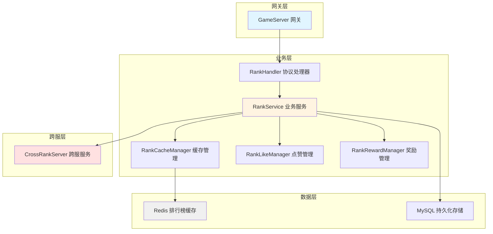
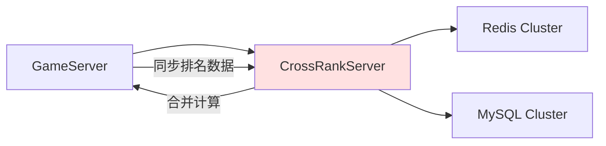

# 排行榜系统 - 服务端开发

## 服务端架构图



---

## 模块结构

```
GameServer/
├── RankModule/
│   ├── RankHandler.java              # 协议处理器
│   ├── RankService.java              # 业务逻辑服务
│   ├── RankCacheManager.java         # 排行榜缓存管理
│   ├── RankRewardManager.java        # 排名奖励管理
│   └── RankLikeManager.java          # 点赞管理
│
├── CrossRankServer/                  # 跨服排行榜服务
│   ├── CrossRankHandler.java
│   └── CrossRankService.java
│
└── DBTool/
    └── source_db/
        ├── CrossRankServer/          # 跨服数据库
        └── rank_tables.sql           # 数据库表结构
```

---

## 数据库设计

### 1. 排行榜配置表 (rank_config)

```sql
CREATE TABLE `rank_config` (
  `id` INT(11) NOT NULL AUTO_INCREMENT COMMENT '榜单ID',
  `rank_type` TINYINT(4) NOT NULL COMMENT '榜单类型：1=玩家，2=公会，3=活动组队',
  `rank_name` VARCHAR(50) NOT NULL COMMENT '榜单名称',
  `show_count` INT(11) DEFAULT 100 COMMENT '显示数量',
  `refresh_type` TINYINT(4) DEFAULT 1 COMMENT '刷新类型：1=实时，2=定时',
  `refresh_time` INT(11) DEFAULT 3600 COMMENT '刷新间隔（秒）',
  `detail_show_type` TINYINT(4) DEFAULT 1 COMMENT '详情展示类型：1=玩家，2=大臣',
  `is_cross` TINYINT(1) DEFAULT 0 COMMENT '是否跨服',
  `cross_server_type` TINYINT(4) DEFAULT 0 COMMENT '跨服类型：0=不跨服，1=同类型服，2=全服',
  `create_time` DATETIME DEFAULT CURRENT_TIMESTAMP,
  `update_time` DATETIME DEFAULT CURRENT_TIMESTAMP ON UPDATE CURRENT_TIMESTAMP,
  PRIMARY KEY (`id`),
  UNIQUE KEY `uk_rank_type` (`rank_type`)
) ENGINE=InnoDB DEFAULT CHARSET=utf8mb4 COMMENT='排行榜配置表';
```

### 2. 排名记录表 (rank_record)

```sql
CREATE TABLE `rank_record` (
  `id` BIGINT(20) NOT NULL AUTO_INCREMENT,
  `rank_type` TINYINT(4) NOT NULL COMMENT '榜单类型',
  `rank_key` BIGINT(20) NOT NULL COMMENT '排名主体ID',
  `source_id` BIGINT(20) DEFAULT 0 COMMENT '分数来源ID',
  `score` BIGINT(20) NOT NULL DEFAULT 0 COMMENT '分数',
  `rank` INT(11) DEFAULT 0 COMMENT '排名',
  `server_id` INT(11) DEFAULT 0 COMMENT '服务器ID',
  `create_time` DATETIME DEFAULT CURRENT_TIMESTAMP,
  `update_time` DATETIME DEFAULT CURRENT_TIMESTAMP ON UPDATE CURRENT_TIMESTAMP,
  PRIMARY KEY (`id`),
  UNIQUE KEY `uk_rank_type_key` (`rank_type`, `rank_key`),
  KEY `idx_rank_type_score` (`rank_type`, `score` DESC),
  KEY `idx_server_id` (`server_id`)
) ENGINE=InnoDB DEFAULT CHARSET=utf8mb4 COMMENT='排名记录表';
```

### 3. 点赞记录表 (rank_like_record)

```sql
CREATE TABLE `rank_like_record` (
  `id` BIGINT(20) NOT NULL AUTO_INCREMENT,
  `player_id` BIGINT(20) NOT NULL COMMENT '点赞者ID',
  `target_player_id` BIGINT(20) NOT NULL COMMENT '被点赞者ID',
  `rank_type` TINYINT(4) NOT NULL COMMENT '榜单类型',
  `like_time` DATETIME NOT NULL COMMENT '点赞时间',
  `like_date` DATE NOT NULL COMMENT '点赞日期',
  `server_id` INT(11) DEFAULT 0 COMMENT '服务器ID',
  PRIMARY KEY (`id`),
  UNIQUE KEY `uk_player_target_date` (`player_id`, `target_player_id`, `rank_type`, `like_date`),
  KEY `idx_player_date` (`player_id`, `like_date`),
  KEY `idx_target_date` (`target_player_id`, `like_date`)
) ENGINE=InnoDB DEFAULT CHARSET=utf8mb4 COMMENT='点赞记录表';
```

### 4. 点赞统计表 (rank_like_stat)

```sql
CREATE TABLE `rank_like_stat` (
  `id` BIGINT(20) NOT NULL AUTO_INCREMENT,
  `player_id` BIGINT(20) NOT NULL COMMENT '玩家ID',
  `rank_type` TINYINT(4) NOT NULL COMMENT '榜单类型',
  `like_count` INT(11) DEFAULT 0 COMMENT '被点赞次数',
  `like_score` BIGINT(20) DEFAULT 0 COMMENT '点赞积分',
  `like_date` DATE NOT NULL COMMENT '统计日期',
  `server_id` INT(11) DEFAULT 0 COMMENT '服务器ID',
  PRIMARY KEY (`id`),
  UNIQUE KEY `uk_player_rank_date` (`player_id`, `rank_type`, `like_date`),
  KEY `idx_rank_date` (`rank_type`, `like_date`)
) ENGINE=InnoDB DEFAULT CHARSET=utf8mb4 COMMENT='点赞统计表';
```

### 5. 排名奖励记录表 (rank_reward_record)

```sql
CREATE TABLE `rank_reward_record` (
  `id` BIGINT(20) NOT NULL AUTO_INCREMENT,
  `player_id` BIGINT(20) NOT NULL COMMENT '玩家ID',
  `rank_type` TINYINT(4) NOT NULL COMMENT '榜单类型',
  `rank` INT(11) NOT NULL COMMENT '排名',
  `reward_id` INT(11) NOT NULL COMMENT '奖励配置ID',
  `reward_time` DATETIME NOT NULL COMMENT '发放时间',
  `settlement_type` TINYINT(4) DEFAULT 1 COMMENT '结算类型：1=每日，2=每周，3=每月',
  `settlement_date` DATE NOT NULL COMMENT '结算日期',
  PRIMARY KEY (`id`),
  UNIQUE KEY `uk_player_type_date` (`player_id`, `rank_type`, `settlement_date`),
  KEY `idx_settlement_date` (`settlement_date`)
) ENGINE=InnoDB DEFAULT CHARSET=utf8mb4 COMMENT='排名奖励记录表';
```

---

## Redis 缓存设计

### Key 设计规范

```
rank:{rankType}:{serverId}                    # 单服排行榜数据 (Sorted Set)
rank:cross:{rankType}                         # 跨服排行榜数据 (Sorted Set)
rank:like:count:{playerId}:{date}             # 今日点赞次数 (String)
rank:like:record:{playerId}:{date}            # 今日点赞记录 (Set)
rank:like:score:{targetPlayerId}:{date}       # 被点赞积分 (String)
rank:cache:time:{rankType}                    # 缓存更新时间 (String)
rank:lock:{playerId}                          # 点赞分布式锁 (String)
```

### 数据结构详解

#### 1. 排行榜数据 (Sorted Set)

```
Key: rank:1:1001
Members:
  20001 -> 999999 (玩家ID -> 分数)
  20002 -> 888888
  20003 -> 777777

说明：
- 使用 Redis Sorted Set 存储排名数据
- Score 为分数，Member 为玩家ID
- 通过 ZREVRANK 获取排名（0-indexed，需+1）
```

#### 2. 点赞次数 (String)

```
Key: rank:like:count:20001:20260411
Value: 5 (今日已点赞5次)
TTL: 到次日零点

说明：
- 使用 String 类型存储点赞计数
- 每日零点自动过期
```

#### 3. 点赞记录 (Set)

```
Key: rank:like:record:20001:20260411
Members:
  1001:20002 (榜单ID:被点赞玩家ID)
  1001:20003
  1002:20004
TTL: 到次日零点

说明：
- 使用 Set 存储点赞记录，防止重复点赞
- 每日零点自动过期
```

---

## 核心业务逻辑

### 1. 获取排行榜列表

```java
/**
 * 获取排行榜列表
 */
public GS2GC_031_001_RetRankFixedBaseList getRankList(long rankFixedId, boolean isCross) {
    // 1. 获取榜单配置
    RankFixedConfig config = rankConfigDao.getRankFixedConfig(rankFixedId);
    if (config == null) {
        throw new BusinessException(ErrorCode.RANK_FIXED_NOT_FOUND);
    }

    // 2. 获取Redis Key
    String cacheKey = isCross ?
        String.format("rank:cross:%d", config.getRankId()) :
        String.format("rank:%d:%d", config.getRankId(), serverId);

    // 3. 从缓存获取排名数据
    Set<ZSetOperations.TypedTuple<String>> rankData =
        redisTemplate.opsForZSet().reverseRangeWithScores(cacheKey, 0, config.getShowCount() - 1);

    // 4. 缓存不存在，重新计算
    if (rankData == null || rankData.isEmpty()) {
        rankData = refreshRankCache(config.getRankId(), isCross);
    }

    // 5. 构建返回列表
    List<Rank_BaseItem> baseItemList = new ArrayList<>();
    int rank = 1;
    for (ZSetOperations.TypedTuple<String> tuple : rankData) {
        long key = Long.parseLong(tuple.getValue());
        long score = tuple.getScore().longValue();

        Rank_BaseItem item = new Rank_BaseItem();
        item.setKey(key);
        setSourceId(item, config.getRankType(), key);
        item.setScore(score);
        item.setRank(rank++);
        baseItemList.add(item);
    }

    // 6. 构建响应
    GS2GC_031_001_RetRankFixedBaseList response = new GS2GC_031_001_RetRankFixedBaseList();
    response.setBaseItemlist(baseItemList);
    return response;
}
```

### 2. 更新排名分数

```java
/**
 * 更新玩家排名分数
 */
@Transactional
public void updateRankScore(int rankType, long key, long sourceId, long score) {
    // 1. 获取榜单配置
    RankConfig config = rankConfigDao.getRankConfig(rankType);
    if (config == null) {
        return;
    }

    // 2. 更新数据库
    RankRecord record = new RankRecord();
    record.setRankType(rankType);
    record.setRankKey(key);
    record.setSourceId(sourceId);
    record.setScore(score);
    record.setServerId(serverId);
    rankRecordDao.insertOrUpdate(record);

    // 3. 更新Redis缓存
    String cacheKey = String.format("rank:%d:%d", rankType, serverId);

    // 获取旧排名
    Long oldRank = redisTemplate.opsForZSet().reverseRank(cacheKey, String.valueOf(key));

    // 更新分数
    redisTemplate.opsForZSet().add(cacheKey, String.valueOf(key), score);

    // 获取新排名
    Long newRank = redisTemplate.opsForZSet().reverseRank(cacheKey, String.valueOf(key));

    // 4. 判断是否需要推送排名变化
    if (newRank != null && newRank <= 100) {
        if (oldRank == null || oldRank > 100 || newRank < oldRank) {
            pushRankChange(key, rankType, oldRank, newRank);
        }
    }

    // 5. 如果是跨服榜，更新跨服缓存
    if (config.isCross()) {
        updateCrossRankScore(rankType, key, score);
    }
}
```

### 3. 点赞逻辑

```java
/**
 * 点赞
 */
@Transactional
public RankFixed_LikeResult like(long playerId, long rankFixedId, boolean isCross) {
    // 1. 获取榜单配置
    RankFixedConfig config = rankConfigDao.getRankFixedConfig(rankFixedId);
    if (config == null) {
        throw new BusinessException(ErrorCode.RANK_FIXED_NOT_FOUND);
    }

    // 2. 获取排名第一的玩家
    String cacheKey = isCross ?
        String.format("rank:cross:%d", config.getRankId()) :
        String.format("rank:%d:%d", config.getRankId(), serverId);

    Set<String> topPlayer = redisTemplate.opsForZSet().reverseRange(cacheKey, 0, 0);
    if (topPlayer == null || topPlayer.isEmpty()) {
        throw new BusinessException(ErrorCode.RANK_FIXED_NO_LIKE_TARGET);
    }

    long targetPlayerId = Long.parseLong(topPlayer.iterator().next());

    // 3. 不能给自己点赞
    if (playerId == targetPlayerId) {
        // 静默处理，返回空结果
        return null;
    }

    // 4. 检查今日点赞次数
    String countKey = String.format("rank:like:count:%d:%s", playerId, getTodayDate());
    Long todayCount = redisTemplate.opsForValue().increment(countKey);
    if (todayCount == 1) {
        redisTemplate.expire(countKey, getSecondsToTomorrow(), TimeUnit.SECONDS);
    }
    if (todayCount > config.getMaxLikeCount()) {
        throw new BusinessException(ErrorCode.RANK_FIXED_LIKE_COUNT_NOT_ENOUGH);
    }

    // 5. 检查是否已点赞
    String recordKey = String.format("rank:like:record:%d:%s", playerId, getTodayDate());
    String recordValue = String.format("%d:%d", rankFixedId, targetPlayerId);
    Boolean isMember = redisTemplate.opsForSet().isMember(recordKey, recordValue);
    if (isMember) {
        // 已点赞，静默处理
        return null;
    }

    // 6. 记录点赞
    redisTemplate.opsForSet().add(recordKey, recordValue);
    if (redisTemplate.getExpire(recordKey) < 0) {
        redisTemplate.expire(recordKey, getSecondsToTomorrow(), TimeUnit.SECONDS);
    }

    // 7. 更新被点赞积分
    String scoreKey = String.format("rank:like:score:%d:%s", targetPlayerId, getTodayDate());
    long likeScore = redisTemplate.opsForValue().increment(scoreKey, 1);
    if (redisTemplate.getExpire(scoreKey) < 0) {
        redisTemplate.expire(scoreKey, getSecondsToTomorrow(), TimeUnit.SECONDS);
    }

    // 8. 记录点赞日志
    RankLikeRecord likeRecord = new RankLikeRecord();
    likeRecord.setPlayerId(playerId);
    likeRecord.setTargetPlayerId(targetPlayerId);
    likeRecord.setRankType(config.getRankId());
    likeRecord.setLikeTime(new Date());
    likeRecord.setLikeDate(getTodayDate());
    rankLikeRecordDao.insert(likeRecord);

    // 9. 发放点赞奖励
    List<ItemInfo> rewardList = giveLikeReward(playerId, config.getLikeRewardId());

    // 10. 构建返回结果
    RankFixed_LikeResult result = new RankFixed_LikeResult();
    result.setRankFixedId(rankFixedId);
    result.setInfo(getRankItem(cacheKey, targetPlayerId));
    result.setLikeScore(likeScore);
    result.setRewardItemList(rewardList);

    return result;
}
```

### 4. 一键点赞

```java
/**
 * 一键点赞
 */
public List<RankFixed_LikeResult> likeAll(long playerId, List<Long> rankFixedIdList, boolean isCross) {
    List<RankFixed_LikeResult> results = new ArrayList<>();

    for (Long rankFixedId : rankFixedIdList) {
        try {
            RankFixed_LikeResult result = like(playerId, rankFixedId, isCross);
            if (result != null) {
                results.add(result);
            }
        } catch (BusinessException e) {
            // 忽略单个榜单的点赞失败
            log.warn("点赞失败 rankFixedId={}, error={}", rankFixedId, e.getMessage());
        }
    }

    return results;
}
```

### 5. 刷新缓存

```java
/**
 * 刷新排行榜缓存
 */
public Set<ZSetOperations.TypedTuple<String>> refreshRankCache(int rankType, boolean isCross) {
    String cacheKey = isCross ?
        String.format("rank:cross:%d", rankType) :
        String.format("rank:%d:%d", rankType, serverId);

    // 1. 清除旧缓存
    redisTemplate.delete(cacheKey);

    // 2. 从数据库查询排名数据
    List<RankRecord> recordList;
    if (isCross) {
        recordList = rankRecordDao.getCrossRankTop(rankType, 100);
    } else {
        recordList = rankRecordDao.getRankTop(rankType, serverId, 100);
    }

    // 3. 写入新缓存
    for (RankRecord record : recordList) {
        redisTemplate.opsForZSet().add(cacheKey,
            String.valueOf(record.getRankKey()),
            record.getScore());
    }

    // 4. 设置缓存过期时间
    redisTemplate.expire(cacheKey, 1, TimeUnit.HOURS);

    // 5. 更新缓存时间
    String timeKey = String.format("rank:cache:time:%d", rankType);
    redisTemplate.opsForValue().set(timeKey, String.valueOf(System.currentTimeMillis()));

    // 6. 返回结果
    return redisTemplate.opsForZSet().reverseRangeWithScores(cacheKey, 0, 99);
}
```

---

## 定时任务

### 1. 刷新排行榜缓存

```java
/**
 * 每小时刷新排行榜缓存
 */
@Scheduled(cron = "0 0 * * * ?")
public void refreshRankCacheTask() {
    log.info("开始刷新排行榜缓存");

    List<RankConfig> configList = rankConfigDao.getAllRankConfigs();

    for (RankConfig config : configList) {
        try {
            // 刷新单服榜
            if (!config.isCross()) {
                refreshRankCache(config.getId(), false);
            }

            // 刷新跨服榜
            if (config.isCross()) {
                refreshRankCache(config.getId(), true);
            }
        } catch (Exception e) {
            log.error("刷新排行榜缓存失败 rankType={}", config.getId(), e);
        }
    }

    log.info("排行榜缓存刷新完成");
}
```

### 2. 发放排名奖励

```java
/**
 * 每日零点发放排名奖励
 */
@Scheduled(cron = "0 0 0 * * ?")
public void distributeRankRewardTask() {
    log.info("开始发放排名奖励");

    List<RankFixedConfig> configList = rankConfigDao.getAllRankFixedConfigs();

    for (RankFixedConfig config : configList) {
        if (config.getSettlementType() != 1) { // 非每日结算
            continue;
        }

        try {
            distributeRankReward(config);
        } catch (Exception e) {
            log.error("发放排名奖励失败 rankFixedId={}", config.getId(), e);
        }
    }

    log.info("排名奖励发放完成");
}

/**
 * 发放排名奖励
 */
private void distributeRankReward(RankFixedConfig config) {
    String cacheKey = String.format("rank:%d:%d", config.getRankId(), serverId);

    // 获取排名列表
    Set<ZSetOperations.TypedTuple<String>> rankData =
        redisTemplate.opsForZSet().reverseRangeWithScores(cacheKey, 0, config.getShowCount() - 1);

    if (rankData == null || rankData.isEmpty()) {
        return;
    }

    // 遍历发放奖励
    int rank = 1;
    for (ZSetOperations.TypedTuple<String> tuple : rankData) {
        long playerId = Long.parseLong(tuple.getValue());

        // 获取奖励配置
        List<RankRewardConfig> rewardConfigs = rankRewardDao.getRewardConfigs(
            config.getRankId(), rank);

        for (RankRewardConfig rewardConfig : rewardConfigs) {
            // 发送邮件奖励
            sendMailReward(playerId, rewardConfig);

            // 记录发放日志
            saveRewardRecord(playerId, config, rank, rewardConfig);
        }

        rank++;
    }
}
```

### 3. 清理过期数据

```java
/**
 * 每周清理过期数据
 */
@Scheduled(cron = "0 0 2 ? * MON")
public void cleanExpiredDataTask() {
    log.info("开始清理过期数据");

    // 清理30天前的点赞记录
    Date expireDate = DateUtils.addDays(new Date(), -30);
    int deleted = rankLikeRecordDao.deleteByDateBefore(expireDate);
    log.info("清理点赞记录 {} 条", deleted);

    // 清理过期奖励记录
    deleted = rankRewardRecordDao.deleteByDateBefore(expireDate);
    log.info("清理奖励记录 {} 条", deleted);

    log.info("过期数据清理完成");
}
```

---

## 跨服排行榜

### 架构设计



### 跨服数据同步

```java
/**
 * 同步排名数据到跨服
 */
public void syncToCrossRank(int rankType, long key, long score) {
    CrossRankSyncRequest request = new CrossRankSyncRequest();
    request.setRankType(rankType);
    request.setKey(key);
    request.setScore(score);
    request.setServerId(serverId);
    request.setTimestamp(System.currentTimeMillis());

    // 发送到跨服服务
    crossRankClient.syncRankData(request);
}

/**
 * 接收跨服排名数据
 */
public void receiveCrossRankData(CrossRankSyncRequest request) {
    // 验证数据有效性
    if (System.currentTimeMillis() - request.getTimestamp() > 60000) {
        log.warn("跨服排名数据过期: {}", request);
        return;
    }

    // 更新跨服缓存
    String cacheKey = String.format("rank:cross:%d", request.getRankType());
    redisTemplate.opsForZSet().add(cacheKey,
        String.format("%d:%d", request.getServerId(), request.getKey()),
        request.getScore());
}
```

---

## 性能优化

### 1. Redis 使用优化

```java
// 使用 Pipeline 批量操作
public void batchUpdateRank(List<RankRecord> records) {
    redisTemplate.executePipelined((RedisCallback<Object>) connection -> {
        for (RankRecord record : records) {
            String key = String.format("rank:%d:%d", record.getRankType(), serverId);
            connection.zAdd(key.getBytes(), record.getScore(),
                String.valueOf(record.getRankKey()).getBytes());
        }
        return null;
    });
}
```

### 2. 数据库优化

| 优化项 | 说明 |
|-------|------|
| 索引优化 | `idx_rank_type_score` 加速排名查询 |
| 分库分表 | 按服务器ID分表 |
| 定期归档 | 历史数据归档到历史表 |
| 读写分离 | 主从复制，读从库 |

### 3. 缓存策略

| 策略 | 说明 |
|-----|------|
| 多级缓存 | 本地缓存 + Redis缓存 |
| 预加载 | 服务启动时预加载热门榜单 |
| 延迟更新 | 非实时榜单使用延迟更新策略 |

---

## 监控告警

### 关键指标

| 指标名称 | 说明 | 告警阈值 |
|---------|------|---------|
| rank_request_qps | 排行榜请求QPS | > 1000 |
| rank_cache_hit_rate | 缓存命中率 | < 80% |
| rank_update_delay | 排名更新延迟 | > 10s |
| like_request_fail | 点赞失败次数 | > 100/min |

---

## 注意事项

1. **并发控制**：点赞操作需要加分布式锁
2. **数据一致性**：数据库和缓存需要保持一致
3. **性能监控**：关注排行榜接口响应时间
4. **容量规划**：预评估排行榜数据量，合理分库分表

---

## 文件路径

| 文件类型 | 路径 |
|---------|------|
| 协议处理器 | `game_server/ServerProtocol/src/GC2GS/p031_RankOp/` |
| 跨服协议 | `game_server/ServerProtocol/src/NP2CRS_R/p001_CrossRankOp/` |
| 数据库配置 | `game_server/DBTool/source_db/CrossRankServer/` |

---

*文档更新时间: 2026-04-11*
*文档维护者: 天天 (AI助手)*
