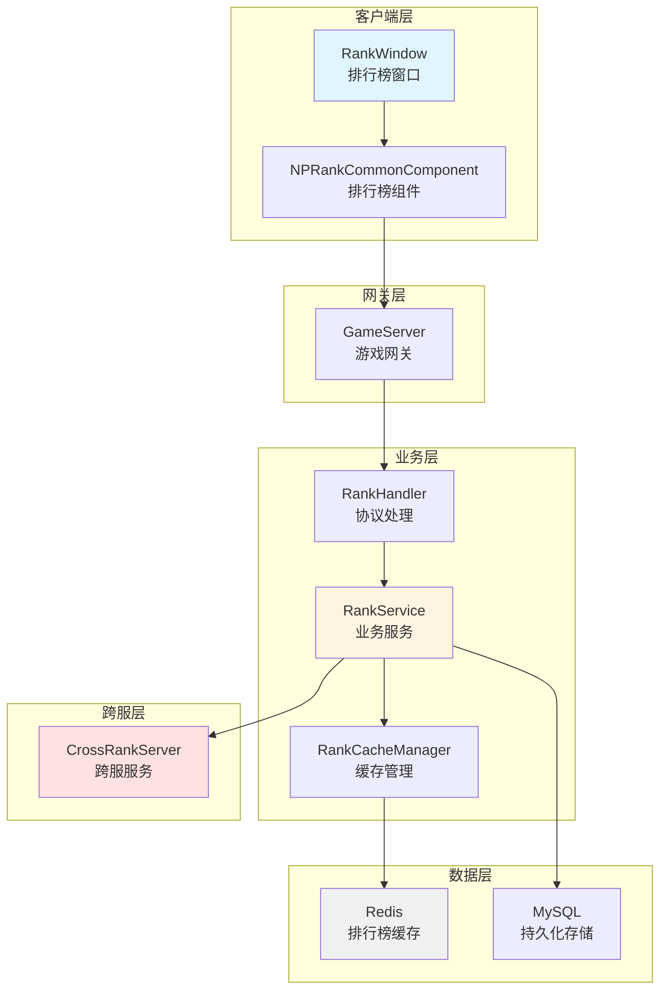
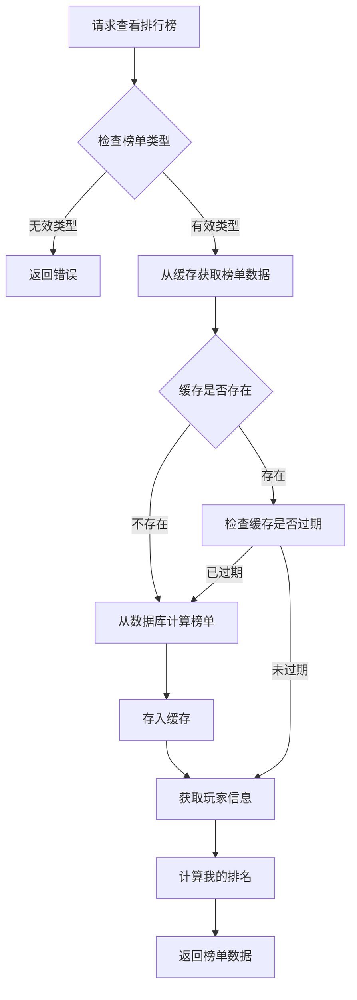
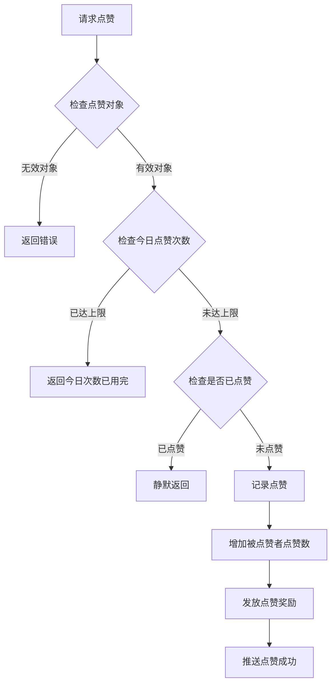
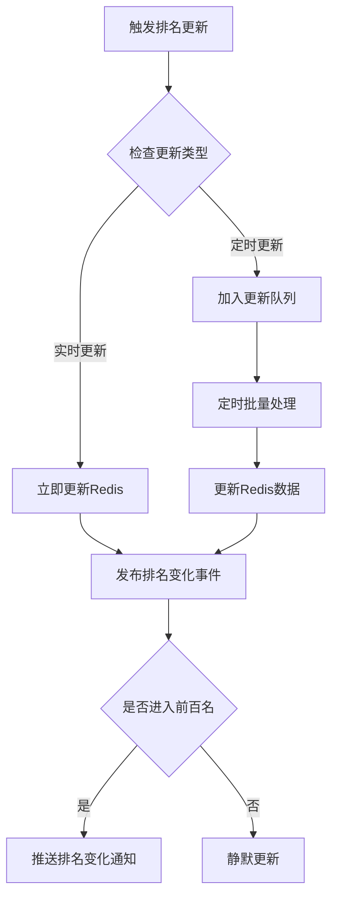
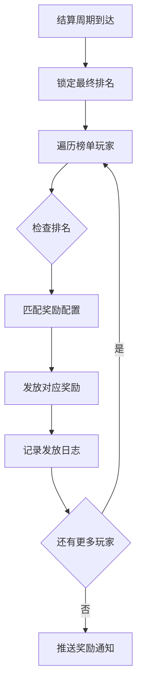
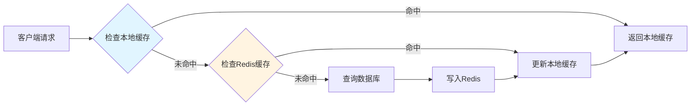
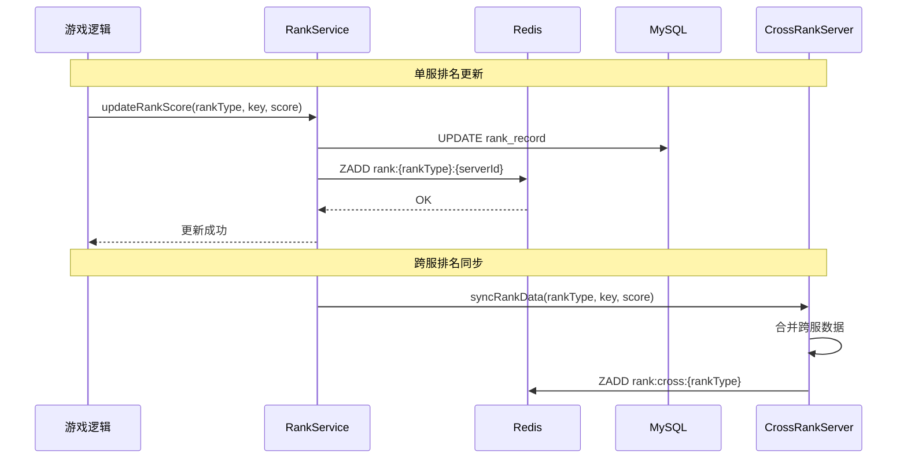
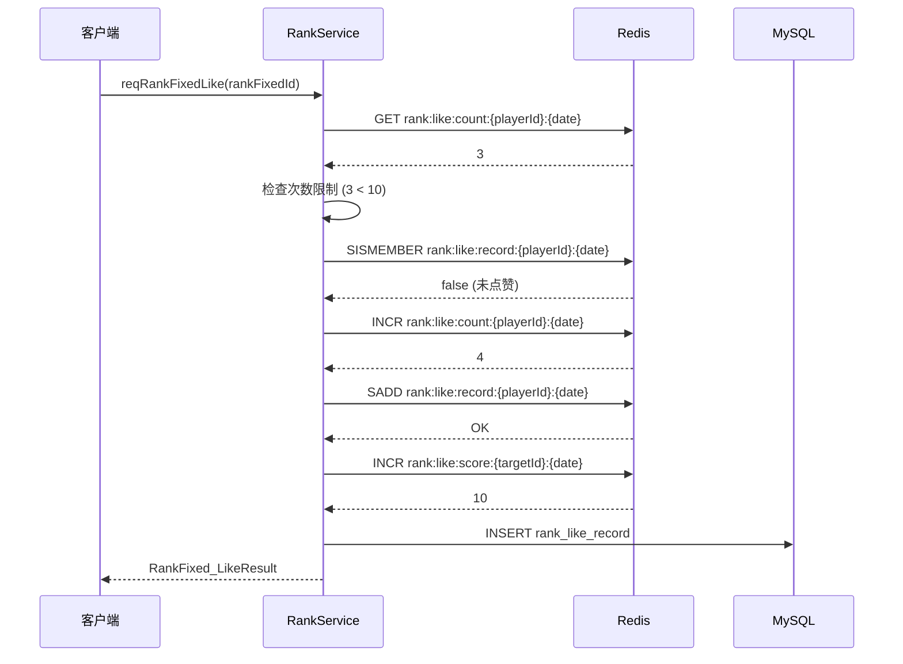
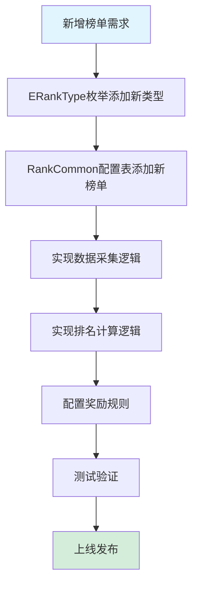

# 排行榜模块完整说明

## 一、模块概述

### 1.1 业务背景

排行榜模块是 K2C 游戏的竞技展示系统，负责管理各类游戏排名数据。玩家可以通过排行榜查看自己在服务器中的排名位置，与其他玩家进行比较。排行榜不仅是展示玩家实力的窗口，也是激励玩家追求更高目标的重要机制。

### 1.2 目标用户

- **所有游戏玩家**：每位玩家都可以查看排行榜
- **竞技型玩家**：追求高排名的玩家群体
- **社交型玩家**：关注好友排名的玩家群体

### 1.3 核心价值

1. **实力展示**：直观展示玩家在服务器中的位置
2. **竞争激励**：激励玩家追求更高排名
3. **社交互动**：支持点赞等社交功能
4. **奖励发放**：排名奖励激励玩家参与

### 1.4 系统架构



### 1.5 技术栈

| 技术组件 | 说明 | 用途 |
|---------|------|------|
| Redis Sorted Set | 有序集合 | 排行榜数据存储 |
| Redis String | 字符串 | 点赞计数 |
| Redis Set | 集合 | 点赞记录 |
| MySQL | 关系数据库 | 持久化存储 |
| Protobuf | 序列化 | 协议传输 |
| Scheduled Task | 定时任务 | 缓存刷新、奖励发放 |

---

## 二、功能清单

### 2.1 排行榜展示功能

| 功能名称 | 功能描述 | 用户价值 |
|---------|---------|---------|
| 查看排名 | 查看各类榜单的排名列表 | 了解服务器排名情况 |
| 我的排名 | 查看自己在榜单中的位置 | 了解自己的位置 |
| 榜单切换 | 切换不同类型的榜单 | 查看多维度排名 |

### 2.2 排行榜类型功能

| 榜单类型 | 枚举值 | 功能描述 | 用户价值 |
|---------|-------|---------|---------|
| 玩家榜 | PLAYER=1 | 按玩家综合实力排名 | 展示玩家实力排行 |
| 公会榜 | GUILD=2 | 按公会总战力排名 | 展示公会排行 |
| 活动组队榜 | ACTIVITY_TEAM=3 | 按活动组队积分排名 | 展示活动排行 |

### 2.3 社交互动功能

| 功能名称 | 功能描述 | 用户价值 |
|---------|---------|---------|
| 点赞功能 | 给榜单榜首点赞 | 社交互动 |
| 一键点赞 | 批量点赞多个榜单榜首 | 快速互动 |
| 点赞奖励 | 点赞获得奖励 | 激励互动 |

---

## 三、业务流程详解

### 3.1 查看排行榜流程



**详细步骤说明**：

1. **类型验证**
   - 验证榜单类型是否有效
   - 获取榜单配置信息

2. **缓存查询**
   - 从Redis获取缓存数据
   - 检查缓存是否过期

3. **数据获取**
   - 缓存存在：直接使用缓存数据
   - 缓存不存在：计算并生成榜单

4. **玩家位置**
   - 计算玩家在榜单中的排名
   - 返回完整榜单数据

### 3.2 点赞流程



**详细步骤说明**：

1. **对象验证**
   - 验证被点赞玩家是否存在（榜单榜首）
   - 验证是否可以点赞自己（不允许）

2. **次数检查**
   - 检查今日点赞次数是否已达上限
   - 记录点赞计数

3. **重复检查**
   - 检查是否已经给该玩家点赞
   - 避免重复点赞

4. **执行点赞**
   - 更新点赞记录
   - 更新被点赞者的点赞数
   - 发放点赞奖励

### 3.3 排名更新流程



### 3.4 榜单奖励发放流程



---

## 四、关键规则

### 4.1 排名规则

1. **排名计算**
   - 实时榜单：分数变化立即更新排名
   - 定时榜单：定时计算并更新排名

2. **排名显示**
   - 显示前100名玩家信息
   - 显示玩家自己的排名位置

3. **同名处理**
   - 分数相同时按达到时间排序
   - 先达到者排名靠前

### 4.2 点赞规则

1. **次数限制**
   - 每日点赞次数有上限
   - 每日零点重置次数

2. **对象限制**
   - 点赞对象为榜单榜首玩家
   - 不能给自己点赞
   - 每个榜单每天只能点赞一次

3. **奖励规则**
   - 点赞者可获得奖励
   - 奖励每日有上限

### 4.3 缓存规则

1. **缓存时间**
   - 榜单数据缓存1小时
   - 点赞记录每日重置

2. **缓存更新**
   - 分数变化时更新缓存
   - 定时刷新榜单数据

---

## 五、用户故事

### 5.1 查看排行榜玩家故事

> 作为一名普通玩家，我经常打开排行榜查看自己的综合实力排名。今天我发现自己从第50名上升到了第48名，这让我很有成就感。我看到榜首的玩家战力高出我很多，这激励我继续提升实力。

### 5.2 点赞互动玩家故事

> 作为一名社交型玩家，我每天都会给排行榜上的榜首玩家点赞。今天我把每日点赞次数都用完了，获得了一些钻石奖励。被点赞的玩家也会收到通知，这是一种很好的社交方式。

### 5.3 追求排名玩家故事

> 作为一名竞技型玩家，我一直在冲击玩家榜前十。这周我终于打进了前十名，系统给我发了排名奖励。我的名字出现在排行榜上，其他玩家都能看到，这种感觉太棒了！

---

## 六、示例

### 6.1 玩家榜排名示例

**输入数据**：
- 榜单类型：PLAYER（玩家榜）
- 榜单实例ID：1001

**榜单数据**：
```
排名 | 玩家名称   | 战力   | 点赞数
-----|-----------|--------|-------
 1   | 龙王      | 999999 | 520
 2   | 剑神      | 888888 | 380
 3   | 法圣      | 777777 | 290
 4   | 弓王      | 666666 | 210
 5   | 战神      | 555555 | 150
...
48   | 我的角色  | 123456 | 28
...
100  | 新手上路  | 50000  | 5

我的排名：48
我的战力：123456
```

### 6.2 点赞示例

**输入数据**：
- 玩家ID：20001
- 目标玩家ID（榜首）：20002
- 榜单实例ID：1001

**点赞前状态**：
```
今日点赞次数：3/10
榜首玩家点赞数：380
```

**点赞操作**：
- 点赞第4次

**点赞后状态**：
```
今日点赞次数：4/10
榜首玩家点赞数：381
获得奖励：钻石x10
```

### 6.3 排名奖励示例

**奖励配置**：
```json
{
  "rank_type": "PLAYER",
  "rewards": [
    {"min_rank": 1, "max_rank": 1, "items": [{"itemId": 1001, "count": 1000}]},
    {"min_rank": 2, "max_rank": 3, "items": [{"itemId": 1001, "count": 500}]},
    {"min_rank": 4, "max_rank": 10, "items": [{"itemId": 1001, "count": 300}]},
    {"min_rank": 11, "max_rank": 50, "items": [{"itemId": 1001, "count": 100}]},
    {"min_rank": 51, "max_rank": 100, "items": [{"itemId": 1001, "count": 50}]}
  ]
}
```

**玩家排名与奖励**：
```
玩家A：第1名 -> 钻石x1000
玩家B：第2名 -> 钻石x500
玩家C：第5名 -> 钻石x300
玩家D：第30名 -> 钻石x100
玩家E：第80名 -> 钻石x50
```

---

## 七、接口定义

### 7.1 客户端接口

```csharp
/// <summary>
/// 排行榜组件接口
/// </summary>
public interface IRankComponent
{
    /// <summary>
    /// 请求排行榜列表
    /// </summary>
    void reqRankFixedBaseList(long rankFixedId, Action<GS2GC_031_001_RetRankFixedBaseList> callback);

    /// <summary>
    /// 请求点赞
    /// </summary>
    void reqRankFixedLike(long rankFixedId, Action<RankFixed_LikeResult> callback);

    /// <summary>
    /// 请求一键点赞
    /// </summary>
    void reqRankFixedAKeyLike(List<long> rankFixedIdList, Action<List<RankFixed_LikeResult>> callback);

    /// <summary>
    /// 根据排名查询信息
    /// </summary>
    void reqInRankPlayerInfoByRank(long rankFixedId, int rank, Action<Rank_BaseItem> callback);

    /// <summary>
    /// 根据ID查询排名
    /// </summary>
    void reqInRankPlayerInfoByCid(long rankFixedId, long cid, Action<Rank_BaseItem> callback);

    /// <summary>
    /// 刷新红点
    /// </summary>
    void refreshRedTip();
}
```

### 7.2 服务端接口

```java
/**
 * 排行榜服务接口
 */
public interface IRankService {

    /**
     * 获取排行榜列表
     */
    GS2GC_031_001_RetRankFixedBaseList getRankList(long rankFixedId, boolean isCross);

    /**
     * 更新排名分数
     */
    void updateRankScore(int rankType, long key, long sourceId, long score);

    /**
     * 点赞
     */
    RankFixed_LikeResult like(long playerId, long rankFixedId, boolean isCross);

    /**
     * 一键点赞
     */
    List<RankFixed_LikeResult> likeAll(long playerId, List<Long> rankFixedIdList, boolean isCross);

    /**
     * 刷新缓存
     */
    void refreshRankCache(int rankType, boolean isCross);

    /**
     * 发放排名奖励
     */
    void distributeRankReward(RankFixedConfig config);
}
```

---

## 八、性能指标

### 8.1 关键指标

| 指标名称 | 目标值 | 说明 |
|---------|-------|------|
| 排行榜查询响应时间 | < 100ms | P99延迟 |
| 点赞操作响应时间 | < 50ms | P99延迟 |
| 缓存命中率 | > 90% | Redis缓存命中率 |
| 并发处理能力 | > 1000 QPS | 单服支持 |
| 数据一致性延迟 | < 1s | 数据库与缓存同步 |

### 8.2 性能优化策略

#### 8.2.1 缓存优化



#### 8.2.2 查询优化

- 使用 Redis Pipeline 批量查询
- 分页查询减少数据传输量
- 异步加载玩家详细信息

#### 8.2.3 写入优化

- 批量更新排名数据
- 延迟写入数据库
- 使用消息队列异步处理

---

## 九、数据流图

### 9.1 排名更新数据流



### 9.2 点赞数据流



---

## 十、常见问题 FAQ

### Q1: 排行榜数据多久更新一次？

**A**: 根据榜单类型不同：
- **实时榜单**：分数变化立即更新排名
- **定时榜单**：每小时刷新一次
- **缓存时间**：Redis 缓存 1 小时

### Q2: 点赞次数什么时候重置？

**A**: 每日零点自动重置。重置内容包括：
- 今日点赞次数
- 今日点赞记录
- 今日被点赞积分

### Q3: 如何处理分数相同的情况？

**A**: 采用以下规则：
1. 分数相同时，先达到该分数的玩家排名靠前
2. 使用 Redis Sorted Set 的 Member 包含时间戳
3. Member 格式：`{playerId}:{timestamp}`

### Q4: 跨服排行榜如何实现？

**A**: 实现步骤：
1. 各服 GameServer 同步排名数据到 CrossRankServer
2. CrossRankServer 合并所有服的数据
3. 重新计算跨服排名
4. 写入跨服 Redis 缓存
5. 客户端请求时返回跨服数据

### Q5: 排名奖励如何发放？

**A**: 奖励发放流程：
1. 每日零点结算昨日排名
2. 锁定最终排名快照
3. 根据排名匹配奖励配置
4. 通过邮件系统发放奖励
5. 记录发放日志

### Q6: 如何防止刷点赞？

**A**: 防刷机制：
- 每日点赞次数限制
- 同一榜单不能重复点赞
- 不能给自己点赞
- 异常行为检测和封禁

---

## 十一、扩展性设计

### 11.1 新增榜单类型



### 11.2 水平扩展

| 扩展维度 | 扩展方案 | 说明 |
|---------|---------|------|
| 服务器数量 | 按服分库 | 每个服务器独立数据库 |
| 榜单数量 | 分表存储 | 按榜单类型分表 |
| Redis 容量 | Redis Cluster | 分布式缓存集群 |
| 查询性能 | 读写分离 | 主从复制，读从库 |

---

## 十二、监控与告警

### 12.1 监控指标

| 指标分类 | 监控项 | 说明 |
|---------|-------|------|
| 业务指标 | 日活用户数 | 查看排行榜的用户数 |
| 业务指标 | 点赞次数 | 每日点赞总次数 |
| 业务指标 | 奖励发放数 | 每日奖励发放数量 |
| 技术指标 | 接口响应时间 | P50/P95/P99 延迟 |
| 技术指标 | 错误率 | 接口错误比例 |
| 技术指标 | 缓存命中率 | Redis 命中率 |
| 资源指标 | CPU 使用率 | 服务器 CPU 负载 |
| 资源指标 | 内存使用率 | Redis 内存占用 |
| 资源指标 | 网络带宽 | 数据传输量 |

### 12.2 告警规则

| 告警名称 | 触发条件 | 告警级别 | 处理建议 |
|---------|---------|---------|---------|
| 排行榜接口超时 | P99 > 500ms | 警告 | 检查缓存、数据库 |
| 点赞失败率过高 | 错误率 > 5% | 严重 | 检查业务逻辑 |
| 缓存命中率低 | 命中率 < 80% | 警告 | 优化缓存策略 |
| Redis 内存不足 | 使用率 > 80% | 严重 | 扩容或清理 |
| 数据库慢查询 | 慢查询 > 1s | 警告 | 优化索引 |

---

## 十三、安全设计

### 13.1 数据安全

- 敏感数据加密存储
- 排名数据定期备份
- 数据库访问权限控制

### 13.2 接口安全

- 请求频率限制（Rate Limiting）
- 参数合法性校验
- 防重复提交

### 13.3 业务安全

- 防刷机制
- 异常行为检测
- 数据一致性校验

---

## 十四、版本历史

| 版本号 | 更新时间 | 更新内容 | 更新人 |
|-------|---------|---------|-------|
| 1.0.0 | 2026-03-01 | 初始版本，支持基础排行榜功能 | 系统生成 |
| 1.1.0 | 2026-03-15 | 新增点赞功能 | 系统生成 |
| 1.2.0 | 2026-04-01 | 新增跨服排行榜 | 系统生成 |
| 1.3.0 | 2026-04-11 | 深度完善文档，修正榜单类型枚举，补充架构图和性能指标 | 天天 |

---

*文档更新时间: 2026-04-11*
*文档维护者: 天天 (AI助手)*
