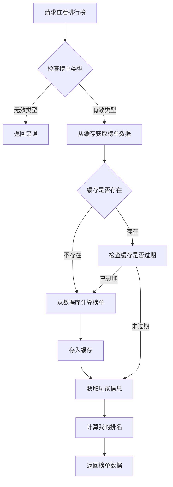
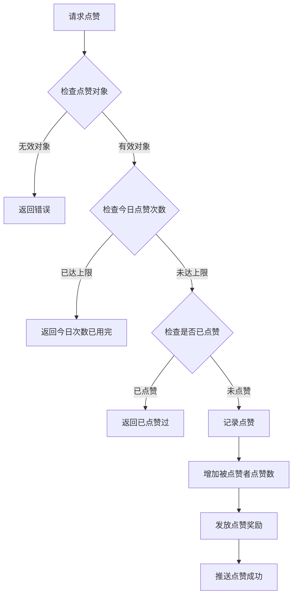
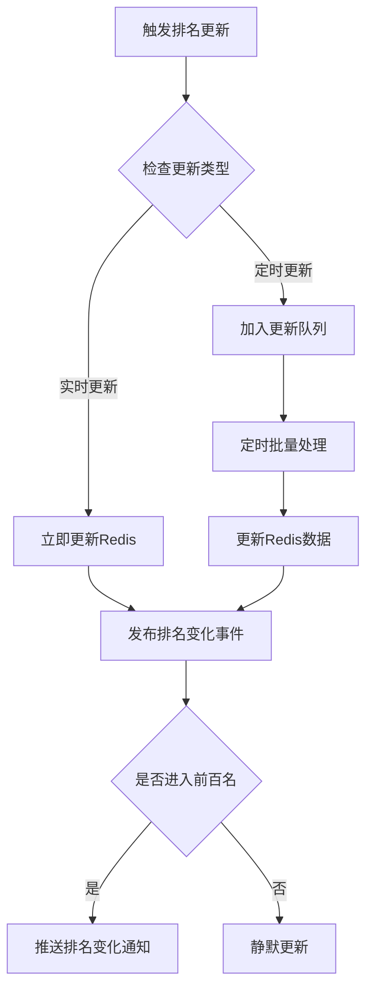
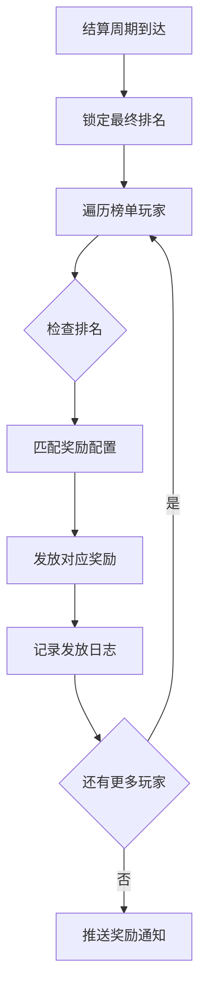

# 排行榜模块完整说明

## 一、模块概述

### 1.1 业务背景

排行榜模块是 K2C 游戏的竞技展示系统，负责管理各类游戏排名数据。玩家可以通过排行榜查看自己在服务器中的排名位置，与其他玩家进行比较。排行榜不仅是展示玩家实力的窗口，也是激励玩家追求更高目标的重要机制。

### 1.2 目标用户

- **所有游戏玩家**：每位玩家都可以查看排行榜
- **竞技型玩家**：追求高排名的玩家群体
- **社交型玩家**：关注好友排名的玩家群体

### 1.3 核心价值

1. **实力展示**：直观展示玩家在服务器中的位置
2. **竞争激励**：激励玩家追求更高排名
3. **社交互动**：支持点赞等社交功能
4. **奖励发放**：排名奖励激励玩家参与

---

## 二、功能清单

### 2.1 排行榜展示功能

| 功能名称 | 功能描述 | 用户价值 |
|---------|---------|---------|
| 查看排名 | 查看各类榜单的排名列表 | 了解服务器排名情况 |
| 我的排名 | 查看自己在榜单中的位置 | 了解自己的位置 |
| 榜单切换 | 切换不同类型的榜单 | 查看多维度排名 |

### 2.2 排行榜类型功能

| 功能名称 | 功能描述 | 用户价值 |
|---------|---------|---------|
| 战力榜 | 按玩家战力排名 | 展示实力排行 |
| 等级榜 | 按玩家等级排名 | 展示成长排行 |
| 竞技榜 | 按竞技积分排名 | 展示PVP排行 |
| 公会榜 | 按公会战力排名 | 展示公会排行 |
| 爬塔榜 | 按爬塔层数排名 | 展示PVE排行 |

### 2.3 社交互动功能

| 功能名称 | 功能描述 | 用户价值 |
|---------|---------|---------|
| 点赞功能 | 给其他玩家点赞 | 社交互动 |
| 一键点赞 | 批量点赞榜单玩家 | 快速互动 |
| 点赞奖励 | 点赞获得奖励 | 激励互动 |

---

## 三、业务流程详解

### 3.1 查看排行榜流程



**详细步骤说明**：

1. **类型验证**
   - 验证榜单类型是否有效
   - 获取榜单配置信息

2. **缓存查询**
   - 从Redis获取缓存数据
   - 检查缓存是否过期

3. **数据获取**
   - 缓存存在：直接使用缓存数据
   - 缓存不存在：计算并生成榜单

4. **玩家位置**
   - 计算玩家在榜单中的排名
   - 返回完整榜单数据

### 3.2 点赞流程



**详细步骤说明**：

1. **对象验证**
   - 验证被点赞玩家是否存在
   - 验证是否可以点赞自己（通常不可以）

2. **次数检查**
   - 检查今日点赞次数是否已达上限
   - 记录点赞计数

3. **重复检查**
   - 检查是否已经给该玩家点赞
   - 避免重复点赞

4. **执行点赞**
   - 更新点赞记录
   - 更新被点赞者的点赞数
   - 发放点赞奖励

### 3.3 排名更新流程



### 3.4 榜单奖励发放流程



---

## 四、关键规则

### 4.1 排名规则

1. **排名计算**
   - 实时榜单：分数变化立即更新排名
   - 定时榜单：定时计算并更新排名

2. **排名显示**
   - 显示前100名玩家信息
   - 显示玩家自己的排名位置

3. **同名处理**
   - 分数相同时按达到时间排序
   - 先达到者排名靠前

### 4.2 点赞规则

1. **次数限制**
   - 每日点赞次数有上限
   - 每日零点重置次数

2. **对象限制**
   - 不能给自己点赞
   - 每人每天只能点赞一次

3. **奖励规则**
   - 点赞者和被点赞者都可获得奖励
   - 奖励每日有上限

### 4.3 缓存规则

1. **缓存时间**
   - 榜单数据缓存1小时
   - 点赞记录每日重置

2. **缓存更新**
   - 分数变化时更新缓存
   - 定时刷新榜单数据

---

## 五、用户故事

### 5.1 查看排行榜玩家故事

> 作为一名普通玩家，我经常打开排行榜查看自己的战力排名。今天我发现自己从第50名上升到了第48名，这让我很有成就感。我看到榜首的玩家战力高出我很多，这激励我继续提升实力。

### 5.2 点赞互动玩家故事

> 作为一名社交型玩家，我每天都会给排行榜上的玩家点赞。今天我把每日点赞次数都用完了，获得了一些钻石奖励。被点赞的玩家也会收到通知，这是一种很好的社交方式。

### 5.3 追求排名玩家故事

> 作为一名竞技型玩家，我一直在冲击竞技榜前十。这周我终于打进了前十名，系统给我发了排名奖励。我的名字出现在排行榜上，其他玩家都能看到，这种感觉太棒了！

---

## 六、示例

### 6.1 战力榜排名示例

**输入数据**：
- 榜单类型：POWER（战力榜）

**榜单数据**：
```
排名 | 玩家名称 | 战力 | 点赞数
-----|---------|------|-------
 1   | 龙王    | 999999 | 520
 2   | 剑神    | 888888 | 380
 3   | 法圣    | 777777 | 290
 4   | 弓王    | 666666 | 210
 5   | 战神    | 555555 | 150
...
48   | 我的角色 | 123456 | 28
...
100  | 新手上路 | 50000 | 5

我的排名：48
我的战力：123456
```

### 6.2 点赞示例

**输入数据**：
- 玩家ID：20001
- 目标玩家ID：20002
- 榜单类型：POWER

**点赞前状态**：
```
今日点赞次数：3/10
目标玩家点赞数：380
```

**点赞操作**：
- 点赞第4次

**点赞后状态**：
```
今日点赞次数：4/10
目标玩家点赞数：381
获得奖励：钻石x10
```

### 6.3 排名奖励示例

**奖励配置**：
```json
{
  "rank_type": "POWER",
  "rewards": [
    {"min_rank": 1, "max_rank": 1, "items": [{"itemId": 1001, "count": 1000}]},
    {"min_rank": 2, "max_rank": 3, "items": [{"itemId": 1001, "count": 500}]},
    {"min_rank": 4, "max_rank": 10, "items": [{"itemId": 1001, "count": 300}]},
    {"min_rank": 11, "max_rank": 50, "items": [{"itemId": 1001, "count": 100}]},
    {"min_rank": 51, "max_rank": 100, "items": [{"itemId": 1001, "count": 50}]}
  ]
}
```

**玩家排名与奖励**：
```
玩家A：第1名 -> 钻石x1000
玩家B：第2名 -> 钻石x500
玩家C：第5名 -> 钻石x300
玩家D：第30名 -> 钻石x100
玩家E：第80名 -> 钻石x50
```

---

*文档生成时间: 2026-04-07*
