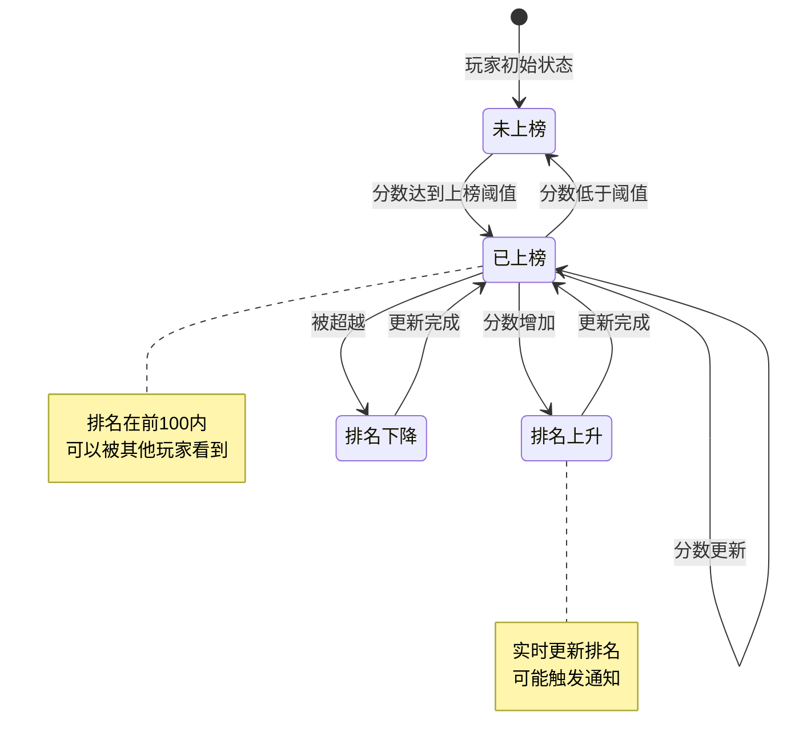
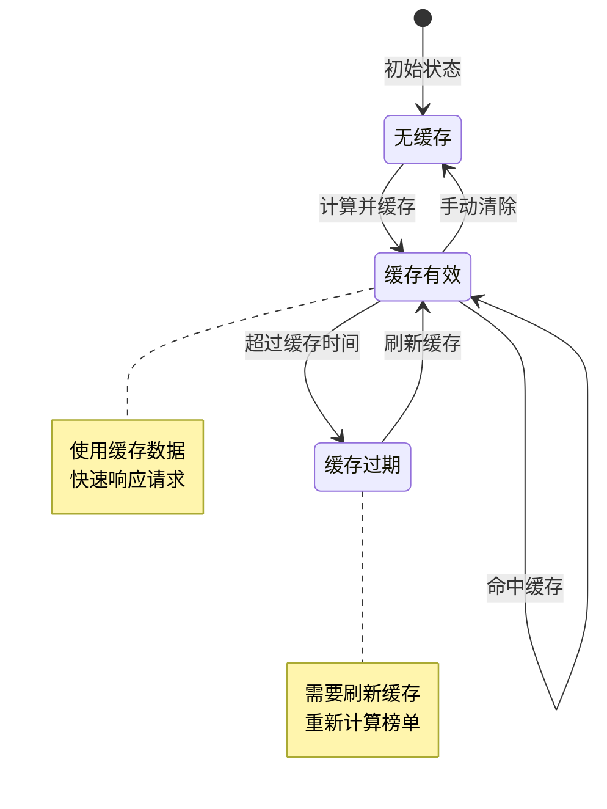
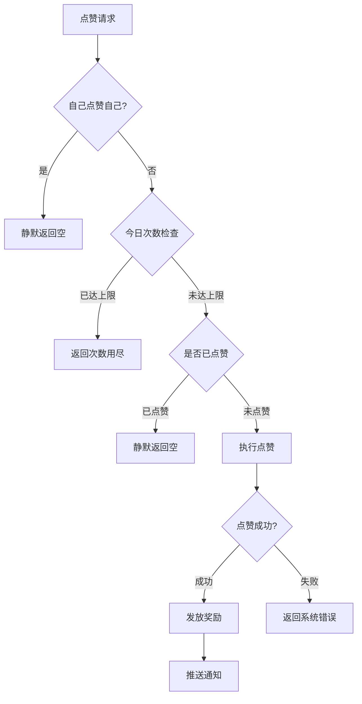
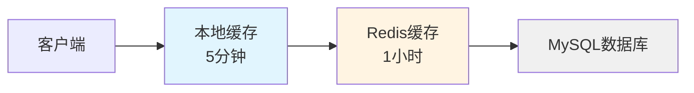

# 排行榜模块实现细节

## 一、计算公式

### 1.1 排名计算公式

```
排名 = 根据分数降序排列后的位置
```

**Redis 实现**：
```
使用 Sorted Set 存储
Key: rank:{rankType}:{serverId}
Member: playerId
Score: 分数
排名 = ZREVRANK key member + 1
```

**示例计算**：
```
玩家榜数据：
  玩家A: 999999 -> 排名1
  玩家B: 888888 -> 排名2
  玩家C: 777777 -> 排名3
  玩家D: 123456 -> 需要计算

执行 ZREVRANK rank:1:1001 20004
返回: 47 (0-indexed)
实际排名: 47 + 1 = 48
```

### 1.2 分数相同排名规则

```
如果 分数A == 分数B:
    排名 = 先达到该分数的玩家排名靠前

实现方式:
Member = {playerId}:{达成时间戳}
排序 = Score DESC, Timestamp ASC
```

**示例**：
```
玩家A: 999999 (2026-04-11 10:00:00) -> 排名1
玩家B: 999999 (2026-04-11 11:00:00) -> 排名2 (相同分数，后到达)
```

### 1.3 点赞次数检查公式

```
今日点赞次数 = GET rank:like:count:{playerId}:{date}
剩余次数 = 每日点赞上限 - 今日点赞次数
可点赞 = 剩余次数 > 0
```

**参数说明**：
- `date`：当前日期（如 20260411）
- `每日点赞上限`：配置的最大点赞次数（默认10次）

### 1.4 点赞积分计算公式

```
被点赞积分 = INCR rank:like:score:{targetPlayerId}:{date}
点赞排名 = 根据积分排序后的位置
```

### 1.5 奖励计算公式

```
点赞奖励 = 配置的固定奖励列表
排名奖励 = 匹配排名区间的奖励配置
```

**奖励区间匹配**：
```
IF min_rank <= player_rank <= max_rank:
    奖励 = reward_list
```

---

## 二、状态机定义

### 2.1 排名状态机



### 2.2 点赞状态机


### 2.3 榜单缓存状态机



---

## 三、数据约束

### 3.1 排行榜配置约束

| 字段名 | 数据类型 | 取值范围 | 必填 | 唯一性 | 说明 |
|--------|----------|----------|------|--------|------|
| id | int | > 0 | 是 | 是 | 榜单ID |
| rank_type | tinyint | 1-3 | 是 | 是 | 榜单类型 |
| rank_name | varchar | 1-50字符 | 是 | 否 | 榜单名称 |
| show_count | int | 10-1000 | 是 | 否 | 显示数量 |
| refresh_time | int | >= 60 | 是 | 否 | 刷新间隔（秒） |

### 3.2 排名信息约束

| 字段名 | 数据类型 | 取值范围 | 必填 | 说明 |
|--------|----------|----------|------|------|
| key | long | > 0 | 是 | 排名主体ID |
| sourceId | long | >= 0 | 否 | 分数来源ID |
| score | long | >= 0 | 是 | 分数 |
| rank | int | >= 1 | 是 | 排名 |

### 3.3 点赞记录约束

| 字段名 | 数据类型 | 取值范围 | 必填 | 说明 |
|--------|----------|----------|------|------|
| id | BIGINT | > 0 | 是 | 记录主键 |
| player_id | BIGINT | > 0 | 是 | 点赞者ID |
| target_player_id | BIGINT | > 0 | 是 | 被点赞者ID |
| rank_type | TINYINT | 1-3 | 是 | 榜单类型 |
| like_time | DATETIME | - | 是 | 点赞时间 |

### 3.4 排名奖励配置约束

| 字段名 | 数据类型 | 取值范围 | 必填 | 说明 |
|--------|----------|----------|------|------|
| rank_id | int | > 0 | 是 | 榜单类型 |
| min_rank | int | >= 1 | 是 | 最低排名 |
| max_rank | int | >= min_rank | 是 | 最高排名 |
| reward_list | array | 非空 | 是 | 奖励列表 |

---

## 四、错误处理策略

### 4.1 排行榜模块错误码

| 错误码 | 错误枚举 | 错误信息 | 处理策略 | 用户提示 |
|--------|----------|----------|----------|----------|
| 100001 | CROSS_GROUP_NOT_FOUND | 跨服分组实例不存在 | 检查跨服配置 | "跨服分组不存在" |
| 100002 | RANK_OBJECT_NOT_FOUND | 排行对象不存在 | 检查排名主体 | "排行对象不存在" |
| 100003 | RANK_OPERATION_FAILED | 排行榜操作失败 | 记录日志重试 | "操作失败，请重试" |
| 100004 | CROSS_RANK_SERVER_FAILED | 跨服排行榜服务器承载失败 | 降级到单服 | "跨服服务暂不可用" |
| 100005 | RANK_FIXED_NOT_FOUND | 常驻排行榜未找到 | 检查榜单ID | "榜单不存在" |
| 100006 | RANK_FIXED_LIKE_TARGET_NOT_FOUND | 常驻排行榜找不到点赞对象 | 检查榜单数据 | "点赞对象不存在" |
| 100007 | RANK_FIXED_LIKE_COUNT_NOT_ENOUGH | 常驻排行榜点赞次数不足 | 等待次日重置 | "今日点赞次数已用完" |
| 100008 | RANK_FIXED_AKEY_LIKE_NOT_UNLOCKED | 常驻排行榜一键点赞功能未解锁 | 检查解锁条件 | "一键点赞功能未解锁" |
| 100009 | RANK_FIXED_NOT_SUPPORT_LIKE | 该常驻排行榜不支持点赞 | 检查榜单配置 | "该榜单不支持点赞" |
| 100010 | RANK_FIXED_NO_LIKE_TARGET | 常驻排行榜没有可点赞目标 | 检查榜单数据 | "没有可点赞目标" |
| 100011 | RANK_ITEM_DATA_NOT_FOUND | 排行item数据不存在 | 检查排名数据 | "排名数据不存在" |
| 100012 | NOT_IN_RANK | 未参加排行 | 提示玩家上榜条件 | "您未参加排行" |

### 4.2 点赞错误处理流程



### 4.3 缓存异常处理

| 异常情况 | 处理策略 | 说明 |
|----------|----------|------|
| Redis连接失败 | 降级到数据库查询 | 记录日志，告警 |
| 缓存数据丢失 | 重新计算并缓存 | 不影响用户使用 |
| 缓存超时 | 返回旧数据或降级 | 保证可用性 |

---

## 五、关键代码示例

### 5.1 获取排行榜伪代码

```csharp
public RankResult GetRankList(ERankType rankType)
{
    string cacheKey = $"rank:{(int)rankType}";

    // 1. 尝试从Redis获取
    var cachedData = redisTemplate.opsForZSet()
        .reverseRangeWithScores(cacheKey, 0, 99);

    if (cachedData == null || cachedData.Count == 0)
    {
        // 2. 缓存不存在，重新计算
        return RefreshRankCache(rankType);
    }

    // 3. 构建排名列表
    List<Rank_BaseItem> rankList = new List<Rank_BaseItem>();
    int rank = 1;

    foreach (var tuple in cachedData)
    {
        long playerId = long.Parse(tuple.Value);
        long score = (long)tuple.Score;

        // 获取玩家信息
        PlayerBase player = playerDao.selectById(playerId);

        rankList.Add(new Rank_BaseItem
        {
            Key = playerId,
            SourceId = 0,
            Score = score,
            Rank = rank++
        });
    }

    return new RankResult
    {
        RankList = rankList,
        MyRank = GetMyRank(rankType),
        MyScore = GetMyScore(rankType)
    };
}
```

### 5.2 更新排名伪代码

```csharp
public void UpdateRank(ERankType rankType, long playerId, long score)
{
    string cacheKey = $"rank:{(int)rankType}";

    // 1. 获取旧排名
    long? oldRank = redisTemplate.opsForZSet()
        .reverseRank(cacheKey, playerId.ToString());

    // 2. 更新分数
    redisTemplate.opsForZSet().add(cacheKey, playerId.ToString(), score);

    // 3. 获取新排名
    long? newRank = redisTemplate.opsForZSet()
        .reverseRank(cacheKey, playerId.ToString());

    // 4. 判断是否需要通知
    if (oldRank == null || newRank == null)
        return;

    // 进入前百名或排名大幅上升
    if (newRank <= 100 && (oldRank > 100 || newRank < oldRank - 10))
    {
        PushRankChange(playerId, rankType, (int)oldRank, (int)newRank);
    }
}
```

### 5.3 点赞伪代码

```csharp
public Result Like(long playerId, ERankType rankType, long targetPlayerId)
{
    // 1. 不能给自己点赞
    if (playerId == targetPlayerId)
        return Result.Silent(); // 静默返回

    // 2. 检查今日点赞次数
    string countKey = $"rank:like:count:{playerId}:{DateTime.Now:yyyyMMdd}";
    long todayCount = redisTemplate.opsForValue().increment(countKey);

    if (todayCount == 1)
    {
        // 首次点赞，设置过期时间
        redisTemplate.expire(countKey, TimeSpan.FromDays(1));
    }

    if (todayCount > MAX_DAILY_LIKE)
    {
        return Result.Error(100007, "今日点赞次数已用完");
    }

    // 3. 检查是否已点赞
    string likeKey = $"rank:like:{playerId}:{(int)rankType}:{DateTime.Now:yyyyMMdd}";
    bool alreadyLiked = redisTemplate.opsForSet().isMember(likeKey, targetPlayerId.ToString());

    if (alreadyLiked)
    {
        return Result.Silent(); // 静默返回
    }

    // 4. 记录点赞
    redisTemplate.opsForSet().add(likeKey, targetPlayerId.ToString());
    if (redisTemplate.getExpire(likeKey) < 0)
    {
        redisTemplate.expire(likeKey, TimeSpan.FromDays(1));
    }

    // 5. 更新被点赞数
    string targetLikeCountKey = $"rank:like:target:{targetPlayerId}:{(int)rankType}";
    redisTemplate.opsForValue().increment(targetLikeCountKey);

    // 6. 发放点赞奖励
    GiveLikeReward(playerId);

    return Result.Success();
}
```

### 5.4 获取我的排名伪代码

```csharp
public int GetMyRank(ERankType rankType)
{
    long playerId = GetCurrentPlayerId();
    string cacheKey = $"rank:{(int)rankType}";

    Long? rank = redisTemplate.opsForZSet()
        .reverseRank(cacheKey, playerId.ToString());

    return rank.HasValue ? (int)rank + 1 : -1; // -1表示未上榜
}
```

### 5.5 刷新榜单缓存伪代码

```csharp
public RankResult RefreshRankCache(ERankType rankType)
{
    string cacheKey = $"rank:{(int)rankType}";

    // 1. 根据榜单类型查询数据
    List<PlayerRankData> dataList;

    switch (rankType)
    {
        case ERankType.PLAYER:
            dataList = playerDao.getTopByPower(100);
            break;
        case ERankType.GUILD:
            dataList = guildDao.getTopByPower(100);
            break;
        case ERankType.ACTIVITY_TEAM:
            dataList = activityTeamDao.getTopByScore(100);
            break;
        default:
            dataList = new List<PlayerRankData>();
            break;
    }

    // 2. 清除旧缓存
    redisTemplate.delete(cacheKey);

    // 3. 写入新缓存
    foreach (var data in dataList)
    {
        redisTemplate.opsForZSet().add(cacheKey,
            data.PlayerId.ToString(),
            data.Score);
    }

    // 4. 设置缓存过期时间
    redisTemplate.expire(cacheKey, TimeSpan.FromHours(1));

    // 5. 返回结果
    return GetRankList(rankType);
}
```

---

## 六、跨模块依赖

### 6.1 依赖模块

| 模块名称 | 依赖类型 | 依赖说明 |
|----------|----------|----------|
| Player模块 | 强依赖 | 需要获取玩家基础信息 |
| Redis模块 | 强依赖 | 存储排行榜缓存数据 |
| Config模块 | 强依赖 | 需要读取榜单配置 |
| Item模块 | 弱依赖 | 发放点赞和排名奖励 |
| FixedCD模块 | 强依赖 | 点赞次数冷却管理 |

### 6.2 被依赖关系

| 模块名称 | 被依赖方式 | 说明 |
|----------|------------|------|
| 战斗模块 | 分数更新 | 战斗结果更新排名分数 |
| 公会模块 | 公会榜 | 公会战力更新公会排名 |
| 活动模块 | 活动榜 | 活动积分更新活动排名 |

### 6.3 接口定义

```csharp
// 供其他模块调用的接口
public interface IRankService
{
    // 获取排行榜列表
    RankResult GetRankList(ERankType rankType);

    // 更新玩家排名分数
    void UpdateRank(ERankType rankType, long playerId, long score);

    // 获取玩家排名
    int GetPlayerRank(ERankType rankType, long playerId);

    // 获取玩家分数
    long GetPlayerScore(ERankType rankType, long playerId);

    // 点赞
    Result Like(long playerId, ERankType rankType, long targetPlayerId);

    // 一键点赞
    List<Result> LikeAll(long playerId, List<ERankType> rankTypes);

    // 刷新榜单缓存
    void RefreshCache(ERankType rankType);

    // 发放排名奖励
    void DistributeRankRewards(ERankType rankType);
}
```

---

## 七、Redis 命令详解

### 7.1 排行榜操作命令

#### 7.1.1 添加/更新排名

```bash
# 添加玩家到排行榜
ZADD rank:1:1001 999999 20001
ZADD rank:1:1001 888888 20002
ZADD rank:1:1001 777777 20003

# 批量添加
ZADD rank:1:1001 666666 20004 555555 20005 444444 20006
```

#### 7.1.2 查询排名

```bash
# 获取排行榜前10名（降序）
ZREVRANGE rank:1:1001 0 9 WITHSCORES

# 输出:
# 1) "20001"
# 2) "999999"
# 3) "20002"
# 4) "888888"
# ...

# 获取指定玩家的排名（0-indexed，需要+1）
ZREVRANK rank:1:1001 20001
# 输出: 0 (表示第1名)

# 获取指定玩家的分数
ZSCORE rank:1:1001 20001
# 输出: "999999"
```

#### 7.1.3 获取排名范围

```bash
# 获取第1-100名（带分数）
ZREVRANGE rank:1:1001 0 99 WITHSCORES

# 获取指定分数区间的玩家
ZRANGEBYSCORE rank:1:1001 100000 999999 WITHSCORES
```

#### 7.1.4 删除排名

```bash
# 删除指定玩家
ZREM rank:1:1001 20001

# 删除指定排名范围的玩家
ZREMRANGEBYRANK rank:1:1001 100 -1

# 删除指定分数范围的玩家
ZREMRANGEBYSCORE rank:1:1001 -inf 10000
```

### 7.2 点赞操作命令

#### 7.2.1 点赞计数

```bash
# 增加点赞次数
INCR rank:like:count:20001:20260411
# 输出: 1

# 获取今日点赞次数
GET rank:like:count:20001:20260411
# 输出: "5"

# 设置过期时间（到次日零点）
EXPIREAT rank:like:count:20001:20260411 1713369600
```

#### 7.2.2 点赞记录

```bash
# 检查是否已点赞
SISMEMBER rank:like:record:20001:20260411 1001:20002
# 输出: 0 (未点赞)

# 记录点赞
SADD rank:like:record:20001:20260411 1001:20002 1001:20003
# 输出: 2 (添加了2条记录)

# 获取今日点赞列表
SMEMBERS rank:like:record:20001:20260411
# 输出: 1) "1001:20002" 2) "1001:20003"
```

#### 7.2.3 点赞积分

```bash
# 增加被点赞积分
INCR rank:like:score:20002:20260411
# 输出: 1

# 获取点赞积分
GET rank:like:score:20002:20260411
# 输出: "10"
```

### 7.3 Pipeline 批量操作

```csharp
// 使用 Pipeline 批量更新排名
public void BatchUpdateRank(int rankType, List<(long playerId, long score)> updates)
{
    var batch = redisTemplate.CreateBatch();
    string cacheKey = $"rank:{rankType}:{serverId}";

    foreach (var (playerId, score) in updates)
    {
        batch.SortedSetAddAsync(cacheKey, playerId.ToString(), score);
    }

    batch.Execute();
}
```

---

## 八、性能优化实践

### 8.1 查询优化

#### 8.1.1 分页查询

```csharp
/// <summary>
/// 分页获取排行榜数据
/// </summary>
public List<Rank_BaseItem> GetRankListByPage(int rankType, int page, int pageSize)
{
    int start = (page - 1) * pageSize;
    int end = start + pageSize - 1;

    string cacheKey = $"rank:{rankType}:{serverId}";

    // 只查询需要的数据
    var rankData = redisTemplate.opsForZSet()
        .reverseRangeWithScores(cacheKey, start, end);

    return BuildRankList(rankData, start + 1);
}
```

#### 8.1.2 本地缓存

```csharp
// 使用本地缓存减少 Redis 查询
private static MemoryCache _localCache = new MemoryCache("RankCache");

public List<Rank_BaseItem> GetRankListWithLocalCache(int rankType)
{
    string cacheKey = $"rank:{rankType}:{serverId}";

    // 1. 检查本地缓存
    if (_localCache.TryGetValue(cacheKey, out List<Rank_BaseItem> cachedList))
    {
        return cachedList;
    }

    // 2. 查询 Redis
    var rankList = GetRankListFromRedis(rankType);

    // 3. 写入本地缓存（5分钟过期）
    _localCache.Set(cacheKey, rankList, TimeSpan.FromMinutes(5));

    return rankList;
}
```

### 8.2 写入优化

#### 8.2.1 批量更新

```csharp
/// <summary>
/// 批量更新排名（使用消息队列）
/// </summary>
public void BatchUpdateRankAsync(List<RankUpdateMessage> messages)
{
    foreach (var msg in messages)
    {
        // 发送到消息队列
        messageQueue.Publish("rank:update", msg);
    }
}

/// <summary>
/// 消费者处理批量更新
/// </summary>
public void ConsumeRankUpdates()
{
    var batch = new List<RankUpdateMessage>();

    messageQueue.Subscribe("rank:update", (msg) =>
    {
        batch.Add(msg);

        // 每100条批量处理一次
        if (batch.Count >= 100)
        {
            ProcessBatch(batch);
            batch.Clear();
        }
    });
}
```

#### 8.2.2 延迟写入

```csharp
// 使用延迟队列，定期批量写入数据库
public void DelayedWriteToDatabase()
{
    // 积累更新操作
    var updates = CollectRankUpdates();

    // 每分钟批量写入一次
    Task.Run(async () =>
    {
        while (true)
        {
            await Task.Delay(TimeSpan.FromMinutes(1));
            BatchWriteToDatabase(updates);
            updates.Clear();
        }
    });
}
```

### 8.3 缓存策略

#### 8.3.1 多级缓存架构



#### 8.3.2 缓存预热

```csharp
/// <summary>
/// 服务启动时预热热门榜单
/// </summary>
public void PreloadHotRanks()
{
    // 获取热门榜单配置
    var hotRanks = rankConfigDao.GetHotRanks();

    foreach (var rank in hotRanks)
    {
        // 预加载到缓存
        GetRankListFromDatabase(rank.Id);
    }

    log.Info($"预加载 {hotRanks.Count} 个热门榜单");
}
```

---

## 九、边界情况处理

### 9.1 分数为零或负数

```csharp
/// <summary>
/// 更新排名分数（带边界检查）
/// </summary>
public void UpdateRankScore(int rankType, long key, long score)
{
    // 分数必须 >= 0
    if (score < 0)
    {
        log.Warn($"排名分数为负数: rankType={rankType}, key={key}, score={score}");
        score = 0;
    }

    // 分数为0时从榜单移除
    if (score == 0)
    {
        RemoveFromRank(rankType, key);
        return;
    }

    // 正常更新
    UpdateRank(rankType, key, score);
}
```

### 9.2 排名不存在

```csharp
/// <summary>
/// 获取玩家排名（处理不存在情况）
/// </summary>
public int GetPlayerRank(int rankType, long key)
{
    string cacheKey = $"rank:{rankType}:{serverId}";

    Long? rank = redisTemplate.opsForZSet()
        .reverseRank(cacheKey, key.ToString());

    // 返回 -1 表示未上榜
    if (!rank.HasValue)
    {
        return -1;
    }

    return (int)rank + 1;
}
```

### 9.3 榜单为空

```csharp
/// <summary>
/// 获取排行榜列表（处理空榜单）
/// </summary>
public List<Rank_BaseItem> GetRankList(int rankType)
{
    var rankData = GetRankDataFromCache(rankType);

    // 榜单为空，返回空列表
    if (rankData == null || rankData.Count == 0)
    {
        return new List<Rank_BaseItem>();
    }

    return BuildRankList(rankData);
}
```

### 9.4 并发点赞

```csharp
/// <summary>
/// 点赞（使用分布式锁）
/// </summary>
public Result LikeWithLock(long playerId, long rankFixedId)
{
    string lockKey = $"rank:like:lock:{playerId}";

    // 尝试获取锁（30秒超时）
    bool locked = redisTemplate.opsForValue()
        .setIfAbsent(lockKey, "1", TimeSpan.FromSeconds(30));

    if (!locked)
    {
        return Result.Error("操作过于频繁，请稍后重试");
    }

    try
    {
        // 执行点赞逻辑
        return DoLike(playerId, rankFixedId);
    }
    finally
    {
        // 释放锁
        redisTemplate.delete(lockKey);
    }
}
```

### 9.5 跨服数据延迟

```csharp
/// <summary>
/// 获取跨服排行榜（处理数据延迟）
/// </summary>
public List<Rank_BaseItem> GetCrossRankList(int rankType)
{
    string cacheKey = $"rank:cross:{rankType}";

    // 检查缓存更新时间
    string timeKey = $"rank:cache:time:{rankType}";
    string lastUpdate = redisTemplate.opsForValue().get(timeKey);

    if (lastUpdate != null)
    {
        long updateTime = long.Parse(lastUpdate);
        long now = DateTimeOffset.UtcNow.ToUnixTimeMilliseconds();

        // 如果超过2小时未更新，提示用户
        if (now - updateTime > TimeSpan.FromHours(2).TotalMilliseconds)
        {
            log.Warn($"跨服榜单数据延迟: rankType={rankType}");
            // 可以返回旧数据或提示用户稍后重试
        }
    }

    return GetRankListFromCache(cacheKey);
}
```

---

## 十、测试用例

### 10.1 单元测试

```csharp
[TestClass]
public class RankServiceTests
{
    private IRankService _rankService;
    private Mock<IRedisTemplate> _redisMock;
    private Mock<IRankDao> _rankDaoMock;

    [TestInitialize]
    public void Setup()
    {
        _redisMock = new Mock<IRedisTemplate>();
        _rankDaoMock = new Mock<IRankDao>();
        _rankService = new RankService(_redisMock.Object, _rankDaoMock.Object);
    }

    [TestMethod]
    public void TestGetRankList_Success()
    {
        // Arrange
        int rankType = 1;
        var mockData = CreateMockRankData();

        _redisMock.Setup(r => r.opsForZSet()
            .reverseRangeWithScores(It.IsAny<string>(), 0, 99))
            .Returns(mockData);

        // Act
        var result = _rankService.GetRankList(rankType);

        // Assert
        Assert.IsNotNull(result);
        Assert.AreEqual(100, result.Count);
        Assert.AreEqual(1, result[0].Rank);
    }

    [TestMethod]
    public void TestUpdateRank_NewPlayer()
    {
        // Arrange
        int rankType = 1;
        long playerId = 20001;
        long score = 999999;

        // Act
        _rankService.UpdateRankScore(rankType, playerId, score);

        // Assert
        _redisMock.Verify(r => r.opsForZSet()
            .add(It.IsAny<string>(), playerId.ToString(), score), Times.Once);
    }

    [TestMethod]
    public void TestLike_Success()
    {
        // Arrange
        long playerId = 20001;
        long rankFixedId = 1001;

        _redisMock.Setup(r => r.opsForValue()
            .increment(It.IsAny<string>()))
            .Returns(1);

        _redisMock.Setup(r => r.opsForSet()
            .isMember(It.IsAny<string>(), It.IsAny<string>()))
            .Returns(false);

        // Act
        var result = _rankService.Like(playerId, rankFixedId, false);

        // Assert
        Assert.IsTrue(result.IsSuccess);
    }

    [TestMethod]
    public void TestLike_CountExceeded()
    {
        // Arrange
        long playerId = 20001;
        long rankFixedId = 1001;

        _redisMock.Setup(r => r.opsForValue()
            .increment(It.IsAny<string>()))
            .Returns(11); // 超过上限

        // Act
        var result = _rankService.Like(playerId, rankFixedId, false);

        // Assert
        Assert.IsFalse(result.IsSuccess);
        Assert.AreEqual(100007, result.ErrorCode);
    }
}
```

### 10.2 集成测试

```csharp
[TestClass]
public class RankIntegrationTests
{
    private TestServer _server;
    private HttpClient _client;

    [TestInitialize]
    public void Setup()
    {
        _server = new TestServer(new WebHostBuilder()
            .UseStartup<Startup>());
        _client = _server.CreateClient();
    }

    [TestMethod]
    public async Task TestGetRankListAPI()
    {
        // Arrange
        long rankFixedId = 1001;

        // Act
        var response = await _client.GetAsync($"/api/rank/list?rankFixedId={rankFixedId}");

        // Assert
        response.EnsureSuccessStatusCode();
        var content = await response.Content.ReadAsStringAsync();
        var result = JsonConvert.DeserializeObject<ApiResponse>(content);

        Assert.AreEqual(0, result.Code);
        Assert.IsNotNull(result.Data);
    }

    [TestMethod]
    public async Task TestLikeAPI()
    {
        // Arrange
        var request = new { rankFixedId = 1001L };

        // Act
        var response = await _client.PostAsJsonAsync("/api/rank/like", request);

        // Assert
        response.EnsureSuccessStatusCode();
        var content = await response.Content.ReadAsStringAsync();
        var result = JsonConvert.DeserializeObject<ApiResponse>(content);

        Assert.AreEqual(0, result.Code);
    }
}
```

### 10.3 性能测试

```csharp
[TestClass]
public class RankPerformanceTests
{
    [TestMethod]
    public void TestConcurrentGetRankList()
    {
        // Arrange
        int concurrentUsers = 100;
        var rankService = CreateRankService();

        // Act
        var stopwatch = Stopwatch.StartNew();

        Parallel.For(0, concurrentUsers, i =>
        {
            rankService.GetRankList(1);
        });

        stopwatch.Stop();

        // Assert
        Assert.IsTrue(stopwatch.ElapsedMilliseconds < 1000,
            $"100次并发查询耗时 {stopwatch.ElapsedMilliseconds}ms");
    }

    [TestMethod]
    public void TestBatchUpdateRank()
    {
        // Arrange
        int batchSize = 1000;
        var updates = GenerateRankUpdates(batchSize);
        var rankService = CreateRankService();

        // Act
        var stopwatch = Stopwatch.StartNew();

        rankService.BatchUpdateRank(updates);

        stopwatch.Stop();

        // Assert
        Assert.IsTrue(stopwatch.ElapsedMilliseconds < 500,
            $"批量更新{batchSize}条数据耗时 {stopwatch.ElapsedMilliseconds}ms");
    }
}
```

---

## 十一、部署注意事项

### 11.1 Redis 配置

```conf
# redis.conf

# 内存限制
maxmemory 4gb

# 过期策略
maxmemory-policy allkeys-lru

# 持久化
appendonly yes
appendfsync everysec

# 主从复制
replicaof 192.168.1.100 6379
```

### 11.2 数据库索引

```sql
-- 确保必要的索引
CREATE INDEX idx_rank_type_score ON rank_record(rank_type, score DESC);
CREATE INDEX idx_player_rank_type ON rank_record(rank_key, rank_type);
CREATE INDEX idx_like_player_date ON rank_like_record(player_id, like_date);
```

### 11.3 监控配置

```yaml
# monitoring.yml
metrics:
  rank:
    - name: rank_request_qps
      type: counter
      labels: [rank_type, server_id]

    - name: rank_cache_hit_rate
      type: gauge
      labels: [rank_type]

    - name: rank_update_delay
      type: histogram
      buckets: [10ms, 50ms, 100ms, 500ms, 1s]
```

---

## 十二、故障排查

### 12.1 常见问题

| 问题现象 | 可能原因 | 排查步骤 | 解决方案 |
|---------|---------|---------|---------|
| 排行榜加载慢 | Redis 缓存未命中 | 检查缓存数据 | 预热缓存 |
| 点赞失败 | 次数已达上限 | 检查点赞计数 | 等待次日重置 |
| 排名不准确 | 数据库与缓存不一致 | 对比数据 | 重新计算榜单 |
| 内存占用高 | 排行榜数据过多 | 检查数据量 | 清理过期数据 |

### 12.2 日志分析

```bash
# 查看排行榜请求日志
grep "RankService" game.log | tail -100

# 查看点赞失败日志
grep "Like failed" game.log | grep "error"

# 分析慢查询
grep "slow query" rank.log | awk '{print $7}' | sort | uniq -c
```

---

## 十三、代码规范

### 13.1 命名规范

```csharp
// 类名：PascalCase
public class RankService { }

// 方法名：PascalCase
public List<Rank_BaseItem> GetRankList(int rankType) { }

// 参数名：camelCase
public void UpdateRankScore(int rankType, long playerId, long score) { }

// 常量：UPPER_CASE
public const int MAX_RANK_COUNT = 100;

// Redis Key：lower_case_with_colons
string cacheKey = $"rank:{rankType}:{serverId}";
```

### 13.2 注释规范

```csharp
/// <summary>
/// 排行榜服务类
/// </summary>
public class RankService : IRankService
{
    /// <summary>
    /// 获取排行榜列表
    /// </summary>
    /// <param name="rankType">榜单类型</param>
    /// <returns>排名列表</returns>
    /// <exception cref="BusinessException">榜单不存在时抛出</exception>
    public List<Rank_BaseItem> GetRankList(int rankType)
    {
        // TODO: 添加本地缓存优化
        // FIXME: 处理跨服数据延迟问题

        // 获取缓存数据
        var rankData = GetRankDataFromCache(rankType);

        return BuildRankList(rankData);
    }
}
```

---

## 十四、优化建议

### 14.1 短期优化（1-2周）

- [ ] 添加本地缓存层
- [ ] 优化查询性能
- [ ] 完善错误处理
- [ ] 添加监控告警

### 14.2 中期优化（1个月）

- [ ] 实现跨服排行榜
- [ ] 添加数据分析功能
- [ ] 优化内存使用
- [ ] 完善测试覆盖

### 14.3 长期优化（3个月）

- [ ] 引入机器学习预测
- [ ] 实现个性化推荐
- [ ] 优化架构设计
- [ ] 性能极致优化

---

*文档更新时间: 2026-04-11*
*文档维护者: 天天 (AI助手)*
