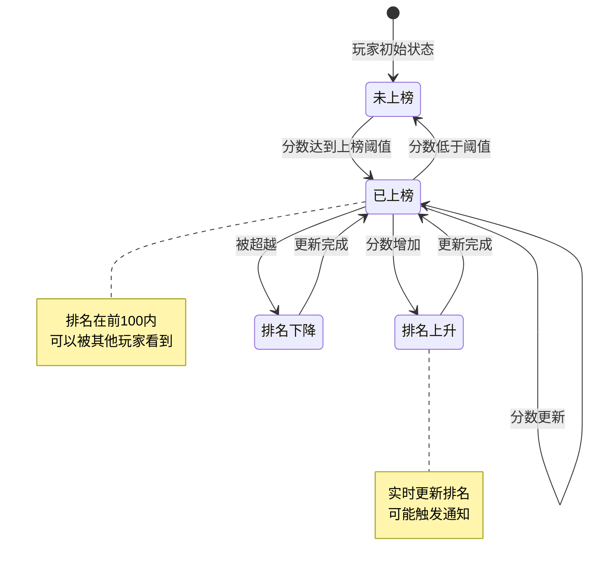
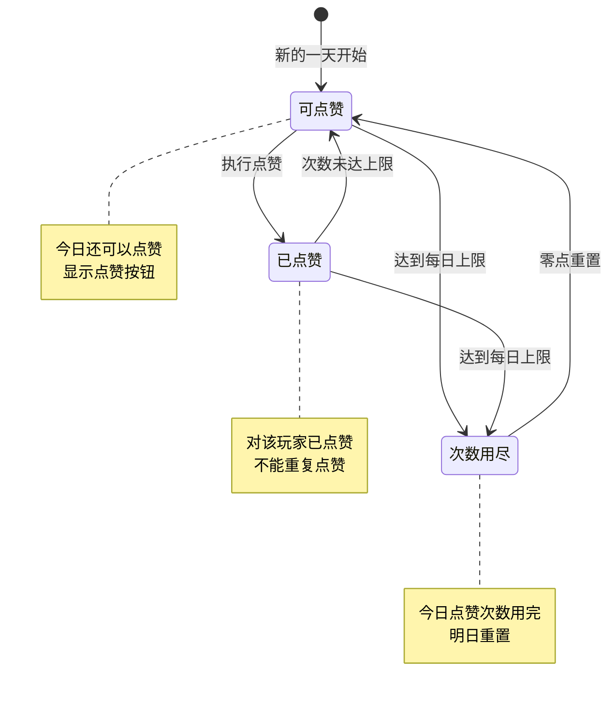
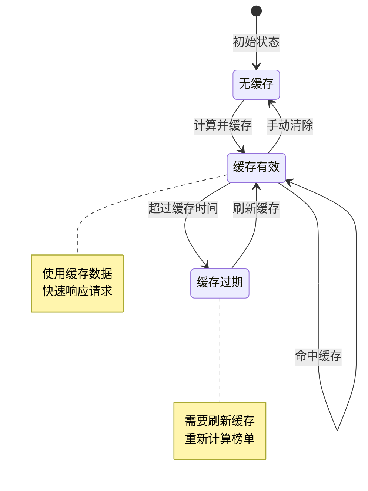
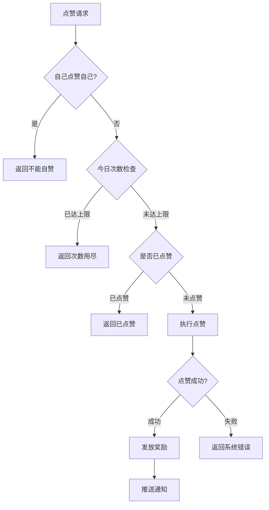

# 排行榜模块实现细节

## 一、计算公式

### 1.1 排名计算公式

```
排名 = 根据分数降序排列后的位置
```

**Redis实现**：
```
使用 Sorted Set 存储
Key: rank:{rankType}
Member: playerId
Score: 分数
排名 = ZREVRANK key member
```

**示例计算**：
```
战力榜数据：
  玩家A: 999999 -> 排名1
  玩家B: 888888 -> 排名2
  玩家C: 777777 -> 排名3
  玩家D: 123456 -> 需要计算

执行 ZREVRANK rank:1 玩家D
返回排名: 48
```

### 1.2 点赞次数检查公式

```
今日点赞次数 = GET rank:like:{playerId}:{date}
可点赞 = 今日点赞次数 < 每日点赞上限
```

**参数说明**：
- `date`：当前日期（如 20260407）
- `每日点赞上限`：配置的最大点赞次数

### 1.3 点赞奖励计算公式

```
点赞奖励 = 配置的固定奖励 × min(今日已获得奖励次数 + 1, 奖励次数上限)
```

---

## 二、状态机定义

### 2.1 排名状态机



### 2.2 点赞状态机



### 2.3 榜单缓存状态机



---

## 三、数据约束

### 3.1 排行榜配置约束

| 字段名 | 数据类型 | 取值范围 | 必填 | 唯一性 | 说明 |
|--------|----------|----------|------|--------|------|
| rank_type | int | 1-10 | 是 | 是 | 榜单类型 |
| rank_name | string | 1-20字符 | 是 | 否 | 榜单名称 |
| refresh_time | int | > 0 | 是 | 否 | 刷新间隔（秒） |
| show_count | int | 10-100 | 是 | 否 | 显示数量 |

### 3.2 排名信息约束

| 字段名 | 数据类型 | 取值范围 | 必填 | 说明 |
|--------|----------|----------|------|------|
| rank | int | >= 1 | 是 | 排名 |
| playerId | long | > 0 | 是 | 玩家ID |
| playerName | string | 2-12字符 | 是 | 玩家名称 |
| score | long | >= 0 | 是 | 分数 |
| likeCount | int | >= 0 | 是 | 点赞数 |

### 3.3 点赞记录约束

| 字段名 | 数据类型 | 取值范围 | 必填 | 说明 |
|--------|----------|----------|------|------|
| id | BIGINT | > 0 | 是 | 记录主键 |
| player_id | BIGINT | > 0 | 是 | 点赞者ID |
| target_player_id | BIGINT | > 0 | 是 | 被点赞者ID |
| rank_type | INT | 1-10 | 是 | 榜单类型 |
| like_time | DATETIME | - | 是 | 点赞时间 |

### 3.4 排名奖励配置约束

| 字段名 | 数据类型 | 取值范围 | 必填 | 说明 |
|--------|----------|----------|------|------|
| rank_type | int | 1-10 | 是 | 榜单类型 |
| min_rank | int | >= 1 | 是 | 最低排名 |
| max_rank | int | >= min_rank | 是 | 最高排名 |
| reward_list | array | 非空 | 是 | 奖励列表 |

---

## 四、错误处理策略

### 4.1 排行榜模块错误码

| 错误码 | 错误信息 | 处理策略 | 用户提示 |
|--------|----------|----------|----------|
| 64001 | 榜单类型无效 | 检查榜单类型 | "榜单不存在" |
| 64002 | 今日点赞次数已用完 | 检查点赞次数 | "今日点赞次数已用完" |
| 64003 | 已经点赞过 | 检查点赞记录 | "您已点赞过该玩家" |
| 64004 | 不能给自己点赞 | 检查目标玩家 | "不能给自己点赞" |
| 64005 | 玩家不在榜单中 | 检查排名 | "该玩家不在榜单中" |

### 4.2 点赞错误处理流程



### 4.3 缓存异常处理

| 异常情况 | 处理策略 | 说明 |
|----------|----------|------|
| Redis连接失败 | 降级到数据库查询 | 记录日志，告警 |
| 缓存数据丢失 | 重新计算并缓存 | 不影响用户使用 |
| 缓存超时 | 返回旧数据或降级 | 保证可用性 |

---

## 五、关键代码示例

### 5.1 获取排行榜伪代码

```csharp
public RankResult GetRankList(ERankType rankType)
{
    string cacheKey = $"rank:{(int)rankType}";

    // 1. 尝试从Redis获取
    var cachedData = redisTemplate.opsForZSet()
        .reverseRangeWithScores(cacheKey, 0, 99);

    if (cachedData == null || cachedData.Count == 0)
    {
        // 2. 缓存不存在，重新计算
        return RefreshRankCache(rankType);
    }

    // 3. 构建排名列表
    List<RankInfo> rankList = new List<RankInfo>();
    int rank = 1;

    foreach (var tuple in cachedData)
    {
        long playerId = long.Parse(tuple.Value);
        long score = (long)tuple.Score;

        // 获取玩家信息
        PlayerBase player = playerDao.selectById(playerId);

        rankList.Add(new RankInfo
        {
            Rank = rank++,
            PlayerId = playerId,
            PlayerName = player.PlayerName,
            Score = score,
            LikeCount = GetLikeCount(playerId, rankType)
        });
    }

    return new RankResult
    {
        RankList = rankList,
        MyRank = GetMyRank(rankType),
        MyScore = GetMyScore(rankType)
    };
}
```

### 5.2 更新排名伪代码

```csharp
public void UpdateRank(ERankType rankType, long playerId, long score)
{
    string cacheKey = $"rank:{(int)rankType}";

    // 1. 获取旧排名
    long? oldRank = redisTemplate.opsForZSet()
        .reverseRank(cacheKey, playerId.ToString());

    // 2. 更新分数
    redisTemplate.opsForZSet().add(cacheKey, playerId.ToString(), score);

    // 3. 获取新排名
    long? newRank = redisTemplate.opsForZSet()
        .reverseRank(cacheKey, playerId.ToString());

    // 4. 判断是否需要通知
    if (oldRank == null || newRank == null)
        return;

    // 进入前百名或排名大幅上升
    if (newRank <= 100 && (oldRank > 100 || newRank < oldRank - 10))
    {
        PushRankChange(playerId, rankType, (int)oldRank, (int)newRank);
    }
}
```

### 5.3 点赞伪代码

```csharp
public Result Like(long playerId, ERankType rankType, long targetPlayerId)
{
    // 1. 不能给自己点赞
    if (playerId == targetPlayerId)
        return Result.Error(64004, "不能给自己点赞");

    // 2. 检查今日点赞次数
    string countKey = $"rank:like:count:{playerId}:{DateTime.Now:yyyyMMdd}";
    long todayCount = redisTemplate.opsForValue().increment(countKey);

    if (todayCount == 1)
    {
        // 首次点赞，设置过期时间
        redisTemplate.expire(countKey, TimeSpan.FromDays(1));
    }

    if (todayCount > MAX_DAILY_LIKE)
    {
        return Result.Error(64002, "今日点赞次数已用完");
    }

    // 3. 检查是否已点赞
    string likeKey = $"rank:like:{playerId}:{(int)rankType}:{DateTime.Now:yyyyMMdd}";
    bool alreadyLiked = redisTemplate.opsForSet().isMember(likeKey, targetPlayerId.ToString());

    if (alreadyLiked)
    {
        return Result.Error(64003, "已经点赞过该玩家");
    }

    // 4. 记录点赞
    redisTemplate.opsForSet().add(likeKey, targetPlayerId.ToString());
    if (redisTemplate.getExpire(likeKey) < 0)
    {
        redisTemplate.expire(likeKey, TimeSpan.FromDays(1));
    }

    // 5. 更新被点赞数
    string targetLikeCountKey = $"rank:like:target:{targetPlayerId}:{(int)rankType}";
    redisTemplate.opsForValue().increment(targetLikeCountKey);

    // 6. 发放点赞奖励
    GiveLikeReward(playerId);

    return Result.Success();
}
```

### 5.4 获取我的排名伪代码

```csharp
public int GetMyRank(ERankType rankType)
{
    long playerId = GetCurrentPlayerId();
    string cacheKey = $"rank:{(int)rankType}";

    Long? rank = redisTemplate.opsForZSet()
        .reverseRank(cacheKey, playerId.ToString());

    return rank.HasValue ? (int)rank + 1 : -1; // -1表示未上榜
}
```

### 5.5 刷新榜单缓存伪代码

```csharp
public RankResult RefreshRankCache(ERankType rankType)
{
    string cacheKey = $"rank:{(int)rankType}";

    // 1. 根据榜单类型查询数据
    List<PlayerRankData> dataList;

    switch (rankType)
    {
        case ERankType.POWER:
            dataList = playerDao.getTopByPower(100);
            break;
        case ERankType.LEVEL:
            dataList = playerDao.getTopByLevel(100);
            break;
        case ERankType.ARENA:
            dataList = arenaDao.getTopByScore(100);
            break;
        default:
            dataList = new List<PlayerRankData>();
            break;
    }

    // 2. 清除旧缓存
    redisTemplate.delete(cacheKey);

    // 3. 写入新缓存
    foreach (var data in dataList)
    {
        redisTemplate.opsForZSet().add(cacheKey,
            data.PlayerId.ToString(),
            data.Score);
    }

    // 4. 设置缓存过期时间
    redisTemplate.expire(cacheKey, TimeSpan.FromHours(1));

    // 5. 返回结果
    return GetRankList(rankType);
}
```

---

## 六、跨模块依赖

### 6.1 依赖模块

| 模块名称 | 依赖类型 | 依赖说明 |
|----------|----------|----------|
| Player模块 | 强依赖 | 需要获取玩家基础信息 |
| Redis模块 | 强依赖 | 存储排行榜缓存数据 |
| Config模块 | 强依赖 | 需要读取榜单配置 |
| Item模块 | 弱依赖 | 发放点赞和排名奖励 |

### 6.2 被依赖关系

| 模块名称 | 被依赖方式 | 说明 |
|----------|------------|------|
| 战斗模块 | 分数更新 | 战斗结果更新排名分数 |
| 公会模块 | 公会榜 | 公会战力更新公会排名 |
| 竞技模块 | 竞技榜 | 竞技结果更新竞技排名 |
| 爬塔模块 | 爬塔榜 | 爬塔进度更新爬塔排名 |

### 6.3 接口定义

```csharp
// 供其他模块调用的接口
public interface IRankService
{
    // 获取排行榜列表
    RankResult GetRankList(ERankType rankType);

    // 更新玩家排名分数
    void UpdateRank(ERankType rankType, long playerId, long score);

    // 获取玩家排名
    int GetPlayerRank(ERankType rankType, long playerId);

    // 获取玩家分数
    long GetPlayerScore(ERankType rankType, long playerId);

    // 点赞
    Result Like(long playerId, ERankType rankType, long targetPlayerId);

    // 一键点赞
    Result LikeAll(long playerId, ERankType rankType);

    // 刷新榜单缓存
    void RefreshCache(ERankType rankType);

    // 发放排名奖励
    void DistributeRankRewards(ERankType rankType);
}
```

---

*文档生成时间: 2026-04-07*
