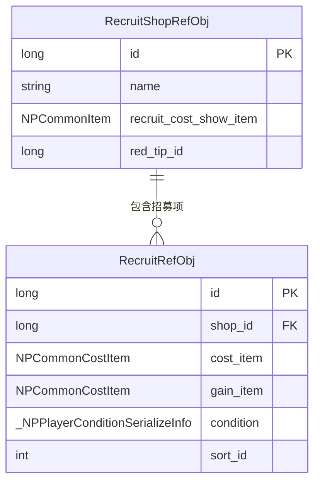

# 招募模块数据配表文档

## 配表概述

招募模块相关的配置数据存储在 `recruit_refdata.unity3d` 资源文件中，客户端通过 `GRefdataCoreMgr` 访问配置数据。

**资源路径**: `refdata/recruit_refdata.unity3d`

---

## 一、招募配表

### 1.1 RecruitRefObj - 招募表

**文件路径**: `recruit_refdata.unity3d` -> `recruit`

**配置类**: `GSORecruitRefSet`

| 序号 | 字段名 | 类型 | 说明 | 示例 |
|------|--------|------|------|------|
| 1 | id | long | 招募ID（唯一标识） | 10001 |
| 2 | shop_id | long | 所属商店ID | 1 |
| 3 | cost_item | NPCommonCostItem | 兑换消耗物品 | {itemType: BAG_ITEM, subId: 1001, count: 100} |
| 4 | gain_item | NPCommonCostItem | 获得物品 | {itemType: HERO, subId: 10001, count: 1} |
| 5 | condition | _NPPlayerConditionSerializeInfo | 兑换条件 | - |
| 6 | condition_desc | string | 兑换条件描述 | "需要通关第1章" |
| 7 | condition_desc_args_list | List\<string\> | 条件描述参数列表 | ["第1章"] |
| 8 | sort_id | int | 排序ID | 1 |
| 9 | exchange_second_check_content | string | 兑换二次确认弹窗内容 | "确定要兑换吗？" |
| 10 | can_goto_recruit_condition | _NPPlayerConditionSerializeInfo | 可前往招募的条件 | - |
| 11 | can_goto_recruit_desc | string | 可前往招募的描述 | "前往主线获取" |
| 12 | can_goto_recruit_goto_effect | _NPPlayerEffectSerializeInfo | 可前往招募的前往效果 | - |

**运行时方法**:

| 方法名 | 返回类型 | 说明 |
|--------|----------|------|
| canGotoRecruit() | bool | 是否可前往招募 |

---

### 1.2 RecruitShopRefObj - 招募商店表

**文件路径**: `recruit_refdata.unity3d` -> `recruit_shop`

**配置类**: `GSORecruitShopRefSet`

| 序号 | 字段名 | 类型 | 说明 | 示例 |
|------|--------|------|------|------|
| 1 | id | long | 商店ID（唯一标识） | 1 |
| 2 | name | string | 商店名称 | "英雄商店" |
| 3 | recruit_cost_show_item | NPCommonItem | 招募消耗展示物品 | {itemType: BAG_ITEM, subId: 1001} |
| 4 | red_tip_id | long | 红点ID | 1001 |

**运行时扩展属性**:

| 属性名 | 类型 | 说明 |
|--------|------|------|
| recruitRefObjList | List\<RecruitRefObj\> | 商店下的招募项列表 |

---

## 二、配表关系图



---

## 三、招募类型枚举

### 3.1 ERecruitItemType - 招募项类型

```csharp
public enum ERecruitItemType
{
    NORMAL,     // 普通道具
    HERO,       // 英雄
    CONSORT,    // 伴侣
}
```

### 3.2 ERecruitState - 招募状态

```csharp
public enum ERecruitState
{
    NONE,                   // 无状态
    LOCK,                   // 锁定（条件未满足）
    RECRUITED,              // 已招募
    CAN_GO_TO_RECRUIT,      // 可前往招募
    UNLOCK_CANNOT_RECRUIT,  // 已解锁但无法招募（资源不足）
    CAN_EXCHANGE_RECRUIT,   // 可兑换招募
}
```

---

## 四、数据结构定义

### 4.1 NPCommonCostItem - 消耗物品结构

| 字段名 | 类型 | 说明 |
|--------|------|------|
| item | NPCommonItem | 物品标识 |
| count | long | 数量 |

### 4.2 NPCommonItem - 物品标识结构

| 字段名 | 类型 | 说明 |
|--------|------|------|
| itemType | ENPItemType | 物品类型 |
| subId | long | 子ID |

---

## 五、配表加载方式

### 5.1 客户端访问方式

```csharp
// 获取招募配置
RecruitRefObj recruitRef = GRefdataCoreMgr.instance.recruitRefCore.getRef(recruitId);

// 获取招募商店配置
RecruitShopRefObj shopRef = GRefdataCoreMgr.instance.recruitShopRefCore.getRef(shopId);

// 获取所有招募配置列表
List<RecruitRefObj> recruitList = GRefdataCoreMgr.instance.recruitRefCore.refList;

// 获取所有商店配置列表
List<RecruitShopRefObj> shopList = GRefdataCoreMgr.instance.recruitShopRefCore.refList;

// 获取商店下的招募项列表
List<RecruitRefObj> shopRecruitList = shopRef.recruitRefObjList;
```

### 5.2 服务端访问方式

```java
// 获取招募配置
RefRecruit recruitRef = RefRecruit.getMgr().get(recruitId);

// 获取所有招募配置列表
List<RefRecruit> recruitList = RefRecruit.getMgr().getAll();
```

---

## 六、配表数据示例

### 6.1 商店配置示例

| id | name | recruit_cost_show_item | red_tip_id |
|----|------|------------------------|------------|
| 1 | 英雄商店 | {BAG_ITEM, 1001} | 1001 |
| 2 | 伴侣商店 | {BAG_ITEM, 1002} | 1002 |
| 3 | 道具商店 | {BAG_ITEM, 1003} | 1003 |

### 6.2 招募项配置示例

| id | shop_id | cost_item | gain_item | sort_id |
|----|---------|-----------|-----------|---------|
| 10001 | 1 | {BAG_ITEM, 1001, 100} | {HERO, 10001, 1} | 1 |
| 10002 | 1 | {BAG_ITEM, 1001, 200} | {HERO, 10002, 1} | 2 |
| 20001 | 2 | {BAG_ITEM, 1002, 150} | {CONSORT, 20001, 1} | 1 |
| 30001 | 3 | {BAG_ITEM, 1003, 50} | {BAG_ITEM, 5001, 10} | 1 |

---

## 七、配表设计说明

### 7.1 商店与招募项关系

- 一个商店包含多个招募项
- 招募项通过 `shop_id` 关联到商店
- 商店通过 `recruitRefObjList` 运行时属性获取旗下所有招募项

### 7.2 招募项类型区分

招募项根据 `gain_item.itemType` 区分类型：
- `HERO`: 英雄招募项，对应 `RecruitHeroItemInfo`
- `CONSORT`: 伴侣招募项，对应 `RecruitConsortItemInfo`
- 其他: 普通道具招募项，对应 `RecruitNormalItemInfo`

### 7.3 条件系统

招募项支持以下条件配置：
- `condition`: 解锁条件，不满足时显示锁定状态
- `can_goto_recruit_condition`: 引导条件，满足时显示前往按钮

---

*文档生成时间: 2026-04-11*
