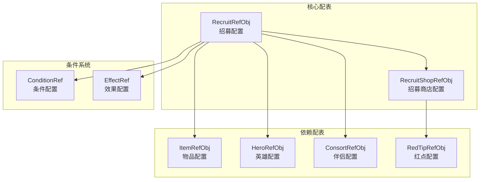
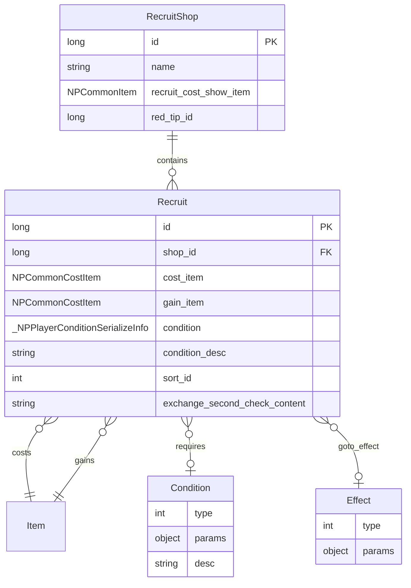
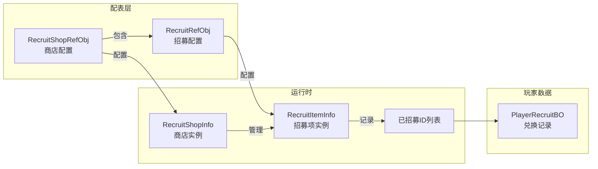
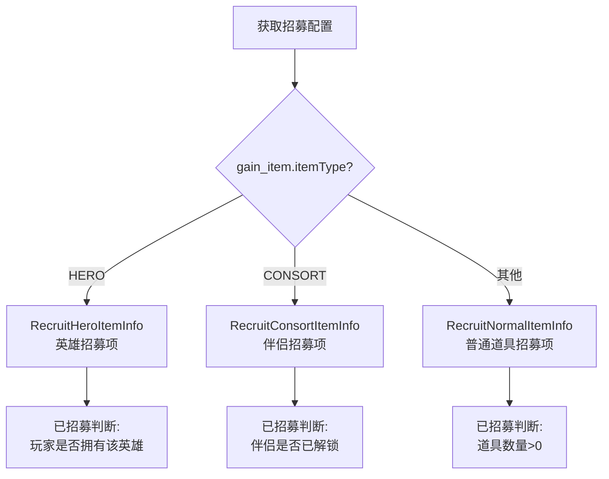
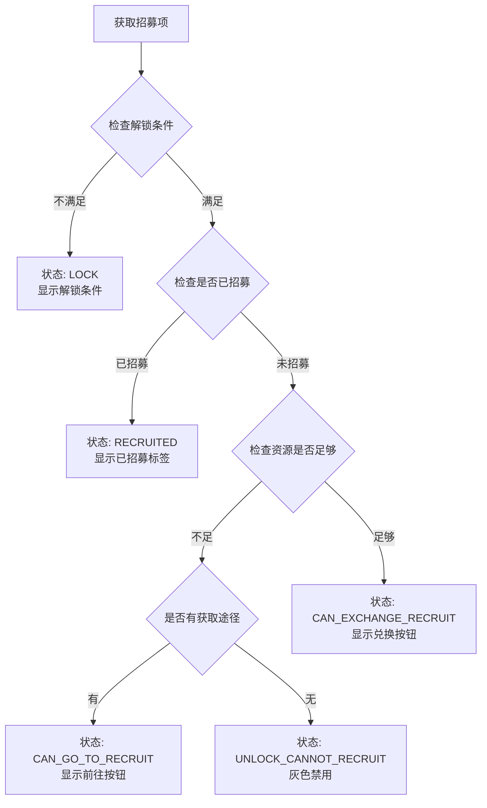
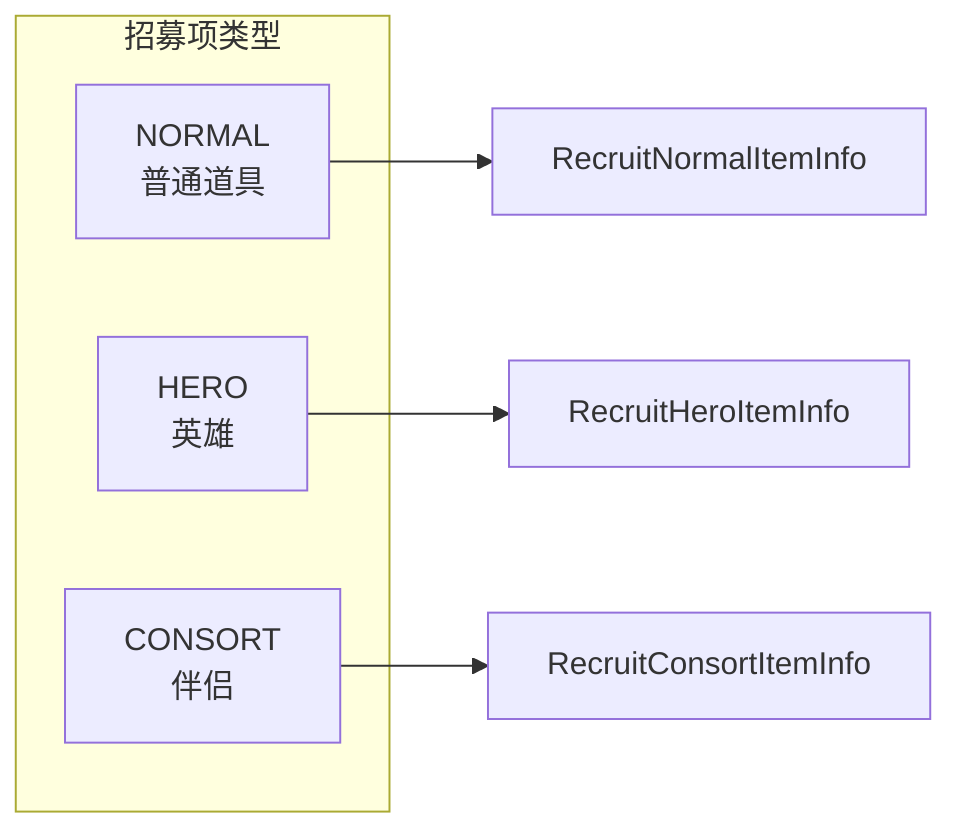
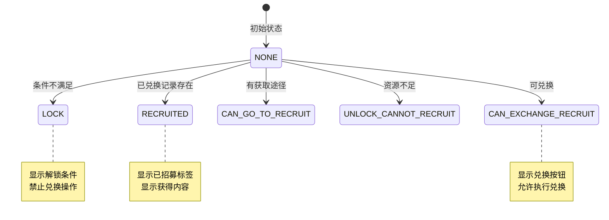
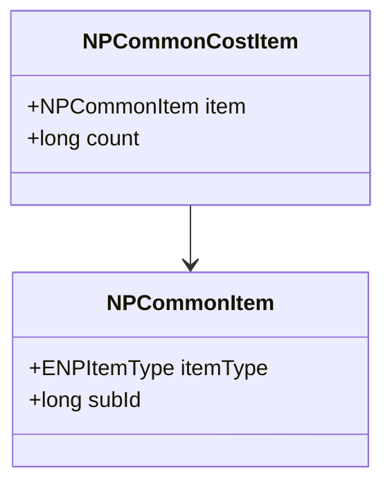
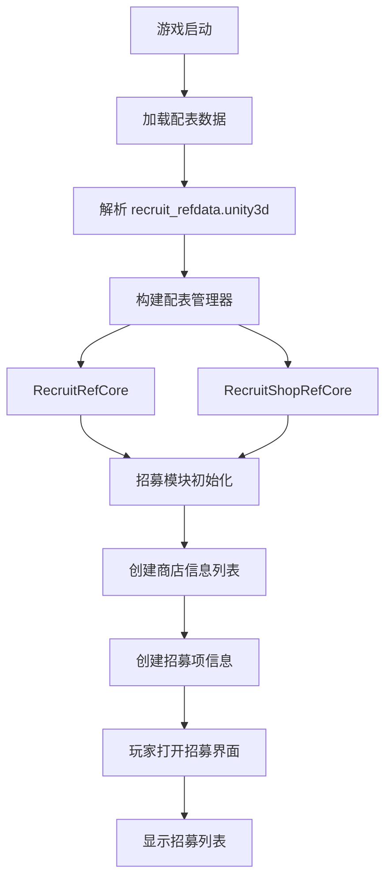
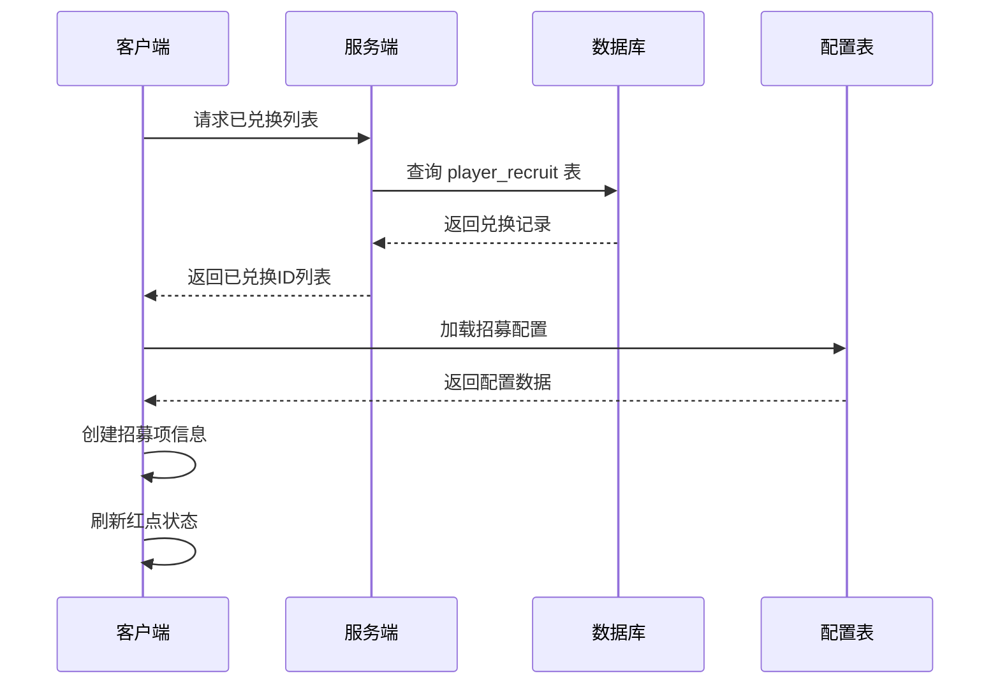

# 招募模块数据配表文档

**模块名称**: Recruit（招募模块）
**模块编号**: p002 / p007
**文档版本**: 2.0
**更新日期**: 2026-04-11

---

## 配表说明

招募模块相关的配置数据存储在 `recruit_refdata.unity3d` 资源文件中，客户端通过 `GRefdataCoreMgr` 访问配置数据。

**资源路径**: `refdata/recruit_refdata.unity3d`

### 配表依赖关系图



### 配表实体关系图



| 配表名称 | 文件名 | 说明 |
|---------|--------|------|
| RecruitRefObj | recruit_ref.json | 招募配置 |
| RecruitShopRefObj | recruit_shop_ref.json | 招募商店配置 |

---

## 一、招募配表

### 1.1 RecruitRefObj - 招募表

**文件路径**: `recruit_refdata.unity3d` -> `recruit`

**配置类**: `GSORecruitRefSet`

| 字段名 | 类型 | 说明 | 示例值 |
|--------|------|------|--------|
| id | long | 招募ID（唯一标识） | 10001 |
| shop_id | long | 所属商店ID | 1 |
| cost_item | NPCommonCostItem | 兑换消耗物品 | {itemType: BAG_ITEM, subId: 1001, count: 100} |
| gain_item | NPCommonCostItem | 获得物品 | {itemType: HERO, subId: 10001, count: 1} |
| condition | _NPPlayerConditionSerializeInfo | 兑换条件 | - |
| condition_desc | string | 兑换条件描述 | "需要通关第1章" |
| condition_desc_args_list | List\<string\> | 条件描述参数列表 | ["第1章"] |
| sort_id | int | 排序ID | 1 |
| exchange_second_check_content | string | 兑换二次确认弹窗内容 | "确定要兑换吗？" |
| can_goto_recruit_condition | _NPPlayerConditionSerializeInfo | 可前往招募的条件 | - |
| can_goto_recruit_desc | string | 可前往招募的描述 | "前往主线获取" |
| can_goto_recruit_goto_effect | _NPPlayerEffectSerializeInfo | 可前往招募的前往效果 | - |

### 1.2 招募配置示例

```json
{
  "id": 10001,
  "shop_id": 1,
  "cost_item": {
    "item": {"itemType": "BAG_ITEM", "subId": 1001},
    "count": 100
  },
  "gain_item": {
    "item": {"itemType": "HERO", "subId": 10001},
    "count": 1
  },
  "condition": {
    "type": "CHAPTER",
    "value": 1
  },
  "condition_desc": "需要通关第{0}章",
  "condition_desc_args_list": ["1"],
  "sort_id": 1,
  "exchange_second_check_content": "消耗100个英雄碎片兑换赵云，确定吗？",
  "can_goto_recruit_condition": {
    "type": "ITEM_NOT_ENOUGH",
    "itemId": 1001
  },
  "can_goto_recruit_desc": "前往主线获取英雄碎片",
  "can_goto_recruit_goto_effect": {
    "type": "GOTO_MAIN_LEVEL",
    "params": {}
  }
}
```

### 1.3 运行时方法

| 方法名 | 返回类型 | 说明 |
|--------|----------|------|
| canGotoRecruit() | bool | 是否可前往招募 |

```csharp
// 检查是否可前往招募
public bool canGotoRecruit()
{
    return can_goto_recruit_condition != null &&
           NPPlayerConditionDealerMgr.IsEnable(can_goto_recruit_condition, null);
}
```

---

## 二、招募商店配表

### 2.1 RecruitShopRefObj - 招募商店表

**文件路径**: `recruit_refdata.unity3d` -> `recruit_shop`

**配置类**: `GSORecruitShopRefSet`

| 字段名 | 类型 | 说明 | 示例值 |
|--------|------|------|--------|
| id | long | 商店ID（唯一标识） | 1 |
| name | string | 商店名称 | "英雄商店" |
| recruit_cost_show_item | NPCommonItem | 招募消耗展示物品 | {itemType: BAG_ITEM, subId: 1001} |
| red_tip_id | long | 红点ID | 1001 |

### 2.2 运行时扩展属性

| 属性名 | 类型 | 说明 |
|--------|------|------|
| recruitRefObjList | List\<RecruitRefObj\> | 商店下的招募项列表 |

### 2.3 商店配置示例

```json
{
  "id": 1,
  "name": "英雄商店",
  "recruit_cost_show_item": {
    "itemType": "BAG_ITEM",
    "subId": 1001
  },
  "red_tip_id": 1001
}
```

---

## 三、配表关系详解

### 3.1 商店与招募项关系



### 3.2 招募类型分流



### 3.3 招募状态判断流程



---

## 四、招募类型枚举

### 4.1 ERecruitItemType - 招募项类型



| 类型ID | 枚举名 | 说明 | 已招募判断 |
|--------|--------|------|-----------|
| 0 | NORMAL | 普通道具 | 道具数量 > 0 |
| 1 | HERO | 英雄 | 玩家拥有该英雄 |
| 2 | CONSORT | 伴侣 | 伴侣已解锁 |

### 4.2 ERecruitState - 招募状态



| 状态ID | 枚举名 | 说明 | UI表现 |
|--------|--------|------|--------|
| 0 | NONE | 无状态（默认） | - |
| 1 | LOCK | 锁定状态（条件未满足） | 灰色，显示条件 |
| 2 | RECRUITED | 已招募状态 | 显示"已招募"标签 |
| 3 | CAN_GO_TO_RECRUIT | 可前往招募状态 | 显示"前往"按钮 |
| 4 | UNLOCK_CANNOT_RECRUIT | 已解锁但无法招募 | 显示获取途径 |
| 5 | CAN_EXCHANGE_RECRUIT | 可兑换招募状态 | 显示"兑换"按钮 |

---

## 五、数据结构定义

### 5.1 NPCommonCostItem - 消耗物品结构



| 字段名 | 类型 | 说明 |
|--------|------|------|
| item | NPCommonItem | 物品标识 |
| count | long | 数量 |

### 5.2 NPCommonItem - 物品标识结构

| 字段名 | 类型 | 说明 |
|--------|------|------|
| itemType | ENPItemType | 物品类型 |
| subId | long | 子ID |

---

## 六、配表加载方式

### 6.1 客户端访问方式

```csharp
// 获取招募配置
RecruitRefObj recruitRef = GRefdataCoreMgr.instance.recruitRefCore.getRef(recruitId);

// 获取招募商店配置
RecruitShopRefObj shopRef = GRefdataCoreMgr.instance.recruitShopRefCore.getRef(shopId);

// 获取所有招募配置列表
List<RecruitRefObj> recruitList = GRefdataCoreMgr.instance.recruitRefCore.refList;

// 获取所有商店配置列表
List<RecruitShopRefObj> shopList = GRefdataCoreMgr.instance.recruitShopRefCore.refList;

// 获取商店下的招募项列表
List<RecruitRefObj> shopRecruitList = shopRef.recruitRefObjList;

// 遍历所有招募项
foreach (var recruitRef in GRefdataCoreMgr.instance.recruitRefCore.refList)
{
    // 根据招募ID创建招募项信息
    _ARecruitItemInfo itemInfo = _ARecruitItemInfo.getRecruitItemInfo(recruitRef);
    // 处理招募项...
}
```

### 6.2 服务端访问方式

```java
// 获取招募配置
RefRecruit recruitRef = RefRecruit.getMgr().get(recruitId);
if (recruitRef == null) {
    return CommErr.REF_NOT_FOUND;
}

// 获取所有招募配置列表
List<RefRecruit> recruitList = RefRecruit.getMgr().getAll();

// 遍历所有招募配置
for (RefRecruit ref : RefRecruit.getMgr().getAll()) {
    long shopId = ref.shop_id;
    NPCommonCostItem costItem = ref.cost_item;
    NPCommonCostItem gainItem = ref.gain_item;
    // 处理招募配置...
}
```

---

## 七、配表数据示例

### 7.1 商店配置示例

| id | name | recruit_cost_show_item | red_tip_id |
|----|------|------------------------|------------|
| 1 | 英雄商店 | {BAG_ITEM, 1001} | 1001 |
| 2 | 伴侣商店 | {BAG_ITEM, 1002} | 1002 |
| 3 | 道具商店 | {BAG_ITEM, 1003} | 1003 |
| 4 | 限时商店 | {BAG_ITEM, 1004} | 1004 |

### 7.2 招募项配置示例

| id | shop_id | cost_item | gain_item | condition | sort_id |
|----|---------|-----------|-----------|-----------|---------|
| 10001 | 1 | {BAG_ITEM, 1001, 100} | {HERO, 10001, 1} | LEVEL:10 | 1 |
| 10002 | 1 | {BAG_ITEM, 1001, 200} | {HERO, 10002, 1} | LEVEL:20 | 2 |
| 20001 | 2 | {BAG_ITEM, 1002, 150} | {CONSORT, 20001, 1} | CHAPTER:3 | 1 |
| 30001 | 3 | {BAG_ITEM, 1003, 50} | {BAG_ITEM, 5001, 10} | - | 1 |
| 40001 | 4 | {BAG_ITEM, 1004, 80} | {HERO, 10003, 1} | VIP:5 | 1 |

---

## 八、配表校验规则

### 8.1 招募配置校验

| 字段名 | 校验规则 | 异常处理 |
|--------|----------|----------|
| id | 必须唯一，范围 > 0 | 配表加载时去重 |
| shop_id | 必须关联有效商店 | 运行时检查 |
| cost_item | 必须非空 | 配表加载时校验 |
| gain_item | 必须非空 | 配表加载时校验 |
| sort_id | 范围 >= 0 | 默认 0 |

### 8.2 商店配置校验

| 字段名 | 校验规则 | 异常处理 |
|--------|----------|----------|
| id | 必须唯一，范围 > 0 | 配表加载时去重 |
| name | 长度 1-50 字符 | 配表加载时校验 |
| red_tip_id | 必须关联有效红点 | 运行时检查 |

---

## 九、配表数据流程图

### 9.1 配表加载流程



### 9.2 招募初始化流程



---

## 十、完整字段速查表

### 10.1 RecruitRefObj 完整字段

| 字段名 | 类型 | 必填 | 默认值 | 取值范围 | 说明 |
|--------|------|------|--------|----------|------|
| id | long | 是 | - | > 0 | 招募ID，唯一标识 |
| shop_id | long | 是 | - | > 0 | 所属商店ID |
| cost_item | NPCommonCostItem | 是 | - | 非空 | 兑换消耗物品 |
| gain_item | NPCommonCostItem | 是 | - | 非空 | 获得物品 |
| condition | object | 否 | null | - | 兑换条件 |
| condition_desc | string | 否 | "" | 1-200字符 | 兑换条件描述 |
| condition_desc_args_list | List\<string\> | 否 | [] | - | 条件描述参数 |
| sort_id | int | 否 | 0 | >= 0 | 排序ID |
| exchange_second_check_content | string | 否 | "" | 1-200字符 | 二次确认内容 |
| can_goto_recruit_condition | object | 否 | null | - | 前往招募条件 |
| can_goto_recruit_desc | string | 否 | "" | 1-100字符 | 前往招募描述 |
| can_goto_recruit_goto_effect | object | 否 | null | - | 前往效果 |

### 10.2 RecruitShopRefObj 完整字段

| 字段名 | 类型 | 必填 | 默认值 | 取值范围 | 说明 |
|--------|------|------|--------|----------|------|
| id | long | 是 | - | > 0 | 商店ID，唯一标识 |
| name | string | 是 | - | 1-50字符 | 商店名称 |
| recruit_cost_show_item | NPCommonItem | 否 | null | - | 消耗展示物品 |
| red_tip_id | long | 是 | - | > 0 | 红点配置ID |

---

## 十一、配表使用示例

### 11.1 检查招募状态

```csharp
/// <summary>
/// 获取招募项状态
/// </summary>
public ERecruitState GetRecruitState(_ARecruitItemInfo recruitItemInfo, bool showTip)
{
    if (recruitItemInfo == null || recruitItemInfo.recruitRefObj == null)
        return ERecruitState.NONE;

    // 1. 检查解锁条件
    if (!recruitItemInfo.hadUnlockRecruit())
    {
        if (showTip)
        {
            string desc = TextTranslate.instance.getLanguage(
                recruitItemInfo.recruitRefObj.condition_desc,
                recruitItemInfo.recruitRefObj.condition_desc_args_list
            );
            NPGUIAddSceneCenterTip.instance.showTextInfo(desc);
        }
        return ERecruitState.LOCK;
    }

    // 2. 检查是否已招募
    if (isHadRecruit(recruitItemInfo))
        return ERecruitState.RECRUITED;

    // 3. 检查是否有前往招募条件
    if (recruitItemInfo.recruitRefObj.canGotoRecruit())
        return ERecruitState.CAN_GO_TO_RECRUIT;

    // 4. 检查资源是否足够
    if (!GCommon.isItemEnough(recruitItemInfo.recruitRefObj.cost_item, showTip))
        return ERecruitState.UNLOCK_CANNOT_RECRUIT;

    // 5. 可兑换
    return ERecruitState.CAN_EXCHANGE_RECRUIT;
}
```

### 11.2 批量获取可招募项

```csharp
/// <summary>
/// 获取商店下可兑换的招募项列表
/// </summary>
public List<_ARecruitItemInfo> GetCanExchangeItems(long shopId)
{
    List<_ARecruitItemInfo> result = new List<_ARecruitItemInfo>();

    RecruitShopInfo shopInfo = NPPlayer.instance.recruitComponent.getShopInfo(shopId);
    if (shopInfo == null || shopInfo.recruitItemInfoList == null)
        return result;

    foreach (var item in shopInfo.recruitItemInfoList)
    {
        ERecruitState state = shopInfo.getRecruitState(item, false);
        if (state == ERecruitState.CAN_EXCHANGE_RECRUIT)
        {
            result.Add(item);
        }
    }

    return result;
}
```

### 11.3 检查红点状态

```csharp
/// <summary>
/// 检查商店是否有可招募项
/// </summary>
public bool HasCanExchangeItem(long shopId)
{
    RecruitShopInfo shopInfo = NPPlayer.instance.recruitComponent.getShopInfo(shopId);
    if (shopInfo == null || shopInfo.recruitItemInfoList == null)
        return false;

    foreach (var item in shopInfo.recruitItemInfoList)
    {
        // 跳过已招募的
        if (NPPlayer.instance.recruitComponent.isHadRecruit(item))
            continue;

        // 检查资源是否足够
        if (GCommon.isItemEnough(item.recruitRefObj.cost_item, false))
            return true;
    }

    return false;
}
```

---

*文档生成时间: 2026-04-11*
*源码参考路径: `/game_client/Assets/Scripts/LogicScripts/GameComponent/Recruit/`*
*源码参考路径: `/game_server/GameRes/src/NPGameRes/Refs/RefRecruit.java`*